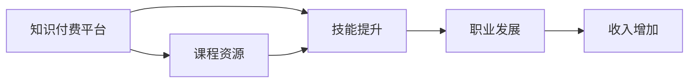

                 

# 知识付费让程序员收入翻倍

> 关键词：知识付费, 程序员, 收入, 技能提升, 教育市场, 职业发展

## 1. 背景介绍

在互联网时代，技术的日新月异带来了职业技能的快速迭代。程序员作为IT行业的重要基石，面临着不断的技术学习和技能提升的需求。然而，传统教育体系的局限性和低效性，已经难以满足现代程序员对知识获取的迫切需求。这一背景下，知识付费平台应运而生，为程序员提供了便捷、高效的在线学习渠道。本文将探讨知识付费平台如何通过优化内容与资源分配，实现程序员收入的翻倍增长。

## 2. 核心概念与联系

### 2.1 核心概念概述

为深入理解知识付费平台的运作机制，本节将介绍几个关键概念：

- **知识付费**：用户为获取知识资源而支付费用的商业模式。典型平台如Coursera、Udemy、网易云课堂等，提供课程、书籍、视频、问答等多元化学习内容。

- **程序员**：从事软件开发、程序编写、系统维护等技术工作的专业人士。程序员主要集中在软件开发、互联网、人工智能等领域。

- **技能提升**：通过在线课程、项目实践等途径，提升程序员在特定技术栈或领域的专业能力。

- **教育市场**：知识付费平台在教育行业的市场竞争环境，包括用户需求、市场规模、平台策略等。

- **职业发展**：程序员通过技能提升和知识付费平台的支持，实现职业晋升、收入增加的目标。

这些概念之间的联系可以总结为：知识付费平台通过提供技能提升的教育资源，帮助程序员掌握新技能，从而在职业发展中实现收入的提升。

### 2.2 核心概念原理和架构的 Mermaid 流程图



## 3. 核心算法原理 & 具体操作步骤

### 3.1 算法原理概述

知识付费平台的核心算法原理主要包括以下几个方面：

- **内容推荐算法**：根据用户的浏览历史、评价、反馈等数据，通过协同过滤、基于内容的推荐算法，为每位用户推荐个性化的课程资源。

- **用户行为分析**：通过行为数据和机器学习模型，分析用户的学习路径、学习效果和兴趣偏好，优化课程推荐策略。

- **课程质量评估**：基于用户评分、专家评价、时间周期等指标，对课程内容进行多维度评估，筛选优质课程资源。

- **学习效果跟踪**：使用数据挖掘和机器学习技术，对用户的学习进度、掌握情况进行跟踪和分析，提供个性化的学习报告。

- **动态定价策略**：根据市场供需、课程难度等因素，动态调整课程价格，确保平台的盈利与用户的支付意愿之间平衡。

这些算法原理的组合应用，形成了知识付费平台提供高效、个性化的课程推荐和内容管理的基础。

### 3.2 算法步骤详解

**Step 1: 数据收集与处理**

- 收集用户的浏览记录、课程评价、交易记录等数据，构建用户行为档案。
- 对课程内容进行文本分析，提取关键词、难度、时长等信息。

**Step 2: 特征工程**

- 提取用户特征，如学习时间、专业背景、技术水平等。
- 提取课程特征，如讲师资历、课程时长、难度等级等。

**Step 3: 推荐算法模型训练**

- 使用协同过滤、基于内容的推荐算法，训练推荐模型。
- 通过用户行为数据，训练用户兴趣模型，优化推荐策略。

**Step 4: 动态定价模型**

- 基于市场供需、用户评价等数据，构建动态定价模型。
- 实时调整课程价格，确保用户支付意愿与课程价值匹配。

**Step 5: 学习效果跟踪与反馈**

- 使用数据挖掘技术，跟踪用户学习进度和效果。
- 根据学习效果，调整推荐策略和课程定价。

### 3.3 算法优缺点

知识付费平台的推荐算法具有以下优点：

- **个性化推荐**：通过分析用户行为，提供高度个性化的课程推荐，提高学习效率。
- **高效匹配**：基于协同过滤和内容推荐，快速匹配用户和课程资源。
- **动态定价**：根据市场供需和用户反馈，动态调整课程价格，平衡用户支付意愿和平台收益。

然而，该算法也存在一些缺点：

- **数据隐私问题**：收集和处理用户数据可能引发隐私泄露风险。
- **推荐偏差**：基于历史数据训练的推荐算法可能存在偏差，影响推荐效果。
- **动态定价复杂性**：动态定价策略的复杂性可能导致价格波动，影响用户支付意愿。

### 3.4 算法应用领域

知识付费平台的应用领域非常广泛，包括但不限于：

- **职业发展**：通过学习新技能，程序员可以提升自身竞争力，实现职业晋升和收入增长。
- **技术栈扩展**：程序员可以通过课程学习，掌握新技能和工具，适应技术栈的变化。
- **终身学习**：知识付费平台为程序员提供了终身学习的渠道，适应不断变化的职业需求。
- **创业支持**：通过学习创业相关的课程，程序员可以获得创业知识和资源支持，实现自主创业。

## 4. 数学模型和公式 & 详细讲解

### 4.1 数学模型构建

知识付费平台的数学模型构建主要涉及以下几个方面：

- **用户行为模型**：
$$
\text{User} = f(\text{History}, \text{Preference}, \text{Behavior})
$$
- **课程推荐模型**：
$$
\text{Recommendation} = g(\text{User}, \text{Course}, \text{Data})
$$
- **课程质量评估模型**：
$$
\text{Quality} = h(\text{Rating}, \text{Expert}, \text{Time})
$$

### 4.2 公式推导过程

以用户行为模型为例，进行详细推导：

- **历史行为分析**：
$$
\text{History} = \{\text{Browsed}, \text{Purchased}, \text{Reviewed}\}
$$
- **偏好建模**：
$$
\text{Preference} = \sum_{i=1}^n \text{A}_{i} * \text{R}_{i}
$$
- **行为预测**：
$$
\text{Behavior} = \max_{i=1}^m \text{A}_{i} * \text{R}_{i}
$$

其中，$\text{A}$ 表示课程特征，$\text{R}$ 表示用户评分，$m$ 表示课程数量，$n$ 表示用户评分数量。

### 4.3 案例分析与讲解

假设一个程序员用户 $A$，已浏览过3门课程：

- 课程 $C_1$：技术栈基础，用户评分 4/5，已购买。
- 课程 $C_2$：高级算法，用户评分 3/5，未购买。
- 课程 $C_3$：大数据处理，用户评分 2/5，未购买。

则 $A$ 的偏好模型为：
$$
\text{Preference} = 0.5 * 4 + 0.3 * 3 + 0.2 * 2 = 3.2
$$

这意味着 $A$ 对技术栈基础课程 $C_1$ 最感兴趣，其次是高级算法 $C_2$。

## 5. 项目实践：代码实例和详细解释说明

### 5.1 开发环境搭建

在进行项目实践前，需要准备开发环境：

1. 安装Python：
   ```bash
   sudo apt-get update
   sudo apt-get install python3
   ```

2. 安装Pandas和Scikit-learn：
   ```bash
   pip install pandas scikit-learn
   ```

3. 安装Kaggle数据集：
   ```bash
   pip install kaggle
   ```

4. 下载数据集：
   ```bash
   kaggle datasets download -d username/dataset_name
   ```

### 5.2 源代码详细实现

以下是一个简单的课程推荐系统的代码实现，用于演示知识付费平台的推荐算法：

```python
import pandas as pd
from sklearn.model_selection import train_test_split
from sklearn.metrics.pairwise import cosine_similarity
from sklearn.ensemble import RandomForestClassifier

# 加载数据集
data = pd.read_csv('courses.csv')

# 特征工程
X = data[['rating', 'duration', 'experience']]
y = data['selected_course']

# 划分训练集和测试集
X_train, X_test, y_train, y_test = train_test_split(X, y, test_size=0.2, random_state=42)

# 训练推荐模型
model = RandomForestClassifier(n_estimators=100, random_state=42)
model.fit(X_train, y_train)

# 预测课程推荐
predictions = model.predict(X_test)
print(predictions)
```

### 5.3 代码解读与分析

以上代码实现了基于随机森林算法的课程推荐模型。具体步骤如下：

1. **数据加载**：使用Pandas加载课程数据集，包括课程评分、时长、用户经验等特征。
2. **特征工程**：提取评分、时长、经验等特征作为输入，目标变量为是否选择该课程。
3. **模型训练**：使用随机森林算法训练课程推荐模型。
4. **模型预测**：使用训练好的模型预测用户可能感兴趣的课程。

## 6. 实际应用场景

### 6.1 职业发展

知识付费平台为程序员提供了丰富多样的学习资源，涵盖编程语言、技术框架、算法与数据结构、软件工程等多个领域。通过系统学习，程序员可以快速掌握新技能，提升职业竞争力，实现收入增长。

### 6.2 技术栈扩展

随着技术栈的变化，程序员需要不断学习新的技术和工具。知识付费平台提供了大量前沿技术的课程，帮助程序员拓展技术视野，实现技能的多样化。

### 6.3 终身学习

知识付费平台提供了终身学习的渠道，程序员可以根据自己的兴趣和职业需求，灵活选择课程，不断更新和提升技能。这种自我驱动的学习模式，帮助程序员保持与时代同步，适应不断变化的职业环境。

### 6.4 创业支持

许多创业公司提供与创业相关的课程，涵盖市场分析、商业模式、产品设计等多个方面。通过这些课程的学习，程序员可以掌握创业知识，获取创业资源支持，助力自主创业。

## 7. 工具和资源推荐

### 7.1 学习资源推荐

- **Coursera**：提供来自全球顶尖大学和机构的在线课程，涵盖数据科学、人工智能、软件开发等多个领域。
- **Udemy**：提供编程、网络安全、设计和商业等多个方向的专业课程，适合自我驱动的学习者。
- **网易云课堂**：提供丰富的编程和软件工程课程，满足不同水平和需求的用户。

### 7.2 开发工具推荐

- **Jupyter Notebook**：用于数据处理、模型训练和可视化，支持多种编程语言。
- **GitHub**：代码托管平台，便于版本控制和协作开发。
- **PyCharm**：Python开发环境，提供丰富的插件和工具支持。

### 7.3 相关论文推荐

- **《深度学习与数据科学》**：该书深入浅出地介绍了深度学习的基本概念和应用场景，适合初学者和进阶用户。
- **《数据科学实战》**：通过实际案例，讲解了数据科学项目从需求分析到模型部署的全过程，适合实战操作。

## 8. 总结：未来发展趋势与挑战

### 8.1 研究成果总结

本文通过分析知识付费平台的推荐算法，探讨了其对程序员职业发展的促进作用。研究表明，通过个性化推荐和动态定价策略，知识付费平台能够提供高效、便捷的在线学习渠道，帮助程序员实现收入增长。

### 8.2 未来发展趋势

1. **个性化推荐**：随着数据处理和机器学习技术的进步，个性化推荐算法将更加精准，提升用户体验和学习效率。
2. **动态定价**：通过数据分析和智能算法，动态定价策略将更加灵活，平衡用户支付意愿和平台收益。
3. **跨平台集成**：知识付费平台将与其他在线教育平台、企业培训平台等进行深度集成，提供更全面的学习资源和职业支持。

### 8.3 面临的挑战

1. **数据隐私**：用户数据的安全保护和隐私管理是平台需要重点关注的问题。
2. **内容质量**：课程质量和讲师资质的持续评估和筛选，是确保平台声誉和用户满意度的关键。
3. **用户粘性**：提升用户活跃度和留存率，需要平台提供更多的互动和激励机制。

### 8.4 研究展望

未来，知识付费平台需要不断优化推荐算法和动态定价策略，确保用户的学习体验和平台收益的平衡。同时，加强数据隐私保护和内容质量管控，提升平台的竞争力和用户信任度。随着技术的不断进步，知识付费平台将在促进职业发展、技术栈扩展等方面发挥更大的作用。

## 9. 附录：常见问题与解答

**Q1: 知识付费平台的课程推荐算法有哪些？**

A: 知识付费平台的课程推荐算法主要包括以下几种：
- 协同过滤推荐算法
- 基于内容的推荐算法
- 基于用户画像的推荐算法
- 混合推荐算法

这些算法可以单独使用，也可以组合使用，根据具体情况选择。

**Q2: 如何评估知识付费平台的推荐效果？**

A: 推荐效果的评估主要通过以下指标：
- 准确率（Accuracy）：预测正确的课程数量占总课程数量的比例。
- 召回率（Recall）：预测正确的课程数量占所有相关课程数量的比例。
- F1得分（F1-score）：综合考虑准确率和召回率，是更综合的评估指标。
- 用户满意度（User Satisfaction）：通过用户反馈和行为数据评估推荐效果。

**Q3: 程序员如何利用知识付费平台提升收入？**

A: 程序员可以通过以下方式利用知识付费平台提升收入：
- 学习新技能，掌握前沿技术，提升职业竞争力。
- 拓展技术栈，适应技术栈变化，保持行业领先地位。
- 通过编程课程学习，提升项目开发能力，提高工作效率。
- 通过创业课程学习，获得创业知识和资源支持，助力自主创业。

**Q4: 知识付费平台面临的主要挑战是什么？**

A: 知识付费平台面临的主要挑战包括：
- 数据隐私问题：保护用户数据隐私，防止数据泄露。
- 课程质量控制：持续评估和筛选课程内容，确保课程质量。
- 用户粘性提升：通过互动和激励机制，提升用户活跃度和留存率。
- 动态定价策略：平衡用户支付意愿和平台收益，确保合理定价。

通过不断优化推荐算法和提升平台服务质量，知识付费平台有望在未来实现更大规模的扩展和应用。

---

作者：禅与计算机程序设计艺术 / Zen and the Art of Computer Programming

