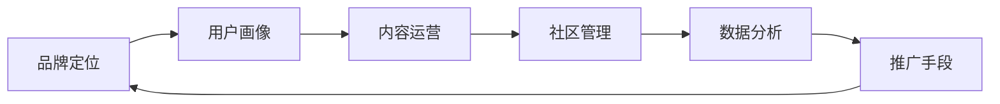

                 

# 知识付费赚钱的品牌品牌运营与品牌推广策略

## 1. 背景介绍

### 1.1 问题由来
近年来，知识付费市场迅速崛起，越来越多的知识付费平台出现，诸如得到、喜马拉雅、知乎、腾讯课堂等。这些平台以专业知识的付费订阅为主要商业模式，通过高质量的课程内容吸引用户，以实现知识变现和品牌推广。品牌运营与推广策略在知识付费市场的重要性日益凸显。

### 1.2 问题核心关键点
品牌运营与推广策略的核心在于通过精准定位、优质内容、用户互动和数据反馈，实现品牌价值的最大化。具体包括以下几个关键点：
- **精准定位**：明确品牌的目标用户群体，制定符合用户需求的品牌定位。
- **优质内容**：打造高质量的内容，提升用户的付费意愿和满意度。
- **用户互动**：建立积极的用户社区，增强用户粘性和参与度。
- **数据反馈**：利用大数据和AI技术，精准分析用户行为和需求，不断优化品牌策略。

### 1.3 问题研究意义
研究品牌运营与推广策略，对于提升知识付费平台的品牌影响力和用户粘性，推动知识付费行业健康发展，具有重要意义。具体包括以下几个方面：
- **提升用户满意度**：通过高质量内容和精准运营，提升用户满意度和忠诚度。
- **提高盈利能力**：精准定位用户群体，优化产品和服务，实现更高的付费转化率和收益。
- **增强品牌影响力**：通过有效推广策略，提升品牌知名度和美誉度。
- **促进行业发展**：带动整个知识付费行业的创新和进步，推动知识经济的繁荣。

## 2. 核心概念与联系

### 2.1 核心概念概述
品牌运营与推广策略的核心概念包括：
- **品牌定位**：确定品牌的核心价值和市场定位。
- **用户画像**：刻画目标用户的特征和需求。
- **内容运营**：策划、生产、推广和优化内容，提升用户体验和满意度。
- **社区管理**：建设和管理用户社区，促进用户互动和反馈。
- **数据分析**：收集和分析用户数据，制定精准的市场策略。
- **推广手段**：选择有效的推广渠道和手段，提升品牌曝光和用户转化。

### 2.2 核心概念原理和架构的 Mermaid 流程图


## 3. 核心算法原理 & 具体操作步骤

### 3.1 算法原理概述
品牌运营与推广策略的算法原理主要基于市场分析和用户行为建模，通过量化和模型优化，实现品牌推广的目标。

### 3.2 算法步骤详解
1. **市场调研**：利用问卷调查、市场分析报告等手段，获取用户需求和市场竞争状况。
2. **用户画像构建**：通过数据分析工具，如Google Analytics、Adobe Analytics等，收集用户行为数据，构建用户画像。
3. **内容规划与生产**：根据用户画像和市场需求，策划和生产高质量的内容，如课程、文章、视频等。
4. **社区互动管理**：建立在线社区或论坛，定期举办线上活动，增强用户粘性和参与度。
5. **数据分析与优化**：利用数据挖掘和机器学习技术，分析用户反馈和行为数据，不断优化内容和运营策略。
6. **推广渠道选择与优化**：选择有效的推广渠道，如社交媒体、搜索引擎、邮件营销等，并利用A/B测试和转化率优化（A/B testing and conversion rate optimization, CRO），提升推广效果。

### 3.3 算法优缺点
#### 优点
- **数据驱动决策**：利用大数据分析，可以精准制定品牌策略，提高决策的科学性和有效性。
- **多渠道推广**：通过多种渠道进行品牌推广，提升品牌曝光和用户转化。
- **用户互动增强**：通过社区管理和互动，提升用户粘性和忠诚度。

#### 缺点
- **数据隐私问题**：用户数据的收集和使用可能引发隐私保护问题。
- **技术复杂性**：数据分析和内容优化需要较高的技术水平，对团队要求较高。
- **成本投入**：高质量内容生产和高频次推广需要较大的投入。

### 3.4 算法应用领域
品牌运营与推广策略在知识付费、在线教育、健康医疗、金融理财等领域均有广泛应用。以下以知识付费平台为例，具体说明其应用：

## 4. 数学模型和公式 & 详细讲解

### 4.1 数学模型构建
品牌运营与推广策略的数学模型主要包括以下几个方面：
- **用户满意度模型**：通过问卷调查和反馈分析，构建用户满意度评分模型。
- **用户转化率模型**：利用A/B测试数据，建立用户转化率预测模型。
- **内容推荐模型**：通过协同过滤和推荐系统算法，提升内容推荐的精准度。

### 4.2 公式推导过程
以用户满意度模型为例，设用户对课程的满意度为 $S$，包括课程质量、互动体验和平台服务等。通过问卷调查得到用户对各项指标的评分 $x_1, x_2, ..., x_n$，构建线性回归模型：
$$
S = \beta_0 + \sum_{i=1}^n \beta_i x_i + \epsilon
$$
其中 $\beta_0$ 为截距，$\beta_i$ 为第 $i$ 项指标的系数，$\epsilon$ 为误差项。通过最小二乘法求解 $\beta_0, \beta_i$，可以得到用户满意度的预测模型。

### 4.3 案例分析与讲解
假设某知识付费平台收集了1000名用户对课程的满意度评分数据，包括课程质量评分 $x_1$、互动体验评分 $x_2$ 和平台服务评分 $x_3$。通过最小二乘法求解得到用户满意度的线性回归模型为：
$$
S = 0.5 + 0.8x_1 + 0.7x_2 + 0.6x_3
$$
代入100名新用户的评分数据，可以预测其满意度，从而优化内容和运营策略。

## 5. 项目实践：代码实例和详细解释说明

### 5.1 开发环境搭建
开发环境包括Python环境、R环境、SQL数据库、Web服务器等。

### 5.2 源代码详细实现
假设使用Python进行数据分析和模型构建，代码示例如下：

```python
import pandas as pd
from sklearn.linear_model import LinearRegression

# 读取用户满意度数据
df = pd.read_csv('user_satisfaction.csv')

# 定义用户满意度模型
X = df[['x1', 'x2', 'x3']]
y = df['score']
model = LinearRegression()
model.fit(X, y)

# 预测新用户满意度
new_data = pd.DataFrame({ 'x1': [8, 9, 10], 'x2': [8, 9, 10], 'x3': [8, 9, 10] })
predictions = model.predict(new_data)
print(predictions)
```

### 5.3 代码解读与分析
上述代码实现了一个简单的用户满意度预测模型，通过线性回归算法，可以根据用户对课程质量、互动体验和平台服务的评分，预测其满意度。

## 6. 实际应用场景

### 6.1 知识付费平台
知识付费平台可以通过用户满意度模型，分析用户对课程的反馈，优化课程内容和教学方法，提升用户满意度。同时，可以利用用户转化率模型，分析用户购买行为，制定精准的推广策略，提升转化率。

### 6.2 在线教育
在线教育平台可以通过用户画像构建和社区管理，提升用户粘性和参与度。利用内容推荐模型，推荐符合用户兴趣和学习需求的内容，提高学习效果。

### 6.3 健康医疗
健康医疗平台可以通过用户数据分析，优化诊疗方案和健康管理计划，提升用户体验。同时，可以通过社区互动管理，增强用户健康意识和自我管理能力。

## 7. 工具和资源推荐

### 7.1 学习资源推荐
- **《营销数据分析》**：讲解数据分析的基本方法和工具，如SPSS、R语言等。
- **《用户研究》**：详细介绍了用户画像的构建方法和用户行为分析。
- **《推荐系统》**：介绍协同过滤、内容推荐系统等推荐算法。
- **《社交媒体营销》**：讲解社交媒体推广策略和数据分析方法。

### 7.2 开发工具推荐
- **Python**：广泛用于数据处理和模型构建，具备丰富的数据分析和机器学习库。
- **R语言**：数据统计分析的首选工具，具备强大的数据可视化和统计建模能力。
- **SQL数据库**：用于存储和处理结构化数据，支持高效的数据查询和分析。
- **Web服务器**：如Apache、Nginx等，用于搭建Web应用，支持实时数据分析和展示。

### 7.3 相关论文推荐
- **《知识付费平台的用户行为分析与模型构建》**：详细介绍了用户行为数据的采集和分析方法。
- **《推荐系统在知识付费平台中的应用》**：探讨了推荐系统在知识付费平台中的应用和优化策略。
- **《社交媒体数据分析与用户互动管理》**：介绍了社交媒体平台的数据分析和用户互动管理方法。

## 8. 总结：未来发展趋势与挑战

### 8.1 研究成果总结
品牌运营与推广策略的研究已经取得显著成果，主要体现在以下几个方面：
- 用户满意度的量化和预测模型已经较为成熟，可以应用于知识付费平台和在线教育等场景。
- 推荐系统的应用已经较为广泛，可以提升内容推荐的精准度，增强用户体验。
- 社区管理和数据分析方法已经较为成熟，可以提升用户粘性和参与度。

### 8.2 未来发展趋势
未来的品牌运营与推广策略将呈现以下几个趋势：
- **AI和大数据的应用**：利用AI和大数据技术，实现更精准的用户画像构建和内容推荐。
- **多渠道整合**：通过整合多种推广渠道，提升品牌曝光和用户转化。
- **用户体验优化**：通过用户数据分析，优化内容和运营策略，提升用户体验和满意度。
- **社区互动增强**：建设和管理积极的用户社区，增强用户粘性和参与度。

### 8.3 面临的挑战
品牌运营与推广策略在发展过程中也面临以下挑战：
- **数据隐私和安全**：用户数据的收集和使用可能引发隐私保护问题，需要加强数据安全管理。
- **技术复杂性**：数据分析和内容优化需要较高的技术水平，对团队要求较高。
- **成本投入**：高质量内容生产和高频次推广需要较大的投入。
- **用户体验差异**：不同用户群体的需求差异较大，需要制定差异化的运营策略。

### 8.4 研究展望
未来的研究需要在以下几个方面寻求新的突破：
- **用户行为预测**：利用深度学习和大数据技术，提升用户行为预测的准确性。
- **内容个性化推荐**：通过推荐算法，提升内容推荐的精准度和用户满意度。
- **社区互动优化**：利用自然语言处理和情感分析技术，优化社区互动和用户反馈。
- **多模态数据融合**：利用多模态数据融合技术，提升用户画像和行为分析的全面性和准确性。

## 9. 附录：常见问题与解答

**Q1：品牌运营与推广策略是否适用于所有企业？**

A: 品牌运营与推广策略适用于大多数企业，尤其是具有线上业务和用户互动需求的企业。不同行业的企业可以根据自身特点，制定符合自身需求的品牌运营与推广策略。

**Q2：如何衡量品牌运营与推广策略的效果？**

A: 品牌运营与推广策略的效果可以通过多种指标进行衡量，如用户满意度、用户转化率、品牌知名度、社区活跃度等。利用数据收集和分析工具，可以量化这些指标，从而评估品牌运营与推广策略的效果。

**Q3：品牌运营与推广策略在落地实施中需要注意哪些问题？**

A: 品牌运营与推广策略在落地实施中需要注意以下几个问题：
- **数据隐私保护**：确保用户数据的合法收集和使用，遵守相关法律法规。
- **技术适配性**：选择合适的技术和工具，确保品牌运营与推广策略的实施效率和效果。
- **用户体验优化**：通过用户数据分析，不断优化内容和运营策略，提升用户体验。
- **社区互动管理**：建立和管理积极的用户社区，增强用户粘性和参与度。

**Q4：品牌运营与推广策略的未来发展方向是什么？**

A: 品牌运营与推广策略的未来发展方向包括：
- **AI和大数据的应用**：利用AI和大数据技术，实现更精准的用户画像构建和内容推荐。
- **多渠道整合**：通过整合多种推广渠道，提升品牌曝光和用户转化。
- **用户体验优化**：通过用户数据分析，优化内容和运营策略，提升用户体验和满意度。
- **社区互动增强**：建设和管理积极的用户社区，增强用户粘性和参与度。

---

作者：禅与计算机程序设计艺术 / Zen and the Art of Computer Programming

