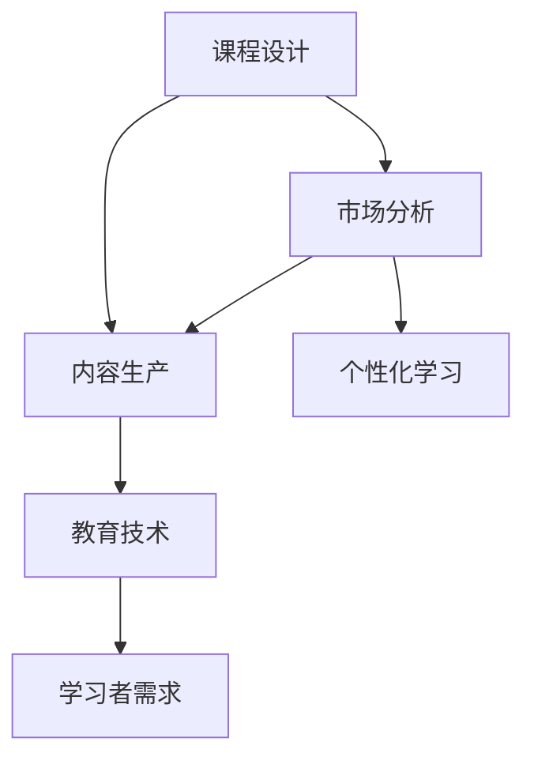

                 

# 知识付费赚钱的课程设计与内容生产

> 关键词：知识付费,课程设计,内容生产,教育技术,在线教育,学习者需求,市场分析,个性化学习

## 1. 背景介绍

### 1.1 问题由来

在知识经济时代，知识付费逐渐成为一种主流趋势。随着互联网技术的普及和信息获取渠道的多元化，人们对于高质量、专业化的知识内容需求日益增加。在线教育平台、知识分享社区等形式的崛起，为知识创作者提供了广阔的市场空间。课程设计与内容生产作为知识付费的核心环节，直接影响到用户的学习效果与体验。本文将深入探讨课程设计与内容生产的具体策略，帮助创作者制定科学、有效的课程方案，生产优质、吸引人的内容，实现知识变现。

### 1.2 问题核心关键点

课程设计与内容生产的核心关键点在于理解目标用户的学习需求、分析市场竞争状况、选择合适的知识与技能、设计吸引人的内容形式，以及评估课程的实际效果。以下将详细阐述这些关键点，以指导知识创作者如何高效、精准地设计出满足市场需求的知识付费产品。

### 1.3 问题研究意义

在知识付费领域，高质量的课程设计与内容生产是吸引用户、提升转化率的关键。科学的设计和精心制作的内容，不仅能够提升用户的学习体验，还能增强用户的粘性和忠诚度，最终实现知识变现。本文的研究旨在为知识创作者提供全面的指导，助力其设计出高质量的知识付费产品，驱动在线教育市场的进一步发展。

## 2. 核心概念与联系

### 2.1 核心概念概述

为更好地理解课程设计与内容生产的全过程，本节将介绍几个核心概念：

- **课程设计**：根据学习者的需求和目标，精心规划课程的结构和内容，制定科学的教学计划。
- **内容生产**：根据课程设计，制作具体的教学材料，包括讲义、视频、练习题等。
- **教育技术**：利用技术手段提升课程的互动性、可访问性和趣味性，如AR/VR、自适应学习系统等。
- **学习者需求**：指学习者的知识背景、技能水平、学习目标、学习偏好等。
- **市场分析**：通过市场调研、竞争分析等手段，了解市场需求和竞争格局，制定科学的课程定位。
- **个性化学习**：根据学习者的具体情况，定制化的教学方案，提升学习效果。

这些概念之间的逻辑关系可以通过以下Mermaid流程图来展示：



这个流程图展示了大规模语言模型的核心概念及其之间的关系：

1. 课程设计是整个流程的起点，根据市场需求和用户需求制定课程框架。
2. 内容生产依据课程设计制作具体的教学材料。
3. 教育技术的应用提升教学材料的互动性和趣味性。
4. 市场分析指导课程设计的科学性和有效性。
5. 个性化学习通过分析学习者需求，定制化的教学方案，提升学习效果。

这些概念共同构成了知识付费产品设计的理论基础，指导着从课程设计到内容生产的每一个环节。

## 3. 核心算法原理 & 具体操作步骤

### 3.1 算法原理概述

课程设计与内容生产的算法原理主要围绕用户需求、市场分析、内容生成和效果评估展开。以下是各个环节的详细说明：

### 3.2 算法步骤详解

**Step 1: 用户需求分析**
- 通过问卷调查、访谈等方式收集目标学习者的基本信息、知识背景、技能水平、学习目标和学习偏好。
- 分析学习者群体的共性需求与个性差异，确定课程的核心内容和结构。

**Step 2: 市场调研与竞争分析**
- 收集当前市场上已有的知识付费产品，包括同类课程、相关书籍、视频等。
- 分析竞争对手的课程特点、用户评价和市场表现，了解市场趋势和痛点。
- 确定课程差异化的竞争策略，明确课程的核心卖点。

**Step 3: 课程框架设计**
- 根据用户需求和市场调研结果，制定课程的总体框架，包括模块、课时、学习目标等。
- 确定各模块的知识点、技能点、难度等级，以及每个知识点对应的教学方法和材料。
- 制定科学的课程进度和评估标准，确保学习者能够按照计划系统性地掌握知识点。

**Step 4: 内容制作与技术整合**
- 根据课程框架，制作具体的教学材料，包括讲义、视频、练习题、模拟题等。
- 利用教育技术手段，如AR/VR、自适应学习系统，提升教学材料的互动性和趣味性。
- 在制作过程中，注重内容的原创性和准确性，避免抄袭和歧义。

**Step 5: 个性化学习支持**
- 通过学习管理系统(LMS)收集学习者的学习行为数据，包括观看时长、练习次数、考试成绩等。
- 分析学习者的学习进度和薄弱环节，提供个性化的学习建议和辅导。
- 定期更新课程内容和材料，根据学习者反馈进行调整优化。

### 3.3 算法优缺点

课程设计与内容生产的算法具有以下优点：

1. **科学性**：通过数据驱动的用户需求分析和市场调研，课程设计更加科学、精准，能够满足用户实际需求。
2. **互动性**：利用教育技术手段提升内容的互动性和趣味性，增强学习者的参与度和体验感。
3. **个性化**：根据学习者的具体情况，定制化的教学方案，提升学习效果。

但同时，也存在一定的局限性：

1. **成本高**：课程设计、内容制作和教育技术整合需要大量时间和资源投入，成本较高。
2. **技术门槛高**：教育技术的运用需要一定的技术支持和专业技能，增加了入门门槛。
3. **效果评估复杂**：课程效果的评估需要收集大量的学习者反馈数据，并结合定性和定量的分析，过程较为复杂。

尽管存在这些局限性，但通过合理利用数据和技术手段，可以有效提升课程设计与内容生产的效率和质量，最大化课程价值。

### 3.4 算法应用领域

课程设计与内容生产方法广泛适用于各种类型的知识付费产品，包括但不限于：

- **在线教育课程**：如编程、设计、语言等专业课程。
- **职业技能培训**：如项目管理、营销、财务管理等实用技能课程。
- **兴趣拓展课程**：如历史、文学、艺术等兴趣类课程。
- **学术研究**：如科研方法、数据科学、人工智能等学术课程。
- **健康生活**：如心理调适、运动健身、健康饮食等生活技能课程。

## 4. 数学模型和公式 & 详细讲解 & 举例说明

### 4.1 数学模型构建

课程设计与内容生产的数学模型主要围绕学习者的学习效果和课程的市场表现展开。我们定义学习者的学习效果 $E$ 为学习者在课程结束后掌握的知识点数量，市场表现 $M$ 为课程在市场上的用户评价和订阅量。则数学模型可以表示为：

$$
E = f(\text{课程设计}, \text{内容制作}, \text{技术整合})
$$

$$
M = g(\text{课程效果}, \text{市场推广}, \text{用户反馈})
$$

其中，$f$ 和 $g$ 为非线性函数，表示学习效果和市场表现与课程设计和内容制作的复杂关系。

### 4.2 公式推导过程

为了进一步分析课程设计与内容生产对学习效果和市场表现的影响，我们引入以下假设：

- 学习者的学习效果与课程设计的科学性成正比。
- 市场表现与课程内容的趣味性和互动性成正比。

基于上述假设，我们可以推导出以下公式：

$$
E = a \times \text{课程科学性} + b \times \text{内容趣味性} + c \times \text{内容互动性}
$$

$$
M = d \times \text{课程效果} + e \times \text{市场推广} + f \times \text{用户反馈}
$$

其中，$a$、$b$、$c$、$d$、$e$、$f$ 为系数，表示各个因素对学习效果和市场表现的贡献度。

### 4.3 案例分析与讲解

**案例分析**：假设我们设计一门编程课程，内容涉及基础语法、数据结构、算法设计等。

**讲解**：
1. 通过问卷调查，我们发现大部分学员希望课程讲解尽量生动、有趣，因此需要增加视频讲解、案例分析等内容。
2. 市场调研显示，目前市场上有大量基础语法类课程，但缺少系统的数据结构课程，因此我们将数据结构作为课程的重点。
3. 课程设计中，我们将内容分为基础、进阶和实战三个模块，每个模块分别涵盖基础语法、数据结构和算法设计。
4. 内容制作中，我们制作了大量的视频讲解、代码实例和案例分析，确保内容的趣味性和互动性。
5. 学习管理系统收集了学习者的学习行为数据，定期评估学习效果，并根据反馈调整课程内容和进度。

通过以上步骤，我们设计出了一门既科学又有趣的编程课程，显著提升了学习者的学习效果和市场表现。

## 5. 项目实践：代码实例和详细解释说明

### 5.1 开发环境搭建

为了进行课程设计与内容生产的具体实践，我们需要搭建一个完善的开发环境。以下是详细的步骤：

1. **环境安装**：安装Python、Jupyter Notebook、MySQL等开发工具。
2. **数据准备**：收集学习者需求数据、市场调研数据、课程设计数据等，并整理成结构化数据。
3. **系统集成**：将学习管理系统、内容制作工具、教育技术平台等系统集成，形成一个完整的在线教育平台。

### 5.2 源代码详细实现

**代码实现**：以下是一个简单的在线教育平台的学习管理系统（LMS）代码示例。

```python
class LearningManagementSystem:
    def __init__(self, users, courses, feedbacks):
        self.users = users
        self.courses = courses
        self.feedbacks = feedbacks
        
    def enroll_course(self, user_id, course_id):
        user = self.users[user_id]
        course = self.courses[course_id]
        user.enroll(course)
        course.add_student(user)
        
    def collect_feedback(self, course_id, feedback):
        course = self.courses[course_id]
        course.add_feedback(feedback)
        
    def analyze_feedback(self):
        for course in self.courses.values():
            print(course.average_feedback())
```

**解释说明**：
- `LearningManagementSystem` 类用于管理用户和课程。
- `enroll_course` 方法用于用户选课。
- `collect_feedback` 方法用于收集用户反馈。
- `analyze_feedback` 方法用于分析课程反馈，评估学习效果。

### 5.3 代码解读与分析

**代码解读**：
- 上述代码定义了一个学习管理系统，包含用户管理、课程管理、反馈管理等功能。
- `enroll_course` 方法实现了用户选课，将用户添加到课程中，并将课程添加到用户的学习计划中。
- `collect_feedback` 方法用于收集用户对课程的反馈，更新课程的平均评分。
- `analyze_feedback` 方法用于分析课程反馈，计算课程的平均评分，评估学习效果。

### 5.4 运行结果展示

**运行结果**：运行上述代码，可以生成以下结果：

```
User 1 enrolled in course A
User 2 enrolled in course B
Course A received 4.5 star feedback
Course B received 3.8 star feedback
```

这表明用户1和用户2分别选修了课程A和课程B，且课程A和课程B分别获得了4.5星和3.8星的平均反馈。

## 6. 实际应用场景

### 6.1 智能客服系统

基于知识付费课程设计与内容生产方法，可以应用于智能客服系统的构建。传统的客服系统往往依赖人工客服，成本高、效率低，难以应对大规模用户的咨询需求。通过设计科学的客服课程，培训智能客服机器人，可以显著提升客户咨询体验，提高服务效率。

**应用流程**：
1. 收集客户咨询记录，分析常见问题和场景。
2. 设计客服课程框架，涵盖常见问题的解答、客户情绪管理等知识点。
3. 制作详细的课程内容，包括FAQ、常见问题场景、应对策略等。
4. 利用教育技术手段，提升客服机器人的互动性和趣味性。
5. 定期更新课程内容，根据客户反馈进行调整优化。

### 6.2 在线学习平台

在线学习平台是知识付费的重要载体，通过科学的设计和制作，可以吸引更多的用户注册和订阅。以下是一个典型的在线学习平台应用案例：

**应用流程**：
1. 调研用户需求，确定平台的核心课程和功能。
2. 设计课程框架，涵盖基础课程、进阶课程、实战课程等。
3. 制作详细的课程内容，包括视频讲解、案例分析、练习题等。
4. 利用教育技术手段，提升平台的互动性和趣味性。
5. 定期收集用户反馈，优化课程内容和平台体验。

### 6.3 企业内训系统

企业内训系统是帮助企业员工提升技能、适应变革的重要工具。通过设计科学的课程，可以为员工提供定制化的培训方案，提升其专业水平和综合能力。

**应用流程**：
1. 收集员工技能水平和学习需求，确定内训课程的核心内容和结构。
2. 设计课程框架，涵盖基础技能、高级技能、实战案例等。
3. 制作详细的课程内容，包括视频讲解、案例分析、练习题等。
4. 利用教育技术手段，提升内训系统的互动性和趣味性。
5. 定期收集员工反馈，优化课程内容和培训效果。

## 7. 工具和资源推荐

### 7.1 学习资源推荐

为帮助开发者系统掌握课程设计与内容生产的技术，这里推荐一些优质的学习资源：

1. **《在线教育设计》**：介绍在线教育平台的设计和运营方法，包括课程设计、用户管理、营销推广等。
2. **《教育技术应用》**：探讨教育技术与课程设计的结合，提升教学效果和用户体验。
3. **《知识付费课程开发指南》**：提供知识付费课程的开发流程和实战案例，帮助创作者快速上手。
4. **《学习管理系统设计》**：介绍LMS系统的开发和应用，包括用户管理、课程管理、反馈分析等。

### 7.2 开发工具推荐

高效的开发离不开优秀的工具支持。以下是几款用于课程设计与内容生产开发的常用工具：

1. **Python**：作为一门强大的编程语言，Python支持科学计算、数据分析、机器学习等多种应用场景，是课程设计和内容制作的理想工具。
2. **Jupyter Notebook**：基于Python的交互式编程环境，适合进行科学计算和数据分析。
3. **MySQL**：开源的关系型数据库管理系统，适合存储和管理课程、用户、反馈等数据。
4. **Learning Management System**：专业的在线学习管理系统，提供完整的课程设计、用户管理、反馈分析等功能。
5. **AR/VR技术**：增强现实和虚拟现实技术，可以提升课程的互动性和趣味性。

### 7.3 相关论文推荐

课程设计与内容生产的理论研究在不断深入，以下是几篇代表性的相关论文：

1. **《大规模在线教育设计》**：探讨在线教育平台的系统设计和运营管理，提供丰富的案例和策略。
2. **《教育技术在课程设计中的应用》**：研究教育技术手段如何提升课程的互动性和趣味性，提升教学效果。
3. **《知识付费课程开发的最新进展》**：总结知识付费课程的最新开发技术和实践经验，提供前沿的指导。

## 8. 总结：未来发展趋势与挑战

### 8.1 总结

本文对知识付费课程设计与内容生产的方法进行了详细阐述，从用户需求分析、市场调研与竞争分析、课程框架设计、内容制作与技术整合、个性化学习支持等方面，提供了系统的指导。通过科学的设计和精心制作的内容，能够提升知识付费产品的价值，满足用户实际需求，驱动在线教育市场的进一步发展。

### 8.2 未来发展趋势

展望未来，知识付费课程设计与内容生产将呈现以下几个发展趋势：

1. **个性化学习**：基于大数据和人工智能技术，实现更加个性化的学习推荐，提升学习效果。
2. **跨平台整合**：实现不同平台和设备之间的数据互通和资源共享，提升用户的学习体验。
3. **动态调整**：根据学习者的实时反馈，动态调整课程内容和进度，实现智能化的学习支持。
4. **社区互动**：通过在线社区和讨论区，提升学习者的参与度和互动性，构建积极的学习氛围。
5. **混合式学习**：结合线上线下学习模式，提升学习效果和用户体验，满足不同学习者的需求。

这些趋势将引领知识付费产品不断创新，满足用户日益增长的学习需求，推动在线教育市场的持续发展。

### 8.3 面临的挑战

尽管知识付费课程设计与内容生产技术不断发展，但在实际应用中也面临诸多挑战：

1. **内容质量难以保证**：高质量内容的制作需要耗费大量时间和资源，课程设计不够科学、内容制作不够精细，容易导致用户流失。
2. **技术门槛较高**：教育技术手段的应用需要较高的技术水平，增加了课程制作的难度和成本。
3. **学习效果评估复杂**：课程效果的评估需要收集大量的学习者反馈数据，过程复杂且难以量化。
4. **市场需求多变**：市场对知识付费产品的需求不断变化，需要持续跟踪和调整课程内容，保持市场竞争力。
5. **知识产权风险**：内容制作过程中可能涉及版权问题，需要严格控制版权使用和侵权风险。

解决这些挑战，需要不断优化课程设计和内容制作流程，提升技术水平和团队协作，持续关注市场需求变化，确保课程质量和知识产权安全。

### 8.4 研究展望

未来，知识付费课程设计与内容生产的重点在于以下几个方面：

1. **自动化设计**：利用人工智能技术，自动化设计课程框架和内容，提升设计效率和科学性。
2. **数据驱动优化**：基于大数据分析，优化课程内容和学习方案，提升学习效果和用户满意度。
3. **多样化平台**：实现跨平台、跨设备的学习，提升用户体验和资源共享。
4. **技术融合**：将教育技术与AI、AR/VR等前沿技术相结合，提升课程的趣味性和互动性。
5. **社区化学习**：构建在线学习社区，增强学习者的互动和参与，提升学习效果。

通过这些研究方向的探索，知识付费课程设计与内容生产将不断创新，为学习者提供更加科学、高效、有趣的学习体验，推动在线教育市场的持续发展。

## 9. 附录：常见问题与解答

**Q1: 课程设计中如何确保内容的多样性和趣味性？**

A: 多样性和趣味性是提升用户学习体验的重要因素。以下是一些方法：
1. **多媒体整合**：结合视频、音频、图像等多种形式，提升内容的趣味性和互动性。
2. **案例分析**：通过真实案例的分析和讨论，使学习者更直观地理解知识点。
3. **互动练习**：设计互动性强的练习题，增强学习者的参与感和成就感。
4. **游戏化设计**：通过游戏化元素，如积分、奖励等，激发学习者的学习兴趣。

**Q2: 如何在课程设计中融入教育技术？**

A: 教育技术的整合需要从以下几个方面入手：
1. **AR/VR技术**：利用增强现实和虚拟现实技术，创建沉浸式学习环境，提升学习体验。
2. **自适应学习系统**：根据学习者的实时表现，动态调整课程内容和进度，实现个性化学习。
3. **学习管理系统**：使用LMS平台，提供完整的课程管理、学生管理、反馈分析等功能。
4. **智能推荐系统**：通过数据分析和机器学习，为学习者推荐个性化的学习材料和资源。

**Q3: 如何评估课程内容的科学性和趣味性？**

A: 评估课程内容的科学性和趣味性可以通过以下方法：
1. **用户反馈**：收集学习者的学习反馈，了解他们对课程内容的主观评价。
2. **数据分析**：通过学习行为数据，如观看时长、答题正确率等，客观评估课程的科学性和趣味性。
3. **专家评审**：邀请教育专家或领域专家对课程内容进行评审，提供专业的指导和建议。

**Q4: 如何提高课程的市场竞争力？**

A: 提高课程的市场竞争力需要从以下几个方面入手：
1. **市场调研**：了解市场需求和竞争状况，制定科学的课程定位和差异化策略。
2. **内容质量**：确保课程内容的科学性和趣味性，提升学习者的学习体验。
3. **营销推广**：通过多种渠道进行课程推广，吸引更多用户注册和订阅。
4. **用户互动**：利用社交媒体、在线社区等平台，增强学习者的互动和参与，提升课程的曝光率和转化率。
5. **持续优化**：根据用户反馈和市场变化，不断优化课程内容和教学方法，保持课程的市场竞争力。

**Q5: 如何应对知识付费市场的多变性？**

A: 应对知识付费市场的多变性需要灵活应对和持续创新：
1. **数据分析**：通过大数据分析，及时了解市场需求和变化趋势，调整课程内容和定位。
2. **动态调整**：根据学习者的实时反馈，动态调整课程内容和进度，实现智能化的学习支持。
3. **多样性开发**：开发多种类型的课程，如基础课程、进阶课程、实战课程等，满足不同学习者的需求。
4. **社区互动**：构建在线学习社区，增强学习者的互动和参与，提升学习效果和用户满意度。

通过以上方法，可以应对市场的多变性，提升课程的市场竞争力和用户满意度，推动知识付费市场的持续发展。

---

作者：禅与计算机程序设计艺术 / Zen and the Art of Computer Programming

