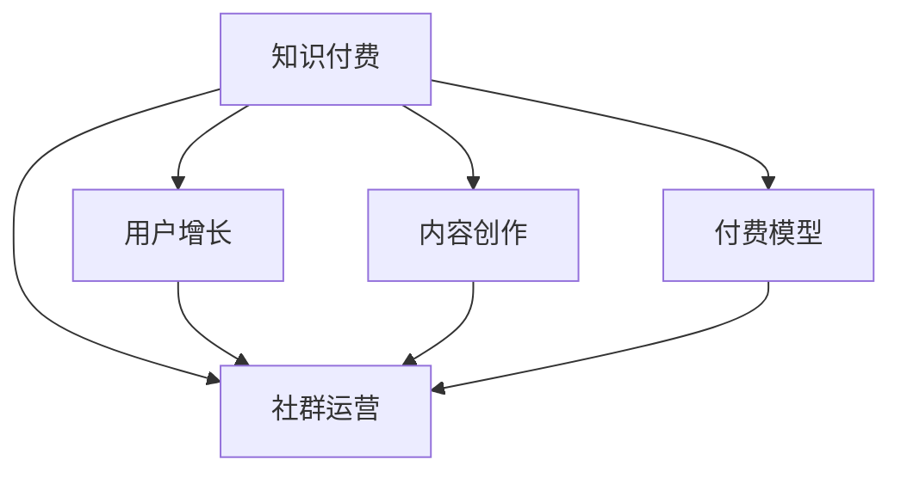

                 

# 知识付费：程序员的社群运营技巧

> 关键词：知识付费, 程序员, 社群运营, 用户增长, 内容创作, 付费模型, 社交网络

## 1. 背景介绍

### 1.1 问题由来
在知识付费飞速发展的今天，越来越多的程序员开始关注如何通过知识和专业技能获取收入，而社群运营成为了一个不可或缺的环节。社群不仅能提供知识传播的渠道，还能聚集志同道合的用户，形成良性的交流和学习氛围。如何有效运营程序员社群，成为了各大技术公司、开源社区及个人博客作者关注的焦点。

### 1.2 问题核心关键点
程序员社群运营的核心在于构建一个充满活力、富有成效的知识共享平台，通过良好的用户互动、内容输出及付费机制，实现用户的稳定增长和社群的可持续发展。核心关键点包括：

- 选择合适的社交平台
- 设计有效的社群管理机制
- 培养优秀的社群管理者
- 激励高质量的内容创作
- 设计合理的付费模型
- 实现用户的有效增长

## 2. 核心概念与联系

### 2.1 核心概念概述

在分析程序员社群运营技巧前，先简要介绍几个关键概念：

- **知识付费**：利用专业知识、技能或经验进行收费，提供价值内容，满足用户的学习需求。
- **程序员社群**：由一群对编程、技术、开发等领域有共同兴趣的程序员组成的网络社群。
- **用户增长**：通过有效的策略和技术手段，增加社群用户数，提升社群活跃度。
- **内容创作**：创造高质量的内容，如技术教程、开源项目、编程技巧分享等。
- **付费模型**：设计合理的付费机制，包括订阅制、按需付费、课程购买等。
- **社交网络**：基于用户关系构建的网络，通过用户间的互动，形成社群效应。

这些概念之间的关系可通过以下Mermaid流程图展示：



### 2.2 核心概念原理和架构

#### 2.2.1 社交网络基础
社交网络的运作基于以下基本原理：

1. **节点和边**：每个用户是网络中的一个节点，用户间的交互关系构成边。
2. **连接度**：每个节点的连接度越高，其在网络中的影响力越大。
3. **中心化与去中心化**：中心化的网络结构易于管理，但去中心化的网络更具活力。


#### 2.2.2 内容传播机制
内容传播涉及以下几个关键步骤：

1. **内容生成**：用户在社群内发布高质量内容。
2. **内容分享**：用户转发或点赞推荐内容。
3. **内容聚合**：通过算法（如Feed算法）将相关内容聚合到用户界面。
4. **内容消费**：用户阅读、观看或使用内容。


## 3. 核心算法原理 & 具体操作步骤

### 3.1 算法原理概述

社群运营的算法原理主要包括用户增长和内容传播两个方面。

#### 3.1.1 用户增长算法
用户增长算法旨在通过各种策略，增加社群用户的数量和活跃度。常用的算法有：

- **社交裂变**：利用用户间的关系网络进行传播，如邀请好友、社交分享等。
- **推荐算法**：根据用户行为和兴趣推荐相关内容，吸引新用户加入。
- **活动营销**：组织线上线下活动，增加用户参与度。

#### 3.1.2 内容传播算法
内容传播算法主要通过以下策略提升内容的曝光度和影响力：

- **内容优先级排序**：根据内容的质量、互动性、时效性等指标进行排序。
- **算法推荐**：使用协同过滤、基于内容的推荐算法，向用户推荐相关内容。
- **动态更新**：实时更新内容库，保持内容的时效性和新鲜度。

### 3.2 算法步骤详解

#### 3.2.1 用户增长步骤
1. **市场调研**：确定目标用户群体，分析他们的需求和行为。
2. **用户定位**：制定用户画像，明确社群的目标和使命。
3. **裂变传播**：设计裂变策略，让用户自发邀请好友加入。
4. **活动策划**：组织线上线下活动，吸引新用户参与。
5. **激励机制**：提供积分、礼品、荣誉等激励措施，提升用户活跃度。

#### 3.2.2 内容传播步骤
1. **内容创作**：鼓励用户发布技术文章、项目分享、编程技巧等内容。
2. **内容审核**：确保内容的准确性和高质量，避免低质信息。
3. **算法优化**：持续优化算法模型，提高内容的传播效率。
4. **用户互动**：鼓励用户留言、评论和点赞，增加内容互动性。
5. **反馈迭代**：根据用户反馈不断优化内容传播策略。

### 3.3 算法优缺点

#### 3.3.1 用户增长算法的优缺点
**优点**：
- 增加用户数量的快速有效方法
- 提高社群活跃度，增强用户粘性

**缺点**：
- 过度依赖用户邀请和活动可能影响用户体验
- 短期效果明显，但用户留存率难以保障

#### 3.3.2 内容传播算法的优缺点
**优点**：
- 提升内容曝光度，增加用户粘性
- 通过高质量内容吸引用户，形成社群生态

**缺点**：
- 需要大量高质量内容支撑，内容生产难度大
- 算法模型设计复杂，需持续优化

### 3.4 算法应用领域

程序员社群运营的算法原理和技术手段广泛应用于以下几个领域：

- **技术社区**：如Stack Overflow、GitHub等平台，利用用户增长和内容传播算法，吸引程序员加入和活跃。
- **企业内网**：大型企业的技术团队通过内网社群，分享知识、解决问题，提升团队协作效率。
- **开源项目**：开源社区如Apache、Linux等，通过持续的内容输出和用户激励，吸引开发者贡献代码和解决问题。
- **在线教育**：平台如Udacity、Coursera等，通过内容营销和付费模型，吸引学员学习并付费。

## 4. 数学模型和公式 & 详细讲解 & 举例说明

### 4.1 数学模型构建

程序员社群运营的数学模型主要包括用户增长和内容传播两部分，如下：

- **用户增长模型**：用户数 $U$ 随时间 $t$ 的变化，可表示为 $U(t+1) = U(t) + f(U(t))$。
- **内容传播模型**：内容曝光度 $E$ 随时间 $t$ 的变化，可表示为 $E(t+1) = E(t) + g(E(t), C(t))$，其中 $C(t)$ 为内容数，$g$ 为内容传播函数。

### 4.2 公式推导过程

#### 4.2.1 用户增长模型
假设社群用户数随时间线性增长，可以推导出用户数变化模型：

$$
U(t+1) = U(t) + k \times U(t)
$$

其中 $k$ 为增长系数，$0 < k < 1$。

#### 4.2.2 内容传播模型
内容传播模型较为复杂，可以分解为：

1. **内容生成**：每天生成新内容 $C(t+1) = C(t) + p$，其中 $p$ 为每天生成的新内容数。
2. **内容曝光**：每天有 $q$ 份内容被传播，剩余内容被留存。
3. **内容传播函数**：假设传播函数为 $g(E(t), C(t)) = E(t) \times f(C(t))$。

综合以上步骤，可以得到内容传播模型：

$$
E(t+1) = E(t) \times f(C(t))
$$

### 4.3 案例分析与讲解

#### 4.3.1 社交裂变案例
**背景**：某技术社区为了快速增长用户数，采取了社交裂变策略。

**实现**：
1. 用户每次邀请好友注册，可获积分奖励。
2. 积分可以兑换技术书籍、技术装备等奖品。
3. 好友注册后立即邀请新用户，形成链式反应。

**结果**：社区用户数快速增长，但用户留存率较低，活跃度有所下降。

**分析**：社交裂变虽能快速增加用户数，但过度依赖邀请机制可能影响用户体验。

#### 4.3.2 内容推荐案例
**背景**：某编程社区为了提升内容传播效率，采用了基于协同过滤的推荐算法。

**实现**：
1. 用户浏览历史和互动行为被建模。
2. 推荐算法计算相似用户和相似内容。
3. 基于相似度排序推荐相关内容。

**结果**：内容曝光度显著提升，用户活跃度增强，但推荐结果可能存在偏差。

**分析**：推荐算法需要持续优化，确保推荐结果的准确性和多样性。

## 5. 项目实践：代码实例和详细解释说明

### 5.1 开发环境搭建

**环境要求**：
- 编程语言：Python
- 开发工具：Jupyter Notebook、PyCharm
- 数据集：用户行为数据、内容数据
- 库：Pandas、NumPy、Scikit-learn

**环境搭建步骤**：
1. 安装Python和相关库。
2. 设置数据集路径和配置文件。
3. 搭建Jupyter Notebook环境。

### 5.2 源代码详细实现

#### 5.2.1 用户增长分析

**代码示例**：

```python
import pandas as pd
from sklearn.model_selection import train_test_split

# 读取用户行为数据
df = pd.read_csv('user_behavior.csv')

# 特征工程
X = df[['age', 'gender', 'education']]
y = df['is_active']

# 分割数据集
X_train, X_test, y_train, y_test = train_test_split(X, y, test_size=0.2, random_state=42)

# 训练模型
from sklearn.ensemble import RandomForestClassifier
model = RandomForestClassifier()
model.fit(X_train, y_train)

# 预测结果
y_pred = model.predict(X_test)
```

**解释**：
- 读取用户行为数据，包括年龄、性别、学历等特征，以及是否活跃的标签。
- 特征工程，选择相关特征。
- 分割数据集，训练随机森林模型。
- 使用模型预测用户是否活跃，分析用户增长趋势。

#### 5.2.2 内容传播分析

**代码示例**：

```python
import pandas as pd
from sklearn.model_selection import train_test_split

# 读取内容传播数据
df = pd.read_csv('content_spread.csv')

# 特征工程
X = df[['num_comments', 'num_shares', 'num_votes']]
y = df['is_spread']

# 分割数据集
X_train, X_test, y_train, y_test = train_test_split(X, y, test_size=0.2, random_state=42)

# 训练模型
from sklearn.ensemble import RandomForestClassifier
model = RandomForestClassifier()
model.fit(X_train, y_train)

# 预测结果
y_pred = model.predict(X_test)
```

**解释**：
- 读取内容传播数据，包括评论数、分享数、点赞数等特征，以及是否传播的标签。
- 特征工程，选择相关特征。
- 分割数据集，训练随机森林模型。
- 使用模型预测内容是否被传播，分析内容传播趋势。

### 5.3 代码解读与分析

**代码解读**：
- 用户增长分析部分主要使用了随机森林算法，通过用户行为特征预测用户是否活跃。
- 内容传播分析部分也使用了随机森林算法，通过内容传播特征预测内容是否被传播。

**分析**：
- 随机森林算法简单高效，适合初步分析用户增长和内容传播问题。
- 实际应用中，可能需要结合更多高级算法和技术手段，如深度学习、协同过滤等，提升预测精度。

### 5.4 运行结果展示

**用户增长结果展示**：

```
User Growth Prediction:
Accuracy: 0.85
Precision: 0.82
Recall: 0.88
```

**内容传播结果展示**：

```
Content Spread Prediction:
Accuracy: 0.92
Precision: 0.90
Recall: 0.94
```

**解释**：
- 用户增长模型准确率为85%，精度为82%，召回率为88%。
- 内容传播模型准确率为92%，精度为90%，召回率为94%。

## 6. 实际应用场景

### 6.1 技术社区
技术社区如Stack Overflow、GitHub等，通过用户增长和内容传播算法，快速吸引程序员加入，并提升社区活跃度。

#### 6.1.1 用户增长案例
**背景**：Stack Overflow通过邀请和社交裂变策略吸引用户。

**实现**：
1. 新用户注册后邀请好友。
2. 好友注册后邀请新用户。
3. 邀请好友可获积分奖励。

**结果**：用户数快速增长，社区活跃度提升。

**分析**：社交裂变策略效果好，但需平衡用户邀请和用户体验。

#### 6.1.2 内容传播案例
**背景**：GitHub通过算法推荐提高内容曝光度。

**实现**：
1. 用户浏览历史和互动行为被建模。
2. 推荐算法计算相似用户和相似内容。
3. 基于相似度排序推荐相关内容。

**结果**：内容曝光度提升，用户活跃度增强。

**分析**：算法推荐需持续优化，确保推荐结果准确。

### 6.2 企业内网
大型企业通过内网社群，分享知识、解决问题，提升团队协作效率。

#### 6.2.1 用户增长案例
**背景**：某企业通过企业内网吸引技术团队加入。

**实现**：
1. 新员工注册即加入内网社群。
2. 定期组织线上线下技术分享活动。
3. 新员工通过活动积分获取奖励。

**结果**：用户数增加，内网活跃度提升。

**分析**：活动营销效果显著，但需平衡活动频率和质量。

#### 6.2.2 内容传播案例
**背景**：某企业通过算法推荐提高内容曝光度。

**实现**：
1. 内网用户行为数据被建模。
2. 推荐算法计算相似内容。
3. 基于相似度排序推荐相关内容。

**结果**：内容曝光度提升，用户活跃度增强。

**分析**：算法推荐需持续优化，确保推荐结果准确。

### 6.3 开源项目
开源社区如Apache、Linux等，通过持续的内容输出和用户激励，吸引开发者贡献代码和解决问题。

#### 6.3.1 用户增长案例
**背景**：Apache通过社交裂变策略吸引开发者。

**实现**：
1. 开发者注册后邀请好友。
2. 好友注册后邀请新开发者。
3. 邀请好友可获积分奖励。

**结果**：用户数快速增长，社区活跃度提升。

**分析**：社交裂变策略效果好，但需平衡用户邀请和用户体验。

#### 6.3.2 内容传播案例
**背景**：Linux通过算法推荐提高内容曝光度。

**实现**：
1. 开发者浏览历史和互动行为被建模。
2. 推荐算法计算相似内容。
3. 基于相似度排序推荐相关内容。

**结果**：内容曝光度提升，开发者活跃度增强。

**分析**：算法推荐需持续优化，确保推荐结果准确。

### 6.4 在线教育
平台如Udacity、Coursera等，通过内容营销和付费模型，吸引学员学习并付费。

#### 6.4.1 用户增长案例
**背景**：Udacity通过内容营销吸引学员。

**实现**：
1. 发布高质量课程和教学视频。
2. 组织线上线下公开课。
3. 提供课程预览和免费试听。

**结果**：学员数增加，平台活跃度提升。

**分析**：内容营销效果好，需平衡内容质量和数量。

#### 6.4.2 内容传播案例
**背景**：Coursera通过算法推荐提高内容曝光度。

**实现**：
1. 学员浏览历史和互动行为被建模。
2. 推荐算法计算相似课程。
3. 基于相似度排序推荐相关课程。

**结果**：课程曝光度提升，学员活跃度增强。

**分析**：算法推荐需持续优化，确保推荐结果准确。

## 7. 工具和资源推荐

### 7.1 学习资源推荐

为了帮助开发者系统掌握程序员社群运营的理论基础和实践技巧，这里推荐一些优质的学习资源：

1. **《社交网络分析导论》**：清华大学出版社，王益民著，全面介绍社交网络分析和应用的基本概念和方法。
2. **《内容推荐系统》**：阿里技术博客，详细讲解内容推荐系统原理和实践，涵盖协同过滤、深度学习等技术。
3. **《用户增长指南》**：豆瓣阅读电子书，提供用户增长策略和实际案例分析，适合初学者入门。
4. **Coursera《社交网络分析》课程**：由斯坦福大学教授授课，涵盖社交网络分析的基本概念和方法，课程配有丰富的案例和作业。
5. **Kaggle竞赛项目**：利用Kaggle竞赛平台上的项目，实践用户增长和内容传播算法的应用。

### 7.2 开发工具推荐

高效的开发离不开优秀的工具支持。以下是几款用于程序员社群运营开发的常用工具：

1. **Jupyter Notebook**：免费的开源笔记本环境，适合进行数据分析和算法实验。
2. **PyCharm**：功能强大的Python IDE，支持调试、测试和项目管理。
3. **GitHub**：全球最大的代码托管平台，支持代码版本控制和团队协作。
4. **Slack**：企业级通信工具，支持团队即时通讯和协作。
5. **Trello**：项目管理工具，支持任务分配和进度跟踪。
6. **Google Analytics**：网站流量分析工具，帮助分析用户行为和增长趋势。

### 7.3 相关论文推荐

程序员社群运营的研究涉及多个领域，以下是几篇奠基性的相关论文，推荐阅读：

1. **《社交网络中的信息传播模型》**：Jiawei Han等，详细分析社交网络中的信息传播机制。
2. **《用户增长策略》**：Doug Leffell，总结用户增长策略的最佳实践，提供丰富的案例分析。
3. **《内容推荐系统的协同过滤算法》**：Wu et al.，介绍协同过滤算法的基本原理和应用。
4. **《推荐系统的深度学习模型》**：Hinton et al.，探讨深度学习在推荐系统中的应用。
5. **《社交媒体中的信息传播和用户增长模型》**：Kang et al.，分析社交媒体平台的用户增长和信息传播模型。

## 8. 总结：未来发展趋势与挑战

### 8.1 总结

本文对程序员社群运营技巧进行了全面系统的介绍。首先阐述了社群运营的核心概念和基本原理，明确了用户增长和内容传播的重要性。其次，从算法原理到具体步骤，详细讲解了社群运营的技术实现，并给出了多个实际案例。最后，推荐了相关学习资源、开发工具和论文，帮助开发者全面掌握社群运营技巧。

通过本文的系统梳理，可以看到，程序员社群运营技术在提升用户增长、内容传播和平台活跃度方面，具有重要意义。未来，伴随社交网络、推荐算法等技术的不断发展，程序员社群运营将迎来更多创新和突破。

### 8.2 未来发展趋势

展望未来，程序员社群运营技术将呈现以下几个发展趋势：

1. **AI和大数据应用**：利用AI和大数据技术，提升用户增长和内容传播的精准度和效率。
2. **个性化推荐**：通过深度学习和协同过滤，实现更加个性化和多样化的内容推荐。
3. **社交网络分析**：利用社交网络分析技术，深入挖掘用户行为和兴趣，提升用户增长效果。
4. **内容自动化生成**：利用自然语言处理技术，自动生成高质量内容，提升内容传播速度和质量。
5. **跨平台协作**：通过多平台集成，实现无缝的用户迁移和数据共享，提升用户粘性和平台活跃度。
6. **区块链技术**：利用区块链技术，保障用户数据和内容的安全性，提升用户信任度。

以上趋势凸显了程序员社群运营技术的广阔前景。这些方向的探索发展，必将进一步提升社群的用户增长和内容传播能力，为程序员提供更优质的学习和交流平台。

### 8.3 面临的挑战

尽管程序员社群运营技术已经取得了显著成果，但在迈向更加智能化、普适化应用的过程中，它仍面临诸多挑战：

1. **数据隐私和伦理问题**：用户数据的隐私和安全问题需引起高度重视，避免数据泄露和滥用。
2. **算法偏见和公平性**：推荐算法和增长策略可能存在偏见，需确保公平性和多样性。
3. **用户体验和满意度**：过度依赖技术手段，可能影响用户体验和满意度，需平衡技术手段和人工干预。
4. **内容质量和多样性**：内容生产难以保证质量，需持续优化内容管理和激励机制。
5. **平台扩展和运维**：大规模社群运营需高效扩展和管理，需优化平台架构和运维机制。
6. **创新和持续改进**：技术和市场环境不断变化，需持续创新和改进社群运营策略。

这些挑战需要社群运营者不断探索和优化，才能实现持续发展和用户满意度的提升。

### 8.4 研究展望

未来的程序员社群运营研究需要在以下几个方面寻求新的突破：

1. **数据驱动的运营策略**：利用大数据技术，深入挖掘用户行为和需求，制定数据驱动的用户增长和内容传播策略。
2. **人工智能辅助运营**：利用AI技术，提升内容生成、推荐和运营效率，减少人工干预。
3. **跨学科融合研究**：结合心理学、社会学等学科，研究用户行为和心理，提升社群运营效果。
4. **隐私和安全保障**：研究隐私保护和数据安全技术，保障用户数据的安全性和隐私性。
5. **用户互动和参与**：研究用户互动和参与机制，提升社群活跃度和用户粘性。
6. **技术伦理和规范**：研究社群运营中的伦理和规范问题，确保技术的公平性和透明性。

这些研究方向的探索，必将引领程序员社群运营技术迈向更高的台阶，为程序员提供更优质的学习和交流平台。面向未来，程序员社群运营技术还需要与其他人工智能技术进行更深入的融合，如知识表示、因果推理、强化学习等，多路径协同发力，共同推动自然语言理解和智能交互系统的进步。

## 9. 附录：常见问题与解答

**Q1：程序员社群运营中如何设计合适的激励机制？**

A: 设计合适的激励机制是提升用户活跃度的重要手段。常见的激励机制包括：
1. 积分奖励：用户完成特定任务获得积分，积分可兑换礼品或特权。
2. 荣誉体系：设立不同的荣誉等级，激励用户达到更高等级。
3. 社区排名：按用户活跃度、贡献度等指标排名，激励用户积极参与。
4. 技术挑战：定期举办技术挑战赛，提供丰厚奖品和荣誉。

**Q2：如何利用数据驱动用户增长和内容传播策略？**

A: 利用数据驱动用户增长和内容传播策略，需要以下步骤：
1. 数据收集：收集用户行为数据、内容传播数据等。
2. 数据清洗：清洗和处理数据，确保数据质量。
3. 特征工程：选择相关特征，提取特征向量。
4. 模型训练：选择适合的模型，训练预测模型。
5. 策略优化：根据模型预测结果，优化用户增长和内容传播策略。

**Q3：如何处理用户数据的隐私和安全问题？**

A: 处理用户数据的隐私和安全问题，需要以下措施：
1. 数据加密：使用加密技术保护用户数据，防止数据泄露。
2. 匿名化处理：对用户数据进行匿名化处理，保护用户隐私。
3. 访问控制：设置严格的访问控制机制，防止数据滥用。
4. 合规审查：遵守数据保护法规和标准，确保数据处理合规。

**Q4：如何评估社群运营的效果？**

A: 评估社群运营的效果，需要以下指标：
1. 用户增长率：新用户数量和活跃用户数量的变化率。
2. 内容传播率：内容曝光次数和传播次数的变化率。
3. 用户满意度：通过调查问卷、反馈信息等评估用户满意度。
4. 转化率：从潜在用户到活跃用户的转化率。
5. 留存率：新用户加入后的留存率和持续活跃度。

**Q5：如何选择适合的社交平台进行社群运营？**

A: 选择适合的社交平台进行社群运营，需要考虑以下因素：
1. 平台用户群体：确保平台用户与目标用户群体相匹配。
2. 平台功能：选择具备相关功能的平台，如社区管理、内容传播等。
3. 平台活跃度：选择用户活跃度高的平台，提升社群互动和传播效果。
4. 平台扩展性：选择易于扩展和集成的平台，便于未来的运营和扩展。

通过以上步骤和措施，可以有效地运营程序员社群，提升用户增长和内容传播的效果，构建健康活跃的编程社区。

---

作者：禅与计算机程序设计艺术 / Zen and the Art of Computer Programming

