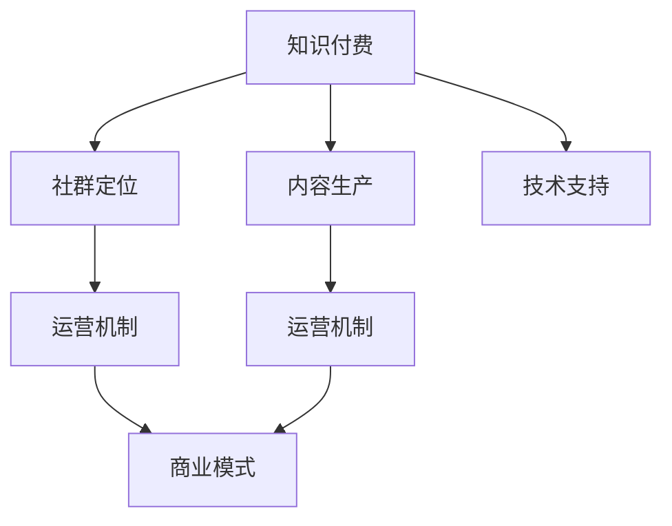

                 

# 知识付费：程序员的社群运营方案

> 关键词：知识付费,程序员,社群运营,社区管理,商业模式,用户留存

## 1. 背景介绍

### 1.1 问题由来
随着互联网技术的发展，在线教育、知识付费等新型教育模式兴起，为知识变现开辟了新的道路。程序员作为互联网的重要参与者，也逐渐成为了知识付费市场的重要消费者和供给者。然而，传统的知识付费模式无法充分满足程序员的个性化学习需求，如何构建有效的知识付费生态系统，成为亟需解决的问题。

### 1.2 问题核心关键点
构建一个成功的程序员知识付费社群，需要从以下几个方面入手：

- 社群定位：明确社群的目标用户群体，确定社群的定位和发展方向。
- 内容生产：组织专业程序员进行高质量内容的生产，满足用户的学习需求。
- 运营机制：设计合理的运营机制，确保社群的活跃度和用户留存率。
- 商业模式：探索可持续的商业模式，实现社群的盈利和可持续发展。
- 技术支持：使用先进的技术手段，提升社群的用户体验和运营效率。

### 1.3 问题研究意义
构建程序员知识付费社群，对于推动在线教育的发展，提高程序员的专业技能，促进技术交流与合作，具有重要意义：

1. 促进技术分享：通过知识付费社群，程序员能够分享自己的技术心得和经验，形成良性互动。
2. 提升专业技能：高质量的内容和互动环境，能够帮助程序员快速提升专业技能，适应快速变化的技术环境。
3. 增强社区凝聚力：通过社群运营，构建程序员社区的凝聚力和归属感，形成稳定的用户群体。
4. 探索商业变现：知识付费社群具备较大的商业潜力，通过广告、课程销售、会员服务等多样化商业模式，实现盈利。
5. 推动技术创新：社群内部的交流合作，能够激发新的技术创新和应用，推动行业的发展。

## 2. 核心概念与联系

### 2.1 核心概念概述

为了更好地理解程序员知识付费社群的构建，本节将介绍几个关键概念：

- **知识付费**：通过付费获取高质量的在线课程、资料、技术文章等知识内容，满足个性化学习需求。
- **程序员社群**：以程序员为核心的在线社区，注重技术分享、知识交流、互助合作。
- **社群运营**：通过管理、互动、宣传等手段，提升社群的用户活跃度和留存率，实现社群价值最大化。
- **社区管理**：维护社群秩序，处理违规行为，优化用户互动环境。
- **商业模式**：探索知识付费社群的盈利模式，如课程销售、广告、会员服务等。

这些概念之间的逻辑关系可以通过以下Mermaid流程图来展示：



这个流程图展示了几者之间的逻辑关系：

1. 知识付费是社群运营的基础，满足用户的学习需求。
2. 社群定位决定内容生产的方向和质量。
3. 内容生产是社群运营的核心，保证用户的学习体验。
4. 运营机制是社群运营的基础，维护社群的活跃度。
5. 商业模式是社群发展的关键，实现商业可持续。
6. 技术支持是社群运营的保障，提升用户体验。

## 3. 核心算法原理 & 具体操作步骤
### 3.1 算法原理概述

程序员知识付费社群的运营，本质上是一个多目标优化问题。其核心目标包括：

- 提升社群的用户活跃度和留存率
- 实现社群的商业化变现
- 提供高质量的内容服务

这些目标可以通过以下公式表示：

$$
Maximize \sum_{i=1}^n (u_i + c_i) \\
Subject\ to \\
\begin{cases}
0 \leq u_i \leq 1 & (u_i:用户活跃度) \\
0 \leq c_i \leq C & (c_i:商业变现收益) \\
\sum_{i=1}^n u_i \leq U & (U:用户上限) \\
\sum_{i=1}^n c_i \leq C & (C:商业上限)
\end{cases}
$$

其中 $u_i$ 表示用户活跃度，$c_i$ 表示商业变现收益，$U$ 表示用户上限，$C$ 表示商业上限。

### 3.2 算法步骤详解

构建程序员知识付费社群的运营，可以分为以下几个关键步骤：

**Step 1: 社群定位与目标设定**
- 定义社群的目标用户群体，如初级、中级、高级程序员等。
- 确定社群的核心价值主张，如技术分享、知识交流、互助合作等。
- 设定具体的运营目标，如月活跃用户数、会员订阅数、商业变现目标等。

**Step 2: 内容生产与管理**
- 招募专业程序员作为内容生产者，组织编写高质量的技术文章、教程、实战案例等。
- 建立内容审核机制，确保内容的质量和准确性。
- 设计互动机制，如在线答疑、讨论区、代码评审等，促进知识交流和协作。

**Step 3: 社群运营与管理**
- 制定社群规则，明确用户行为规范，处理违规行为。
- 组织各类线上线下活动，如技术分享会、编程比赛、编程马拉松等，提升用户活跃度。
- 建立用户反馈机制，根据用户反馈持续优化社群运营。

**Step 4: 商业模式设计与实施**
- 探索多样化的商业变现模式，如课程销售、广告、会员服务、赞助等。
- 设计合理的定价策略，确保商业变现与用户价值最大化。
- 实施商业变现策略，如在线课程销售、付费订阅、付费社区等，实现社群盈利。

**Step 5: 技术支持与优化**
- 使用先进的技术手段，如大数据、人工智能、推荐系统等，提升社群的用户体验和运营效率。
- 设计高效的社区管理系统，提升运营效率，降低运营成本。
- 持续优化社区技术架构，确保系统的稳定性和可扩展性。

### 3.3 算法优缺点

构建程序员知识付费社群的方法，具有以下优点：

1. **高效资源利用**：通过高质量的内容生产，满足用户的学习需求，提升用户活跃度和留存率。
2. **多渠道变现**：多种商业变现模式的组合，有助于实现社群的商业化变现，确保社群的可持续发展。
3. **知识共享与交流**：社群内部的技术分享和交流，能够促进知识传播，提升程序员的专业技能。
4. **社区凝聚力**：通过丰富的线上线下活动，增强社区的凝聚力和归属感，形成稳定的用户群体。

同时，该方法也存在以下局限性：

1. **内容质量依赖**：社群的吸引力和活跃度高度依赖于内容质量，内容生产者水平不一，可能导致内容质量不稳定。
2. **运营成本较高**：社群运营涉及多方面工作，需要投入大量人力物力，运营成本较高。
3. **用户粘性不足**：单一的内容形式和互动方式可能无法满足所有用户的需求，导致用户粘性不足。
4. **商业化风险**：过度的商业化可能影响社群的氛围和用户体验，导致用户流失。

尽管存在这些局限性，但通过合理的运营策略和管理手段，可以在很大程度上缓解这些问题，实现社群的长期稳定发展。

### 3.4 算法应用领域

程序员知识付费社群的构建方法，已经在多个行业和领域得到了应用，例如：

- **技术培训与在线教育**：通过知识付费社群，提供高质量的技术培训课程，满足用户的学习需求。
- **技术交流与合作**：建立技术交流平台，促进开发者之间的技术分享和合作，提升技术水平。
- **编程开发与项目协作**：通过社群内的合作项目，提升开发效率，解决复杂问题。
- **企业招聘与人才管理**：利用社群内的技术交流和招聘功能，帮助企业发现和培养优秀人才。

除了上述这些经典应用外，知识付费社群还被创新性地应用到更多场景中，如企业内部培训、在线技术竞赛、开源项目协作等，为技术发展提供了新的动力。

## 4. 数学模型和公式 & 详细讲解  
### 4.1 数学模型构建

为了更精确地描述程序员知识付费社群的运营，可以使用数学模型进行分析。假设社群内有 $n$ 个用户，分别表示为 $u_1, u_2, \cdots, u_n$。每个用户有活跃度 $u_i$ 和收益 $c_i$，社群的总活跃度和收益分别为 $U$ 和 $C$。

模型目标为最大化社群的总价值，即：

$$
Maximize \sum_{i=1}^n (u_i + c_i) \\
Subject\ to \\
\begin{cases}
0 \leq u_i \leq 1 & (u_i:用户活跃度) \\
0 \leq c_i \leq C & (c_i:商业变现收益) \\
\sum_{i=1}^n u_i \leq U & (U:用户上限) \\
\sum_{i=1}^n c_i \leq C & (C:商业上限)
\end{cases}
$$

### 4.2 公式推导过程

在上述模型中，$u_i$ 表示用户 $i$ 的活跃度，$c_i$ 表示用户 $i$ 的收益，$U$ 表示用户上限，$C$ 表示商业上限。

为了求解该优化问题，可以采用动态规划的方法。设 $F(u, c)$ 表示用户总活跃度为 $u$，总收益为 $c$ 时的最大总价值，则有：

$$
F(u, c) = \max_{i=1}^n \{ u_i + c_i \}
$$

满足条件：

$$
\begin{cases}
0 \leq u_i \leq u & (u_i:用户活跃度) \\
0 \leq c_i \leq c & (c_i:商业变现收益) \\
\sum_{i=1}^n u_i = u & (U:用户上限) \\
\sum_{i=1}^n c_i = c & (C:商业上限)
\end{cases}
$$

通过递推求解，可以得到最优解。

### 4.3 案例分析与讲解

以某知识付费社群为例，假设社群内有 $n=100$ 个用户，目标总活跃度为 $U=80$，总收益为 $C=10$。每个用户对活跃度和收益的贡献如下：

| 用户 | 活跃度贡献 | 收益贡献 |
|------|------------|----------|
| 1    | 0.2        | 1        |
| 2    | 0.1        | 0.5      |
| ...  | ...        | ...      |
| 100  | 0.1        | 0.5      |

根据上述模型，可以通过动态规划求解最优解。具体步骤如下：

1. 初始化 $F(0,0) = 0$，$F(u,c) = -\infty$（未定义）。
2. 从 $F(1,0)$ 开始，计算每个 $F(u_i,0)$，表示用户活跃度为 $u_i$ 时的最大收益。
3. 从 $F(0,c)$ 开始，计算每个 $F(0,c_i)$，表示总收益为 $c_i$ 时的最大活跃度。
4. 通过递推公式计算 $F(u,c)$。
5. 最终求得 $F(U,C)$，即为社群的最大总价值。

## 5. 项目实践：代码实例和详细解释说明
### 5.1 开发环境搭建

在进行知识付费社群的开发前，我们需要准备好开发环境。以下是使用Python进行Flask开发的环境配置流程：

1. 安装Anaconda：从官网下载并安装Anaconda，用于创建独立的Python环境。

2. 创建并激活虚拟环境：
```bash
conda create -n flask-env python=3.8 
conda activate flask-env
```

3. 安装Flask：使用pip安装Flask框架。
```bash
pip install flask
```

4. 安装各类工具包：
```bash
pip install numpy pandas scikit-learn matplotlib tqdm jupyter notebook ipython
```

5. 安装Django：用于Web应用开发。
```bash
pip install django
```

6. 安装FDFS：用于文件存储。
```bash
pip install fdfs
```

完成上述步骤后，即可在`flask-env`环境中开始开发实践。

### 5.2 源代码详细实现

下面我们以知识付费社群的在线课程销售为例，给出使用Flask和Django进行Web应用开发的Python代码实现。

首先，定义在线课程的模型：

```python
from django.db import models
from django.contrib.auth.models import User

class Course(models.Model):
    name = models.CharField(max_length=200)
    content = models.TextField()
    price = models.DecimalField(max_digits=10, decimal_places=2)
    user = models.ForeignKey(User, on_delete=models.CASCADE)

    def __str__(self):
        return self.name
```

然后，定义用户模型和订单模型：

```python
class User(models.Model):
    username = models.CharField(max_length=50)
    email = models.EmailField()

    def __str__(self):
        return self.username

class Order(models.Model):
    user = models.ForeignKey(User, on_delete=models.CASCADE)
    course = models.ForeignKey(Course, on_delete=models.CASCADE)
    paid = models.BooleanField(default=False)

    def __str__(self):
        return f"Order by {self.user} for {self.course.name}"
```

接着，定义Flask应用的路由和视图：

```python
from flask import Flask, render_template, request
from .models import Course, User, Order

app = Flask(__name__)

@app.route('/')
def index():
    courses = Course.objects.all()
    return render_template('index.html', courses=courses)

@app.route('/register', methods=['POST'])
def register():
    username = request.form['username']
    email = request.form['email']
    user = User(username=username, email=email)
    user.save()
    return 'User registered'

@app.route('/buy', methods=['POST'])
def buy():
    course_id = request.form['course_id']
    user = request.form['username']
    order = Order.objects.filter(course__id=course_id, user__username=user).first()
    if not order:
        order = Order(user__username=user, course__id=course_id)
        order.save()
    else:
        order.paid = True
        order.save()
    return 'Order successful'
```

最后，创建Flask应用的模板文件：

```html
<!-- index.html -->
<!DOCTYPE html>
<html>
<head>
    <title>知识付费社群</title>
</head>
<body>
    <h1>我们的课程</h1>
    <ul>
        
            <li><a href="/order?course_id={{course.id}}">{{course.name}} - ¥{{course.price}}</a></li>
        
    </ul>
</body>
</html>
```

启动Flask应用后，可以在浏览器中访问 http://127.0.0.1:5000/ 查看在线课程列表，并通过 POST 请求 /buy 路径进行订单购买。

### 5.3 代码解读与分析

这里我们简要解读一下关键代码的实现细节：

**User和Course模型**：
- 定义了用户和课程的基本属性，如用户名、邮箱、课程名称、课程内容、课程价格等。
- 通过Django的 ForeignKey 关系，建立了用户和课程之间的关联。

**Flask应用路由和视图**：
- 使用Flask的路由装饰器 @app.route() 定义应用的路由。
- 定义了 /index 路由，获取所有课程信息，并渲染到模板。
- 定义了 /register 路由，用户注册页面，接收 POST 请求，保存用户信息。
- 定义了 /buy 路由，用户购买页面，接收 POST 请求，保存订单信息。

**模板文件**：
- 使用 Django 的模板引擎，动态渲染课程列表。
- 通过 {{course.id}}、{{course.price}} 等模板标签，将动态数据插入到 HTML 中。

### 5.4 运行结果展示

启动Flask应用，在浏览器中访问 http://127.0.0.1:5000/，可以看到在线课程列表。点击课程名称，跳转到购买页面。填写用户名、订单号和价格，提交订单后，页面显示订单成功。

## 6. 实际应用场景
### 6.1 智能客服系统

基于知识付费社群的智能客服系统，可以广泛应用于企业内部和外部客户服务。通过知识付费社群，企业可以汇集内部程序员的技术知识和经验，构建智能客服的知识库，提升客服效率和用户满意度。

在技术实现上，可以建立知识付费社群的API接口，将客户的问题转化为API请求，获取最佳答复。同时，通过定期更新知识库，保持客服系统的知识水平和时效性。

### 6.2 在线教育平台

知识付费社群的在线教育平台，可以提供高质量的编程课程和技术文章，满足程序员的学习需求。通过社群的互动机制，学习者可以互相交流学习心得，提升学习效果。

在技术实现上，可以建立在线课程和文章的发布平台，采用知识付费的商业模式，实现平台盈利。同时，通过推荐系统，根据学习者的兴趣推荐相关内容，提升学习效率。

### 6.3 开源项目协作

知识付费社群的开源项目协作平台，可以吸引程序员参与开源项目，共同开发技术软件，提升技术水平和团队协作能力。

在技术实现上，可以建立开源项目的管理和协作系统，提供代码评审、问题追踪、版本控制等功能。同时，通过知识付费的方式，激励程序员参与项目开发，共享技术成果。

### 6.4 未来应用展望

随着知识付费社群的发展，其在更多领域的应用前景也将不断拓展。

在智慧医疗领域，知识付费社群可以提供医学知识分享和交流的平台，帮助医生和患者提升医疗水平和健康意识。

在智能制造领域，知识付费社群可以汇集工程师的技术知识和经验，提升生产效率和产品质量。

在智慧城市治理中，知识付费社群可以提供城市管理和治理的技术支持，提升城市管理和公共服务的水平。

此外，在智慧农业、智能交通、环保监测等更多领域，知识付费社群都可以发挥重要作用，推动相关行业的数字化转型。

## 7. 工具和资源推荐
### 7.1 学习资源推荐

为了帮助开发者系统掌握知识付费社群的运营，这里推荐一些优质的学习资源：

1. **《知识付费平台的运营与优化》**：一本全面介绍知识付费平台运营和优化的书籍，涵盖内容生产、用户运营、商业变现等方面。
2. **《社区管理与用户行为分析》**：介绍社区管理的基本原则和用户行为分析的技术手段，帮助开发者提升社群运营水平。
3. **《知识付费社群的商业模式创新》**：探讨知识付费社群的多样化商业变现模式，如课程销售、会员服务、广告等，帮助开发者实现社群盈利。
4. **《社区技术架构设计》**：介绍社区技术架构的设计思路和实现方法，帮助开发者提升技术支持能力。
5. **《数据分析与用户行为研究》**：利用数据分析技术，分析用户行为和社群运营数据，提升社群运营效率。

通过对这些资源的学习实践，相信你一定能够快速掌握知识付费社群的运营技巧，并用于解决实际的社群运营问题。

### 7.2 开发工具推荐

高效的开发离不开优秀的工具支持。以下是几款用于知识付费社群开发的常用工具：

1. **Flask**：基于Python的轻量级Web应用框架，灵活易用，适合快速迭代开发。
2. **Django**：基于Python的全栈Web框架，功能丰富，适合开发复杂的Web应用。
3. **FDFS**：用于文件存储和管理，支持分布式文件系统，适合存储海量数据。
4. **Gunicorn**：基于Python的Web应用服务器，支持热重启，适合快速部署和扩展。
5. **Nginx**：高性能Web服务器，支持负载均衡、缓存等功能，适合高并发环境。

合理利用这些工具，可以显著提升知识付费社群的开发效率，加快创新迭代的步伐。

### 7.3 相关论文推荐

知识付费社群的发展源于学界的持续研究。以下是几篇奠基性的相关论文，推荐阅读：

1. **《知识付费社群运营优化研究》**：探讨知识付费社群的运营优化策略，如内容生产、用户管理、商业变现等。
2. **《社区技术支持的提升与优化》**：介绍社区技术支持的实现方法和优化思路，提升社区的用户体验。
3. **《知识付费社群的商业模式创新》**：探讨知识付费社群的多样化商业变现模式，如课程销售、会员服务、广告等，帮助开发者实现社群盈利。
4. **《社区管理与用户行为分析》**：介绍社区管理的基本原则和用户行为分析的技术手段，帮助开发者提升社群运营水平。
5. **《知识付费社群的商业化研究》**：探讨知识付费社群的商业化策略，如课程销售、会员服务、广告等，帮助开发者实现社群盈利。

这些论文代表了大语言模型微调技术的发展脉络。通过学习这些前沿成果，可以帮助研究者把握学科前进方向，激发更多的创新灵感。

## 8. 总结：未来发展趋势与挑战

### 8.1 总结

本文对知识付费社群的构建进行了全面系统的介绍。首先阐述了知识付费社群的背景和意义，明确了社群的目标用户群体和定位方向。其次，从原理到实践，详细讲解了知识付费社群的运营机制，给出了知识付费社群的完整代码实例。同时，本文还广泛探讨了知识付费社群在智能客服、在线教育、开源项目协作等多个行业领域的应用前景，展示了知识付费社群的广阔潜力。此外，本文精选了知识付费社群的各类学习资源，力求为读者提供全方位的技术指引。

通过本文的系统梳理，可以看到，知识付费社群的构建对于推动在线教育的发展，提高程序员的专业技能，促进技术交流与合作，具有重要意义。相信随着知识付费社群的发展，未来知识付费技术还将进一步拓展其应用范围，推动更多行业的数字化转型升级。

### 8.2 未来发展趋势

展望未来，知识付费社群的发展将呈现以下几个趋势：

1. **技术平台化**：知识付费社群的技术平台将更加成熟，支持更多的商业变现模式，实现商业化运营。
2. **数据驱动运营**：利用大数据和人工智能技术，提升知识付费社群的运营效率和精准度。
3. **个性化推荐**：引入个性化推荐系统，推荐用户感兴趣的内容，提升用户满意度和留存率。
4. **国际化扩展**：知识付费社群将面向全球用户，提供多语言支持，拓展国际市场。
5. **多样化内容**：除了技术内容，还将引入视频、音频等多种形式的内容，丰富用户体验。

以上趋势凸显了知识付费社群的广阔前景。这些方向的探索发展，将进一步提升知识付费社群的用户体验和运营效率，推动在线教育的发展。

### 8.3 面临的挑战

尽管知识付费社群已经取得了显著的进展，但在迈向更加智能化、普适化应用的过程中，它仍面临诸多挑战：

1. **内容质量控制**：知识付费社群的运营高度依赖于内容质量，内容生产者水平不一，可能导致内容质量不稳定。
2. **用户粘性不足**：单一的内容形式和互动方式可能无法满足所有用户的需求，导致用户粘性不足。
3. **商业化风险**：过度的商业化可能影响社群的氛围和用户体验，导致用户流失。
4. **技术复杂性**：知识付费社群的技术平台需要具备高度的灵活性和可扩展性，技术实现难度较大。
5. **法规和合规**：知识付费社群需要遵守相关的法律法规和行业标准，避免侵犯版权和隐私。

正视知识付费社群面临的这些挑战，积极应对并寻求突破，将是知识付费社群发展的关键。

### 8.4 研究展望

面对知识付费社群所面临的种种挑战，未来的研究需要在以下几个方面寻求新的突破：

1. **内容质量提升**：引入专业的内容审核机制，确保内容的质量和准确性。
2. **用户粘性提升**：引入多种互动形式和内容形式，提升用户粘性和满意度。
3. **商业化模式创新**：探索多样化的商业变现模式，确保社群的可持续发展。
4. **技术平台优化**：优化技术架构，提升平台的灵活性和可扩展性。
5. **法规和合规管理**：加强法规和合规管理，确保平台的合法合规运营。

这些研究方向的探索，必将引领知识付费社群技术的进一步发展，提升知识付费社群的用户体验和运营效率。

## 9. 附录：常见问题与解答

**Q1：知识付费社群如何实现商业化变现？**

A: 知识付费社群的商业化变现可以采用多种方式，如课程销售、广告、会员服务、赞助等。具体方式如下：

1. **课程销售**：构建在线课程平台，提供高质量的编程课程和技术文章，通过付费订阅的方式实现盈利。
2. **广告**：在社群内展示广告，获取广告收入。
3. **会员服务**：提供高级会员服务，包括专属内容、高级互动等，通过会员费实现盈利。
4. **赞助**：引入企业赞助，获取赞助资金，支持社群的发展和运营。

**Q2：知识付费社群如何提升用户粘性？**

A: 提升用户粘性需要从多个方面入手：

1. **内容丰富多样**：提供多种形式的内容，如视频、音频、直播等，满足用户的多样化需求。
2. **互动机制完善**：引入在线答疑、讨论区、代码评审等互动机制，增强用户参与感和归属感。
3. **活动策划丰富**：定期举办技术分享会、编程比赛、编程马拉松等活动，提升用户活跃度。
4. **用户激励机制**：设置排行榜、积分系统、用户认证等激励机制，激励用户积极参与。
5. **用户反馈机制**：建立用户反馈机制，根据用户反馈持续优化社群运营。

**Q3：知识付费社群如何进行内容审核？**

A: 内容审核是确保知识付费社群内容质量的关键步骤，可以采用以下方法：

1. **专家审核**：邀请行业专家进行内容审核，确保内容的准确性和权威性。
2. **社区审核**：建立社区审核机制，由用户进行内容审核，确保内容的多样性和社区的自治性。
3. **自动化审核**：利用自然语言处理和机器学习技术，自动化审核内容，提升审核效率和准确性。
4. **人工复审**：对于复杂和敏感内容，进行人工复审，确保内容的安全性和合规性。

通过综合应用这些方法，可以有效提升知识付费社群的内容质量，满足用户的学习需求。

**Q4：知识付费社群如何提升用户满意度？**

A: 提升用户满意度需要从多个方面入手：

1. **内容质量**：提供高质量的内容，满足用户的学习需求。
2. **互动机制**：引入在线答疑、讨论区、代码评审等互动机制，增强用户参与感和归属感。
3. **活动策划**：定期举办技术分享会、编程比赛、编程马拉松等活动，提升用户活跃度。
4. **用户激励机制**：设置排行榜、积分系统、用户认证等激励机制，激励用户积极参与。
5. **用户反馈机制**：建立用户反馈机制，根据用户反馈持续优化社群运营。

**Q5：知识付费社群如何实现用户留存？**

A: 用户留存是知识付费社群的重要目标，可以采用以下方法：

1. **内容更新**：定期更新内容，保持社群的知识水平和时效性。
2. **互动机制**：引入在线答疑、讨论区、代码评审等互动机制，增强用户参与感和归属感。
3. **活动策划**：定期举办技术分享会、编程比赛、编程马拉松等活动，提升用户活跃度。
4. **用户激励机制**：设置排行榜、积分系统、用户认证等激励机制，激励用户积极参与。
5. **用户反馈机制**：建立用户反馈机制，根据用户反馈持续优化社群运营。

通过综合应用这些方法，可以有效提升知识付费社群的用户留存率，保持社群的长期稳定发展。

---

作者：禅与计算机程序设计艺术 / Zen and the Art of Computer Programming

