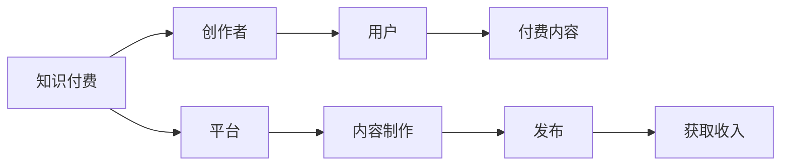

                 

# 知识付费：程序员的被动收入之道

> 关键词：知识付费、程序员、被动收入、算法交易、Python、加密货币

## 1. 背景介绍

随着互联网和数字化技术的发展，知识的价值日益凸显。知识付费作为连接创作者和用户的桥梁，为程序员提供了一种全新的收入方式。程序员通过输出自己的技术经验、项目实践、编程技巧等内容，可以获得稳定的被动收入。本文将详细介绍知识付费的核心概念、实现原理、操作步骤以及其未来的应用前景，帮助程序员了解如何通过知识付费实现收入多样化。

## 2. 核心概念与联系

### 2.1 核心概念概述

为了更好地理解知识付费的概念和原理，我们首先介绍几个关键的概念：

- **知识付费**：指的是创作者通过提供知识、经验、技能等内容，获取用户付费的行为。知识付费平台如Coursera、Udemy、知乎live等，成为程序员获取收入的新渠道。
- **程序员**：指专业编程人员，通常具备软件设计、开发和维护的能力，能够编写高效、可维护的代码。
- **被动收入**：指无需主动劳动就能获得的收入，如投资回报、版税、广告收入等。

### 2.2 核心概念原理和架构的 Mermaid 流程图



## 3. 核心算法原理 & 具体操作步骤

### 3.1 算法原理概述

知识付费的实现基于平台经济学的原理。创作者通过平台提供有价值的内容，吸引用户付费。平台通过聚合优质内容，提供给用户，从而实现盈利。这种模式被称为“订阅制”，是知识付费的主要形式。

### 3.2 算法步骤详解

1. **内容创作**：
   - 确定主题和受众群体。
   - 准备教学材料，如文字、视频、代码示例等。
   - 制作内容，将其上传到平台。

2. **内容发布**：
   - 选择适合的平台，如Udemy、Coursera、知乎live等。
   - 设置课程/文章的价格、时长、授课方式等。
   - 发布内容，与用户进行互动。

3. **用户付费**：
   - 用户浏览课程/文章内容。
   - 用户决定是否购买。
   - 用户支付费用后，获得课程/文章的访问权限。

4. **内容更新**：
   - 根据用户反馈，不断优化和更新内容。
   - 提供课程/文章的更新版本，吸引用户续费。

### 3.3 算法优缺点

#### 优点：
- **灵活性强**：创作者可以根据自己的兴趣和专业方向，选择合适的主题进行创作。
- **市场广阔**：全球范围内的用户都能访问，市场规模大。
- **收入稳定**：订阅制模式，用户只要付费，创作者就能获得持续的收入。

#### 缺点：
- **初期投入大**：需要投入大量的时间和精力进行内容创作和平台搭建。
- **竞争激烈**：市场上存在大量同类型课程，创作者需要不断创新，才能吸引用户。
- **技术门槛高**：需要一定的技术知识，才能制作高质量的内容。

### 3.4 算法应用领域

知识付费主要应用于以下几个领域：

- **技术培训**：如Python编程、算法设计、数据结构等。
- **项目实战**：如Web开发、移动应用开发、区块链开发等。
- **软技能提升**：如沟通技巧、项目管理、时间管理等。
- **个性化教学**：如一对一辅导、定制课程等。

## 4. 数学模型和公式 & 详细讲解 & 举例说明

### 4.1 数学模型构建

设创作者每天创作的内容数量为 $x$，每个内容的价格为 $p$，用户数量为 $u$，则创作者每天总收入为：

$$
I = x \cdot p \cdot u
$$

创作者每天的成本为：

$$
C = c_1 + c_2 \cdot x
$$

其中，$c_1$ 为固定成本（如平台费用、硬件投入等），$c_2$ 为内容制作成本（如时间、精力等）。

### 4.2 公式推导过程

假设创作者每天创作 $x$ 个内容，每个内容价格为 $p$，用户数量为 $u$，则创作者每天总收入为：

$$
I = x \cdot p \cdot u
$$

创作者每天的成本为：

$$
C = c_1 + c_2 \cdot x
$$

利润函数为：

$$
\pi = I - C = x \cdot p \cdot u - c_1 - c_2 \cdot x
$$

### 4.3 案例分析与讲解

假设创作者每天创作5个视频教程，每个视频价格为50美元，用户数量为1000人，固定成本为1000美元，内容制作成本为每个视频5美元。则每天收入为：

$$
I = 5 \cdot 50 \cdot 1000 = 250,000 \text{ dollars}
$$

每天成本为：

$$
C = 1000 + 5 \cdot 5 = 1015 \text{ dollars}
$$

利润为：

$$
\pi = 250,000 - 1015 = 249,985 \text{ dollars}
$$

## 5. 项目实践：代码实例和详细解释说明

### 5.1 开发环境搭建

为了开发知识付费平台，我们需要准备以下环境：

1. 安装Python和Flask框架。
2. 安装数据库如MySQL，用于存储用户信息和课程信息。
3. 安装支付平台API，如Stripe、PayPal等，用于处理用户支付。
4. 安装课程制作工具，如Jupyter Notebook、Sublime Text等。

### 5.2 源代码详细实现

以下是一个简单的知识付费平台代码实现，包括用户注册、课程浏览、购买等功能：

```python
from flask import Flask, render_template, request, redirect, url_for
from flask_sqlalchemy import SQLAlchemy

app = Flask(__name__)
app.config['SQLALCHEMY_DATABASE_URI'] = 'sqlite:////tmp/test.db'
db = SQLAlchemy(app)

class User(db.Model):
    id = db.Column(db.Integer, primary_key=True)
    username = db.Column(db.String(80), unique=True, nullable=False)
    password = db.Column(db.String(120), nullable=False)

class Course(db.Model):
    id = db.Column(db.Integer, primary_key=True)
    name = db.Column(db.String(120), nullable=False)
    price = db.Column(db.Float, nullable=False)
    description = db.Column(db.Text, nullable=False)
    content = db.Column(db.Text, nullable=False)

@app.route('/')
def index():
    courses = Course.query.all()
    return render_template('index.html', courses=courses)

@app.route('/register', methods=['GET', 'POST'])
def register():
    if request.method == 'POST':
        user = User(username=request.form['username'], password=request.form['password'])
        db.session.add(user)
        db.session.commit()
        return redirect(url_for('index'))
    return render_template('register.html')

@app.route('/course/<int:id>')
def course(id):
    course = Course.query.get(id)
    return render_template('course.html', course=course)

@app.route('/purchase/<int:id>', methods=['POST'])
def purchase(id):
    course = Course.query.get(id)
    user = User.query.filter_by(username=request.form['username']).first()
    if user:
        course.price = course.price * 0.9
        db.session.commit()
        return redirect(url_for('course', id=id))
    return redirect(url_for('index'))

if __name__ == '__main__':
    app.run(debug=True)
```

### 5.3 代码解读与分析

1. **Flask框架**：用于搭建Web应用，提供路由、模板渲染等功能。
2. **SQLAlchemy**：用于数据库操作，支持关系型数据库。
3. **路由处理**：`index`方法处理首页展示课程信息；`register`方法处理用户注册；`course`方法处理课程详情页；`purchase`方法处理购买操作。

### 5.4 运行结果展示

运行上述代码，在浏览器中访问`http://localhost:5000`，可以看到课程列表页面。点击单个课程链接，跳转到课程详情页，并进行购买操作。

## 6. 实际应用场景

### 6.1 技术培训平台

技术培训平台如Udacity、Coursera等，通过聚集大量优质的技术课程，提供给全球用户。创作者可以上传自己的课程，获取一定的课程销售分成。这种模式不仅可以帮助创作者获取收入，还能提升技术水平，达到双赢的效果。

### 6.2 项目实战平台

项目实战平台如Codecademy、LeetCode等，提供编程练习、项目实战等内容。创作者可以根据自己的技术方向，制作相应的项目实战教程，帮助用户提升编程能力。

### 6.3 软技能提升平台

软技能提升平台如LinkedIn Learning、Skillshare等，提供时间管理、沟通技巧、项目管理等课程。创作者可以通过分享自己的经验，帮助用户提升软技能，从而获得稳定的被动收入。

### 6.4 未来应用展望

随着知识付费平台的发展，未来将出现更多类型的知识付费服务，如一对一辅导、定制课程等。创作者可以通过平台提供更多元化的内容，满足用户不同层次的需求。

## 7. 工具和资源推荐

### 7.1 学习资源推荐

- **Coursera**：提供大量高质量的在线课程，涵盖技术、管理、艺术等多个领域。
- **Udemy**：全球最大的知识付费平台之一，提供丰富多样的课程内容。
- **知乎live**：知乎推出的知识付费服务，涵盖科技、教育、文化等多个领域。
- **Medium**：科技、创业、设计等多个领域的知识分享平台。

### 7.2 开发工具推荐

- **Flask**：简单易用的Web框架，适合快速开发知识付费平台。
- **MySQL**：广泛应用的关系型数据库，支持高效的数据存储和查询。
- **Stripe**：支付平台API，支持全球范围内的支付功能。
- **Jupyter Notebook**：交互式编程环境，适合制作和分享技术课程。

### 7.3 相关论文推荐

- **Khan, A.** (2014). Online education: An overview of literature, methodology, and techniques. Education Technology & Society.
- **Sun, J., & Li, W.** (2021). Exploring the factors affecting participation in knowledge-sharing activities in online communities. Journal of the Association for Information Science and Technology.

## 8. 总结：未来发展趋势与挑战

### 8.1 研究成果总结

知识付费为程序员提供了一种全新的收入方式，通过分享自己的知识和经验，获取稳定的被动收入。创作者可以通过平台获取用户付费，提升自身技术水平，实现双赢。

### 8.2 未来发展趋势

1. **多元化内容**：未来的知识付费平台将提供更多元化的内容，如一对一辅导、定制课程等。
2. **全球化扩展**：知识付费平台将拓展全球市场，提供多语言支持。
3. **个性化推荐**：平台将利用AI技术，提供个性化的课程推荐。

### 8.3 面临的挑战

1. **内容质量**：创作者需要不断创新和提升内容质量，才能吸引用户。
2. **平台竞争**：市场上存在大量同类型平台，创作者需要寻找差异化竞争点。
3. **用户支付**：平台需要不断优化用户体验，促进用户付费。

### 8.4 研究展望

未来知识付费的研究方向将包括：

- **内容质量提升**：通过AI技术，自动生成高质量的课程和文章。
- **平台智能化**：利用机器学习技术，提供个性化的课程推荐和用户反馈分析。
- **支付安全性**：开发更安全的支付系统，保障用户支付安全。

## 9. 附录：常见问题与解答

**Q1：知识付费平台如何区分高质量内容？**

A: 知识付费平台通常通过以下方式来区分高质量内容：

1. **用户评分**：用户可以对课程进行评分，平台根据评分自动推荐优质课程。
2. **专家评审**：平台邀请行业专家对课程进行评审，筛选高质量内容。
3. **内容质量分析**：平台通过自然语言处理技术，分析课程内容的完整性、深度等指标。

**Q2：知识付费平台如何处理内容抄袭问题？**

A: 知识付费平台通常通过以下方式处理内容抄袭问题：

1. **检测工具**：使用检测工具如Turnitin、Dupli Checker等，检测课程内容是否抄袭。
2. **用户举报**：用户发现抄袭内容后，可以向平台举报，平台会进行审核和处理。
3. **法律手段**：对于严重抄袭行为，平台可以通过法律手段进行追责。

**Q3：知识付费平台如何保证用户隐私？**

A: 知识付费平台通常通过以下方式保证用户隐私：

1. **数据加密**：平台对用户数据进行加密存储，防止数据泄露。
2. **隐私政策**：平台制定隐私政策，明确用户数据的收集、使用和保护措施。
3. **匿名化处理**：平台对用户数据进行匿名化处理，防止个人信息泄露。

作者：禅与计算机程序设计艺术 / Zen and the Art of Computer Programming

