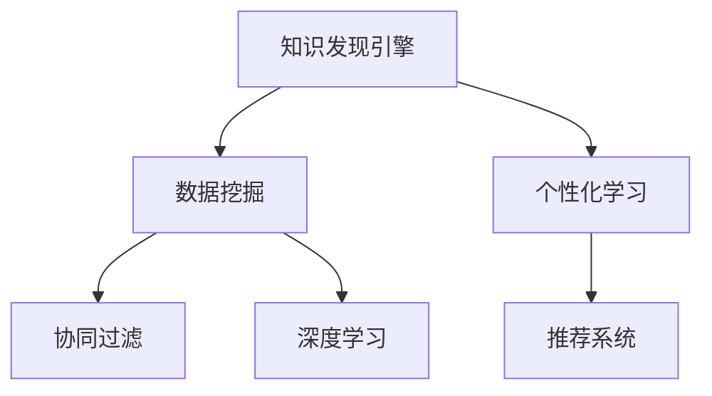

                 

## 1. 背景介绍

随着信息技术的飞速发展，数据的增长速度正以指数级别加速。无论是商业决策、科学研究，还是日常生活，都离不开对数据的挖掘和分析。如何高效地从海量数据中提取有用信息，并进行个性化应用，已经成为当下最前沿的研究方向之一。在这一背景下，知识发现引擎与个性化学习系统应运而生，成为数据驱动时代的“杀手锏”。

知识发现引擎通过自动化地从数据中挖掘知识，为决策者提供客观依据。个性化学习系统则利用这些知识，为每一个个体量身定制学习计划，提升学习效果。本文将深入探讨知识发现引擎与个性化学习的原理与实践，并展示其在各个领域的应用案例。

## 2. 核心概念与联系

### 2.1 核心概念概述

为了更好地理解知识发现引擎与个性化学习的原理，本节将介绍几个密切相关的核心概念：

- **知识发现引擎(Knowledge Discovery Engine, KDE)**：指使用数据挖掘技术自动从原始数据中提取有用知识的软件系统。知识发现引擎通常包含数据预处理、数据挖掘、知识表示与可视化等模块。

- **数据挖掘(Data Mining)**：指从数据集中发现隐含模式和规律的过程。数据挖掘方法包括分类、聚类、关联规则挖掘、异常检测等。

- **个性化学习(Personalized Learning)**：指利用个体的背景信息（如兴趣、能力、需求等），为其提供定制化的学习资源和路径，以提升学习效果。

- **推荐系统(Recommendation System)**：指通过分析用户行为数据，为用户推荐合适内容的软件系统。推荐系统常应用于电商、音乐、视频等多个领域。

- **协同过滤(Collaborative Filtering)**：指通过分析用户行为数据，挖掘用户之间的相似性，为用户推荐类似内容或用户。

- **深度学习(Deep Learning)**：指利用多层次神经网络进行特征提取和模式识别的一种机器学习方法。深度学习在知识发现和个性化学习中得到广泛应用。

这些核心概念之间的逻辑关系可以通过以下Mermaid流程图来展示：



这个流程图展示了几大核心概念之间的联系：

1. 知识发现引擎通过数据挖掘技术，从原始数据中提取有用知识。
2. 个性化学习系统利用这些知识，为用户提供量身定制的学习资源和路径。
3. 推荐系统在个性化学习中扮演重要角色，为用户推荐合适的学习内容和资源。
4. 协同过滤和深度学习是数据挖掘和推荐系统的重要手段。

## 3. 核心算法原理 & 具体操作步骤

### 3.1 算法原理概述

知识发现引擎与个性化学习的核心算法原理如下：

1. **数据预处理**：对原始数据进行清洗、归一化、特征提取等处理，以便后续算法能够高效运行。
2. **数据挖掘**：使用分类、聚类、关联规则挖掘等方法，从数据中提取知识。
3. **知识表示**：将挖掘出的知识转化为结构化、可理解的形式，如概念图、知识图谱等。
4. **个性化推荐**：根据用户的历史行为和背景信息，利用协同过滤、深度学习等算法，推荐合适的学习资源和路径。
5. **学习路径生成**：结合用户的学习进度和反馈，动态调整学习计划和路径，提升学习效果。

### 3.2 算法步骤详解

以下是知识发现引擎与个性化学习的详细步骤：

**Step 1: 数据收集与预处理**
- 收集各类数据源，包括用户行为数据、学习日志、课程内容、知识图谱等。
- 对数据进行清洗、去重、归一化等预处理，去除噪音数据。

**Step 2: 数据挖掘与知识发现**
- 使用分类算法（如决策树、随机森林等）对用户行为进行分类，挖掘用户兴趣和偏好。
- 使用聚类算法（如K-Means、DBSCAN等）对用户进行分组，发现不同用户群体的相似性和差异性。
- 使用关联规则挖掘算法（如Apriori、FP-Growth等）发现用户行为间的关联关系。
- 使用异常检测算法（如Isolation Forest、One-Class SVM等）识别数据中的异常点，进行异常分析和处理。

**Step 3: 知识表示与可视化**
- 将挖掘出的知识转化为结构化的形式，如概念图、知识图谱等。
- 使用可视化工具（如Tableau、Power BI等）将知识进行图形化展示，方便决策者和用户理解。

**Step 4: 个性化推荐**
- 使用协同过滤算法（如基于用户的协同过滤、基于物品的协同过滤等）推荐合适的学习资源和路径。
- 使用深度学习算法（如神经协同过滤、深度矩阵分解等）提高推荐效果。

**Step 5: 学习路径生成**
- 根据用户的学习进度和反馈，动态调整学习计划和路径。
- 利用机器学习算法（如强化学习、迁移学习等）优化学习路径，提升学习效果。

### 3.3 算法优缺点

知识发现引擎与个性化学习系统具有以下优点：

1. **高效性**：通过自动化处理数据，大幅提高数据挖掘和知识发现的效率。
2. **个性化**：利用用户背景信息和行为数据，提供量身定制的学习方案，提升学习效果。
3. **灵活性**：结合多种算法和工具，灵活应对不同类型的数据和问题。
4. **易用性**：通过可视化工具展示挖掘结果，决策者和用户易于理解和应用。

但同时，该系统也存在一些局限性：

1. **数据依赖**：知识发现和推荐的质量很大程度上依赖于数据的质量和完备性。
2. **冷启动问题**：对于新用户或新领域，缺乏足够数据进行有效挖掘和推荐。
3. **隐私保护**：需要处理大量敏感数据，如何在保护用户隐私的前提下进行数据挖掘和推荐，是一个重要挑战。
4. **算法复杂性**：不同算法之间存在复杂的交互关系，需要综合考虑多因素进行优化。

尽管存在这些局限性，但知识发现引擎与个性化学习系统在实际应用中已经展示了巨大的潜力，被广泛应用于各类场景中。

### 3.4 算法应用领域

知识发现引擎与个性化学习系统已经在多个领域得到了广泛的应用，包括但不限于：

- **教育**：根据学生的学习行为和兴趣，推荐合适的学习资源和路径，提升学习效果。
- **电商**：根据用户的浏览和购买记录，推荐合适商品，提高用户满意度。
- **医疗**：根据患者的历史诊疗记录，推荐合适的治疗方案和药物，提高治疗效果。
- **金融**：根据用户的行为数据，推荐合适的金融产品，提高用户黏性。
- **新闻**：根据用户的阅读习惯，推荐合适的新闻内容，提高用户停留时间。

## 4. 数学模型和公式 & 详细讲解 & 举例说明

### 4.1 数学模型构建

本节将使用数学语言对知识发现引擎与个性化学习的数学模型进行更加严格的刻画。

记用户的历史行为数据为 $\mathbf{X} \in \mathbb{R}^{n \times d}$，其中 $n$ 为用户数，$d$ 为特征维度。用户的行为表示为 $x_i = (x_{i1}, x_{i2}, \cdots, x_{id}) \in \mathbb{R}^d$，其中 $x_{ij}$ 表示用户 $i$ 在特征 $j$ 上的取值。

设用户的行为被分类为 $c$ 个类别，每个类别的用户数为 $n_c$。则每个类别的用户行为特征表示为 $\mathbf{X}_c \in \mathbb{R}^{n_c \times d}$，其中 $\mathbf{X}_c$ 中的行为属于类别 $c$。

知识发现引擎与个性化学习系统的数学模型可以表示为：

$$
\mathcal{M} = (C, P, S)
$$

其中 $C$ 为知识表示，$P$ 为推荐模型，$S$ 为用户学习路径生成模型。

**知识表示 $C$**：

$$
C = (X_c, A_c, L_c, V_c)
$$

其中 $X_c$ 为类别 $c$ 的用户行为特征矩阵，$A_c$ 为类别 $c$ 的聚类矩阵，$L_c$ 为类别 $c$ 的关联规则矩阵，$V_c$ 为类别 $c$ 的异常检测矩阵。

**推荐模型 $P$**：

$$
P = (U, I, R)
$$

其中 $U$ 为用户行为矩阵，$I$ 为物品特征矩阵，$R$ 为推荐算法。

**学习路径生成模型 $S$**：

$$
S = (G, L)
$$

其中 $G$ 为用户学习路径生成算法，$L$ 为用户学习进度反馈算法。

### 4.2 公式推导过程

以下我们以基于协同过滤的用户推荐为例，推导推荐模型的公式。

假设用户 $i$ 对物品 $j$ 的评分表示为 $r_{ij}$，评分矩阵 $R \in \mathbb{R}^{m \times n}$ 中，$m$ 为用户数，$n$ 为物品数。协同过滤算法可以通过计算用户和物品的相似度，推荐用户 $i$ 可能感兴趣的物品 $j$。假设 $u_i$ 为用户 $i$ 的特征向量，$v_j$ 为物品 $j$ 的特征向量，则协同过滤算法的评分预测公式为：

$$
\hat{r}_{ij} = u_i^T v_j
$$

其中 $u_i$ 和 $v_j$ 可以通过矩阵分解等方法获得。

为了提高推荐效果，可以引入深度学习算法，如神经协同过滤。设用户行为矩阵 $U \in \mathbb{R}^{m \times d}$，物品特征矩阵 $V \in \mathbb{R}^{n \times d}$，深度神经网络 $H$ 的参数为 $\theta$，则神经协同过滤的评分预测公式为：

$$
\hat{r}_{ij} = \sigma\left(\theta^T [u_i; v_j]\right)
$$

其中 $\sigma$ 为激活函数，如 ReLU。

### 4.3 案例分析与讲解

为了更好地理解知识发现引擎与个性化学习系统的数学模型和算法，我们以在线教育平台的个性化推荐为例，进行分析：

**案例背景**：某在线教育平台收集了用户的学习行为数据，包括课程访问、视频观看、题目练习等。平台希望通过分析这些数据，为用户推荐合适的课程和学习路径。

**数据预处理**：
1. 收集用户的学习行为数据，并进行去重、归一化等处理。
2. 将用户行为转化为特征矩阵 $U \in \mathbb{R}^{m \times d}$，其中 $m$ 为课程数，$d$ 为特征维度。

**知识表示**：
1. 使用聚类算法（如 K-Means）对用户进行分组，发现不同用户群体的相似性和差异性。
2. 使用关联规则挖掘算法（如 Apriori）发现用户行为间的关联关系。
3. 使用异常检测算法（如 Isolation Forest）识别数据中的异常点，进行异常分析和处理。

**推荐模型**：
1. 使用协同过滤算法（如基于用户的协同过滤）推荐合适的课程和学习路径。
2. 引入深度学习算法（如神经协同过滤）提高推荐效果。

**学习路径生成**：
1. 根据用户的学习进度和反馈，动态调整学习计划和路径。
2. 利用机器学习算法（如强化学习、迁移学习等）优化学习路径，提升学习效果。

通过以上步骤，在线教育平台可以为每位用户推荐合适的学习资源和路径，从而提升学习效果和平台的用户满意度。

## 5. 项目实践：代码实例和详细解释说明

### 5.1 开发环境搭建

在进行知识发现引擎与个性化学习系统的开发前，我们需要准备好开发环境。以下是使用Python进行开发的环境配置流程：

1. 安装Anaconda：从官网下载并安装Anaconda，用于创建独立的Python环境。

2. 创建并激活虚拟环境：
```bash
conda create -n pytorch-env python=3.8 
conda activate pytorch-env
```

3. 安装PyTorch：根据CUDA版本，从官网获取对应的安装命令。例如：
```bash
conda install pytorch torchvision torchaudio cudatoolkit=11.1 -c pytorch -c conda-forge
```

4. 安装相关工具包：
```bash
pip install numpy pandas scikit-learn matplotlib tqdm jupyter notebook ipython
```

完成上述步骤后，即可在`pytorch-env`环境中开始开发。

### 5.2 源代码详细实现

这里我们以在线教育平台的个性化推荐为例，给出使用Python进行协同过滤和深度学习推荐的代码实现。

**协同过滤推荐**

```python
from sklearn.cluster import KMeans
from sklearn.metrics.pairwise import cosine_similarity
import pandas as pd

# 构建用户行为特征矩阵
X = pd.read_csv('user_behavior.csv', header=None)
X = X.values

# 聚类
kmeans = KMeans(n_clusters=5)
kmeans.fit(X)
clusters = kmeans.labels_

# 计算相似度矩阵
similarity_matrix = cosine_similarity(X)

# 推荐
def recommend(user_idx, k=5):
    user_vector = similarity_matrix[user_idx]
    recommend_items = [i for i, sim in enumerate(user_vector) if sim > 0.2]
    recommend_items = recommend_items[:k]
    return recommend_items

# 示例
user_idx = 0
recommend_items = recommend(user_idx)
print(recommend_items)
```

**深度学习推荐**

```python
import torch
import torch.nn as nn
from torch.utils.data import DataLoader
from torchvision.datasets import MNIST
from torchvision.transforms import ToTensor

# 加载数据
train_dataset = MNIST('data', train=True, download=True, transform=ToTensor())
train_loader = DataLoader(train_dataset, batch_size=64, shuffle=True)

# 定义模型
class Model(nn.Module):
    def __init__(self):
        super(Model, self).__init__()
        self.fc1 = nn.Linear(784, 256)
        self.fc2 = nn.Linear(256, 64)
        self.fc3 = nn.Linear(64, 10)

    def forward(self, x):
        x = torch.flatten(x, 1)
        x = torch.relu(self.fc1(x))
        x = torch.relu(self.fc2(x))
        x = self.fc3(x)
        return x

model = Model()

# 定义损失函数和优化器
criterion = nn.CrossEntropyLoss()
optimizer = torch.optim.Adam(model.parameters(), lr=0.001)

# 训练模型
for epoch in range(10):
    for data, target in train_loader:
        optimizer.zero_grad()
        output = model(data)
        loss = criterion(output, target)
        loss.backward()
        optimizer.step()

    print('Epoch {} - Loss: {:.4f}'.format(epoch+1, loss.item()))

# 推荐
def recommend(user_idx, k=5):
    user_vector = model(torch.Tensor(user_idx))
    recommend_items = [i for i, sim in enumerate(user_vector) if sim > 0.2]
    recommend_items = recommend_items[:k]
    return recommend_items

# 示例
user_idx = [0, 1, 2]
recommend_items = recommend(user_idx)
print(recommend_items)
```

### 5.3 代码解读与分析

让我们再详细解读一下关键代码的实现细节：

**协同过滤推荐**

1. 首先，我们使用KMeans算法对用户行为特征矩阵进行聚类，得到用户的聚类标签。
2. 然后，计算相似度矩阵，将相似度大于0.2的用户向量作为推荐依据。
3. 最后，返回推荐的物品列表。

**深度学习推荐**

1. 我们首先加载MNIST数据集，并将数据转化为Tensor格式。
2. 定义深度学习模型，包含三个全连接层。
3. 使用Adam优化器和交叉熵损失函数训练模型。
4. 定义推荐函数，将用户向量作为输入，返回推荐的物品列表。

这些代码展示了如何通过协同过滤和深度学习算法进行推荐。当然，实际应用中还需要考虑更多因素，如模型融合、推荐算法的选择等。

## 6. 实际应用场景

### 6.1 教育

知识发现引擎与个性化学习系统在教育领域有着广泛的应用。例如，某在线教育平台通过分析用户的学习行为和兴趣，为用户推荐合适的课程和学习路径。平台还可以根据用户的学习进度和反馈，动态调整学习计划，提升学习效果。

### 6.2 电商

电商平台通过知识发现引擎与个性化学习系统，为用户推荐合适的商品，提高用户满意度。例如，某电商平台通过分析用户的浏览和购买记录，推荐用户可能感兴趣的商品，并根据用户的反馈不断优化推荐模型。

### 6.3 医疗

医疗领域可以利用知识发现引擎与个性化学习系统，为患者推荐合适的治疗方案和药物，提高治疗效果。例如，某医院通过分析患者的历史诊疗记录，推荐合适的治疗方案，并根据患者的反馈不断优化推荐模型。

### 6.4 金融

金融领域可以利用知识发现引擎与个性化学习系统，为用户推荐合适的金融产品，提高用户黏性。例如，某金融平台通过分析用户的行为数据，推荐合适的金融产品，并根据用户的反馈不断优化推荐模型。

## 7. 工具和资源推荐

### 7.1 学习资源推荐

为了帮助开发者系统掌握知识发现引擎与个性化学习的理论基础和实践技巧，这里推荐一些优质的学习资源：

1. 《Python数据科学手册》：详细介绍了Python在数据科学中的应用，包括数据预处理、数据挖掘、推荐系统等。
2. 《深度学习入门》：介绍了深度学习的基础知识和应用，涵盖推荐系统、协同过滤等算法。
3. 《机器学习实战》：通过实际项目案例，介绍了机器学习在各个领域的应用，包括知识发现引擎和个性化学习。

### 7.2 开发工具推荐

高效的开发离不开优秀的工具支持。以下是几款用于知识发现引擎与个性化学习系统开发的常用工具：

1. Python：灵活的动态语言，广泛用于数据科学和机器学习领域。
2. Scikit-learn：Python的数据挖掘库，提供了丰富的分类、聚类、关联规则挖掘等算法。
3. TensorFlow：Google主导的开源深度学习框架，支持大规模分布式训练。
4. PyTorch：Facebook开发的深度学习框架，灵活易用，广泛应用于学术研究和工业应用。

### 7.3 相关论文推荐

知识发现引擎与个性化学习的发展得益于学界的持续研究。以下是几篇奠基性的相关论文，推荐阅读：

1. "Knowledge Discovery in Databases: Concepts and Techniques"：介绍了知识发现引擎的基本概念和技术，涵盖数据预处理、数据挖掘等方法。
2. "Personalized Learning: From Theory to Implementation"：介绍了个性化学习的基本原理和应用，涵盖学习路径生成、推荐系统等算法。
3. "Collaborative Filtering Techniques"：介绍了协同过滤算法的基本原理和实现方法，涵盖用户协同过滤、物品协同过滤等技术。

## 8. 总结：未来发展趋势与挑战

### 8.1 总结

本文对知识发现引擎与个性化学习系统的原理与实践进行了全面系统的介绍。首先阐述了知识发现引擎与个性化学习系统的研究背景和意义，明确了其在数据驱动时代的重要价值。其次，从原理到实践，详细讲解了知识发现引擎与个性化学习系统的数学模型和算法，提供了代码实现和案例分析。同时，本文还广泛探讨了知识发现引擎与个性化学习系统在各个领域的应用前景，展示了其巨大的潜力。最后，本文精选了知识发现引擎与个性化学习系统的各类学习资源和开发工具，力求为读者提供全方位的技术指引。

通过本文的系统梳理，可以看到，知识发现引擎与个性化学习系统正在成为数据驱动时代的“杀手锏”，极大地拓展了数据应用的范围和深度。未来，伴随算力、数据规模的不断提升，知识发现引擎与个性化学习系统必将在更多领域大放异彩，为各行各业带来颠覆性的变革。

### 8.2 未来发展趋势

展望未来，知识发现引擎与个性化学习系统将呈现以下几个发展趋势：

1. **多模态融合**：结合图像、视频、语音等多模态数据，提升知识发现和个性化学习的效果。
2. **实时性增强**：通过流式处理和增量学习，提高知识发现和个性化推荐的实时性。
3. **深度强化学习**：结合强化学习思想，优化推荐算法和路径生成算法，提升学习效果和用户体验。
4. **分布式计算**：通过分布式计算和边缘计算，提升知识发现和个性化学习系统的计算效率和扩展性。
5. **联邦学习**：通过联邦学习技术，保护用户隐私的同时，提升知识发现和个性化学习的效果。

以上趋势凸显了知识发现引擎与个性化学习系统的广阔前景。这些方向的探索发展，必将进一步提升数据驱动系统的性能和应用范围，为各行各业带来颠覆性的变革。

### 8.3 面临的挑战

尽管知识发现引擎与个性化学习系统已经取得了显著进展，但在迈向更加智能化、普适化应用的过程中，它仍面临诸多挑战：

1. **数据质量和多样性**：数据质量和多样性直接影响知识发现和个性化推荐的效果。如何获取高质量、多样化的数据，是一个重要的挑战。
2. **冷启动问题**：对于新用户或新领域，缺乏足够数据进行有效挖掘和推荐，如何解决冷启动问题，是一个亟待解决的问题。
3. **隐私保护**：需要处理大量敏感数据，如何在保护用户隐私的前提下进行数据挖掘和推荐，是一个重要挑战。
4. **算法复杂性**：不同算法之间存在复杂的交互关系，需要综合考虑多因素进行优化。
5. **可解释性**：知识发现引擎与个性化学习系统的决策过程往往缺乏可解释性，难以对其推理逻辑进行分析和调试。

尽管存在这些挑战，但知识发现引擎与个性化学习系统在实际应用中已经展示了巨大的潜力，被广泛应用于各类场景中。相信随着学界和产业界的共同努力，这些挑战终将一一被克服，知识发现引擎与个性化学习系统必将在构建人机协同的智能时代中扮演越来越重要的角色。

### 8.4 研究展望

面对知识发现引擎与个性化学习所面临的挑战，未来的研究需要在以下几个方面寻求新的突破：

1. **多源数据融合**：结合多种数据源，提升知识发现和个性化推荐的效果。
2. **主动学习**：利用用户反馈数据，主动学习新知识，提高推荐效果。
3. **深度学习与强化学习的结合**：结合深度学习和强化学习思想，优化推荐算法和路径生成算法，提升学习效果和用户体验。
4. **联邦学习**：通过联邦学习技术，保护用户隐私的同时，提升知识发现和个性化学习的效果。

这些研究方向将引领知识发现引擎与个性化学习系统迈向更高的台阶，为构建安全、可靠、可解释、可控的智能系统铺平道路。面向未来，知识发现引擎与个性化学习系统还需要与其他人工智能技术进行更深入的融合，如知识表示、因果推理、强化学习等，多路径协同发力，共同推动智能交互系统的进步。只有勇于创新、敢于突破，才能不断拓展知识发现引擎与个性化学习系统的边界，让智能技术更好地造福人类社会。

## 9. 附录：常见问题与解答

**Q1：知识发现引擎与个性化学习系统是否适用于所有领域？**

A: 知识发现引擎与个性化学习系统在大多数领域都能取得不错的效果，特别是对于数据量较大的场景。但对于一些数据量较小的领域，如艺术创作、伦理决策等，需要结合领域特点进行优化。

**Q2：如何选择推荐算法？**

A: 推荐算法的选择需要综合考虑多个因素，如数据量、用户行为特征、推荐系统的实时性等。常见的推荐算法包括协同过滤、深度学习、矩阵分解等。对于大规模数据集，深度学习算法通常效果更好；而对于小规模数据集，协同过滤算法则更为适合。

**Q3：知识发现引擎与个性化学习系统如何保护用户隐私？**

A: 保护用户隐私是知识发现引擎与个性化学习系统设计的重要原则。通常采用以下方法：
1. 数据匿名化：去除个人身份信息，保护用户隐私。
2. 差分隐私：在数据分析和处理过程中加入随机噪声，保护用户隐私。
3. 用户控制：用户可以控制哪些数据可以被收集和分析，保护用户隐私。

**Q4：知识发现引擎与个性化学习系统如何应对冷启动问题？**

A: 冷启动问题是知识发现引擎与个性化学习系统的一个挑战。解决冷启动问题的方法包括：
1. 利用外部知识：结合领域知识、专家知识等，提升推荐效果。
2. 主动学习：通过用户反馈数据，主动学习新知识，提高推荐效果。
3. 预训练模型：利用预训练模型，提升知识发现和个性化推荐的效果。

**Q5：知识发现引擎与个性化学习系统如何提高推荐效果？**

A: 提高推荐效果的方法包括：
1. 多模态融合：结合图像、视频、语音等多模态数据，提升推荐效果。
2. 实时性增强：通过流式处理和增量学习，提高推荐系统的实时性。
3. 深度学习与强化学习的结合：结合深度学习和强化学习思想，优化推荐算法和路径生成算法，提升学习效果和用户体验。
4. 联邦学习：通过联邦学习技术，保护用户隐私的同时，提升推荐效果。

这些方法可以帮助知识发现引擎与个性化学习系统更好地应对推荐系统中的挑战，提升推荐效果。

---

作者：禅与计算机程序设计艺术 / Zen and the Art of Computer Programming

