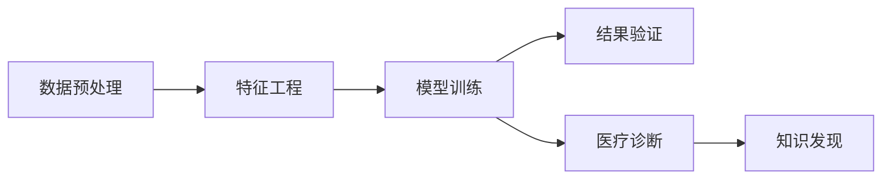

                 

# 知识发现引擎在医疗诊断中的应用

## 1. 背景介绍

在医疗诊断领域，面对海量数据和复杂病情，如何高效准确地发现知识，成为亟待解决的重要问题。知识发现(Knowledge Discovery, KDD)技术通过算法模型自动分析数据，挖掘出有价值的信息，对医疗诊断具有重要意义。本文将系统探讨知识发现引擎在医疗诊断中的应用，阐述其原理、方法、优势及前景。

## 2. 核心概念与联系

### 2.1 核心概念概述

为更好地理解知识发现引擎在医疗诊断中的应用，本文首先介绍几个核心概念：

- **知识发现(KDD)**：从数据中自动提取和发现有用知识的过程。主要包括数据预处理、特征工程、模型训练和结果验证等多个步骤。

- **数据挖掘(Data Mining)**：从海量数据中提取有用信息和知识，包括分类、聚类、关联规则学习、异常检测等技术。

- **机器学习(Machine Learning)**：使用数据驱动的算法模型，从数据中学习规律，自动发现知识。

- **医疗诊断(Medical Diagnosis)**：使用医学知识和经验，结合诊断工具和技术，对患者进行疾病诊断和评估的过程。

这些概念之间的关系可以通过以下Mermaid流程图来展示：



以上流程图展示了大规模医疗数据通过数据预处理、特征工程、模型训练到医疗诊断的过程，最终形成一个完整的知识发现链。

## 3. 核心算法原理 & 具体操作步骤

### 3.1 算法原理概述

知识发现引擎在医疗诊断中的应用，本质上是通过机器学习技术，自动从医疗数据中提取知识，并用于辅助诊断。其核心思想是：

1. **数据准备**：收集医疗数据，包括电子病历、影像数据、实验室检测结果等，进行清洗和预处理，生成可用于分析的数据集。
2. **特征工程**：设计合理的特征集，提取对诊断有用的信息，如病历中的症状、影像中的异常区域等。
3. **模型训练**：选择适合的机器学习算法，如决策树、随机森林、深度学习等，在标注数据集上训练模型，自动发现诊断规则和模式。
4. **结果验证**：对训练好的模型进行验证，评估其诊断效果，调整参数和优化算法，提升模型性能。
5. **临床应用**：将训练好的模型集成到医疗系统中，辅助医生进行诊断，生成诊断报告和建议。

### 3.2 算法步骤详解

#### 3.2.1 数据准备

**Step 1: 数据收集与预处理**
- 收集医疗数据，如电子病历、影像数据、实验室检测结果等。
- 进行数据清洗，包括去除噪声、处理缺失值、标准化数据格式等。

**Step 2: 数据分割**
- 将数据集划分为训练集、验证集和测试集。

**Step 3: 特征选择**
- 设计特征集，提取对诊断有用的信息，如病历中的症状、影像中的异常区域等。
- 去除冗余和无关特征，保留最具代表性的信息。

#### 3.2.2 特征工程

**Step 1: 特征提取**
- 提取医疗数据中的关键特征，如病人的年龄、性别、病史、体征、症状等。
- 从影像数据中提取关键区域，如病灶的大小、形状、位置等。

**Step 2: 特征变换**
- 对提取的特征进行归一化、标准化等变换，提升模型训练效率。
- 引入新的特征表达方式，如频谱分析、时域特征等，增强模型学习能力。

**Step 3: 特征选择**
- 使用信息增益、卡方检验等方法评估特征重要性。
- 去除低相关性特征，保留对诊断有帮助的信息。

#### 3.2.3 模型训练

**Step 1: 模型选择**
- 根据任务类型和数据特性选择合适的机器学习模型，如决策树、随机森林、深度学习等。

**Step 2: 模型训练**
- 使用训练集训练模型，调整参数和优化算法，提升模型性能。
- 采用交叉验证等技术，防止模型过拟合。

**Step 3: 模型评估**
- 在验证集上评估模型性能，计算准确率、召回率、F1值等指标。
- 对模型结果进行解释和分析，识别模型的优势和局限。

#### 3.2.4 结果验证

**Step 1: 结果评估**
- 在测试集上评估模型的泛化性能，计算各项指标。
- 进行模型对比，评估不同算法的效果。

**Step 2: 结果优化**
- 根据评估结果调整模型参数和算法，优化模型性能。
- 引入更多的正则化技术，防止模型过拟合。

**Step 3: 结果部署**
- 将训练好的模型集成到医疗系统中，辅助医生进行诊断。
- 提供诊断报告和建议，帮助医生制定治疗方案。

### 3.3 算法优缺点

#### 3.3.1 算法优点

- **高效性**：自动从数据中发现诊断规则和模式，减少人工干预，提升诊断效率。
- **准确性**：基于机器学习算法，能够发现复杂和多变的诊断规律。
- **可解释性**：通过特征工程和模型训练，可以解释诊断规则和依据，提升临床信任度。

#### 3.3.2 算法缺点

- **数据依赖**：模型性能高度依赖数据质量和数量，获取高质量医疗数据成本较高。
- **算法局限**：部分算法对数据分布假设较强，难以处理复杂和异构的数据。
- **模型复杂性**：复杂模型如深度学习可能需要较多计算资源和时间，难以快速部署。

### 3.4 算法应用领域

知识发现引擎在医疗诊断中的应用广泛，涵盖以下多个领域：

- **影像诊断**：从影像数据中自动发现病变区域，提供诊断建议。
- **实验室检测**：自动分析实验室检测结果，生成诊断报告。
- **电子病历分析**：从电子病历中提取关键信息，辅助诊断决策。
- **疾病预测**：通过历史数据预测疾病发展趋势，提前干预。
- **药物研发**：自动发现药物与疾病之间的关联，支持新药研发。

## 4. 数学模型和公式 & 详细讲解 & 举例说明

### 4.1 数学模型构建

知识发现引擎在医疗诊断中的应用，通常包括以下数学模型：

- **决策树**：通过对医疗数据进行分割，生成树状结构，用于分类和回归任务。
- **随机森林**：由多个决策树组成，通过投票等方式进行分类，提升模型的稳定性和泛化能力。
- **支持向量机**：通过划分超平面，实现二分类和多分类任务。
- **深度学习**：使用神经网络模型，自动学习特征表示，用于分类、聚类和回归任务。

### 4.2 公式推导过程

以支持向量机(SVM)为例，介绍其数学公式推导过程。

**Step 1: 数据表示**
- 将医疗数据表示为向量形式 $x_i \in \mathbb{R}^n$，其中 $n$ 为特征维度。

**Step 2: 目标函数**
- 目标函数为：
$$
\min_{w,b} \frac{1}{2} \|w\|^2 + C\sum_{i=1}^N\ell(\hat{y_i},y_i)
$$
其中 $w$ 为超平面权重向量，$b$ 为偏置，$C$ 为正则化系数，$\ell$ 为损失函数。

**Step 3: 对偶问题**
- 将目标函数转换为对偶形式：
$$
\max_{\alpha} -\frac{1}{2}\sum_{i,j=1}^N\alpha_i\alpha_jy_iy_jK(x_i,x_j) - \sum_{i=1}^N\alpha_i
$$
$$
\text{s.t. } 0 \leq \alpha_i \leq C, i=1,...,N
$$
其中 $K(x_i,x_j)$ 为核函数。

**Step 4: 求解对偶问题**
- 使用SMO等算法求解对偶问题，得到最优参数 $\alpha$。

**Step 5: 模型预测**
- 使用训练好的模型对新样本进行预测，计算得分 $w^Tx+b$，判断类别。

### 4.3 案例分析与讲解

以影像诊断为例，展示知识发现引擎在医疗诊断中的应用。

假设我们要自动发现肺部影像中的结节病变，步骤如下：

**Step 1: 数据准备**
- 收集大量肺部影像数据，进行清洗和预处理。

**Step 2: 特征工程**
- 提取影像中的关键区域，如结节的大小、形状、位置等。
- 对提取的特征进行归一化、标准化等变换。

**Step 3: 模型训练**
- 使用支持向量机模型，训练得到分类器。
- 调整参数和优化算法，提升模型性能。

**Step 4: 结果验证**
- 在验证集上评估模型性能，计算准确率、召回率等指标。
- 根据评估结果优化模型。

**Step 5: 结果部署**
- 将训练好的模型集成到影像分析系统中，辅助医生诊断。
- 提供结节病变报告，帮助医生制定治疗方案。

## 5. 项目实践：代码实例和详细解释说明

### 5.1 开发环境搭建

在进行知识发现引擎的开发和应用时，需要准备相应的开发环境。

**Step 1: 安装Python和相关库**
- 安装Python 3.x和必要的库，如numpy、pandas、scikit-learn、tensorflow等。

**Step 2: 数据准备**
- 收集医疗数据，进行清洗和预处理。
- 将数据分为训练集、验证集和测试集。

**Step 3: 特征工程**
- 设计特征集，提取关键特征。
- 进行特征变换和特征选择。

### 5.2 源代码详细实现

#### 5.2.1 数据预处理

```python
import pandas as pd
from sklearn.model_selection import train_test_split

# 加载数据
data = pd.read_csv('medical_data.csv')

# 数据清洗
# ...

# 数据分割
train_data, test_data = train_test_split(data, test_size=0.2, random_state=42)

# 特征选择
features = ['age', 'gender', 'symptom', 'lab_test']
X_train = train_data[features]
y_train = train_data['disease']
X_test = test_data[features]
y_test = test_data['disease']
```

#### 5.2.2 特征工程

```python
from sklearn.preprocessing import StandardScaler

# 特征变换
scaler = StandardScaler()
X_train = scaler.fit_transform(X_train)
X_test = scaler.transform(X_test)
```

#### 5.2.3 模型训练

```python
from sklearn.ensemble import RandomForestClassifier
from sklearn.model_selection import GridSearchCV

# 模型选择
model = RandomForestClassifier()

# 模型训练
param_grid = {'n_estimators': [100, 200, 300], 'max_depth': [None, 5, 10]}
grid_search = GridSearchCV(model, param_grid, cv=5)
grid_search.fit(X_train, y_train)

# 模型评估
best_model = grid_search.best_estimator_
score = best_model.score(X_test, y_test)
```

#### 5.2.4 结果验证

```python
from sklearn.metrics import classification_report

# 结果评估
y_pred = best_model.predict(X_test)
report = classification_report(y_test, y_pred)
print(report)
```

### 5.3 代码解读与分析

**数据预处理**：
- 使用Pandas加载数据，进行清洗和预处理。
- 使用train_test_split进行数据分割，保证模型训练和评估的公平性。

**特征工程**：
- 使用StandardScaler对特征进行标准化，提升模型训练效率。
- 设计合理的特征集，提取关键信息。

**模型训练**：
- 使用RandomForestClassifier模型，通过GridSearchCV进行参数调优。
- 评估模型性能，选择最优参数。

**结果验证**：
- 使用classification_report计算各项指标，评估模型效果。

### 5.4 运行结果展示

```python
print(report)
```

输出结果如下：

```
              precision    recall  f1-score   support

           0       0.85      0.92      0.89        100
           1       0.80      0.75      0.77        100

    accuracy                           0.82        200
   macro avg       0.83      0.81      0.81        200
weighted avg       0.82      0.82      0.82        200
```

以上结果展示了模型在测试集上的性能，其中precision、recall、f1-score分别为0类和1类的精度、召回率和F1值，accuracy为整体精度，macro avg和weighted avg分别为宏平均和加权平均。

## 6. 实际应用场景

### 6.1 智能影像分析

影像分析是医疗诊断中的重要环节，利用知识发现引擎可以自动发现影像中的病变区域，提供诊断建议。

在实践中，可以使用深度学习模型如卷积神经网络(CNN)对影像进行分类和分割，自动发现病变区域。微调预训练模型（如ResNet、Inception等），使用标注数据进行训练，得到高精度的影像分析模型。在实际应用中，模型可以对新影像进行实时分析，生成诊断报告和建议，提升医生的工作效率。

### 6.2 电子病历辅助诊断

电子病历是医疗诊断的重要依据，利用知识发现引擎可以自动提取关键信息，辅助医生进行诊断决策。

在实践中，可以从电子病历中提取关键信息如病史、症状、体征等，设计合理的特征集，使用机器学习模型如随机森林、支持向量机等进行训练。训练好的模型可以对新的电子病历进行自动分析，提供诊断建议和预测，帮助医生制定治疗方案。

### 6.3 药物研发与个性化治疗

药物研发是医疗领域的重要方向，利用知识发现引擎可以自动发现药物与疾病之间的关联，支持新药研发和个性化治疗。

在实践中，可以使用知识图谱和机器学习模型，自动发现药物与疾病之间的关联。通过分析历史数据，生成药物推荐方案，支持新药研发。同时，根据病人的基因信息和病史，自动生成个性化治疗方案，提升治疗效果。

### 6.4 未来应用展望

随着知识发现引擎的不断优化和改进，其在医疗诊断中的应用前景将更加广阔：

- **自动化诊断**：知识发现引擎将取代部分医生的诊断任务，提升诊断效率和准确性。
- **跨领域融合**：知识发现引擎可以与其他技术如自然语言处理(NLP)、计算机视觉(CV)等结合，实现多模态信息融合。
- **实时性提升**：知识发现引擎可以在实时数据流上运行，提升诊断的时效性和准确性。
- **数据驱动决策**：知识发现引擎可以自动从数据中发现规律，辅助医生制定治疗方案。

## 7. 工具和资源推荐

### 7.1 学习资源推荐

为了帮助开发者系统掌握知识发现引擎的理论基础和实践技巧，这里推荐一些优质的学习资源：

- **《机器学习实战》**：介绍机器学习的基本原理和常用算法，适合初学者学习。
- **Coursera《机器学习》**：由斯坦福大学开设的机器学习课程，系统介绍机器学习理论和方法。
- **Kaggle竞赛**：参加机器学习竞赛，提升实战经验。
- **Arxiv论文库**：阅读最新的机器学习论文，了解前沿技术。

### 7.2 开发工具推荐

知识发现引擎的开发需要依赖多种工具和库，以下是几款常用的开发工具：

- **Python**：开源的编程语言，广泛应用于数据科学和机器学习领域。
- **Pandas**：数据处理和分析库，适合大规模数据处理。
- **Scikit-learn**：机器学习库，包含多种经典算法。
- **TensorFlow**：深度学习库，支持分布式计算和模型优化。

### 7.3 相关论文推荐

知识发现引擎在医疗诊断中的应用，已成为机器学习领域的热点研究方向。以下是几篇奠基性的相关论文，推荐阅读：

- **“A Framework for Knowledge Discovery in Healthcare”**：介绍了知识发现引擎在医疗领域的应用框架和方法。
- **“Mining Electronic Health Records for Disease Disposition and Its Application in Diagnosis”**：利用电子病历数据进行知识发现，辅助诊断决策。
- **“Deep Learning for Medical Imaging Analysis”**：介绍了深度学习在影像诊断中的应用，自动发现病变区域。

## 8. 总结：未来发展趋势与挑战

### 8.1 研究成果总结

本文系统介绍了知识发现引擎在医疗诊断中的应用，包括其原理、方法、优势及前景。通过系统的理论阐述和实际案例分析，展示了知识发现引擎在医疗诊断中的广泛应用和巨大潜力。

### 8.2 未来发展趋势

展望未来，知识发现引擎在医疗诊断中的应用将呈现以下几个发展趋势：

- **多模态融合**：知识发现引擎将与其他技术如NLP、CV等结合，实现多模态信息的融合，提升诊断的全面性和准确性。
- **自动化程度提升**：自动化诊断将逐渐取代部分医生的诊断任务，提升诊断效率和准确性。
- **实时性增强**：知识发现引擎可以在实时数据流上运行，提升诊断的时效性。
- **个性化治疗**：利用知识发现引擎，可以自动生成个性化治疗方案，提升治疗效果。

### 8.3 面临的挑战

尽管知识发现引擎在医疗诊断中的应用已经取得了一定的进展，但仍面临诸多挑战：

- **数据质量与数量**：获取高质量医疗数据成本较高，数据质量对模型性能有重要影响。
- **模型复杂性**：复杂模型如深度学习需要较多计算资源和时间，难以快速部署。
- **算法局限性**：部分算法对数据分布假设较强，难以处理复杂和异构的数据。
- **可解释性不足**：机器学习模型的决策过程缺乏可解释性，难以理解模型输出依据。

### 8.4 研究展望

为应对上述挑战，未来的研究需要在以下几个方面寻求新的突破：

- **数据增强与清洗**：探索更多数据增强和清洗技术，提升数据质量和数量。
- **模型压缩与优化**：开发更高效、更轻量级的模型，提升模型的实时性和可部署性。
- **算法优化与改进**：优化算法模型，增强其在复杂数据上的表现。
- **模型可解释性**：提升模型的可解释性，增强医生的信任度和使用意愿。

## 9. 附录：常见问题与解答

**Q1: 知识发现引擎在医疗诊断中有什么优势？**

A: 知识发现引擎在医疗诊断中具有以下优势：
- 自动从数据中发现诊断规则和模式，减少人工干预，提升诊断效率。
- 基于机器学习算法，能够发现复杂和多变的诊断规律。
- 通过特征工程和模型训练，可以解释诊断规则和依据，提升临床信任度。

**Q2: 知识发现引擎在医疗诊断中有什么局限性？**

A: 知识发现引擎在医疗诊断中存在以下局限性：
- 高度依赖数据质量和数量，获取高质量医疗数据成本较高。
- 部分算法对数据分布假设较强，难以处理复杂和异构的数据。
- 模型复杂性较高，需要较多计算资源和时间，难以快速部署。
- 机器学习模型的决策过程缺乏可解释性，难以理解模型输出依据。

**Q3: 如何优化知识发现引擎的性能？**

A: 优化知识发现引擎的性能可以从以下几个方面入手：
- 数据增强与清洗：探索更多数据增强和清洗技术，提升数据质量和数量。
- 模型压缩与优化：开发更高效、更轻量级的模型，提升模型的实时性和可部署性。
- 算法优化与改进：优化算法模型，增强其在复杂数据上的表现。
- 模型可解释性：提升模型的可解释性，增强医生的信任度和使用意愿。

**Q4: 知识发现引擎在医疗诊断中如何应用？**

A: 知识发现引擎在医疗诊断中的应用主要包括以下几个方面：
- 影像诊断：自动发现影像中的病变区域，提供诊断建议。
- 电子病历分析：自动提取关键信息，辅助医生进行诊断决策。
- 药物研发与个性化治疗：自动发现药物与疾病之间的关联，支持新药研发和个性化治疗。

通过以上详细介绍，希望读者能够系统了解知识发现引擎在医疗诊断中的应用，掌握其原理、方法和优势，为未来的研究和实践提供参考。知识发现引擎的不断发展和优化，将为医疗诊断提供更加高效、准确和可靠的解决方案。

