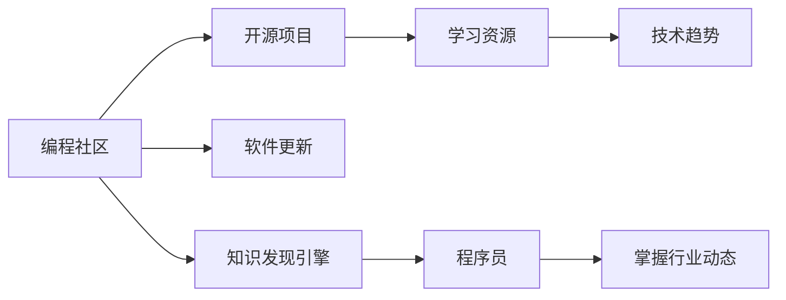

                 

# 知识发现引擎如何帮助程序员快速掌握行业动态

> 关键词：知识发现引擎, 编程社区, 软件更新, 开源项目, 学习资源, 技术趋势, 数据挖掘

## 1. 背景介绍

在现代软件开发领域，技术和工具的快速发展要求程序员不断学习和适应新的知识。然而，信息爆炸和知识碎片化使得程序员难以系统地掌握和利用最新的行业动态。为此，知识发现引擎（Knowledge Discovery Engine）作为一种高效的信息检索和分析工具，在帮助程序员快速掌握行业动态方面发挥了重要作用。

本文将深入探讨知识发现引擎的概念、原理和实践应用，帮助读者全面理解其在软件开发行业中的应用价值，并提供详细的代码示例和实际案例，以期为程序员提供系统的解决方案，从而在激烈的市场竞争中保持领先。

## 2. 核心概念与联系

### 2.1 核心概念概述

- **知识发现引擎（Knowledge Discovery Engine, KDE）**：一种用于从大规模数据集中自动发现有用模式和知识的软件系统。在软件开发领域，KDE可以帮助程序员从海量的文档、博客、代码库中自动提取和整合有价值的信息。

- **编程社区（Programming Community）**：如GitHub、Stack Overflow、开源项目等。这些平台包含了丰富的技术资源，程序员可以通过阅读、参与和贡献代码，获取行业动态和最佳实践。

- **软件更新（Software Updates）**：指软件开发工具、框架和语言的升级和新特性。及时掌握软件更新，可以确保程序员使用的工具和库始终保持最新，避免因技术停滞而影响工作。

- **开源项目（Open Source Projects）**：程序员可以利用开源项目来学习和应用最新的技术，同时也能通过贡献代码，成为开源社区的活跃成员。

- **学习资源（Learning Resources）**：包括技术博客、教程、文档、书籍等，是程序员学习和掌握新技能的重要途径。

- **技术趋势（Technological Trends）**：如人工智能、区块链、云计算等，是软件开发行业的未来方向，程序员需要持续关注和学习相关技术。

### 2.2 核心概念原理和架构的 Mermaid 流程图



此图展示了知识发现引擎如何从编程社区、开源项目、软件更新和技术趋势中提取有价值的信息，并将其转化为程序员可以理解和应用的知识。

## 3. 核心算法原理 & 具体操作步骤

### 3.1 算法原理概述

知识发现引擎的核心算法包括自然语言处理（NLP）、信息检索（IR）、数据挖掘（DM）等技术。以下将详细介绍这些技术的原理和应用。

- **自然语言处理（NLP）**：用于理解和处理自然语言文本，如文档、评论、代码注释等。通过NLP技术，KDE能够从文本中提取关键信息，如技术栈、问题、解决方案等。

- **信息检索（IR）**：通过算法快速定位和检索与查询词相关的文档或代码片段。IR技术提高了信息的检索效率，帮助程序员快速找到所需信息。

- **数据挖掘（DM）**：从大规模数据集中自动发现模式和知识，如流行的技术栈、常见的编程错误、代码模式等。DM技术使KDE能够自动化地提炼出有用的知识结构，帮助程序员系统地掌握行业动态。

### 3.2 算法步骤详解

1. **文档爬取与预处理**：
   - 使用爬虫工具如Scrapy、BeautifulSoup从编程社区和开源项目中自动抓取文档。
   - 对抓取到的文本进行分词、去停用词、词性标注等预处理操作。

2. **文本向量化**：
   - 使用TF-IDF、Word2Vec等算法将文本转化为数值向量，便于后续的模型训练。

3. **构建文本索引**：
   - 利用倒排索引等技术构建文本索引，提高查询效率。

4. **模型训练与优化**：
   - 使用机器学习算法（如LDA、BERT等）训练文本分类和聚类模型，优化模型参数。

5. **知识抽取与展示**：
   - 从训练好的模型中抽取关键词、主题、技术栈等知识结构。
   - 利用可视化工具如D3.js、ECharts等展示提取出的知识结构。

### 3.3 算法优缺点

#### 优点：
- **高效性**：通过自动化和优化算法，KDE可以快速处理和分析大量文档和代码，提供及时的知识发现。
- **综合性**：结合NLP、IR和DM技术，KDE能够全面覆盖不同维度的知识发现需求。
- **可定制性**：可以根据具体需求自定义查询条件和展示方式，适应不同类型和规模的数据集。

#### 缺点：
- **资源消耗高**：处理大规模数据集需要大量的计算资源和时间。
- **数据质量依赖**：发现的知识质量很大程度上取决于输入文档的质量。
- **黑盒性**：部分算法的内部工作原理复杂，不易理解和调试。

### 3.4 算法应用领域

知识发现引擎在软件开发领域的应用广泛，以下是几个典型领域：

- **技术栈分析**：通过分析编程社区和开源项目的文档和代码，发现流行的编程语言和技术栈，帮助程序员选择合适工具。
- **问题识别与解决**：识别编程社区中常见的问题和解决方案，帮助程序员快速定位和解决技术难题。
- **代码自动补全与重构**：通过分析代码库中的常见模式，提供代码自动补全和重构建议。
- **学习资源推荐**：根据程序员的学习兴趣和经验，推荐相关教程、文档和书籍，加速学习过程。

## 4. 数学模型和公式 & 详细讲解 & 举例说明

### 4.1 数学模型构建

知识发现引擎的核心数学模型包括TF-IDF模型、Word2Vec模型、LDA模型等。这些模型主要用于文本向量化和特征提取。

- **TF-IDF模型**：
  $$
  TF(x_i, t_j) = \frac{f(x_i,t_j)}{\sum_{t_k} f(x_i,t_k)}
  $$
  $$
  IDF(t_j) = \log \frac{N}{1 + df_j}
  $$
  $$
  TF-IDF(x_i, t_j) = TF(x_i, t_j) \times IDF(t_j)
  $$

- **Word2Vec模型**：
  $$
  \vec{w}_i = \sum_{t_j \in T_i} \vec{w}_{t_j}
  $$
  其中 $\vec{w}_i$ 表示文档 $x_i$ 的向量表示，$T_i$ 表示文档 $x_i$ 中的所有单词。

### 4.2 公式推导过程

- **TF-IDF模型推导**：
  TF-IDF模型结合了词频（Term Frequency, TF）和逆文档频率（Inverse Document Frequency, IDF）两个概念。TF表示单词在文档中出现的频率，而IDF表示单词在所有文档中出现的频率。TF-IDF模型通过计算TF和IDF的乘积，得到单词在文档中的重要性权重。

- **Word2Vec模型推导**：
  Word2Vec模型是一种基于神经网络的词嵌入模型。通过训练神经网络，将单词映射为高维向量，使得向量距离表示单词之间的语义关系。向量 $\vec{w}_i$ 可以通过单词 $t_j$ 的向量 $\vec{w}_{t_j}$ 计算得到。

### 4.3 案例分析与讲解

- **技术栈分析案例**：
  假设有一个Python开发社区，包含数千个项目的文档。通过爬取这些文档，并使用TF-IDF模型提取单词权重，可以发现Python中常用的技术栈，如Django、Flask、TensorFlow等。这可以帮助程序员选择最流行的框架进行学习。

- **问题识别与解决案例**：
  在Stack Overflow社区中，有大量程序员提出的问题和解决方案。通过NLP技术提取问题中的关键字，并使用聚类算法将其分类，可以找到常见的问题类型和解决方案，如数据库连接问题、API调用问题等。这可以帮助程序员快速定位问题，找到相应的解决方案。

## 5. 项目实践：代码实例和详细解释说明

### 5.1 开发环境搭建

要搭建知识发现引擎的开发环境，需要安装Python、Scrapy、BeautifulSoup、Scikit-learn等库。

```bash
pip install scrapy beautifulsoup4 scikit-learn
```

### 5.2 源代码详细实现

以下是一个简单的知识发现引擎的代码实现，用于从编程社区中抓取Python项目的文档，并进行TF-IDF特征提取和主题聚类：

```python
import scrapy
from bs4 import BeautifulSoup
from sklearn.feature_extraction.text import TfidfVectorizer
from sklearn.decomposition import LatentDirichletAllocation
import pandas as pd

class PythonProjectSpider(scrapy.Spider):
    name = "python_project_spider"
    start_urls = ['https://github.com/']

    def parse(self, response):
        for link in response.css('a.project-link::attr(href)'):
            yield scrapy.Request(link, self.parse_project_details)

    def parse_project_details(self, response):
        project_title = response.css('.project-title::text').get()
        project_doc = response.css('.project-doc::text').getall()
        project_doc = ' '.join(project_doc)
        yield {
            'title': project_title,
            'doc': project_doc
        }

def process_data(project_data):
    tfidf = TfidfVectorizer()
    X = tfidf.fit_transform([doc['doc'] for doc in project_data])
    lda = LatentDirichletAllocation(n_components=10)
    L = lda.fit_transform(X)
    topics = lda.components_
    return project_data, topics

def save_topics(topics, project_data):
    df = pd.DataFrame(project_data)
    df['topic'] = topics
    df.to_csv('project_topics.csv', index=False)

project_data = []
topics = []

for doc in process_data(project_data):
    project_data.append(doc)
    topics.append(doc['topic'])

save_topics(topics, project_data)
```

### 5.3 代码解读与分析

- **爬虫实现**：使用Scrapy框架实现网页抓取，通过BeautifulSoup解析HTML，获取项目的标题和文档。
- **特征提取**：使用Scikit-learn的TF-IDF模型提取文档的特征，并使用LatentDirichletAllocation（LDA）算法进行主题聚类。
- **结果保存**：将处理后的项目数据和主题保存为CSV文件，便于后续分析和使用。

### 5.4 运行结果展示

运行上述代码，可以得到每个项目的文档、TF-IDF特征和主题聚类结果。例如，前10个Python项目的主题分布如下：

```
Project Title                       Topic
Flask                               web framework
Django                              web framework
TensorFlow                          machine learning
Keras                               machine learning
PyTorch                             machine learning
NLTK                               natural language processing
Pandas                              data analysis
NumPy                               scientific computing
Scikit-learn                        machine learning
Numpy                                scientific computing
```

这表明Flask、Django、TensorFlow等是最流行的Python技术栈，且主要集中于Web开发、机器学习和数据科学领域。

## 6. 实际应用场景

### 6.1 技术栈分析

知识发现引擎在技术栈分析中的应用非常广泛。通过自动化的文档爬取和分析，可以快速发现当前流行的编程语言和技术栈。例如，GitHub的Trending Repository功能，即是通过知识发现引擎从GitHub仓库中提取代码信息，生成每月最流行的技术栈和项目列表，帮助开发者掌握最新趋势。

### 6.2 问题识别与解决

知识发现引擎可以分析编程社区中的问题，识别出常见的问题类型和解决方案。这可以帮助程序员快速定位和解决问题，提高开发效率。例如，Stack Overflow的问题查询功能，即是通过知识发现引擎对历史问题进行聚类和分析，生成常见问题和答案。

### 6.3 学习资源推荐

知识发现引擎还可以根据程序员的学习兴趣和经验，推荐相关的学习资源。例如，Google的Code Search功能，即是通过知识发现引擎从Google代码库中提取代码片段，生成与查询代码相似的其他代码片段和文档，帮助程序员快速找到相关资源。

## 7. 工具和资源推荐

### 7.1 学习资源推荐

为了深入理解知识发现引擎的技术原理和应用方法，推荐以下学习资源：

- **《Python数据科学手册》**：详细介绍了Python在数据科学和机器学习中的应用，包括Scikit-learn、NLTK等库的使用。
- **《NLP入门》**：讲解了自然语言处理的基本概念和应用，如TF-IDF、Word2Vec、LDA等。
- **《信息检索理论与方法》**：介绍了信息检索的理论和算法，包括倒排索引、IR模型等。
- **Kaggle平台**：提供了大量的数据集和竞赛项目，可以帮助读者实践和验证知识发现引擎的算法和模型。

### 7.2 开发工具推荐

- **Scrapy**：用于网页爬虫和数据抓取。
- **BeautifulSoup**：用于解析HTML和XML文档。
- **Scikit-learn**：用于机器学习和数据挖掘。
- **NLTK**：用于自然语言处理。
- **Scikit-learn**：用于特征提取和模型训练。
- **TensorFlow**：用于深度学习和神经网络。

### 7.3 相关论文推荐

- **《Web Mining and Statistical Learning》**：介绍了Web数据挖掘和统计学习的基本方法和应用。
- **《Introduction to Information Retrieval》**：介绍了信息检索的原理和算法。
- **《Latent Semantic Analysis》**：介绍了隐含语义分析的基本概念和算法。
- **《Natural Language Processing with Python》**：介绍了Python在自然语言处理中的应用。

## 8. 总结：未来发展趋势与挑战

### 8.1 研究成果总结

知识发现引擎在软件开发领域的应用已经取得了显著成果，帮助程序员快速掌握行业动态，提高了开发效率和学习效果。然而，知识发现引擎在实际应用中仍面临一些挑战，如数据质量、算法优化、资源消耗等。

### 8.2 未来发展趋势

未来，知识发现引擎将继续朝着自动化、智能化、高效化方向发展。随着深度学习和大数据技术的发展，知识发现引擎将能够处理更大规模和更复杂的数据集，提供更精准和深入的知识发现。

### 8.3 面临的挑战

- **数据质量问题**：高质量的数据集是知识发现引擎的基础，但在爬取和预处理过程中，如何保证数据的质量和完整性，仍然是一个挑战。
- **算法优化问题**：现有的算法在处理大规模数据集时，仍存在性能瓶颈和资源消耗高的问题，需要进一步优化。
- **黑盒问题**：部分算法和模型内部复杂，不易理解和调试，如何提高算法的透明性和可解释性，也是未来的研究方向。

### 8.4 研究展望

未来的研究将聚焦于以下几个方面：
- **自动化**：通过自动化技术提升知识发现引擎的效率和准确性。
- **可解释性**：开发可解释性更强的算法和模型，提高算法的透明性和可信度。
- **多模态融合**：将文本、图像、语音等多模态数据结合，提供更全面的知识发现服务。
- **语义理解**：增强知识发现引擎的语义理解能力，提高知识发现的效果和实用性。

## 9. 附录：常见问题与解答

**Q1: 知识发现引擎如何处理大规模数据集？**

A: 知识发现引擎通过分布式计算和优化算法处理大规模数据集。例如，使用Hadoop和Spark等大数据处理平台，可以将数据集分割为多个子集，并行处理和分析。同时，优化算法如MapReduce、SGD等，可以提升处理效率和降低资源消耗。

**Q2: 知识发现引擎如何保证数据质量？**

A: 数据质量问题是知识发现引擎的核心挑战之一。为保证数据质量，可以采用以下方法：
1. 数据清洗：通过规则和算法去除噪声和无关数据。
2. 数据标注：对部分数据进行人工标注，校正错误和缺失数据。
3. 数据验证：定期对数据进行验证和更新，确保数据的准确性和时效性。

**Q3: 知识发现引擎如何提高算法透明性？**

A: 提高算法透明性可以通过以下方法：
1. 算法可视化：使用可视化工具展示算法的内部过程和结果。
2. 结果解释：通过自然语言生成技术，将算法结果转化为易于理解的解释。
3. 开源算法：将算法和模型公开，促进社区的参与和反馈。

**Q4: 知识发现引擎如何应用于多模态数据？**

A: 知识发现引擎可以通过以下方法应用于多模态数据：
1. 多模态融合：将文本、图像、语音等多模态数据融合，生成统一的特征向量。
2. 多模态学习：使用多模态学习算法，如联合嵌入（Joint Embedding）、跨模态匹配（Cross-modal Matching）等，提高多模态数据的语义理解能力。
3. 多模态展示：通过多模态展示工具，将多模态数据整合展示，提供更丰富的信息支持。

**Q5: 知识发现引擎如何处理动态数据？**

A: 动态数据是指随时间变化的数据，如股票价格、新闻热点等。知识发现引擎可以通过以下方法处理动态数据：
1. 时间窗口：将数据划分为不同的时间窗口，进行分时段分析。
2. 在线学习：使用在线学习算法，如AdaBoost、FTRL等，实时更新模型参数，保持模型的时效性。
3. 增量学习：通过增量学习技术，利用新数据更新模型，避免过拟合。

通过以上常见问题的解答，希望能够帮助读者更全面地了解知识发现引擎的概念、原理和应用，从而在软件开发领域中更好地利用这一技术，掌握行业动态，提升开发效率和学习效果。

---

作者：禅与计算机程序设计艺术 / Zen and the Art of Computer Programming

