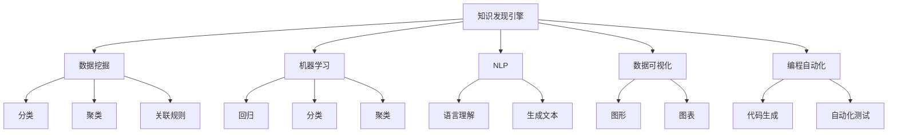

                 

# 知识发现引擎如何改变程序员的工作模式

> 关键词：知识发现引擎, 大数据分析, 人工智能, 数据挖掘, 编程自动化, 数据可视, 自然语言处理

## 1. 背景介绍

在互联网和大数据飞速发展的时代，数据已经成为了一种宝贵的资源。面对海量数据，如何从中提取有价值的信息和洞见，成为了企业竞争的核心优势。随着人工智能和数据科学技术的不断进步，知识发现引擎（Knowledge Discovery Engine, KDE）应运而生，不仅改变了数据的处理方式，也彻底重塑了程序员的工作模式。

### 1.1 数据驱动的决策支持

知识发现引擎的核心理念是通过数据驱动，帮助企业做出更加明智的决策。在这个过程中，程序员需要利用机器学习、数据挖掘等技术，从数据中提取有价值的模式和洞见，并以此为基础，构建决策支持系统。随着KDE技术的日益成熟，数据分析过程变得更加自动化和智能化，程序员的工作重点也从数据处理转向了模型的训练和优化。

### 1.2 大数据技术的应用

知识发现引擎的兴起，催生了大数据技术（Big Data）的快速发展。程序员需要掌握Hadoop、Spark等大数据处理框架，以及MapReduce、Spark SQL等分布式计算技术，处理海量数据。同时，为了提升数据处理和分析的效率，程序员还需要学习数据缓存技术、流处理技术等，以实现数据的实时分析和处理。

## 2. 核心概念与联系

### 2.1 核心概念概述

为更好地理解知识发现引擎的工作原理和应用，本节将介绍几个密切相关的核心概念：

- 知识发现引擎（KDE）：利用数据挖掘和人工智能技术，从大量数据中提取知识，形成模型，并用于辅助决策的过程。
- 数据挖掘（Data Mining）：从数据集中发现有用模式和知识的过程。包括分类、聚类、关联规则挖掘等。
- 机器学习（Machine Learning）：让计算机通过学习数据，获得预测能力的过程。常用的算法包括回归、分类、聚类、神经网络等。
- 自然语言处理（Natural Language Processing, NLP）：使计算机能够理解、分析和生成人类语言的过程。
- 数据可视化（Data Visualization）：将数据转换为图形、图表等直观形式，以便于分析和展示。
- 编程自动化（Programmation Automation）：通过自动生成代码、自动化测试等技术，提升软件开发效率。

这些核心概念之间的逻辑关系可以通过以下Mermaid流程图来展示：



这个流程图展示了知识发现引擎与相关核心概念之间的联系：

1. 知识发现引擎利用数据挖掘和机器学习技术，从数据中发现知识。
2. 数据挖掘包括分类、聚类、关联规则挖掘等基础操作。
3. 机器学习包括回归、分类、聚类等高级操作。
4. 自然语言处理使计算机能够理解、分析和生成人类语言。
5. 数据可视化将数据转换为图形、图表等直观形式。
6. 编程自动化通过自动生成代码、自动化测试等技术，提升软件开发效率。

这些核心概念共同构成了知识发现引擎的完整技术栈，使其能够高效地从数据中提取有价值的信息。

## 3. 核心算法原理 & 具体操作步骤

### 3.1 算法原理概述

知识发现引擎的算法原理基于数据挖掘和机器学习。其核心思想是：通过分析数据集中的模式和关联规则，构建模型，从而预测未来行为或发现潜在问题。典型的算法包括分类算法、聚类算法、关联规则算法等。

在实践中，知识发现引擎的算法流程通常包括以下几个关键步骤：

1. 数据预处理：清洗、归一化、去噪等。
2. 特征工程：选择、构造、优化特征变量。
3. 模型训练：选择合适的算法和参数，训练模型。
4. 模型评估：使用验证集或测试集评估模型性能。
5. 模型应用：使用模型进行预测或发现知识。

### 3.2 算法步骤详解

以分类算法为例，其详细步骤包括：

1. **数据准备**：将数据集分为训练集和测试集。
2. **特征选择**：选择有代表性的特征变量。
3. **模型训练**：使用训练集数据训练分类模型。
4. **模型评估**：在测试集上评估模型性能，如准确率、召回率、F1分数等。
5. **模型优化**：调整算法参数，改进模型。
6. **模型应用**：使用优化后的模型进行预测或发现新知识。

具体实现过程中，程序员需要掌握数据预处理、特征选择、模型训练、模型评估等关键技术，以及常用的机器学习库和框架，如Scikit-Learn、TensorFlow、PyTorch等。

### 3.3 算法优缺点

知识发现引擎的算法具有以下优点：

1. 自动化程度高：算法可以自动完成数据预处理、特征选择、模型训练等步骤，大大提高了工作效率。
2. 可解释性强：通过分析模型内部参数，程序员可以更好地理解模型的预测逻辑和决策过程。
3. 泛化能力强：算法可以学习到数据集中的通用模式和规律，具有较好的泛化能力。

然而，知识发现引擎的算法也存在一些缺点：

1. 对数据质量要求高：数据质量和特征选择对算法性能影响巨大，需要程序员在数据预处理阶段进行细致处理。
2. 对参数调优敏感：算法性能高度依赖于参数设置，需要进行反复试验和调优。
3. 对异常值敏感：数据中的异常值可能严重影响算法性能，需要进行异常值处理。
4. 模型复杂度高：部分算法如神经网络，模型参数众多，训练和推理速度较慢。

### 3.4 算法应用领域

知识发现引擎的算法广泛应用于各个领域，例如：

- 金融风险管理：利用分类算法预测信用风险，利用聚类算法进行用户分群。
- 零售客户分析：利用关联规则算法发现购物行为中的关联规则，利用聚类算法进行客户分群。
- 医疗诊断：利用分类算法预测疾病风险，利用聚类算法进行疾病分群。
- 社交媒体分析：利用情感分析算法发现用户情感，利用聚类算法进行用户分群。
- 舆情分析：利用文本分类算法发现舆情主题，利用聚类算法进行舆情分群。

## 4. 数学模型和公式 & 详细讲解 & 举例说明

### 4.1 数学模型构建

知识发现引擎的数学模型通常基于机器学习算法，如决策树、随机森林、神经网络等。以神经网络模型为例，其数学模型可以表示为：

$$
f(x) = W \cdot x + b
$$

其中 $f(x)$ 为输出，$x$ 为输入，$W$ 和 $b$ 为模型参数。

### 4.2 公式推导过程

以神经网络中的前向传播为例，其公式推导过程如下：

1. 输入层：将输入数据 $x$ 线性变换为中间变量 $h$，表示为 $h = W \cdot x + b$。
2. 隐藏层：将中间变量 $h$ 通过激活函数 $f$ 转化为新的特征表示，表示为 $h' = f(h)$。
3. 输出层：将新的特征表示 $h'$ 线性变换为输出结果 $y$，表示为 $y = W' \cdot h' + b'$。

### 4.3 案例分析与讲解

以金融信用风险预测为例，利用逻辑回归算法构建数学模型。假设训练集为 $D=\{(x_i, y_i)\}_{i=1}^N$，其中 $x_i$ 为输入特征，$y_i$ 为二元输出标签（0表示不违约，1表示违约）。则逻辑回归模型的数学公式为：

$$
\log\left(\frac{P(y=1|x)}{P(y=0|x)}\right) = W \cdot x + b
$$

其中 $P(y=1|x)$ 为违约概率，$P(y=0|x)$ 为不违约概率。

## 5. 项目实践：代码实例和详细解释说明

### 5.1 开发环境搭建

在进行知识发现引擎项目实践前，我们需要准备好开发环境。以下是使用Python进行Scikit-Learn开发的环境配置流程：

1. 安装Anaconda：从官网下载并安装Anaconda，用于创建独立的Python环境。

2. 创建并激活虚拟环境：
```bash
conda create -n scikit-learn-env python=3.8 
conda activate scikit-learn-env
```

3. 安装Scikit-Learn：
```bash
pip install scikit-learn
```

4. 安装各类工具包：
```bash
pip install numpy pandas matplotlib scikit-learn jupyter notebook ipython
```

完成上述步骤后，即可在`scikit-learn-env`环境中开始项目实践。

### 5.2 源代码详细实现

下面我们以信用风险预测为例，给出使用Scikit-Learn进行逻辑回归模型训练的PyTorch代码实现。

首先，定义训练数据：

```python
from sklearn.datasets import make_classification
from sklearn.model_selection import train_test_split
import numpy as np

X, y = make_classification(n_samples=1000, n_features=10, n_informative=5, n_redundant=0, random_state=42)
X_train, X_test, y_train, y_test = train_test_split(X, y, test_size=0.2, random_state=42)
```

然后，定义模型和评估函数：

```python
from sklearn.linear_model import LogisticRegression
from sklearn.metrics import accuracy_score

model = LogisticRegression()

def train_model(model, X_train, y_train):
    model.fit(X_train, y_train)
    return model

def evaluate_model(model, X_test, y_test):
    y_pred = model.predict(X_test)
    accuracy = accuracy_score(y_test, y_pred)
    print(f"Accuracy: {accuracy:.2f}")
```

接着，启动模型训练流程：

```python
model = train_model(model, X_train, y_train)
evaluate_model(model, X_test, y_test)
```

以上就是使用Scikit-Learn进行逻辑回归模型训练的完整代码实现。可以看到，Scikit-Learn提供了强大的数据处理和模型训练功能，使得模型训练和评估过程变得非常简单。

### 5.3 代码解读与分析

让我们再详细解读一下关键代码的实现细节：

**make_classification函数**：
- 生成随机二元分类数据集。
- 参数解释：n_samples：样本数；n_features：特征数；n_informative：有信息特征数；n_redundant：冗余特征数；random_state：随机种子。

**train_test_split函数**：
- 将数据集分为训练集和测试集。
- 参数解释：test_size：测试集占总样本的比例；random_state：随机种子。

**LogisticRegression类**：
- 实现逻辑回归模型。
- 参数解释：fit方法：训练模型；predict方法：预测结果。

**accuracy_score函数**：
- 计算预测结果的准确率。
- 参数解释：y_test：真实标签；y_pred：预测标签。

可以看到，Scikit-Learn通过封装常用的机器学习算法，使得模型训练和评估变得非常简单。程序员只需要关注算法的设计和参数调优，而无需关注底层实现细节。

当然，工业级的系统实现还需考虑更多因素，如模型的保存和部署、超参数的自动搜索、更灵活的任务适配层等。但核心的知识发现引擎思想基本与此类似。

## 6. 实际应用场景

### 6.1 金融风险管理

知识发现引擎在金融风险管理中的应用非常广泛。通过分析历史信用数据，利用分类算法可以预测客户的违约概率，及时发现高风险客户。同时，利用聚类算法可以将客户分成不同的群体，针对不同群体采取差异化的风险管理策略，从而降低风险损失。

在技术实现上，可以收集客户的信用数据，如收入、债务、贷款历史等，并对其进行清洗、归一化等预处理。在此基础上，使用逻辑回归、随机森林等算法训练模型，预测客户是否违约。对于预测结果，可以使用风险管理工具进行自动化处理，如增加保证金、降低信用额度等。

### 6.2 零售客户分析

零售企业通过知识发现引擎可以深入分析客户行为，发现潜在价值客户，提升客户转化率。利用关联规则算法可以发现购物行为中的关联规则，如某商品与某商品的购买频率。利用聚类算法可以将客户分成不同的群体，针对不同群体采取不同的营销策略，提升客户满意度和忠诚度。

在技术实现上，可以收集客户的购物记录、购买行为等数据，并对其进行清洗、归一化等预处理。在此基础上，使用Apriori算法等关联规则算法，发现购物行为中的关联规则。对于关联规则，可以使用可视化工具进行展示，帮助企业理解客户行为。

### 6.3 医疗诊断

医疗领域可以利用知识发现引擎进行疾病预测和分群。通过分析历史病历数据，利用分类算法可以预测患者是否患有某种疾病。同时，利用聚类算法可以将患者分成不同的群体，针对不同群体采取不同的治疗方案，提升治疗效果。

在技术实现上，可以收集患者的病历数据，如年龄、性别、症状、诊断结果等，并对其进行清洗、归一化等预处理。在此基础上，使用支持向量机（SVM）、随机森林等算法训练模型，预测患者是否患有某种疾病。对于预测结果，可以使用可视化工具进行展示，帮助医生理解病情。

### 6.4 社交媒体分析

社交媒体平台可以通过知识发现引擎分析用户情感和话题。利用情感分析算法可以发现用户的情感倾向，如积极、消极、中性等。利用聚类算法可以将用户分成不同的群体，针对不同群体采取不同的策略，提升用户满意度。

在技术实现上，可以收集用户的社交媒体数据，如评论、点赞、分享等，并对其进行清洗、归一化等预处理。在此基础上，使用情感分析算法进行情感识别。对于情感结果，可以使用可视化工具进行展示，帮助平台理解用户情感。

## 7. 工具和资源推荐

### 7.1 学习资源推荐

为了帮助开发者系统掌握知识发现引擎的理论基础和实践技巧，这里推荐一些优质的学习资源：

1. 《Python数据科学手册》系列博文：由数据科学专家撰写，深入浅出地介绍了数据科学的基本概念和实用技巧。

2. Coursera《机器学习》课程：由斯坦福大学开设的机器学习课程，涵盖算法原理和实际应用，是入门机器学习的必选课程。

3. Kaggle平台：全球最大的数据科学竞赛平台，提供大量数据集和开源代码，是实战学习的绝佳资源。

4. Scikit-Learn官方文档：Scikit-Learn的官方文档，提供了丰富的算法和示例代码，是上手实践的必备资料。

5. PyTorch官方文档：PyTorch的官方文档，提供了深度学习框架的使用教程和案例代码，适合进行实际应用开发。

通过对这些资源的学习实践，相信你一定能够快速掌握知识发现引擎的精髓，并用于解决实际的NLP问题。

### 7.2 开发工具推荐

高效的开发离不开优秀的工具支持。以下是几款用于知识发现引擎开发的常用工具：

1. Python：基于Python的开源编程语言，数据处理能力强，适合进行数据分析和机器学习。

2. Jupyter Notebook：交互式编程环境，支持代码编写、数据可视和结果展示，是数据科学家的首选工具。

3. Scikit-Learn：Python的机器学习库，提供了丰富的算法和工具，适合进行模型训练和评估。

4. TensorFlow：由Google主导开发的深度学习框架，生产部署方便，适合大规模工程应用。

5. PyTorch：由Facebook主导开发的深度学习框架，灵活高效，适合进行深度学习模型开发。

合理利用这些工具，可以显著提升知识发现引擎的开发效率，加快创新迭代的步伐。

### 7.3 相关论文推荐

知识发现引擎的研究涉及机器学习、数据科学、自然语言处理等多个领域，以下是几篇奠基性的相关论文，推荐阅读：

1. Quinlan, J.R.（1986）。《决策树诱导算法》。机器学习第1卷。麻省理工学院出版社。

2. Hastie, T., Tibshirani, R., & Friedman, J.（2009）。《The Elements of Statistical Learning》。第二版。

3. Hinton, G. E., & Salakhutdinov, R. R.（2006）。《Reducing the Dimensionality of Data with Neural Networks》。科学第313卷。

4. Goodfellow, I., Bengio, Y., & Courville, A.（2016）。《深度学习》。第一版。

5. Abadi, M., et al.（2015）。《TensorFlow: A System for Large-Scale Machine Learning》。计算机系统论文集，第11卷。

这些论文代表了大规模数据挖掘和知识发现技术的发展脉络。通过学习这些前沿成果，可以帮助研究者把握学科前进方向，激发更多的创新灵感。

## 8. 总结：未来发展趋势与挑战

### 8.1 总结

本文对知识发现引擎进行了全面系统的介绍。首先阐述了知识发现引擎和大数据技术的兴起背景，明确了其在数据驱动决策支持中的应用价值。其次，从原理到实践，详细讲解了知识发现引擎的算法原理和具体操作步骤，给出了模型训练和评估的完整代码实例。同时，本文还广泛探讨了知识发现引擎在金融风险管理、零售客户分析、医疗诊断、社交媒体分析等多个行业领域的应用前景，展示了知识发现引擎的巨大潜力。此外，本文精选了知识发现引擎的学习资源，力求为读者提供全方位的技术指引。

通过本文的系统梳理，可以看到，知识发现引擎正在成为数据科学和人工智能技术的重要范式，极大地拓展了数据处理和分析的边界，催生了更多的落地场景。伴随预训练语言模型和微调方法的持续演进，相信知识发现引擎必将在构建智能决策支持系统和智能交互系统中扮演越来越重要的角色。

### 8.2 未来发展趋势

展望未来，知识发现引擎技术将呈现以下几个发展趋势：

1. 自动化程度更高。知识发现引擎将进一步集成自动化工具，如自动特征选择、自动模型调优等，自动化程度和智能化水平将不断提高。

2. 数据源更加多样化。未来知识发现引擎将支持更多类型的数据源，包括非结构化数据、时序数据、物联网数据等，数据处理和分析的灵活性将进一步增强。

3. 实时处理能力更强。知识发现引擎将支持实时处理和流数据处理，能够在实时数据流中进行高效分析，满足实时决策需求。

4. 模型可解释性更强。未来的知识发现引擎将提供更好的模型解释功能，帮助用户理解模型的决策过程和输出结果，提升系统的可解释性和可信度。

5. 多模态数据融合。未来的知识发现引擎将支持多模态数据的融合，结合视觉、语音、文本等多模态信息，提升模型的综合分析能力。

6. 更广泛的应用场景。知识发现引擎将应用于更多领域，如智能制造、智慧城市、智能家居等，为各行各业提供智能决策支持。

以上趋势凸显了知识发现引擎技术的广阔前景。这些方向的探索发展，必将进一步提升知识发现引擎的性能和应用范围，为构建人机协同的智能决策系统铺平道路。

### 8.3 面临的挑战

尽管知识发现引擎技术已经取得了瞩目成就，但在迈向更加智能化、普适化应用的过程中，它仍面临着诸多挑战：

1. 数据质量问题。数据质量和特征选择对知识发现引擎的性能影响巨大，需要程序员在数据预处理阶段进行细致处理。

2. 模型复杂度问题。部分算法如神经网络，模型参数众多，训练和推理速度较慢。

3. 数据安全和隐私问题。在处理敏感数据时，如何保证数据安全和隐私保护，需要程序员在设计和实现过程中加以重视。

4. 算法透明性问题。模型的内部工作机制和决策过程难以解释，如何提供更好的模型解释功能，还需要进一步研究。

5. 数据一致性问题。数据来自不同来源，如何保证数据一致性，避免数据偏差，也需要程序员在数据处理和模型训练阶段加以处理。

6. 资源消耗问题。知识发现引擎处理海量数据时，如何优化资源使用，避免资源浪费，也需要程序员在设计系统时加以考虑。

这些挑战凸显了知识发现引擎技术在实际应用中的复杂性和难度。未来，只有不断优化算法、提升技术水平，才能更好地应对这些挑战，推动知识发现引擎技术的进步。

### 8.4 研究展望

面向未来，知识发现引擎技术的研究方向将包括：

1. 自动化特征选择。通过自动特征选择技术，提升数据处理效率和模型性能。

2. 模型压缩与加速。通过模型压缩和加速技术，提升知识发现引擎的实时处理能力。

3. 多模态数据融合。通过多模态数据融合技术，提升模型的综合分析能力。

4. 数据安全和隐私保护。通过数据安全和隐私保护技术，提升系统的可信度和安全性。

5. 更好的模型解释。通过更好的模型解释技术，提升系统的可解释性和可信度。

6. 实时数据处理。通过实时数据处理技术，提升系统的实时处理能力。

这些研究方向将推动知识发现引擎技术不断进步，为数据驱动决策提供更加智能和高效的支持。总之，知识发现引擎技术还需要不断探索和创新，才能更好地适应未来数据驱动社会的需要。

## 9. 附录：常见问题与解答

**Q1：知识发现引擎与机器学习有什么区别？**

A: 知识发现引擎和机器学习都是数据科学的重要分支，但侧重点有所不同。机器学习关注模型训练和预测，而知识发现引擎侧重于从数据中发现知识和规律，用于辅助决策。知识发现引擎通常涉及更多元的数据源和多样的分析任务，如关联规则挖掘、聚类分析等，需要更为复杂的算法和技术。

**Q2：知识发现引擎的算法有哪些？**

A: 知识发现引擎的算法包括分类算法、聚类算法、关联规则算法等。常用的算法包括决策树、随机森林、逻辑回归、支持向量机、神经网络等。每种算法适用于不同的数据类型和分析任务，需要根据具体问题选择合适的算法。

**Q3：知识发现引擎如何应用于实际业务？**

A: 知识发现引擎的应用主要通过以下几个步骤：1. 数据收集与预处理：清洗、归一化、去噪等。2. 特征工程：选择、构造、优化特征变量。3. 模型训练：选择合适的算法和参数，训练模型。4. 模型评估：使用验证集或测试集评估模型性能。5. 模型应用：使用模型进行预测或发现新知识。6. 模型优化：调整算法参数，改进模型。

**Q4：知识发现引擎的编程语言有哪些？**

A: 知识发现引擎的编程语言包括Python、R、Java等。Python是当前最为流行的数据科学编程语言，拥有丰富的数据处理和机器学习库，如Scikit-Learn、TensorFlow、PyTorch等。R语言适合进行统计分析和数据可视化，Java语言适合进行大规模数据处理和应用开发。

**Q5：知识发现引擎的应用场景有哪些？**

A: 知识发现引擎的应用场景包括金融风险管理、零售客户分析、医疗诊断、社交媒体分析等。在金融领域，可以利用分类算法预测客户违约，利用聚类算法进行客户分群。在零售领域，可以利用关联规则算法发现购物行为中的关联规则，利用聚类算法进行客户分群。在医疗领域，可以利用分类算法预测疾病风险，利用聚类算法进行患者分群。在社交媒体领域，可以利用情感分析算法发现用户情感，利用聚类算法进行用户分群。

---

作者：禅与计算机程序设计艺术 / Zen and the Art of Computer Programming

