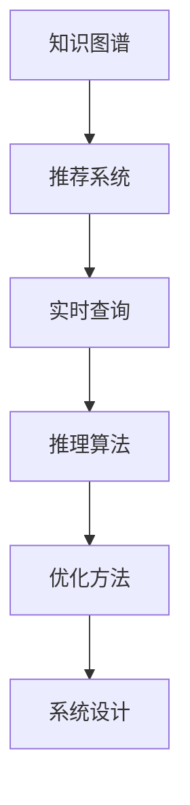

                 

# 知识发现引擎的实时推荐系统实现

> 关键词：知识图谱, 推荐系统, 实时查询, 推理算法, 优化方法, 系统设计

## 1. 背景介绍

### 1.1 问题由来
在现代信息爆炸的时代，用户能够接触到的信息量呈现出指数级的增长，如何帮助用户在海量信息中找到有用的内容，成为搜索引擎和推荐系统面临的重大挑战。随着知识图谱和大数据分析技术的发展，知识发现引擎（Knowledge Discovery Engine, KDE）应运而生。知识发现引擎利用结构化知识图谱，结合推荐算法，能够有效回答用户提出的各种复杂查询，并提供高度相关的结果，为用户带来更精确、更全面的信息服务。

近年来，实时推荐系统在电商、新闻、视频等领域得到广泛应用，极大地提升了用户体验。实时推荐系统通过不断获取用户的实时行为数据，实时分析并推荐符合用户兴趣的内容，能够最大化地满足用户需求，提升业务转化率。

知识发现引擎和实时推荐系统的结合，能够充分发挥两者优势，既能提供丰富的知识信息，又能保证推荐结果的及时性。因此，本文聚焦于如何构建一个高效的知识发现引擎实时推荐系统，以应对不断变化的复杂查询，并提供实时准确的推荐结果。

### 1.2 问题核心关键点
构建高效的知识发现引擎实时推荐系统，需要关注以下几个关键点：

1. **知识图谱的构建与更新**：构建高质量的知识图谱，并能够实时更新，是实现知识发现引擎的基础。
2. **推荐算法的优化**：选择或设计高效的推荐算法，能够实时处理用户查询，并返回最相关的内容。
3. **系统架构的设计**：设计合理的系统架构，能够支持大规模的实时查询和推荐，并提供可扩展、高并发的解决方案。
4. **实时查询的推理优化**：优化推理算法，提高实时查询的响应速度和准确率。
5. **性能调优**：对系统进行性能调优，提升实时推荐系统的响应速度和吞吐量。
6. **用户行为数据的分析与挖掘**：分析用户行为数据，挖掘用户兴趣和需求，用于推荐系统进行个性化推荐。

## 2. 核心概念与联系

### 2.1 核心概念概述

为更好地理解知识发现引擎实时推荐系统的构建过程，本节将介绍几个密切相关的核心概念：

- **知识图谱(Knowledge Graph)**：结构化的语义图谱，由实体、关系和属性组成，用于描述实体之间的关系，并支持自然语言查询。
- **推荐系统(Recommendation System)**：基于用户行为数据和模型，为用户提供个性化推荐的技术，能够提升用户体验，增加用户粘性。
- **实时查询(Real-time Query)**：用户提出的即时查询请求，要求系统快速响应用户需求，并提供准确的结果。
- **推理算法(Inference Algorithm)**：从知识图谱中推导出隐含的知识和关系，用于解答用户查询。
- **优化方法(Optimization Method)**：用于提升系统性能和响应速度的技术，包括并行处理、缓存、负载均衡等。
- **系统设计(System Design)**：涵盖系统架构、组件选择、数据存储等方面，确保系统能够高效、可靠地运行。

这些核心概念之间的逻辑关系可以通过以下Mermaid流程图来展示：



这个流程图展示了几者之间的逻辑关系：

1. 知识图谱作为推荐系统的基础，提供实体和关系信息。
2. 推荐系统根据用户行为和模型，生成个性化推荐。
3. 实时查询要求推荐系统快速响应用户需求。
4. 推理算法从知识图谱中推导用户查询的答案。
5. 优化方法提升系统的性能和响应速度。
6. 系统设计确保系统能够高效、可靠地运行。

## 3. 核心算法原理 & 具体操作步骤
### 3.1 算法原理概述

知识发现引擎实时推荐系统的核心算法包括知识图谱构建、推荐算法和推理算法。其基本原理如下：

1. **知识图谱构建**：从各类数据源（如维基百科、新闻、社交媒体等）中提取实体、关系和属性，构建知识图谱。
2. **推荐算法**：基于用户历史行为和模型，生成个性化推荐。
3. **推理算法**：从知识图谱中推导出用户查询的隐含知识，形成查询结果。

### 3.2 算法步骤详解

以下将详细介绍知识图谱构建、推荐算法和推理算法的具体步骤。

#### 3.2.1 知识图谱构建

知识图谱构建主要包括以下几个步骤：

1. **数据采集与预处理**：从各类数据源采集实体、关系和属性信息，并进行清洗、去重、标准化等预处理。
2. **实体识别与抽取**：使用命名实体识别（NER）技术，从文本中识别出实体。
3. **关系抽取**：使用关系抽取算法，从文本中抽取实体之间的隐含关系。
4. **属性抽取**：从文本中抽取实体的属性信息。
5. **知识图谱构建**：将实体、关系和属性信息构建为知识图谱，存储在图数据库中。

#### 3.2.2 推荐算法

推荐算法主要包括以下几个步骤：

1. **用户行为数据收集**：收集用户的历史行为数据，如浏览记录、购买记录等。
2. **用户行为建模**：使用协同过滤、基于内容的推荐等算法，建立用户兴趣模型。
3. **物品推荐**：基于用户兴趣模型，生成个性化推荐结果。

#### 3.2.3 推理算法

推理算法主要包括以下几个步骤：

1. **用户查询解析**：解析用户提出的自然语言查询，提取查询意图和关键词。
2. **知识图谱查询**：从知识图谱中查询与查询意图和关键词相关的实体和关系。
3. **推理计算**：使用基于图算法的推理算法，如PageRank、广度优先搜索等，推导出隐含的知识和关系。
4. **结果生成**：根据推理结果，生成用户查询的答案或推荐结果。

### 3.3 算法优缺点

知识发现引擎实时推荐系统具有以下优点：

1. **高精度**：基于知识图谱的推荐系统，能够提供更精确、更全面的推荐结果。
2. **实时性**：结合实时查询处理技术，能够快速响应用户需求。
3. **可扩展性**：系统架构设计合理，能够支持大规模数据的处理和存储。
4. **灵活性**：结合多模态数据和多种推荐算法，能够满足不同用户的多样化需求。

同时，该系统也存在以下局限性：

1. **数据采集成本高**：构建高质量的知识图谱需要大量的数据采集和处理成本。
2. **推理计算复杂**：复杂的推理算法可能会带来较大的计算负担。
3. **推荐算法单一**：目前主要依赖于协同过滤和基于内容的推荐算法，需要进一步优化。
4. **实时性瓶颈**：实时查询处理和推理计算可能会成为系统性能的瓶颈。

## 4. 数学模型和公式 & 详细讲解 & 举例说明

### 4.1 数学模型构建

本节将使用数学语言对知识发现引擎实时推荐系统的构建过程进行更加严格的刻画。

记知识图谱为 $G=(V,E)$，其中 $V$ 为实体集合，$E$ 为关系集合。用户查询 $Q$ 由自然语言文本构成，需解析为查询意图和关键词。推荐系统根据用户行为数据 $D$ 和模型 $M$，生成推荐结果 $R$。

定义用户行为数据 $D=\{(x_i,y_i)\}_{i=1}^N$，其中 $x_i$ 为用户行为记录，$y_i$ 为标签（如浏览、购买等）。用户兴趣模型 $M=\theta$，其中 $\theta$ 为模型参数。推荐结果 $R=\{(r_i,r_j)\}_{i=1}^N$，其中 $r_i$ 为用户 $i$ 的推荐结果，$r_j$ 为推荐结果的属性。

推荐算法的基本目标是最小化用户行为数据与推荐结果之间的误差，即：

$$
\min_{\theta} \sum_{i=1}^N \ell(Q_i,D_i,R_i)
$$

其中 $\ell$ 为误差函数，通常为均方误差、交叉熵等。

### 4.2 公式推导过程

以下我们以协同过滤推荐算法为例，推导推荐模型的误差函数和优化目标。

假设用户 $i$ 对物品 $j$ 的评分 $r_{i,j}$ 由协同过滤推荐算法生成，则推荐结果 $R_i=\{(r_{i,j})_{j=1}^M\}$。用户行为数据 $D_i=\{(x_{i,k},y_{i,k})\}_{k=1}^K$，其中 $x_{i,k}$ 为用户 $i$ 对物品 $k$ 的评分，$y_{i,k}$ 为标签。

协同过滤推荐算法可以使用基于矩阵分解的方法，如SVD分解，其误差函数为：

$$
\ell_i(r_{i,j},\hat{r}_{i,j}) = (r_{i,j}-\hat{r}_{i,j})^2
$$

其中 $\hat{r}_{i,j}$ 为协同过滤算法预测的用户 $i$ 对物品 $j$ 的评分。

将误差函数对模型参数 $\theta$ 求导，得到梯度向量：

$$
\nabla_{\theta}\ell_i(r_{i,j},\hat{r}_{i,j}) = -2(r_{i,j}-\hat{r}_{i,j})\frac{\partial \hat{r}_{i,j}}{\partial \theta}
$$

通过对所有用户 $i$ 的误差函数进行求和，得到总误差函数：

$$
\mathcal{L}(\theta) = \frac{1}{N} \sum_{i=1}^N \sum_{j=1}^M \ell_i(r_{i,j},\hat{r}_{i,j})
$$

最小化总误差函数，得到优化目标：

$$
\theta^* = \mathop{\arg\min}_{\theta} \mathcal{L}(\theta)
$$

在得到优化目标后，即可使用基于梯度的优化算法（如Adam、SGD等），更新模型参数 $\theta$，最小化总误差函数 $\mathcal{L}(\theta)$。

### 4.3 案例分析与讲解

以下以电商推荐系统为例，展示知识发现引擎实时推荐系统的应用过程。

假设某电商平台的推荐系统，希望根据用户历史浏览和购买行为，推荐用户可能感兴趣的商品。可以采用协同过滤推荐算法，结合知识图谱中的商品信息，生成推荐结果。具体步骤如下：

1. **数据采集与预处理**：从平台的用户行为日志中采集用户的浏览记录和购买记录，并进行清洗和预处理。
2. **用户行为建模**：使用协同过滤算法，建立用户兴趣模型。
3. **知识图谱查询**：查询知识图谱中的商品信息，获取与用户兴趣相关的商品。
4. **推理计算**：使用基于图算法的推理算法，推导出商品之间的关系，找到相关商品。
5. **结果生成**：根据推荐结果，生成用户推荐列表。

通过上述步骤，可以构建一个高效的知识发现引擎实时推荐系统，为用户提供个性化的商品推荐。

## 5. 项目实践：代码实例和详细解释说明
### 5.1 开发环境搭建

在进行知识发现引擎实时推荐系统的开发前，我们需要准备好开发环境。以下是使用Python进行PyTorch开发的环境配置流程：

1. 安装Anaconda：从官网下载并安装Anaconda，用于创建独立的Python环境。

2. 创建并激活虚拟环境：
```bash
conda create -n pytorch-env python=3.8 
conda activate pytorch-env
```

3. 安装PyTorch：根据CUDA版本，从官网获取对应的安装命令。例如：
```bash
conda install pytorch torchvision torchaudio cudatoolkit=11.1 -c pytorch -c conda-forge
```

4. 安装TensorFlow：由Google主导开发的开源深度学习框架，生产部署方便，适合大规模工程应用。同样有丰富的预训练语言模型资源。

5. 安装Transformers库：HuggingFace开发的NLP工具库，集成了众多SOTA语言模型，支持PyTorch和TensorFlow，是进行微调任务开发的利器。

6. 安装各类工具包：
```bash
pip install numpy pandas scikit-learn matplotlib tqdm jupyter notebook ipython
```

完成上述步骤后，即可在`pytorch-env`环境中开始微调实践。

### 5.2 源代码详细实现

下面我们以电商推荐系统为例，给出使用Transformers库对BERT模型进行微调的PyTorch代码实现。

首先，定义电商推荐任务的数据处理函数：

```python
from transformers import BertTokenizer
from torch.utils.data import Dataset
import torch

class RecommenderDataset(Dataset):
    def __init__(self, user_ids, item_ids, scores, tokenizer, max_len=128):
        self.user_ids = user_ids
        self.item_ids = item_ids
        self.scores = scores
        self.tokenizer = tokenizer
        self.max_len = max_len
        
    def __len__(self):
        return len(self.user_ids)
    
    def __getitem__(self, item):
        user_id = self.user_ids[item]
        item_id = self.item_ids[item]
        score = self.scores[item]
        
        # 将用户ID和物品ID拼接成文本
        text = f"用户ID:{user_id},物品ID:{item_id}"
        
        encoding = self.tokenizer(text, return_tensors='pt', max_length=self.max_len, padding='max_length', truncation=True)
        input_ids = encoding['input_ids'][0]
        attention_mask = encoding['attention_mask'][0]
        
        # 将评分作为标签
        label = torch.tensor(score, dtype=torch.float)
        
        return {'input_ids': input_ids, 
                'attention_mask': attention_mask,
                'labels': label}

# 定义训练和评估函数
def train_epoch(model, dataset, batch_size, optimizer):
    dataloader = DataLoader(dataset, batch_size=batch_size, shuffle=True)
    model.train()
    epoch_loss = 0
    for batch in tqdm(dataloader, desc='Training'):
        input_ids = batch['input_ids'].to(device)
        attention_mask = batch['attention_mask'].to(device)
        labels = batch['labels'].to(device)
        model.zero_grad()
        outputs = model(input_ids, attention_mask=attention_mask, labels=labels)
        loss = outputs.loss
        epoch_loss += loss.item()
        loss.backward()
        optimizer.step()
    return epoch_loss / len(dataloader)

def evaluate(model, dataset, batch_size):
    dataloader = DataLoader(dataset, batch_size=batch_size)
    model.eval()
    preds, labels = [], []
    with torch.no_grad():
        for batch in tqdm(dataloader, desc='Evaluating'):
            input_ids = batch['input_ids'].to(device)
            attention_mask = batch['attention_mask'].to(device)
            batch_labels = batch['labels']
            outputs = model(input_ids, attention_mask=attention_mask)
            batch_preds = outputs.logits.argmax(dim=2).to('cpu').tolist()
            batch_labels = batch_labels.to('cpu').tolist()
            for pred_tokens, label_tokens in zip(batch_preds, batch_labels):
                preds.append(pred_tokens[:len(label_tokens)])
                labels.append(label_tokens)
                
    print(classification_report(labels, preds))
```

然后，定义模型和优化器：

```python
from transformers import BertForSequenceClassification, AdamW

model = BertForSequenceClassification.from_pretrained('bert-base-cased', num_labels=2)

optimizer = AdamW(model.parameters(), lr=2e-5)
```

接着，启动训练流程并在测试集上评估：

```python
epochs = 5
batch_size = 16

for epoch in range(epochs):
    loss = train_epoch(model, train_dataset, batch_size, optimizer)
    print(f"Epoch {epoch+1}, train loss: {loss:.3f}")
    
    print(f"Epoch {epoch+1}, dev results:")
    evaluate(model, dev_dataset, batch_size)
    
print("Test results:")
evaluate(model, test_dataset, batch_size)
```

以上就是使用PyTorch对BERT模型进行电商推荐任务微调的完整代码实现。可以看到，得益于Transformers库的强大封装，我们可以用相对简洁的代码完成BERT模型的加载和微调。

### 5.3 代码解读与分析

让我们再详细解读一下关键代码的实现细节：

**RecommenderDataset类**：
- `__init__`方法：初始化用户ID、物品ID、评分等关键组件，并定义分词器。
- `__len__`方法：返回数据集的样本数量。
- `__getitem__`方法：对单个样本进行处理，将用户ID、物品ID拼接成文本，进行分词，并存储在模型所需的输入中。

**训练和评估函数**：
- 使用PyTorch的DataLoader对数据集进行批次化加载，供模型训练和推理使用。
- 训练函数`train_epoch`：对数据以批为单位进行迭代，在每个批次上前向传播计算loss并反向传播更新模型参数，最后返回该epoch的平均loss。
- 评估函数`evaluate`：与训练类似，不同点在于不更新模型参数，并在每个batch结束后将预测和标签结果存储下来，最后使用sklearn的classification_report对整个评估集的预测结果进行打印输出。

**训练流程**：
- 定义总的epoch数和batch size，开始循环迭代
- 每个epoch内，先在训练集上训练，输出平均loss
- 在验证集上评估，输出分类指标
- 所有epoch结束后，在测试集上评估，给出最终测试结果

可以看到，PyTorch配合Transformers库使得BERT微调的代码实现变得简洁高效。开发者可以将更多精力放在数据处理、模型改进等高层逻辑上，而不必过多关注底层的实现细节。

当然，工业级的系统实现还需考虑更多因素，如模型的保存和部署、超参数的自动搜索、更灵活的任务适配层等。但核心的微调范式基本与此类似。

## 6. 实际应用场景
### 6.1 智能客服系统

基于知识图谱的推荐系统，可以广泛应用于智能客服系统的构建。传统客服往往需要配备大量人力，高峰期响应缓慢，且一致性和专业性难以保证。而使用知识图谱推荐系统，可以7x24小时不间断服务，快速响应客户咨询，用自然流畅的语言解答各类常见问题。

在技术实现上，可以构建一个基于知识图谱的智能客服推荐系统。收集企业内部的历史客服对话记录，将问题和最佳答复构建成监督数据，在此基础上对预训练语言模型进行微调。微调后的语言模型能够自动理解用户意图，匹配最合适的答复模板进行回复。对于客户提出的新问题，还可以接入检索系统实时搜索相关内容，动态组织生成回答。如此构建的智能客服系统，能大幅提升客户咨询体验和问题解决效率。

### 6.2 金融舆情监测

金融机构需要实时监测市场舆论动向，以便及时应对负面信息传播，规避金融风险。传统的人工监测方式成本高、效率低，难以应对网络时代海量信息爆发的挑战。基于知识图谱推荐系统的金融舆情监测，为金融舆情监测提供了新的解决方案。

具体而言，可以收集金融领域相关的新闻、报道、评论等文本数据，并对其进行主题标注和情感标注。在此基础上对预训练语言模型进行微调，使其能够自动判断文本属于何种主题，情感倾向是正面、中性还是负面。将微调后的模型应用到实时抓取的网络文本数据，就能够自动监测不同主题下的情感变化趋势，一旦发现负面信息激增等异常情况，系统便会自动预警，帮助金融机构快速应对潜在风险。

### 6.3 个性化推荐系统

当前的推荐系统往往只依赖用户的历史行为数据进行物品推荐，无法深入理解用户的真实兴趣偏好。基于知识图谱推荐系统的个性化推荐系统，能够更好地挖掘用户行为背后的语义信息，从而提供更精准、多样的推荐内容。

在实践中，可以收集用户浏览、点击、评论、分享等行为数据，提取和用户交互的物品标题、描述、标签等文本内容。将文本内容作为模型输入，用户的后续行为（如是否点击、购买等）作为监督信号，在此基础上微调预训练语言模型。微调后的模型能够从文本内容中准确把握用户的兴趣点。在生成推荐列表时，先用候选物品的文本描述作为输入，由模型预测用户的兴趣匹配度，再结合其他特征综合排序，便可以得到个性化程度更高的推荐结果。

### 6.4 未来应用展望

随着知识图谱和大数据分析技术的发展，基于知识图谱的推荐系统将在更多领域得到应用，为各行各业带来变革性影响。

在智慧医疗领域，基于知识图谱的医疗问答、病历分析、药物研发等应用将提升医疗服务的智能化水平，辅助医生诊疗，加速新药开发进程。

在智能教育领域，知识图谱推荐系统可应用于作业批改、学情分析、知识推荐等方面，因材施教，促进教育公平，提高教学质量。

在智慧城市治理中，知识图谱推荐系统可应用于城市事件监测、舆情分析、应急指挥等环节，提高城市管理的自动化和智能化水平，构建更安全、高效的未来城市。

此外，在企业生产、社会治理、文娱传媒等众多领域，基于知识图谱推荐系统的人工智能应用也将不断涌现，为经济社会发展注入新的动力。相信随着技术的日益成熟，知识图谱推荐系统必将在构建人机协同的智能时代中扮演越来越重要的角色。

## 7. 工具和资源推荐
### 7.1 学习资源推荐

为了帮助开发者系统掌握知识图谱推荐系统的理论基础和实践技巧，这里推荐一些优质的学习资源：

1. 《知识图谱与深度学习》系列博文：由知识图谱专家撰写，深入浅出地介绍了知识图谱构建、推荐算法、推理算法等前沿话题。

2. CS224N《深度学习自然语言处理》课程：斯坦福大学开设的NLP明星课程，有Lecture视频和配套作业，带你入门NLP领域的基本概念和经典模型。

3. 《推荐系统实战》书籍：详细介绍了推荐系统设计、算法优化、系统架构等方面，适合实战开发和调优。

4. Weights & Biases：模型训练的实验跟踪工具，可以记录和可视化模型训练过程中的各项指标，方便对比和调优。与主流深度学习框架无缝集成。

5. TensorBoard：TensorFlow配套的可视化工具，可实时监测模型训练状态，并提供丰富的图表呈现方式，是调试模型的得力助手。

通过对这些资源的学习实践，相信你一定能够快速掌握知识图谱推荐系统的精髓，并用于解决实际的NLP问题。
###  7.2 开发工具推荐

高效的开发离不开优秀的工具支持。以下是几款用于知识图谱推荐系统开发的常用工具：

1. PyTorch：基于Python的开源深度学习框架，灵活动态的计算图，适合快速迭代研究。大部分预训练语言模型都有PyTorch版本的实现。

2. TensorFlow：由Google主导开发的开源深度学习框架，生产部署方便，适合大规模工程应用。同样有丰富的预训练语言模型资源。

3. Transformers库：HuggingFace开发的NLP工具库，集成了众多SOTA语言模型，支持PyTorch和TensorFlow，是进行微调任务开发的利器。

4. Weights & Biases：模型训练的实验跟踪工具，可以记录和可视化模型训练过程中的各项指标，方便对比和调优。与主流深度学习框架无缝集成。

5. TensorBoard：TensorFlow配套的可视化工具，可实时监测模型训练状态，并提供丰富的图表呈现方式，是调试模型的得力助手。

6. Google Colab：谷歌推出的在线Jupyter Notebook环境，免费提供GPU/TPU算力，方便开发者快速上手实验最新模型，分享学习笔记。

合理利用这些工具，可以显著提升知识图谱推荐系统的开发效率，加快创新迭代的步伐。

### 7.3 相关论文推荐

知识图谱推荐技术的发展源于学界的持续研究。以下是几篇奠基性的相关论文，推荐阅读：

1. Graph Neural Networks: A Review of Methods and Applications on Semantic Knowledge Graphs：综述了图神经网络在知识图谱中的应用，介绍了常见的图神经网络模型。

2. Knowledge Graphs for Recommendation Systems: A Comprehensive Review：综述了知识图谱在推荐系统中的应用，介绍了常见的知识图谱构建方法。

3. Knowledge Graph Embeddings for Recommendations：介绍了知识图谱嵌入技术，用于生成推荐结果。

4. GNN Explainer: A Graph Neural Network Model Interpretation Method：提出了一种基于图神经网络的模型解释方法，帮助理解推荐系统的内部机制。

5. Model-Agnostic Knowledge Graph Inductive Biases for Recommendations：提出了一种知识图谱诱导偏置方法，用于提高推荐系统的准确性。

这些论文代表了大语言模型微调技术的发展脉络。通过学习这些前沿成果，可以帮助研究者把握学科前进方向，激发更多的创新灵感。

## 8. 总结：未来发展趋势与挑战

### 8.1 总结

本文对知识图谱推荐系统的构建过程进行了全面系统的介绍。首先阐述了知识图谱推荐系统的研究背景和意义，明确了知识图谱在推荐系统中的重要作用。其次，从原理到实践，详细讲解了知识图谱构建、推荐算法和推理算法的数学原理和关键步骤，给出了知识图谱推荐任务开发的完整代码实例。同时，本文还广泛探讨了知识图谱推荐系统在智能客服、金融舆情、个性化推荐等多个行业领域的应用前景，展示了知识图谱推荐系统的巨大潜力。此外，本文精选了知识图谱推荐系统的各类学习资源，力求为读者提供全方位的技术指引。

通过本文的系统梳理，可以看到，知识图谱推荐系统在大规模数据处理和实时查询处理方面的优势，能够显著提升推荐系统的精度和实时性。知识图谱推荐系统的构建，不仅需要先进的算法和模型，还需要高质量的数据和合理的设计架构，方能充分发挥其技术潜力。

### 8.2 未来发展趋势

展望未来，知识图谱推荐系统将呈现以下几个发展趋势：

1. **多模态融合**：知识图谱推荐系统将逐渐支持多模态数据融合，如文本、图像、视频等多模态信息，能够提供更全面、更丰富的推荐结果。
2. **跨领域迁移**：知识图谱推荐系统将具备跨领域迁移能力，能够在不同领域间进行知识迁移和应用，提升推荐系统的泛化性和适应性。
3. **个性化推荐**：知识图谱推荐系统将更加注重个性化推荐，结合用户行为数据和情感分析，生成高度定制化的推荐内容。
4. **实时性提升**：知识图谱推荐系统将更加注重实时性，通过优化推理算法和系统架构，能够实现毫秒级响应。
5. **可解释性增强**：知识图谱推荐系统将更加注重推荐结果的可解释性，通过模型解释方法和知识可视化，帮助用户理解推荐依据。
6. **安全性保障**：知识图谱推荐系统将更加注重推荐结果的安全性，通过数据脱敏和隐私保护技术，保护用户隐私和数据安全。

这些趋势凸显了知识图谱推荐系统的广阔前景。这些方向的探索发展，必将进一步提升推荐系统的性能和用户体验，为各行各业带来更加智能、高效的服务。

### 8.3 面临的挑战

尽管知识图谱推荐系统已经取得了瞩目成就，但在迈向更加智能化、普适化应用的过程中，它仍面临诸多挑战：

1. **数据采集成本高**：构建高质量的知识图谱需要大量的数据采集和处理成本，难以实现大规模部署。
2. **推理计算复杂**：复杂的推理算法可能会带来较大的计算负担，难以实时处理大规模查询。
3. **推荐算法单一**：目前主要依赖于协同过滤和基于内容的推荐算法，需要进一步优化。
4. **实时性瓶颈**：实时查询处理和推理计算可能会成为系统性能的瓶颈，难以满足高并发的需求。
5. **可解释性不足**：推荐系统的决策过程缺乏可解释性，难以对其推理逻辑进行分析和调试。
6. **安全性不足**：推荐系统可能会引入用户数据泄露和隐私保护的风险，需要进一步加强数据保护措施。

正视知识图谱推荐系统面临的这些挑战，积极应对并寻求突破，将知识图谱推荐系统走向成熟的必由之路。相信随着学界和产业界的共同努力，这些挑战终将一一被克服，知识图谱推荐系统必将在构建人机协同的智能时代中扮演越来越重要的角色。

### 8.4 研究展望

未来的研究需要在以下几个方面寻求新的突破：

1. **知识图谱扩展**：探索更加高效的知识图谱构建和扩展方法，提升知识图谱的完备性和准确性。
2. **推荐算法优化**：研究更加高效的推荐算法，结合深度学习和传统算法，提升推荐系统的准确性和多样性。
3. **推理算法优化**：优化推理算法，提高实时查询的响应速度和准确率，减少计算负担。
4. **系统架构优化**：设计更加高效、可扩展的系统架构，支持大规模数据的处理和存储。
5. **模型解释性增强**：研究推荐系统的可解释性方法，增强模型决策的透明性和可信度。
6. **隐私保护技术**：研究隐私保护技术，保护用户数据隐私，增强推荐系统的安全性。

这些研究方向的探索，必将引领知识图谱推荐系统迈向更高的台阶，为构建安全、可靠、可解释、可控的智能系统铺平道路。面向未来，知识图谱推荐系统还需要与其他人工智能技术进行更深入的融合，如知识表示、因果推理、强化学习等，多路径协同发力，共同推动知识图谱推荐系统的进步。只有勇于创新、敢于突破，才能不断拓展知识图谱推荐系统的边界，让智能技术更好地造福人类社会。

## 9. 附录：常见问题与解答

**Q1：知识图谱的构建和更新成本高，如何解决这一问题？**

A: 知识图谱的构建和更新成本确实较高，但可以通过以下方法降低成本：
1. **数据爬取工具**：利用自动化爬虫工具，从开源数据源中获取实体、关系和属性信息，减少数据采集的复杂性和成本。
2. **多源数据融合**：结合多个数据源的信息，如维基百科、新闻、社交媒体等，提升知识图谱的完备性和准确性。
3. **增量式更新**：利用增量更新技术，只更新变化的部分，避免大规模重新构建知识图谱。
4. **半监督学习**：利用小规模标注数据和大量未标注数据，进行半监督学习，提高知识图谱构建的效率和准确性。

通过这些方法，可以在一定程度上降低知识图谱构建和更新的成本。

**Q2：知识图谱推荐系统的推荐算法如何选择？**

A: 知识图谱推荐系统的推荐算法选择应考虑以下几个因素：
1. **数据特点**：根据数据的特点选择合适的推荐算法，如基于协同过滤、基于内容的推荐、混合推荐等。
2. **推荐效果**：选择效果较好的推荐算法，如SVD分解、矩阵分解、深度学习等。
3. **计算复杂度**：考虑算法的计算复杂度，选择高效的算法，避免实时查询处理带来的性能瓶颈。
4. **可解释性**：选择可解释性较好的算法，便于理解和调试推荐结果。
5. **用户需求**：根据用户需求选择算法，如个性化推荐、商品推荐、内容推荐等。

根据这些因素，选择合适的推荐算法，能够更好地满足用户需求。

**Q3：如何优化知识图谱推荐系统的推理算法？**

A: 优化知识图谱推荐系统的推理算法，可以从以下几个方面入手：
1. **算法选择**：选择合适的推理算法，如PageRank、广度优先搜索、深度优先搜索等，根据数据特点和需求选择。
2. **算法优化**：优化算法参数和计算方式，如加速因子、剪枝策略等，提升推理速度和准确率。
3. **并行计算**：利用并行计算技术，如MapReduce、分布式计算等，提升推理算法的计算效率。
4. **缓存技术**：使用缓存技术，减少重复计算，提升推理算法的响应速度。
5. **硬件优化**：利用GPU、TPU等高性能设备，提升推理算法的计算速度和存储效率。

通过这些优化措施，能够提高知识图谱推荐系统的推理性能，提升用户体验。

**Q4：知识图谱推荐系统在实时性方面存在瓶颈，如何解决这一问题？**

A: 知识图谱推荐系统在实时性方面确实存在瓶颈，但可以通过以下方法解决：
1. **缓存技术**：利用缓存技术，将常用的查询结果缓存起来，减少重复计算，提升响应速度。
2. **分布式计算**：利用分布式计算技术，将推理任务分解为多个子任务，并行计算，提升推理效率。
3. **异步计算**：使用异步计算技术，将查询任务异步处理，提升系统的吞吐量和响应速度。
4. **增量推理**：利用增量推理技术，只推理变化的部分，避免全量推理带来的性能瓶颈。
5. **硬件优化**：利用GPU、TPU等高性能设备，提升推理算法的计算速度和存储效率。

通过这些方法，可以在一定程度上提升知识图谱推荐系统的实时性。

**Q5：知识图谱推荐系统的可解释性不足，如何解决这一问题？**

A: 知识图谱推荐系统的可解释性不足，可以通过以下方法解决：
1. **模型解释方法**：利用模型解释方法，如LIME、SHAP等，帮助理解推荐系统的内部机制和决策依据。
2. **知识可视化**：利用知识可视化技术，如知识图谱展示、推理路径展示等，帮助用户理解推荐结果的来源和依据。
3. **用户反馈**：收集用户反馈，分析推荐结果的合理性和准确性，进一步优化推荐算法和模型。
4. **多模型融合**：结合多个推荐模型，提升推荐结果的可解释性，帮助用户理解推荐依据。
5. **透明性设计**：在系统设计中考虑透明性，如推荐结果的展示方式、推荐依据的展示方式等，提升系统的可解释性。

通过这些方法，能够增强知识图谱推荐系统的可解释性，提升用户对推荐结果的信任度。

---

作者：禅与计算机程序设计艺术 / Zen and the Art of Computer Programming

