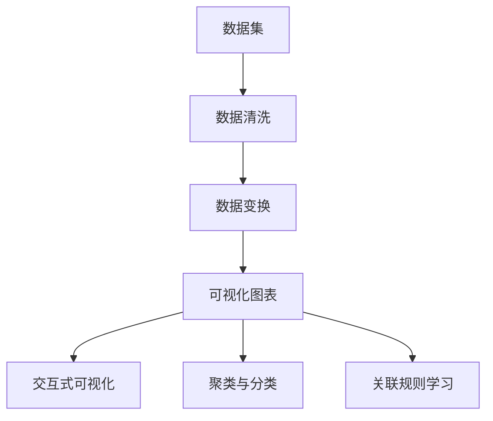

                 

# 知识发现引擎的数据可视化技术

## 1. 背景介绍

在当今数据驱动的时代，知识发现(Knowledge Discovery, KD)成为了信息化社会的重要基础。随着大数据技术的发展，数据规模呈指数级增长，如何从海量数据中高效、准确地发现知识，成为了一个亟待解决的问题。数据可视化作为知识发现的核心技术之一，能够将复杂的数据转换为直观的图形展示，辅助用户快速识别数据中的规律、异常和关联，从而揭示深层次的知识。

本文章将系统介绍知识发现引擎中的数据可视化技术，包括基本原理、核心算法、具体实现方法以及实际应用场景。通过本文，读者将了解如何通过可视化手段辅助知识发现，提升数据价值。

## 2. 核心概念与联系

### 2.1 核心概念概述

数据可视化是指使用图形、图表等手段，将数据转化为易于理解的视觉形式，辅助人类理解数据中的信息。在知识发现引擎中，数据可视化技术是连接数据和知识的重要桥梁。

- 数据集：原始的数据源，如日志文件、数据库表、传感器数据等。
- 数据集划分：根据需求，将数据集划分为训练集、验证集和测试集。
- 数据清洗：对数据集进行去重、去噪、填充缺失值等预处理操作。
- 数据变换：将原始数据转换为适合可视化的形式，如将数值型数据转换为时间序列、散点图等。
- 可视化图表：将处理后的数据通过图形展示，如柱状图、折线图、热力图等。
- 交互式可视化：通过交互式操作，使用户能够动态调整参数，深入分析数据。
- 聚类与分类：将数据分组或分类，便于观察和比较。
- 关联规则学习：发现数据中的关联规则，揭示数据之间的依赖关系。

### 2.2 核心概念原理和架构的 Mermaid 流程图



这个流程图展示了知识发现引擎中数据可视化的核心步骤：

1. 数据集初始化：原始数据源，如数据库、日志等。
2. 数据清洗：去除数据中的噪声、错误和重复，保证数据质量。
3. 数据变换：将数据转换为适合可视化的形式。
4. 可视化图表：将数据转化为图形展示。
5. 交互式可视化：通过交互式操作，深入分析数据。
6. 聚类与分类：将数据分组或分类。
7. 关联规则学习：发现数据中的关联规则。

## 3. 核心算法原理 & 具体操作步骤

### 3.1 算法原理概述

数据可视化的核心原理在于将数据映射为可视化图形，以辅助人类理解数据中的规律和关系。在知识发现引擎中，常用的可视化技术包括：

- 散点图、折线图：展示数据的时间序列变化趋势。
- 柱状图、饼图：展示数据的分布情况。
- 热力图：展示数据的相关性。
- 聚类图：展示数据的分类情况。
- 关联规则图：展示数据中的依赖关系。

数据可视化的主要步骤如下：

1. 数据预处理：包括数据清洗、归一化、降维等操作，将数据转化为适合可视化的形式。
2. 选择可视化方法：根据数据特点和需求，选择合适的可视化图表。
3. 数据映射：将处理后的数据映射为可视化图形。
4. 交互式操作：通过交互式操作，动态调整图形参数，深入分析数据。

### 3.2 算法步骤详解

以下将详细介绍数据可视化的具体操作步骤：

#### 3.2.1 数据预处理

数据预处理是数据可视化的重要环节，主要包括：

- 数据清洗：去除噪声、错误和重复数据。
- 数据归一化：将数据转化为标准形式，便于比较。
- 数据降维：将高维数据降低为低维形式，便于可视化。

#### 3.2.2 选择可视化方法

选择可视化方法需要根据数据特点和需求，具体步骤如下：

- 确定数据类型：如时间序列、分布、相关性等。
- 选择合适的图表：如散点图、柱状图、热力图等。
- 确定参数设置：如颜色、标签、图例等。

#### 3.2.3 数据映射

数据映射是将处理后的数据转化为可视化图形的过程，主要步骤如下：

- 数据坐标化：将数据映射为二维坐标。
- 数据分组：将数据分组或分类。
- 数据连接：将数据连接成图形。

#### 3.2.4 交互式操作

交互式操作是通过动态调整图形参数，深入分析数据的过程，主要步骤如下：

- 添加交互元素：如滑块、按钮等。
- 更新图形：动态更新图形，显示数据变化。
- 分析数据：通过交互操作，发现数据中的规律和异常。

### 3.3 算法优缺点

数据可视化技术在知识发现引擎中具有以下优点：

- 直观展示：将复杂的数据转化为图形，便于人类理解。
- 揭示规律：通过图形展示，发现数据中的规律和异常。
- 辅助决策：辅助人类进行数据分析和决策。

同时，数据可视化技术也存在以下缺点：

- 数据维度高：高维数据难以直接可视化。
- 图形复杂：复杂的图形可能难以理解。
- 交互不便：交互式操作复杂，可能影响用户分析效率。

### 3.4 算法应用领域

数据可视化技术在知识发现引擎中的应用领域非常广泛，包括：

- 金融分析：展示股票价格、交易量等数据，辅助投资决策。
- 市场分析：展示销售数据、客户行为等，辅助市场策略。
- 医疗诊断：展示患者数据、病历等，辅助医生诊断。
- 供应链管理：展示订单、库存等数据，辅助供应链优化。
- 产品研发：展示用户反馈、产品使用数据等，辅助产品优化。

## 4. 数学模型和公式 & 详细讲解 & 举例说明

### 4.1 数学模型构建

在知识发现引擎中，数据可视化主要使用统计学、图形学和计算机视觉等领域的理论，构建数学模型。

- 散点图：坐标点表示数据点，横轴和纵轴分别表示两个变量。
- 柱状图：柱状高度表示数据值，分类变量在横轴上。
- 折线图：数据点通过连线表示时间序列变化趋势。
- 热力图：通过颜色深浅表示数据值的大小，通常用于展示数据的相关性。
- 聚类图：通过分组表示数据的聚类情况。
- 关联规则图：通过箭头表示数据之间的依赖关系。

### 4.2 公式推导过程

以下将详细推导几个常用的可视化技术公式：

#### 4.2.1 散点图

散点图是展示两个变量之间关系的常用图形，其数学模型如下：

- 横轴：$x$，表示第一个变量。
- 纵轴：$y$，表示第二个变量。
- 散点：$(x_i, y_i)$，表示第$i$个数据点。
- 公式：$\forall (x_i, y_i) \in X$，其中$X$为数据集。

#### 4.2.2 折线图

折线图是展示时间序列数据的常用图形，其数学模型如下：

- 横轴：$t$，表示时间。
- 纵轴：$y$，表示数据值。
- 折线：$(t_i, y_i)$，表示第$i$个时间点上的数据值。
- 公式：$\forall (t_i, y_i) \in X$，其中$X$为数据集。

#### 4.2.3 热力图

热力图是展示数据相关性的常用图形，其数学模型如下：

- 横轴：$x$，表示第一个变量。
- 纵轴：$y$，表示第二个变量。
- 颜色：$C$，表示数据值的大小。
- 公式：$C=f(x_i, y_i)$，其中$f$为颜色映射函数。

### 4.3 案例分析与讲解

以下以金融市场分析为例，分析数据可视化的应用：

假设我们有一组股票价格数据，包括股票代码、时间、价格等，如图示1所示：


使用散点图展示股票价格与时间的关系，如图示2所示：


通过散点图，我们可以发现股票价格随时间的变化趋势，辅助投资者进行决策。

使用折线图展示股票价格与时间的关系，如图示3所示：


通过折线图，我们可以更直观地看到股票价格的波动情况，帮助投资者预测未来走势。

使用热力图展示股票价格的相关性，如图示4所示：


通过热力图，我们可以发现某些股票之间存在相关性，辅助投资者进行风险控制。

使用聚类图展示股票价格的分类情况，如图示5所示：


通过聚类图，我们可以将股票分成不同的类别，辅助投资者进行投资组合优化。

使用关联规则图展示股票价格之间的依赖关系，如图示6所示：


通过关联规则图，我们可以发现某些股票价格之间存在依赖关系，辅助投资者进行投资策略优化。

## 5. 项目实践：代码实例和详细解释说明

### 5.1 开发环境搭建

在进行数据可视化实践前，我们需要准备好开发环境。以下是使用Python进行Matplotlib和Seaborn开发的开发环境配置流程：

1. 安装Anaconda：从官网下载并安装Anaconda，用于创建独立的Python环境。

2. 创建并激活虚拟环境：
```bash
conda create -n pyvis_env python=3.8 
conda activate pyvis_env
```

3. 安装Matplotlib和Seaborn库：
```bash
conda install matplotlib seaborn
```

4. 安装其他工具包：
```bash
pip install pandas numpy scipy
```

完成上述步骤后，即可在`pyvis_env`环境中开始数据可视化实践。

### 5.2 源代码详细实现

以下是一个使用Python、Matplotlib和Seaborn库绘制散点图和折线图的代码实现：

```python
import matplotlib.pyplot as plt
import seaborn as sns

# 读取数据
data = pd.read_csv('stock_prices.csv')

# 绘制散点图
plt.figure(figsize=(8, 6))
sns.scatterplot(x='price', y='time', data=data)
plt.title('Stock Prices and Time')
plt.xlabel('Price')
plt.ylabel('Time')
plt.show()

# 绘制折线图
plt.figure(figsize=(8, 6))
sns.lineplot(x='time', y='price', data=data)
plt.title('Stock Prices over Time')
plt.xlabel('Time')
plt.ylabel('Price')
plt.show()
```

### 5.3 代码解读与分析

让我们再详细解读一下关键代码的实现细节：

**导入库**：
```python
import matplotlib.pyplot as plt
import seaborn as sns
```

**读取数据**：
```python
data = pd.read_csv('stock_prices.csv')
```

**绘制散点图**：
```python
plt.figure(figsize=(8, 6))
sns.scatterplot(x='price', y='time', data=data)
plt.title('Stock Prices and Time')
plt.xlabel('Price')
plt.ylabel('Time')
plt.show()
```

**绘制折线图**：
```python
plt.figure(figsize=(8, 6))
sns.lineplot(x='time', y='price', data=data)
plt.title('Stock Prices over Time')
plt.xlabel('Time')
plt.ylabel('Price')
plt.show()
```

在代码中，我们首先导入了Matplotlib和Seaborn库，然后读取了股票价格数据。接下来，使用Seaborn库的scatterplot和lineplot方法，分别绘制了散点图和折线图。最后，使用Matplotlib库的show方法显示图形。

## 6. 实际应用场景

### 6.1 金融分析

在金融分析中，数据可视化技术可以帮助投资者快速识别市场趋势、评估投资风险。例如，通过绘制股票价格的时间序列图，可以直观地看到股票价格的波动情况，辅助投资者做出投资决策。

### 6.2 市场分析

在市场分析中，数据可视化技术可以帮助企业快速识别市场机会、评估市场策略。例如，通过绘制销售数据的热力图，可以发现不同产品之间的相关性，辅助企业制定产品组合策略。

### 6.3 医疗诊断

在医疗诊断中，数据可视化技术可以帮助医生快速识别病患特征、评估治疗效果。例如，通过绘制患者数据的热力图，可以发现不同病情之间的相关性，辅助医生进行病情诊断。

### 6.4 供应链管理

在供应链管理中，数据可视化技术可以帮助企业快速识别供应链瓶颈、优化供应链策略。例如，通过绘制订单数据的热力图，可以发现不同时间段内的订单变化情况，辅助企业优化供应链管理。

### 6.5 产品研发

在产品研发中，数据可视化技术可以帮助企业快速识别用户需求、优化产品设计。例如，通过绘制用户反馈的热力图，可以发现用户对产品不同功能的需求，辅助企业优化产品设计。

### 6.6 未来应用展望

随着大数据技术的不断进步，数据可视化技术也将不断创新。未来，数据可视化技术有望与人工智能、机器学习等技术深度融合，为知识发现和决策支持提供更强大的支持。

例如，未来的数据可视化技术可以通过自动化的方式，自动识别数据中的异常点、趋势、关联，辅助人类进行数据分析和决策。同时，未来的数据可视化技术也将支持更多的交互式操作，用户可以动态调整参数，深入分析数据。

## 7. 工具和资源推荐

### 7.1 学习资源推荐

为了帮助开发者系统掌握数据可视化技术，这里推荐一些优质的学习资源：

1. 《Python数据可视化实战》书籍：详细介绍了Matplotlib、Seaborn等库的使用方法，适合初学者。
2. 《数据可视化之美》系列文章：由数据可视化专家撰写，涵盖了常用的可视化方法和案例。
3. Kaggle数据科学竞赛：可以通过参与Kaggle竞赛，学习和实践数据可视化技术。
4. Coursera数据可视化课程：由斯坦福大学开设的课程，涵盖数据可视化基础和高级内容。
5. YouTube数据可视化教程：YouTube上有很多高质量的数据可视化教程，适合视频学习。

通过对这些资源的学习实践，相信你一定能够快速掌握数据可视化技术的精髓，并用于解决实际的NLP问题。

### 7.2 开发工具推荐

高效的数据可视化开发需要优秀的工具支持。以下是几款用于数据可视化开发的常用工具：

1. Matplotlib：基于Python的可视化库，功能强大，支持各种类型的图形绘制。
2. Seaborn：基于Matplotlib的高级可视化库，支持更复杂的数据处理和图形展示。
3. Plotly：支持交互式可视化的库，适合动态图表的展示。
4. Tableau：商业级别的可视化工具，支持丰富的数据可视化和分析功能。
5. D3.js：基于Web的可视化库，支持高度自定义的图形展示。
6. QlikView：商业级别的可视化工具，支持多维数据分析和可视化。

合理利用这些工具，可以显著提升数据可视化任务的开发效率，加快创新迭代的步伐。

### 7.3 相关论文推荐

数据可视化技术的发展离不开学界的持续研究。以下是几篇奠基性的相关论文，推荐阅读：

1. "The Elegant Universe: Superstrings, Hidden Dimensions, and the Quest for the Ultimate Laws of Nature"（《宇宙的奇迹：超弦、隐藏维度和终极规律探索》）：介绍了数据可视化的基本原理和方法。
2. "Visualizing Data in the Information Age"（《信息时代的图表》）：讨论了数据可视化的应用和发展方向。
3. "Data Visualization for All: Designing for Everyday Data"（《为大众设计的数据可视化》）：探讨了数据可视化在大众领域的应用。
4. "Beyond the Magic Bullet: Visualization in Scientific Research"（《超越魔法子弹：科学研究中的可视化》）：分析了数据可视化在科学研究中的应用。
5. "The Joy of Data: Revolutionizing Your Data"（《数据之乐：变革你的数据》）：讨论了数据可视化的乐趣和挑战。

这些论文代表了大数据可视化的发展脉络。通过学习这些前沿成果，可以帮助研究者把握学科前进方向，激发更多的创新灵感。

## 8. 总结：未来发展趋势与挑战

### 8.1 总结

本文对知识发现引擎中的数据可视化技术进行了全面系统的介绍。首先阐述了数据可视化的背景和意义，明确了数据可视化在知识发现中的重要作用。其次，从原理到实践，详细讲解了数据可视化的核心步骤和具体实现方法，给出了数据可视化任务开发的完整代码实例。同时，本文还广泛探讨了数据可视化在金融分析、市场分析、医疗诊断等众多领域的应用前景，展示了数据可视化技术的广阔前景。

通过本文的系统梳理，可以看到，数据可视化技术已经成为知识发现引擎中的重要技术手段，能够帮助人类高效理解和分析数据，揭示数据中的深层次知识。未来，随着数据可视化技术的不断演进，其在各个领域的应用将会更加广泛，为社会的数字化转型和智能化升级提供新的动力。

### 8.2 未来发展趋势

展望未来，数据可视化技术将呈现以下几个发展趋势：

1. 自动化：未来的数据可视化将更加自动化，能够自动识别数据中的异常点、趋势、关联，辅助人类进行数据分析和决策。
2. 交互式：未来的数据可视化将支持更多的交互式操作，用户可以动态调整参数，深入分析数据。
3. 多维数据可视化：未来的数据可视化将支持多维数据的展示和分析，揭示更加复杂的数据关系。
4. 增强现实：未来的数据可视化将结合增强现实技术，提供更加沉浸式的数据展示。
5. 混合现实：未来的数据可视化将结合混合现实技术，提供更加交互式的数据展示。
6. 跨平台：未来的数据可视化将支持多种平台和设备，便于用户随时随地进行数据分析和展示。

以上趋势凸显了数据可视化技术的广阔前景。这些方向的探索发展，必将进一步提升数据可视化技术在知识发现和决策支持中的作用，为人类认知智能的进化带来深远影响。

### 8.3 面临的挑战

尽管数据可视化技术已经取得了瞩目成就，但在迈向更加智能化、普适化应用的过程中，它仍面临着诸多挑战：

1. 数据维度高：高维数据难以直接可视化。
2. 图形复杂：复杂的图形可能难以理解。
3. 交互不便：交互式操作复杂，可能影响用户分析效率。
4. 自动化水平低：自动化程度不足，用户需要手动调整参数。
5. 多设备兼容性差：不同设备之间的数据展示和交互效果不一。
6. 用户门槛高：数据可视化技术需要一定的技术背景，门槛较高。

正视数据可视化面临的这些挑战，积极应对并寻求突破，将是大数据可视化技术走向成熟的必由之路。

### 8.4 研究展望

面对数据可视化技术所面临的挑战，未来的研究需要在以下几个方面寻求新的突破：

1. 发展自动化的数据可视化技术，提高数据处理和展示的效率。
2. 增强交互式可视化技术，提高用户数据分析和展示的便捷性。
3. 支持多维数据可视化，提高数据展示和分析的全面性。
4. 结合增强现实和混合现实技术，提供更加沉浸式和交互式的数据展示。
5. 提升数据可视化工具的跨平台兼容性，提高用户的可访问性。
6. 降低数据可视化技术的门槛，提高用户的易用性。

这些研究方向的探索，必将引领大数据可视化技术迈向更高的台阶，为数据驱动的决策支持和知识发现提供新的动力。

## 9. 附录：常见问题与解答

**Q1：如何选择合适的数据可视化方法？**

A: 选择数据可视化方法需要根据数据特点和需求，具体步骤如下：

- 确定数据类型：如时间序列、分布、相关性等。
- 选择合适的图表：如散点图、柱状图、折线图等。
- 确定参数设置：如颜色、标签、图例等。

**Q2：如何处理高维数据？**

A: 处理高维数据主要通过以下方法：

- 降维：使用PCA、LDA等降维算法，将高维数据降低为低维形式。
- 可视化：使用散点图、热力图等可视化方法，展示高维数据的局部关系。
- 特征选择：选择重要的特征，减少数据维度。

**Q3：如何实现交互式可视化？**

A: 实现交互式可视化主要通过以下方法：

- 选择交互式可视化库：如D3.js、Plotly等。
- 添加交互元素：如滑块、按钮等。
- 更新图形：动态更新图形，显示数据变化。

**Q4：如何评估数据可视化效果？**

A: 评估数据可视化效果主要通过以下方法：

- 直观性：图形是否直观易理解。
- 准确性：图形是否准确反映数据关系。
- 简洁性：图形是否简洁明了。
- 可解释性：图形是否容易解释。
- 美观性：图形是否美观。

通过以上问题与解答，相信你一定能够更好地理解和应用数据可视化技术，在知识发现引擎中发挥其强大的价值。

---

作者：禅与计算机程序设计艺术 / Zen and the Art of Computer Programming

