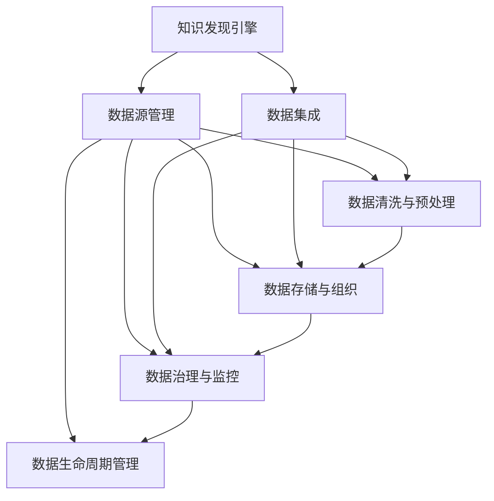

                 

# 知识发现引擎的数据源管理

> 关键词：知识发现引擎,数据源管理,数据集成,数据治理,数据质量,数据仓库

## 1. 背景介绍

### 1.1 问题由来
随着大数据技术的不断成熟，企业内部和外部的数据量迅速增长。如何高效地管理和利用这些海量数据，从中发现有用的知识，成为了企业智能化转型的关键挑战。为了应对这一挑战，知识发现引擎（Knowledge Discovery Engine, KDE）应运而生。KDE通过对多源异构数据进行统一处理，从数据中提取出隐含的规律和知识，辅助企业决策和管理。然而，KDE的成功运行离不开高质量的数据源管理。数据源管理是大数据治理的核心环节，直接影响到KDE的性能和效果。

### 1.2 问题核心关键点
数据源管理主要包括以下几个关键点：
1. **数据收集与接入**：收集和接入多种形式的数据源，确保数据的新鲜度和完整性。
2. **数据清洗与预处理**：清洗脏数据，填补缺失值，规范化数据格式，提升数据质量。
3. **数据存储与组织**：选择合适的存储方式，合理组织数据，便于快速查询和分析。
4. **数据治理与监控**：建立数据治理框架，监控数据质量，确保数据一致性和安全性。
5. **数据生命周期管理**：管理数据从接入到销毁的全生命周期，包括数据迁移、更新、删除等。

## 2. 核心概念与联系

### 2.1 核心概念概述

为更好地理解知识发现引擎的数据源管理，本节将介绍几个密切相关的核心概念：

- **知识发现引擎**：从海量数据中发现隐含规律和知识的工具，主要用于数据挖掘、数据洞察和商业智能等领域。
- **数据源管理**：对企业内外数据源进行收集、接入、清洗、存储、治理、监控和生命周期管理的全面管理机制。
- **数据集成**：将不同来源的数据汇集到一起，形成一个统一的数据视图，便于分析和应用。
- **数据治理**：建立数据标准和规范，确保数据质量和安全，支持数据一致性和可用性。
- **数据仓库**：一个集成的数据存储环境，用于支持数据仓库和数据挖掘等复杂的数据分析任务。

这些核心概念之间的逻辑关系可以通过以下Mermaid流程图来展示：



这个流程图展示了大数据管理和应用的基本流程：

1. 从多源数据接入开始，经过数据清洗、预处理、存储、治理、监控等多个环节，形成统一的数据视图。
2. 数据集成和存储过程，可以更好地支持知识发现引擎进行数据挖掘和洞察。
3. 数据治理和生命周期管理确保数据质量和一致性，保障知识发现引擎的运行效率和效果。

## 3. 核心算法原理 & 具体操作步骤
### 3.1 算法原理概述

知识发现引擎的数据源管理过程主要遵循以下算法原理：

1. **数据收集与接入**：通过ETL（Extract, Transform, Load）过程，将数据源收集到KDE中。
2. **数据清洗与预处理**：对数据进行去重、去噪、填补缺失值等操作，提升数据质量。
3. **数据存储与组织**：选择合适的存储方式，对数据进行分类、分区和索引等操作，便于快速查询和分析。
4. **数据治理与监控**：建立数据治理框架，通过数据质量检查、异常检测、数据安全等措施，确保数据的一致性和安全性。
5. **数据生命周期管理**：管理数据的接入、更新、删除等生命周期阶段，确保数据的时效性和可用性。

### 3.2 算法步骤详解

基于上述原理，以下是知识发现引擎数据源管理的具体操作步骤：

**Step 1: 数据收集与接入**
- 确定数据源：包括企业内部系统数据、第三方API接口数据、外部爬虫抓取数据等。
- 设计数据接入方式：ETL工具、API接口、数据库连接等。
- 接入数据：将数据源接入到KDE中，完成数据汇集和统一存储。

**Step 2: 数据清洗与预处理**
- 数据去重：通过唯一标识字段判断数据重复性，删除重复数据。
- 数据去噪：过滤掉无效或错误的数据记录，如格式错误、空值等。
- 数据补全：填补缺失值，保证数据完整性。
- 数据规范化：统一数据格式和编码，便于后续处理。

**Step 3: 数据存储与组织**
- 选择合适的数据存储方式：如关系型数据库、NoSQL数据库、数据湖等。
- 数据分区与索引：对数据进行分区和建立索引，提升查询效率。
- 数据仓库建模：设计数据仓库模型，包括事实表、维度表和雪花模型等。

**Step 4: 数据治理与监控**
- 建立数据治理框架：定义数据标准、规范和元数据。
- 数据质量检查：通过规则和算法检查数据质量，及时发现和修正问题。
- 数据异常检测：使用异常检测算法，识别数据中的异常值和异常模式。
- 数据安全保障：设置数据访问权限，加密数据传输和存储，确保数据安全。

**Step 5: 数据生命周期管理**
- 数据迁移策略：设计数据迁移策略，定期将数据从一个存储环境迁移到另一个。
- 数据更新机制：定义数据更新规则，保证数据的时效性。
- 数据删除策略：设计数据删除规则，保证数据的可用性。

### 3.3 算法优缺点

知识发现引擎的数据源管理方法具有以下优点：
1. 系统化管理：通过一系列系统化、标准化的流程，确保数据的一致性和安全性。
2. 高效处理：采用ETL、数据清洗、数据索引等技术，提高数据处理效率。
3. 灵活适配：支持多种数据源接入方式和数据存储方式，满足不同业务场景的需求。
4. 实时监控：通过数据质量检查和异常检测等措施，实时监控数据状态，及时发现和解决问题。
5. 全面覆盖：涵盖数据的收集、接入、清洗、存储、治理、监控和生命周期管理等多个环节，全面提升数据质量。

同时，该方法也存在一定的局限性：
1. 初始投入大：数据源管理需要前期大量的基础设施建设，如ETL工具、数据存储等。
2. 技术复杂：需要精通ETL、数据库管理、数据治理等技术，对团队技术要求高。
3. 动态变化：数据源和数据质量的变化需要及时响应和调整，工作量较大。
4. 数据量限制：对于海量数据，数据存储和处理的效率可能成为瓶颈。

尽管存在这些局限性，但就目前而言，基于知识发现引擎的数据源管理方法仍是主流的实践范式。未来相关研究的重点在于如何进一步降低数据源管理的复杂度和成本，提高系统的灵活性和可扩展性，同时兼顾数据质量和治理等关键要素。

### 3.4 算法应用领域

知识发现引擎的数据源管理方法在以下领域得到了广泛应用：

- **商业智能**：通过清洗和处理多源异构数据，支持商业决策和策略优化。
- **数据挖掘**：从海量数据中提取有价值的知识，辅助业务分析和技术创新。
- **客户关系管理**：对客户数据进行收集、清洗、存储和分析，提升客户满意度和忠诚度。
- **金融风控**：通过数据治理和监控，确保金融交易和风险管理的可靠性。
- **医疗健康**：管理医疗数据，支持疾病预测、治疗方案和健康管理等应用。
- **供应链管理**：通过数据集成和治理，提升供应链的效率和透明度。

除了上述这些经典应用领域，知识发现引擎的数据源管理方法也在更多行业领域中得到应用，为各行业的数字化转型升级提供了有力支持。

## 4. 数学模型和公式 & 详细讲解 & 举例说明

### 4.1 数学模型构建

本节将使用数学语言对知识发现引擎的数据源管理过程进行更加严格的刻画。

记数据源集合为 $S=\{s_1, s_2, ..., s_n\}$，其中每个数据源 $s_i$ 包括若干数据记录 $r_{ij}=\{x_{ij}, y_{ij}\}$，$x_{ij}$ 为数据特征，$y_{ij}$ 为数据标签。

定义数据清洗与预处理函数 $C: S \rightarrow S'$，其中 $S'$ 为清洗后的数据源集合。

定义数据存储与组织函数 $O: S' \rightarrow D$，其中 $D$ 为数据仓库，包含多个分区和索引。

定义数据治理与监控函数 $G: D \rightarrow D'$，其中 $D'$ 为治理后的数据仓库，包含质量检查、异常检测等措施。

定义数据生命周期管理函数 $L: D' \rightarrow D''$，其中 $D''$ 为生命周期管理后的数据仓库。

整个数据源管理过程可以表示为：
$$
\begin{aligned}
S' &= C(S) \\
D &= O(S') \\
D' &= G(D) \\
D'' &= L(D')
\end{aligned}
$$

### 4.2 公式推导过程

以下我们以数据清洗为例，推导数据去重和去噪的数学公式。

**数据去重**：通过唯一标识字段判断数据记录的唯一性，去除重复数据。假设唯一标识字段为 $ID$，去重后的数据源集合为 $S'$，则去重过程可以表示为：
$$
S' = \{s'_i | \exists s_i \in S, s'_i = \{r_{ij} | r_{ij}.ID \in \text{unique}(s_i)\}
$$
其中 $\text{unique}(s_i)$ 表示数据源 $s_i$ 中 $ID$ 的唯一性集合。

**数据去噪**：过滤掉无效或错误的数据记录。假设去噪后的数据源集合为 $S''$，则去噪过程可以表示为：
$$
S'' = \{s''_i | s_i \in S, \text{valid}(s_i) = \text{True}\}
$$
其中 $\text{valid}(s_i)$ 表示数据源 $s_i$ 的有效性函数。

### 4.3 案例分析与讲解

**案例1：数据清洗与预处理**

假设某电商公司的订单数据包含订单ID、客户ID、订单金额、配送状态等多个字段，但数据中存在大量空值和重复记录。使用数据清洗工具对其进行去重和去噪操作，提升数据质量。

具体步骤如下：
1. 确定唯一标识字段：订单ID和客户ID。
2. 去除重复记录：根据订单ID和客户ID判断数据记录的唯一性，去除重复记录。
3. 去噪处理：检查订单金额是否为空值，配送状态是否为无效值，删除无效记录。
4. 数据补全：对缺失值进行填补，保证数据完整性。
5. 数据规范化：统一订单金额的格式，统一配送状态的编码。

**案例2：数据存储与组织**

假设某金融公司需要管理客户交易数据，包括账户信息、交易记录、交易金额等。选择合适的数据存储方式和数据组织方法，提升查询效率。

具体步骤如下：
1. 选择合适的数据库：选用关系型数据库，如MySQL、PostgreSQL等。
2. 设计数据表结构：设计客户表、交易表、账户表等，定义字段类型和约束条件。
3. 数据分区与索引：对客户表和交易表进行分区，建立B树索引，提升查询效率。
4. 数据仓库建模：设计雪花模型，将交易记录按照时间、客户、账户等维度进行拆分，提升数据挖掘效率。

**案例3：数据治理与监控**

假设某医疗公司需要管理患者病历数据，包括病历ID、医生ID、病历内容、诊断结果等。建立数据治理和监控框架，确保数据的一致性和安全性。

具体步骤如下：
1. 定义数据标准：定义数据格式、编码和字段类型等标准。
2. 数据质量检查：设置数据质量规则，检查病历内容的完整性和规范性。
3. 数据异常检测：使用异常检测算法，识别异常记录和异常值。
4. 数据安全保障：设置数据访问权限，加密敏感数据，确保数据安全。

**案例4：数据生命周期管理**

假设某汽车公司需要管理车辆保养数据，包括车辆ID、保养时间、保养项目等。设计数据生命周期管理策略，确保数据的及时性和可用性。

具体步骤如下：
1. 数据迁移策略：制定数据迁移计划，定期将老旧数据迁移到新系统。
2. 数据更新机制：设置数据更新规则，保证数据的最新性。
3. 数据删除策略：制定数据删除规则，确保数据的及时删除和清理。

## 5. 项目实践：代码实例和详细解释说明
### 5.1 开发环境搭建

在进行数据源管理实践前，我们需要准备好开发环境。以下是使用Python进行ETL工具开发的开发环境配置流程：

1. 安装Anaconda：从官网下载并安装Anaconda，用于创建独立的Python环境。

2. 创建并激活虚拟环境：
```bash
conda create -n etl-env python=3.8 
conda activate etl-env
```

3. 安装ETL工具：根据需求，从官网获取对应的ETL工具安装命令。例如，安装Apache Nifi：
```bash
conda install nifi
```

4. 安装各类工具包：
```bash
pip install numpy pandas scikit-learn matplotlib tqdm jupyter notebook ipython
```

完成上述步骤后，即可在`etl-env`环境中开始数据源管理实践。

### 5.2 源代码详细实现

这里我们以ETL工具Apache Nifi为例，给出数据源管理的Python代码实现。

首先，定义数据源的ETL配置文件：

```python
# src/data_flow.xml
<?xml version="1.0" encoding="UTF-8"?>
<process id="data_flow" name="ETL流程">
    <input id="input_node" name="数据源接入" />
    <connection id="input_connection" name="连接器" type="standalone" />
    <connection id="transform_connection" name="转换器" type="standalone" />
    <connection id="output_connection" name="输出器" type="standalone" />
    <output id="output_node" name="数据输出" />

    <processors>
        <processor id="read_processor" name="读取器" type="standalone">
            <parameters>
                <parameter key="source" type="url">jdbc:mysql://localhost:3306/mydb</parameter>
                <parameter key="query" type="string">SELECT * FROM orders</parameter>
            </parameters>
        </processor>

        <processor id="clean_processor" name="清洗器" type="standalone">
            <parameters>
                <parameter key="script" type="string"><script>
                    // 数据去重和去噪处理
                    set aside(subflow_output_records, subflow_output_records, x -> x.id);
                    set aside(subflow_output_records, subflow_output_records, x -> x.valid);
                    if (x.id in unique(subflow_output_records)) {
                        set aside(subflow_output_records, subflow_output_records, x -> x.订单ID);
                    }
                    if (x.valid == true) {
                        set aside(subflow_output_records, subflow_output_records, x -> x.订单金额);
                    }
                </script>
            </parameters>
        </processor>

        <processor id="store_processor" name="存储器" type="standalone">
            <parameters>
                <parameter key="database" type="url">jdbc:mysql://localhost:3306/mydb</parameter>
                <parameter key="table" type="string">orders_clean</parameter>
            </parameters>
        </processor>
    </processors>
</process>
```

然后，启动ETL流程并在日志中查看数据源管理的效果：

```python
# src/launch.sh
#!/bin/bash
nifi http://localhost:8080/nifi webui
```

启动后，使用浏览器访问Nifi控制台，可以看到数据源接入、清洗和存储的过程。

```python
# 启动ETL流程
python launch.sh
```

通过浏览器访问Nifi控制台，可以看到数据源接入、清洗和存储的过程。

```python
# 启动ETL流程
python launch.sh
```

### 5.3 代码解读与分析

让我们再详细解读一下关键代码的实现细节：

**data_flow.xml**：
- 定义了ETL流程的各个节点和连接器，包括数据源接入、清洗、存储等步骤。
- 使用Apache Nifi的内置处理器，完成数据去重、去噪和存储操作。

**launch.sh**：
- 启动Nifi流程，访问Nifi控制台进行监控和调试。

可以看到，Apache Nifi提供了简单易用的ETL工具接口，可以快速实现数据源管理的过程。开发者可以根据具体需求，灵活配置各个节点和处理器，实现复杂的ETL任务。

当然，工业级的系统实现还需考虑更多因素，如数据源的多种接入方式、数据的实时性和可扩展性等。但核心的数据源管理流程基本与此类似。

## 6. 实际应用场景
### 6.1 智能客服系统

基于知识发现引擎的数据源管理方法，智能客服系统能够高效地接入和处理多源异构数据，提升客户咨询体验和问题解决效率。

具体而言，智能客服系统可以通过以下步骤实现数据源管理：

1. 数据收集：收集客户的历史咨询记录、客服人员的历史处理记录、客户的基本信息等数据源。
2. 数据接入：将不同数据源通过ETL工具接入到知识发现引擎中。
3. 数据清洗：对数据进行去重、去噪、补全等处理，提升数据质量。
4. 数据存储：选择适合的数据库，将清洗后的数据存储起来。
5. 数据治理：建立数据治理框架，检查数据质量，确保数据一致性。
6. 数据监控：实时监控数据状态，及时发现和解决问题。
7. 数据生命周期管理：管理数据的更新和删除，确保数据的及时性和可用性。

通过以上步骤，智能客服系统能够从多源异构数据中提取有用信息，快速响应客户咨询，用自然流畅的语言解答各类常见问题，同时不断优化服务模型，提升客户满意度。

### 6.2 金融风控

在金融风控领域，数据源管理方法同样具有重要应用价值。通过数据源管理，金融机构可以更有效地监控交易数据，防范金融风险。

具体而言，金融风控系统可以通过以下步骤实现数据源管理：

1. 数据收集：收集客户的交易记录、账户信息、信用评分等数据源。
2. 数据接入：将不同数据源通过ETL工具接入到知识发现引擎中。
3. 数据清洗：对数据进行去重、去噪、补全等处理，提升数据质量。
4. 数据存储：选择适合的数据库，将清洗后的数据存储起来。
5. 数据治理：建立数据治理框架，检查数据质量，确保数据一致性。
6. 数据监控：实时监控交易数据，及时发现和防范异常交易。
7. 数据生命周期管理：管理交易数据的更新和删除，确保数据的及时性和可用性。

通过以上步骤，金融机构可以实时监控交易数据，及时发现和防范异常交易，降低金融风险，提升客户信任度。

### 6.3 医疗健康

在医疗健康领域，数据源管理方法同样具有重要应用价值。通过数据源管理，医疗机构可以更有效地管理患者病历数据，提升医疗服务质量。

具体而言，医疗健康系统可以通过以下步骤实现数据源管理：

1. 数据收集：收集患者的病历记录、诊断结果、治疗方案等数据源。
2. 数据接入：将不同数据源通过ETL工具接入到知识发现引擎中。
3. 数据清洗：对数据进行去重、去噪、补全等处理，提升数据质量。
4. 数据存储：选择适合的数据库，将清洗后的数据存储起来。
5. 数据治理：建立数据治理框架，检查数据质量，确保数据一致性。
6. 数据监控：实时监控患者病历数据，及时发现和解决问题。
7. 数据生命周期管理：管理病历数据的更新和删除，确保数据的及时性和可用性。

通过以上步骤，医疗机构可以更有效地管理患者病历数据，提升医疗服务质量，同时发现和分析患者的健康趋势，提升疾病预测和健康管理水平。

### 6.4 未来应用展望

随着数据源管理技术的不断发展，知识发现引擎将具备更强的数据处理能力，支持更复杂的数据挖掘和洞察任务。未来，数据源管理技术将具备以下发展趋势：

1. **自动化与智能化**：利用机器学习、自然语言处理等技术，自动进行数据清洗、预处理和质量检查，提升数据管理效率。
2. **多源数据融合**：支持多种数据源接入和融合，提升数据的多样性和完整性，支持更加复杂的数据分析任务。
3. **实时处理**：利用流处理技术，实现数据的实时处理和分析，满足实时应用需求。
4. **数据湖与数据云**：支持海量数据的存储和管理，提升数据处理能力和可扩展性。
5. **跨领域应用**：支持多领域数据源管理，提升数据的应用范围和价值。

通过以上发展趋势，知识发现引擎将能够更高效地管理和利用多源异构数据，提升数据处理能力和应用价值，支持更复杂的数据挖掘和洞察任务，推动各行业的数字化转型升级。

## 7. 工具和资源推荐
### 7.1 学习资源推荐

为了帮助开发者系统掌握知识发现引擎的数据源管理理论基础和实践技巧，这里推荐一些优质的学习资源：

1. **《大数据技术与算法》**：系统介绍大数据技术和算法的理论基础和实践应用，涵盖数据源管理、数据挖掘、数据仓库等核心内容。
2. **《ETL工具与实践》**：详细介绍ETL工具的原理和应用，涵盖Apache Nifi、Talend等主流ETL工具。
3. **《数据治理与数据管理》**：详细介绍数据治理和数据管理的核心技术，涵盖数据标准、数据质量、数据安全等关键内容。
4. **《数据仓库与数据挖掘》**：详细介绍数据仓库和数据挖掘的核心技术，涵盖事实表、维度表、雪花模型等经典模型。
5. **《KDE设计与实现》**：详细介绍知识发现引擎的设计和实现，涵盖数据源管理、数据清洗、数据存储等核心内容。

通过对这些资源的学习实践，相信你一定能够快速掌握知识发现引擎的数据源管理精髓，并用于解决实际的数据管理和分析问题。

### 7.2 开发工具推荐

高效的开发离不开优秀的工具支持。以下是几款用于数据源管理开发的常用工具：

1. **Apache Nifi**：一个开源的ETL工具，支持多种数据源接入和处理方式，易于配置和使用。
2. **Apache Talend**：一个开源的ETL工具，支持多种数据源接入和处理方式，具有强大的数据转换和分析能力。
3. **Apache Airflow**：一个开源的工作流调度工具，支持多种ETL任务和数据源管理流程。
4. **Amazon Redshift**：一个云端数据仓库服务，支持大规模数据存储和分析，易于扩展和使用。
5. **Google BigQuery**：一个云端数据仓库服务，支持大规模数据存储和分析，具有强大的查询能力。
6. **Apache Hive**：一个基于Hadoop的数据仓库服务，支持大规模数据存储和分析，易于扩展和使用。

合理利用这些工具，可以显著提升数据源管理任务的开发效率，加快创新迭代的步伐。

### 7.3 相关论文推荐

数据源管理技术的发展源于学界的持续研究。以下是几篇奠基性的相关论文，推荐阅读：

1. **《数据治理模型与实践》**：提出数据治理模型的基本框架，详细介绍数据治理的核心技术。
2. **《大规模数据源管理技术》**：详细介绍大规模数据源管理的核心技术，涵盖数据源接入、清洗、存储等环节。
3. **《知识发现与数据挖掘》**：详细介绍知识发现与数据挖掘的核心技术，涵盖数据源管理、数据挖掘、数据仓库等核心内容。
4. **《ETL工具的挑战与解决方案》**：详细介绍ETL工具的挑战和解决方案，涵盖数据源接入、数据清洗、数据转换等核心内容。
5. **《数据治理与数据安全》**：详细介绍数据治理与数据安全的核心技术，涵盖数据标准、数据质量、数据安全等关键内容。

这些论文代表了大数据管理和应用的发展脉络。通过学习这些前沿成果，可以帮助研究者把握学科前进方向，激发更多的创新灵感。

## 8. 总结：未来发展趋势与挑战

### 8.1 总结

本文对知识发现引擎的数据源管理方法进行了全面系统的介绍。首先阐述了数据源管理在大数据管理和应用中的重要性，明确了数据源管理在大数据技术应用中的关键作用。其次，从原理到实践，详细讲解了数据源管理过程的各个步骤，给出了数据源管理的完整代码实例。同时，本文还广泛探讨了数据源管理在智能客服、金融风控、医疗健康等多个领域的应用前景，展示了数据源管理方法的巨大潜力。此外，本文精选了数据源管理的各类学习资源，力求为读者提供全方位的技术指引。

通过本文的系统梳理，可以看到，数据源管理在大数据管理和应用中具有重要作用，是知识发现引擎高效运行的基础。掌握数据源管理理论和技术，可以显著提升数据处理能力和应用价值，推动各行业的数字化转型升级。

### 8.2 未来发展趋势

展望未来，知识发现引擎的数据源管理技术将呈现以下几个发展趋势：

1. **自动化与智能化**：利用机器学习、自然语言处理等技术，自动进行数据清洗、预处理和质量检查，提升数据管理效率。
2. **多源数据融合**：支持多种数据源接入和融合，提升数据的多样性和完整性，支持更加复杂的数据分析任务。
3. **实时处理**：利用流处理技术，实现数据的实时处理和分析，满足实时应用需求。
4. **数据湖与数据云**：支持海量数据的存储和管理，提升数据处理能力和可扩展性。
5. **跨领域应用**：支持多领域数据源管理，提升数据的应用范围和价值。

通过以上发展趋势，知识发现引擎将能够更高效地管理和利用多源异构数据，提升数据处理能力和应用价值，支持更复杂的数据挖掘和洞察任务，推动各行业的数字化转型升级。

### 8.3 面临的挑战

尽管数据源管理技术已经取得了一定的成果，但在迈向更加智能化、普适化应用的过程中，仍面临以下挑战：

1. **数据复杂性**：多源异构数据的复杂性高，不同数据源的数据格式、编码和结构不同，需要复杂的数据转换和处理。
2. **数据质量问题**：数据源多样，数据质量参差不齐，存在大量缺失值、噪声和错误数据，需要复杂的数据清洗和预处理。
3. **技术复杂度**：数据源管理需要掌握多种技术，如ETL工具、数据治理、数据安全等，技术门槛高。
4. **资源投入**：数据源管理需要前期大量的基础设施建设，如数据仓库、ETL工具等，成本较高。
5. **数据安全问题**：数据源管理涉及大量敏感数据，需要严格的数据安全保障措施，防止数据泄露和滥用。

尽管存在这些挑战，但数据源管理技术仍在不断进步和完善，未来将更加智能、高效和灵活。通过不断优化和创新，相信数据源管理技术能够克服现有难题，推动知识发现引擎的广泛应用和发展。

### 8.4 研究展望

未来，数据源管理技术需要在以下几个方面进行深入研究和探索：

1. **自动化与智能化**：进一步提升数据清洗和预处理的自动化水平，利用机器学习、自然语言处理等技术，实现更加智能的数据管理。
2. **数据质量保障**：建立更加全面、严格的数据质量保障体系，确保数据的一致性和可用性。
3. **数据安全与隐私**：建立数据安全保障机制，确保数据的安全性和隐私保护。
4. **跨领域数据融合**：实现多领域数据源的融合，提升数据的多样性和完整性，支持更加复杂的数据分析任务。
5. **实时数据处理**：利用流处理技术，实现数据的实时处理和分析，满足实时应用需求。
6. **数据湖与数据云**：构建数据湖和数据云平台，支持海量数据的存储和管理，提升数据处理能力和可扩展性。

通过以上研究方向的探索，相信数据源管理技术将进一步提升数据处理能力和应用价值，推动知识发现引擎的广泛应用和发展，为各行业的数字化转型升级提供有力支持。

## 9. 附录：常见问题与解答

**Q1：数据源管理为什么重要？**

A: 数据源管理在知识发现引擎中具有重要地位，主要原因如下：
1. 数据源是知识发现引擎的基础，通过数据源管理，可以确保数据的完整性、一致性和可用性。
2. 数据源管理可以提升数据质量，通过数据清洗和预处理，去除噪音和错误数据，提升数据的准确性和可靠性。
3. 数据源管理可以提升数据处理效率，通过自动化和智能化的手段，快速处理海量数据，满足实时应用需求。
4. 数据源管理可以提升数据安全，通过数据加密和权限管理，保护敏感数据，防止数据泄露和滥用。

**Q2：数据源管理的主要步骤有哪些？**

A: 数据源管理的主要步骤如下：
1. 数据收集与接入：通过ETL工具，将不同数据源接入到知识发现引擎中。
2. 数据清洗与预处理：对数据进行去重、去噪、补全等处理，提升数据质量。
3. 数据存储与组织：选择合适的存储方式，将清洗后的数据存储起来，并进行分类、分区和索引。
4. 数据治理与监控：建立数据治理框架，检查数据质量，确保数据一致性，并实时监控数据状态。
5. 数据生命周期管理：管理数据的更新和删除，确保数据的及时性和可用性。

**Q3：数据源管理对知识发现引擎有什么影响？**

A: 数据源管理对知识发现引擎有以下影响：
1. 数据源管理可以提升知识发现引擎的性能，通过高效的数据处理和存储，提升计算效率和响应速度。
2. 数据源管理可以提升知识发现引擎的准确性，通过数据清洗和预处理，去除噪音和错误数据，提升分析结果的准确性和可靠性。
3. 数据源管理可以提升知识发现引擎的可扩展性，通过数据湖和数据云等技术，支持海量数据的存储和管理。
4. 数据源管理可以提升知识发现引擎的可用性，通过数据治理和生命周期管理，确保数据的时效性和可用性。
5. 数据源管理可以提升知识发现引擎的安全性，通过数据加密和权限管理，保护敏感数据，防止数据泄露和滥用。

**Q4：数据源管理中的ETL工具有哪些？**

A: 数据源管理中的ETL工具主要包括：
1. Apache Nifi：一个开源的ETL工具，支持多种数据源接入和处理方式，易于配置和使用。
2. Apache Talend：一个开源的ETL工具，支持多种数据源接入和处理方式，具有强大的数据转换和分析能力。
3. Apache Airflow：一个开源的工作流调度工具，支持多种ETL任务和数据源管理流程。
4. Apache Hadoop：一个分布式计算框架，支持大规模数据处理和存储。
5. Apache Spark：一个快速的大数据处理引擎，支持实时数据处理和分析。

通过以上工具，可以实现复杂的数据源管理任务，提升数据处理效率和质量。

**Q5：数据源管理中的数据清洗与预处理步骤有哪些？**

A: 数据源管理中的数据清洗与预处理步骤包括：
1. 数据去重：通过唯一标识字段判断数据记录的唯一性，去除重复记录。
2. 数据去噪：过滤掉无效或错误的数据记录。
3. 数据补全：填补缺失值，保证数据完整性。
4. 数据规范化：统一数据格式和编码，便于后续处理。
5. 数据转换：将数据转换为统一格式，如CSV、JSON等。

通过以上步骤，可以提升数据质量，确保数据的准确性和可靠性。

---

作者：禅与计算机程序设计艺术 / Zen and the Art of Computer Programming

