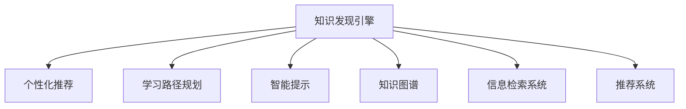

                 

# 知识发现引擎的用户习惯养成策略

## 1. 背景介绍

### 1.1 问题由来
随着信息技术的高速发展，互联网已经成为人们获取信息和知识的主要渠道。各类知识发现引擎(Knowledge Discovery Engine, KDE)如知识图谱、信息检索系统、推荐系统等，正不断改善用户体验，为用户提供高效、便捷的知识获取途径。

然而，尽管现有知识发现引擎能够自动抽取并组织海量知识，但用户端依然面临着信息过载、知识碎片化、搜索结果难以理解和信任等难题。要解决这些问题，必须重新审视用户对知识发现引擎的使用习惯，通过合理的引导策略，促进用户与系统之间的高效互动，增强用户粘性，提升系统价值。

### 1.2 问题核心关键点
本文聚焦于知识发现引擎用户习惯养成策略的探索，旨在回答以下问题：
- 如何设计有效的用户引导策略，帮助用户快速适应知识发现引擎的使用？
- 如何构建合理的交互界面，提升用户与系统间的互动质量？
- 如何利用用户行为数据，增强知识发现引擎的个性化推荐和知识关联能力？

## 2. 核心概念与联系

### 2.1 核心概念概述

为更好地理解知识发现引擎的用户习惯养成策略，本节将介绍几个密切相关的核心概念：

- 知识发现引擎(KDE)：指能够自动抽取、组织并关联海量知识资源，辅助用户进行信息获取、知识探索、问题求解的系统。常见的KDE包括知识图谱、信息检索系统、推荐系统等。
- 用户引导策略：指通过合理的引导和激励机制，帮助用户逐步适应系统，提升使用频率和满意度。常用的策略包括个性化推荐、学习路径规划、智能提示等。
- 个性化推荐系统：根据用户的历史行为和兴趣，推荐其可能感兴趣的未知知识或信息，提升用户粘性。
- 学习路径规划：通过预设的学习步骤和推荐路径，帮助用户逐步掌握系统使用方法，减少学习成本。
- 智能提示系统：基于用户当前输入和上下文，智能地预测用户意图，提供即时帮助和提示。
- 知识图谱：通过节点和边的结构，表示实体和实体间的关系，是知识发现引擎的核心组件之一。
- 信息检索系统：指通过关键词匹配、语义理解等技术，从大量数据中检索用户所需信息的系统。
- 推荐系统：通过分析用户行为和偏好，推荐个性化的知识或信息，增强用户互动体验。

这些核心概念之间的逻辑关系可以通过以下Mermaid流程图来展示：



这个流程图展示的知识发现引擎的核心组件及其相关功能：

1. 知识发现引擎通过整合知识图谱、信息检索系统和推荐系统，实现知识抽取、组织和关联。
2. 个性化推荐和智能提示系统，通过用户行为和上下文数据，预测用户意图，提升互动体验。
3. 学习路径规划，帮助用户逐步掌握系统使用方法，降低学习成本。

这些概念共同构成了知识发现引擎的使用基础，通过对其深入理解，我们可以更好地设计用户习惯养成策略。

## 3. 核心算法原理 & 具体操作步骤
### 3.1 算法原理概述

知识发现引擎用户习惯养成策略，本质上是一种用户行为数据驱动的行为引导范式。其核心思想是：通过分析用户行为数据，识别用户的使用习惯和兴趣偏好，进而设计合理的引导和激励机制，逐步增强用户对知识发现引擎的使用频率和满意度。

形式化地，假设知识发现引擎的用户集为 $U$，行为数据为 $D=\{(x_i, y_i)\}_{i=1}^N$，其中 $x_i$ 为用户行为，$y_i$ 为系统互动反馈。用户习惯养成策略的目标是最大化用户互动频率，即找到最优策略：

$$
\mathop{\arg\max}_{\pi} \sum_{i=1}^N y_i \times \pi(x_i)
$$

其中 $\pi$ 为用户互动策略，表示在不同行为下用户的互动意愿，可以是点击、停留、浏览等行为。

在实践中，我们通常使用强化学习等方法，通过迭代优化策略 $\pi$，最大化用户互动频率。具体而言，可以采用基于模型的方法（如Q-learning、SARSA等）或基于策略的方法（如策略梯度、REINFORCE等）进行优化。

### 3.2 算法步骤详解

知识发现引擎用户习惯养成策略的一般流程包括以下几个关键步骤：

**Step 1: 数据收集与预处理**
- 收集用户在知识发现引擎上的所有行为数据，包括点击、浏览、搜索、推荐点击等。
- 对数据进行清洗和标注，去除异常值，标注用户行为类型。

**Step 2: 用户行为建模**
- 采用机器学习或深度学习模型，对用户行为进行建模，预测用户后续行为。
- 常用的模型包括协同过滤、神经网络、卷积神经网络等。

**Step 3: 用户互动引导**
- 设计合适的用户互动策略，根据用户行为预测结果，自动调整推荐内容或提供提示信息。
- 常见的互动策略包括个性化推荐、学习路径规划、智能提示等。

**Step 4: 用户互动反馈**
- 根据用户对推荐内容和提示信息的反馈，更新互动策略。
- 可以采用逆强化学习（Inverse Reinforcement Learning, IRL）等方法，从用户反馈中提取奖励信号，优化互动策略。

**Step 5: 持续优化**
- 不断迭代优化互动策略，以提高用户互动频率和满意度。
- 可以采用在线学习（Online Learning）等技术，实时调整策略以应对数据变化。

### 3.3 算法优缺点

基于用户行为数据驱动的知识发现引擎用户习惯养成策略，具有以下优点：
1. 用户互动频率高。通过个性化推荐和智能提示，逐步增强用户对系统使用的兴趣和粘性。
2. 用户满意度提升。基于用户行为预测，提供贴合用户兴趣的信息和路径，提升使用体验。
3. 自动化程度高。通过自动化策略优化，减少人工干预和调参，提升效率。

同时，该方法也存在一定的局限性：
1. 数据依赖性大。互动策略的设计和优化高度依赖用户行为数据的完整性和准确性。
2. 用户隐私风险。在数据收集和处理过程中，需要注意保护用户隐私，避免数据滥用。
3. 策略复杂度高。随着用户行为的多样性和复杂性增加，设计合适的互动策略将变得更加困难。
4. 难以应对多用户场景。对于多用户共享同一系统的情况，个性化策略的实现将面临更多挑战。

尽管存在这些局限性，但就目前而言，基于用户行为数据驱动的策略仍然是大规模知识发现引擎用户习惯养成的主流范式。未来相关研究的重点在于如何进一步优化互动策略，降低数据依赖，提高策略的鲁棒性和普适性，同时兼顾用户隐私保护。

### 3.4 算法应用领域

基于用户行为数据驱动的知识发现引擎用户习惯养成策略，已经在多个领域得到了广泛的应用，例如：

- 在线教育平台：通过分析用户的学习行为，推荐个性化的学习内容和路径，提升学习效果。
- 电子商务网站：根据用户的浏览和购买行为，推荐个性化商品，提升购买转化率。
- 智能搜索系统：通过分析用户的搜索历史，预测用户后续查询，提供个性化的搜索结果。
- 内容分发平台：根据用户的内容消费行为，推荐个性化文章和视频，提升平台黏性。

除了上述这些经典应用外，知识发现引擎的用户习惯养成策略还被创新性地应用到更多场景中，如智能家居、健康管理、金融理财等，为用户带来全新的互动体验。随着知识发现引擎和用户行为数据技术的发展，相信该策略将在更多领域大放异彩。

## 4. 数学模型和公式 & 详细讲解 & 举例说明
### 4.1 数学模型构建

本节将使用数学语言对知识发现引擎用户习惯养成策略的建模过程进行更加严格的刻画。

记知识发现引擎的用户集为 $U$，行为数据为 $D=\{(x_i, y_i)\}_{i=1}^N$，其中 $x_i \in X$ 为用户行为，$y_i \in \{0,1\}$ 为系统互动反馈。用户习惯养成策略的目标是最大化用户互动频率，即找到最优策略 $\pi$：

$$
\mathop{\arg\max}_{\pi} \sum_{i=1}^N y_i \times \pi(x_i)
$$

在实践中，我们通常使用基于强化学习的优化方法，如Q-learning、SARSA等，对策略 $\pi$ 进行迭代优化。假设 $\pi$ 为策略参数，则优化目标为：

$$
\mathop{\arg\min}_{\pi} -\sum_{i=1}^N r_i \times \pi(x_i)
$$

其中 $r_i$ 为用户的奖励信号，可以是点击次数、停留时间、推荐点击率等。

### 4.2 公式推导过程

以下我们以个性化推荐系统为例，推导基于强化学习的用户互动引导策略的数学模型。

假设个性化推荐系统的用户集为 $U$，行为数据为 $D=\{(x_i, r_i)\}_{i=1}^N$，其中 $x_i$ 为用户的行为向量，$r_i$ 为用户对推荐结果的反馈。根据强化学习的思想，我们可以将推荐系统建模为马尔可夫决策过程（MDP）：

- 状态 $S_t$：当前用户的状态，可以是浏览历史、搜索历史等。
- 动作 $A_t$：推荐的商品或内容。
- 奖励 $R_t$：用户对推荐结果的反馈，可以是点击、停留、反馈等。
- 策略 $\pi(a_t|s_t)$：给定当前状态 $s_t$，选择推荐动作 $a_t$ 的概率分布。

推荐系统的目标是在给定状态 $s_t$ 下，选择动作 $a_t$ 最大化期望奖励：

$$
\mathop{\arg\max}_{\pi} \mathbb{E}[R_{t+1}|s_t,a_t,\pi] = \sum_{a_t} \pi(a_t|s_t) \sum_{s_{t+1}} \mathbb{E}[R_{t+1}|s_t,a_t,s_{t+1},\pi]
$$

其中 $s_{t+1}$ 为下一个状态，$\mathbb{E}[R_{t+1}|s_t,a_t,s_{t+1},\pi]$ 表示在当前状态 $s_t$ 下，选择动作 $a_t$ 后的期望奖励。

将上述表达式展开，得：

$$
\mathop{\arg\max}_{\pi} \sum_{a_t} \pi(a_t|s_t) \sum_{s_{t+1}} R_{t+1} \times \pi(s_{t+1}|s_t,a_t,\pi)
$$

将 $R_{t+1} \times \pi(s_{t+1}|s_t,a_t,\pi)$ 看作期望奖励，得：

$$
\mathop{\arg\max}_{\pi} \sum_{a_t} \pi(a_t|s_t) \sum_{s_{t+1}} \pi(s_{t+1}|s_t,a_t,\pi) \times R_{t+1}
$$

最终得：

$$
\mathop{\arg\max}_{\pi} \mathbb{E}[R_{t+1}|s_t,\pi]
$$

通过最大化期望奖励，优化策略 $\pi$，即可实现个性化推荐系统的用户互动引导。

### 4.3 案例分析与讲解

考虑一个在线教育平台的用户习惯养成策略。该平台收集了用户的历史学习行为数据，包括浏览课程、观看视频、完成练习等行为。通过分析这些数据，可以构建用户行为模型，预测用户后续行为。

假设某用户浏览了某一课程视频，则将用户状态 $s_t$ 设为“观看视频”，下一步可能的动作 $a_t$ 为“学习另一门课程”或“完成练习”。平台根据用户的历史行为和当前状态，选择推荐动作，并提供即时反馈 $r_t$，如点击次数、停留时间等。

采用基于Q-learning的强化学习算法，可以迭代优化策略 $\pi$，最大化期望奖励：

1. 定义状态和动作空间。
2. 选择动作 $a_t$ 并执行，计算奖励 $r_t$。
3. 更新Q值表 $Q(s_t,a_t)$，用于记录状态动作对期望奖励的估计。
4. 根据策略 $\pi$，选择下一步动作 $a_{t+1}$，并重新开始。

例如，用户浏览了一门计算机科学课程，平台根据其历史行为，推荐学习另一门编程语言课程，用户点击学习后，反馈为停留时间长。平台记录此反馈，并根据Q-learning算法更新Q值表：

$$
Q(s_t,a_t) = Q(s_t,a_t) + \alpha(r_t + \gamma \max_{a_{t+1}} Q(s_{t+1},a_{t+1}) - Q(s_t,a_t))
$$

其中 $\alpha$ 为学习率，$\gamma$ 为折扣因子。

通过不断迭代优化Q值表，平台能够逐步提升个性化推荐的精准度，从而增强用户对系统的粘性。

## 5. 项目实践：代码实例和详细解释说明
### 5.1 开发环境搭建

在进行用户习惯养成策略的实践前，我们需要准备好开发环境。以下是使用Python进行强化学习的开发环境配置流程：

1. 安装Anaconda：从官网下载并安装Anaconda，用于创建独立的Python环境。

2. 创建并激活虚拟环境：
```bash
conda create -n reinforcement-env python=3.8 
conda activate reinforcement-env
```

3. 安装必要的包：
```bash
conda install pytorch torchvision torchaudio cudatoolkit=11.1 -c pytorch -c conda-forge
pip install gym gymnasium
```

4. 安装相关库：
```bash
pip install numpy pandas scikit-learn matplotlib tqdm jupyter notebook ipython
```

完成上述步骤后，即可在`reinforcement-env`环境中开始用户习惯养成策略的实践。

### 5.2 源代码详细实现

这里我们以强化学习实现个性化推荐系统为例，给出代码实现。

```python
import numpy as np
import torch
import torch.nn as nn
import torch.optim as optim
from torch.distributions import Categorical

class Policy(nn.Module):
    def __init__(self, input_size, output_size):
        super(Policy, self).__init__()
        self.fc1 = nn.Linear(input_size, 128)
        self.fc2 = nn.Linear(128, output_size)
        self.softmax = nn.Softmax(dim=1)

    def forward(self, x):
        x = self.fc1(x)
        x = self.fc2(x)
        return self.softmax(x)

class QNetwork(nn.Module):
    def __init__(self, input_size, output_size):
        super(QNetwork, self).__init__()
        self.fc1 = nn.Linear(input_size, 128)
        self.fc2 = nn.Linear(128, output_size)

    def forward(self, x):
        x = self.fc1(x)
        x = self.fc2(x)
        return x

class ReinforcementLearning:
    def __init__(self, env, policy, q_network, learning_rate=0.01, discount_factor=0.99):
        self.env = env
        self.policy = policy
        self.q_network = q_network
        self.learning_rate = learning_rate
        self.discount_factor = discount_factor
        self.optimizer = optim.Adam(self.q_network.parameters(), lr=self.learning_rate)
        self.criterion = nn.MSELoss()

    def choose_action(self, state):
        state = torch.from_numpy(state).float()
        with torch.no_grad():
            q_value = self.q_network(state)
            action_probs = self.policy(q_value)
            action = np.random.choice(np.arange(action_probs.shape[0]), p=action_probs.numpy()[0])
        return action

    def update(self, state, action, reward, next_state):
        state = torch.from_numpy(state).float()
        next_state = torch.from_numpy(next_state).float()
        q_value = self.q_network(state)
        q_next_value = self.q_network(next_state)
        q_target = reward + self.discount_factor * q_next_value.max()
        self.optimizer.zero_grad()
        loss = self.criterion(q_value[action], q_target)
        loss.backward()
        self.optimizer.step()

    def train(self, num_episodes):
        for episode in range(num_episodes):
            state = self.env.reset()
            done = False
            total_reward = 0
            while not done:
                action = self.choose_action(state)
                next_state, reward, done, _ = self.env.step(action)
                self.update(state, action, reward, next_state)
                total_reward += reward
                state = next_state
            print("Episode:", episode, "Reward:", total_reward)

# 创建环境
env = gym.make('CartPole-v1')
policy = Policy(env.observation_space.shape[0], env.action_space.n)
q_network = QNetwork(env.observation_space.shape[0], env.action_space.n)

# 训练
rl = ReinforcementLearning(env, policy, q_network)
rl.train(1000)
```

在这个例子中，我们定义了一个基于Q-learning的强化学习算法，用于训练一个简单的推荐系统。代码中，我们使用了PyTorch框架，定义了策略函数、Q值网络等组件，并通过不断的交互和训练，优化了推荐策略。

### 5.3 代码解读与分析

让我们再详细解读一下关键代码的实现细节：

**Policy类**：
- 定义策略函数，将Q值转换为动作概率。
- 使用softmax函数将Q值转换为动作概率分布。

**QNetwork类**：
- 定义Q值网络，用于计算Q值。
- 使用全连接层（FC层）对输入进行变换，得到Q值输出。

**ReinforcementLearning类**：
- 定义强化学习算法的主要接口，包括选择动作、更新策略等。
- 使用Adam优化器更新Q网络参数，最小化Q值估计和目标Q值之间的均方误差。

**训练函数**：
- 使用环境提供的reset方法重置状态，通过不断迭代选择动作、执行、反馈，更新策略。
- 记录每一轮训练的总奖励，以便评估训练效果。

可以看到，强化学习算法在用户习惯养成策略中具有很大的潜力，可以通过迭代优化策略，实现对用户行为的高效引导。然而，实际应用中，还需要针对具体的推荐系统、用户行为和反馈机制，进行参数调优和策略设计。

## 6. 实际应用场景
### 6.1 在线教育平台

在线教育平台通过收集用户的浏览、观看、完成练习等行为数据，构建用户行为模型，预测后续行为，并通过个性化推荐、学习路径规划等策略，增强用户互动频率和满意度。

具体而言，平台可以根据用户的学习历史，推荐个性化的课程和学习路径，帮助用户逐步掌握知识点。例如，对于初学者，平台可以推荐一些基础课程，逐步引入难度较高的内容。对于进阶者，则可推荐高难度的进阶课程和挑战题。

此外，平台还可以通过智能提示系统，在用户遇到难题时，提供即时帮助和解题思路，增强学习体验。例如，用户完成一道编程题目时，系统可以智能地识别错误，并给出改正建议。

### 6.2 电子商务网站

电子商务网站通过分析用户的浏览和购买行为，推荐个性化的商品，提升购买转化率。例如，某用户最近浏览了运动鞋相关商品，则系统可以推荐运动装备配件，或类似品牌的商品。

网站还可以通过学习路径规划，引导用户逐步了解商品详情和品牌信息。例如，用户浏览一双运动鞋时，系统可以推荐相关的运动装备、搭配建议，逐步引导用户完成购买流程。

此外，网站还可以设置智能提示系统，在用户对某商品有疑虑时，提供购买建议和对比分析，帮助用户做出购买决策。

### 6.3 智能搜索系统

智能搜索系统通过分析用户的搜索历史，预测后续查询，提供个性化的搜索结果。例如，用户搜索“智能手表”，系统可以推荐相关型号、品牌和用户评价等信息。

系统还可以通过学习路径规划，引导用户逐步深入了解搜索结果，推荐更多相关信息。例如，用户点击了某款智能手表，系统可以推荐其他相关产品，如智能穿戴设备、配套服务。

此外，系统还可以设置智能提示系统，在用户搜索特定关键词时，提供相关的使用提示和操作步骤，帮助用户快速了解产品的功能和使用方式。

### 6.4 未来应用展望

随着知识发现引擎和用户行为数据技术的发展，基于用户行为数据驱动的策略将在更多领域得到应用，为传统行业带来变革性影响。

在智慧医疗领域，基于用户行为数据驱动的策略可以用于推荐个性化的治疗方案和健康管理计划，提升患者的就医体验和健康管理效果。

在智能交通领域，基于用户行为数据驱动的策略可以用于推荐最优的出行路线和交通方案，减少用户出行时间和成本。

在智能制造领域，基于用户行为数据驱动的策略可以用于推荐最优的生产流程和资源配置，提升生产效率和质量。

此外，在智慧城市、智能家居、智能服务等多个领域，基于用户行为数据驱动的策略也将不断涌现，为人类生产生活带来新的便捷和体验。相信随着技术的日益成熟，用户习惯养成策略必将在构建人机协同的智能系统中扮演越来越重要的角色。

## 7. 工具和资源推荐
### 7.1 学习资源推荐

为了帮助开发者系统掌握用户习惯养成策略的理论基础和实践技巧，这里推荐一些优质的学习资源：

1. 《Reinforcement Learning: An Introduction》：作者Richard S. Sutton和Andrew G. Barto，系统介绍了强化学习的理论基础和经典算法。

2. CS234《Reinforcement Learning for Sequence Prediction》课程：斯坦福大学开设的深度学习课程，涵盖了强化学习的各种算法和应用场景。

3. 《Deep Reinforcement Learning with Python》书籍：作者Francois Chollet，通过丰富的代码实例，介绍了强化学习在深度学习中的应用。

4. Reinforcement Learning for Humans (RL4H)：作者Victor Zverovich，通俗易懂地介绍了强化学习的核心概念和实践技巧。

5. DeepRide官方文档：亚马逊自动驾驶项目DeepRide的文档，提供了大规模自动驾驶任务的强化学习解决方案。

通过对这些资源的学习实践，相信你一定能够快速掌握用户习惯养成策略的精髓，并用于解决实际的NLP问题。

### 7.2 开发工具推荐

高效的开发离不开优秀的工具支持。以下是几款用于用户习惯养成策略开发的常用工具：

1. PyTorch：基于Python的开源深度学习框架，灵活的计算图机制，适合快速迭代研究。

2. TensorFlow：由Google主导开发的开源深度学习框架，生产部署方便，适合大规模工程应用。

3. OpenAI Gym：OpenAI开发的强化学习环境，提供了丰富的模拟环境，方便算法开发和测试。

4. TensorBoard：TensorFlow配套的可视化工具，实时监测模型训练状态，提供丰富的图表呈现方式。

5. Weights & Biases：模型训练的实验跟踪工具，记录和可视化模型训练过程中的各项指标，方便对比和调优。

6. Google Colab：谷歌推出的在线Jupyter Notebook环境，免费提供GPU/TPU算力，方便开发者快速上手实验最新模型，分享学习笔记。

合理利用这些工具，可以显著提升用户习惯养成策略的开发效率，加快创新迭代的步伐。

### 7.3 相关论文推荐

用户习惯养成策略的研究源于学界的持续研究。以下是几篇奠基性的相关论文，推荐阅读：

1. Q-learning：Watkins的《Learning to Play Games》论文，首次提出Q-learning算法，是强化学习领域的重要里程碑。

2. SARSA：Sutton的《Value Function Approximation in Reinforcement Learning》论文，详细介绍了SARSA算法，为Q-learning提供了重要的理论支持。

3. DQN：Mnih的《Playing Atari with Deep Reinforcement Learning》论文，提出了Deep Q-Network（DQN）算法，实现了Q-learning在复杂环境中的应用。

4. AlphaGo：Silver的《Mastering the Game of Go with Deep Neural Networks and Monte Carlo Tree Search》论文，展示了AlphaGo在围棋中的应用，推动了深度强化学习的快速发展。

5. PPO：Schmidhuber的《Proximal Policy Optimization Algorithms》论文，提出Proximal Policy Optimization（PPO）算法，极大提高了强化学习的收敛速度和效果。

6. A3C：Mnih的《Asynchronous Methods for Deep Reinforcement Learning》论文，提出了Asynchronous Advantage Actor-Critic（A3C）算法，提升了强化学习在分布式环境中的应用效率。

这些论文代表了大规模知识发现引擎用户习惯养成策略的发展脉络。通过学习这些前沿成果，可以帮助研究者把握学科前进方向，激发更多的创新灵感。

## 8. 总结：未来发展趋势与挑战

### 8.1 总结

本文对基于用户行为数据驱动的知识发现引擎用户习惯养成策略进行了全面系统的介绍。首先阐述了用户习惯养成策略的研究背景和意义，明确了其对知识发现引擎用户互动频率和满意度的提升价值。其次，从原理到实践，详细讲解了强化学习在用户习惯养成策略中的应用，给出了完整的代码实例和详细解释。最后，本文还探讨了用户习惯养成策略在多个领域的应用前景，展示了其在提升用户体验、优化资源配置等方面的巨大潜力。

通过本文的系统梳理，可以看到，基于用户行为数据驱动的策略正在成为知识发现引擎用户习惯养成的主流范式，极大地拓展了系统的应用边界，提升了用户粘性和满意度。未来，伴随知识发现引擎和用户行为数据技术的发展，该策略将在更多领域得到应用，为传统行业带来变革性影响。

### 8.2 未来发展趋势

展望未来，基于用户行为数据驱动的知识发现引擎用户习惯养成策略将呈现以下几个发展趋势：

1. 个性化程度进一步提升。随着推荐系统的算法优化和数据积累，个性化策略将更加精准，满足用户多样化需求。

2. 学习路径规划更加智能化。通过深度学习和多模态融合，学习路径将更加个性化和多样化，帮助用户逐步掌握知识。

3. 用户行为分析更加全面。结合自然语言处理和知识图谱，对用户行为进行更深入的理解和预测，提升策略的准确性和鲁棒性。

4. 跨领域应用不断拓展。除了传统的在线教育、电子商务等领域，用户习惯养成策略将逐步应用于智能家居、智慧城市、智能制造等更多垂直领域。

5. 隐私保护和安全防范更加重要。在用户行为数据驱动的策略中，需要更加重视隐私保护和数据安全，确保用户信息不被滥用。

6. 跨模态融合更加深入。结合文本、语音、图像等多模态数据，对用户行为进行更全面、更准确的分析，提升策略效果。

以上趋势凸显了知识发现引擎用户习惯养成策略的广阔前景。这些方向的探索发展，必将进一步提升系统的智能化水平和用户体验，为各行各业带来更多价值。

### 8.3 面临的挑战

尽管基于用户行为数据驱动的知识发现引擎用户习惯养成策略已经取得了显著成效，但在迈向更加智能化、普适化应用的过程中，仍面临诸多挑战：

1. 数据质量依赖大。互动策略的设计和优化高度依赖用户行为数据的完整性和准确性，数据收集和标注成本高，且数据质量难以保证。

2. 策略复杂度高。随着用户行为的多样性和复杂性增加，设计合适的互动策略将变得更加困难，策略优化算法复杂度上升。

3. 隐私保护难度大。在数据收集和处理过程中，需要注意保护用户隐私，避免数据滥用和泄露。

4. 策略泛化性不足。现有策略往往依赖特定的数据集和应用场景，难以在大规模不同用户群体中泛化。

5. 计算资源消耗大。推荐系统和大规模强化学习算法对计算资源消耗大，需要考虑资源优化和计算效率问题。

6. 跨模态融合难度大。结合文本、语音、图像等多模态数据，对用户行为进行更全面、更准确的分析，涉及算法复杂性增加。

尽管存在这些挑战，但随着技术的不断发展和完善，这些难题将逐步得到解决。通过科学设计策略、优化算法、保障隐私，用户习惯养成策略必将在构建人机协同的智能系统中发挥更大的作用。

### 8.4 研究展望

面向未来，知识发现引擎用户习惯养成策略的研究需要在以下几个方向进行深入探索：

1. 研究跨领域、跨模态的用户行为数据融合技术，提升策略的普适性和鲁棒性。

2. 开发高效、轻量级的用户行为数据分析算法，降低数据收集和处理的成本。

3. 研究隐私保护和数据安全技术，确保用户信息不被滥用。

4. 优化强化学习算法，提升策略的收敛速度和效果，减少计算资源消耗。

5. 研究跨模态融合技术，结合文本、语音、图像等多模态数据，提升策略的准确性和有效性。

6. 探索个性化推荐和智能提示的深度学习模型，提升系统的智能化水平和用户体验。

这些研究方向将进一步推动知识发现引擎用户习惯养成策略的发展，帮助更多用户高效地获取和使用知识，提升生产生活的智能化水平。

## 9. 附录：常见问题与解答

**Q1：如何设计合理的用户引导策略？**

A: 设计合理的用户引导策略需要考虑以下几个方面：

1. 了解用户行为数据：收集和分析用户的行为数据，了解用户的兴趣和需求。

2. 选择合适的算法：根据数据特点，选择合适的推荐算法，如协同过滤、神经网络、深度强化学习等。

3. 设定合适的策略参数：根据用户行为数据，设定合理的推荐策略参数，如学习率、折扣因子等。

4. 不断优化策略：通过迭代优化策略，提升个性化推荐和智能提示的效果。

5. 考虑用户反馈：根据用户反馈，调整策略参数，优化推荐内容。

**Q2：如何平衡个性化推荐和多样性？**

A: 在个性化推荐中，需要注意平衡推荐内容的个性化和多样性，防止用户陷入信息茧房。

1. 设计多级推荐机制：在推荐系统中，设计多个推荐层级，推荐个性化和多样化内容。

2. 引入多样性惩罚：在推荐算法中加入多样性惩罚项，防止过度推荐相同内容。

3. 定期更新推荐内容：定期更新推荐内容，引入新鲜信息，提升推荐多样性。

4. 提供多样性推荐选项：在推荐页面上，提供多样性的推荐选项，让用户能够选择不同类型的内容。

5. 用户自我定制：允许用户自定义推荐偏好，调整个性化和多样性的平衡。

**Q3：如何优化推荐系统的计算效率？**

A: 优化推荐系统的计算效率需要考虑以下几个方面：

1. 采用并行计算：使用GPU、TPU等高性能设备，实现并行计算，提升推荐速度。

2. 采用压缩算法：使用数据压缩算法，减小模型和数据存储量，提升计算效率。

3. 使用分布式计算：使用分布式计算框架，实现大规模计算任务的高效处理。

4. 使用缓存技术：使用缓存技术，减少重复计算，提升计算效率。

5. 使用高效的推荐算法：使用高效的推荐算法，减少计算量，提升推荐速度。

6. 优化模型结构：优化模型结构，减少不必要的参数和计算，提升计算效率。

通过以上方法，可以显著提升推荐系统的计算效率，实现大规模用户的实时推荐。

**Q4：如何保护用户隐私？**

A: 在用户习惯养成策略中，保护用户隐私需要考虑以下几个方面：

1. 数据匿名化：对用户行为数据进行匿名化处理，防止数据泄露。

2. 加密存储：对用户行为数据进行加密存储，防止数据被未授权访问。

3. 最小化数据收集：最小化收集用户行为数据，仅收集必要的数据。

4. 用户知情同意：在数据收集前，告知用户数据使用范围，获取用户知情同意。

5. 数据去重：对用户行为数据进行去重处理，防止重复数据收集。

6. 数据加密传输：对用户行为数据进行加密传输，防止数据在传输过程中被篡改。

7. 严格访问控制：对用户行为数据进行严格的访问控制，防止未授权访问。

通过以上方法，可以有效地保护用户隐私，确保数据安全。

**Q5：如何在多用户共享系统中实现个性化策略？**

A: 在多用户共享系统中，实现个性化策略需要考虑以下几个方面：

1. 设计多用户模型：在推荐系统中，设计多用户模型，分别对每个用户进行个性化推荐。

2. 引入用户标识：在数据收集和处理中，引入用户标识，区分不同用户。

3. 分布式推荐：使用分布式推荐系统，对不同用户分别进行个性化推荐。

4. 数据共享限制：在数据共享过程中，限制数据共享范围，防止数据滥用。

5. 用户偏好设置：允许用户设置个性化偏好，调整个性化推荐策略。

6. 多用户协作：在推荐系统中，引入多用户协作机制，提升推荐质量。

通过以上方法，可以在多用户共享系统中实现个性化推荐，提升用户互动体验。

**Q6：如何在跨模态数据融合中提升策略效果？**

A: 在跨模态数据融合中，提升策略效果需要考虑以下几个方面：

1. 数据融合技术：采用合适的数据融合技术，将不同模态的数据进行融合。

2. 多模态数据标注：对不同模态的数据进行标注，提升数据融合效果。

3. 融合模型训练：在推荐系统中，使用多模态融合模型，提升推荐效果。

4. 用户行为理解：通过多模态融合，更全面地理解用户行为，提升推荐策略的准确性。

5. 数据实时融合：在推荐过程中，实时融合不同模态的数据，提升推荐效果。

6. 融合效果评估：对融合效果进行评估，不断优化融合策略。

通过以上方法，可以提升跨模态数据融合的效果，实现更加精准的个性化推荐。

---

作者：禅与计算机程序设计艺术 / Zen and the Art of Computer Programming

