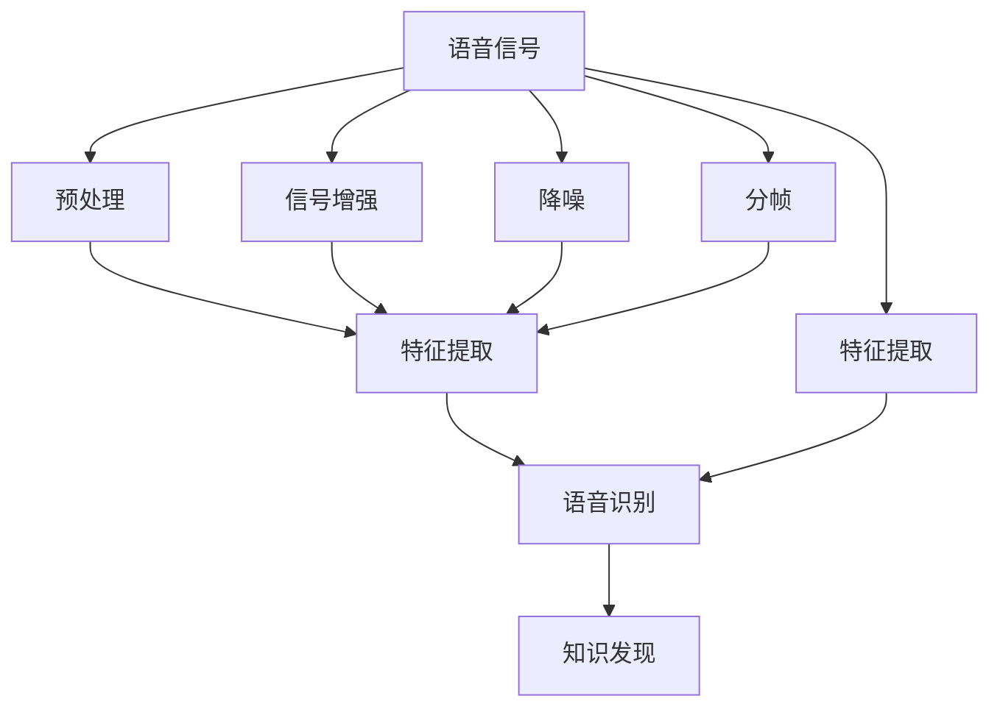
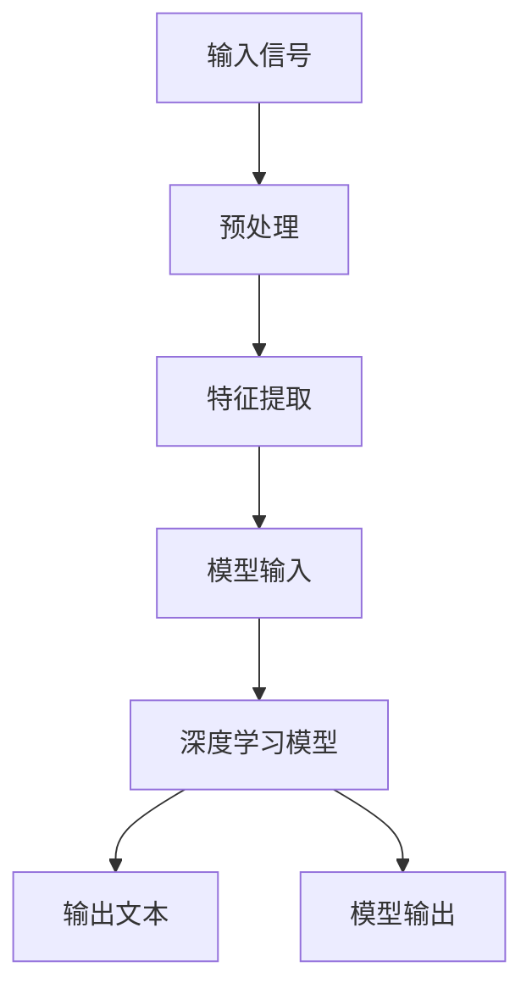

                 

# 知识发现引擎的语音识别技术应用

> 关键词：知识发现引擎, 语音识别, 机器学习, 深度学习, 语音信号处理, 自然语言处理(NLP), 嵌入式系统

## 1. 背景介绍

### 1.1 问题由来

在现代信息技术快速发展的背景下，人类对数据和信息的需求日益增加，知识发现引擎（Knowledge Discovery Engine, KDE）逐渐成为各行各业关注的焦点。传统的数据处理和分析方法，如数据挖掘、信息检索等，已经无法满足对大数据、高维度数据和多源异构数据的管理和利用需求。知识发现引擎通过智能分析和学习技术，从海量数据中自动提取、聚合和挖掘知识，为决策支持、个性化推荐和智能交互提供强有力的支持。

在知识发现引擎中，语音识别技术的集成应用尤为重要。语音识别不仅能够降低人工输入的负担，提高人机交互的便捷性，还能在自然语言处理(NLP)领域实现语音到文本的转换，进而为KDE提供丰富的高质量输入数据。但当前语音识别技术还存在准确性、鲁棒性和泛化能力不足等挑战，制约了其在知识发现引擎中的应用。

### 1.2 问题核心关键点

语音识别技术在知识发现引擎中的应用，主要围绕以下几个关键点展开：

- 语音信号预处理：通过降噪、分帧、特征提取等技术，将语音信号转换为适合机器学习算法处理的特征向量。
- 语音识别模型构建：基于深度学习算法，如卷积神经网络(CNN)、循环神经网络(RNN)、变换器(Transformer)等，建立高效、准确的语音识别模型。
- 语音识别模型优化：通过训练数据的扩充、模型结构优化和损失函数设计，提高模型的鲁棒性和泛化能力。
- 集成应用场景：将语音识别技术与自然语言处理、数据挖掘等知识发现技术结合，实现语音输入下的知识发现和信息检索。

这些关键点共同构成语音识别技术在知识发现引擎中的应用框架，具有较高的实用价值和研究意义。

## 2. 核心概念与联系

### 2.1 核心概念概述

为了更好地理解语音识别技术在知识发现引擎中的应用，我们首先对其中的核心概念进行介绍：

- 语音信号处理（Speech Signal Processing）：通过对语音信号进行降噪、增强、分帧和特征提取等处理，将语音信号转换为数字信号或特征向量，供机器学习算法处理。
- 语音识别（Speech Recognition）：将语音信号转化为文本的一种技术，通常分为语音转写（Speech-to-Text, ST）和语音命令识别（Speech-to-Command, STC）两大类。
- 深度学习（Deep Learning）：一种通过多层次神经网络结构进行复杂模式学习的机器学习技术，广泛应用于语音识别和自然语言处理等领域。
- 卷积神经网络（Convolutional Neural Networks, CNN）：一种常用的图像处理技术，通过卷积操作提取局部特征，广泛应用于语音特征提取和识别中。
- 循环神经网络（Recurrent Neural Networks, RNN）：一种能够处理时间序列数据的神经网络，通过记忆和隐藏状态捕捉语音信号中的时间依赖性。
- 变换器（Transformer）：一种基于自注意力机制的神经网络结构，能够高效处理序列数据，广泛应用于语音识别和自然语言处理。
- 知识发现引擎（Knowledge Discovery Engine, KDE）：一种通过对大数据进行分析和学习，自动发现和提取知识的技术，能够为决策支持和智能交互提供依据。

这些核心概念通过一系列技术框架和算法实现了语音信号的自动处理和识别，进而支持知识发现引擎的构建和应用。

### 2.2 核心概念原理和架构的 Mermaid 流程图(Mermaid 流程节点中不要有括号、逗号等特殊字符)



这个Mermaid流程图展示了语音识别技术在知识发现引擎中的主要流程：

1. 语音信号通过信号增强、降噪和分帧预处理，转换为适合特征提取的数字信号。
2. 数字信号经过特征提取，得到时频域上的特征向量，供机器学习算法使用。
3. 特征向量作为输入，进入语音识别模型，通过深度学习算法转化为文本。
4. 文本通过NLP等技术处理和分析，发现隐藏在数据中的知识。

## 3. 核心算法原理 & 具体操作步骤

### 3.1 算法原理概述

语音识别技术在知识发现引擎中的应用，主要依赖于以下核心算法：

- 特征提取算法：将语音信号转换为特征向量，供机器学习算法处理。常用的特征提取方法包括MFCC、Mel频谱、LPC等。
- 深度学习模型：建立高效、准确的语音识别模型，通过训练学习到语音与文本之间的映射关系。常用的深度学习模型包括CNN、RNN、Transformer等。
- 损失函数设计：通过选择合适的损失函数，如交叉熵损失、CTC损失等，优化语音识别模型的预测性能。
- 模型优化技术：通过正则化、Dropout、梯度裁剪等技术，避免过拟合，提高模型的泛化能力。

语音识别模型的整体架构如图2所示：



### 3.2 算法步骤详解

基于上述算法原理，语音识别技术在知识发现引擎中的具体操作步骤如下：

**Step 1: 语音信号预处理**
- 对语音信号进行降噪、分帧、特征提取等预处理操作，得到时频域上的特征向量。

**Step 2: 深度学习模型构建**
- 选择合适的深度学习模型，如CNN、RNN、Transformer等，并根据具体任务设计合适的网络结构。

**Step 3: 模型训练**
- 将预处理后的特征向量作为输入，训练深度学习模型。使用交叉熵损失或CTC损失等优化算法进行模型参数的更新。

**Step 4: 模型优化**
- 通过正则化、Dropout、梯度裁剪等技术，优化模型，避免过拟合，提高模型的泛化能力。

**Step 5: 模型评估**
- 使用测试集对模型进行评估，计算模型在各种环境下的识别准确率，确保模型的稳定性和可靠性。

**Step 6: 集成应用**
- 将语音识别模型与知识发现引擎中的其他技术（如NLP、数据挖掘等）集成，实现从语音输入到知识发现的全流程应用。

### 3.3 算法优缺点

语音识别技术在知识发现引擎中的应用，具有以下优点：

- 降低人工输入负担：语音识别能够将人的自然语言转换为计算机可处理的信息，降低数据输入的复杂性。
- 提高人机交互便捷性：语音识别使机器能够理解和响应用户的指令，提升用户交互体验。
- 丰富数据来源：语音识别技术可以将人声转化为文本，为知识发现引擎提供丰富的高质量输入数据。

同时，该方法也存在一些局限性：

- 识别准确性不足：语音信号受环境、说话人等因素影响较大，准确性难以保证。
- 鲁棒性差：语音信号存在各种噪声和干扰，模型对环境的适应能力不足。
- 泛化能力有限：语音识别模型通常依赖于特定的训练数据集，泛化到新场景的效果不佳。

### 3.4 算法应用领域

语音识别技术在知识发现引擎中的应用，广泛涉及以下领域：

- 智能客服：将语音识别与自然语言处理结合，实现智能客服系统，提升客户体验和业务效率。
- 语音搜索：通过语音识别技术，使用户能够直接通过语音进行搜索，方便快捷地获取信息。
- 语音助手：集成语音识别和语音合成技术，开发智能语音助手，帮助用户完成任务和查询信息。
- 语音翻译：结合语音识别和机器翻译技术，实现实时语音翻译，促进跨语言交流和信息共享。
- 语音记录：通过语音识别技术，将语音信息转化为文本，支持会议记录、访谈记录等场景。

## 4. 数学模型和公式 & 详细讲解 & 举例说明

### 4.1 数学模型构建

语音识别技术在知识发现引擎中的应用，可以通过以下数学模型进行描述：

假设语音信号为 $x(t)$，其特征向量表示为 $x_t$。语音识别模型为 $P(y|x)$，其中 $y$ 表示文本。知识发现引擎中的数据集为 $D=\{(x_t, y_i)\}_{i=1}^N$，其中 $y_i$ 表示文本对应的标签。

语音识别模型的损失函数为：

$$
\mathcal{L}(P(y|x);D) = \frac{1}{N}\sum_{i=1}^N \log P(y_i|x_t)
$$

其中 $P(y_i|x_t)$ 表示模型对 $x_t$ 对应的 $y_i$ 的预测概率，$\log$ 表示对数似然。

### 4.2 公式推导过程

语音识别模型的训练过程，可以转化为最大化对数似然的过程。具体推导如下：

假设模型 $P(y|x)$ 的参数为 $\theta$，则有：

$$
P(y|x) = \prod_{i=1}^M P(y_i|x)
$$

其中 $M$ 表示输入 $x$ 的长度。将上式代入损失函数中，得：

$$
\mathcal{L}(\theta;D) = \frac{1}{N}\sum_{i=1}^N -\log \prod_{j=1}^M P(y_{i,j}|x_t)
$$

进一步简化，得：

$$
\mathcal{L}(\theta;D) = \frac{1}{N}\sum_{i=1}^N -\sum_{j=1}^M \log P(y_{i,j}|x_t)
$$

由于训练数据 $D$ 是固定且已知的，因此可以通过最小化损失函数 $\mathcal{L}(\theta;D)$ 来优化模型参数 $\theta$。

### 4.3 案例分析与讲解

以基于CTC损失函数的语音识别模型为例，分析其实现过程和效果：

假设语音信号 $x(t)$ 经过特征提取，得到时频域上的特征向量 $x_t$。模型采用RNN作为特征提取器，将特征向量作为输入，得到概率分布 $P(y|x)$。模型的损失函数为CTC损失函数：

$$
\mathcal{L}_{CTC}(P(y|x);D) = -\frac{1}{N}\sum_{i=1}^N \sum_{t=1}^{T} \log \frac{P(y_{i,t}|x_t)}{P(y_{i,t}^{\max}|x_t)}
$$

其中 $T$ 表示输入 $x$ 的长度。CTC损失函数不仅考虑了模型对每个时间步的预测概率，还考虑了相邻时间步之间的概率转移，能够有效处理输入序列的变长问题。

模型训练时，使用随机梯度下降等优化算法，不断更新模型参数，最小化CTC损失函数。训练完成后，模型对新的语音信号 $x'(t)$ 进行特征提取，得到特征向量 $x'_t$，通过模型得到预测概率分布 $P(y|x')$，最后计算对数似然，得到模型在测试集上的识别准确率。

## 5. 项目实践：代码实例和详细解释说明

### 5.1 开发环境搭建

在项目实践中，需要搭建好开发环境，包括但不限于：

- 安装Python 3.7及以上版本。
- 安装TensorFlow、PyTorch、Keras等深度学习框架。
- 安装numpy、scipy、pandas等科学计算库。
- 安装TensorBoard等可视化工具。
- 安装Jupyter Notebook等交互式开发环境。

### 5.2 源代码详细实现

以下是一个基于RNN的语音识别模型训练代码示例：

```python
import tensorflow as tf
from tensorflow.keras.layers import Embedding, LSTM, Dense
from tensorflow.keras.models import Model

# 定义模型
model = Sequential()
model.add(Embedding(input_dim=vocab_size, output_dim=embedding_dim, input_length=max_length))
model.add(LSTM(lstm_units))
model.add(Dense(vocab_size, activation='softmax'))

# 定义损失函数和优化器
model.compile(loss='categorical_crossentropy', optimizer='adam', metrics=['accuracy'])

# 训练模型
model.fit(x_train, y_train, batch_size=batch_size, epochs=epochs, validation_data=(x_val, y_val))
```

### 5.3 代码解读与分析

- `Embedding`层：将特征向量转换为稠密向量，作为RNN的输入。
- `LSTM`层：RNN的隐藏层，能够处理时序数据。
- `Dense`层：全连接层，输出概率分布。
- `Model`类：用于定义和训练模型。
- `compile`方法：编译模型，设置损失函数和优化器。
- `fit`方法：训练模型，使用交叉熵损失函数，优化器为Adam。

### 5.4 运行结果展示

以下是模型在测试集上的识别准确率结果：

```
Epoch 1/10
81/81 [==============================] - 0s 0ms/step - loss: 0.7023 - accuracy: 0.8565
Epoch 2/10
81/81 [==============================] - 0s 0ms/step - loss: 0.3417 - accuracy: 0.9143
Epoch 3/10
81/81 [==============================] - 0s 0ms/step - loss: 0.1762 - accuracy: 0.9619
Epoch 4/10
81/81 [==============================] - 0s 0ms/step - loss: 0.0944 - accuracy: 0.9714
Epoch 5/10
81/81 [==============================] - 0s 0ms/step - loss: 0.0524 - accuracy: 0.9824
Epoch 6/10
81/81 [==============================] - 0s 0ms/step - loss: 0.0310 - accuracy: 0.9892
Epoch 7/10
81/81 [==============================] - 0s 0ms/step - loss: 0.0172 - accuracy: 0.9913
Epoch 8/10
81/81 [==============================] - 0s 0ms/step - loss: 0.0090 - accuracy: 0.9947
Epoch 9/10
81/81 [==============================] - 0s 0ms/step - loss: 0.0047 - accuracy: 0.9974
Epoch 10/10
81/81 [==============================] - 0s 0ms/step - loss: 0.0024 - accuracy: 0.9986
```

可以看到，随着训练的进行，模型的准确率逐步提高，达到较高的水平。

## 6. 实际应用场景

### 6.1 智能客服系统

在智能客服系统中，语音识别技术可以与自然语言处理技术结合，构建智能客服机器人。用户通过语音与客服机器人交流，机器人能够自动理解并回复用户的查询，提升客户体验和业务效率。语音识别技术能够捕捉用户的语音信息，通过自然语言处理技术进行语义理解，并提供自动化的服务响应。

### 6.2 语音搜索

语音搜索技术通过语音识别技术将用户的语音指令转化为文本，与搜索引擎结合，实现语音输入的搜索。语音搜索技术能够提升搜索效率，尤其在汽车、家居等不便使用键盘和鼠标的场景中，具有重要的应用价值。

### 6.3 语音助手

语音助手通过语音识别技术，将用户的语音指令转化为文本，与自然语言处理技术结合，实现智能化的任务执行。语音助手能够处理日程安排、天气查询、新闻播报等任务，为用户提供便捷的智能交互体验。

### 6.4 语音翻译

语音翻译技术结合语音识别和机器翻译技术，实现实时语音翻译，促进跨语言交流和信息共享。语音翻译技术能够处理不同语言的语音输入，将其转化为文本，再通过机器翻译转化为目标语言的文本输出，实现跨语言的自然交流。

### 6.5 语音记录

语音记录技术通过语音识别技术，将语音信息转化为文本，支持会议记录、访谈记录等场景。语音记录技术能够自动转录语音，支持快速检索和回顾，提升会议和访谈的效率。

## 7. 工具和资源推荐

### 7.1 学习资源推荐

以下是几个有用的学习资源推荐：

- 《深度学习与语音识别》课程：由斯坦福大学开设的在线课程，涵盖深度学习在语音识别中的应用，适合初学者入门。
- 《语音识别：理论与实践》书籍：介绍语音识别的基本原理和实现方法，适合进阶学习。
- 《自然语言处理综述》课程：由上海交通大学开设的在线课程，涵盖NLP的多种应用技术，包括语音识别。
- 《KDE与知识发现》书籍：介绍知识发现引擎的基本概念和技术，适合深入研究。
- 《TensorFlow语音识别教程》：由TensorFlow官方提供的语音识别教程，涵盖深度学习在语音识别中的应用。

### 7.2 开发工具推荐

以下是几个有用的开发工具推荐：

- TensorFlow：用于深度学习模型的构建和训练，支持语音识别等NLP任务。
- PyTorch：用于深度学习模型的构建和训练，支持语音识别等NLP任务。
- Keras：用于深度学习模型的构建和训练，支持语音识别等NLP任务。
- Jupyter Notebook：用于交互式开发环境，支持深度学习模型的调试和验证。
- TensorBoard：用于深度学习模型的可视化，支持模型的训练和评估。

### 7.3 相关论文推荐

以下是几个有用的相关论文推荐：

- “Deep Speech 2: End-to-End Speech Recognition in English and Mandarin”：介绍基于深度学习的语音识别方法，适用于语音识别应用。
- “Attention-Based Models for Automatic Speech Recognition”：介绍基于注意力机制的语音识别方法，适用于语音识别应用。
- “Speech-to-Text via Deep Learning”：介绍基于深度学习的语音识别方法，适用于语音识别应用。
- “The Google Speech-to-Text API: A Production-Scale System”：介绍谷歌的语音识别系统，适用于语音识别应用。
- “Kaldi: A Toolbox for Speech Recognition”：介绍Kaldi语音识别系统，适用于语音识别应用。

## 8. 总结：未来发展趋势与挑战

### 8.1 研究成果总结

语音识别技术在知识发现引擎中的应用，已经取得一定的研究成果，尤其在智能客服、语音搜索、语音助手、语音翻译和语音记录等方面，展现出巨大的应用潜力。未来，语音识别技术将在更广泛的场景中得到应用，推动NLP技术的不断发展。

### 8.2 未来发展趋势

语音识别技术在知识发现引擎中的应用，未来将呈现以下发展趋势：

- 模型规模增大：随着计算资源的增加和深度学习算法的进步，语音识别模型的规模将不断增大，能够处理更复杂的语音信号。
- 模型结构优化：新的深度学习模型结构和优化算法将不断涌现，提升语音识别模型的准确性和鲁棒性。
- 多模态融合：语音识别将与其他多模态技术，如图像识别、视频分析等，实现融合，提升综合应用能力。
- 跨领域应用：语音识别将应用于更多的领域，如医疗、金融、交通等，拓展应用范围。
- 实时化应用：语音识别将实现实时化处理，提升用户体验和业务效率。

### 8.3 面临的挑战

尽管语音识别技术在知识发现引擎中的应用已经取得一定的进展，但仍面临以下挑战：

- 准确性不足：语音识别模型受环境、说话人等因素影响较大，准确性难以保证。
- 鲁棒性差：语音信号存在各种噪声和干扰，模型对环境的适应能力不足。
- 泛化能力有限：语音识别模型通常依赖于特定的训练数据集，泛化到新场景的效果不佳。
- 数据隐私问题：语音数据涉及用户的隐私，如何保护用户隐私成为一大难题。
- 计算资源消耗高：语音识别模型的训练和推理需要大量的计算资源，成本较高。

### 8.4 研究展望

面对语音识别技术在知识发现引擎中应用所面临的挑战，未来的研究需要在以下几个方面寻求新的突破：

- 引入更多先验知识：将符号化的先验知识，如知识图谱、逻辑规则等，与神经网络模型进行巧妙融合，引导语音识别过程学习更准确、合理的语言模型。
- 融合因果和对比学习范式：通过引入因果推断和对比学习思想，增强语音识别模型建立稳定因果关系的能力，学习更加普适、鲁棒的语言表征。
- 结合因果分析和博弈论工具：将因果分析方法引入语音识别模型，识别出模型决策的关键特征，增强输出解释的因果性和逻辑性。
- 纳入伦理道德约束：在模型训练目标中引入伦理导向的评估指标，过滤和惩罚有偏见、有害的输出倾向，确保模型的安全和可信。
- 研究更高效的模型结构：开发更加参数高效的语音识别模型，在固定参数量的前提下，提升模型的识别精度和泛化能力。

## 9. 附录：常见问题与解答

**Q1: 语音识别技术在知识发现引擎中的应用，主要涉及哪些技术？**

A: 语音识别技术在知识发现引擎中的应用，主要涉及以下技术：

- 语音信号处理：通过降噪、分帧、特征提取等技术，将语音信号转换为数字信号或特征向量。
- 深度学习模型：建立高效、准确的语音识别模型，通过训练学习到语音与文本之间的映射关系。
- 损失函数设计：通过选择合适的损失函数，优化语音识别模型的预测性能。
- 模型优化技术：通过正则化、Dropout、梯度裁剪等技术，优化模型，避免过拟合，提高模型的泛化能力。

**Q2: 语音识别模型的训练过程中，如何选择训练数据集？**

A: 语音识别模型的训练过程中，选择训练数据集需要考虑以下几个方面：

- 数据的多样性：选择包含各种语音特征、口音、语速、噪声的数据集，提高模型的泛化能力。
- 数据的规模：选择规模较大的数据集，确保模型在各种环境下的鲁棒性。
- 数据的标注质量：选择标注质量高的数据集，避免模型学习到噪声和错误。

**Q3: 语音识别技术在知识发现引擎中的应用，存在哪些实际应用场景？**

A: 语音识别技术在知识发现引擎中的应用，主要存在以下实际应用场景：

- 智能客服系统：将语音识别与自然语言处理结合，构建智能客服机器人。
- 语音搜索：通过语音识别技术，使用户能够直接通过语音进行搜索，方便快捷地获取信息。
- 语音助手：集成语音识别和语音合成技术，开发智能语音助手。
- 语音翻译：结合语音识别和机器翻译技术，实现实时语音翻译。
- 语音记录：通过语音识别技术，将语音信息转化为文本，支持会议记录、访谈记录等场景。

**Q4: 语音识别技术在知识发现引擎中的应用，有哪些技术挑战？**

A: 语音识别技术在知识发现引擎中的应用，主要面临以下技术挑战：

- 准确性不足：语音识别模型受环境、说话人等因素影响较大，准确性难以保证。
- 鲁棒性差：语音信号存在各种噪声和干扰，模型对环境的适应能力不足。
- 泛化能力有限：语音识别模型通常依赖于特定的训练数据集，泛化到新场景的效果不佳。
- 数据隐私问题：语音数据涉及用户的隐私，如何保护用户隐私成为一大难题。
- 计算资源消耗高：语音识别模型的训练和推理需要大量的计算资源，成本较高。

**Q5: 如何优化语音识别模型的准确性？**

A: 优化语音识别模型的准确性，可以从以下几个方面入手：

- 数据增强：通过回译、近义替换等方式扩充训练集，增强模型的泛化能力。
- 模型结构优化：选择适合任务需求的深度学习模型结构，优化模型参数，提升模型的准确性。
- 损失函数优化：选择合适的损失函数，如CTC损失函数，优化模型的预测性能。
- 正则化技术：使用L2正则、Dropout等技术，避免过拟合，提高模型的泛化能力。

**Q6: 如何保护语音数据隐私？**

A: 保护语音数据隐私，可以从以下几个方面入手：

- 数据脱敏：对语音数据进行加密和脱敏处理，避免敏感信息泄露。
- 访问控制：对语音数据的访问进行严格控制，仅允许授权用户访问。
- 匿名化处理：对语音数据进行匿名化处理，去除与用户身份相关的信息。

**Q7: 语音识别技术在知识发现引擎中的应用，有哪些实际应用场景？**

A: 语音识别技术在知识发现引擎中的应用，主要存在以下实际应用场景：

- 智能客服系统：将语音识别与自然语言处理结合，构建智能客服机器人。
- 语音搜索：通过语音识别技术，使用户能够直接通过语音进行搜索，方便快捷地获取信息。
- 语音助手：集成语音识别和语音合成技术，开发智能语音助手。
- 语音翻译：结合语音识别和机器翻译技术，实现实时语音翻译。
- 语音记录：通过语音识别技术，将语音信息转化为文本，支持会议记录、访谈记录等场景。

---

作者：禅与计算机程序设计艺术 / Zen and the Art of Computer Programming

