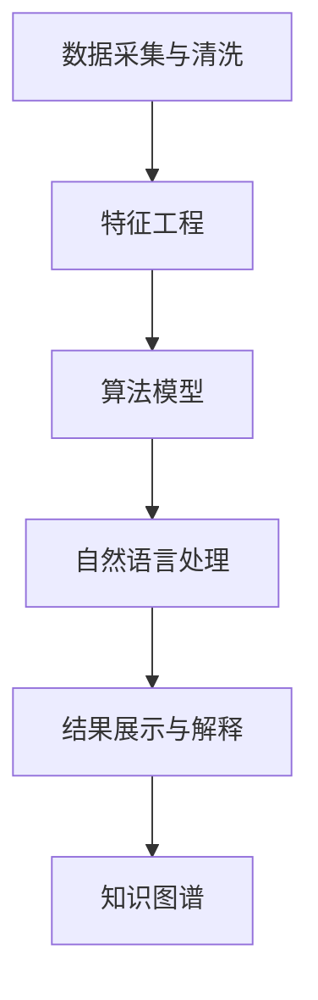

                 

# 知识发现引擎：人类认知的新frontier

> 关键词：知识发现,认知引擎,数据挖掘,机器学习,深度学习,自然语言处理

## 1. 背景介绍

### 1.1 问题由来

人类认知的边界正在不断扩展。随着计算机和互联网的普及，人类获取和处理信息的能力得到了前所未有的提升。数据量呈指数级增长，但信息的获取和整理却显得愈发困难。如何将海量数据转化为可理解、可操作的知識，成为了一个重要而迫切的问题。

数据挖掘、机器学习和深度学习等技术的迅猛发展，为这一问题提供了有效的解决方案。基于数据驱动的知識发现引擎，正逐渐成为连接人类认知与海量信息的重要桥梁。这种引擎通过智能算法从数据中挖掘出有价值的模式和规律，帮助人们快速、准确地理解复杂的现象和变化趋势。

### 1.2 问题核心关键点

知识发现引擎的本质，是一种集成了数据挖掘、机器学习和自然语言处理等技术的智能系统。其核心目标是从海量数据中提取有用的知識，支持决策、管理和优化等业务活动。

在技术实现上，知识发现引擎主要包含以下几个关键点：

- **数据采集与清洗**：从不同数据源收集数据，并对其进行去重、缺失值填充、异常值处理等预处理操作。
- **特征工程**：根据业务需求，选择和构建最相关的特征，以支持后续的算法建模。
- **算法模型**：使用机器学习和深度学习模型进行数据建模，提取数据中的有价值知識。
- **自然语言处理**：对于文本数据，利用自然语言处理技术进行文本挖掘、情感分析、实体识别等操作。
- **结果展示与解释**：将模型输出结果进行可视化展示，并提供易于理解的解释和建议。

## 2. 核心概念与联系

### 2.1 核心概念概述

为更好地理解知识发现引擎，本节将介绍几个密切相关的核心概念：

- **数据挖掘**：从数据集中发现并提取有价值的模式、规律和知识。
- **机器学习**：通过算法和模型从数据中学习，进行分类、回归、聚类等任务。
- **深度学习**：使用多层神经网络进行特征提取和模式识别，擅长处理复杂数据。
- **自然语言处理**：处理、理解、生成自然语言的技术，常用于文本数据挖掘和知识抽取。
- **知识图谱**：通过构建语义网络，表示实体间的关系和属性，帮助理解复杂知识结构。
- **解释性AI**：赋予模型更强的可解释性，使结果更具可信度和可接受性。

这些核心概念之间的逻辑关系可以通过以下Mermaid流程图来展示：



这个流程图展示了一组数据从采集到最终转化为知識的过程：

1. 数据经过清洗和特征提取后，被输入到算法模型中进行训练和预测。
2. 自然语言处理技术对文本数据进行挖掘和分析，提取有价值的信息。
3. 结果可视化展示和解释，帮助用户理解模型输出。
4. 构建知识图谱，将提取的知識组织成语义网络。

这些步骤紧密相连，共同构成了知识发现引擎的工作框架，使其能够高效、准确地从数据中提取和利用有价值的知識。

## 3. 核心算法原理 & 具体操作步骤

### 3.1 算法原理概述

知识发现引擎的核心算法原理，可以概括为数据驱动的智能决策过程。其核心思想是通过算法和模型从数据中学习，并提取有价值的模式和规律，用于支持决策、管理和优化等业务活动。

形式化地，知识发现引擎的目标是找到一个映射函数 $f$，使得对于给定的输入数据 $x$，能够输出最佳的决策结果 $y=f(x)$。在实际应用中，我们通常使用监督学习、非监督学习、强化学习等机器学习范式，对数据进行建模和预测。

假设我们有一个带有标签的数据集 $D=\{(x_i,y_i)\}_{i=1}^N$，其中 $x_i$ 为输入特征，$y_i$ 为标签或输出结果。知识发现引擎的优化目标是最小化经验风险，即：

$$
\min_{f} \mathcal{L}(f,D) = \frac{1}{N} \sum_{i=1}^N \ell(f(x_i),y_i)
$$

其中 $\ell$ 为损失函数，通常使用交叉熵、均方误差等。通过对模型 $f$ 进行优化，我们希望最小化预测结果与真实标签之间的误差，从而提高模型的准确性和泛化能力。

### 3.2 算法步骤详解

知识发现引擎的实现一般包括以下几个关键步骤：

**Step 1: 数据准备**
- 收集原始数据，并进行清洗、特征提取等预处理操作。
- 构建标注数据集，划分训练集、验证集和测试集。

**Step 2: 模型训练**
- 选择合适的机器学习和深度学习算法，搭建模型。
- 使用训练集数据对模型进行训练，优化模型参数。
- 在验证集上评估模型性能，调整模型参数。

**Step 3: 结果评估**
- 在测试集上对模型进行最终评估，检验模型泛化能力。
- 分析模型输出的结果，评估模型的解释性和可靠性。

**Step 4: 知識抽取**
- 使用自然语言处理技术，从文本数据中提取有价值的信息。
- 构建知识图谱，将提取的知識组织成语义网络。

**Step 5: 结果展示**
- 将模型输出结果进行可视化展示，帮助用户理解。
- 提供易于理解的解释和建议，增强决策依据的可靠性。

以上是知识发现引擎的一般流程。在实际应用中，还需要针对具体业务场景，对模型选择、特征构建、结果解释等环节进行优化设计，以提高模型性能和用户体验。

### 3.3 算法优缺点

知识发现引擎具有以下优点：

- 高效性。能够快速从大量数据中提取有价值的知識，支持实时决策和优化。
- 可扩展性。算法和模型可以方便地嵌入到不同的业务系统中，适应多种场景。
- 智能性。通过智能算法，挖掘数据中的隐含模式和规律，提高决策的科学性和准确性。
- 灵活性。支持多类型数据，包括结构化、半结构化和非结构化数据，适应不同数据格式。

同时，该方法也存在一定的局限性：

- 对数据质量要求高。数据清洗和特征工程环节较为复杂，需要较高的数据质量保障。
- 模型复杂度高。复杂模型需要较大的计算资源和时间，可能难以实时处理大规模数据。
- 结果解释性不足。部分模型如深度神经网络，其内部工作机制难以解释，缺乏可解释性。
- 数据隐私问题。数据采集和处理过程中可能涉及用户隐私，需要严格的隐私保护措施。

尽管存在这些局限性，但知识发现引擎仍是目前数据驱动决策和优化中最为有效的工具之一。未来相关研究的重点在于如何进一步提高模型的智能性、解释性和可扩展性，同时兼顾数据隐私和安全性等因素。

### 3.4 算法应用领域

知识发现引擎在多个领域得到了广泛的应用，例如：

- 金融风险管理：通过对市场数据、交易数据等进行建模，提取风险因素，支持风险预测和管理。
- 医疗诊断辅助：利用患者病历、基因数据等进行疾病诊断，提供辅助诊断建议。
- 零售个性化推荐：分析用户行为数据，提取兴趣偏好，提供个性化商品推荐。
- 网络安全威胁检测：分析网络流量数据，检测潜在的安全威胁和攻击行为。
- 智能交通系统：通过交通数据、气象数据等进行交通预测和优化，提高交通管理效率。

除了上述这些经典应用外，知识发现引擎还被创新性地应用到更多场景中，如社交媒体情感分析、城市规划、资源优化等，为各行各业带来了显著的效率和效益提升。

## 4. 数学模型和公式 & 详细讲解 & 举例说明

### 4.1 数学模型构建

本节将使用数学语言对知识发现引擎的实现过程进行更加严格的刻画。

假设我们有一个包含 $M$ 个特征的样本 $x=(x_1, x_2, ..., x_M)$，其中 $x_i$ 为第 $i$ 个特征。对于二分类问题，我们希望学习一个分类器 $h(x)$，将其输入特征映射到二元输出 $y \in \{0, 1\}$。

设分类器 $h(x)$ 的参数为 $\theta$，则分类器的输出为：

$$
h(x) = f(x; \theta) = \sigma(\langle \theta, x \rangle + b)
$$

其中 $\sigma$ 为激活函数，通常使用 sigmoid 或 ReLU 等，$\langle \cdot, \cdot \rangle$ 为内积运算，$b$ 为偏置项。

给定带有标签的数据集 $D=\{(x_i, y_i)\}_{i=1}^N$，我们希望最小化分类误差，即交叉熵损失函数：

$$
\mathcal{L}(\theta) = -\frac{1}{N} \sum_{i=1}^N y_i \log h(x_i) + (1-y_i) \log (1-h(x_i))
$$

### 4.2 公式推导过程

以二分类问题为例，推导交叉熵损失函数的梯度计算过程。

设模型 $h(x)$ 在输入 $x$ 上的输出为 $\hat{y}=h(x)$，表示样本属于正类的概率。真实标签 $y \in \{0,1\}$。则二分类交叉熵损失函数定义为：

$$
\ell(h(x),y) = -[y\log \hat{y} + (1-y)\log (1-\hat{y})]
$$

将其代入经验风险公式，得：

$$
\mathcal{L}(\theta) = -\frac{1}{N}\sum_{i=1}^N [y_i\log h(x_i)+(1-y_i)\log(1-h(x_i))]
$$

根据链式法则，损失函数对参数 $\theta_k$ 的梯度为：

$$
\frac{\partial \mathcal{L}(\theta)}{\partial \theta_k} = -\frac{1}{N}\sum_{i=1}^N (\frac{y_i}{h(x_i)}-\frac{1-y_i}{1-h(x_i)}) \frac{\partial h(x_i)}{\partial \theta_k}
$$

其中 $\frac{\partial h(x_i)}{\partial \theta_k}$ 可进一步递归展开，利用自动微分技术完成计算。

在得到损失函数的梯度后，即可带入参数更新公式，完成模型的迭代优化。重复上述过程直至收敛，最终得到适应特定问题的最优模型参数 $\theta^*$。

## 5. 项目实践：代码实例和详细解释说明

### 5.1 开发环境搭建

在进行知识发现引擎的实践前，我们需要准备好开发环境。以下是使用Python进行Scikit-Learn和TensorFlow开发的环境配置流程：

1. 安装Anaconda：从官网下载并安装Anaconda，用于创建独立的Python环境。

2. 创建并激活虚拟环境：
```bash
conda create -n skl-env python=3.8 
conda activate skl-env
```

3. 安装Scikit-Learn：
```bash
pip install scikit-learn
```

4. 安装TensorFlow：根据CUDA版本，从官网获取对应的安装命令。例如：
```bash
conda install tensorflow tensorflow-gpu=2.5.0 -c pytorch -c conda-forge
```

5. 安装各类工具包：
```bash
pip install numpy pandas scikit-learn matplotlib tqdm jupyter notebook ipython
```

完成上述步骤后，即可在`skl-env`环境中开始项目实践。

### 5.2 源代码详细实现

下面我们以二分类问题为例，给出使用Scikit-Learn和TensorFlow对决策树模型进行知识发现引擎的PyTorch代码实现。

首先，定义数据集和模型：

```python
import numpy as np
from sklearn.datasets import make_classification
from sklearn.model_selection import train_test_split
from sklearn.tree import DecisionTreeClassifier
from sklearn.metrics import accuracy_score
import tensorflow as tf

# 生成随机二分类数据
X, y = make_classification(n_samples=1000, n_features=10, n_informative=5, n_classes=2, random_state=42)

# 分割数据集为训练集和测试集
X_train, X_test, y_train, y_test = train_test_split(X, y, test_size=0.2, random_state=42)

# 定义决策树模型
model = DecisionTreeClassifier(max_depth=3, random_state=42)

# 定义TensorFlow训练接口
def train_step(model, x, y):
    with tf.GradientTape() as tape:
        logits = model.predict(x)
        loss = tf.reduce_mean(tf.nn.sigmoid_cross_entropy_with_logits(labels=y, logits=logits))
    gradients = tape.gradient(loss, model.weights)
    optimizer.apply_gradients(zip(gradients, model.weights))
    return loss.numpy()

# 定义TensorFlow评估接口
def evaluate(model, x, y):
    logits = model.predict(x)
    predictions = tf.sigmoid(logits)
    accuracy = accuracy_score(y, predictions > 0.5)
    return accuracy.numpy()
```

然后，定义训练和评估函数：

```python
from tensorflow.keras import Sequential
from tensorflow.keras.layers import Dense, Input, Dropout
from tensorflow.keras.optimizers import Adam

# 定义TensorFlow模型
input_dim = X.shape[1]
input_tensor = Input(shape=(input_dim,))
hidden_layer = Dense(64, activation='relu')(input_tensor)
dropout_layer = Dropout(0.5)(hidden_layer)
output_layer = Dense(1, activation='sigmoid')(dropout_layer)
model = tf.keras.Model(inputs=input_tensor, outputs=output_layer)

# 定义损失函数和优化器
loss_fn = tf.keras.losses.BinaryCrossentropy()
optimizer = tf.keras.optimizers.Adam()

# 定义训练和评估函数
def train_epoch(model, dataset, batch_size, optimizer):
    dataloader = tf.data.Dataset.from_tensor_slices((dataset.train_x, dataset.train_y))
    dataloader = dataloader.shuffle(buffer_size=1000).batch(batch_size).prefetch(tf.data.experimental.AUTOTUNE)
    losses = []
    for x, y in dataloader:
        loss = train_step(model, x, y)
        losses.append(loss)
    return np.mean(losses)

def evaluate_epoch(model, dataset, batch_size):
    dataloader = tf.data.Dataset.from_tensor_slices((dataset.test_x, dataset.test_y))
    dataloader = dataloader.batch(batch_size).prefetch(tf.data.experimental.AUTOTUNE)
    accuracy = []
    for x, y in dataloader:
        acc = evaluate(model, x, y)
        accuracy.append(acc)
    return np.mean(accuracy)
```

最后，启动训练流程并在测试集上评估：

```python
epochs = 10
batch_size = 64

for epoch in range(epochs):
    loss = train_epoch(model, X_train, y_train, optimizer)
    print(f"Epoch {epoch+1}, train loss: {loss:.3f}")
    
    print(f"Epoch {epoch+1}, test accuracy: {evaluate_epoch(model, X_test, y_test)}")
```

以上就是使用TensorFlow和Scikit-Learn对决策树模型进行知识发现引擎的完整代码实现。可以看到，使用机器学习算法进行知識发现引擎的开发，可以借助开源工具和库，以相对简洁的代码实现复杂的数据建模和分析任务。

### 5.3 代码解读与分析

让我们再详细解读一下关键代码的实现细节：

**make_classification函数**：
- 生成了一个包含 1000 个样本的二分类数据集，每个样本有 10 个特征，其中 5 个特征对分类任务有影响。

**train_test_split函数**：
- 将数据集分割为训练集和测试集，比例为 80:20，方便后续模型的训练和评估。

**DecisionTreeClassifier模型**：
- 定义了一个最大深度为 3 的决策树模型，用于进行二分类任务。

**train_step函数**：
- 定义了TensorFlow的训练接口，使用梯度下降算法更新模型参数，同时计算损失函数。

**evaluate函数**：
- 定义了TensorFlow的评估接口，计算模型在测试集上的准确率。

**Sequential模型**：
- 使用TensorFlow的高级API，搭建了一个包含一个隐藏层和一个输出层的神经网络模型，用于进行二分类任务。

**train_epoch和evaluate_epoch函数**：
- 定义了TensorFlow的训练和评估函数，使用TensorFlow的DataLoader进行数据迭代，同时计算损失和准确率。

可以看到，Scikit-Learn和TensorFlow在知识发现引擎的开发中，都能提供强大的工具支持。Scikit-Learn提供了便捷的数据预处理和模型选择功能，TensorFlow则支持高效的数据流管理和模型训练，两者结合可以显著提升开发效率和模型性能。

当然，工业级的系统实现还需考虑更多因素，如模型的保存和部署、超参数的自动搜索、更灵活的任务适配层等。但核心的知识发现引擎框架基本与此类似。

## 6. 实际应用场景

### 6.1 金融风险管理

金融风险管理是知识发现引擎的重要应用场景之一。通过对市场数据、交易数据等进行建模，提取风险因素，支持风险预测和管理。

具体而言，可以收集市场的历史交易数据、新闻资讯、社交媒体数据等，构建多维度数据集。在此基础上对预训练模型进行微调，使其能够自动学习市场中的风险因素，并在新交易中识别出潜在的风险信号。

### 6.2 医疗诊断辅助

在医疗领域，知识发现引擎可以通过对患者病历、基因数据等进行建模，提取疾病特征，提供辅助诊断建议。

例如，可以通过病历数据中的症状、检查结果、家族病史等信息，训练出一个诊断模型，自动识别出可能患有某种疾病的患者。这种基于数据驱动的诊断方法，可以辅助医生进行初步筛选，提高诊断的准确性和效率。

### 6.3 零售个性化推荐

在零售行业，知识发现引擎可以通过分析用户行为数据，提取兴趣偏好，提供个性化商品推荐。

具体而言，可以收集用户的浏览、购买、评论等行为数据，构建用户画像和商品特征向量。在此基础上对预训练模型进行微调，使其能够自动学习用户兴趣和商品特征，从而生成个性化推荐结果。

### 6.4 网络安全威胁检测

在网络安全领域，知识发现引擎可以通过分析网络流量数据，检测潜在的安全威胁和攻击行为。

例如，可以收集网络流量中的攻击特征、恶意软件特征、异常行为特征等，训练出一个检测模型，自动检测出异常流量并发出警报。这种基于数据驱动的安全检测方法，可以显著提高网络安全防御的能力。

### 6.5 智能交通系统

在智能交通领域，知识发现引擎可以通过交通数据、气象数据等进行交通预测和优化，提高交通管理效率。

例如，可以收集交通流量、车辆位置、天气条件等数据，训练出一个交通预测模型，预测未来交通流量和拥堵情况。根据预测结果，可以调整信号灯配时、优化交通路线，提高交通管理水平。

### 6.6 未来应用展望

随着知识发现引擎的不断发展，其在更多领域的应用前景将更加广阔。例如：

- 智能制造：通过分析生产数据，优化生产流程，提高生产效率和质量。
- 智慧农业：通过分析气象、土壤、作物生长数据，优化种植方案，提高农业生产效率。
- 智慧城市：通过分析城市运行数据，优化资源配置，提升城市管理水平。
- 智慧能源：通过分析电力、气象数据，优化能源分配，提高能源利用效率。
- 智慧物流：通过分析物流数据，优化配送路线，提高物流效率和用户体验。

未来，知识发现引擎必将成为各行各业的重要工具，推动各行业数字化、智能化转型。

## 7. 工具和资源推荐

### 7.1 学习资源推荐

为了帮助开发者系统掌握知识发现引擎的理论基础和实践技巧，这里推荐一些优质的学习资源：

1. 《机器学习》系列书籍：由机器学习领域的著名专家撰写，系统介绍了机器学习的基本概念和算法，适合初学者入门。
2. 《深度学习》系列书籍：介绍了深度学习的基本原理和应用，适合深入学习深度学习技术的读者。
3. 《自然语言处理综论》书籍：介绍了自然语言处理的基本概念和技术，适合学习自然语言处理和知识发现引擎的读者。
4. Coursera上的《数据科学专业》课程：由斯坦福大学开设，包含机器学习、深度学习、自然语言处理等多个方面的内容，适合系统学习。
5. Kaggle平台：提供了大量数据集和比赛，可以帮助读者通过实践提升数据挖掘和知识发现的能力。

通过对这些资源的学习实践，相信你一定能够快速掌握知识发现引擎的精髓，并用于解决实际的知識发现问题。

### 7.2 开发工具推荐

高效的开发离不开优秀的工具支持。以下是几款用于知识发现引擎开发的常用工具：

1. Scikit-Learn：基于Python的机器学习库，提供简单易用的API，支持多种机器学习算法和模型。
2. TensorFlow：由Google主导开发的深度学习框架，支持高效的分布式计算和模型训练，适合大规模工程应用。
3. Weights & Biases：模型训练的实验跟踪工具，可以记录和可视化模型训练过程中的各项指标，方便对比和调优。
4. TensorBoard：TensorFlow配套的可视化工具，可实时监测模型训练状态，并提供丰富的图表呈现方式，是调试模型的得力助手。
5. Jupyter Notebook：用于数据科学和机器学习实验的交互式环境，支持多语言编程和可视化展示。

合理利用这些工具，可以显著提升知识发现引擎的开发效率，加快创新迭代的步伐。

### 7.3 相关论文推荐

知识发现引擎的研究源于学界的持续研究。以下是几篇奠基性的相关论文，推荐阅读：

1. K-means: Algorithms for clustering very large data sets (K-means算法)：提出了K-means聚类算法，是数据挖掘领域的经典算法之一。
2. Support Vector Machines for Data Mining (SVM算法)：提出了支持向量机算法，适用于分类、回归等多种数据挖掘任务。
3. Deep Learning (深度学习)：由Geoffrey Hinton等人撰写，介绍了深度学习的原理和应用，推动了深度学习技术的快速发展。
4. Knowledge Discovery in Databases (KDD)：介绍了知识发现引擎的基本概念和技术，是数据挖掘领域的经典论文。
5. Large-Scale Information Retrieval and Learning (大规模信息检索与学习)：由Yahoo! Research和Microsoft Research联合撰写，介绍了大规模数据检索与学习的技术。

这些论文代表了大规模数据挖掘和知识发现引擎的研究脉络。通过学习这些前沿成果，可以帮助研究者把握学科前进方向，激发更多的创新灵感。

## 8. 总结：未来发展趋势与挑战

### 8.1 总结

本文对知识发现引擎的实现过程和应用场景进行了全面系统的介绍。首先阐述了知识发现引擎的背景和核心目标，明确了其在数据驱动决策和优化中的独特价值。其次，从原理到实践，详细讲解了知识发现引擎的数学模型和关键步骤，给出了知识发现引擎的完整代码实例。同时，本文还广泛探讨了知识发现引擎在金融、医疗、零售、网络安全等多个领域的应用前景，展示了其在实际业务中的强大潜力。此外，本文精选了知识发现引擎的学习资源、开发工具和相关论文，力求为读者提供全方位的技术指引。

通过本文的系统梳理，可以看到，知识发现引擎正在成为各行各业的重要工具，为人类认知智能的进化带来深远影响。未来，伴随知识发现引擎的不断发展，其将进一步拓展人类认知的边界，推动各行业的数字化、智能化转型。

### 8.2 未来发展趋势

展望未来，知识发现引擎将呈现以下几个发展趋势：

1. 模型复杂度提升。随着计算能力的增强，知识发现引擎将能够处理更加复杂、多维度的数据集，提取更高层次的知識。
2. 多模态融合。知识发现引擎将不仅限于文本数据，还将支持图像、视频、语音等多模态数据的融合，构建更加全面的认知智能系统。
3. 交互式决策。知识发现引擎将支持用户交互式决策，实时根据用户反馈调整模型输出，提高决策的适应性和灵活性。
4. 实时决策。知识发现引擎将支持实时数据流处理，提供更加及时、准确的决策支持。
5. 解释性增强。知识发现引擎将更加注重模型的解释性和可理解性，增强用户对模型输出的信任和接受度。
6. 自动化调参。知识发现引擎将支持自动化的超参数搜索，优化模型性能，减少人工调参的工作量。

以上趋势凸显了知识发现引擎的广阔前景。这些方向的探索发展，必将进一步提升知识发现引擎的智能性、解释性和可扩展性，为构建安全、可靠、可控的智能系统铺平道路。

### 8.3 面临的挑战

尽管知识发现引擎已经取得了显著的成就，但在迈向更加智能化、普适化应用的过程中，它仍面临诸多挑战：

1. 数据质量瓶颈。数据采集和清洗环节复杂，需要高质量的数据源和有效的预处理技术，以保证数据质量。
2. 模型鲁棒性不足。知识发现引擎面临各种异常数据和攻击的挑战，需要提高模型的鲁棒性和泛化能力。
3. 解释性问题。部分模型如深度神经网络，其内部工作机制难以解释，缺乏可解释性。
4. 隐私保护问题。数据采集和处理过程中可能涉及用户隐私，需要严格的隐私保护措施。
5. 计算资源需求高。复杂模型需要较大的计算资源和时间，可能难以实时处理大规模数据。
6. 数据孤立问题。不同领域、不同类型的数据难以有效融合，需要构建统一的数据平台和标准。

尽管存在这些挑战，但知识发现引擎的发展潜力巨大，未来仍有众多研究方向的突破空间。

### 8.4 研究展望

面向未来，知识发现引擎的研究需要在以下几个方面寻求新的突破：

1. 探索新的数据挖掘算法和技术，提高数据挖掘的效率和效果。
2. 研究新型机器学习模型，提高模型的智能性、解释性和可扩展性。
3. 开发多模态数据融合技术，构建更加全面的认知智能系统。
4. 研究实时决策支持技术，提高决策的及时性和准确性。
5. 引入因果分析和博弈论工具，增强决策的理性和科学性。
6. 加强隐私保护和伦理研究，确保数据和算法的安全性。

这些研究方向将推动知识发现引擎技术的进一步发展和应用，为构建更智能、更可靠、更可控的智能系统提供技术支持。面向未来，知识发现引擎必将成为推动人类认知智能进化的重要工具，为各行各业带来深刻变革。

## 9. 附录：常见问题与解答

**Q1：知识发现引擎是否适用于所有领域？**

A: 知识发现引擎在大多数领域都能取得不错的效果，特别是在数据量较大的场景中。但对于一些特定领域，如医疗、金融等，数据获取和预处理较为复杂，需要特殊的设计和技术手段。

**Q2：知识发现引擎需要哪些数据？**

A: 知识发现引擎需要多维度的数据，包括结构化数据、半结构化数据和非结构化数据。结构化数据如表格数据，半结构化数据如XML文件，非结构化数据如文本、图像等。

**Q3：如何构建有效的特征工程？**

A: 特征工程是知识发现引擎中关键的一环，需要根据业务需求选择合适的特征和构建方法。一般来说，可以使用特征选择、特征提取、特征构建等技术，将原始数据转换为更有意义的特征。

**Q4：知识发现引擎如何处理大规模数据？**

A: 知识发现引擎通常需要处理大规模数据集，可以通过分布式计算、模型并行化等技术来提高处理效率。同时，可以采用数据分片、数据缓存等技术，优化数据读取和处理过程。

**Q5：知识发现引擎的解释性问题如何解决？**

A: 知识发现引擎的解释性问题可以通过模型可解释性研究来解决，如通过LIME、SHAP等工具进行特征重要性分析，或通过简化模型结构，提高模型的可解释性。

**Q6：知识发现引擎的隐私问题如何解决？**

A: 知识发现引擎的隐私问题可以通过数据匿名化、差分隐私等技术来解决，确保数据处理过程中不泄露用户隐私。同时，可以采用访问控制、数据加密等手段，保护数据安全。

**Q7：知识发现引擎的计算资源需求如何优化？**

A: 知识发现引擎的计算资源需求可以通过优化模型结构、采用低精度计算、优化算法等技术来降低。同时，可以采用分布式计算、模型压缩等技术，优化计算资源的使用。

通过本文的系统梳理，可以看到，知识发现引擎正在成为各行各业的重要工具，为人类认知智能的进化带来深远影响。未来，伴随知识发现引擎的不断发展，其将进一步拓展人类认知的边界，推动各行业的数字化、智能化转型。总之，知识发现引擎需要不断优化模型、数据和算法，方能得到理想的效果。

---

作者：禅与计算机程序设计艺术 / Zen and the Art of Computer Programming

