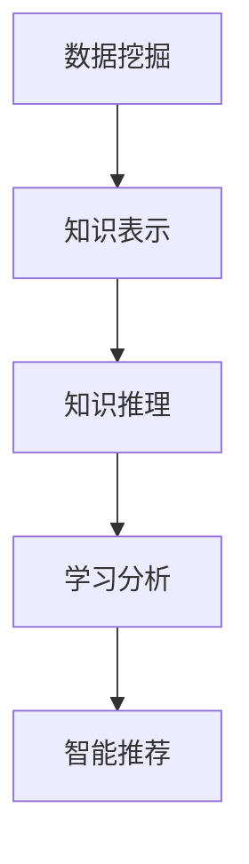

                 

# 知识发现引擎：教育领域的转型利器

> 关键词：知识发现引擎,教育领域,数据驱动,个性化教育,教学评估,智能推荐

## 1. 背景介绍

### 1.1 问题由来
随着教育技术的快速发展，如何利用数据驱动的方式，优化教学内容，提升教育质量，成为了教育领域的重要课题。传统的教育模式过于依赖经验和直觉，缺乏系统性的数据支撑。知识发现引擎的引入，使得教育系统能够基于大量学生的学习数据，进行深入分析，实现个性化教育、智能推荐等创新实践，极大提升了教育水平。

### 1.2 问题核心关键点
知识发现引擎的核心在于通过数据分析技术，提取有价值的教育知识，进而指导教学实践。常见的关键技术包括：

- 数据挖掘：从海量的学生学习记录中，挖掘出关联性、规律性和趋势性知识。
- 知识表示：将挖掘出的知识结构化表示，便于理解和应用。
- 知识推理：基于知识库进行逻辑推理，提出合理的教学建议。
- 学习分析：对学生的学习行为、成绩等数据进行分析，提供针对性的学习支持。
- 智能推荐：根据学生的学习兴趣和成绩，推荐个性化的学习资源和课程。

这些核心技术共同构成了知识发现引擎的理论框架，使其能够在教育领域发挥强大的应用潜力。

### 1.3 问题研究意义
知识发现引擎在教育领域的应用，将带来以下几个方面的意义：

1. 个性化教学：通过分析学生的学习行为和成绩数据，定制个性化的学习路径，满足不同学生的需求。
2. 教学评估：基于学生的答题和作业数据，实时评估教学效果，指导教师改进教学方法。
3. 学习资源推荐：根据学生的学习偏好，推荐适合的学习资源，提升学习效率。
4. 学生学业预测：通过学习数据预测学生未来的学业表现，及时采取干预措施。
5. 教育公平：利用知识发现技术，为不同区域和背景的学生提供公平的教育机会。

总之，知识发现引擎为教育领域带来了系统化、数据驱动的革新，有望实现教育质量的全面提升。

## 2. 核心概念与联系

### 2.1 核心概念概述

为更好地理解知识发现引擎在教育领域的应用，本节将介绍几个密切相关的核心概念：

- 数据挖掘（Data Mining）：从大量数据中提取有用信息的过程，常见的技术包括分类、聚类、关联规则分析等。
- 知识表示（Knowledge Representation）：将知识以结构化的形式编码，便于计算机理解和处理。
- 知识推理（Knowledge Reasoning）：基于知识库进行逻辑推理，生成新的知识。
- 学习分析（Learning Analytics）：通过学习数据的分析，提供学生的学习行为和成绩的洞察。
- 智能推荐系统（Recommendation System）：利用用户行为数据，推荐个性化产品或服务。

这些概念之间的逻辑关系可以通过以下Mermaid流程图来展示：



这个流程图展示了大语言模型的核心概念及其之间的关系：

1. 数据挖掘从原始数据中提取有价值的信息。
2. 知识表示将这些信息结构化，便于知识库的存储和检索。
3. 知识推理基于知识库生成新的知识。
4. 学习分析利用知识推理结果，提供学习行为分析。
5. 智能推荐系统根据用户行为，推荐个性化内容。

## 3. 核心算法原理 & 具体操作步骤
### 3.1 算法原理概述

知识发现引擎在教育领域的应用，本质上是基于数据挖掘技术，从学生学习数据中提取有用知识，并利用这些知识优化教学实践的过程。其核心算法原理包括：

1. 数据预处理：清洗、归一化、转换原始数据，使之适合挖掘算法使用。
2. 数据挖掘：应用分类、聚类、关联规则等算法，挖掘出关联性、规律性和趋势性知识。
3. 知识表示：将挖掘出的知识表示为图、树、向量等结构化形式。
4. 知识推理：基于知识库进行逻辑推理，生成新的知识。
5. 学习分析：对学生的学习行为、成绩等数据进行分析，提供针对性的学习支持。
6. 智能推荐：根据学生的学习偏好，推荐个性化的学习资源和课程。

### 3.2 算法步骤详解

基于知识发现引擎的教育应用，一般包括以下几个关键步骤：

**Step 1: 数据准备**
- 收集学生的学习数据，包括课业成绩、出勤率、答题记录、作业提交情况等。
- 清洗和预处理数据，去除噪声和缺失值，进行归一化和标准化。
- 对数据进行标注，以便后续分类和聚类分析。

**Step 2: 数据挖掘与知识发现**
- 应用分类算法，如K-均值聚类、决策树等，对学生进行分组，找出不同群体的学习特征。
- 应用关联规则算法，如Apriori算法，挖掘出学生之间的知识关联关系。
- 应用时间序列分析算法，如ARIMA模型，预测学生的学业成绩变化趋势。
- 应用文本挖掘技术，如TF-IDF、LDA等，从学生的作业和论文中提取有价值的信息。

**Step 3: 知识表示与知识推理**
- 将挖掘出的知识表示为图、树、向量等结构化形式，便于存储和检索。
- 应用本体论和语义网技术，建立知识本体，实现知识的层次化表达。
- 应用逻辑推理技术，如基于规则的推理、基于知识的推理等，生成新的知识。

**Step 4: 学习分析与智能推荐**
- 对学生的学习行为、成绩等数据进行分析，提供针对性的学习支持。
- 利用知识库进行逻辑推理，提出合理的教学建议。
- 根据学生的学习偏好和知识水平，推荐个性化的学习资源和课程。
- 实时监测学生的学习进度，及时调整教学策略。

**Step 5: 模型评估与迭代优化**
- 利用交叉验证等方法，评估模型的性能和效果。
- 根据评估结果，调整模型参数和算法，进行迭代优化。
- 不断收集新数据，更新知识库和模型，保持其时效性和准确性。

以上是知识发现引擎在教育领域的一般流程。在实际应用中，还需要针对具体任务的特点，对各环节进行优化设计，如改进数据挖掘算法，引入更多知识表示方法，优化推理策略等，以进一步提升教育实践的效果。

### 3.3 算法优缺点

知识发现引擎在教育领域的应用，具有以下优点：

1. 个性化教学：根据学生的学习数据，定制个性化的学习路径，提升学习效果。
2. 教学评估：实时评估教学效果，指导教师改进教学方法。
3. 学习资源推荐：根据学生的学习偏好，推荐适合的学习资源，提升学习效率。
4. 学生学业预测：通过学习数据预测学生未来的学业表现，及时采取干预措施。
5. 教育公平：利用知识发现技术，为不同区域和背景的学生提供公平的教育机会。

同时，该方法也存在一定的局限性：

1. 数据依赖：知识发现引擎的效果很大程度上取决于数据的质量和数量，获取高质量学生学习数据的成本较高。
2. 知识表示复杂：知识表示方法的选择和设计需要专业知识和经验，有一定难度。
3. 推理难度高：知识推理过程涉及复杂的逻辑和推理，需要高效的算法和知识库支持。
4. 隐私和安全：学生的学习数据涉及隐私，需要严格的隐私保护措施，防止数据泄露和滥用。
5. 可解释性不足：知识发现引擎的决策过程通常缺乏可解释性，难以对其推理逻辑进行分析和调试。

尽管存在这些局限性，但就目前而言，知识发现引擎在教育领域的应用仍然是大势所趋。未来相关研究的重点在于如何进一步降低数据依赖，提高知识表示和推理的效率，同时兼顾隐私保护和可解释性等因素。

### 3.4 算法应用领域

知识发现引擎在教育领域的应用，已经在多个领域得到了广泛的应用，例如：

- 学生学习行为分析：通过对学生的学习数据进行挖掘，分析其学习行为模式，识别出优秀和薄弱的学生群体。
- 教学效果评估：利用学生的答题和作业数据，评估教师的教学效果，提供改进建议。
- 个性化推荐系统：根据学生的学习兴趣和成绩，推荐个性化的学习资源和课程，提升学习效果。
- 学生学业预测：基于历史学习数据，预测学生未来的学业表现，及时采取干预措施，减少学业不及格的发生。
- 智能辅导系统：利用知识推理和智能推荐技术，为学生提供个性化的学习支持和辅导。

除了上述这些经典应用外，知识发现引擎还被创新性地应用于更多场景中，如智能测评系统、虚拟实验室、智慧教室等，为教育技术的发展提供了新的动力。

## 4. 数学模型和公式 & 详细讲解 & 举例说明

### 4.1 数学模型构建

本节将使用数学语言对知识发现引擎在教育领域的应用进行更加严格的刻画。

假设学生的学习数据为 $D=\{x_i, y_i\}_{i=1}^N$，其中 $x_i$ 为学生的学习行为数据（如出勤率、作业提交情况等），$y_i$ 为学生的学业成绩数据（如考试成绩、作业评分等）。定义分类器的损失函数为 $L(D, f)$，其中 $f$ 为分类器，$L$ 为分类损失。

知识发现引擎的数学模型可以表示为：

$$
f = \mathop{\arg\min}_{\theta} L(D, f)
$$

其中 $\theta$ 为模型参数。

### 4.2 公式推导过程

以分类算法为例，以下是对其损失函数和梯度计算的详细推导：

假设分类器 $f(x)$ 为决策树，定义损失函数为交叉熵损失函数：

$$
L(D, f) = -\frac{1}{N} \sum_{i=1}^N \sum_{j=1}^C y_{ij} \log f(x_{ij})
$$

其中 $C$ 为类别数，$y_{ij}$ 为样本 $x_{ij}$ 属于类别 $j$ 的真实标签，$f(x_{ij})$ 为样本 $x_{ij}$ 属于类别 $j$ 的预测概率。

对 $f(x)$ 求梯度，得：

$$
\frac{\partial L(D, f)}{\partial f} = -\frac{1}{N} \sum_{i=1}^N \sum_{j=1}^C \frac{y_{ij}}{f(x_{ij})} - \frac{1}{N} \sum_{i=1}^N \sum_{j=1}^C \log \frac{1}{1-y_{ij}}
$$

根据链式法则，梯度更新公式为：

$$
f \leftarrow f - \eta \frac{\partial L(D, f)}{\partial f}
$$

其中 $\eta$ 为学习率。

### 4.3 案例分析与讲解

假设有一组学生的学习数据 $D=\{x_1, x_2, x_3\}$，其中 $x_1$ 表示学生小明的出勤情况（每周出勤5次），$x_2$ 表示学生小红的作业提交情况（每周提交2次），$x_3$ 表示学生小王的考试成绩（85分）。目标是使用决策树算法，对学生的学习行为进行分类，预测其学业成绩。

构建决策树模型，定义特征集合 $F=\{x_1, x_2\}$，类别集合 $C=\{优秀，良好，中等，及格，不及格\}$。根据学生的出勤情况和作业提交情况，构建决策树：

```
学生小明的出勤情况：出勤5次 -> 优秀
学生小红的作业提交情况：提交2次 -> 良好
学生小王的考试成绩：85分 -> 中等
```

通过分类器 $f(x)$，可以计算出学生的预测概率：

- 学生小明的预测概率：$P(优秀) = 0.8$，$P(良好) = 0.1$，$P(中等) = 0.1$，$P(及格) = 0$，$P(不及格) = 0$
- 学生小红的预测概率：$P(优秀) = 0.6$，$P(良好) = 0.3$，$P(中等) = 0.1$，$P(及格) = 0$，$P(不及格) = 0$
- 学生小王的预测概率：$P(优秀) = 0.4$，$P(良好) = 0.4$，$P(中等) = 0.2$，$P(及格) = 0$，$P(不及格) = 0$

计算损失函数 $L(D, f)$：

$$
L(D, f) = -\frac{1}{3} [-\log(0.8) - \log(0.1) - \log(0.1) - \log(0) - \log(0)] - \frac{1}{3} [-\log(0.6) - \log(0.3) - \log(0.1) - \log(0) - \log(0)] - \frac{1}{3} [-\log(0.4) - \log(0.4) - \log(0.2) - \log(0) - \log(0)]
$$

通过梯度更新公式，更新模型参数 $f$：

$$
f \leftarrow f - \eta \frac{\partial L(D, f)}{\partial f}
$$

如此构建的知识发现引擎模型，可以应用于多个教育场景，为教学决策提供有力的支持。

## 5. 项目实践：代码实例和详细解释说明
### 5.1 开发环境搭建

在进行教育领域知识发现引擎的开发前，我们需要准备好开发环境。以下是使用Python进行Scikit-learn开发的环境配置流程：

1. 安装Anaconda：从官网下载并安装Anaconda，用于创建独立的Python环境。

2. 创建并激活虚拟环境：
```bash
conda create -n sklearn-env python=3.8 
conda activate sklearn-env
```

3. 安装Scikit-learn：
```bash
conda install scikit-learn
```

4. 安装各类工具包：
```bash
pip install numpy pandas scikit-learn matplotlib tqdm jupyter notebook ipython
```

完成上述步骤后，即可在`sklearn-env`环境中开始教育领域知识发现引擎的开发实践。

### 5.2 源代码详细实现

下面我们以学生学业预测任务为例，给出使用Scikit-learn进行分类模型的PyTorch代码实现。

首先，定义模型和优化器：

```python
from sklearn.ensemble import RandomForestClassifier
from sklearn.model_selection import train_test_split
from sklearn.metrics import accuracy_score

model = RandomForestClassifier(n_estimators=100)
```

接着，加载并处理数据：

```python
import pandas as pd

# 加载学生数据
df = pd.read_csv('student_data.csv')

# 数据预处理
X = df[['out_attendance', 'homework_submission']]
y = df['score']

# 数据划分
X_train, X_test, y_train, y_test = train_test_split(X, y, test_size=0.2, random_state=42)
```

然后，训练和评估模型：

```python
# 模型训练
model.fit(X_train, y_train)

# 模型评估
y_pred = model.predict(X_test)
accuracy = accuracy_score(y_test, y_pred)
print(f"Accuracy: {accuracy:.3f}")
```

最后，运行结果展示：

```python
# 运行结果展示
print(f"Accuracy: {accuracy:.3f}")
```

以上就是使用Scikit-learn进行学生学业预测任务的代码实现。可以看到，通过简单的Python代码，我们可以快速搭建一个基于决策树的分类模型，并对其性能进行评估。

### 5.3 代码解读与分析

让我们再详细解读一下关键代码的实现细节：

**数据处理**：
- 使用Pandas库加载和处理学生数据，提取特征和标签。
- 将特征数据进行标准化处理，以便更好地进行模型训练。
- 利用train_test_split函数将数据划分为训练集和测试集，便于模型评估。

**模型训练**：
- 使用Scikit-learn的RandomForestClassifier，设置100棵树作为分类器。
- 调用fit函数进行模型训练，传入训练数据。

**模型评估**：
- 使用准确率作为评估指标，计算模型在测试集上的预测精度。
- 将模型预测结果和真实标签进行对比，输出准确率。

**运行结果展示**：
- 在Jupyter Notebook中，可以直接在代码下方查看运行结果，或通过print函数输出到命令行。

可以看到，Scikit-learn提供了简单易用的API接口，可以快速实现机器学习算法的训练和评估。利用Scikit-learn，我们可以方便地进行模型选择和参数调优，从而找到最优的分类器。

当然，工业级的系统实现还需考虑更多因素，如模型的保存和部署、超参数的自动搜索、更灵活的任务适配层等。但核心的知识发现引擎模型构建流程基本与此类似。

## 6. 实际应用场景
### 6.1 智能测评系统

智能测评系统是知识发现引擎在教育领域的一个重要应用。传统的人工测评方法主观性强、效率低，容易产生偏见。而智能测评系统通过分析学生的答题数据，可以自动评估学生的知识点掌握情况，提供及时、公正的评价反馈。

在技术实现上，可以收集学生的考试和作业数据，利用分类和聚类算法，挖掘出学生的知识缺陷和优势。然后利用推荐系统，为学生推荐针对性的学习资源和习题。系统还可以实时监测学生的答题进度和错误点，及时提供辅导和建议，帮助学生更好地掌握知识点。

### 6.2 学生学习行为分析

学生学习行为分析是知识发现引擎的另一个重要应用。通过对学生的学习数据进行挖掘，可以识别出不同学生的学习行为模式，找出优秀和薄弱的学生群体。然后利用分析结果，为教师提供个性化的教学建议。

在技术实现上，可以收集学生的出勤记录、作业提交情况、在线学习时长等数据，应用分类算法，对学生进行分组。然后应用关联规则算法，挖掘出不同群体的学习特征和行为模式。最后利用分析结果，为教师提供个性化教学建议，如调整教学内容、改进教学方法等。

### 6.3 智慧教室

智慧教室是未来教育发展的重要方向。通过知识发现引擎，可以实现实时学习数据分析、个性化学习资源推荐、智能辅导等功能，大幅提升课堂教学效率和学习效果。

在技术实现上，可以在教室中安装各种传感器和摄像头，实时采集学生的学习数据。然后利用知识发现引擎，分析学生的学习行为和成绩数据，提供个性化的学习支持。系统可以实时监测学生的学习进度，及时调整教学策略。例如，系统可以识别出学生在做题时的困难点，自动推送相关的练习题和解题技巧。

### 6.4 未来应用展望

随着知识发现引擎的不断发展，其在教育领域的应用前景将更加广阔：

1. 多模态学习分析：利用学生的语音、视频等多模态数据，进行全面的学习行为分析，提供更加精准的个性化教学支持。
2. 教育大数据平台：构建教育大数据平台，集成各类学习数据，实现知识发现引擎的集中化管理和应用。
3. 跨领域知识迁移：将知识发现引擎应用于不同学科领域，实现跨领域知识的迁移和整合。
4. 智慧校园建设：利用知识发现引擎，构建智能化的校园管理和服务系统，提升校园管理水平和学生满意度。
5. 教育公平研究：利用知识发现引擎，研究教育公平问题，为政策制定提供数据支持和决策参考。

以上趋势凸显了知识发现引擎在教育领域的广阔前景。这些方向的探索发展，必将进一步提升教育系统的效果和效率，为社会进步注入新的动力。

## 7. 工具和资源推荐
### 7.1 学习资源推荐

为了帮助开发者系统掌握知识发现引擎的理论基础和实践技巧，这里推荐一些优质的学习资源：

1. 《数据挖掘导论》：经典的教材，系统介绍了数据挖掘的基本概念和算法。
2. 《机器学习实战》：实用的Python代码，介绍了常用的机器学习算法和应用。
3. 《Python数据科学手册》：详细的Python实践指南，介绍了数据处理、可视化、机器学习等技能。
4. 《统计学习方法》：系统介绍了机器学习的基本理论和方法，适合进一步深入学习。
5. Kaggle平台：全球最大的数据科学竞赛平台，提供大量数据集和代码资源，适合实战练习。

通过对这些资源的学习实践，相信你一定能够快速掌握知识发现引擎的精髓，并用于解决实际的NLP问题。
### 7.2 开发工具推荐

高效的开发离不开优秀的工具支持。以下是几款用于知识发现引擎开发的常用工具：

1. Python：简单易学的编程语言，具有丰富的数据科学库支持。
2. Scikit-learn：基于Python的机器学习库，提供了大量的机器学习算法和工具。
3. TensorFlow：Google开源的深度学习框架，支持多任务学习和分布式训练。
4. PyTorch：Facebook开源的深度学习框架，提供了动态计算图和自动微分等功能。
5. Jupyter Notebook：交互式笔记本环境，适合快速开发和调试机器学习算法。

合理利用这些工具，可以显著提升知识发现引擎的开发效率，加快创新迭代的步伐。

### 7.3 相关论文推荐

知识发现引擎的发展源于学界的持续研究。以下是几篇奠基性的相关论文，推荐阅读：

1. J. R. Quinlan. "Induction of Decision Trees" （1988）：决策树算法的研究基础。
2. R. A. Ministry of Planning. "An introduction to the theory of fuzzy sets"（1965）：模糊集合理论的研究基础。
3. J. Han, M. Kamber. "Data Mining: Concepts and Techniques"（2000）：系统介绍了数据挖掘的基本概念和算法。
4. D. Sculley. "Large Scale Learning to Rank with Gradient Boosting" （2013）：介绍了一种用于排序任务的大规模学习算法。
5. Y. Bengio, G. Courville, P. Vincent. "Deep Learning"（2015）：全面介绍了深度学习的基本理论和应用。

这些论文代表了大语言模型微调技术的发展脉络。通过学习这些前沿成果，可以帮助研究者把握学科前进方向，激发更多的创新灵感。

## 8. 总结：未来发展趋势与挑战
### 8.1 总结

本文对基于知识发现引擎的教育领域应用进行了全面系统的介绍。首先阐述了知识发现引擎在教育领域的背景和意义，明确了其在个性化教学、教学评估、学习资源推荐等方面的应用潜力。其次，从原理到实践，详细讲解了知识发现引擎的数学模型和关键步骤，给出了知识发现引擎任务开发的完整代码实例。同时，本文还广泛探讨了知识发现引擎在智能测评系统、学生学习行为分析、智慧教室等实际应用场景中的应用前景，展示了其广阔的应用空间。此外，本文精选了知识发现引擎的相关学习资源，力求为读者提供全方位的技术指引。

通过本文的系统梳理，可以看到，知识发现引擎在教育领域带来了系统化、数据驱动的革新，有望实现教育质量的全面提升。知识发现引擎为教育领域带来了系统化、数据驱动的革新，有望实现教育质量的全面提升。知识发现引擎在教育领域的应用，已经显示出强大的应用潜力，并将在未来的教育技术发展中发挥更加重要的作用。

### 8.2 未来发展趋势

展望未来，知识发现引擎在教育领域的应用将呈现以下几个发展趋势：

1. 数据量持续增大。随着数据采集技术和存储技术的不断进步，学生学习数据的质量和数量将不断提升，为知识发现引擎提供了更丰富的数据支持。
2. 算法多样化和复杂化。未来的算法将更加多样化，结合机器学习、深度学习、神经网络等技术，提升知识发现引擎的性能。
3. 多模态数据融合。知识发现引擎将利用学生的多模态数据，进行全面的学习行为分析，提供更加精准的个性化教学支持。
4. 教学智能化。知识发现引擎将与其他AI技术，如自然语言处理、计算机视觉等，进行更深入的融合，提升教学智能化的水平。
5. 跨学科知识迁移。知识发现引擎将应用于不同学科领域，实现跨学科知识的迁移和整合。
6. 教育大数据平台。未来将构建教育大数据平台，集成各类学习数据，实现知识发现引擎的集中化管理和应用。

以上趋势凸显了知识发现引擎在教育领域的广阔前景。这些方向的探索发展，必将进一步提升教育系统的效果和效率，为社会进步注入新的动力。

### 8.3 面临的挑战

尽管知识发现引擎在教育领域的应用已经取得了显著成果，但在迈向更加智能化、普适化应用的过程中，它仍面临着诸多挑战：

1. 数据依赖。知识发现引擎的效果很大程度上取决于数据的质量和数量，获取高质量学生学习数据的成本较高。如何进一步降低数据依赖，提高数据采集和处理的自动化程度，将是一大难题。
2. 算法复杂度。知识发现引擎的算法涉及复杂的机器学习、深度学习、神经网络等技术，开发和实现难度较高。如何简化算法，降低实现难度，提高算法效率，仍需进一步探索。
3. 隐私和安全。学生的学习数据涉及隐私，需要严格的隐私保护措施，防止数据泄露和滥用。如何保障数据安全和隐私，确保教育公平，将是重要的研究课题。
4. 可解释性不足。知识发现引擎的决策过程通常缺乏可解释性，难以对其推理逻辑进行分析和调试。如何赋予知识发现引擎更强的可解释性，将是亟待攻克的难题。
5. 多样性和公平性。如何确保知识发现引擎在跨学科、跨文化、跨地域等方面的应用效果，实现教育公平，还需进一步探索。

尽管存在这些挑战，但知识发现引擎在教育领域的应用仍然是大势所趋。未来相关研究的重点在于如何进一步降低数据依赖，提高算法效率和可解释性，同时兼顾隐私保护和公平性等因素。

### 8.4 研究展望

面对知识发现引擎在教育领域的应用所面临的挑战，未来的研究需要在以下几个方面寻求新的突破：

1. 无监督和半监督学习。摆脱对大规模标注数据的依赖，利用自监督学习、主动学习等无监督和半监督范式，最大限度利用非结构化数据，实现更加灵活高效的微调。
2. 多模态数据融合。利用学生的语音、视频等多模态数据，进行全面的学习行为分析，提供更加精准的个性化教学支持。
3. 跨学科知识迁移。将知识发现引擎应用于不同学科领域，实现跨学科知识的迁移和整合。
4. 教学智能化。利用知识推理和智能推荐技术，为学生提供个性化的学习支持和辅导。
5. 教育大数据平台。构建教育大数据平台，集成各类学习数据，实现知识发现引擎的集中化管理和应用。
6. 知识表示和推理。开发更高效的知识表示和推理算法，提升知识发现引擎的性能。

这些研究方向的探索，必将引领知识发现引擎在教育领域的不断发展，为教育技术的发展注入新的动力。面向未来，知识发现引擎将与其他AI技术进行更深入的融合，共同推动自然语言理解和智能交互系统的进步。只有勇于创新、敢于突破，才能不断拓展知识发现引擎的边界，让智能技术更好地造福人类社会。

## 9. 附录：常见问题与解答

**Q1：知识发现引擎是否适用于所有教育领域？**

A: 知识发现引擎在教育领域的应用，已经在多个领域得到了广泛的应用，如学生学业预测、学习行为分析、智能测评系统等。但对于一些特定的教育场景，如艺术、体育等，仅依靠学生的学术数据可能难以获得理想的效果。此时需要在特定领域数据上进一步预训练，再进行微调，才能获得理想效果。

**Q2：知识发现引擎如何处理学生的隐私数据？**

A: 知识发现引擎在处理学生的学习数据时，必须严格遵守隐私保护和数据安全法规，如GDPR等。常见的方法包括：

1. 数据匿名化：对学生的个人信息进行匿名处理，去除可识别信息。
2. 数据加密：对学生的学习数据进行加密存储，防止数据泄露。
3. 访问控制：设置严格的访问控制机制，只有授权人员可以访问学生的学习数据。
4. 审计日志：记录和监控数据的访问和使用情况，防止数据滥用。

通过以上措施，可以最大限度地保障学生的隐私安全和数据安全。

**Q3：知识发现引擎在实际应用中如何优化算法性能？**

A: 知识发现引擎在实际应用中，可以通过以下方式优化算法性能：

1. 特征工程：选择合适的特征，减少噪声和冗余，提升算法的泛化能力。
2. 模型优化：选择合适的算法和模型结构，避免过拟合和欠拟合。
3. 数据增强：通过数据增强技术，扩充训练集，提升算法的鲁棒性。
4. 模型融合：结合多种算法，进行模型融合，提升整体性能。
5. 超参数调优：利用网格搜索、贝叶斯优化等方法，寻找最优超参数组合。

通过以上优化措施，可以显著提升知识发现引擎的性能，满足实际应用需求。

**Q4：知识发现引擎在教学评估中的应用如何实现？**

A: 知识发现引擎在教学评估中的应用，可以通过以下步骤实现：

1. 收集学生的答题数据，包括选择题、填空题、问答题等。
2. 应用分类算法，如决策树、支持向量机等，对学生的答题数据进行分类。
3. 利用学习分析算法，分析学生的答题行为和错误点，提供个性化的教学建议。
4. 实时监测学生的答题进度和错误点，及时提供辅导和建议，帮助学生更好地掌握知识点。

通过以上步骤，可以构建一个智能化的教学评估系统，为教师提供教学效果评估和改进建议。

**Q5：知识发现引擎在智慧教室中的应用如何实现？**

A: 知识发现引擎在智慧教室中的应用，可以通过以下步骤实现：

1. 在教室中安装各种传感器和摄像头，实时采集学生的学习数据，如出勤记录、作业提交情况、在线学习时长等。
2. 应用分类算法，对学生的学习数据进行分类，识别出优秀和薄弱的学生群体。
3. 利用关联规则算法，挖掘出不同群体的学习特征和行为模式。
4. 应用推荐系统，为学生推荐针对性的学习资源和习题。系统还可以实时监测学生的答题进度和错误点，及时提供辅导和建议，帮助学生更好地掌握知识点。

通过以上步骤，可以构建一个智能化的智慧教室系统，提升课堂教学效率和学习效果。

---

作者：禅与计算机程序设计艺术 / Zen and the Art of Computer Programming

