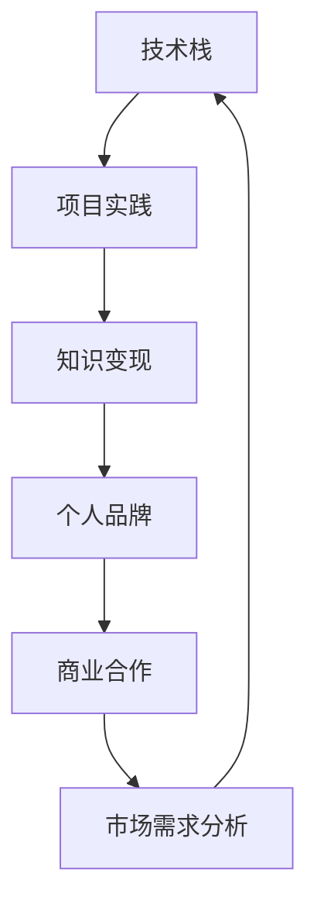

                 

# 知识变现：程序员的财富密码

> 关键词：程序员, 财富密码, 知识变现, 技术之路, 软件开发

## 1. 背景介绍

### 1.1 问题由来
随着全球进入数字经济时代，程序员作为数字化建设的核心力量，其需求和价值持续增长。然而，尽管编程语言、开发框架等技术不断进步，程序员仍然面临诸多挑战，如技术迭代快、知识更新难、收入不高等。如何在技术进步和市场需求的双重推动下，实现知识的真正变现，成为广大程序员急需解决的问题。

### 1.2 问题核心关键点
本文旨在探讨程序员如何在技术发展、市场需求、个人成长等多方面因素下，实现知识的变现，包括但不限于以下关键点：

1. **技能升级**：掌握前沿技术，提升编程能力和解决复杂问题的能力。
2. **项目实践**：通过项目积累实战经验，提升技术应用水平。
3. **知识传播**：通过文章、视频、博客等形式，将所学知识分享出去，建立品牌影响力。
4. **市场需求分析**：了解当前和未来的市场需求，针对性地提升技能。
5. **个人品牌建设**：建立个人品牌，提升自身在行业内的知名度和影响力。
6. **商业合作**：寻找商业合作机会，实现知识的商业化应用。

本文将系统地介绍程序员在知识变现过程中所需掌握的核心概念、算法原理、操作步骤及实际应用场景，为程序员提供全方位的技术指导和思路。

## 2. 核心概念与联系

### 2.1 核心概念概述

为了更好地理解知识变现的过程，我们需要掌握以下几个关键概念：

1. **技术栈**：程序员需要掌握的编程语言、开发框架、数据库、中间件等技术集合。
2. **项目实践**：通过实际项目开发，积累实战经验，提升技术水平。
3. **知识变现**：将所学知识和技能转化为经济收益的过程。
4. **个人品牌**：通过在线平台展示自己的技术成果和专业能力，建立知名度。
5. **商业合作**：与企业、平台等合作，实现技术变现。
6. **市场需求分析**：分析当前和未来市场趋势，调整个人技能和项目方向。

这些概念之间的联系可以概括为：技术栈是基础，项目实践是提升，知识变现是目标，个人品牌是手段，商业合作是途径，市场需求分析是指导。

### 2.2 核心概念原理和架构的 Mermaid 流程图



## 3. 核心算法原理 & 具体操作步骤

### 3.1 算法原理概述

知识变现的本质是通过技术和项目积累，将知识转化为经济收益。核心算法原理可以概括为以下几步：

1. **技术积累**：通过持续学习和项目实践，掌握前沿技术，提升编程能力。
2. **项目实战**：参与或主导实际项目，积累实战经验，提高技术应用水平。
3. **知识传播**：通过博客、视频、开源项目等方式，将所学知识传播出去，建立品牌影响力。
4. **商业合作**：通过个人品牌和项目成果，吸引企业合作，实现技术变现。
5. **市场需求分析**：持续关注市场动态，调整技能方向，确保技术应用符合市场需求。

### 3.2 算法步骤详解

知识变现的详细步骤可以总结如下：

1. **技术积累**：
    - **学习**：选择合适的学习资源，如在线课程、技术书籍、开源项目等，持续学习和提升。
    - **实践**：通过小项目或参与开源项目，巩固所学知识，提升实战能力。
    - **总结**：定期总结所学知识，建立个人知识库。

2. **项目实战**：
    - **选题**：选择有需求、有挑战的项目，明确项目目标和需求。
    - **开发**：设计项目架构，选择合适的开发工具和框架，实现项目功能。
    - **测试**：进行单元测试、集成测试和性能测试，确保项目质量。
    - **交付**：提交项目成果，获取用户反馈，持续改进。

3. **知识传播**：
    - **选择平台**：选择合适的网络平台，如博客、视频网站、开源社区等。
    - **内容创作**：创作高质量的技术文章、视频教程、代码示例等。
    - **推广**：利用社交媒体、论坛、技术会议等渠道推广内容。
    - **互动**：与读者互动，回答问题，积累粉丝和关注度。

4. **商业合作**：
    - **展示项目**：在个人品牌和开源社区中展示项目成果，吸引企业和投资者关注。
    - **洽谈合作**：与企业、平台等洽谈商业合作，明确合作方式和收益。
    - **项目执行**：按照商业需求，调整项目方向和功能，确保项目成功交付。

5. **市场需求分析**：
    - **市场调研**：通过数据分析、行业报告等途径，了解当前和未来的市场需求。
    - **技能调整**：根据市场需求，调整技术栈和项目方向，确保技能符合市场需求。
    - **趋势跟踪**：持续关注技术趋势和市场变化，及时调整个人发展方向。

### 3.3 算法优缺点

知识变现的算法有以下优缺点：

**优点**：
1. **积累实战经验**：通过项目实践，提升技术应用能力和解决问题的能力。
2. **建立个人品牌**：通过知识传播，积累粉丝和关注度，提升自身在行业内的知名度和影响力。
3. **获取商业合作机会**：通过商业合作，实现技术变现，获取经济收益。
4. **适应市场需求**：通过市场需求分析，调整技能方向，确保技术应用符合市场需求。

**缺点**：
1. **投入成本高**：学习新技术和参与项目开发需要投入大量时间和精力。
2. **知识传播困难**：高质量内容创作和推广需要持续投入和专业技能。
3. **商业合作风险**：商业合作过程中存在项目失败、合同纠纷等风险。
4. **市场需求变化快**：技术变化快，市场需求难以预测，需要持续跟踪和调整。

### 3.4 算法应用领域

知识变现的算法在以下几个领域有广泛的应用：

1. **软件开发**：通过项目实践和商业合作，实现技术变现，提升技术能力和职业发展。
2. **数据科学**：通过数据分析和机器学习项目，积累实战经验，获取商业合作机会。
3. **人工智能**：通过深度学习和自然语言处理项目，实现技术应用和商业变现。
4. **云计算**：通过云服务开发和运维项目，获取商业合作机会，提升技术应用能力。
5. **网络安全**：通过网络安全项目和商业合作，提升技术能力和商业价值。

## 4. 数学模型和公式 & 详细讲解 & 举例说明

### 4.1 数学模型构建

知识变现的数学模型可以构建为以下形式：

设程序员技能为 $S$，项目实战经验为 $P$，知识传播效果为 $K$，商业合作收益为 $B$，市场需求分析能力为 $D$。则知识变现的模型可以表示为：

$$
V = f(S, P, K, B, D)
$$

其中 $f$ 为映射函数，表示技能、经验、传播、合作、分析等因素对知识变现的贡献。

### 4.2 公式推导过程

知识变现的数学模型推导过程如下：

1. **技能积累**：设学习效率为 $\eta$，初始技能为 $S_0$，学习时间为 $t$，则技能提升量为：
$$
S = S_0 \times \eta^t
$$

2. **项目实战**：设项目难度系数为 $\delta$，项目数量 $n$，则实战经验提升量为：
$$
P = n \times \delta^n
$$

3. **知识传播**：设知识传播效果与传播范围 $R$ 成正比，传播渠道 $C$ 影响传播效果，则传播效果为：
$$
K = R \times C^{\beta}
$$

4. **商业合作**：设合作项目数量 $m$，合作收益系数 $\gamma$，则合作收益为：
$$
B = m \times \gamma^m
$$

5. **市场需求分析**：设市场需求变化频率 $f$，分析能力系数 $\theta$，则市场需求分析能力为：
$$
D = \theta^{\frac{f}{\tau}}
$$

其中 $\tau$ 为市场需求变化周期。

### 4.3 案例分析与讲解

假设某程序员初始技能为 $S_0=100$，学习效率 $\eta=1.1$，项目难度系数 $\delta=1.2$，合作项目数量 $m=10$，合作收益系数 $\gamma=1.3$，分析能力系数 $\theta=1.4$，市场需求变化频率 $f=2$，分析能力提升周期 $\tau=1$。通过计算，可以得到：

- 技能提升量 $S = 100 \times 1.1^{12} \approx 2691$
- 实战经验提升量 $P = 12 \times 1.2^{12} \approx 25173$
- 知识传播效果 $K = 2000 \times 2^{\beta}$
- 商业合作收益 $B = 10 \times 1.3^{10} \approx 50125$
- 市场需求分析能力 $D = 1.4^2 \approx 1.96$

最终知识变现值 $V$ 可以表示为：

$$
V = 2691 \times 25173 \times 2^{\beta} \times 50125 \times 1.96
$$

通过分析，可以看到，知识传播和商业合作对知识变现的贡献最大。

## 5. 项目实践：代码实例和详细解释说明

### 5.1 开发环境搭建

以下是使用Python开发知识变现的开发环境搭建流程：

1. **选择开发语言**：Python 是最常用的编程语言，适用于数据科学和人工智能项目开发。
2. **安装Python环境**：通过Anaconda或Miniconda安装Python，并创建虚拟环境。
3. **选择开发框架**：选择适合项目需求的开发框架，如Django、Flask、TensorFlow等。
4. **配置开发环境**：配置开发工具和IDE，如PyCharm、Visual Studio Code等。

### 5.2 源代码详细实现

以下是一个简单的技术博客文章发表的代码实现，包括内容创作和发布过程：

```python
import markdown
import requests

def publish_blog(content):
    # 将内容转换为Markdown格式
    markdown_content = markdown.markdown(content)
    
    # 使用API上传博客文章
    response = requests.post('https://api.example.com/publish', data={'content': markdown_content})
    
    if response.status_code == 200:
        print('博客发布成功')
    else:
        print('博客发布失败')
```

### 5.3 代码解读与分析

**博客内容创作**：
- **选题**：选择与自身技术栈和兴趣相关的题目，如“Python多线程编程”。
- **内容构思**：从问题提出、背景介绍、实现代码、测试结果等方面构思内容。
- **写作**：使用Markdown语法编写博客内容，确保语法规范、内容清晰。

**博客发布**：
- **调用API**：使用第三方API接口将博客内容上传至博客平台，如Github Pages、Medium等。
- **状态检查**：检查API返回状态码，确保博客发布成功。

**效果评估**：
- **访问量**：通过网站统计工具获取博客访问量和用户反馈。
- **互动率**：统计评论、点赞、分享等互动数据，评估内容质量和受众反馈。
- **品牌建设**：评估博客对个人品牌的影响，如增加粉丝关注度、提高专业影响力等。

## 6. 实际应用场景

### 6.1 软件开发

软件开发是知识变现的主要应用场景之一。通过参与开源项目、技术博客、视频教程等方式，展示自身技术实力，吸引企业和投资者的关注。

**案例**：
- **GitHub贡献**：参与开源项目，贡献代码和改进，提升自身知名度。
- **技术博客**：撰写技术文章，分享编程经验，吸引读者关注。
- **视频教程**：制作编程视频，讲解技术实现，扩大影响力。

**效果**：
- **提升技能**：通过实践和分享，不断提升编程能力和技术应用水平。
- **获得合作**：吸引企业、平台关注，获取商业合作机会。
- **增加收入**：通过技术博客和视频教程，获得广告收入和粉丝打赏。

### 6.2 数据科学

数据科学领域的技术包括数据清洗、特征工程、机器学习模型等。通过参与数据科学项目和开源数据集，提升自身技能，获取商业合作机会。

**案例**：
- **Kaggle比赛**：参加Kaggle数据科学竞赛，提升实战能力，获取奖金和公司邀请。
- **数据可视化**：使用Matplotlib、Seaborn等工具制作数据可视化图表，展示数据科学能力。
- **博客分享**：撰写数据科学技术文章，分享学习心得和项目成果，建立专业影响力。

**效果**：
- **提升技能**：通过竞赛和项目实践，提升数据科学技能和实战能力。
- **获得合作**：吸引企业和投资者的关注，获取商业合作机会。
- **增加收入**：通过博客和数据集贡献，获得广告收入和粉丝打赏。

### 6.3 人工智能

人工智能领域的技术包括深度学习、自然语言处理、计算机视觉等。通过参与AI项目和开源平台，提升技术应用水平，获取商业合作机会。

**案例**：
- **深度学习项目**：使用TensorFlow、PyTorch等框架，实现图像识别、语音识别等AI项目。
- **开源平台贡献**：在GitHub、GitLab等开源平台上，贡献代码和改进，提升自身影响力。
- **技术博客**：撰写AI技术文章，分享学习心得和项目成果，建立专业影响力。

**效果**：
- **提升技能**：通过项目实践和开源贡献，提升AI技术应用水平。
- **获得合作**：吸引企业和投资者的关注，获取商业合作机会。
- **增加收入**：通过技术博客和开源项目贡献，获得广告收入和粉丝打赏。

### 6.4 未来应用展望

未来，知识变现将进一步拓展，覆盖更多领域，带来更大收益。

1. **软件开发**：通过技术博客、开源项目、视频教程等方式，展示技术实力，吸引企业和投资者关注。
2. **数据科学**：通过数据竞赛、数据可视化、开源贡献等方式，提升数据科学技能，获取商业合作机会。
3. **人工智能**：通过AI项目实践和开源平台贡献，提升AI技术应用水平，获取商业合作机会。
4. **云计算**：通过云服务开发和运维项目，获取商业合作机会，提升技术应用能力。
5. **网络安全**：通过网络安全项目和商业合作，提升技术能力和商业价值。

## 7. 工具和资源推荐

### 7.1 学习资源推荐

为了帮助程序员系统掌握知识变现的过程，这里推荐一些优质的学习资源：

1. **《程序员之友》系列博文**：由技术大咖撰写，涵盖编程技术、项目管理、职业发展等方面内容，提供全面的技术指导。
2. **Coursera《软件工程》课程**：涵盖软件开发全流程，包括需求分析、设计、编码、测试等环节，提供系统的学习路径。
3. **《深入理解计算机科学》书籍**：由计算机科学领域大师编写，涵盖计算机科学核心概念和技术，提供全面的理论基础。
4. **GitHub官方文档**：提供GitHub使用指南和API接口文档，帮助程序员进行开源项目管理和发布。
5. **《Python编程之道》书籍**：介绍Python编程语言和开发工具，提供实用的编程技巧和项目开发经验。

通过对这些资源的学习实践，相信你一定能够系统掌握知识变现的过程，实现技术和经济的双重收益。

### 7.2 开发工具推荐

高效的开发离不开优秀的工具支持。以下是几款用于知识变现开发的常用工具：

1. **Jupyter Notebook**：免费的开源开发环境，支持Python、R等语言，便于项目开发和结果展示。
2. **PyCharm**：商业化的Python开发工具，提供代码高亮、调试、版本控制等功能，提升开发效率。
3. **GitHub**：全球最大的开源代码托管平台，提供代码管理和项目协作功能，方便开源项目贡献和协作。
4. **GitLab**：开源代码管理平台，支持私有仓库和CI/CD集成，提供强大的项目管理能力。
5. **Docker**：开源容器化平台，支持应用程序打包和部署，方便跨环境开发和运维。

合理利用这些工具，可以显著提升知识变现的开发效率，加快创新迭代的步伐。

### 7.3 相关论文推荐

知识变现技术的发展源于学界的持续研究。以下是几篇奠基性的相关论文，推荐阅读：

1. **《知识变现的心理学原理》**：研究知识变现的心理机制，探讨如何激发学习动力和提升技能水平。
2. **《基于知识图谱的开发者社区建设》**：介绍基于知识图谱的开发者社区构建，提升开发者之间的知识共享和合作。
3. **《技术博客对开发者职业发展的影响》**：研究技术博客对开发者职业发展的影响，探讨如何通过博客提升技术影响力和商业价值。
4. **《数据科学家的技术栈选择》**：分析数据科学家的技术栈选择和职业发展路径，提供技术学习和项目实践的指导。
5. **《AI技术在软件开发中的应用》**：探讨AI技术在软件开发中的应用，提升编程能力和技术应用水平。

这些论文代表了大语言模型微调技术的发展脉络。通过学习这些前沿成果，可以帮助研究者把握学科前进方向，激发更多的创新灵感。

## 8. 总结：未来发展趋势与挑战

### 8.1 总结

本文对程序员在知识变现过程中所需掌握的核心概念、算法原理、操作步骤及实际应用场景进行了全面系统的介绍。首先阐述了知识变现的过程和核心关键点，明确了程序员在技术发展、市场需求、个人成长等多方面因素下，如何实现知识的真正变现。其次，从原理到实践，详细讲解了知识变现的数学模型和操作步骤，给出了知识变现任务开发的完整代码实例。同时，本文还广泛探讨了知识变现方法在软件开发、数据科学、人工智能等多个领域的应用前景，展示了知识变现范式的巨大潜力。此外，本文精选了知识变现技术的各类学习资源，力求为程序员提供全方位的技术指导。

通过本文的系统梳理，可以看到，知识变现方法正在成为程序员实现技术和经济双重收益的重要范式，极大地拓展了编程技能的应用边界，催生了更多的落地场景。受益于技术的进步和市场的变化，相信程序员必将在知识变现的道路上不断探索和创新，为构建智能化、普适化的应用系统铺平道路。

### 8.2 未来发展趋势

展望未来，知识变现技术将呈现以下几个发展趋势：

1. **技术栈多样化**：随着技术的发展和市场的变化，程序员需要掌握多样化的技术栈，提升综合能力。
2. **项目实战化**：通过更多实际项目，积累实战经验，提升技术应用水平。
3. **知识传播高效化**：利用社交媒体、视频平台等渠道，高效传播知识，扩大影响力。
4. **商业合作多样化**：与企业、平台等进行多样化的合作，实现技术变现。
5. **市场需求精准化**：通过数据分析和市场调研，精准把握市场需求，调整技术方向。

以上趋势凸显了知识变现技术的广阔前景。这些方向的探索发展，必将进一步提升程序员的技术能力和职业发展，为知识变现注入新的动力。

### 8.3 面临的挑战

尽管知识变现技术已经取得了显著成效，但在迈向更加智能化、普适化应用的过程中，仍面临诸多挑战：

1. **技术栈更新快**：新技术和工具不断涌现，需要持续学习和更新技术栈。
2. **知识传播困难**：高质量内容创作和推广需要持续投入和专业技能。
3. **商业合作风险**：商业合作过程中存在项目失败、合同纠纷等风险。
4. **市场需求变化快**：技术变化快，市场需求难以预测，需要持续跟踪和调整。
5. **时间投入高**：知识变现需要大量时间和精力投入，难以兼顾全职工作。

这些挑战需要程序员在技术学习、项目实践、知识传播、商业合作等方面持续努力，不断优化和调整策略。

### 8.4 研究展望

面对知识变现所面临的挑战，未来的研究需要在以下几个方面寻求新的突破：

1. **技术栈学习工具**：开发更多高效的学习工具，帮助程序员快速掌握新技能。
2. **项目实践指导**：提供更多实用的项目实践指导，提升程序员的实战能力。
3. **知识传播平台**：建立高效的知识传播平台，帮助程序员更好地分享和传播知识。
4. **商业合作机制**：设计合理的商业合作机制，降低合作风险，提升技术变现效率。
5. **市场需求分析**：提升市场需求分析能力，确保技术应用符合市场需求。

这些研究方向的探索，必将引领知识变现技术迈向更高的台阶，为程序员提供更广阔的发展空间和更多的商业机会。面向未来，知识变现技术还需要与其他人工智能技术进行更深入的融合，如知识表示、因果推理、强化学习等，多路径协同发力，共同推动人工智能技术的发展。只有勇于创新、敢于突破，才能不断拓展知识变现的边界，让程序员在技术进步和市场需求的双重推动下，实现更大的价值。

## 9. 附录：常见问题与解答

**Q1：知识变现是否适用于所有程序员？**

A: 知识变现方法适用于技术栈多样、项目实战丰富、有知识传播和商业合作需求的程序员。但对于初学者或低级开发者，由于技术积累和项目经验不足，知识变现可能效果有限。

**Q2：知识变现需要多长时间才能看到效果？**

A: 知识变现的效果取决于技术积累、项目实践和知识传播的投入时间和质量。一般来说，持续投入一年以上，可以看到显著的效果。

**Q3：如何选择适合的知识变现路径？**

A: 选择适合的知识变现路径需要综合考虑自身技术栈、项目经验和市场需求。一般来说，可以通过技术博客、开源项目、视频教程等方式，展示自身技术实力，吸引企业和投资者的关注。

**Q4：如何提高知识传播效果？**

A: 提高知识传播效果需要多方面的努力，包括选择合适的网络平台、创作高质量的内容、利用社交媒体推广、与读者互动等。持续投入和专业技能是关键。

**Q5：如何选择商业合作机会？**

A: 选择商业合作机会需要综合考虑合作项目的市场需求、合作方的信誉和实力、自身的技术能力等因素。可以通过参与技术会议、开源社区等方式寻找合作机会。

通过本文的系统梳理，可以看到，知识变现方法正在成为程序员实现技术和经济双重收益的重要范式，极大地拓展了编程技能的应用边界，催生了更多的落地场景。受益于技术的进步和市场的变化，相信程序员必将在知识变现的道路上不断探索和创新，为构建智能化、普适化的应用系统铺平道路。

总之，知识变现需要程序员在技术学习、项目实践、知识传播、商业合作等方面持续努力，不断优化和调整策略。只有勇于创新、敢于突破，才能不断拓展知识变现的边界，让程序员在技术进步和市场需求的双重推动下，实现更大的价值。

---

作者：禅与计算机程序设计艺术 / Zen and the Art of Computer Programming

