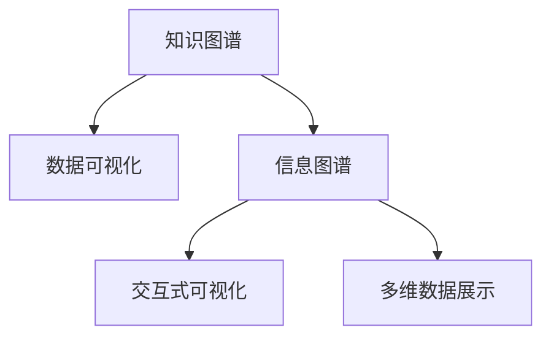

                 

# 知识可视化：直观理解复杂信息

> 关键词：知识图谱, 数据可视化, 信息图谱, 交互式可视化, 多维数据展示, 复杂信息归纳, 数据探索

## 1. 背景介绍

在信息爆炸的时代，数据和信息呈现出空前的丰富和复杂性，单纯依靠文本或数字无法全面理解其本质。知识可视化作为一种将复杂信息图形化展示的技术，帮助人们从不同维度、不同层次认识数据，提升决策效率和质量。本文将从背景、定义、原理、步骤等方面对知识可视化进行系统阐述，并探讨其在实际应用中的重要价值。

## 2. 核心概念与联系

### 2.1 核心概念概述

知识可视化（Knowledge Visualization）是指将复杂的信息和数据通过图形化展示，使之易于理解、分析、沟通和决策。其目标是提升信息传达的效率，加深对知识内涵的理解。与传统的数据可视化不同，知识可视化不仅关注数据表面，更深入挖掘数据背后的语义关系和结构化知识，从而揭示深层次的洞察和规律。

核心概念包括：

- **知识图谱**（Knowledge Graph）：由节点（实体）和边（关系）构成的图形结构，用于表示现实世界中的实体及其关系。
- **数据可视化**（Data Visualization）：通过图形、图表等方式，将数据以视觉化形式呈现，便于直观观察和分析。
- **信息图谱**（Information Spectrum）：综合了知识图谱和数据可视化的思想，利用图像和图谱来组织和展示信息，使信息更具层次性和可理解性。
- **交互式可视化**（Interactive Visualization）：支持用户交互操作，动态调整视图，使信息探索更为灵活和深入。
- **多维数据展示**（Multidimensional Data Display）：通过多个维度组合展示数据，帮助用户从不同角度理解信息。

这些核心概念之间的联系如下：



知识图谱提供知识关系的结构化表示，数据可视化将数据以视觉形式展示，信息图谱在此基础上综合展示结构化知识，交互式可视化支持用户交互操作，多维数据展示则提供多个维度的展示方式。

### 2.2 核心概念原理和架构的 Mermaid 流程图

```mermaid
graph LR
    Subgraph 知识图谱
        A1[节点]
        A2[边]
    end
    Subgraph 数据可视化
        B1[柱状图]
        B2[散点图]
    end
    Subgraph 信息图谱
        C1[层级结构]
        C2[网状结构]
    end
    Subgraph 交互式可视化
        D1[动态过滤]
        D2[放大缩小]
    end
    Subgraph 多维数据展示
        E1[3D图表]
        E2[平行坐标]
    end
    A1 -- 数据 -- B1
    A1 -- 结构 -- C1
    B2 -- 展示 -- D1
    C2 -- 展示 -- D2
    C1 -- 展示 -- E1
    C2 -- 展示 -- E2
```

## 3. 核心算法原理 & 具体操作步骤

### 3.1 算法原理概述

知识可视化的核心算法包括数据抽取、图谱构建、信息展示和交互设计。

- **数据抽取**：从原始数据中提取有价值的信息，如实体、关系、属性等。
- **图谱构建**：构建节点和边表示知识关系的图谱。
- **信息展示**：将图谱通过可视化技术展示，便于用户理解和分析。
- **交互设计**：设计交互界面，支持用户通过互动探索数据。

核心算法原理如下所示：


### 3.2 算法步骤详解

#### 3.2.1 数据抽取

数据抽取主要涉及以下步骤：

1. **数据清洗**：去除无关数据，填补缺失值，提高数据质量。
2. **数据标准化**：统一数据格式和单位，方便后续处理。
3. **实体识别**：通过命名实体识别（NER）技术，识别出文本中的实体，如人名、地名、组织名等。
4. **关系抽取**：通过关系抽取技术，识别出实体之间的关系，如主谓宾关系。
5. **属性抽取**：识别出实体的属性，如时间、地点、数值等。

#### 3.2.2 图谱构建

图谱构建主要涉及以下步骤：

1. **节点表示**：将实体表示为节点。
2. **边表示**：将关系表示为节点之间的边。
3. **边权重**：根据关系的重要性，为边赋权重。
4. **节点属性**：为节点添加属性，如颜色、大小等，增强可视化效果。
5. **分层展示**：将图谱分层展示，便于用户理解不同层次的关系。

#### 3.2.3 信息展示

信息展示主要涉及以下步骤：

1. **图表选择**：根据数据特征选择适合的图表类型，如树形图、网络图、时间线等。
2. **颜色编码**：通过颜色编码表示实体的属性或关系类型。
3. **动态展示**：通过动态展示效果，如节点放大、颜色变化等，增强用户的沉浸感。
4. **多视角展示**：从不同视角展示信息，如局部视图、全局视图、交互视图等。

#### 3.2.4 交互设计

交互设计主要涉及以下步骤：

1. **交互界面设计**：设计友好的交互界面，如工具栏、按钮、菜单等。
2. **用户交互响应**：实现用户交互操作，如拖拽、缩放、过滤等。
3. **反馈机制**：通过反馈机制，如提示框、提示信息等，提升用户体验。
4. **个性化定制**：支持用户自定义视图，如调整布局、修改样式等。

### 3.3 算法优缺点

#### 3.3.1 优点

1. **增强理解力**：通过图形化展示，增强用户对信息的理解力，便于快速掌握复杂数据。
2. **提升决策效率**：通过多视角展示和交互式设计，提升用户决策的效率和准确性。
3. **促进协作交流**：知识可视化有助于团队协作，促进知识共享和创新。
4. **支持数据探索**：通过动态展示和交互操作，支持用户进行深入的数据探索。

#### 3.3.2 缺点

1. **数据量大**：复杂的知识图谱可能包含大量节点和边，对存储和处理要求较高。
2. **技术复杂**：需要融合多种技术，如图谱构建、可视化设计、交互设计等。
3. **交互复杂**：交互设计需要考虑用户操作习惯，可能增加系统的复杂性。
4. **可视化效果有限**：复杂的图谱可能难以完全展示所有信息，部分信息可能被忽略。

### 3.4 算法应用领域

知识可视化技术广泛应用于以下领域：

- **企业知识管理**：支持企业内部知识的收集、整理、共享和创新。
- **科学研究**：通过知识图谱和可视化展示，帮助科学家理解和探索复杂问题。
- **公共政策**：支持政府部门进行数据分析和决策，提升公共政策的科学性和透明度。
- **医疗健康**：通过可视化展示患者数据，支持医疗决策和健康管理。
- **金融分析**：通过知识图谱和数据可视化，帮助金融分析师进行市场分析和风险评估。
- **教育培训**：通过可视化展示教育资源和知识结构，支持学生学习和教师教学。
- **智能家居**：通过可视化展示家庭数据，支持智能家居设备的联动和优化。

## 4. 数学模型和公式 & 详细讲解 & 举例说明

### 4.1 数学模型构建

知识可视化的数学模型主要包括节点表示和边表示。

#### 4.1.1 节点表示

节点表示实体的属性和关系，常用的数学模型包括：

- **向量表示**：将节点表示为向量，通过向量的加减、乘除等运算，进行关系推理和信息传递。
- **图嵌入**：通过图嵌入技术，将节点表示为低维向量，便于可视化展示和机器学习处理。

#### 4.1.2 边表示

边表示实体之间的关系，常用的数学模型包括：

- **关系矩阵**：通过关系矩阵表示节点之间的关系，便于进行矩阵运算。
- **张量表示**：通过张量表示节点和边的关系，便于进行高级运算和优化。

### 4.2 公式推导过程

#### 4.2.1 节点表示公式

节点向量表示公式为：

$$
v_i = \sum_{j \in N(i)} w_{ij} v_j
$$

其中，$v_i$ 表示节点 $i$ 的向量表示，$N(i)$ 表示节点 $i$ 的邻居节点集合，$w_{ij}$ 表示节点 $i$ 和 $j$ 之间的关系权重。

#### 4.2.2 边表示公式

关系矩阵表示公式为：

$$
A = [a_{ij}]
$$

其中，$a_{ij}$ 表示节点 $i$ 和 $j$ 之间的关系，$A$ 表示关系矩阵。

### 4.3 案例分析与讲解

假设有一个简单的知识图谱，包含四个节点和三条边，如下所示：

```mermaid
graph LR
    A -- B
    B -- C
    C -- D
```

节点 $A$ 和 $B$ 的关系权重为 1，节点 $B$ 和 $C$ 的关系权重为 2，节点 $C$ 和 $D$ 的关系权重为 3。

则节点 $A$ 的向量表示为：

$$
v_A = (1 \times v_B + 0 \times v_C + 0 \times v_D) = v_B
$$

节点 $B$ 的向量表示为：

$$
v_B = (1 \times v_A + 2 \times v_C + 0 \times v_D) = v_A + 2v_C
$$

节点 $C$ 的向量表示为：

$$
v_C = (2 \times v_B + 3 \times v_D + 0 \times v_A) = 2v_B + 3v_D
$$

节点 $D$ 的向量表示为：

$$
v_D = (0 \times v_A + 3 \times v_C + 0 \times v_B) = 3v_C
$$

## 5. 项目实践：代码实例和详细解释说明

### 5.1 开发环境搭建

开发知识可视化系统，需要以下开发环境：

1. **Python 环境**：安装 Python 3.7 或更高版本。
2. **Pandas**：用于数据处理和分析。
3. **Numpy**：用于数学运算和数组操作。
4. **Matplotlib**：用于数据可视化。
5. **NetworkX**：用于构建和操作图谱。
6. **D3.js**：用于前端交互式可视化展示。

安装依赖包：

```bash
pip install pandas numpy matplotlib networkx d3js
```

### 5.2 源代码详细实现

以下是一个简单的知识可视化系统示例，通过 Python 和 JavaScript 实现：

#### 5.2.1 Python 实现

```python
import pandas as pd
import numpy as np
import networkx as nx
import matplotlib.pyplot as plt

# 构建知识图谱
G = nx.Graph()
G.add_node('A', name='Alice')
G.add_node('B', name='Bob')
G.add_node('C', name='Charlie')
G.add_node('D', name='David')
G.add_edge('A', 'B', weight=1)
G.add_edge('B', 'C', weight=2)
G.add_edge('C', 'D', weight=3)

# 计算节点向量表示
def node_vector(node):
    vectors = []
    for n in G.neighbors(node):
        vectors.append(G.nodes[n]['vector'])
    return sum([w * v for v, w in zip(vectors, G[node][n]['weight'])])

# 计算节点向量
node_vectors = {}
for node in G.nodes():
    if node not in node_vectors:
        node_vectors[node] = np.random.rand(3)
    else:
        node_vectors[node] = node_vector(node)

# 绘制图谱
pos = nx.spring_layout(G)
nx.draw(G, pos=pos, node_color=node_vectors.values(), node_size=500, with_labels=True)
plt.show()
```

#### 5.2.2 JavaScript 实现

```html
<!DOCTYPE html>
<html>
<head>
    <title>Knowledge Visualization</title>
    <script src="https://d3js.org/d3.v7.min.js"></script>
    <style>
        .node {
            fill: lightblue;
            stroke: steelblue;
            stroke-width: 1.5px;
        }
    </style>
</head>
<body>
    <script>
        // 构建知识图谱
        var G = d3.graphLayout.graph();

        // 添加节点
        G.nodes({
            'A': {'x': 100, 'y': 100},
            'B': {'x': 300, 'y': 100},
            'C': {'x': 300, 'y': 200},
            'D': {'x': 100, 'y': 200}
        });

        // 添加边
        G.edges([
            {'from': 'A', 'to': 'B'},
            {'from': 'B', 'to': 'C'},
            {'from': 'C', 'to': 'D'}
        ]);

        // 计算节点向量表示
        function node_vector(node) {
            var vectors = [];
            G.neighbors(node).forEach(function(n) {
                vectors.push(G.nodes[n].value);
            });
            return d3.scaleLinear()
                .domain([0, 1])
                .range([0, 1])
                .domain(d3.extent(vectors))
                .interpolate(d3.interpolateLinear);
        }

        // 绘制图谱
        var svg = d3.select('body').append('svg')
            .attr('width', 600)
            .attr('height', 400);

        svg.selectAll('.node')
            .data(G.nodes())
            .enter()
            .append('circle')
            .attr('r', 10)
            .attr('cx', function(d) { return d.x })
            .attr('cy', function(d) { return d.y })
            .style('fill', function(d) { return node_vector(d) })
            .on('click', function(d) {
                d3.select(this)
                    .transition()
                    .duration(500)
                    .attr('r', 20);
            });

        svg.selectAll('.link')
            .data(G.edges())
            .enter()
            .append('line')
            .attr('x1', function(d) { return G.nodes(d.from).x })
            .attr('y1', function(d) { return G.nodes(d.from).y })
            .attr('x2', function(d) { return G.nodes(d.to).x })
            .attr('y2', function(d) { return G.nodes(d.to).y })
            .style('stroke', 'black');
    </script>
</body>
</html>
```

### 5.3 代码解读与分析

Python 部分代码实现了知识图谱的构建和节点向量表示的计算，并通过 Matplotlib 绘制图谱。JavaScript 部分代码实现了知识图谱的前端可视化展示，通过 D3.js 库进行交互式设计。

## 6. 实际应用场景

### 6.1 企业知识管理

企业知识管理通过知识可视化，帮助员工快速了解企业的知识体系，提高知识共享和协作效率。企业可以建立内部的知识图谱，将公司文档、专利、技术规范等信息通过可视化展示，便于员工查询和利用。

### 6.2 科学研究

在科学研究中，知识可视化帮助科学家理解和探索复杂的知识体系，发现新的研究方向和模式。例如，生物学家可以通过知识图谱和可视化展示，研究基因表达、蛋白质相互作用等复杂问题。

### 6.3 公共政策

公共政策制定过程中，知识可视化帮助政府部门进行数据分析和决策，提升政策的科学性和透明度。例如，通过可视化展示公共政策的影响范围和效果，帮助政府部门评估政策的执行效果和改进方向。

### 6.4 医疗健康

在医疗健康领域，知识可视化帮助医生和患者理解复杂的医学知识，支持医疗决策和治疗方案的制定。例如，通过可视化展示患者的病历信息和病情演变，帮助医生制定个性化的治疗方案。

## 7. 工具和资源推荐

### 7.1 学习资源推荐

1. **《信息可视化基础》**：一本介绍信息可视化基本概念和方法的书籍，适合初学者入门。
2. **Coursera《数据可视化》**：Coursera 上的数据可视化课程，涵盖数据可视化的理论和实践。
3. **Kaggle 竞赛**：参加 Kaggle 上的数据可视化竞赛，通过实际项目练习技能。
4. **GitHub 项目**：GitHub 上有大量数据可视化的项目和资源，适合学习参考。

### 7.2 开发工具推荐

1. **Tableau**：一个强大的数据可视化工具，支持丰富的图表类型和交互设计。
2. **Power BI**：微软推出的商业智能工具，支持数据可视化、报告和仪表盘。
3. **D3.js**：一个基于 Web 的可视化库，支持丰富的交互设计和动画效果。
4. **Gephi**：一个网络可视化工具，支持复杂图谱的构建和展示。
5. **PyViz**：Python 的数据可视化库，支持多种图表类型和交互设计。

### 7.3 相关论文推荐

1. **《信息可视化：基础知识与应用》**：介绍信息可视化的基本概念和方法，适合入门学习。
2. **《知识可视化：方法与实践》**：介绍知识可视化的原理、技术和应用，适合进阶学习。
3. **《交互式可视化技术综述》**：综述交互式可视化的技术现状和未来发展方向。
4. **《多维数据可视化：技术与应用》**：介绍多维数据可视化的技术和应用实例。

## 8. 总结：未来发展趋势与挑战

### 8.1 未来发展趋势

未来，知识可视化将呈现以下几个发展趋势：

1. **智能化增强**：结合人工智能技术，进行智能数据挖掘和推理，提升知识可视化的智能化水平。
2. **实时更新**：通过实时数据流和可视化技术，实现动态更新和交互展示。
3. **多模态融合**：结合文本、图像、视频等多模态数据，进行综合展示和分析。
4. **增强现实**：通过增强现实技术，将知识可视化与现实场景结合，提升用户体验。
5. **智能推荐**：结合推荐算法，智能推荐用户感兴趣的内容，提升用户满意度。

### 8.2 面临的挑战

尽管知识可视化技术已经取得显著进展，但在实际应用中仍面临以下挑战：

1. **数据质量问题**：复杂的数据源和数据格式可能存在质量问题，影响知识可视化的准确性。
2. **技术复杂性**：知识可视化技术需要融合多种技术，增加了实现难度。
3. **交互复杂性**：复杂的交互设计增加了用户操作的难度。
4. **可扩展性**：大规模数据集和高维数据的可视化展示，对计算资源和存储资源提出了较高要求。
5. **安全性**：可视化展示可能存在信息泄露的风险，需要加强数据安全保护。

### 8.3 研究展望

未来的研究可以从以下几个方向进行：

1. **智能化与自动化**：结合人工智能技术，进行智能数据挖掘和推理，提升知识可视化的智能化水平。
2. **实时与动态展示**：通过实时数据流和可视化技术，实现动态更新和交互展示。
3. **多模态融合**：结合文本、图像、视频等多模态数据，进行综合展示和分析。
4. **增强现实与虚拟现实**：通过增强现实和虚拟现实技术，将知识可视化与现实场景结合，提升用户体验。
5. **智能推荐与个性化展示**：结合推荐算法，智能推荐用户感兴趣的内容，提升用户满意度。

## 9. 附录：常见问题与解答

### 9.1 常见问题

**Q1: 什么是知识可视化？**

A: 知识可视化是将复杂信息通过图形化展示，帮助用户理解和分析的一种技术。

**Q2: 知识可视化与数据可视化的区别是什么？**

A: 数据可视化主要关注数据的展示和分析，而知识可视化不仅关注数据，更注重展示数据背后的语义关系和结构化知识。

**Q3: 如何构建知识图谱？**

A: 构建知识图谱的主要步骤包括节点表示、边表示和图谱构建，可以通过编程语言和可视化工具实现。

**Q4: 知识可视化在实际应用中有什么优势？**

A: 知识可视化提升信息传达的效率，增强用户对信息的理解力，便于快速掌握复杂数据，提升决策效率和质量。

**Q5: 知识可视化面临的主要挑战是什么？**

A: 数据质量问题、技术复杂性、交互复杂性、可扩展性、安全性等是知识可视化面临的主要挑战。

---

作者：禅与计算机程序设计艺术 / Zen and the Art of Computer Programming

