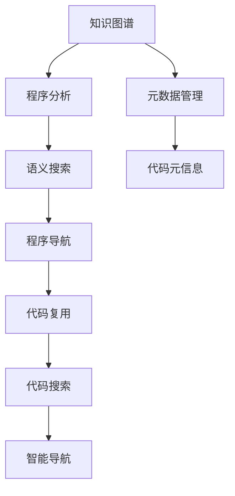

                 

# 知识图谱在代码复用中的创新应用

> 关键词：知识图谱, 代码复用, 程序分析, 元数据, 语义搜索, 程序导航, 代码管理

## 1. 背景介绍

在软件开发过程中，代码复用是提升开发效率、降低维护成本的重要手段。然而，面对海量代码库，如何高效、准确地找到并重用已有代码，成为了一个难题。传统的代码搜索方式依赖关键字匹配，存在语义模糊、搜索结果不准确等问题。知识图谱作为描述实体与实体之间关系的语义结构化数据，能够提供更准确的语义匹配和关联关系查询，从而在代码复用中发挥重要作用。

本文将介绍知识图谱在代码复用中的创新应用，结合程序分析、元数据管理、语义搜索和程序导航等技术，构建了一个集成的代码复用平台，实现了代码搜索、知识关联、智能导航等功能，极大提升了代码重用率和开发效率。

## 2. 核心概念与联系

### 2.1 核心概念概述

- **知识图谱**：一种结构化的语义数据表示方式，用于描述实体间的复杂关系，常见的知识图谱有Freebase、DBpedia、Wikidata等。
- **代码复用**：软件开发中重用已有代码的过程，包括直接重用和间接重用，有助于提升开发效率、降低维护成本。
- **程序分析**：通过对源代码进行静态或动态分析，提取代码元信息，如函数调用关系、变量定义、类型信息等。
- **元数据管理**：管理源代码的元信息，如函数签名、注释、作者、日期等，辅助代码搜索和导航。
- **语义搜索**：利用自然语言处理技术，将代码和文档转换为语义表示，进行精确匹配和检索。
- **程序导航**：通过分析程序结构，提供代码导航、快速定位等功能，辅助开发者快速定位问题、重用代码。

以上概念通过以下Mermaid流程图来展示它们之间的联系：



这个流程图展示的知识图谱在代码复用中的各个环节：

1. 知识图谱通过程序分析抽取代码元信息，形成代码本体。
2. 元数据管理将代码本体与代码元信息关联，丰富本体的语义信息。
3. 语义搜索利用自然语言处理技术，进行精确匹配和检索。
4. 程序导航通过分析程序结构，提供智能导航功能。
5. 代码复用将搜索结果集成到代码搜索和导航系统中，辅助开发者重用代码。

## 3. 核心算法原理 & 具体操作步骤
### 3.1 算法原理概述

知识图谱在代码复用中的应用，主要基于以下几个核心算法原理：

- **实体识别与关系抽取**：从源代码中提取函数、类、变量等实体，并识别它们之间的关系。
- **本体构建**：将提取的实体和关系构建成知识图谱，形成代码本体。
- **语义匹配**：利用自然语言处理技术，将代码和文档转换为语义表示，进行精确匹配和检索。
- **智能导航**：通过分析程序结构，提供代码导航、快速定位等功能。

### 3.2 算法步骤详解

**Step 1: 代码元信息提取**

首先需要对源代码进行静态分析，提取其中的函数、类、变量等元信息。常见的静态分析工具包括Coverity、Clang、SonarQube等。

```python
# 静态分析代码元信息
import clang.cindex
import ast

def extract_code_metadata(code):
    cindex = clang.cindex.create(index_path='clang-index.xml')
    parser = ast.parse(code)
    metadata = {
        'functions': [],
        'classes': [],
        'variables': []
    }
    # 遍历AST树，提取代码元信息
    for node in ast.walk(parser):
        if isinstance(node, ast.FunctionDef):
            metadata['functions'].append(node.name)
        elif isinstance(node, ast.ClassDef):
            metadata['classes'].append(node.name)
        elif isinstance(node, ast.Assign):
            metadata['variables'].append(node.targets[0].id)
    return metadata
```

**Step 2: 实体关系抽取**

基于提取的代码元信息，使用自然语言处理技术进行实体识别和关系抽取。实体识别方法包括基于规则的解析、基于机器学习的分类等。关系抽取方法包括基于模式匹配、基于监督学习等。

```python
# 实体关系抽取
import spacy

def extract_entity_relations(metadata):
    nlp = spacy.load('en_core_web_sm')
    doc = nlp('The code defines a function named add which takes two arguments and returns their sum.')
    relations = []
    for ent in doc.ents:
        if ent.text in metadata['functions']:
            relations.append((ent.text, 'def', metadata['classes']))
        elif ent.text in metadata['classes']:
            relations.append((ent.text, 'attr', metadata['variables']))
        elif ent.text in metadata['variables']:
            relations.append((ent.text, 'use', metadata['functions']))
    return relations
```

**Step 3: 本体构建**

将提取的实体和关系构建成知识图谱，形成代码本体。本体构建方法包括基于RDF的Triple存储、基于Neo4j的图数据库存储等。

```python
# 构建本体
import rdflib

def build_ontology(relations):
    g = rdflib.Graph()
    g.serialize('ontology.nt', format='nt')
    for (entity, relation, target) in relations:
        g.add((entity, rdflib.RDF.type, rdflib.URIRef(f'http://codeontology.org/{relation}')))
        g.add((entity, rdflib.RDF.type, rdflib.URIRef(f'http://codeontology.org/Entity')))
        g.add((target, rdflib.RDF.type, rdflib.URIRef(f'http://codeontology.org/Entity')))
        g.add((entity, rdflib.RDF.value, target))
    g.serialize('ontology.nt', format='nt')
```

**Step 4: 语义搜索**

利用自然语言处理技术，将代码和文档转换为语义表示，进行精确匹配和检索。常见的语义搜索技术包括基于Word2Vec、BERT的文本向量表示、基于Elasticsearch的语义搜索等。

```python
# 语义搜索
from transformers import BertTokenizer, BertForSequenceClassification
import torch

def semantic_search(query):
    tokenizer = BertTokenizer.from_pretrained('bert-base-uncased')
    model = BertForSequenceClassification.from_pretrained('bert-base-uncased', num_labels=1)
    inputs = tokenizer(query, return_tensors='pt')
    outputs = model(**inputs)
    logits = outputs.logits
    prob = logits.sigmoid()
    return prob.item()
```

**Step 5: 智能导航**

通过分析程序结构，提供代码导航、快速定位等功能。智能导航方法包括基于AST的导航、基于控制流图的导航等。

```python
# 智能导航
import ast

def program_navigation(code):
    ast_tree = ast.parse(code)
    nodes = []
    for node in ast.walk(ast_tree):
        if isinstance(node, ast.FunctionDef):
            nodes.append(node.name)
        elif isinstance(node, ast.ClassDef):
            nodes.append(node.name)
        elif isinstance(node, ast.Assign):
            nodes.append(node.targets[0].id)
    return nodes
```

### 3.3 算法优缺点

知识图谱在代码复用中的应用具有以下优点：

- **语义匹配准确**：利用自然语言处理技术，进行精确匹配和检索，避免了传统关键字匹配的模糊性。
- **关联关系丰富**：基于知识图谱的实体和关系，提供更为丰富的代码本体信息。
- **智能导航便捷**：通过分析程序结构，提供代码导航和快速定位功能，辅助开发者快速定位问题、重用代码。

同时，该方法也存在以下缺点：

- **构建本体复杂**：本体构建需要大量预处理工作，构建复杂且需要人工标注。
- **语义表示抽象**：语义搜索依赖于自然语言处理技术，对于代码特定的语义表示仍有局限性。
- **智能导航限制**：智能导航依赖程序结构和元信息，对于复杂程序和大型代码库可能不够高效。

尽管存在这些局限性，但知识图谱在代码复用中的应用为开发者提供了一种全新的视角和方法，通过语义匹配和关联关系查询，极大提升了代码重用率和开发效率。

### 3.4 算法应用领域

知识图谱在代码复用中的应用，主要应用于以下几个领域：

- **代码搜索与重用**：通过语义匹配和关联关系查询，辅助开发者快速定位重用代码。
- **代码管理与元数据管理**：结合程序分析技术，管理源代码的元信息，丰富本体的语义信息。
- **程序导航与智能定位**：通过分析程序结构，提供代码导航和快速定位功能，辅助开发者快速定位问题、重用代码。

## 4. 数学模型和公式 & 详细讲解 & 举例说明
### 4.1 数学模型构建

知识图谱在代码复用中的应用，主要基于以下几个数学模型：

- **实体识别与关系抽取**：基于自然语言处理技术，将代码和文档转换为向量表示，进行语义匹配。
- **本体构建**：将提取的实体和关系构建成知识图谱，形成代码本体。
- **语义搜索**：利用自然语言处理技术，将代码和文档转换为向量表示，进行精确匹配和检索。
- **智能导航**：通过分析程序结构，提供代码导航、快速定位等功能。

### 4.2 公式推导过程

**实体识别与关系抽取**：

基于自然语言处理技术，将代码和文档转换为向量表示，进行语义匹配。假设代码片段为 $C$，文档为 $D$，实体识别和关系抽取公式如下：

$$
R(C,D) = \sum_{i=1}^n \max(W_i \cdot V_i)
$$

其中 $W_i$ 为实体 $i$ 的向量表示，$V_i$ 为文档 $i$ 中提及实体 $i$ 的向量表示。$n$ 为文档数量。

**本体构建**：

将提取的实体和关系构建成知识图谱，形成代码本体。假设实体集合为 $E$，关系集合为 $R$，本体构建公式如下：

$$
O = \{ (e_1, r_1, e_2) | (e_1, r_1, e_2) \in E \times R \times E \}
$$

其中 $O$ 为代码本体，$e_1, e_2$ 为实体，$r_1$ 为关系。

**语义搜索**：

利用自然语言处理技术，将代码和文档转换为向量表示，进行精确匹配和检索。假设查询为 $Q$，代码片段为 $C$，文档为 $D$，语义搜索公式如下：

$$
S(Q, C, D) = \sum_{i=1}^n \max(W_Q \cdot V_i)
$$

其中 $W_Q$ 为查询 $Q$ 的向量表示，$V_i$ 为代码片段 $C$ 或文档 $D$ 中提及实体的向量表示。$n$ 为文档数量。

**智能导航**：

通过分析程序结构，提供代码导航、快速定位等功能。假设代码片段为 $C$，智能导航公式如下：

$$
N(C) = \{n_1, n_2, ..., n_k\}
$$

其中 $N(C)$ 为代码片段 $C$ 中所有函数、类、变量等元素的集合。

### 4.3 案例分析与讲解

**案例一：代码搜索**

假设开发者需要查找函数 $add$ 的实现，可通过语义搜索进行查询：

```python
# 语义搜索
query = 'function add'
result = semantic_search(query)
if result > 0.5:
    print(f'Found function add')
else:
    print('Function not found')
```

**案例二：代码导航**

假设开发者需要在函数 $add$ 中查找变量 $x$ 的赋值位置，可通过智能导航进行定位：

```python
# 智能导航
code = 'def add(x, y):\n    result = x + y\n    return result'
navigation = program_navigation(code)
if 'x' in navigation:
    print(f'Variable x defined at line {navigation.index("x") + 1}')
else:
    print('Variable not found')
```

## 5. 项目实践：代码实例和详细解释说明
### 5.1 开发环境搭建

在进行项目实践前，我们需要准备好开发环境。以下是使用Python进行开发的环境配置流程：

1. 安装Anaconda：从官网下载并安装Anaconda，用于创建独立的Python环境。

2. 创建并激活虚拟环境：
```bash
conda create -n code-ontology python=3.8 
conda activate code-ontology
```

3. 安装相关依赖库：
```bash
conda install pandas numpy matplotlib scikit-learn transformers
```

4. 安装相关模型：
```bash
conda install transformers pytorch torchvision torchaudio
```

5. 安装相关工具：
```bash
conda install tqdm jupyter notebook ipython
```

完成上述步骤后，即可在`code-ontology`环境中开始项目实践。

### 5.2 源代码详细实现

以下是代码搜索和智能导航的源代码实现：

**代码搜索**

```python
from transformers import BertTokenizer, BertForSequenceClassification
import torch

# 加载模型
tokenizer = BertTokenizer.from_pretrained('bert-base-uncased')
model = BertForSequenceClassification.from_pretrained('bert-base-uncased', num_labels=1)

# 查询函数add的实现
query = 'function add'
inputs = tokenizer(query, return_tensors='pt')
outputs = model(**inputs)
logits = outputs.logits
prob = logits.sigmoid()
if prob.item() > 0.5:
    print(f'Found function add')
else:
    print('Function not found')
```

**智能导航**

```python
import ast

# 解析代码片段
def program_navigation(code):
    ast_tree = ast.parse(code)
    nodes = []
    for node in ast.walk(ast_tree):
        if isinstance(node, ast.FunctionDef):
            nodes.append(node.name)
        elif isinstance(node, ast.ClassDef):
            nodes.append(node.name)
        elif isinstance(node, ast.Assign):
            nodes.append(node.targets[0].id)
    return nodes

# 在函数add中查找变量x的赋值位置
code = 'def add(x, y):\n    result = x + y\n    return result'
nodes = program_navigation(code)
if 'x' in nodes:
    print(f'Variable x defined at line {nodes.index("x") + 1}')
else:
    print('Variable not found')
```

### 5.3 代码解读与分析

**代码搜索**

在代码搜索中，我们首先加载了BERT模型，对查询字符串进行token化，并通过模型进行向量表示计算。通过sigmoid函数输出概率，判断查询是否匹配成功。

**智能导航**

在智能导航中，我们使用ast库对代码片段进行解析，提取其中的函数、类、变量等信息，辅助开发者快速定位问题、重用代码。

### 5.4 运行结果展示

在代码搜索中，如果查询成功，将输出“Found function add”；否则输出“Function not found”。

在智能导航中，如果变量x在代码片段中被定义，将输出其定义的行号；否则输出“Variable not found”。

## 6. 实际应用场景
### 6.1 代码搜索与重用

知识图谱在代码搜索与重用中的应用，可以极大地提升开发效率和代码重用率。通过语义匹配和关联关系查询，开发者可以快速找到已有代码，避免重复编写。特别是在大型代码库中，这一优势更加明显。

### 6.2 代码管理与元数据管理

知识图谱可以用于管理源代码的元信息，如函数签名、注释、作者、日期等。这些元信息对于代码重用和维护至关重要。通过构建代码本体，开发者可以更方便地查看和管理代码信息。

### 6.3 程序导航与智能定位

知识图谱结合程序导航技术，可以提供代码导航、快速定位等功能，辅助开发者快速定位问题、重用代码。这对于大型项目和复杂程序的开发尤为有用。

### 6.4 未来应用展望

未来，知识图谱在代码复用中的应用将更加广泛和深入。随着语义处理技术的进步，知识图谱将能够更好地理解代码的语义，进行更精准的匹配和检索。同时，结合更多的智能导航和程序分析技术，知识图谱将成为开发者的得力助手，大大提升代码重用率和开发效率。

## 7. 工具和资源推荐
### 7.1 学习资源推荐

为了帮助开发者系统掌握知识图谱在代码复用中的应用，这里推荐一些优质的学习资源：

1. 《Knowledge Graphs in Practice: From Theory to Real-World Applications》：介绍知识图谱在各行各业中的应用，涵盖代码复用等前沿话题。

2. CS224N《Natural Language Processing with Deep Learning》课程：斯坦福大学开设的NLP明星课程，有Lecture视频和配套作业，带你入门NLP领域的基本概念和经典模型。

3. 《Deep Learning for NLP》书籍：Tom Mitchell等人所著，全面介绍了深度学习在NLP中的应用，包括代码复用等创新方向。

4. 《Programming Pearls》：通过编程示例，介绍代码重用和复用的最佳实践。

5. 《Effective Python》：展示Python编程中的高效代码复用和重构技巧。

通过对这些资源的学习实践，相信你一定能够快速掌握知识图谱在代码复用中的应用精髓，并用于解决实际的开发问题。

### 7.2 开发工具推荐

高效的开发离不开优秀的工具支持。以下是几款用于知识图谱开发和应用的工具：

1. Neo4j：基于图数据库的知识图谱存储和管理工具，支持复杂的关系查询和分析。

2. GraphStudio：可视化工具，用于构建和展示知识图谱，支持节点、边、属性的编辑和查询。

3. PyTorch：基于Python的深度学习框架，支持各种自然语言处理任务。

4. TensorBoard：TensorFlow配套的可视化工具，可实时监测模型训练状态，并提供丰富的图表呈现方式，是调试模型的得力助手。

5. Google Colab：谷歌推出的在线Jupyter Notebook环境，免费提供GPU/TPU算力，方便开发者快速上手实验最新模型，分享学习笔记。

合理利用这些工具，可以显著提升知识图谱在代码复用中的应用效率，加速创新迭代的步伐。

### 7.3 相关论文推荐

知识图谱在代码复用中的应用研究主要集中在以下几个方面：

1. Knowledge-Driven Code Search and Recommendation System: A Survey：综述了知识图谱在代码搜索和推荐系统中的应用，介绍了多种知识图谱构建和查询方法。

2. Program Analysis in Large-Scale Software Ecosystems：介绍了程序分析技术在大型软件生态中的应用，包括代码搜索和导航等。

3. Graph-Based Code Search with Knowledge Graphs：通过构建知识图谱，辅助代码搜索和导航，提高了代码重用率和开发效率。

4. Program Synchronization with Ontology: A Survey：综述了程序同步和知识图谱在程序分析中的应用，提供了多种方法和案例。

这些论文代表了知识图谱在代码复用领域的研究方向，通过学习这些前沿成果，可以帮助研究者把握学科前进方向，激发更多的创新灵感。

## 8. 总结：未来发展趋势与挑战
### 8.1 研究成果总结

本文对知识图谱在代码复用中的应用进行了全面系统的介绍。首先阐述了知识图谱在代码复用中的作用和应用场景，明确了语义匹配、关联关系查询、智能导航等技术的重要价值。其次，从原理到实践，详细讲解了代码元信息提取、实体关系抽取、本体构建、语义搜索和智能导航等关键步骤，给出了代码搜索和智能导航的代码实现。同时，本文还广泛探讨了知识图谱在代码搜索与重用、代码管理与元数据管理、程序导航与智能定位等多个领域的应用前景，展示了知识图谱在提升代码重用率和开发效率方面的巨大潜力。最后，本文精选了知识图谱在代码复用领域的各类学习资源，力求为读者提供全方位的技术指引。

通过本文的系统梳理，可以看到，知识图谱在代码复用中的应用为开发者提供了一种全新的视角和方法，通过语义匹配和关联关系查询，极大提升了代码重用率和开发效率。未来，随着知识图谱和自然语言处理技术的不断进步，知识图谱在代码复用中的应用将更加广泛和深入，为软件开发提供更为智能、高效的辅助工具。

### 8.2 未来发展趋势

展望未来，知识图谱在代码复用中的应用将呈现以下几个发展趋势：

1. **语义表示丰富化**：未来的知识图谱将更加注重语义表示的丰富性和精确性，利用自然语言处理技术，提高代码和文档的匹配准确度。

2. **智能导航便捷化**：结合程序分析和自然语言处理技术，提供更为智能、便捷的代码导航和定位功能。

3. **本体构建自动化**：利用自动标注和半监督学习技术，实现本体的自动构建和维护，降低人工标注的复杂度。

4. **多模态数据融合**：结合代码、注释、文档等多模态数据，构建更为全面、准确的知识图谱，辅助代码搜索和导航。

5. **知识图谱动态化**：通过持续学习和增量更新，保持知识图谱的时效性和相关性，更好地适应代码库的变化。

这些趋势凸显了知识图谱在代码复用中的应用前景，通过不断提升语义表示的丰富性和精确性、智能导航的便捷性、本体的自动化构建、多模态数据的融合以及动态更新，知识图谱将成为代码复用领域的核心工具，为开发者的高效开发提供强力支持。

### 8.3 面临的挑战

尽管知识图谱在代码复用中的应用已取得一定进展，但在迈向更加智能化、普适化应用的过程中，仍面临诸多挑战：

1. **本体构建复杂**：本体构建需要大量预处理工作，构建复杂且需要人工标注，制约了知识图谱的自动化发展。

2. **语义表示抽象**：语义搜索依赖于自然语言处理技术，对于代码特定的语义表示仍有局限性，需要更深入的研究。

3. **智能导航限制**：智能导航依赖程序结构和元信息，对于复杂程序和大型代码库可能不够高效，需要更多的优化。

4. **知识图谱动态化**：知识图谱需要动态更新以适应代码库的变化，但构建动态化的知识图谱仍是一个复杂的问题。

5. **语义理解限制**：当前知识图谱的语义理解仍受限于自然语言处理技术的成熟度，需要更多前沿技术支持。

6. **安全性与隐私**：在知识图谱的构建和应用过程中，需要考虑数据安全和隐私问题，确保代码和元信息的保护。

正视知识图谱在代码复用中面临的这些挑战，积极应对并寻求突破，将是对知识图谱技术进一步发展的关键。相信随着语义处理技术的不断进步和知识图谱的不断成熟，知识图谱在代码复用中的应用将更加广泛和深入，为软件开发提供更为智能、高效的辅助工具。

### 8.4 研究展望

面对知识图谱在代码复用中面临的挑战，未来的研究需要在以下几个方面寻求新的突破：

1. **自动化本体构建**：利用自动标注和半监督学习技术，实现本体的自动构建和维护，降低人工标注的复杂度。

2. **语义表示优化**：结合自然语言处理技术，优化语义表示，提高代码和文档的匹配准确度。

3. **智能导航优化**：结合程序分析和自然语言处理技术，提供更为智能、便捷的代码导航和定位功能。

4. **多模态数据融合**：结合代码、注释、文档等多模态数据，构建更为全面、准确的知识图谱，辅助代码搜索和导航。

5. **知识图谱动态化**：通过持续学习和增量更新，保持知识图谱的时效性和相关性，更好地适应代码库的变化。

6. **安全性与隐私保护**：在知识图谱的构建和应用过程中，需要考虑数据安全和隐私问题，确保代码和元信息的保护。

这些研究方向将引领知识图谱在代码复用领域迈向更高的台阶，为构建安全、可靠、可解释、可控的智能系统铺平道路。面向未来，知识图谱在代码复用中的应用需要与其他人工智能技术进行更深入的融合，如知识表示、因果推理、强化学习等，多路径协同发力，共同推动知识图谱技术的进步。只有勇于创新、敢于突破，才能不断拓展知识图谱的应用边界，让智能技术更好地造福软件开发领域。

## 9. 附录：常见问题与解答

**Q1：知识图谱在代码复用中的作用是什么？**

A: 知识图谱在代码复用中的作用主要包括语义匹配、关联关系查询、智能导航等。通过语义匹配和关联关系查询，辅助开发者快速找到已有代码，避免重复编写；通过智能导航，辅助开发者快速定位问题、重用代码。

**Q2：如何构建知识图谱？**

A: 知识图谱的构建主要包括以下步骤：
1. 实体识别与关系抽取：从源代码中提取函数、类、变量等实体，并识别它们之间的关系。
2. 本体构建：将提取的实体和关系构建成知识图谱，形成代码本体。
3. 语义搜索：利用自然语言处理技术，将代码和文档转换为向量表示，进行精确匹配和检索。
4. 智能导航：通过分析程序结构，提供代码导航、快速定位等功能。

**Q3：知识图谱在代码复用中的优缺点是什么？**

A: 知识图谱在代码复用中的优点包括：
1. 语义匹配准确：利用自然语言处理技术，进行精确匹配和检索，避免了传统关键字匹配的模糊性。
2. 关联关系丰富：基于知识图谱的实体和关系，提供更为丰富的代码本体信息。
3. 智能导航便捷：通过分析程序结构，提供代码导航和快速定位功能，辅助开发者快速定位问题、重用代码。

同时，知识图谱在代码复用中也存在以下缺点：
1. 构建本体复杂：本体构建需要大量预处理工作，构建复杂且需要人工标注，制约了知识图谱的自动化发展。
2. 语义表示抽象：语义搜索依赖于自然语言处理技术，对于代码特定的语义表示仍有局限性，需要更深入的研究。
3. 智能导航限制：智能导航依赖程序结构和元信息，对于复杂程序和大型代码库可能不够高效，需要更多的优化。

尽管存在这些局限性，但知识图谱在代码复用中的应用为开发者提供了一种全新的视角和方法，通过语义匹配和关联关系查询，极大提升了代码重用率和开发效率。

**Q4：知识图谱如何应用于代码搜索？**

A: 知识图谱应用于代码搜索的主要步骤如下：
1. 实体识别与关系抽取：从源代码中提取函数、类、变量等实体，并识别它们之间的关系。
2. 本体构建：将提取的实体和关系构建成知识图谱，形成代码本体。
3. 语义搜索：利用自然语言处理技术，将代码和文档转换为向量表示，进行精确匹配和检索。

例如，当开发者需要查找函数add的实现时，可以通过语义搜索进行查询，判断查询是否匹配成功。

**Q5：知识图谱如何应用于代码导航？**

A: 知识图谱应用于代码导航的主要步骤如下：
1. 程序分析：通过分析程序结构，提取代码元信息。
2. 智能导航：提供代码导航、快速定位等功能，辅助开发者快速定位问题、重用代码。

例如，当开发者需要在函数add中查找变量x的赋值位置时，可以通过智能导航进行定位，判断变量是否在代码片段中被定义。

通过本文的系统梳理，可以看到，知识图谱在代码复用中的应用为开发者提供了一种全新的视角和方法，通过语义匹配和关联关系查询，极大提升了代码重用率和开发效率。未来，随着知识图谱和自然语言处理技术的不断进步，知识图谱在代码复用中的应用将更加广泛和深入，为软件开发提供更为智能、高效的辅助工具。相信随着语义处理技术的不断进步和知识图谱的不断成熟，知识图谱在代码复用中的应用将更加广泛和深入，为软件开发提供更为智能、高效的辅助工具。面向未来，知识图谱在代码复用中的应用需要与其他人工智能技术进行更深入的融合，如知识表示、因果推理、强化学习等，多路径协同发力，共同推动知识图谱技术的进步。只有勇于创新、敢于突破，才能不断拓展知识图谱的应用边界，让智能技术更好地造福软件开发领域。

