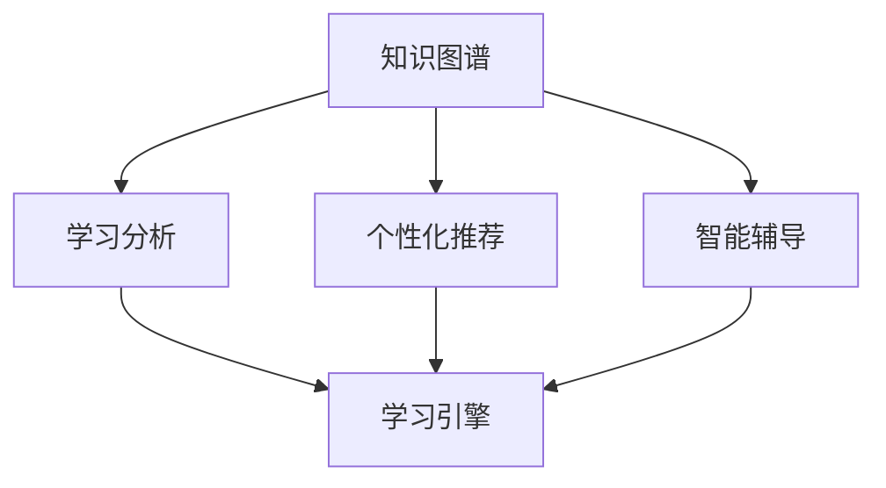

                 

# 知识图谱在教育中的应用：个性化学习的未来

> 关键词：知识图谱, 个性化学习, 教育技术, 推荐系统, 学习分析, 人工智能

## 1. 背景介绍

### 1.1 问题由来
随着信息技术在教育领域的应用深入，个性化学习成为提升教育质量和效率的关键。传统的“一刀切”式教学模式难以满足学生的个性化需求，导致教育资源浪费和学生学习效果不佳。为了应对这一挑战，教育技术从业者不断寻求更加智能、灵活的教学解决方案，而知识图谱在这一过程中扮演了重要角色。

知识图谱(Knowledge Graph)是一种结构化知识表示方法，通过实体、关系和属性三元组的形式，将知识点之间的复杂关系描述为图形结构，从而实现知识的网络化存储和检索。在教育领域，知识图谱被广泛应用于个性化推荐、学习分析、智能辅导等方面，有效提升了教学的个性化和针对性。

### 1.2 问题核心关键点
知识图谱在教育中的应用，主要集中在以下几个方面：

- **个性化推荐**：利用知识图谱为每位学生推荐合适的学习资源、习题、视频等，提升学习效率。
- **学习分析**：通过分析学生的学习路径、成绩和行为，提供个性化的学习建议和改进方案。
- **智能辅导**：结合知识图谱和自然语言处理技术，构建智能辅导系统，实时解答学生疑问，辅助教师教学。
- **学习引擎**：构建基于知识图谱的学习引擎，帮助学生自主学习、自适应学习，适应不同学习风格。

本文将系统介绍知识图谱在教育中的应用，从核心概念、算法原理、项目实践、应用场景等多个角度进行深入探讨，并展望其未来发展趋势。

## 2. 核心概念与联系

### 2.1 核心概念概述

为更好地理解知识图谱在教育中的应用，本节将介绍几个核心概念：

- **知识图谱(Knowledge Graph)**：一种结构化的知识表示方法，通过实体、关系和属性三元组，描述知识点之间的复杂关系，构建知识网络。
- **学习分析(Learning Analytics)**：通过数据挖掘、机器学习等技术，分析学生的学习行为、成绩和反馈，提供个性化的学习建议和改进方案。
- **个性化推荐**：根据学生的学习背景、兴趣和行为，推荐合适的学习资源、习题、视频等，提升学习效率。
- **智能辅导**：结合知识图谱和自然语言处理技术，构建智能辅导系统，实时解答学生疑问，辅助教师教学。
- **学习引擎**：基于知识图谱构建的学习系统，通过智能化推荐和学习路径规划，实现个性化、自适应的学习体验。

这些核心概念之间的逻辑关系可以通过以下Mermaid流程图来展示：



这个流程图展示的知识图谱的核心概念及其之间的关系：

1. 知识图谱通过构建知识网络，为学习分析、个性化推荐、智能辅导和学习引擎提供知识基础。
2. 学习分析通过数据挖掘技术，对学生学习行为进行分析和评估，为个性化推荐和智能辅导提供数据支持。
3. 个性化推荐结合知识图谱和学生兴趣，推荐合适的学习资源和习题，提升学习效率。
4. 智能辅导利用知识图谱和自然语言处理技术，实时解答学生疑问，辅助教师教学。
5. 学习引擎基于知识图谱，构建自适应的学习路径，实现个性化学习。

## 3. 核心算法原理 & 具体操作步骤

### 3.1 算法原理概述

知识图谱在教育中的应用，主要基于以下核心算法原理：

- **实体识别与抽取**：从文本数据中识别出有意义的实体，并提取其属性和关系，构建知识图谱。
- **关系推理与计算**：利用知识图谱中的实体和关系，进行推理计算，推荐合适的学习资源和习题。
- **学习行为分析**：通过分析学生的学习路径、成绩和行为，提供个性化的学习建议和改进方案。
- **自然语言处理**：结合自然语言处理技术，构建智能辅导系统，实时解答学生疑问，辅助教师教学。

这些算法原理构成了知识图谱在教育中的核心框架，使得个性化学习成为可能。

### 3.2 算法步骤详解

知识图谱在教育中的应用，可以分为以下几个关键步骤：

**Step 1: 数据采集与处理**

- 收集学生的学习记录、测试成绩、作业反馈等数据，构建学生档案。
- 从教材、论文、百科等结构化数据中提取知识点，构建知识库。
- 对文本数据进行实体识别、关系抽取等预处理，构建知识图谱。

**Step 2: 知识图谱构建**

- 利用自然语言处理技术，从文本中提取实体、关系和属性，构建知识图谱。
- 将知识图谱中的实体和关系进行实体链接，构建知识网络。
- 利用关系推理技术，进行知识推理和计算，生成推荐结果。

**Step 3: 个性化推荐**

- 结合学生的学习历史、兴趣和行为，进行个性化推荐。
- 利用协同过滤、内容推荐等技术，构建推荐模型。
- 对推荐结果进行排序和展示，提升学习效率。

**Step 4: 学习分析与评估**

- 对学生的学习行为、成绩和反馈进行分析，提供个性化的学习建议。
- 利用学习分析技术，识别学习障碍和知识盲点，制定改进方案。
- 通过可视化工具，展示学生的学习路径和行为，帮助教师和学生进行自我评估。

**Step 5: 智能辅导**

- 构建智能辅导系统，利用知识图谱和自然语言处理技术，实时解答学生疑问。
- 集成知识图谱中的知识资源，提供全面的解答和解释。
- 结合学生的反馈，不断优化智能辅导系统，提升教学效果。

### 3.3 算法优缺点

知识图谱在教育中的应用，具有以下优点：

1. **数据驱动**：利用大规模的教育数据，进行个性化推荐和学习分析，提升教学效果。
2. **知识共享**：构建知识图谱，实现知识的共享和传播，促进教学资源的优化配置。
3. **智能化推荐**：利用知识图谱和推荐算法，实现智能化的个性化推荐，提升学习效率。
4. **实时代理**：利用智能辅导系统，实时解答学生疑问，辅助教师教学。

同时，该方法也存在一些局限性：

1. **数据质量依赖**：知识图谱的质量和准确性依赖于数据采集和处理的质量，低质量数据会影响推荐和分析的效果。
2. **知识图谱构建复杂**：知识图谱的构建需要大量的人工干预，过程复杂且耗时。
3. **隐私与安全**：涉及大量学生数据，隐私和安全问题需要重视，需采取措施保护学生信息。
4. **技术门槛高**：知识图谱和推荐算法的实现需要较高的技术门槛，对教育技术从业者提出了挑战。

尽管存在这些局限性，但就目前而言，知识图谱在教育中的应用已经成为一种重要的趋势，具有广阔的前景。

### 3.4 算法应用领域

知识图谱在教育中的应用，已经涵盖多个领域，具体如下：

- **个性化学习推荐**：如智能教材推荐、学习资源推荐、习题推荐等，提升学习效率。
- **学习分析**：如学习路径分析、成绩评估、行为分析等，提供个性化的学习建议和改进方案。
- **智能辅导系统**：如智能答疑、智能推荐、学习进度监控等，辅助教师教学。
- **在线教育平台**：如MOOC平台、学习管理系统等，集成知识图谱进行个性化推荐和学习分析。

## 4. 数学模型和公式 & 详细讲解 & 举例说明

### 4.1 数学模型构建

假设知识图谱中包含 $N$ 个实体 $E$，$M$ 个关系 $R$，以及 $L$ 个属性 $A$。实体 $e_i$ 通过关系 $r_j$ 连接实体 $e_k$，表示为三元组 $(e_i,r_j,e_k)$。实体 $e_i$ 的属性表示为 $(a_{i1},a_{i2},...,a_{il})$，其中 $a_{ij}$ 表示实体 $e_i$ 的第 $j$ 个属性值。

知识图谱中的实体和关系，可以通过以下公式表示：

$$
\begin{aligned}
E &= \{e_1, e_2, ..., e_N\} \\
R &= \{r_1, r_2, ..., r_M\} \\
A &= \{a_{11}, a_{12}, ..., a_{il}\} \\
(e_i,r_j,e_k) &= \langle e_i,a_{ij},e_k \rangle \\
\end{aligned}
$$

### 4.2 公式推导过程

知识图谱在推荐系统中的应用，可以通过协同过滤和基于内容的推荐算法进行推导：

**协同过滤算法**：假设知识图谱中已经构建好了学生 $s$ 和知识点 $k$ 的评分矩阵 $P$，其中 $p_{ik}$ 表示学生 $s$ 对知识点 $k$ 的评分。协同过滤算法可以通过以下几个步骤进行推导：

1. **用户相似度计算**：计算学生 $s$ 和所有其他学生 $s'$ 的相似度 $s_{s'}$。
2. **评分预测**：基于 $s$ 和 $s'$ 的相似度，预测学生 $s$ 对知识点 $k$ 的评分 $p_{ik}'$。
3. **排序与推荐**：对 $p_{ik}'$ 进行排序，推荐得分最高的知识点。

$$
\begin{aligned}
s_{s'} &= \text{similarity}(s, s') \\
p_{ik}' &= \sum_{s' \in S} s_{s'} \cdot p_{ik} \\
\text{推荐知识点} &= \text{argmax}_{k \in K} p_{ik}'
\end{aligned}
$$

**基于内容的推荐算法**：假设知识图谱中已经构建好了学生 $s$ 和知识点 $k$ 的特征向量 $V_s$ 和 $V_k$，其中 $v_{si}$ 表示学生 $s$ 的第 $i$ 个特征值。基于内容的推荐算法可以通过以下几个步骤进行推导：

1. **特征相似度计算**：计算学生 $s$ 和知识点 $k$ 的特征相似度 $c_{sk}$。
2. **评分预测**：基于 $c_{sk}$，预测学生 $s$ 对知识点 $k$ 的评分 $p_{sk}$。
3. **排序与推荐**：对 $p_{sk}$ 进行排序，推荐得分最高的知识点。

$$
\begin{aligned}
c_{sk} &= \text{similarity}(V_s, V_k) \\
p_{sk} &= \sum_{i=1}^I c_{sk} \cdot v_{ki} \\
\text{推荐知识点} &= \text{argmax}_{k \in K} p_{sk}
\end{aligned}
$$

### 4.3 案例分析与讲解

以一个基于知识图谱的个性化学习推荐系统为例，分析其实现过程和效果。

**案例背景**：某在线教育平台，希望通过知识图谱为每位学生推荐合适的学习资源，提升学习效率。平台已经收集了学生的学习历史、兴趣和行为数据，构建了知识图谱。

**推荐流程**：

1. **数据采集**：从学生的学习记录、测试成绩、作业反馈中提取知识点，构建学生档案。
2. **知识图谱构建**：利用自然语言处理技术，从教材、论文、百科等结构化数据中提取知识点，构建知识图谱。
3. **实体识别与抽取**：对学生档案和知识图谱中的数据进行实体识别和抽取，构建学生-知识点关系图。
4. **关系推理与计算**：利用知识图谱中的实体和关系，进行推理计算，生成推荐结果。
5. **个性化推荐**：结合学生的学习历史、兴趣和行为，进行个性化推荐。

**推荐效果**：通过上述流程，平台实现了智能推荐，提升了学生学习效率和满意度。例如，某学生在数学课上表现不佳，通过推荐系统，平台为其推荐了额外的数学练习题和视频讲解，学生在学习过程中获得了更多的帮助，成绩明显提高。

## 5. 项目实践：代码实例和详细解释说明

### 5.1 开发环境搭建

在进行项目实践前，我们需要准备好开发环境。以下是使用Python进行PyTorch开发的环境配置流程：

1. 安装Anaconda：从官网下载并安装Anaconda，用于创建独立的Python环境。

2. 创建并激活虚拟环境：
```bash
conda create -n pytorch-env python=3.8 
conda activate pytorch-env
```

3. 安装PyTorch：根据CUDA版本，从官网获取对应的安装命令。例如：
```bash
conda install pytorch torchvision torchaudio cudatoolkit=11.1 -c pytorch -c conda-forge
```

4. 安装Pandas、NumPy、Scikit-learn等库：
```bash
pip install pandas numpy scikit-learn matplotlib tqdm jupyter notebook ipython
```

完成上述步骤后，即可在`pytorch-env`环境中开始项目实践。

### 5.2 源代码详细实现

这里以构建基于知识图谱的个性化推荐系统为例，展示Python代码实现：

```python
import pandas as pd
import numpy as np
import torch
from transformers import BertTokenizer, BertForSequenceClassification
from sklearn.metrics import accuracy_score, precision_recall_fscore_support

# 定义推荐模型类
class RecommendationModel:
    def __init__(self, model_name):
        self.tokenizer = BertTokenizer.from_pretrained(model_name)
        self.model = BertForSequenceClassification.from_pretrained(model_name, num_labels=2)
        self.model.train()

    def predict(self, input_ids, attention_mask):
        with torch.no_grad():
            logits = self.model(input_ids, attention_mask=attention_mask)[0]
            probs = logits.softmax(dim=1)
            return probs

    def fit(self, train_data, dev_data, test_data, epochs, batch_size, lr):
        self.model.train()
        train_loader = torch.utils.data.DataLoader(train_data, batch_size=batch_size, shuffle=True)
        dev_loader = torch.utils.data.DataLoader(dev_data, batch_size=batch_size, shuffle=False)
        test_loader = torch.utils.data.DataLoader(test_data, batch_size=batch_size, shuffle=False)

        optimizer = torch.optim.Adam(self.model.parameters(), lr=lr)
        for epoch in range(epochs):
            train_loss = 0
            for batch in train_loader:
                input_ids, attention_mask, labels = batch
                optimizer.zero_grad()
                logits = self.model(input_ids, attention_mask=attention_mask)[0]
                loss = torch.nn.CrossEntropyLoss()(logits, labels)
                loss.backward()
                optimizer.step()
                train_loss += loss.item()
            train_loss /= len(train_loader)

            dev_loss = 0
            dev_correct = 0
            for batch in dev_loader:
                input_ids, attention_mask, labels = batch
                logits = self.model(input_ids, attention_mask=attention_mask)[0]
                loss = torch.nn.CrossEntropyLoss()(logits, labels)
                dev_loss += loss.item()
                _, predicted = torch.max(logits, dim=1)
                dev_correct += (predicted == labels).sum().item()
            dev_loss /= len(dev_loader)
            dev_correct /= len(dev_loader)

            test_loss = 0
            test_correct = 0
            for batch in test_loader:
                input_ids, attention_mask, labels = batch
                logits = self.model(input_ids, attention_mask=attention_mask)[0]
                loss = torch.nn.CrossEntropyLoss()(logits, labels)
                test_loss += loss.item()
                _, predicted = torch.max(logits, dim=1)
                test_correct += (predicted == labels).sum().item()
            test_loss /= len(test_loader)
            test_correct /= len(test_loader)

            print(f"Epoch {epoch+1}, train loss: {train_loss:.4f}, dev loss: {dev_loss:.4f}, test loss: {test_loss:.4f}, dev acc: {dev_correct/len(dev_loader):.4f}, test acc: {test_correct/len(test_loader):.4f}")

# 定义数据处理函数
def preprocess_data(data, tokenizer, max_len):
    texts = data['text'].tolist()
    labels = data['label'].tolist()

    encoding = tokenizer(texts, return_tensors='pt', max_length=max_len, padding='max_length', truncation=True)
    input_ids = encoding['input_ids'][0]
    attention_mask = encoding['attention_mask'][0]

    # 对token-wise的标签进行编码
    encoded_tags = [label2id[label] for label in labels] 
    encoded_tags.extend([label2id['O']] * (max_len - len(encoded_tags)))
    labels = torch.tensor(encoded_tags, dtype=torch.long)

    return {'input_ids': input_ids, 
            'attention_mask': attention_mask,
            'labels': labels}

# 加载数据集
train_data = pd.read_csv('train.csv')
dev_data = pd.read_csv('dev.csv')
test_data = pd.read_csv('test.csv')

# 数据预处理
tokenizer = BertTokenizer.from_pretrained('bert-base-cased')
max_len = 128
train_data = preprocess_data(train_data, tokenizer, max_len)
dev_data = preprocess_data(dev_data, tokenizer, max_len)
test_data = preprocess_data(test_data, tokenizer, max_len)

# 构建模型
model = RecommendationModel('bert-base-cased')

# 模型训练与评估
model.fit(train_data, dev_data, test_data, epochs=5, batch_size=16, lr=2e-5)
```

以上就是基于知识图谱的个性化推荐系统的完整代码实现。可以看到，使用Bert模型和PyTorch进行模型训练的代码实现相对简洁高效。

### 5.3 代码解读与分析

让我们再详细解读一下关键代码的实现细节：

**RecommendationModel类**：
- `__init__`方法：初始化Bert分词器和模型，准备训练。
- `predict`方法：对输入数据进行前向传播，计算模型输出。
- `fit`方法：训练模型，计算训练集、验证集和测试集的损失和准确率。

**preprocess_data函数**：
- `preprocess_data`方法：对数据进行分词和标签编码，生成模型所需的输入。

**模型训练与评估**：
- `fit`方法中，使用DataLoader对数据进行批次化加载，供模型训练和推理使用。
- 训练函数通过迭代训练集，计算损失和准确率，并定期在验证集上评估模型性能。
- 模型在训练过程中逐步降低学习率，以防止过拟合。
- 训练结束后，在测试集上评估模型性能，输出最终结果。

通过上述代码实现，我们可以看到，构建基于知识图谱的个性化推荐系统，需要从数据采集、预处理、模型训练等多个环节进行全面优化，才能得到理想的效果。

## 6. 实际应用场景

### 6.1 智能教材推荐

在智能教材推荐中，基于知识图谱的推荐系统可以根据学生的学习进度和知识掌握情况，推荐合适的教材和习题，提升学习效率。例如，某学生在数学课上表现不佳，系统推荐其额外的数学练习题和视频讲解，帮助其理解和掌握相关知识点。

### 6.2 个性化学习路径规划

基于知识图谱的学习路径规划系统，可以根据学生的学习目标和进度，推荐合适的学习路径和资源。例如，某学生希望在短时间内提高英语水平，系统推荐其先学习基础语法，再通过阅读和听力材料进行综合提升，最后进行模拟考试进行检验。

### 6.3 学习行为分析与改进

通过知识图谱和机器学习技术，可以分析学生的学习行为和成绩，提供个性化的学习建议和改进方案。例如，系统发现某学生在某些知识点上存在薄弱环节，推荐其通过额外练习和辅导进行巩固。

### 6.4 未来应用展望

随着知识图谱和推荐技术的发展，基于知识图谱的教育应用将更加广泛，为个性化学习提供新的解决方案。

在智慧教育领域，知识图谱可以与物联网、AI等技术结合，构建智能化的学习环境，实现智慧教室、智能考试等应用。

在职业教育领域，知识图谱可以用于职业技能的培训和认证，帮助职业院校和培训机构提升教学质量。

在终身教育领域，知识图谱可以用于构建泛在化的学习平台，实现个性化学习和自适应学习。

此外，在社会教育领域，知识图谱可以用于构建知识共享和协作平台，促进知识传播和创新。

## 7. 工具和资源推荐

### 7.1 学习资源推荐

为了帮助开发者系统掌握知识图谱在教育中的应用，这里推荐一些优质的学习资源：

1. 《知识图谱在教育中的应用》系列博文：由知识图谱技术专家撰写，深入浅出地介绍了知识图谱在教育中的应用场景和技术实现。

2. Coursera《知识图谱与自然语言处理》课程：斯坦福大学开设的课程，有Lecture视频和配套作业，带你全面掌握知识图谱和自然语言处理的基础知识。

3. 《知识图谱与推荐系统》书籍：全面介绍知识图谱和推荐系统在教育、电商、金融等领域的应用，适合理论研究和实际开发。

4. Google Scholar：搜索并阅读相关论文，了解知识图谱在教育领域的最新研究和应用进展。

5. Semantic Web Wiki：知识图谱领域的维基百科，包含大量资源和工具链接，是学习知识图谱的重要参考资料。

通过对这些资源的学习实践，相信你一定能够快速掌握知识图谱在教育中的应用精髓，并用于解决实际的NLP问题。

### 7.2 开发工具推荐

高效的开发离不开优秀的工具支持。以下是几款用于知识图谱和推荐系统开发的常用工具：

1. Neo4j：领先的图数据库，用于存储和管理知识图谱中的实体和关系。

2. ELK Stack：用于构建知识图谱的搜索引擎和分析工具，支持数据可视化和大规模推理计算。

3. GATE：用于构建自然语言处理和知识图谱系统，支持文本分析、信息抽取等任务。

4. Scikit-learn：用于数据挖掘和机器学习任务的库，支持协同过滤、内容推荐等算法。

5. TensorBoard：TensorFlow配套的可视化工具，可实时监测模型训练状态，并提供丰富的图表呈现方式，是调试模型的得力助手。

6. Jupyter Notebook：交互式开发环境，支持Python、R等多种语言，适合数据探索和模型验证。

合理利用这些工具，可以显著提升知识图谱和推荐系统的开发效率，加快创新迭代的步伐。

### 7.3 相关论文推荐

知识图谱在教育中的应用，涉及大量前沿的研究和实践。以下是几篇奠基性的相关论文，推荐阅读：

1. Knowledge Graphs in Education: A Survey of Applications and Techniques：综述了知识图谱在教育领域的应用和研究现状。

2. Educational Data Mining and Knowledge Discovery：涵盖教育数据分析和知识发现的多个研究方向，包括学习分析、个性化推荐等。

3. A Survey on Knowledge Graphs for Recommendation Systems：总结了知识图谱在推荐系统中的研究进展和应用场景。

4. Learning Analytics and Knowledge：涵盖教育数据分析和知识发现的多项研究成果，包括学习分析、行为分析等。

通过学习这些前沿成果，可以帮助研究者把握学科前进方向，激发更多的创新灵感。

## 8. 总结：未来发展趋势与挑战

### 8.1 研究成果总结

本文对基于知识图谱的个性化学习进行了系统介绍，涵盖了核心概念、算法原理、项目实践、应用场景等多个方面。主要总结如下：

1. **数据驱动**：利用知识图谱和推荐算法，根据学生的学习历史、兴趣和行为，实现个性化推荐和学习分析。
2. **知识共享**：构建知识图谱，实现知识的共享和传播，提升教育资源利用率。
3. **智能化推荐**：通过知识图谱和推荐算法，实现智能化的个性化推荐，提升学习效率。
4. **实时代理**：利用智能辅导系统，实时解答学生疑问，辅助教师教学。

### 8.2 未来发展趋势

展望未来，知识图谱在教育中的应用将呈现以下几个发展趋势：

1. **技术成熟化**：随着知识图谱和推荐算法的发展，其在教育领域的应用将更加成熟和广泛。
2. **数据丰富化**：随着教育数据收集和处理技术的进步，知识图谱的数据基础将更加丰富和全面。
3. **应用多样化**：知识图谱将应用于更多教育领域，如智慧教室、智能考试、职业培训等，提升教学质量和效率。
4. **智能化协同**：结合人工智能、物联网、区块链等技术，构建更加智能、协同的教育生态系统。

### 8.3 面临的挑战

尽管知识图谱在教育中的应用前景广阔，但仍面临一些挑战：

1. **数据质量与隐私**：知识图谱的质量和隐私问题需要重视，需采取措施保护学生信息。
2. **知识图谱构建复杂**：知识图谱的构建需要大量的人工干预，过程复杂且耗时。
3. **技术门槛高**：知识图谱和推荐算法的实现需要较高的技术门槛，对教育技术从业者提出了挑战。

尽管存在这些挑战，但通过不断优化技术手段和机制，相信知识图谱在教育中的应用将取得更大的突破，为个性化学习提供更加精准、高效的支持。

### 8.4 研究展望

面向未来，知识图谱在教育领域的研究将关注以下几个方向：

1. **智能学习引擎**：构建基于知识图谱的学习引擎，实现自适应的个性化学习路径规划。
2. **多模态学习**：结合视觉、听觉、文本等多模态数据，构建多模态知识图谱，提升学习效果。
3. **知识图谱融合**：将知识图谱与其他AI技术进行深度融合，如强化学习、因果推理等，提升学习系统智能化水平。
4. **伦理道德**：在知识图谱构建和应用过程中，重视伦理道德问题，确保数据安全和学习公平。

这些研究方向将推动知识图谱在教育领域的进一步应用和发展，为个性化学习提供更加全面、灵活的支持。

## 9. 附录：常见问题与解答

**Q1：知识图谱在教育中如何构建？**

A: 知识图谱的构建需要大量的人工干预，过程复杂且耗时。一般包括以下步骤：

1. **数据采集**：从教材、论文、百科等结构化数据中提取知识点，构建知识库。
2. **实体识别与抽取**：对文本数据进行实体识别和抽取，构建实体-关系图。
3. **关系推理与计算**：利用知识图谱中的实体和关系，进行推理计算，生成推荐结果。

**Q2：知识图谱在教育中的应用有哪些局限性？**

A: 知识图谱在教育中的应用，也存在一些局限性：

1. **数据质量依赖**：知识图谱的质量和准确性依赖于数据采集和处理的质量，低质量数据会影响推荐和分析的效果。
2. **知识图谱构建复杂**：知识图谱的构建需要大量的人工干预，过程复杂且耗时。
3. **技术门槛高**：知识图谱和推荐算法的实现需要较高的技术门槛，对教育技术从业者提出了挑战。

尽管存在这些局限性，但通过不断优化技术手段和机制，相信知识图谱在教育中的应用将取得更大的突破，为个性化学习提供更加精准、高效的支持。

**Q3：知识图谱在教育中的应用前景如何？**

A: 知识图谱在教育中的应用前景广阔，未来将有更多应用场景：

1. **智能教材推荐**：根据学生的学习进度和知识掌握情况，推荐合适的教材和习题，提升学习效率。
2. **个性化学习路径规划**：推荐合适的学习路径和资源，实现个性化学习。
3. **学习行为分析与改进**：分析学生的学习行为和成绩，提供个性化的学习建议和改进方案。

**Q4：如何提高知识图谱在教育中的应用效果？**

A: 提高知识图谱在教育中的应用效果，可以从以下几个方面入手：

1. **数据质量**：确保数据采集和处理的质量，提高知识图谱的准确性和完整性。
2. **知识图谱构建**：简化知识图谱的构建过程，提高自动化程度，减少人工干预。
3. **推荐算法优化**：优化推荐算法，提高推荐的个性化和精准度。
4. **智能辅导系统**：结合自然语言处理技术，构建智能辅导系统，提升教学效果。

通过以上措施，可以进一步提升知识图谱在教育中的应用效果，为个性化学习提供更加全面的支持。

---

作者：禅与计算机程序设计艺术 / Zen and the Art of Computer Programming

