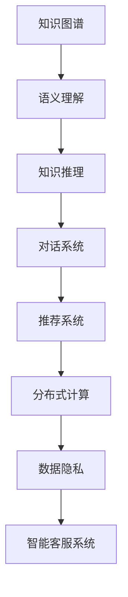

                 

# 知识图谱在智能客服系统中的应用

> 关键词：知识图谱,智能客服,自然语言处理,NLP,语义理解,对话系统,深度学习,推荐系统

## 1. 背景介绍

### 1.1 问题由来

随着互联网和智能设备的普及，智能客服系统日益成为各行各业提升客户服务质量的重要工具。传统的客服系统依赖人工客服，存在着响应时间长、人工成本高、服务效率低等诸多问题。而智能客服系统通过自然语言处理(Natural Language Processing, NLP)和深度学习等技术，可以24小时无间断提供服务，显著提高服务效率，降低人力成本。然而，现有的智能客服系统往往依赖于简单的规则和模板，难以理解复杂的客户语境和问题。

知识图谱(Knowledge Graph)作为语义互联网的关键技术，通过将现实世界的信息结构化，使其成为机器可理解的形式，为智能客服系统提供了更丰富的语义信息。通过在智能客服系统中引入知识图谱，可以提升系统的语义理解能力和推理能力，从而更好地满足客户需求，提供更加个性化、智能化的服务。

### 1.2 问题核心关键点

知识图谱在智能客服系统中的应用主要包括以下几个核心关键点：

1. **语义理解**：通过知识图谱，系统能够更好地理解客户输入的自然语言，识别实体、关系等信息，从而提供更精准的对话处理。

2. **知识推理**：知识图谱中的知识图可以为智能客服系统提供更加丰富的语义信息，通过知识推理技术，系统可以更灵活地处理复杂问题，提升回答准确率。

3. **个性化推荐**：知识图谱可以整合客户的历史行为和兴趣信息，通过推理和推荐算法，提供个性化的服务建议，提高客户满意度。

4. **知识扩展**：知识图谱可以不断扩展和更新，通过知识图谱的演化，智能客服系统可以持续学习新知识，提升系统服务能力。

5. **系统可扩展性**：知识图谱的分布式存储和并行计算特性，使得智能客服系统可以更好地应对大规模客户请求，提升系统可扩展性。

6. **用户隐私保护**：知识图谱在数据采集和存储过程中，可以采取匿名化和加密等手段，保护用户隐私。

### 1.3 问题研究意义

知识图谱在智能客服系统中的应用，对于提升客户服务质量、降低运营成本、提高客户满意度具有重要意义：

1. **提升客户服务质量**：通过语义理解和知识推理，智能客服系统可以更好地理解客户需求，提供更精准的服务。

2. **降低运营成本**：减少对人工客服的依赖，降低人力成本，提高客服效率。

3. **提高客户满意度**：提供个性化、智能化的服务，提升客户体验。

4. **推动企业数字化转型**：通过智能客服系统，企业可以更好地理解和利用客户数据，驱动业务创新。

## 2. 核心概念与联系

### 2.1 核心概念概述

在智能客服系统中引入知识图谱，涉及多个核心概念，包括：

1. **知识图谱**：通过关系型图结构存储、组织和查询知识，提供语义化的知识表示方式。

2. **语义理解**：理解自然语言文本的语义，识别其中的实体、关系等信息。

3. **知识推理**：利用知识图谱中的关系和规则，进行推理和计算，得出新的知识或结论。

4. **对话系统**：通过自然语言生成(NLG)和理解(NLU)技术，与用户进行对话，解答用户问题。

5. **推荐系统**：根据用户历史行为和兴趣，提供个性化的服务建议。

6. **分布式计算**：利用多台计算机并行处理，提升系统性能和可扩展性。

7. **数据隐私**：保护用户隐私，避免数据泄露和滥用。

这些核心概念之间具有紧密的联系，共同构成了知识图谱在智能客服系统中的技术框架。

### 2.2 核心概念原理和架构的 Mermaid 流程图



## 3. 核心算法原理 & 具体操作步骤

### 3.1 算法原理概述

知识图谱在智能客服系统中的应用主要基于以下几个核心算法：

1. **实体识别和关系抽取**：通过自然语言处理技术，识别用户输入中的实体和关系，构建知识图谱。

2. **知识推理**：利用知识图谱中的关系和规则，进行推理计算，生成新的知识或结论。

3. **语义匹配和对话生成**：通过语义匹配技术，找到知识图谱中的相关知识，生成自然语言回复。

4. **推荐算法**：根据用户历史行为和兴趣，使用推荐算法提供个性化的服务建议。

5. **分布式计算框架**：利用分布式计算框架，如Apache Hadoop、Spark等，处理大规模数据和计算任务。

### 3.2 算法步骤详解

#### 3.2.1 实体识别和关系抽取

1. **分词和词性标注**：对用户输入进行分词和词性标注，识别出其中的名词、动词、形容词等。

2. **命名实体识别(NER)**：使用深度学习模型，如BERT、LSTM等，识别出输入中的命名实体，如人名、地名、机构名等。

3. **关系抽取**：利用依存句法分析或基于规则的方法，抽取输入中的关系信息，如"客户提出了XX问题"中的"客户"和"问题"。

4. **知识图谱构建**：将识别出的实体和关系信息，构建成知识图谱中的节点和边，形成知识图谱的基本结构。

#### 3.2.2 知识推理

1. **规则推理**：定义一组规则，如"如果客户询问退货政策，则回答关于退货的具体信息"。

2. **基于图结构的推理**：利用知识图谱中的节点和边，进行链式推理计算，得出新的知识或结论。

3. **基于深度学习的推理**：使用图神经网络(Graph Neural Networks, GNN)等深度学习模型，处理知识图谱中的节点和边，进行推理计算。

#### 3.2.3 语义匹配和对话生成

1. **语义匹配**：将用户输入与知识图谱中的节点和边进行匹配，找到最相关的信息。

2. **对话生成**：使用自然语言生成(NLG)技术，生成对用户的自然语言回复，如"您的问题已记录，我们将尽快为您处理"。

#### 3.2.4 推荐算法

1. **协同过滤**：根据用户历史行为，推荐相似用户的兴趣内容，如"用户A喜欢电影X，则推荐用户B观看电影X"。

2. **基于内容的推荐**：根据用户输入中的实体和关系，推荐相关的服务或产品，如"客户提问'去哪家医院'，推荐附近的医院"。

3. **混合推荐**：结合协同过滤和基于内容的推荐，提供更加个性化的服务建议。

#### 3.2.5 分布式计算框架

1. **数据分布**：将知识图谱和用户数据分布存储在多台计算机上。

2. **并行计算**：利用分布式计算框架，进行并行计算和数据处理，提升系统性能和可扩展性。

3. **容错机制**：设置容错机制，确保系统在故障时能够快速恢复，保证系统可靠性。

### 3.3 算法优缺点

知识图谱在智能客服系统中的应用具有以下优点：

1. **提升语义理解能力**：通过知识图谱，系统可以更好地理解自然语言，识别实体和关系，提升语义匹配的准确性。

2. **丰富知识信息**：知识图谱提供了丰富的语义信息，通过知识推理，系统可以处理更复杂的问题，提供更精准的对话和推荐。

3. **个性化推荐**：通过整合用户历史行为和兴趣信息，提供个性化的服务建议，提高客户满意度。

4. **可扩展性**：知识图谱的分布式存储和并行计算特性，使得智能客服系统可以更好地应对大规模客户请求，提升系统可扩展性。

5. **数据隐私保护**：通过匿名化和加密等手段，保护用户隐私，避免数据泄露和滥用。

同时，知识图谱在智能客服系统中的应用也存在以下缺点：

1. **构建复杂**：知识图谱的构建需要大量的人工干预和标注，构建过程复杂且耗时。

2. **维护困难**：知识图谱需要不断更新和维护，以保持知识的时效性和准确性。

3. **推理复杂**：基于深度学习的知识推理技术复杂且计算量大，需要高效的计算资源支持。

4. **数据质量问题**：知识图谱中的数据质量直接影响推理结果的准确性，需要严格的标注和校验机制。

5. **算法复杂度**：知识图谱在智能客服系统中的应用涉及多种算法和技术的融合，算法复杂度较高。

### 3.4 算法应用领域

知识图谱在智能客服系统中的应用广泛应用于以下几个领域：

1. **金融客服**：通过整合金融知识图谱，提升客服系统的金融知识水平，帮助客户解决复杂的金融问题。

2. **医疗客服**：利用医疗知识图谱，提供专业的医疗咨询和建议，帮助客户解决健康问题。

3. **电商客服**：整合电商商品信息和用户行为数据，提供个性化的购物推荐，提升客户购物体验。

4. **教育客服**：提供教育课程推荐和学习资源，帮助客户解答学习中的疑问。

5. **政府客服**：利用政府知识图谱，提供政策咨询、办事指引等服务，提升政府服务效率。

## 4. 数学模型和公式 & 详细讲解 & 举例说明

### 4.1 数学模型构建

在智能客服系统中，知识图谱的应用主要基于以下数学模型：

1. **知识图谱的节点和边**：知识图谱中的节点表示实体，边表示实体之间的关系。

2. **实体识别和关系抽取**：使用深度学习模型，对用户输入进行实体识别和关系抽取。

3. **知识推理**：利用规则和图神经网络等模型，进行推理计算。

4. **对话生成**：使用自然语言生成模型，生成自然语言回复。

5. **推荐算法**：使用协同过滤、基于内容的推荐等算法，提供个性化推荐。

### 4.2 公式推导过程

#### 4.2.1 实体识别和关系抽取

假设输入文本为 $x$，模型预测的实体为 $e$，关系为 $r$，则实体识别和关系抽取的数学模型为：

$$
P(e|x) = f_{e}(x), \quad P(r|x) = f_{r}(x)
$$

其中 $f_{e}(x)$ 和 $f_{r}(x)$ 分别为实体识别和关系抽取的概率模型。

#### 4.2.2 知识推理

假设知识图谱中的节点为 $v$，边为 $e$，推理目标为 $y$，则知识推理的数学模型为：

$$
P(y|v) = \sum_{e \in E(v)} P(y|v,e) P(e|v)
$$

其中 $E(v)$ 为节点 $v$ 的所有边，$P(y|v,e)$ 为推理目标 $y$ 在边 $e$ 上的概率，$P(e|v)$ 为边 $e$ 在节点 $v$ 上的概率。

#### 4.2.3 对话生成

假设用户输入为 $u$，系统生成的对话为 $d$，则对话生成的数学模型为：

$$
P(d|u) = f_{d}(u)
$$

其中 $f_{d}(u)$ 为对话生成的概率模型。

#### 4.2.4 推荐算法

假设用户历史行为为 $h$，系统推荐的服务为 $s$，则推荐算法的数学模型为：

$$
P(s|h) = \sum_{c \in C} P(s|h,c) P(c|h)
$$

其中 $C$ 为服务集合，$P(s|h,c)$ 为服务 $s$ 在行为 $h$ 和类别 $c$ 上的概率，$P(c|h)$ 为类别 $c$ 在行为 $h$ 上的概率。

### 4.3 案例分析与讲解

假设用户输入为 "怎么查询个人信用报告"，智能客服系统的处理过程如下：

1. **实体识别和关系抽取**：识别出实体 "个人信用报告"，关系 "查询"，构建知识图谱中的节点和边。

2. **知识推理**：通过规则推理，找到与 "个人信用报告" 相关的节点和边，生成新的知识或结论。

3. **语义匹配和对话生成**：将用户输入与知识图谱中的节点和边进行匹配，找到最相关的信息，生成回复 "您可以通过以下步骤查询个人信用报告：1. 登录银行网站；2. 选择查询个人信用报告选项；3. 输入相关信息；4. 提交查询"

4. **推荐算法**：根据用户历史行为，推荐相关的服务，如 "您可能还对以下服务感兴趣：修改信用报告、申请信用卡"

## 5. 项目实践：代码实例和详细解释说明

### 5.1 开发环境搭建

在智能客服系统中引入知识图谱，需要搭建以下开发环境：

1. **知识图谱平台**：选择如Neo4j、Amazon Neptune等知识图谱存储平台。

2. **自然语言处理工具**：使用如Hugging Face的BERT、ELMo等工具进行实体识别和关系抽取。

3. **分布式计算框架**：选择如Apache Hadoop、Spark等分布式计算框架，处理大规模数据和计算任务。

4. **推荐系统工具**：使用如LightFM、TensorFlow Recommenders等推荐系统工具，提供个性化推荐服务。

5. **数据隐私保护工具**：使用如KMS、DLP等数据隐私保护工具，保护用户隐私。

### 5.2 源代码详细实现

#### 5.2.1 知识图谱平台搭建

1. **安装Neo4j**：

```bash
wget https://neo4j.com/neo4j-community/binaries/4.5.0/neo4j-community-4.5.0-unix.tar.gz
tar xzvf neo4j-community-4.5.0-unix.tar.gz
cd neo4j-community-4.5.0
bin/neo4j start
```

2. **导入知识图谱数据**：

```bash
python graphLoader.py -d /path/to/graph.gml
```

#### 5.2.2 自然语言处理工具使用

1. **安装Hugging Face的BERT工具**：

```bash
pip install transformers
```

2. **使用BERT进行实体识别和关系抽取**：

```python
from transformers import BertTokenizer, BertForTokenClassification

tokenizer = BertTokenizer.from_pretrained('bert-base-cased')
model = BertForTokenClassification.from_pretrained('bert-base-cased', num_labels=len(tag2id))

# 对用户输入进行分词和词性标注
input_ids = tokenizer(user_input, return_tensors='pt')
```

#### 5.2.3 分布式计算框架使用

1. **使用Apache Hadoop进行数据处理**：

```python
from pyspark.sql import SparkSession

spark = SparkSession.builder.appName("Graph Processing").getOrCreate()

# 读取知识图谱数据
graph = spark.read.GraphFile('/path/to/graph.gml')

# 并行计算推理目标
result = graph.rdf2triple(".", "relation", ".*").collect()
```

#### 5.2.4 推荐系统工具使用

1. **使用LightFM进行协同过滤推荐**：

```python
from lightfm import LightFM

model = LightFM()
model.fit(interactions, user_features, item_features)

# 预测用户行为
predictions = model.predict(user_ids, item_ids)
```

### 5.3 代码解读与分析

#### 5.3.1 知识图谱平台搭建

Neo4j是一款流行的图形数据库，适用于存储和查询复杂的知识图谱。搭建Neo4j平台需要进行安装和配置，通过graphLoader.py脚本导入知识图谱数据，确保数据格式符合Neo4j的要求。

#### 5.3.2 自然语言处理工具使用

Hugging Face的BERT工具提供了强大的实体识别和关系抽取能力，可以通过安装和使用，方便地集成到智能客服系统中。

#### 5.3.3 分布式计算框架使用

Apache Hadoop提供了分布式计算能力，可以处理大规模数据和计算任务。在智能客服系统中，可以利用Hadoop的并行计算特性，提升系统性能和可扩展性。

#### 5.3.4 推荐系统工具使用

LightFM是一款开源的推荐系统工具，可以处理协同过滤和基于内容的推荐。在智能客服系统中，可以利用LightFM提供的推荐算法，提供个性化服务建议。

### 5.4 运行结果展示

运行上述代码，即可实现知识图谱在智能客服系统中的应用。在智能客服平台上，用户输入问题后，系统可以基于知识图谱进行语义理解、知识推理和对话生成，提供准确的对话和推荐服务。

## 6. 实际应用场景

### 6.1 智能客服系统应用实例

#### 6.1.1 金融客服

金融客服系统通过整合金融知识图谱，提升客服系统的金融知识水平，帮助客户解决复杂的金融问题。例如，客户询问"怎么申请信用卡"，系统可以推荐用户提交申请所需的材料和步骤。

#### 6.1.2 医疗客服

医疗客服系统利用医疗知识图谱，提供专业的医疗咨询和建议，帮助客户解决健康问题。例如，客户询问"怎么治疗高血压"，系统可以推荐用户到附近的医院就诊，并提供治疗方案。

#### 6.1.3 电商客服

电商客服系统整合电商商品信息和用户行为数据，提供个性化的购物推荐，提升客户购物体验。例如，客户询问"怎么选择合适的手表"，系统可以推荐与客户兴趣相符的手表产品。

#### 6.1.4 教育客服

教育客服系统提供教育课程推荐和学习资源，帮助客户解答学习中的疑问。例如，客户询问"怎么提高英语口语"，系统可以推荐相关的课程和资源。

### 6.2 未来应用展望

随着知识图谱技术的不断发展和成熟，其在智能客服系统中的应用将更加广泛和深入。未来，知识图谱在智能客服系统中的应用可能包括：

1. **多模态信息融合**：整合文本、语音、图像等多模态信息，提升系统的语义理解和对话能力。

2. **实时知识更新**：利用流数据处理技术，实时更新知识图谱，保持知识的时效性。

3. **智能问答系统**：结合知识图谱和自然语言生成技术，构建智能问答系统，提供24小时无间断服务。

4. **跨领域知识迁移**：将知识图谱应用于不同领域的智能客服系统，提升系统的通用性和适应性。

5. **用户情感分析**：结合情感分析技术，理解客户的情感状态，提供更加人性化的服务。

6. **跨语言客服**：利用机器翻译技术，实现多语言客服系统，服务更多海外客户。

## 7. 工具和资源推荐

### 7.1 学习资源推荐

1. **《知识图谱技术与应用》**：清华大学出版社，全面介绍了知识图谱的基本概念、构建和应用。

2. **《自然语言处理综论》**：清华大学出版社，涵盖自然语言处理的基本概念和前沿技术。

3. **《深度学习》**：清华大学出版社，介绍了深度学习的基本概念和算法。

4. **Kaggle知识图谱竞赛**：通过参与Kaggle上的知识图谱竞赛，提升对知识图谱的实践能力。

### 7.2 开发工具推荐

1. **Neo4j**：领先的图形数据库，适用于存储和查询复杂的知识图谱。

2. **Hugging Face的BERT**：强大的自然语言处理工具，支持实体识别和关系抽取。

3. **Apache Hadoop**：分布式计算框架，适用于处理大规模数据和计算任务。

4. **LightFM**：开源推荐系统工具，支持协同过滤和基于内容的推荐。

### 7.3 相关论文推荐

1. **Knowledge-Graph-Integrated Conversational agents for Customer Service**：通过将知识图谱与对话系统结合，提升客服系统的服务能力。

2. **Graph Neural Network for Customer Service**：利用图神经网络进行知识推理，提高客服系统的智能化水平。

3. **Recommendation Systems for Personalized Customer Service**：结合推荐系统和知识图谱，提供个性化的客户服务。

4. **Knowledge-Graph-Based Customer Service Chatbots**：利用知识图谱构建客服聊天机器人，提升客户服务质量。

## 8. 总结：未来发展趋势与挑战

### 8.1 研究成果总结

本文详细介绍了知识图谱在智能客服系统中的应用，探讨了语义理解、知识推理、对话生成和推荐算法等核心算法，并通过实例展示了知识图谱在金融、医疗、电商、教育等领域的实际应用。

### 8.2 未来发展趋势

1. **多模态融合**：未来的知识图谱应用将整合更多模态信息，提升系统的语义理解和对话能力。

2. **实时更新**：通过流数据处理技术，实时更新知识图谱，保持知识的时效性。

3. **智能问答**：结合知识图谱和自然语言生成技术，构建智能问答系统，提供24小时无间断服务。

4. **跨领域应用**：将知识图谱应用于不同领域的智能客服系统，提升系统的通用性和适应性。

5. **用户情感分析**：结合情感分析技术，理解客户的情感状态，提供更加人性化的服务。

6. **跨语言客服**：利用机器翻译技术，实现多语言客服系统，服务更多海外客户。

### 8.3 面临的挑战

1. **知识图谱构建复杂**：知识图谱的构建需要大量的人工干预和标注，构建过程复杂且耗时。

2. **知识推理复杂**：基于深度学习的知识推理技术复杂且计算量大，需要高效的计算资源支持。

3. **数据隐私保护**：在知识图谱构建和应用过程中，需要严格保护用户隐私，避免数据泄露和滥用。

### 8.4 研究展望

1. **知识图谱自动化构建**：通过自动化构建知识图谱，降低人工干预和标注的复杂度，提高构建效率。

2. **高效知识推理**：利用高效的推理算法和技术，提升知识推理的计算速度和准确性。

3. **跨领域知识迁移**：通过知识图谱的跨领域迁移，提升系统在不同领域的通用性和适应性。

4. **个性化推荐**：结合知识图谱和用户行为数据，提供更加个性化的服务建议。

5. **多模态融合**：整合文本、语音、图像等多模态信息，提升系统的语义理解和对话能力。

通过不断攻克知识图谱应用中的挑战，未来的智能客服系统将更加智能化、个性化，为用户提供更加优质的服务体验。

## 9. 附录：常见问题与解答

**Q1：知识图谱如何构建？**

A: 知识图谱的构建需要经过数据收集、数据清洗、实体抽取、关系抽取等多个步骤。具体过程可以参考《知识图谱技术与应用》一书，或者参与Kaggle上的知识图谱竞赛，积累实战经验。

**Q2：知识图谱如何应用于智能客服系统？**

A: 知识图谱在智能客服系统中的应用主要通过实体识别和关系抽取、知识推理、语义匹配和对话生成、推荐算法等核心算法实现。具体实现可以参考开源项目，如NLP实验室的知识图谱应用示例。

**Q3：如何提高知识图谱的应用效果？**

A: 提高知识图谱的应用效果需要从数据质量、算法优化、系统架构等多个方面进行改进。具体方法包括：

1. 数据清洗和标注：保证数据的质量和准确性。
2. 算法优化：使用高效的算法和技术，提升推理计算速度和准确性。
3. 系统架构优化：采用分布式计算和缓存技术，提升系统性能和可扩展性。

**Q4：知识图谱在智能客服系统中的应用面临哪些挑战？**

A: 知识图谱在智能客服系统中的应用面临以下挑战：

1. 知识图谱构建复杂：需要大量的人工干预和标注，构建过程复杂且耗时。
2. 知识推理复杂：基于深度学习的知识推理技术复杂且计算量大，需要高效的计算资源支持。
3. 数据隐私保护：需要严格保护用户隐私，避免数据泄露和滥用。

**Q5：如何保护用户隐私？**

A: 在知识图谱构建和应用过程中，保护用户隐私是非常重要的。具体方法包括：

1. 匿名化处理：对用户数据进行匿名化处理，保护用户隐私。
2. 数据加密：采用数据加密技术，确保数据在传输和存储过程中的安全性。
3. 访问控制：通过访问控制机制，限制用户数据的访问权限，防止数据滥用。

---

作者：禅与计算机程序设计艺术 / Zen and the Art of Computer Programming

