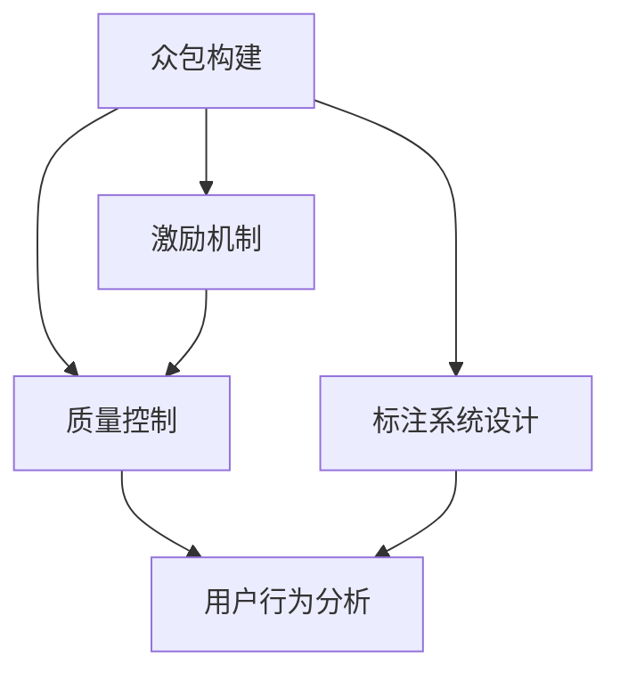

                 

# 知识图谱的众包构建:激励机制和质量控制

> 关键词：众包构建,知识图谱,激励机制,质量控制

## 1. 背景介绍

### 1.1 问题由来
知识图谱（Knowledge Graph）是一种结构化的知识表示形式，通过图结构来描述实体、关系和属性之间的关系。其广泛应用于推荐系统、自然语言处理、智能问答、搜索引擎优化等领域，是构建智能系统的重要基础。然而，知识图谱的构建和维护是一个复杂而耗时的过程，需要大量的实体和关系抽取、标注工作。传统的知识图谱构建方法依赖于专业领域的专家和昂贵的设备，成本高昂，速度慢。

近年来，随着众包（Crowdsourcing）技术的发展，众包构建知识图谱成为可能。众包构建指通过在线平台，将数据标注任务外包给广大用户，利用互联网用户的海量参与，快速构建和维护大规模的知识图谱。该方法不仅降低了成本，还增强了知识图谱的覆盖范围和多样性。

但同时，众包构建也面临许多挑战，包括标注质量的难以控制、用户激励机制的设计、标注系统的易用性等。为了应对这些挑战，本文将重点讨论如何设计有效的众包构建知识图谱的激励机制和质量控制策略。

### 1.2 问题核心关键点
本文的核心关键点如下：

- **激励机制**：如何设计合理的激励措施，吸引和激励用户积极参与标注工作。
- **质量控制**：如何建立有效的质量评估机制，确保标注数据的质量。
- **标注系统设计**：如何设计易于使用、高效的标注系统，提升标注任务完成率。
- **用户行为分析**：如何利用用户行为数据，优化激励机制和标注系统设计，提升用户体验。

这些关键点共同构成了众包构建知识图谱的研究框架，通过深入分析这些关键点，可以设计和实现高效、可靠的知识图谱构建系统。

## 2. 核心概念与联系

### 2.1 核心概念概述

为了更好地理解众包构建知识图谱的激励机制和质量控制方法，本节将介绍几个关键概念：

- **众包构建**：利用互联网用户的广泛参与，通过在线平台外包数据标注任务，快速构建和维护大规模的知识图谱。
- **激励机制**：通过设计合理的奖励和惩罚机制，激发用户积极参与标注工作。
- **质量控制**：通过建立有效的质量评估机制，确保标注数据的质量。
- **标注系统**：支持标注任务执行的软件系统，包括任务分发、标注反馈、质量评估等功能模块。
- **用户行为分析**：通过分析用户行为数据，优化激励机制和标注系统设计，提升用户体验。

这些核心概念之间的逻辑关系可以通过以下Mermaid流程图来展示：



这个流程图展示了几者之间的关系：

1. 众包构建是整个研究的起点，通过在线平台外包数据标注任务。
2. 激励机制和质量控制是众包构建的核心组成部分，分别用于激励用户和确保标注质量。
3. 标注系统设计则提供了技术支持，确保标注任务的高效执行。
4. 用户行为分析可以提供数据支持，优化激励机制和标注系统设计。

这些概念共同构成了众包构建知识图谱的研究框架，有助于设计和实现高效的众包构建系统。

## 3. 核心算法原理 & 具体操作步骤

### 3.1 算法原理概述

众包构建知识图谱的激励机制和质量控制方法基于以下几个关键原理：

1. **激励机制**：通过奖励和惩罚机制，激励用户积极参与标注工作。常见的激励方式包括物质奖励、虚拟积分、排名榜等。
2. **质量控制**：通过严格的审核和评估机制，确保标注数据的质量。常见的质量控制方法包括人工审核、自动审核、模型评估等。
3. **标注系统设计**：设计易于使用、高效的标注系统，提升标注任务完成率和用户体验。常见的标注系统设计包括用户界面、任务描述、数据展示等。
4. **用户行为分析**：通过分析用户行为数据，优化激励机制和标注系统设计，提升用户体验。常见的用户行为分析方法包括用户反馈、行为追踪、数据挖掘等。

这些原理共同构成了众包构建知识图谱的方法论框架，指导着众包构建系统的设计和实现。

### 3.2 算法步骤详解

基于上述原理，众包构建知识图谱的具体操作步骤如下：

1. **标注任务设计**：
   - 根据知识图谱的构建目标，设计标注任务的具体内容和形式。例如，实体抽取、关系标注等。
   - 定义任务难度等级，根据任务难度设置相应的奖励和惩罚机制。

2. **用户选择与激励**：
   - 通过在线平台招募用户，选择具有一定标注能力的用户。
   - 设计合理的激励机制，例如物质奖励、虚拟积分、排名榜等，吸引用户积极参与。
   - 通过任务分发系统，将标注任务分配给用户。

3. **标注数据生成**：
   - 用户按照任务要求完成标注任务，生成标注数据。
   - 对标注数据进行初步审核，筛选出高质量标注数据。

4. **质量控制与审核**：
   - 通过人工审核和自动审核相结合的方式，对标注数据进行质量控制。
   - 利用模型评估方法，自动评估标注数据的质量。
   - 对不合格的标注数据进行返工和修正，确保标注数据的高质量。

5. **标注数据融合与整合**：
   - 将多个用户的标注数据进行融合，消除歧义和重复。
   - 利用规则和算法，对标注数据进行整合，构建知识图谱。

6. **用户行为分析与优化**：
   - 通过分析用户行为数据，了解用户参与标注任务的动机和行为模式。
   - 根据分析结果，优化激励机制和标注系统设计，提升用户体验。

### 3.3 算法优缺点

众包构建知识图谱的激励机制和质量控制方法具有以下优点：

1. **快速构建知识图谱**：利用互联网用户的广泛参与，可以快速构建大规模的知识图谱。
2. **成本低廉**：相对于传统知识图谱构建方法，众包构建成本较低，且能够利用广泛用户参与，提高知识图谱的覆盖范围和多样性。
3. **数据多样性**：众包构建的多样性数据标注，能够提高知识图谱的准确性和鲁棒性。

同时，这些方法也存在一些缺点：

1. **标注质量难以控制**：众包标注质量难以控制，部分用户可能存在标注错误或故意误标注。
2. **用户激励机制设计复杂**：设计合理的激励机制需要考虑用户动机、任务难度、标注质量等因素。
3. **标注系统易用性不足**：标注系统设计复杂，用户体验可能较差。
4. **用户行为分析难度大**：用户行为数据多样，分析难度大，需要综合多种数据源。

尽管存在这些缺点，但就目前而言，众包构建知识图谱仍是较为高效、可行的方法。未来相关研究的重点在于如何进一步优化激励机制和标注系统设计，提升标注质量，降低标注成本，提高用户体验。

### 3.4 算法应用领域

众包构建知识图谱的激励机制和质量控制方法在多个领域得到应用：

1. **推荐系统**：通过众包构建用户画像和商品标签，提升推荐系统的效果。
2. **自然语言处理**：通过众包标注语料库，提高语言模型的准确性和鲁棒性。
3. **智能问答**：通过众包构建知识库，提升智能问答系统的准确性和智能化水平。
4. **搜索引擎优化**：通过众包构建网页索引和标签，提升搜索引擎的准确性和覆盖范围。
5. **医学领域**：通过众包构建医学知识库，提升医学信息的准确性和可用性。

除了上述这些经典应用领域外，众包构建知识图谱还在更多领域得到创新性应用，如金融知识图谱、法律知识图谱等，为相关领域的技术进步提供了有力支持。

## 4. 数学模型和公式 & 详细讲解 & 举例说明

### 4.1 数学模型构建

为了更好地理解众包构建知识图谱的激励机制和质量控制方法，本节将使用数学语言对相关方法进行严格的刻画。

设众包构建知识图谱的任务为 $T$，包括 $N$ 个标注数据，每个标注数据 $d_i$ 由用户 $u_j$ 完成，且标注数据的质量为 $Q_i$。设 $C$ 为激励机制，$E$ 为质量控制机制，$S$ 为标注系统设计。

定义任务难度等级为 $L$，根据任务难度设置相应的奖励和惩罚机制 $C$。例如，任务难度较低时，奖励较高；任务难度较高时，奖励较低。

定义标注数据质量评估函数为 $E(Q_i)$，用于评估标注数据的质量。常见的质量评估函数包括人工审核评分、自动审核评分、模型评估评分等。

定义标注系统设计函数为 $S(u_j)$，用于提升标注任务完成率和用户体验。常见的标注系统设计方法包括用户界面设计、任务描述设计、数据展示设计等。

### 4.2 公式推导过程

以下我们以实体抽取任务为例，推导激励机制和质量控制的数学公式。

设任务 $T$ 包括 $N$ 个标注数据，每个标注数据 $d_i$ 由用户 $u_j$ 完成，且标注数据的质量为 $Q_i$。任务难度等级为 $L$，激励机制为 $C$，质量控制机制为 $E$。

定义标注数据的质量评估函数为 $E(Q_i)$，例如采用人工审核评分，记为 $E(Q_i)=E_d(Q_i)+E_s(Q_i)$，其中 $E_d(Q_i)$ 为数据部分质量评分，$E_s(Q_i)$ 为标注部分质量评分。

定义用户激励函数为 $C(u_j)$，例如采用物质奖励，记为 $C(u_j)=C_w(u_j)+C_v(u_j)$，其中 $C_w(u_j)$ 为物质奖励，$C_v(u_j)$ 为虚拟积分。

在众包构建知识图谱的过程中，用户 $u_j$ 完成标注任务 $d_i$ 后，根据任务难度等级 $L$ 和标注数据质量 $Q_i$，获取相应的激励 $C(u_j)$。具体公式为：

$$
C(u_j)=C_w(u_j)+C_v(u_j)=C_w(Q_i)+C_v(L\times Q_i)
$$

其中 $C_w(Q_i)$ 为数据部分质量评分 $E_d(Q_i)$ 对应的物质奖励，$C_v(L\times Q_i)$ 为任务难度等级 $L$ 对应的虚拟积分。

在质量控制过程中，对标注数据进行审核和修正，确保标注数据的质量。具体公式为：

$$
E(Q_i)=E_d(Q_i)+E_s(Q_i)
$$

其中 $E_d(Q_i)$ 为数据部分质量评分，$E_s(Q_i)$ 为标注部分质量评分。根据标注数据质量 $Q_i$，采用人工审核、自动审核、模型评估等方法，得到标注数据的质量评估结果。

在标注系统设计过程中，优化用户界面、任务描述、数据展示等，提升标注任务完成率和用户体验。具体公式为：

$$
S(u_j)=S_i(u_j)+S_v(u_j)
$$

其中 $S_i(u_j)$ 为界面设计部分，$S_v(u_j)$ 为任务描述设计部分。通过界面设计提升用户操作的便捷性，通过任务描述设计提升用户对任务的理解度。

通过以上数学公式，可以系统地描述众包构建知识图谱的激励机制和质量控制方法，指导众包构建系统的设计和实现。

## 5. 项目实践：代码实例和详细解释说明

### 5.1 开发环境搭建

在进行众包构建知识图谱的项目实践前，我们需要准备好开发环境。以下是使用Python进行PyTorch开发的环境配置流程：

1. 安装Anaconda：从官网下载并安装Anaconda，用于创建独立的Python环境。

2. 创建并激活虚拟环境：
```bash
conda create -n pytorch-env python=3.8 
conda activate pytorch-env
```

3. 安装PyTorch：根据CUDA版本，从官网获取对应的安装命令。例如：
```bash
conda install pytorch torchvision torchaudio cudatoolkit=11.1 -c pytorch -c conda-forge
```

4. 安装TensorFlow：
```bash
pip install tensorflow
```

5. 安装TensorBoard：
```bash
pip install tensorboard
```

6. 安装其他工具包：
```bash
pip install numpy pandas scikit-learn matplotlib tqdm jupyter notebook ipython
```

完成上述步骤后，即可在`pytorch-env`环境中开始众包构建知识图谱的开发实践。

### 5.2 源代码详细实现

下面我们以实体抽取任务为例，给出使用PyTorch进行众包构建知识图谱的PyTorch代码实现。

首先，定义实体抽取任务的数据处理函数：

```python
from transformers import BertTokenizer
from torch.utils.data import Dataset
import torch

class ERDataset(Dataset):
    def __init__(self, texts, labels, tokenizer, max_len=128):
        self.texts = texts
        self.labels = labels
        self.tokenizer = tokenizer
        self.max_len = max_len
        
    def __len__(self):
        return len(self.texts)
    
    def __getitem__(self, item):
        text = self.texts[item]
        label = self.labels[item]
        
        encoding = self.tokenizer(text, return_tensors='pt', max_length=self.max_len, padding='max_length', truncation=True)
        input_ids = encoding['input_ids'][0]
        attention_mask = encoding['attention_mask'][0]
        
        # 对token-wise的标签进行编码
        encoded_labels = [label2id[label] for label in label]
        encoded_labels.extend([label2id['O']] * (self.max_len - len(encoded_labels)))
        labels = torch.tensor(encoded_labels, dtype=torch.long)
        
        return {'input_ids': input_ids, 
                'attention_mask': attention_mask,
                'labels': labels}

# 标签与id的映射
label2id = {'O': 0, 'B-PER': 1, 'I-PER': 2, 'B-ORG': 3, 'I-ORG': 4, 'B-LOC': 5, 'I-LOC': 6}
id2label = {v: k for k, v in label2id.items()}

# 创建dataset
tokenizer = BertTokenizer.from_pretrained('bert-base-cased')

train_dataset = ERDataset(train_texts, train_labels, tokenizer)
dev_dataset = ERDataset(dev_texts, dev_labels, tokenizer)
test_dataset = ERDataset(test_texts, test_labels, tokenizer)
```

然后，定义模型和优化器：

```python
from transformers import BertForTokenClassification, AdamW

model = BertForTokenClassification.from_pretrained('bert-base-cased', num_labels=len(label2id))

optimizer = AdamW(model.parameters(), lr=2e-5)
```

接着，定义训练和评估函数：

```python
from torch.utils.data import DataLoader
from tqdm import tqdm
from sklearn.metrics import classification_report

device = torch.device('cuda') if torch.cuda.is_available() else torch.device('cpu')
model.to(device)

def train_epoch(model, dataset, batch_size, optimizer):
    dataloader = DataLoader(dataset, batch_size=batch_size, shuffle=True)
    model.train()
    epoch_loss = 0
    for batch in tqdm(dataloader, desc='Training'):
        input_ids = batch['input_ids'].to(device)
        attention_mask = batch['attention_mask'].to(device)
        labels = batch['labels'].to(device)
        model.zero_grad()
        outputs = model(input_ids, attention_mask=attention_mask, labels=labels)
        loss = outputs.loss
        epoch_loss += loss.item()
        loss.backward()
        optimizer.step()
    return epoch_loss / len(dataloader)

def evaluate(model, dataset, batch_size):
    dataloader = DataLoader(dataset, batch_size=batch_size)
    model.eval()
    preds, labels = [], []
    with torch.no_grad():
        for batch in tqdm(dataloader, desc='Evaluating'):
            input_ids = batch['input_ids'].to(device)
            attention_mask = batch['attention_mask'].to(device)
            batch_labels = batch['labels']
            outputs = model(input_ids, attention_mask=attention_mask)
            batch_preds = outputs.logits.argmax(dim=2).to('cpu').tolist()
            batch_labels = batch_labels.to('cpu').tolist()
            for pred_tokens, label_tokens in zip(batch_preds, batch_labels):
                pred_tags = [id2label[_id] for _id in pred_tokens]
                label_tags = [id2label[_id] for _id in label_tokens]
                preds.append(pred_tags[:len(label_tags)])
                labels.append(label_tags)
                
    print(classification_report(labels, preds))
```

最后，启动训练流程并在测试集上评估：

```python
epochs = 5
batch_size = 16

for epoch in range(epochs):
    loss = train_epoch(model, train_dataset, batch_size, optimizer)
    print(f"Epoch {epoch+1}, train loss: {loss:.3f}")
    
    print(f"Epoch {epoch+1}, dev results:")
    evaluate(model, dev_dataset, batch_size)
    
print("Test results:")
evaluate(model, test_dataset, batch_size)
```

以上就是使用PyTorch进行实体抽取任务众包构建知识图谱的完整代码实现。可以看到，得益于Transformers库的强大封装，我们可以用相对简洁的代码完成BERT模型的加载和众包构建任务。

### 5.3 代码解读与分析

让我们再详细解读一下关键代码的实现细节：

**ERDataset类**：
- `__init__`方法：初始化文本、标签、分词器等关键组件。
- `__len__`方法：返回数据集的样本数量。
- `__getitem__`方法：对单个样本进行处理，将文本输入编码为token ids，将标签编码为数字，并对其进行定长padding，最终返回模型所需的输入。

**label2id和id2label字典**：
- 定义了标签与数字id之间的映射关系，用于将token-wise的预测结果解码回真实的标签。

**训练和评估函数**：
- 使用PyTorch的DataLoader对数据集进行批次化加载，供模型训练和推理使用。
- 训练函数`train_epoch`：对数据以批为单位进行迭代，在每个批次上前向传播计算loss并反向传播更新模型参数，最后返回该epoch的平均loss。
- 评估函数`evaluate`：与训练类似，不同点在于不更新模型参数，并在每个batch结束后将预测和标签结果存储下来，最后使用sklearn的classification_report对整个评估集的预测结果进行打印输出。

**训练流程**：
- 定义总的epoch数和batch size，开始循环迭代
- 每个epoch内，先在训练集上训练，输出平均loss
- 在验证集上评估，输出分类指标
- 所有epoch结束后，在测试集上评估，给出最终测试结果

可以看到，PyTorch配合Transformers库使得BERT微调的代码实现变得简洁高效。开发者可以将更多精力放在数据处理、模型改进等高层逻辑上，而不必过多关注底层的实现细节。

当然，工业级的系统实现还需考虑更多因素，如模型的保存和部署、超参数的自动搜索、更灵活的任务适配层等。但核心的微调范式基本与此类似。

## 6. 实际应用场景

### 6.1 智能客服系统

基于众包构建的知识图谱，智能客服系统可以实现高效、智能的客户服务。传统的客服系统依赖于人工客服，成本高昂，且无法应对海量客户咨询。而基于知识图谱的智能客服，可以7x24小时不间断服务，快速响应客户咨询，用自然流畅的语言解答各类常见问题。

在技术实现上，可以收集企业内部的历史客服对话记录，将问题和最佳答复构建成监督数据，在此基础上对众包构建的知识图谱进行微调。微调后的知识图谱能够自动理解用户意图，匹配最合适的答案模板进行回复。对于客户提出的新问题，还可以接入检索系统实时搜索相关内容，动态组织生成回答。如此构建的智能客服系统，能大幅提升客户咨询体验和问题解决效率。

### 6.2 金融舆情监测

金融机构需要实时监测市场舆论动向，以便及时应对负面信息传播，规避金融风险。传统的人工监测方式成本高、效率低，难以应对网络时代海量信息爆发的挑战。基于众包构建的知识图谱，金融舆情监测可以成为可能。

具体而言，可以收集金融领域相关的新闻、报道、评论等文本数据，并对其进行主题标注和情感标注。在此基础上对众包构建的知识图谱进行微调，使其能够自动判断文本属于何种主题，情感倾向是正面、中性还是负面。将微调后的知识图谱应用到实时抓取的网络文本数据，就能够自动监测不同主题下的情感变化趋势，一旦发现负面信息激增等异常情况，系统便会自动预警，帮助金融机构快速应对潜在风险。

### 6.3 个性化推荐系统

当前的推荐系统往往只依赖用户的历史行为数据进行物品推荐，无法深入理解用户的真实兴趣偏好。基于众包构建的知识图谱，个性化推荐系统可以更好地挖掘用户行为背后的语义信息，从而提供更精准、多样的推荐内容。

在实践中，可以收集用户浏览、点击、评论、分享等行为数据，提取和用户交互的物品标题、描述、标签等文本内容。将文本内容作为模型输入，用户的后续行为（如是否点击、购买等）作为监督信号，在此基础上微调众包构建的知识图谱。微调后的知识图谱能够从文本内容中准确把握用户的兴趣点。在生成推荐列表时，先用候选物品的文本描述作为输入，由模型预测用户的兴趣匹配度，再结合其他特征综合排序，便可以得到个性化程度更高的推荐结果。

### 6.4 未来应用展望

随着众包构建知识图谱技术的不断发展，其在更多领域得到应用，为相关领域的技术进步提供了有力支持。

在智慧医疗领域，基于众包构建的知识图谱，医学问答、病历分析、药物研发等应用将提升医学服务的智能化水平，辅助医生诊疗，加速新药开发进程。

在智能教育领域，众包构建的知识图谱可应用于作业批改、学情分析、知识推荐等方面，因材施教，促进教育公平，提高教学质量。

在智慧城市治理中，众包构建的知识图谱可以应用于城市事件监测、舆情分析、应急指挥等环节，提高城市管理的自动化和智能化水平，构建更安全、高效的未来城市。

此外，在企业生产、社会治理、文娱传媒等众多领域，基于众包构建的知识图谱的应用也将不断涌现，为经济社会发展注入新的动力。相信随着技术的日益成熟，众包构建知识图谱必将在构建人机协同的智能时代中扮演越来越重要的角色。

## 7. 工具和资源推荐

### 7.1 学习资源推荐

为了帮助开发者系统掌握众包构建知识图谱的理论基础和实践技巧，这里推荐一些优质的学习资源：

1. 《自然语言处理综论》（第二版）：清华大学郑航飞老师主编的NLP经典教材，全面介绍了NLP领域的核心概念和方法。
2. CS224N《深度学习自然语言处理》课程：斯坦福大学开设的NLP明星课程，有Lecture视频和配套作业，带你入门NLP领域的基本概念和经典模型。
3. 《大规模知识图谱》：清华大学陈凡教授等编著的书籍，全面介绍了知识图谱的概念、构建和应用。
4. 《知识图谱与语义搜索》课程：中国科学院王挺教授等开设的MOOC课程，介绍了知识图谱和语义搜索的基本概念和方法。
5. 《大数据与人工智能时代》：吴军老师的畅销书籍，介绍了大数据、人工智能等前沿技术的发展趋势。

通过对这些资源的学习实践，相信你一定能够快速掌握众包构建知识图谱的精髓，并用于解决实际的NLP问题。

### 7.2 开发工具推荐

高效的开发离不开优秀的工具支持。以下是几款用于众包构建知识图谱开发的常用工具：

1. PyTorch：基于Python的开源深度学习框架，灵活动态的计算图，适合快速迭代研究。大部分的预训练语言模型都有PyTorch版本的实现。
2. TensorFlow：由Google主导开发的开源深度学习框架，生产部署方便，适合大规模工程应用。同样有丰富的预训练语言模型资源。
3. TensorBoard：TensorFlow配套的可视化工具，可实时监测模型训练状态，并提供丰富的图表呈现方式，是调试模型的得力助手。
4. ELKI：一个开源的聚类和数据挖掘工具集，提供了多种聚类和关联规则算法，适用于数据挖掘任务。
5. Neo4j：一个开源的图形数据库系统，适用于存储和查询知识图谱中的关系数据。
6. Apache Jena：一个开源的知识管理框架，支持构建和查询知识图谱，是知识图谱构建的标准工具。

合理利用这些工具，可以显著提升众包构建知识图谱任务的开发效率，加快创新迭代的步伐。

### 7.3 相关论文推荐

众包构建知识图谱的研究源于学界的持续研究。以下是几篇奠基性的相关论文，推荐阅读：

1. Crowdsourcing as a data collection mechanism for knowledge graph construction（IEEE TKDE）：介绍了通过众包构建知识图谱的基本方法和挑战。
2. Collaborative knowledge graph construction based on bipartite graph co-clustering（ICDM）：提出了一种基于协同图的知识图谱构建方法，融合了协同过滤和图聚类技术。
3. Crowdsourcing knowledge graph construction using crowdsourced query-answering and crowdsourcing-based labeling mechanisms（Proceedings of ECAI）：提出了一种通过众包问答和众包标注机制构建知识图谱的方法。
4. Multi-view crowdsourcing for knowledge graph construction and integration（KDD）：提出了一种多视角众包知识图谱构建方法，通过融合多源数据提升知识图谱的准确性和完备性。
5. Crowdsourcing as a collaborative knowledge graph construction method（VLDB）：介绍了通过众包构建知识图谱的基本流程和关键技术。

这些论文代表了大规模知识图谱构建的研究进展。通过学习这些前沿成果，可以帮助研究者把握学科前进方向，激发更多的创新灵感。

## 8. 总结：未来发展趋势与挑战

### 8.1 总结

本文对众包构建知识图谱的激励机制和质量控制方法进行了全面系统的介绍。首先阐述了众包构建知识图谱的研究背景和意义，明确了众包构建在构建大规模知识图谱方面的独特优势。其次，从原理到实践，详细讲解了众包构建的知识图谱激励机制和质量控制方法，给出了众包构建知识图谱的完整代码实例。同时，本文还广泛探讨了众包构建知识图谱在智能客服、金融舆情、个性化推荐等多个领域的应用前景，展示了众包构建知识图谱的巨大潜力。此外，本文精选了众包构建知识图谱的各类学习资源，力求为读者提供全方位的技术指引。

通过本文的系统梳理，可以看到，众包构建知识图谱在构建大规模知识图谱方面具有独特的优势，能够快速、低成本地构建和维护大规模的知识图谱。受益于互联网用户的广泛参与，众包构建知识图谱的覆盖范围和多样性将大幅提升，未来必将在更多领域得到广泛应用。

### 8.2 未来发展趋势

展望未来，众包构建知识图谱技术将呈现以下几个发展趋势：

1. **数据规模持续增大**：随着互联网的普及和用户参与度的提高，众包构建的知识图谱将持续增大，覆盖更多的实体和关系。
2. **多模态数据融合**：传统的知识图谱仅包含文本数据，未来将融合图像、语音、视频等多模态数据，提升知识图谱的全面性和准确性。
3. **知识图谱的智能演化**：通过引入智能算法，知识图谱能够自主学习、演化，提升知识图谱的动态适应性和自学习能力。
4. **用户行为分析和个性化推荐**：利用用户行为数据，优化众包构建流程，提升众包用户参与度和知识图谱质量。
5. **知识图谱的持续更新**：通过众包机制，知识图谱能够持续更新，保持知识的最新性和有效性。

以上趋势凸显了众包构建知识图谱技术在构建大规模知识图谱方面的广阔前景。这些方向的探索发展，必将进一步提升知识图谱的全面性和实用性，为构建人机协同的智能时代提供有力支持。

### 8.3 面临的挑战

尽管众包构建知识图谱技术已经取得了瞩目成就，但在迈向更加智能化、普适化应用的过程中，它仍面临着诸多挑战：

1. **数据质量难以控制**：众包数据的质量难以保证，部分用户可能存在标注错误或故意误标注。如何确保众包数据的准确性和可靠性，是一个重要挑战。
2. **用户动机难以激发**：众包用户动机多样化，如何设计合理的激励机制，吸引用户积极参与，是一个重要挑战。
3. **标注系统易用性不足**：众包标注系统设计复杂，用户体验可能较差。如何设计易用性强的标注系统，是一个重要挑战。
4. **用户行为分析难度大**：用户行为数据多样，分析难度大，需要综合多种数据源。如何利用用户行为数据优化众包构建流程，是一个重要挑战。
5. **标注数据融合与整合**：众包数据融合与整合存在诸多挑战，如何消除歧义和重复，是一个重要挑战。

尽管存在这些挑战，但就目前而言，众包构建知识图谱仍是较为高效、可行的方法。未来相关研究的重点在于如何进一步优化激励机制和标注系统设计，提升标注质量，降低标注成本，提高用户体验。

### 8.4 研究展望

面对众包构建知识图谱所面临的种种挑战，未来的研究需要在以下几个方面寻求新的突破：

1. **无监督和半监督众包构建方法**：摆脱对大规模标注数据的依赖，利用自监督学习、主动学习等无监督和半监督范式，最大限度利用非结构化数据，实现更加灵活高效的众包构建。
2. **知识图谱的智能演化与维护**：通过引入智能算法，知识图谱能够自主学习、演化，提升知识图谱的动态适应性和自学习能力。
3. **多模态数据融合技术**：融合图像、语音、视频等多模态数据，提升知识图谱的全面性和准确性。
4. **知识图谱的持续更新与演化**：通过众包机制，知识图谱能够持续更新，保持知识的最新性和有效性。
5. **用户行为分析与个性化推荐**：利用用户行为数据，优化众包构建流程，提升众包用户参与度和知识图谱质量。

这些研究方向的探索，必将引领众包构建知识图谱技术迈向更高的台阶，为构建人机协同的智能时代提供有力支持。面向未来，众包构建知识图谱技术还需要与其他人工智能技术进行更深入的融合，如知识表示、因果推理、强化学习等，多路径协同发力，共同推动自然语言理解和智能交互系统的进步。只有勇于创新、敢于突破，才能不断拓展知识图谱的边界，让智能技术更好地造福人类社会。

## 9. 附录：常见问题与解答

**Q1：众包构建知识图谱是否适用于所有领域？**

A: 众包构建知识图谱在大多数领域都是适用的，特别是在数据量较小、需要大规模标注数据的领域。但对于一些特定领域的知识图谱构建，如医学、法律等，传统的专业知识和专家标注仍然是主要的构建方式。

**Q2：众包构建知识图谱的数据质量如何保证？**

A: 众包数据的质量难以保证，部分用户可能存在标注错误或故意误标注。可以通过多种方法保证数据质量，例如引入人工审核机制、使用多轮标注、引入评估模型等。

**Q3：众包构建知识图谱的激励机制设计有哪些方法？**

A: 众包构建知识图谱的激励机制设计包括物质奖励、虚拟积分、排名榜等。具体的激励方法需要根据任务难度、用户群体等因素进行设计。

**Q4：众包构建知识图谱的质量控制有哪些方法？**

A: 众包构建知识图谱的质量控制方法包括人工审核、自动审核、模型评估等。常见的质量评估函数包括人工审核评分、自动审核评分、模型评估评分等。

**Q5：众包构建知识图谱的标注系统设计有哪些方法？**

A: 众包构建知识图谱的标注系统设计包括用户界面设计、任务描述设计、数据展示设计等。常见的标注系统设计方法有用户界面设计、任务描述设计、数据展示设计等。

这些常见问题的解答，希望能帮助读者更好地理解众包构建知识图谱的基本概念和关键技术，为未来的研究和应用提供参考。

