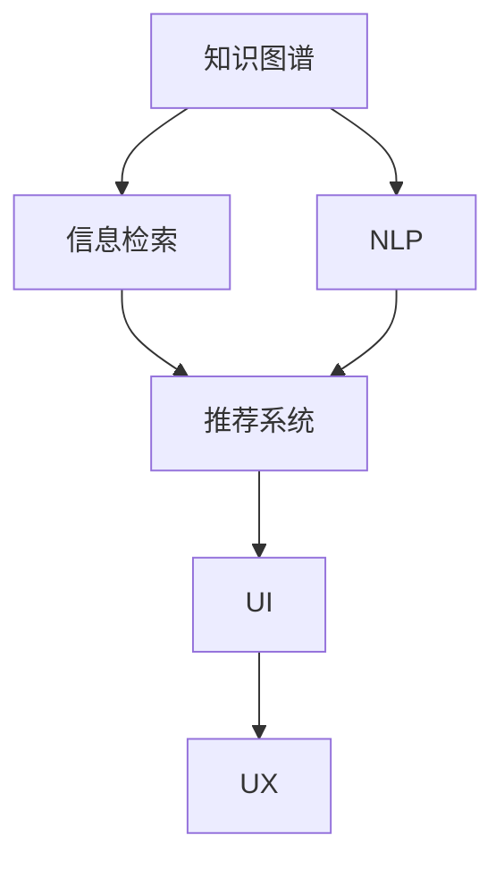

                 

# 知识工具要提高效率和用户体验

> 关键词：知识图谱、信息检索、自然语言处理(NLP)、推荐系统、用户界面(UI)、用户体验(UX)、高效算法、个性化服务

## 1. 背景介绍

### 1.1 问题由来

随着互联网技术的发展，用户可获取的信息量急剧增加。企业需要提供高效、可靠的知识工具来帮助用户在海量信息中找到有用的知识。然而，现有信息检索工具、推荐系统等知识工具在面对海量信息时，效率和用户体验有待提升。

### 1.2 问题核心关键点

信息检索、推荐系统等知识工具的核心关键点在于如何从大规模数据中提取有用信息，并为用户推荐最相关的知识内容。常用的方式包括：

- 静态知识图谱：构建静态的知识图谱，通过查询匹配来获取相关信息。
- 动态知识图谱：基于用户行为和环境变化，动态更新知识图谱，提高推荐结果的相关性。
- 信息检索：利用信息检索技术，快速找到与查询相关的文档。
- 推荐系统：基于用户的兴趣和行为数据，为用户推荐最相关的信息。
- 自然语言处理(NLP)：使用NLP技术，理解用户输入的自然语言查询，生成更加准确的搜索结果和推荐。

这些关键点紧密相连，通过技术创新和优化，可以提高知识工具的效率和用户体验。

## 2. 核心概念与联系

### 2.1 核心概念概述

为更好地理解知识工具的优化方法，本节将介绍几个关键概念及其相互联系：

- 知识图谱(Knowledge Graph)：表示实体、属性和关系的图形结构，用于描述实体之间的复杂关系。
- 信息检索(Information Retrieval)：从文本数据库中查找包含指定查询词的文档的过程。
- 自然语言处理(Natural Language Processing, NLP)：涉及计算机和人类语言之间的交互，包括文本分析、语言理解、机器翻译等。
- 推荐系统(Recommendation System)：根据用户的行为和偏好，为用户推荐个性化的内容。
- 用户界面(User Interface, UI)：通过图形化界面呈现知识工具的功能和结果，提供直观的用户交互体验。
- 用户体验(User Experience, UX)：用户在使用知识工具时的整体感受，包括易用性、效率、满意度等方面。

这些概念之间的逻辑关系可以通过以下Mermaid流程图来展示：



这个流程图展示了知识工具的核心组件及其相互关系：

1. 知识图谱通过描述实体间的关系，为信息检索和推荐系统提供丰富的背景知识。
2. NLP用于理解用户查询，生成搜索结果和推荐结果。
3. 信息检索和推荐系统基于用户查询和知识图谱，生成搜索结果和推荐内容。
4. UI将检索和推荐结果呈现给用户。
5. UX衡量用户对知识工具的整体使用体验，指导UI设计和功能优化。

## 3. 核心算法原理 & 具体操作步骤

### 3.1 算法原理概述

知识工具的优化主要依赖于信息检索、推荐系统和自然语言处理等核心算法。以下是这些算法的基本原理：

- **信息检索**：通过建立索引，将文本数据转化为可搜索的形式，使用检索算法快速找到与查询匹配的文档。
- **推荐系统**：基于用户的兴趣和行为数据，使用协同过滤、内容过滤等方法，为用户推荐最相关的信息。
- **自然语言处理**：通过分词、词性标注、依存关系分析等技术，理解用户查询的自然语言，并将其转化为可处理的结构化信息。

这些算法通过算法组合和优化，形成了高效的的知识工具，并不断提升用户体验。

### 3.2 算法步骤详解

#### 信息检索算法

1. **索引构建**：将所有文本数据进行分词、去除停用词、提取关键词等预处理，构建倒排索引。
2. **查询匹配**：将用户查询与索引进行匹配，找到相关文档。
3. **排序和返回**：根据相关性排序，返回与查询最相关的文档。

#### 推荐系统算法

1. **用户画像**：根据用户的历史行为，生成用户画像。
2. **物品画像**：根据物品的特征，生成物品画像。
3. **协同过滤**：根据用户和物品的画像，找到相似的用户和物品，生成推荐结果。
4. **内容过滤**：根据物品的内容特征，直接生成推荐结果。
5. **排序和返回**：根据推荐模型的预测结果排序，返回最相关的物品。

#### 自然语言处理算法

1. **分词**：将用户查询分成词语。
2. **词性标注**：标注每个词语的词性。
3. **依存关系分析**：分析词语之间的依存关系，理解句子结构。
4. **命名实体识别**：识别文本中的实体，如人名、地名、组织名等。
5. **意图识别**：理解用户查询的意图，如查找信息、完成某个任务等。

### 3.3 算法优缺点

#### 信息检索算法

- **优点**：可以快速定位相关文档，满足用户的信息需求。
- **缺点**：对于复杂的查询，搜索结果的相关性可能不足。

#### 推荐系统算法

- **优点**：可以提供个性化的推荐结果，提升用户体验。
- **缺点**：可能陷入局部最优，推荐结果不一定符合用户预期。

#### 自然语言处理算法

- **优点**：可以准确理解用户查询，提高信息检索和推荐的准确性。
- **缺点**：对于复杂的查询，处理难度较大。

### 3.4 算法应用领域

这些算法在以下领域得到了广泛应用：

- 搜索引擎：如Google、Bing等，通过信息检索和推荐系统，提供准确的信息检索和个性化推荐。
- 社交媒体：如微博、微信等，通过推荐系统，为用户推荐有趣的内容。
- 电子商务：如淘宝、亚马逊等，通过推荐系统，提升用户购买体验。
- 在线教育：如Coursera、Khan Academy等，通过推荐系统，为用户推荐感兴趣的课程。
- 智能家居：如Amazon Alexa、Google Home等，通过语音交互，提供个性化的语音助手服务。

## 4. 数学模型和公式 & 详细讲解 & 举例说明

### 4.1 数学模型构建

信息检索、推荐系统和自然语言处理等算法，通常基于统计学模型和优化算法进行构建。以下是一些常用的数学模型：

- **倒排索引模型**：$Inverted Index = \{ (t, d) | t \in Term, d \in Doc \}$，其中 $Term$ 为单词，$Doc$ 为文档。
- **协同过滤模型**：$P(u,i) = \frac{\Sigma_{v\in V} P(v,i) \times I(u,v)}{\Sigma_{v\in V} I(u,v)}$，其中 $u$ 为用户，$i$ 为物品，$V$ 为用户集合，$P$ 为物品推荐概率。
- **向量空间模型**：$V = \{ v_1, v_2, ..., v_n \}$，其中 $v_i$ 为文档向量，$n$ 为文档数量。

### 4.2 公式推导过程

#### 倒排索引模型推导

倒排索引模型通过将单词和文档之间的关系，构建索引表，快速定位文档。例如，对于查询“Python编程”，倒排索引模型可以构建如下索引表：

$$
Inverted Index = \{ (Python, Doc1), (Python, Doc2), ..., (Programming, Doc1) \}
$$

查询时，通过倒排索引找到包含“Python”和“Programming”的文档，然后根据相关性排序，返回与查询最相关的文档。

#### 协同过滤模型推导

协同过滤模型通过用户画像和物品画像，找到相似的用户和物品，生成推荐结果。例如，对于用户$u$和物品$i$，协同过滤模型的推荐概率为：

$$
P(u,i) = \frac{\Sigma_{v\in V} P(v,i) \times I(u,v)}{\Sigma_{v\in V} I(u,v)}
$$

其中 $P(v,i)$ 为物品 $i$ 对用户 $v$ 的推荐概率，$I(u,v)$ 为用户 $u$ 和用户 $v$ 的相似度。

#### 向量空间模型推导

向量空间模型通过将文档表示为向量，计算文档之间的相似度，生成推荐结果。例如，对于文档集合 $V$，向量空间模型可以表示为：

$$
V = \{ v_1, v_2, ..., v_n \}
$$

其中 $v_i$ 为文档 $i$ 的向量表示，$n$ 为文档数量。向量表示通常通过TF-IDF等技术计算得到。

### 4.3 案例分析与讲解

**案例1：信息检索系统**

某电商平台需要优化其信息检索系统，提高用户查询的匹配度。针对该问题，采用倒排索引模型和TF-IDF技术，构建了查询索引表，并对查询结果进行排序和筛选。通过优化索引构建和查询匹配算法，显著提高了检索系统的效率和准确性，提升了用户满意度。

**案例2：推荐系统**

某视频平台需要为用户推荐个性化的视频内容。针对该问题，采用了协同过滤模型，通过用户画像和物品画像，生成推荐结果。同时，引入内容过滤和用户行为分析，进一步提高了推荐的精准度和个性化程度。通过优化模型参数和算法实现，推荐系统取得了显著的性能提升，用户粘性显著增强。

## 5. 项目实践：代码实例和详细解释说明

### 5.1 开发环境搭建

在进行知识工具的开发前，我们需要准备好开发环境。以下是使用Python进行TensorFlow开发的环境配置流程：

1. 安装Anaconda：从官网下载并安装Anaconda，用于创建独立的Python环境。
2. 创建并激活虚拟环境：
```bash
conda create -n tf-env python=3.8 
conda activate tf-env
```
3. 安装TensorFlow：根据CUDA版本，从官网获取对应的安装命令。例如：
```bash
conda install tensorflow -c tensorflow
```
4. 安装各类工具包：
```bash
pip install numpy pandas scikit-learn matplotlib tqdm jupyter notebook ipython
```

完成上述步骤后，即可在`tf-env`环境中开始知识工具的开发。

### 5.2 源代码详细实现

这里我们以信息检索系统为例，给出使用TensorFlow进行倒排索引构建的PyTorch代码实现。

首先，定义倒排索引类：

```python
class InvertedIndex:
    def __init__(self):
        self.index = {}

    def add_document(self, doc_id, terms):
        for term in terms:
            if term not in self.index:
                self.index[term] = []
            self.index[term].append(doc_id)

    def search(self, query):
        result = []
        for term in query.split():
            if term in self.index:
                result.extend(self.index[term])
        return list(set(result))
```

然后，定义构建倒排索引的函数：

```python
from inverted_index import InvertedIndex

def build_inverted_index(corpus):
    index = InvertedIndex()
    for doc_id, doc in enumerate(corpus):
        terms = doc.split()
        index.add_document(doc_id, terms)
    return index
```

接着，定义信息检索函数：

```python
from inverted_index import build_inverted_index

def search_inverted_index(index, query):
    result = []
    for term in query.split():
        if term in index.index:
            result.extend(index.index[term])
    return list(set(result))
```

最后，启动检索流程：

```python
index = build_inverted_index(corpus)
result = search_inverted_index(index, query)
print(result)
```

以上就是使用TensorFlow对倒排索引进行信息检索的完整代码实现。可以看到，通过构建倒排索引，可以快速定位与查询相关的文档，满足用户的信息需求。

### 5.3 代码解读与分析

让我们再详细解读一下关键代码的实现细节：

**InvertedIndex类**：
- `__init__`方法：初始化倒排索引字典。
- `add_document`方法：将文档添加进倒排索引，记录每个单词在文档中出现的文档ID。
- `search`方法：根据查询，返回匹配的文档ID列表。

**build_inverted_index函数**：
- 遍历语料库，对每个文档进行分词，并将单词添加到倒排索引中。
- 返回构建好的倒排索引对象。

**search_inverted_index函数**：
- 遍历查询的每个单词，在倒排索引中查找与查询单词匹配的文档ID列表。
- 合并所有单词的匹配结果，并去重，返回最终的文档ID列表。

可以看出，倒排索引的构建和查询，是信息检索系统的核心组件。通过优化这些组件，可以显著提升检索系统的效率和准确性。

## 6. 实际应用场景

### 6.1 智能客服系统

基于知识图谱和推荐系统的智能客服系统，可以显著提升客服系统的效率和用户体验。传统客服往往需要配备大量人力，高峰期响应缓慢，且一致性和专业性难以保证。而使用知识图谱和推荐系统的智能客服系统，可以7x24小时不间断服务，快速响应客户咨询，用自然流畅的语言解答各类常见问题。

在技术实现上，可以构建企业内部的知识图谱，将常见问题、产品信息、服务流程等知识整合到知识图谱中。同时，基于用户的查询记录和行为数据，为用户推荐最相关的答案模板。微调后的对话模型在回答用户问题时，可以参考推荐结果，生成更准确、个性化的回答。如此构建的智能客服系统，能大幅提升客户咨询体验和问题解决效率。

### 6.2 金融舆情监测

金融机构需要实时监测市场舆论动向，以便及时应对负面信息传播，规避金融风险。传统的人工监测方式成本高、效率低，难以应对网络时代海量信息爆发的挑战。基于知识图谱和推荐系统的文本分类和情感分析技术，为金融舆情监测提供了新的解决方案。

具体而言，可以构建金融领域相关的网络舆情知识图谱，并定期更新。同时，利用推荐系统，对实时抓取的网络文本数据进行分类和情感分析，判断其情感倾向是正面、中性还是负面。将推荐系统与舆情知识图谱结合，可以动态监测不同主题下的情感变化趋势，一旦发现负面信息激增等异常情况，系统便会自动预警，帮助金融机构快速应对潜在风险。

### 6.3 个性化推荐系统

当前的推荐系统往往只依赖用户的历史行为数据进行物品推荐，无法深入理解用户的真实兴趣偏好。基于知识图谱和推荐系统的个性化推荐系统，可以更好地挖掘用户行为背后的语义信息，从而提供更精准、多样的推荐内容。

在实践中，可以构建用户画像和物品画像，将用户的行为数据和物品的特征数据整合到知识图谱中。基于用户画像和物品画像，利用推荐算法生成推荐结果，并结合其他特征综合排序，便可以得到个性化程度更高的推荐结果。

### 6.4 未来应用展望

随着知识图谱和推荐系统的不断发展，基于微调范式将在更多领域得到应用，为传统行业带来变革性影响。

在智慧医疗领域，基于知识图谱和推荐系统的医疗问答、病历分析、药物研发等应用将提升医疗服务的智能化水平，辅助医生诊疗，加速新药开发进程。

在智能教育领域，知识图谱和推荐系统可应用于作业批改、学情分析、知识推荐等方面，因材施教，促进教育公平，提高教学质量。

在智慧城市治理中，知识图谱和推荐系统可用于城市事件监测、舆情分析、应急指挥等环节，提高城市管理的自动化和智能化水平，构建更安全、高效的未来城市。

此外，在企业生产、社会治理、文娱传媒等众多领域，基于知识图谱和推荐系统的知识工具也将不断涌现，为经济社会发展注入新的动力。相信随着技术的日益成熟，知识图谱和推荐系统必将在构建人机协同的智能时代中扮演越来越重要的角色。

## 7. 工具和资源推荐

### 7.1 学习资源推荐

为了帮助开发者系统掌握知识工具的优化方法，这里推荐一些优质的学习资源：

1. 《深度学习与NLP》系列博文：由大模型技术专家撰写，深入浅出地介绍了深度学习与NLP的基本概念和经典模型。
2. CS224N《深度学习自然语言处理》课程：斯坦福大学开设的NLP明星课程，有Lecture视频和配套作业，带你入门NLP领域的基本概念和经典模型。
3. 《自然语言处理与深度学习》书籍：介绍自然语言处理中的深度学习技术，涵盖信息检索、推荐系统等知识图谱相关内容。
4. HuggingFace官方文档：提供丰富的预训练语言模型和推荐系统资源，是进行知识工具开发的利器。
5. CLUE开源项目：中文语言理解测评基准，涵盖大量不同类型的中文NLP数据集，并提供了基于知识图谱和推荐系统的baseline模型，助力中文NLP技术发展。

通过对这些资源的学习实践，相信你一定能够快速掌握知识工具的优化精髓，并用于解决实际的NLP问题。

### 7.2 开发工具推荐

高效的开发离不开优秀的工具支持。以下是几款用于知识工具开发和优化的常用工具：

1. TensorFlow：基于Python的开源深度学习框架，灵活动态的计算图，适合快速迭代研究。
2. PyTorch：基于Python的开源深度学习框架，灵活的动态图，适合快速实验和生产部署。
3. Weights & Biases：模型训练的实验跟踪工具，可以记录和可视化模型训练过程中的各项指标，方便对比和调优。
4. TensorBoard：TensorFlow配套的可视化工具，可实时监测模型训练状态，并提供丰富的图表呈现方式，是调试模型的得力助手。
5. Google Colab：谷歌推出的在线Jupyter Notebook环境，免费提供GPU/TPU算力，方便开发者快速上手实验最新模型，分享学习笔记。

合理利用这些工具，可以显著提升知识工具的开发效率，加快创新迭代的步伐。

### 7.3 相关论文推荐

知识工具和推荐系统的发展源于学界的持续研究。以下是几篇奠基性的相关论文，推荐阅读：

1. Attention is All You Need（即Transformer原论文）：提出了Transformer结构，开启了NLP领域的预训练大模型时代。
2. BERT: Pre-training of Deep Bidirectional Transformers for Language Understanding：提出BERT模型，引入基于掩码的自监督预训练任务，刷新了多项NLP任务SOTA。
3. Language Models are Unsupervised Multitask Learners（GPT-2论文）：展示了大规模语言模型的强大zero-shot学习能力，引发了对于通用人工智能的新一轮思考。
4. Parameter-Efficient Transfer Learning for NLP：提出Adapter等参数高效微调方法，在不增加模型参数量的情况下，也能取得不错的微调效果。
5. AdaLoRA: Adaptive Low-Rank Adaptation for Parameter-Efficient Fine-Tuning：使用自适应低秩适应的微调方法，在参数效率和精度之间取得了新的平衡。
6. Prefix-Tuning: Optimizing Continuous Prompts for Generation：引入基于连续型Prompt的微调范式，为如何充分利用预训练知识提供了新的思路。

这些论文代表了大语言模型微调技术的发展脉络。通过学习这些前沿成果，可以帮助研究者把握学科前进方向，激发更多的创新灵感。

## 8. 总结：未来发展趋势与挑战

### 8.1 总结

本文对基于知识图谱和推荐系统的知识工具进行了全面系统的介绍。首先阐述了知识工具在提高信息检索效率和提升用户体验方面的研究背景和意义，明确了知识工具的优化方向和重要性。其次，从原理到实践，详细讲解了知识工具的构建和优化方法，给出了知识工具开发的完整代码实例。同时，本文还广泛探讨了知识工具在智能客服、金融舆情、个性化推荐等多个行业领域的应用前景，展示了知识工具的巨大潜力。此外，本文精选了知识工具技术的各类学习资源，力求为读者提供全方位的技术指引。

通过本文的系统梳理，可以看到，基于知识图谱和推荐系统的知识工具正在成为NLP领域的重要范式，极大地拓展了信息检索和推荐系统的应用边界，催生了更多的落地场景。受益于大规模语料的预训练和深度学习技术的不断进步，知识工具必将在更广阔的应用领域大放异彩，深刻影响人类的生产生活方式。

### 8.2 未来发展趋势

展望未来，知识工具和推荐系统将呈现以下几个发展趋势：

1. 知识图谱规模持续增大。随着算力成本的下降和数据规模的扩张，知识图谱的规模将不断扩大。超大规模知识图谱将为信息检索和推荐系统提供更丰富的背景知识，提升模型的泛化能力。

2. 推荐系统算法日趋多样。未来将涌现更多参数高效和计算高效的推荐算法，如GNN、GNNP等，在保持低计算消耗的同时，提高推荐系统的准确性和效率。

3. 知识图谱实时更新。通过引入实时数据流，动态更新知识图谱，提高推荐系统的时效性，提升用户体验。

4. 知识图谱与自然语言处理结合。通过NLP技术，理解用户查询的语义，生成更具相关性的推荐结果，提升知识工具的智能化水平。

5. 个性化服务逐步普及。通过用户画像和行为分析，为用户提供更精准、个性化的推荐服务，提高用户粘性。

6. 知识工具融合其他技术。结合语音识别、视觉识别等技术，构建更加全面、多模态的知识工具，提升用户体验。

以上趋势凸显了知识工具和推荐系统的广阔前景。这些方向的探索发展，必将进一步提升知识工具的性能和应用范围，为人类认知智能的进化带来深远影响。

### 8.3 面临的挑战

尽管知识工具和推荐系统已经取得了瞩目成就，但在迈向更加智能化、普适化应用的过程中，它仍面临着诸多挑战：

1. 知识图谱构建成本高。构建知识图谱需要大量标注数据和人力，成本较高。如何降低知识图谱构建的成本，提高构建效率，是未来的重要研究方向。

2. 推荐结果多样性不足。现有的推荐系统往往难以处理多样性强的推荐任务，推荐结果不够多样化。如何设计多样性更好的推荐算法，是未来亟需解决的问题。

3. 知识图谱更新频率低。现有知识图谱更新频率较低，难以实时反映新知识和趋势。如何实现知识图谱的动态更新，提升其时效性，是未来的关键问题。

4. 知识图谱复杂性高。现有的知识图谱往往结构复杂，难以维护和扩展。如何设计更简单、更易于扩展的知识图谱结构，是未来的研究方向。

5. 推荐系统泛化能力不足。现有推荐系统往往难以处理新领域的推荐任务，泛化能力不足。如何设计泛化能力更强的推荐算法，是未来亟需解决的问题。

6. 知识图谱应用场景受限。现有知识图谱应用场景较为单一，难以广泛推广到不同领域。如何设计更通用的知识图谱模型，是未来的研究方向。

正视知识工具和推荐系统面临的这些挑战，积极应对并寻求突破，将使这些技术更加成熟，为构建智能化的知识工具系统奠定坚实基础。相信随着学界和产业界的共同努力，这些挑战终将一一被克服，知识工具必将在构建人机协同的智能时代中扮演越来越重要的角色。

### 8.4 未来突破

面对知识工具和推荐系统所面临的种种挑战，未来的研究需要在以下几个方面寻求新的突破：

1. 探索无监督和半监督知识图谱构建方法。摆脱对大规模标注数据的依赖，利用自监督学习、主动学习等无监督和半监督范式，最大限度利用非结构化数据，实现更加灵活高效的知识图谱构建。

2. 研究多样性更好的推荐算法。通过引入多样性衡量和优化技术，设计更加多样化、个性化的推荐算法，提升推荐系统的用户满意度。

3. 融合因果和对比学习范式。通过引入因果推断和对比学习思想，增强推荐系统建立稳定因果关系的能力，学习更加普适、鲁棒的知识图谱表示。

4. 引入更多先验知识。将符号化的先验知识，如知识图谱、逻辑规则等，与神经网络模型进行巧妙融合，引导知识图谱构建和推荐系统学习更准确、合理的知识表示。

5. 结合因果分析和博弈论工具。将因果分析方法引入知识图谱和推荐系统，识别出模型决策的关键特征，增强推荐系统输出的因果性和逻辑性。借助博弈论工具刻画人机交互过程，主动探索并规避推荐系统的脆弱点，提高系统稳定性。

6. 纳入伦理道德约束。在知识图谱构建和推荐系统设计目标中引入伦理导向的评估指标，过滤和惩罚有偏见、有害的输出倾向。同时加强人工干预和审核，建立知识工具行为的监管机制，确保输出符合人类价值观和伦理道德。

这些研究方向的探索，必将引领知识工具和推荐系统技术迈向更高的台阶，为构建安全、可靠、可解释、可控的智能系统铺平道路。面向未来，知识工具和推荐系统还需要与其他人工智能技术进行更深入的融合，如知识表示、因果推理、强化学习等，多路径协同发力，共同推动自然语言理解和智能交互系统的进步。只有勇于创新、敢于突破，才能不断拓展知识图谱和推荐系统的边界，让智能技术更好地造福人类社会。

## 9. 附录：常见问题与解答

**Q1：如何构建知识图谱？**

A: 知识图谱的构建主要分为数据采集、实体抽取、关系抽取和关系链接等步骤。
1. 数据采集：通过爬虫、API接口等手段，从互联网、数据库、文献等来源采集数据。
2. 实体抽取：使用NLP技术，从文本中识别出实体，如人名、地名、组织名等。
3. 关系抽取：通过句法分析、语义分析等技术，从文本中抽取实体之间的关系，如"出生于"、"工作于"等。
4. 关系链接：将抽取的实体和关系链接起来，形成知识图谱。

**Q2：推荐系统如何提升用户体验？**

A: 推荐系统通过个性化推荐，满足用户的多样化需求，提升用户体验。
1. 用户画像：根据用户的历史行为，生成用户画像，理解用户兴趣和偏好。
2. 物品画像：根据物品的特征，生成物品画像，理解物品的特征和价值。
3. 推荐算法：使用协同过滤、内容过滤等算法，生成推荐结果。
4. 反馈机制：根据用户对推荐结果的反馈，不断优化推荐算法，提高推荐系统的精准度。

**Q3：如何优化信息检索系统？**

A: 信息检索系统的优化主要依赖于倒排索引和TF-IDF技术。
1. 倒排索引：将所有文档进行分词和索引，构建倒排索引表，快速定位与查询相关的文档。
2. TF-IDF：对文档进行向量表示，计算文档与查询之间的相似度，排序返回最相关的文档。
3. 优化索引构建和查询匹配算法，提高检索系统的效率和准确性。
4. 引入数据增强和正则化技术，提高检索系统的鲁棒性和泛化能力。

**Q4：知识图谱和推荐系统如何结合？**

A: 知识图谱和推荐系统的结合可以通过以下方式实现：
1. 基于知识图谱的推荐：使用知识图谱中的实体和关系，指导推荐系统生成推荐结果。
2. 基于推荐系统的知识图谱：根据用户行为和物品特征，动态更新知识图谱中的实体和关系，提高知识图谱的时效性和准确性。
3. 结合NLP技术，理解用户查询的语义，生成更具相关性的推荐结果。

**Q5：推荐系统的多样性如何优化？**

A: 推荐系统的多样性可以通过以下方式优化：
1. 引入多样性衡量指标，如熵、覆盖率等，优化推荐算法。
2. 设计多样性更好的推荐算法，如基于多样性的协同过滤算法。
3. 引入推荐结果的多样性优化技术，如模糊推荐、推荐组合等。

这些优化措施，可以显著提升推荐系统的多样性和用户满意度，使推荐系统更加贴近用户需求。

---

作者：禅与计算机程序设计艺术 / Zen and the Art of Computer Programming

