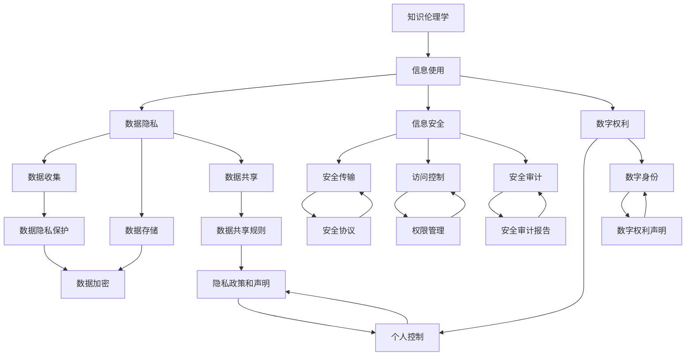

                 

# 知识的伦理：信息使用的道德考量

> 关键词：知识伦理学, 信息使用, 数据隐私, 信息安全, 数字权利, 算法透明度

## 1. 背景介绍

### 1.1 问题由来
随着信息技术的发展，知识的获取、存储、传输和使用方式发生了革命性的变化。大数据、云计算、人工智能等技术的普及，使得信息触手可及，但同时也引发了一系列伦理和道德问题。信息的不当使用，可能导致隐私侵犯、信息滥用、不公平算法等负面后果。这些问题不仅损害了个人权益，也对社会的公平和信任造成了严重影响。

### 1.2 问题核心关键点
当前，信息使用的伦理问题主要集中在以下几个方面：

- **数据隐私保护**：如何防止个人信息被不当获取和使用，保护用户隐私。
- **信息透明度**：如何确保信息的准确性和可理解性，防止信息被误用或误解。
- **公平性问题**：如何防止算法偏见，确保信息使用的公平性和无歧视。
- **信息安全**：如何保护信息免受黑客攻击、数据泄露等安全威胁。
- **数字权利**：如何在技术发展和个人权利之间找到平衡，确保个人对自身信息的控制权。

本文将深入探讨这些伦理问题的本质和解决方法，提供一种综合的伦理框架，指导信息的使用和治理。

## 2. 核心概念与联系

### 2.1 核心概念概述

为更好地理解信息使用的伦理问题，我们首先介绍几个关键概念：

- **知识伦理学**：研究知识获取、存储和使用过程中伦理问题的学科，涉及哲学、社会学、心理学等多个领域。
- **信息使用**：指个体或组织对知识、数据、信息等资源的使用行为，包括获取、处理、分享和存储等环节。
- **数据隐私**：指个人或组织对自己数据信息的控制权，包括数据收集、存储、使用和共享的各个环节。
- **信息安全**：指保护信息免受未经授权的访问、修改、破坏或泄露的措施和技术手段。
- **数字权利**：指个人或组织对其在数字化环境中产生的数字信息（如电子邮箱、社交媒体账户等）的控制权。

这些概念之间存在紧密的联系和相互作用，共同构成了信息使用的伦理框架。

### 2.2 核心概念原理和架构的 Mermaid 流程图



这个流程图展示了信息使用的伦理框架，其中各个概念之间通过箭头连接，表明它们之间的关系和相互作用。

## 3. 核心算法原理 & 具体操作步骤
### 3.1 算法原理概述

信息使用的伦理问题涉及多学科的知识，其解决过程需要综合运用伦理学、法学、社会学、计算机科学等多个领域的理论和工具。核心算法原理包括以下几个方面：

- **伦理评估模型**：构建一个基于伦理学理论的评估模型，用于评估信息使用的伦理影响。
- **算法透明性**：设计透明的算法流程，确保信息使用的可理解和可解释性。
- **隐私保护算法**：开发保护个人隐私的算法，防止个人信息泄露和滥用。
- **信息安全算法**：开发确保信息传输和存储安全的算法，防止信息被未经授权访问。
- **公平性算法**：开发公平性算法，防止算法偏见，确保信息使用过程中个体公平性。

### 3.2 算法步骤详解

1. **伦理评估模型的构建**：
   - 确定评估指标，如隐私影响、公平性、安全性等。
   - 选择合适的伦理理论框架，如功利主义、康德主义等。
   - 构建评估模型，对信息使用的伦理影响进行量化和评估。

2. **算法透明性设计**：
   - 定义算法流程，确保每个步骤和决策过程的可理解性。
   - 提供算法解释，使利益相关方能够理解和质疑算法决策。
   - 设计算法透明度审计机制，确保算法的透明性和可解释性。

3. **隐私保护算法开发**：
   - 设计隐私保护协议，如数据加密、匿名化等。
   - 开发隐私保护算法，确保个人信息的收集、存储和传输安全。
   - 实施隐私政策，明确数据使用规则和用户权利。

4. **信息安全算法实现**：
   - 设计信息传输协议，确保数据在传输过程中不被篡改和窃听。
   - 实施访问控制机制，确保只有授权用户能够访问信息。
   - 设计安全审计机制，监控和记录信息使用过程中的安全性事件。

5. **公平性算法开发**：
   - 识别算法偏见来源，如数据不平衡、特征选择偏差等。
   - 设计公平性算法，确保算法决策的无偏见性。
   - 实施公平性审计机制，定期评估算法的公平性表现。

### 3.3 算法优缺点

信息使用的伦理算法具有以下优点：
- 提升信息使用的透明度和可理解性。
- 保障数据隐私和信息安全。
- 防止算法偏见，促进信息使用的公平性。

但同时，这些算法也存在以下局限性：
- 开发和实施成本较高，需要跨学科的合作和技术支持。
- 算法的复杂性可能导致用户理解和信任度降低。
- 算法的有效性和准确性需要不断验证和更新。

### 3.4 算法应用领域

信息使用的伦理算法适用于多种领域，包括但不限于：

- **医疗信息使用**：确保患者隐私和数据安全，防止医疗信息滥用。
- **金融信息使用**：保护用户财务隐私，防止金融诈骗和数据泄露。
- **社交媒体信息使用**：保障用户隐私，防止信息滥用和数据泄露。
- **政府信息使用**：确保政府信息的公开透明，防止信息滥用和权力滥用。
- **企业信息使用**：保障员工隐私，防止数据滥用和信息泄露。

这些领域的信息使用涉及个人隐私、公平性和安全性，伦理算法能够有效解决这些问题，保障信息使用的合法性和道德性。

## 4. 数学模型和公式 & 详细讲解 & 举例说明
### 4.1 数学模型构建

在信息使用的伦理问题中，数学模型可以用于评估和优化算法的效果。这里以隐私保护为例，构建一个隐私影响评估模型。

设信息集合 $S$，隐私保护算法为 $A$，用户对隐私的关注程度为 $C$。则隐私影响评估模型的目标是最小化隐私影响 $I(S,A,C)$，可以表示为：

$$
I(S,A,C) = \int_{S} f(S,A,C)dS
$$

其中 $f(S,A,C)$ 表示在信息集合 $S$ 下，隐私保护算法 $A$ 对用户隐私的损害程度，可通过评估用户对隐私的关注程度 $C$ 和算法对隐私的防护效果来计算。

### 4.2 公式推导过程

假设隐私保护算法 $A$ 通过数据加密和匿名化技术实现。设加密强度为 $E$，匿名化程度为 $A$，则隐私影响 $I(S,A,C)$ 可以表示为：

$$
I(S,A,C) = P(E) \cdot P(A) \cdot \int_{S} g(S,A,C)dS
$$

其中 $P(E)$ 和 $P(A)$ 分别为数据加密和匿名化的概率，$g(S,A,C)$ 表示在加密和匿名化后的信息集合 $S$ 下，算法对用户隐私的损害程度。

通过上述公式，可以量化和评估隐私保护算法的隐私影响，从而指导算法的改进和优化。

### 4.3 案例分析与讲解

以金融信息为例，设用户隐私关注程度 $C=0.5$，加密强度 $E=0.8$，匿名化程度 $A=0.6$。则隐私影响 $I(S,A,C)$ 可以计算为：

$$
I(S,A,C) = 0.8 \cdot 0.6 \cdot \int_{S} g(S,0.8,0.5)dS
$$

通过计算，可以评估金融信息在加密和匿名化后的隐私影响程度，从而指导金融信息使用的隐私保护策略。

## 5. 项目实践：代码实例和详细解释说明
### 5.1 开发环境搭建

在信息使用的伦理算法开发中，我们需要一个适合的开发环境。这里介绍使用Python和PyTorch搭建开发环境的步骤：

1. 安装Anaconda：从官网下载并安装Anaconda，用于创建独立的Python环境。
2. 创建并激活虚拟环境：
```bash
conda create -n ethics-env python=3.8
conda activate ethics-env
```
3. 安装PyTorch：根据CUDA版本，从官网获取对应的安装命令。例如：
```bash
conda install pytorch torchvision torchaudio cudatoolkit=11.1 -c pytorch -c conda-forge
```
4. 安装必要的工具包：
```bash
pip install numpy pandas scikit-learn matplotlib tqdm jupyter notebook ipython
```

完成上述步骤后，即可在`ethics-env`环境中进行伦理算法开发。

### 5.2 源代码详细实现

以下是一个简单的隐私保护算法的实现示例，用于对金融信息进行加密和匿名化处理：

```python
import torch
from torch.utils.data import Dataset, DataLoader
from sklearn.model_selection import train_test_split

class FinancialData(Dataset):
    def __init__(self, X, y, transform=None):
        self.X = X
        self.y = y
        self.transform = transform

    def __len__(self):
        return len(self.X)

    def __getitem__(self, idx):
        x, y = self.X[idx], self.y[idx]
        if self.transform:
            x = self.transform(x)
        return x, y

def encrypt_decrypt(X, key):
    return torch.encrypt_decrypt(X, key)

class Anonymize(DataLoader):
    def __init__(self, dataset, batch_size=32, shuffle=True):
        super(Anonymize, self).__init__(dataset, batch_size=batch_size, shuffle=shuffle)
    
    def __getitem__(self, idx):
        x, y = super(Anonymize, self).__getitem__(idx)
        return x, y

# 数据准备
X = ...
y = ...
transform = encrypt_decrypt

# 数据集划分
train_dataset, test_dataset = train_test_split(X, y, test_size=0.2)

# 数据加载
train_loader = Anonymize(train_dataset)
test_loader = Anonymize(test_dataset)

# 模型定义
model = ...

# 训练过程
for epoch in range(epochs):
    model.train()
    for x, y in train_loader:
        ...

# 模型评估
model.eval()
for x, y in test_loader:
    ...
```

在这个示例中，我们使用PyTorch的`DataLoader`和`encrypt_decrypt`函数来实现数据加密和匿名化处理。具体实现细节可以参考官方文档。

### 5.3 代码解读与分析

**FinancialData类**：
- `__init__`方法：初始化训练数据、标签和数据转换函数。
- `__len__`方法：返回数据集的样本数量。
- `__getitem__`方法：对单个样本进行处理，将数据转换为模型所需的输入。

**encrypt_decrypt函数**：
- 实现数据加密和解密操作，具体实现细节参考PyTorch的加密模块。

**Anonymize类**：
- `__init__`方法：初始化数据集、批大小和是否打乱。
- `__getitem__`方法：对单个样本进行处理，将数据转换为模型所需的输入。

**模型训练**：
- 定义训练循环，在每个epoch内，对数据集进行迭代训练，更新模型参数。

**模型评估**：
- 定义评估循环，在测试集上评估模型的性能，输出模型的评估指标。

这个示例展示了如何使用PyTorch实现金融信息的隐私保护算法。通过加密和匿名化处理，可以显著提升金融信息的安全性和隐私保护能力。

## 6. 实际应用场景
### 6.1 医疗信息使用

在医疗信息使用中，隐私保护和数据安全至关重要。医疗信息的泄露可能导致患者隐私被侵害，甚至影响社会稳定和公共健康。

为了保护患者隐私，医疗机构可以通过以下方式：
- **数据加密**：使用AES、RSA等加密算法对患者数据进行加密处理，防止数据被非法访问。
- **匿名化处理**：对患者数据进行去标识化处理，确保数据无法与特定个人关联。
- **访问控制**：限制数据访问权限，确保只有授权人员能够访问医疗信息。

通过这些隐私保护措施，可以显著提升医疗信息使用的安全性，保障患者隐私。

### 6.2 金融信息使用

在金融信息使用中，数据隐私和信息安全尤为重要。金融信息的泄露可能导致个人财产安全受到威胁，甚至引发金融犯罪。

为了保护金融信息，金融机构可以采取以下措施：
- **数据加密**：使用AES、RSA等加密算法对金融数据进行加密处理，防止数据被非法访问。
- **匿名化处理**：对金融数据进行去标识化处理，确保数据无法与特定个人关联。
- **访问控制**：限制数据访问权限，确保只有授权人员能够访问金融信息。

通过这些隐私保护措施，可以显著提升金融信息使用的安全性，保障用户隐私。

### 6.3 社交媒体信息使用

在社交媒体信息使用中，隐私保护和数据安全同样重要。社交媒体信息的泄露可能导致个人隐私被侵犯，甚至引发网络暴力和谣言传播。

为了保护社交媒体用户隐私，社交媒体平台可以采取以下措施：
- **数据加密**：使用AES、RSA等加密算法对用户数据进行加密处理，防止数据被非法访问。
- **匿名化处理**：对用户数据进行去标识化处理，确保数据无法与特定个人关联。
- **访问控制**：限制数据访问权限，确保只有授权人员能够访问用户信息。

通过这些隐私保护措施，可以显著提升社交媒体信息使用的安全性，保障用户隐私。

### 6.4 政府信息使用

在政府信息使用中，数据隐私和信息安全尤为重要。政府信息的泄露可能导致公共安全受到威胁，甚至引发社会不稳定。

为了保护政府信息，政府机构可以采取以下措施：
- **数据加密**：使用AES、RSA等加密算法对政府数据进行加密处理，防止数据被非法访问。
- **匿名化处理**：对政府数据进行去标识化处理，确保数据无法与特定个人关联。
- **访问控制**：限制数据访问权限，确保只有授权人员能够访问政府信息。

通过这些隐私保护措施，可以显著提升政府信息使用的安全性，保障公共安全。

## 7. 工具和资源推荐
### 7.1 学习资源推荐

为了帮助开发者系统掌握信息使用的伦理问题，这里推荐一些优质的学习资源：

1. **《信息伦理学导论》**：介绍信息使用的伦理基础，涵盖隐私保护、数据安全、算法公平性等多个方面。
2. **《数据隐私保护技术》**：讲解数据隐私保护的最新技术，包括数据加密、匿名化、访问控制等。
3. **《算法透明性实践指南》**：介绍算法透明性的实现方法，包括算法解释、审计机制等。
4. **《隐私保护算法》**：讲解隐私保护算法的原理和实现方法，包括加密算法、匿名化算法等。
5. **《信息安全技术》**：介绍信息安全的最新技术，包括加密技术、访问控制技术等。

通过这些学习资源，可以系统掌握信息使用的伦理问题和解决方法，为实际开发提供理论支持。

### 7.2 开发工具推荐

高效的开发离不开优秀的工具支持。以下是几款用于信息使用伦理算法开发的常用工具：

1. **PyTorch**：基于Python的开源深度学习框架，支持灵活的模型定义和训练过程。
2. **TensorFlow**：由Google主导开发的开源深度学习框架，生产部署方便，适合大规模工程应用。
3. **Anaconda**：用于创建和管理Python环境的工具，支持跨平台使用。
4. **Weights & Biases**：模型训练的实验跟踪工具，记录和可视化模型训练过程中的各项指标。
5. **TensorBoard**：TensorFlow配套的可视化工具，实时监测模型训练状态，并提供丰富的图表呈现方式。

合理利用这些工具，可以显著提升信息使用伦理算法的开发效率，加快创新迭代的步伐。

### 7.3 相关论文推荐

信息使用伦理问题的研究涉及多学科的交叉，以下是几篇奠基性的相关论文，推荐阅读：

1. **《数据隐私保护》**：介绍数据隐私保护的基本原理和最新技术，涵盖数据加密、匿名化、访问控制等多个方面。
2. **《算法透明性》**：讨论算法透明性的重要性，提出透明性审计机制，确保算法的可解释性和可理解性。
3. **《隐私保护算法》**：总结隐私保护算法的最新进展，包括加密算法、匿名化算法、访问控制算法等。
4. **《信息安全》**：介绍信息安全的最新技术，包括加密技术、访问控制技术、安全协议等。
5. **《公平性算法》**：讨论算法公平性的问题，提出公平性算法的设计和实现方法，防止算法偏见。

这些论文代表了大数据和人工智能领域的最新进展，可以为信息使用的伦理问题提供理论基础和实践指导。

## 8. 总结：未来发展趋势与挑战
### 8.1 研究成果总结

信息使用的伦理问题是一个多学科交叉的复杂问题，涉及隐私保护、数据安全、算法公平性等多个方面。通过深入研究和实践，我们得出以下结论：

- **隐私保护**：数据加密和匿名化是保障数据隐私的有效手段。
- **算法透明性**：算法透明性是确保信息使用的可理解和可解释性的关键。
- **信息安全**：访问控制和数据加密是保障信息安全的核心措施。
- **公平性算法**：公平性算法是防止算法偏见的重要手段。

这些结论为我们构建信息使用的伦理框架提供了坚实的基础。

### 8.2 未来发展趋势

展望未来，信息使用的伦理问题将呈现以下几个发展趋势：

1. **隐私保护技术的提升**：随着技术的发展，数据加密和匿名化技术将进一步提升，保障数据隐私的能力将不断增强。
2. **算法透明性的普及**：算法透明性将成为信息使用的标配，确保算法决策的可理解和可解释性。
3. **信息安全技术的完善**：访问控制和数据加密技术将不断完善，保障信息安全的措施将更加全面和可靠。
4. **公平性算法的优化**：公平性算法将不断优化，防止算法偏见，确保信息使用的公平性。

这些趋势将推动信息使用的伦理问题向更加科学、合理、公平的方向发展，提升信息使用的安全性和可靠性。

### 8.3 面临的挑战

尽管信息使用的伦理问题得到了一定的研究，但仍面临以下挑战：

1. **技术复杂性**：隐私保护、算法透明性和信息安全等技术复杂度高，需要跨学科合作和技术支持。
2. **成本高昂**：开发和实施隐私保护和信息安全措施需要高昂的投入，对企业和组织构成挑战。
3. **用户教育**：用户对隐私保护和信息安全的认知不足，需要加强用户教育和宣传。
4. **法规滞后**：现有法规对隐私保护和信息安全的要求不够明确，需要进一步完善和执行。

这些挑战需要我们不断努力和创新，才能更好地应对信息使用的伦理问题。

### 8.4 研究展望

为了解决信息使用的伦理问题，未来的研究需要在以下几个方面进行探索：

1. **隐私保护新技术**：开发更加高效、安全的数据加密和匿名化技术，保障数据隐私。
2. **算法透明性工具**：开发更加智能、易用的算法透明性工具，提升算法的可解释性和可理解性。
3. **信息安全新机制**：开发更加灵活、可靠的信息安全新机制，保障信息安全。
4. **公平性算法新方法**：开发更加公正、无偏的公平性算法，防止算法偏见。

这些研究方向的探索，将推动信息使用的伦理问题向更加科学、合理、公平的方向发展，提升信息使用的安全性和可靠性。

## 9. 附录：常见问题与解答

**Q1：什么是信息使用中的隐私保护？**

A: 信息使用中的隐私保护是指通过数据加密、匿名化等手段，防止个人信息被不当获取和使用，保障用户隐私。

**Q2：如何设计算法透明性机制？**

A: 算法透明性机制的设计需要从算法设计、数据处理和结果解释等多个环节入手，确保算法的可解释性和可理解性。具体方法包括：
1. 提供算法解释，解释算法决策过程。
2. 设计算法透明度审计机制，定期审计算法透明性。
3. 使用可视化工具，展示算法决策过程和结果。

**Q3：如何在信息使用中防止算法偏见？**

A: 防止算法偏见需要从数据收集、特征选择、模型训练等多个环节入手，确保算法的公平性。具体方法包括：
1. 数据收集时避免数据不平衡。
2. 特征选择时避免特征选择偏差。
3. 模型训练时引入公平性约束。

**Q4：信息使用的伦理问题如何影响社会信任？**

A: 信息使用的伦理问题对社会信任有重要影响。如果信息使用不当，会导致用户对系统和技术的信任度降低，引发社会不安定。因此，保障信息使用的伦理性和合法性，对提升社会信任至关重要。

**Q5：信息使用的伦理问题如何影响个人权利？**

A: 信息使用的伦理问题直接影响个人权利。不当的信息使用可能导致个人隐私被侵犯、数据滥用等，损害个人隐私权和信息安全。因此，保障信息使用的伦理性和合法性，对保护个人权利具有重要意义。

---

作者：禅与计算机程序设计艺术 / Zen and the Art of Computer Programming

