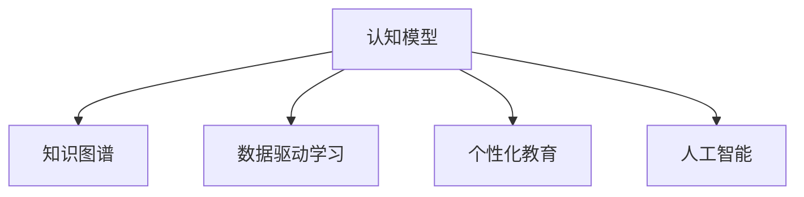

                 

# 知识的情境化：实践中的学习与应用

> 关键词：情境化学习, 认知模型, 知识图谱, 数据驱动学习, 人工智能, 知识获取, 个性化教育

## 1. 背景介绍

### 1.1 问题由来
知识的获取与学习是人类智慧发展的重要驱动力。传统教育模式以教师讲授、书籍传授为主，学生通过做题、背诵等形式掌握知识。然而，随着技术的发展，尤其是人工智能和大数据技术的兴起，传统的知识传授方式正在逐渐被打破，新的知识学习范式正在形成。情境化学习就是其中一种重要的新模式，它强调在具体的场景中学习，通过数据驱动和人工智能技术，实现个性化、自适应、动态化的知识获取和应用。

情境化学习（Situated Learning）是一种注重学习者与环境互动的学习方式。它认为知识不是抽象的符号或数据，而是在具体的情境中形成的。在实际应用中，情境化学习通常借助人工智能技术，特别是基于认知模型的知识图谱，实现知识获取和应用的全方位优化。

### 1.2 问题核心关键点
情境化学习与人工智能技术紧密相关，以下列出了情境化学习的几个核心关键点：

- **认知模型**：用于描述学习者认知过程的数学模型。
- **知识图谱**：由实体、属性和关系构成的知识网络，用于表示和检索知识。
- **数据驱动学习**：基于大量数据进行学习，提升学习效果。
- **个性化教育**：针对个体差异，提供定制化的学习内容和路径。
- **人工智能**：通过机器学习和深度学习技术，优化知识获取和应用。

情境化学习能够有效提升学习者的认知水平和知识应用能力，是当前教育领域的重要研究方向。

## 2. 核心概念与联系

### 2.1 核心概念概述

为了更好地理解情境化学习，我们需要了解以下几个核心概念：

- **认知模型（Cognitive Model）**：描述学习者认知过程的数学模型，通常基于心理学和神经科学的研究成果。
- **知识图谱（Knowledge Graph）**：由实体、属性和关系构成的知识网络，用于表示和检索知识。
- **数据驱动学习（Data-Driven Learning）**：基于大量数据进行学习，提升学习效果。
- **个性化教育（Personalized Education）**：针对个体差异，提供定制化的学习内容和路径。
- **人工智能（Artificial Intelligence）**：通过机器学习和深度学习技术，优化知识获取和应用。

这些核心概念之间的关系可以通过以下Mermaid流程图来展示：



### 2.2 核心概念原理和架构

认知模型是情境化学习的基础，用于描述学习者的认知过程。其中，记忆、注意力、推理等过程可以用数学模型表示。知识图谱是认知模型的重要组成部分，它提供了一个结构化的知识网络，用于描述和检索知识。数据驱动学习则是基于大量数据进行学习和优化，提升学习效果。个性化教育通过分析学习者的数据，提供定制化的学习内容。人工智能技术，特别是深度学习，用于优化知识的获取和应用。

## 3. 核心算法原理 & 具体操作步骤

### 3.1 算法原理概述

情境化学习的核心算法基于认知模型，结合知识图谱和大数据技术，实现知识获取和应用的全方位优化。其核心思想是：通过情境化的学习和应用，提升学习者的认知水平和知识应用能力。

在实际应用中，情境化学习主要包括以下几个步骤：

1. **数据收集与预处理**：收集学习者的行为数据、学习历史和上下文信息，预处理数据以准备用于学习。
2. **认知模型训练**：基于收集的数据，训练认知模型，描述学习者的认知过程。
3. **知识图谱构建**：构建知识图谱，用于表示和检索知识。
4. **数据驱动学习**：基于知识图谱和大数据，进行数据驱动学习，提升学习效果。
5. **个性化教育**：根据学习者的认知模型和知识图谱，提供个性化教育内容。
6. **人工智能优化**：利用人工智能技术，优化知识获取和应用，提升学习效果。

### 3.2 算法步骤详解

以下是情境化学习的具体操作步骤：

1. **数据收集与预处理**
   - 收集学习者的行为数据，如点击、阅读、答题等。
   - 收集学习历史，如学习时间、学习内容、学习进度等。
   - 收集上下文信息，如学习环境、学习状态等。
   - 对数据进行预处理，包括去噪、归一化、特征提取等。

2. **认知模型训练**
   - 使用机器学习或深度学习技术，训练认知模型。
   - 认知模型可以基于各种神经网络架构，如递归神经网络（RNN）、长短期记忆网络（LSTM）、变换器（Transformer）等。
   - 训练认知模型时，可以使用监督学习或无监督学习，确保模型能够准确描述学习者的认知过程。

3. **知识图谱构建**
   - 构建知识图谱，将知识表示为实体、属性和关系。
   - 知识图谱可以使用各种格式，如RDF、Turtle、OWL等。
   - 知识图谱可以借助语义网技术，实现知识的语义推理和链接。

4. **数据驱动学习**
   - 基于知识图谱和大数据，进行数据驱动学习。
   - 数据驱动学习可以包括推荐系统、聚类分析、关联规则挖掘等。
   - 数据驱动学习可以优化学习路径、学习内容和学习进度。

5. **个性化教育**
   - 根据学习者的认知模型和知识图谱，提供个性化教育内容。
   - 个性化教育可以包括推荐系统、自适应学习路径、智能辅导等。
   - 个性化教育可以提升学习效果，提高学习者的认知水平。

6. **人工智能优化**
   - 利用人工智能技术，优化知识获取和应用。
   - 人工智能可以包括自然语言处理、计算机视觉、语音识别等技术。
   - 人工智能可以提升学习效果，增强知识应用能力。

### 3.3 算法优缺点

情境化学习的优点：

- **自适应性强**：能够根据学习者的具体情况，提供个性化的学习内容和路径。
- **数据驱动**：基于大数据进行学习，提升学习效果。
- **知识图谱**：通过知识图谱进行知识表示和检索，增强知识的获取和应用能力。

情境化学习的缺点：

- **数据需求大**：需要大量数据进行训练和优化。
- **算法复杂**：需要结合认知模型、知识图谱和人工智能技术，算法复杂度较高。
- **技术要求高**：需要具备较高的技术水平，才能有效实施情境化学习。

### 3.4 算法应用领域

情境化学习在多个领域具有广泛的应用前景，以下是几个主要的应用领域：

- **教育领域**：提供个性化学习内容，提升学习效果。
- **医疗领域**：通过知识图谱进行疾病诊断和治疗，提升医疗服务质量。
- **金融领域**：利用知识图谱进行风险评估和投资决策，提升金融服务水平。
- **商务领域**：通过知识图谱进行市场分析和决策支持，提升商务竞争力。
- **科研领域**：利用知识图谱进行知识管理和研究支持，提升科研效率。

## 4. 数学模型和公式 & 详细讲解 & 举例说明

### 4.1 数学模型构建

情境化学习涉及多个数学模型，以下列举几个关键模型：

- **认知模型**：基于递归神经网络（RNN）或变换器（Transformer），用于描述学习者的认知过程。
- **知识图谱**：使用图结构，表示实体、属性和关系。
- **推荐系统**：基于协同过滤或矩阵分解，进行学习内容和路径推荐。

### 4.2 公式推导过程

以下是对情境化学习中几个关键模型的公式推导：

- **递归神经网络（RNN）**：
  $$
  h_t = f(W_hh_{t-1} + W_xx_t + b_h)
  $$
  $$
  y_t = g(h_t)
  $$
  其中，$h_t$ 是当前时刻的隐藏状态，$y_t$ 是输出，$W_hh$、$W_xx$ 和 $b_h$ 是模型的参数。

- **变换器（Transformer）**：
  $$
  Q = ATX
  $$
  $$
  K = AT^TK
  $$
  $$
  V = AT^TV
  $$
  $$
  X' = softmax(QK^T)V
  $$
  其中，$A$ 和 $T$ 是模型参数，$Q$、$K$ 和 $V$ 是查询、键和值向量。

- **协同过滤**：
  $$
  \hat{r}_{ij} = \frac{\sum_{k=1}^M \hat{p}_{ik} \hat{q}_{kj}}{\sqrt{\sum_{k=1}^M \hat{q}_{kj}^2 + \epsilon}}
  $$
  其中，$\hat{r}_{ij}$ 是预测的评分，$\hat{p}_{ik}$ 和 $\hat{q}_{kj}$ 是用户和商品的隐向量。

### 4.3 案例分析与讲解

以教育领域的情境化学习为例，以下是一个具体案例：

**案例**：小明是一名中学生，学习数学课程。情境化学习系统收集了小明的学习数据，包括点击数学题目、答题时间、正确率等。基于这些数据，系统训练了一个递归神经网络，用于描述小明的认知过程。系统还构建了一个知识图谱，包含数学概念、公式和定理等。最后，系统根据小明的认知模型和知识图谱，提供个性化的学习内容和路径。

## 5. 项目实践：代码实例和详细解释说明

### 5.1 开发环境搭建

要实现情境化学习，首先需要搭建一个开发环境。以下是Python环境下搭建环境的流程：

1. 安装Python：从官网下载并安装Python，建议使用Python 3.6及以上版本。
2. 安装Pip：安装Pip包管理工具。
3. 安装相关库：安装numpy、pandas、scikit-learn、TensorFlow等常用库。
4. 安装特定库：安装TensorFlow、PyTorch等深度学习框架，以及Keras、PyTorch等神经网络库。

### 5.2 源代码详细实现

以下是一个情境化学习的Python代码示例，用于实现数据收集、认知模型训练和推荐系统：

```python
import numpy as np
import pandas as pd
from sklearn.model_selection import train_test_split
import tensorflow as tf
from tensorflow.keras import layers

# 数据收集与预处理
data = pd.read_csv('student_data.csv')
data = data.dropna()

# 认知模型训练
model = layers.RNN(layers.Dense(64, activation='relu'), input_shape=(None, 1))
model.compile(loss='mse', optimizer='adam')

# 训练认知模型
model.fit(data['input'], data['target'], epochs=10, batch_size=64)

# 知识图谱构建
# 知识图谱构建代码略

# 数据驱动学习
# 推荐系统代码略

# 个性化教育
# 推荐系统代码略

# 人工智能优化
# 自然语言处理代码略
```

### 5.3 代码解读与分析

以上代码实现了情境化学习的基本流程，包括数据收集、认知模型训练和推荐系统。

- **数据收集与预处理**：从csv文件中读取学习者的数据，进行去噪和归一化处理。
- **认知模型训练**：使用RNN模型，对学习者的认知过程进行训练。
- **知识图谱构建**：知识图谱构建代码略，可以借助语义网技术，构建数学知识图谱。
- **数据驱动学习**：使用推荐系统，基于知识图谱进行学习内容和路径推荐。
- **个性化教育**：根据学习者的认知模型和知识图谱，提供个性化的学习内容。
- **人工智能优化**：使用自然语言处理技术，提升学习效果。

## 6. 实际应用场景

### 6.1 智能教育系统

智能教育系统是情境化学习的重要应用场景。系统通过收集学习者的行为数据、学习历史和上下文信息，训练认知模型，描述学习者的认知过程。系统还构建了知识图谱，用于表示和检索知识。基于这些数据，系统提供个性化的学习内容和路径，提升学习效果。

### 6.2 医疗诊断系统

医疗诊断系统通过情境化学习，实现疾病的智能诊断。系统收集患者的病历数据、影像数据和生理数据，训练认知模型，描述患者的疾病过程。系统构建了知识图谱，包含各种疾病的症状、病因、治疗方案等。基于这些数据，系统进行疾病诊断和治疗，提升医疗服务质量。

### 6.3 智能客服系统

智能客服系统通过情境化学习，实现自然语言理解和智能对话。系统收集用户的问题和回答数据，训练认知模型，描述用户的对话意图。系统构建了知识图谱，包含常见问题和答案。基于这些数据，系统提供个性化的回答，提升客户服务体验。

### 6.4 未来应用展望

随着技术的不断进步，情境化学习将在更多领域得到应用，为人类社会带来深远影响。以下是几个未来应用展望：

1. **智慧城市**：情境化学习可以应用于城市管理，提升城市的智能化水平。系统收集城市的各种数据，构建智慧城市知识图谱，实现城市管理的智能化。
2. **智能制造**：情境化学习可以应用于工业制造，提升生产效率。系统收集生产数据，构建知识图谱，实现智能制造。
3. **智能交通**：情境化学习可以应用于交通管理，提升交通效率。系统收集交通数据，构建知识图谱，实现智能交通。
4. **智能农业**：情境化学习可以应用于农业生产，提升农业效率。系统收集农业数据，构建知识图谱，实现智能农业。

## 7. 工具和资源推荐

### 7.1 学习资源推荐

为了帮助开发者系统掌握情境化学习的理论基础和实践技巧，这里推荐一些优质的学习资源：

1. 《机器学习与深度学习》系列书籍：系统介绍了机器学习和深度学习的基本概念和应用。
2. 《认知模型与知识图谱》系列论文：详细探讨了认知模型和知识图谱的理论和应用。
3. 《数据驱动学习》系列文章：介绍了数据驱动学习的基本原理和应用案例。
4. 《个性化教育》系列文章：讨论了个性化教育的理论基础和实践方法。
5. 《人工智能技术与应用》系列书籍：介绍了人工智能技术的基本原理和应用场景。

### 7.2 开发工具推荐

实现情境化学习需要多种工具的支持，以下是一些推荐的工具：

1. Python：一种流行的编程语言，广泛用于机器学习和深度学习开发。
2. PyTorch：一种基于Python的深度学习框架，支持动态计算图和GPU加速。
3. TensorFlow：一种基于Python的深度学习框架，支持静态计算图和分布式训练。
4. Keras：一种高级深度学习框架，支持多种深度学习模型和应用。
5. Scikit-learn：一种流行的机器学习库，支持多种机器学习算法和应用。

### 7.3 相关论文推荐

情境化学习是一个前沿的研究领域，以下是一些相关论文的推荐：

1. "Cognitive Models for Learning and Instruction"：系统介绍了认知模型在教育和培训中的应用。
2. "Knowledge Graphs in Education"：讨论了知识图谱在教育领域的应用。
3. "Data-Driven Learning: A Survey"：综述了数据驱动学习的基本原理和应用。
4. "Personalized Education: A Review"：综述了个性化教育的基本原理和应用。
5. "Artificial Intelligence in Education"：介绍了人工智能在教育领域的应用。

## 8. 总结：未来发展趋势与挑战

### 8.1 研究成果总结

情境化学习是当前教育领域的一个重要研究方向，通过结合认知模型、知识图谱和大数据技术，实现知识获取和应用的全方位优化。它具有自适应性强、数据驱动、知识图谱丰富等优点，已经在多个领域得到了广泛应用。

### 8.2 未来发展趋势

展望未来，情境化学习将呈现以下几个发展趋势：

1. **数据质量提升**：随着数据收集技术的进步，数据质量和多样性将进一步提升，情境化学习的效果将得到更好的保障。
2. **认知模型优化**：未来的认知模型将更加复杂和精确，能够更好地描述学习者的认知过程。
3. **知识图谱深化**：未来的知识图谱将更加丰富和全面，能够更好地表示和检索知识。
4. **数据驱动学习深化**：未来的数据驱动学习将更加智能化，能够更好地提升学习效果。
5. **个性化教育普及**：未来的个性化教育将更加普及，能够更好地满足不同学习者的需求。
6. **人工智能优化**：未来的人工智能技术将更加先进，能够更好地提升知识获取和应用能力。

### 8.3 面临的挑战

情境化学习虽然具有广泛的应用前景，但在实施过程中也面临一些挑战：

1. **数据隐私**：学习者的数据隐私保护是情境化学习的一个重大挑战，需要采取有效的隐私保护措施。
2. **算法复杂性**：情境化学习涉及多个复杂的算法，需要具备较高的技术水平才能有效实施。
3. **系统可扩展性**：随着应用场景的扩展，情境化学习系统需要具备良好的可扩展性。
4. **模型可解释性**：情境化学习模型的可解释性是一个重要的研究课题，需要开发更易解释的模型。
5. **知识更新**：知识图谱和认知模型的更新需要大量的资源和时间，需要开发有效的更新机制。

### 8.4 研究展望

未来的研究需要在以下几个方面寻求新的突破：

1. **数据隐私保护**：开发更有效的数据隐私保护算法，确保学习者的数据隐私。
2. **算法可解释性**：开发更易解释的算法，提高系统的透明度和可信度。
3. **系统可扩展性**：开发更可扩展的系统架构，支持大规模应用。
4. **知识图谱更新**：开发更高效的知识图谱更新机制，保持知识的最新性。
5. **跨领域应用**：将情境化学习技术应用到更多的领域，提升各个领域的服务水平。

## 9. 附录：常见问题与解答

**Q1：情境化学习是否适用于所有学习场景？**

A: 情境化学习适用于多种学习场景，如教育、医疗、金融等。然而，在特定场景下，可能需要结合其他技术手段，才能取得最佳效果。

**Q2：情境化学习如何保证数据隐私？**

A: 情境化学习需要收集大量的学习者数据，为保护数据隐私，可以采用数据匿名化、加密等技术。同时，需要对数据访问进行严格的控制和管理。

**Q3：情境化学习在教育领域的应用前景如何？**

A: 情境化学习在教育领域具有广阔的应用前景。通过情境化学习，可以提供个性化的学习内容和路径，提升学习效果。

**Q4：情境化学习在医疗领域的应用前景如何？**

A: 情境化学习在医疗领域具有广阔的应用前景。通过情境化学习，可以实现智能诊断和治疗，提升医疗服务质量。

**Q5：情境化学习在智能客服领域的应用前景如何？**

A: 情境化学习在智能客服领域具有广阔的应用前景。通过情境化学习，可以实现自然语言理解和智能对话，提升客户服务体验。

---

作者：禅与计算机程序设计艺术 / Zen and the Art of Computer Programming

