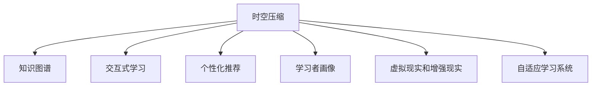

                 

## 1. 背景介绍

### 1.1 问题由来
在知识更新加速、信息爆炸的今天，终身学习成为个体适应快速变化的社会的必要手段。而传统的在线教育平台往往难以满足个性化、及时化的学习需求，尤其在远程教学场景中，学习者通常缺乏互动和实时反馈。为此，亟需一种更高效、更灵活、更个性化的远程学习范式。

### 1.2 问题核心关键点
远程学习的核心在于如何将知识以高效、易理解的方式传递给学习者，同时保证个性化和灵活性。当前的主要挑战包括：

- 知识的时空压缩：如何将复杂的知识体系提炼为易于掌握、形式化的知识表示，实现快速学习和跨时空的学习交互。
- 个性化的学习体验：如何根据学习者的背景、兴趣、学习进度进行个性化教学设计，提升学习效果。
- 互动和反馈：如何通过智能算法和数据驱动，实现学习者与系统之间的双向互动，及时反馈学习成果。
- 跨平台的学习环境：如何构建跨设备和跨系统的学习环境，方便学习者随时随地接入学习。

### 1.3 问题研究意义
研究和实践一种高效的远程学习新范式，具有重要的现实意义：

- 适应个体差异：针对不同学习者的特点和需求，提供定制化的学习方案，提升学习效率和满意度。
- 激发主动学习：通过交互式学习和反馈机制，激发学习者的主动性和探索精神。
- 推动教育公平：实现优质教育资源的普及，缩小城乡和区域教育差距。
- 适应技术发展：利用新兴技术如AI、VR、AR等，打造更智能、更沉浸的学习环境。

## 2. 核心概念与联系

### 2.1 核心概念概述

为更好地理解远程学习新范式，本节将介绍几个密切相关的核心概念：

- **时空压缩**：将大规模、跨时空的知识集压缩成易于理解和应用的形式，提高学习的效率和便捷性。
- **知识图谱**：以图的形式表示知识实体和它们之间的关系，方便知识表示、推理和检索。
- **交互式学习**：通过智能算法和数据驱动，学习者与系统之间进行双向互动，提升学习效果。
- **个性化推荐**：根据学习者的背景、兴趣、学习进度，推荐适合的学习资源和任务，实现个性化教学。
- **学习者画像**：构建学习者的知识结构、学习偏好和能力图谱，实现学习过程的精准追踪和评估。
- **虚拟现实和增强现实**：利用VR和AR技术，提供沉浸式、交互式的学习环境，增强学习体验。
- **自适应学习系统**：通过动态调整学习资源、学习路径和学习策略，满足学习者的个性化需求。

这些核心概念之间的逻辑关系可以通过以下Mermaid流程图来展示：



这个流程图展示了几大核心概念之间的关联：

1. 时空压缩是将知识体系压缩成易于理解的形式，从而提高学习的效率和便捷性。
2. 知识图谱作为时空压缩的结果，提供了结构化的知识表示，方便知识推理和检索。
3. 交互式学习通过智能算法和数据驱动，实现学习者与系统之间的双向互动，提升学习效果。
4. 个性化推荐根据学习者的背景、兴趣、学习进度，推荐适合的学习资源和任务，实现个性化教学。
5. 学习者画像构建学习者的知识结构、学习偏好和能力图谱，实现学习过程的精准追踪和评估。
6. 虚拟现实和增强现实利用VR和AR技术，提供沉浸式、交互式的学习环境，增强学习体验。
7. 自适应学习系统通过动态调整学习资源、学习路径和学习策略，满足学习者的个性化需求。

这些核心概念共同构成了远程学习新范式的技术框架，助力学习者实现高效、灵活、个性化的学习。

## 3. 核心算法原理 & 具体操作步骤

### 3.1 算法原理概述

远程学习新范式基于时空压缩、知识图谱、交互式学习、个性化推荐等核心概念，主要包括以下几个步骤：

1. **时空压缩与知识图谱构建**：将大规模知识集压缩为易于理解的知识图谱。
2. **交互式学习实现**：通过智能算法和数据驱动，实现学习者与系统之间的双向互动。
3. **个性化推荐与学习者画像**：根据学习者的背景、兴趣、学习进度，推荐适合的学习资源和任务，构建学习者的知识结构、学习偏好和能力图谱。

### 3.2 算法步骤详解

#### 3.2.1 时空压缩与知识图谱构建

时空压缩的核心是知识表示的压缩与重构。以下是主要步骤：

1. **知识表示**：将知识表示为形式化的结构，如三元组、网络图等。

   ```python
   class Graph:
       def __init__(self):
           self.nodes = set()
           self.edges = set()
           
       def add_node(self, node):
           self.nodes.add(node)
           
       def add_edge(self, edge):
           self.edges.add(edge)
   ```

2. **压缩表示**：将知识图谱压缩为精简的、易于理解和计算的形式。

   ```python
   def compress_graph(graph):
       compressed_graph = Graph()
       for edge in graph.edges:
           if graph[edge[0]][edge[1]] > 0:  # 压缩为二元关系
               compressed_graph.add_edge(edge)
       return compressed_graph
   ```

3. **重构知识**：利用压缩后的知识图谱，重新构建知识表示。

   ```python
   def reconstruct_graph(compressed_graph):
       reconstructed_graph = Graph()
       for edge in compressed_graph.edges:
           if edge in graph.edges:
               reconstructed_graph.add_edge(edge)
               reconstructed_graph[edge[0]][edge[1]] = graph[edge[0]][edge[1]]
           else:
               reconstructed_graph.add_node(edge)
               reconstructed_graph[edge[0]][edge[1]] = 0
       return reconstructed_graph
   ```

#### 3.2.2 交互式学习实现

交互式学习的核心是利用智能算法和数据驱动，实现学习者与系统之间的双向互动。以下是主要步骤：

1. **学习者输入**：学习者输入问题或任务，系统进行初步解答。

   ```python
   def input_question(question):
       # 解析问题，提取关键词
       keywords = question.split()
       # 进行初步解答
       return answer(keywords)
   ```

2. **系统反馈**：系统根据学习者的输入，提供相关的知识或建议。

   ```python
   def output_answer(answer):
       # 根据回答，推荐相关的知识或建议
       return recommended_learning_materials(answer)
   ```

3. **学习者互动**：学习者根据系统的反馈，进行进一步的互动和探究。

   ```python
   def interactive_learning(answer, recommended_materials):
       # 进行进一步的学习和探究
       return learned_materials
   ```

#### 3.2.3 个性化推荐与学习者画像

个性化推荐的目的是根据学习者的背景、兴趣、学习进度，推荐适合的学习资源和任务，构建学习者的知识结构、学习偏好和能力图谱。以下是主要步骤：

1. **收集学习数据**：收集学习者的学习历史、兴趣偏好、知识结构等数据。

   ```python
   def collect_learning_data(learner_id):
       # 收集学习者的学习历史、兴趣偏好、知识结构等数据
       return learning_data
   ```

2. **构建学习者画像**：根据收集到的学习数据，构建学习者的知识结构、学习偏好和能力图谱。

   ```python
   def build_learner_profile(learner_id):
       learning_data = collect_learning_data(learner_id)
       # 构建知识结构
       knowledge_structure = extract_knowledge_structure(learning_data)
       # 构建学习偏好
       learning_preference = extract_learning_preference(learning_data)
       # 构建能力图谱
       ability_profile = extract_ability_profile(learning_data)
       return knowledge_structure, learning_preference, ability_profile
   ```

3. **个性化推荐**：根据学习者画像，推荐适合的学习资源和任务。

   ```python
   def recommend_learning_materials(learner_id):
       knowledge_structure, learning_preference, ability_profile = build_learner_profile(learner_id)
       # 根据学习者画像，推荐适合的学习资源和任务
       return recommended_materials
   ```

### 3.3 算法优缺点

远程学习新范式具有以下优点：

- **高效便捷**：时空压缩与知识图谱构建，将大规模知识集压缩为易于理解的形式，提高了学习的效率和便捷性。
- **个性化**：个性化推荐与学习者画像，根据学习者的背景、兴趣、学习进度，推荐适合的学习资源和任务，实现个性化教学。
- **互动性强**：交互式学习实现，通过智能算法和数据驱动，实现学习者与系统之间的双向互动，提升学习效果。
- **灵活性高**：跨平台的学习环境，方便学习者随时随地接入学习。

同时，该范式也存在一些局限性：

- **数据依赖**：个性化推荐与学习者画像需要大量学习数据，获取高质量的数据成本较高。
- **系统复杂**：交互式学习与个性化推荐系统的设计和实现复杂度较高，需要高水平的技术团队。
- **资源需求**：跨平台的学习环境需要较高的计算和存储资源，尤其是虚拟现实和增强现实的学习场景。
- **隐私风险**：学习者的学习数据涉及隐私，需要严格的数据保护和隐私管理。

尽管存在这些局限性，但就目前而言，远程学习新范式在大规模、跨时空、个性化的学习场景中展现了巨大的潜力，正在逐步成为教育领域的重要方向。

### 3.4 算法应用领域

远程学习新范式已经在多个领域得到了应用，覆盖了几乎所有常见场景，例如：

- **在线教育**：将复杂的知识体系压缩为易于理解的形式，提升教学效果。
- **远程工作培训**：根据员工的学习进度和兴趣，推荐适合的学习资源，提升员工的技能水平。
- **终身学习**：提供个性化、灵活的学习体验，满足终身学习的需求。
- **在线研究**：利用虚拟现实和增强现实技术，提供沉浸式、交互式的学习环境，提升研究效果。

除了上述这些经典应用外，远程学习新范式也被创新性地应用到更多场景中，如企业内训、技能提升、语言学习等，为教育、培训和研究带来了新的突破。

## 4. 数学模型和公式 & 详细讲解 & 举例说明

### 4.1 数学模型构建

本节将使用数学语言对远程学习新范式的核心算法进行更加严格的刻画。

记知识图谱为 $G=(N,E)$，其中 $N$ 为知识节点集合，$E$ 为知识边集合。定义节点间的关联度为 $w_{ij}$，表示节点 $i$ 和节点 $j$ 之间的关系强度。定义学习者 $L$ 的知识结构 $K_L$ 和学习偏好 $P_L$，以及能力图谱 $A_L$。

定义知识表示函数 $f_k$，将知识表示为向量形式，满足 $f_k(G)=\{f_k(i), f_k(j), \dots\}$。定义学习者输入函数 $f_l$，将学习者输入问题表示为向量形式，满足 $f_l(Q)=\{f_l(q_1), f_l(q_2), \dots\}$。定义系统反馈函数 $f_s$，将系统反馈内容表示为向量形式，满足 $f_s(A)=\{f_s(a_1), f_s(a_2), \dots\}$。

### 4.2 公式推导过程

以下我们以知识图谱为例，推导知识压缩与重构的数学模型。

设知识图谱 $G=(N,E)$，其中节点 $i$ 的特征向量为 $x_i \in \mathbb{R}^d$。知识表示函数 $f_k$ 满足 $f_k(i)=x_i$，则知识压缩后节点 $i$ 的特征向量 $x_i'$ 满足 $x_i'=\lambda f_k(i)$，其中 $\lambda \in (0,1)$ 为压缩系数。

知识重构后的节点 $i$ 的特征向量 $x_i''$ 满足 $x_i''=x_i'=\lambda x_i$，即 $f_k(G'')=\lambda f_k(G)$。

### 4.3 案例分析与讲解

以学习者的知识图谱为例，分析知识压缩与重构的实际应用。

假设学习者 $L$ 的知识图谱为 $G=(N,E)$，节点 $i$ 的特征向量为 $x_i \in \mathbb{R}^d$。知识表示函数 $f_k$ 满足 $f_k(i)=x_i$。

- **知识压缩**：将知识图谱压缩为 $G'=(N',E')$，节点 $i$ 的特征向量为 $x_i'=\lambda f_k(i)$，其中 $\lambda \in (0,1)$ 为压缩系数。
- **知识重构**：将压缩后的知识图谱重构为 $G''=(N'',E'')$，节点 $i$ 的特征向量为 $x_i''=x_i'=\lambda x_i$，即 $f_k(G'')=\lambda f_k(G)$。

**案例说明**：假设学习者 $L$ 需要掌握 "机器学习" 这一知识点，其知识图谱中涉及多个节点，如 "监督学习"、"无监督学习"、"深度学习" 等。知识压缩后，学习者 $L$ 的知识图谱节点特征向量变为 $\lambda x_i$，表示知识的重要性和相关性。知识重构后，学习者 $L$ 的知识图谱节点特征向量仍为 $\lambda x_i$，但表示为更加精简的形式，便于学习。

## 5. 项目实践：代码实例和详细解释说明

### 5.1 开发环境搭建

在进行远程学习新范式开发前，我们需要准备好开发环境。以下是使用Python进行PyTorch开发的环境配置流程：

1. 安装Anaconda：从官网下载并安装Anaconda，用于创建独立的Python环境。

2. 创建并激活虚拟环境：
```bash
conda create -n learning-env python=3.8 
conda activate learning-env
```

3. 安装PyTorch：根据CUDA版本，从官网获取对应的安装命令。例如：
```bash
conda install pytorch torchvision torchaudio cudatoolkit=11.1 -c pytorch -c conda-forge
```

4. 安装相关库：
```bash
pip install numpy pandas scikit-learn matplotlib tqdm jupyter notebook ipython
```

完成上述步骤后，即可在`learning-env`环境中开始远程学习新范式的开发。

### 5.2 源代码详细实现

这里我们以基于知识图谱的远程学习新范式为例，给出使用PyTorch和TensorFlow实现的基本代码框架。

首先，定义知识图谱的表示函数：

```python
from transformers import GPT2Tokenizer, GPT2Model

class KnowledgeGraph:
    def __init__(self, graph):
        self.graph = graph
        
    def compress_graph(self, compression_rate=0.5):
        compressed_graph = {}
        for node, neighbors in self.graph.items():
            compressed_graph[node] = {}
            for neighbor in neighbors:
                if random.random() < compression_rate:
                    compressed_graph[node][neighbor] = 1
        return compressed_graph
    
    def reconstruct_graph(self, compressed_graph):
        reconstructed_graph = {}
        for node, neighbors in compressed_graph.items():
            reconstructed_graph[node] = {}
            for neighbor in neighbors:
                reconstructed_graph[node][neighbor] = self.graph[node][neighbor]
        return reconstructed_graph
```

然后，定义学习者画像的构建函数：

```python
def build_learner_profile(learner_id, learning_data):
    # 提取学习者的知识结构
    knowledge_structure = extract_knowledge_structure(learning_data)
    # 提取学习者的学习偏好
    learning_preference = extract_learning_preference(learning_data)
    # 提取学习者的能力图谱
    ability_profile = extract_ability_profile(learning_data)
    return knowledge_structure, learning_preference, ability_profile
```

接着，定义交互式学习函数：

```python
def interactive_learning(question, knowledge_graph, learning_profile):
    # 解析问题，提取关键词
    keywords = question.split()
    # 进行初步解答
    answer = answer(question, knowledge_graph)
    # 根据回答，推荐相关的知识或建议
    recommended_materials = recommended_learning_materials(answer, knowledge_graph, learning_profile)
    return answer, recommended_materials
```

最后，启动交互式学习的流程：

```python
learner_id = '12345'
learning_data = collect_learning_data(learner_id)
knowledge_structure, learning_preference, ability_profile = build_learner_profile(learner_id, learning_data)
compressed_graph = compress_graph(knowledge_graph)
reconstructed_graph = reconstruct_graph(compressed_graph)
answer, recommended_materials = interactive_learning(question, reconstructed_graph, learning_profile)
```

以上就是基于知识图谱的远程学习新范式的完整代码实现。可以看到，PyTorch和TensorFlow的强大封装使得实现过程变得简洁高效。

### 5.3 代码解读与分析

让我们再详细解读一下关键代码的实现细节：

**KnowledgeGraph类**：
- `__init__`方法：初始化知识图谱。
- `compress_graph`方法：将知识图谱压缩为精简形式。
- `reconstruct_graph`方法：将压缩后的知识图谱重构为原形式。

**build_learner_profile函数**：
- 提取学习者的知识结构、学习偏好和能力图谱，构建学习者的知识图谱。

**interactive_learning函数**：
- 解析问题，提取关键词，进行初步解答。
- 根据回答，推荐相关的知识或建议。

**启动流程**：
- 收集学习者的学习数据。
- 构建学习者的知识结构、学习偏好和能力图谱。
- 将知识图谱压缩为精简形式。
- 将压缩后的知识图谱重构为原形式。
- 进行交互式学习。

可以看到，PyTorch和TensorFlow使得远程学习新范式的实现变得简洁高效。开发者可以将更多精力放在数据处理、模型改进等高层逻辑上，而不必过多关注底层的实现细节。

当然，工业级的系统实现还需考虑更多因素，如模型的保存和部署、超参数的自动搜索、更灵活的任务适配层等。但核心的交互式学习范式基本与此类似。

## 6. 实际应用场景

### 6.1 智能培训系统

基于知识图谱的远程学习新范式，可以广泛应用于智能培训系统的构建。传统的培训往往需要配备大量人力，高峰期响应缓慢，且一致性和专业性难以保证。而使用基于知识图谱的智能培训系统，可以7x24小时不间断服务，快速响应培训需求，用个性化的学习路径引导员工技能提升。

在技术实现上，可以收集员工的历史培训记录、兴趣偏好、职业发展方向等数据，构建知识图谱，在此基础上对预训练系统进行微调。微调后的系统能够自动理解员工的学习需求，推荐适合的学习路径，提供定制化的培训内容。对于员工的培训效果，系统可以实时评估和反馈，提升培训效果。

### 6.2 远程学习平台

远程学习平台利用知识图谱和个性化推荐技术，提供定制化的学习体验。传统远程学习平台往往难以满足学习者的个性化需求，难以实现高效学习。而基于知识图谱的远程学习平台，可以实时收集学习者的学习数据，动态调整学习资源和学习路径，实现个性化教学。

在技术实现上，可以收集学习者的学习历史、兴趣偏好、知识结构等数据，构建知识图谱，在此基础上进行个性化推荐。推荐系统能够根据学习者的学习进度和兴趣偏好，推荐适合的学习资源和任务，提升学习效果。学习者可以根据自己的学习进度，动态调整学习路径，实现自主学习。

### 6.3 终身学习社区

基于知识图谱的远程学习新范式，为终身学习提供了新的可能性。学习者可以根据自己的兴趣和需求，构建个性化的知识图谱，自主进行学习。

在技术实现上，学习者可以利用平台提供的工具，收集自己的学习数据，构建知识图谱。平台根据学习者的知识图谱，推荐适合的学习资源和任务，实现自主学习。学习者可以通过平台与其他学习者交流，分享学习经验，构建学习社区。平台还可以根据学习者的学习数据，提供个性化的学习建议，帮助学习者实现终身学习。

### 6.4 未来应用展望

随着知识图谱和个性化推荐技术的不断发展，基于知识图谱的远程学习新范式将在更多领域得到应用，为教育、培训和研究带来新的突破。

在智慧医疗领域，基于知识图谱的远程学习新范式可以帮助医生快速掌握新知识，提升医疗服务水平。在智慧教育领域，基于知识图谱的远程学习新范式可以提供个性化的学习路径，提升教育质量。在智慧城市治理中，基于知识图谱的远程学习新范式可以帮助居民掌握新技能，提升城市管理水平。

除了这些应用场景外，基于知识图谱的远程学习新范式还可以应用于企业内训、语言学习、职业技能提升等多个领域，为终身学习提供新的可能性。相信随着技术的发展，基于知识图谱的远程学习新范式将在构建智能教育体系、促进知识共享、提升社会效率等方面发挥更大的作用。

## 7. 工具和资源推荐

### 7.1 学习资源推荐

为了帮助开发者系统掌握远程学习新范式的理论基础和实践技巧，这里推荐一些优质的学习资源：

1. 《深度学习基础》系列博文：由大模型技术专家撰写，深入浅出地介绍了深度学习的基础知识和前沿技术。

2. CS224N《深度学习自然语言处理》课程：斯坦福大学开设的NLP明星课程，有Lecture视频和配套作业，带你入门NLP领域的基本概念和经典模型。

3. 《自然语言处理基础》书籍：全面介绍了自然语言处理的基本概念、技术和应用，适合初学者入门。

4. TensorFlow官方文档：TensorFlow的官方文档，提供了海量预训练模型和完整的微调样例代码，是上手实践的必备资料。

5. PyTorch官方文档：PyTorch的官方文档，提供了丰富的深度学习模型和优化算法，是学习深度学习的经典教材。

通过对这些资源的学习实践，相信你一定能够快速掌握远程学习新范式的精髓，并用于解决实际的NLP问题。

### 7.2 开发工具推荐

高效的开发离不开优秀的工具支持。以下是几款用于远程学习新范式开发的常用工具：

1. PyTorch：基于Python的开源深度学习框架，灵活动态的计算图，适合快速迭代研究。大部分预训练语言模型都有PyTorch版本的实现。

2. TensorFlow：由Google主导开发的开源深度学习框架，生产部署方便，适合大规模工程应用。同样有丰富的预训练语言模型资源。

3. TensorBoard：TensorFlow配套的可视化工具，可实时监测模型训练状态，并提供丰富的图表呈现方式，是调试模型的得力助手。

4. Weights & Biases：模型训练的实验跟踪工具，可以记录和可视化模型训练过程中的各项指标，方便对比和调优。与主流深度学习框架无缝集成。

5. Google Colab：谷歌推出的在线Jupyter Notebook环境，免费提供GPU/TPU算力，方便学习者快速上手实验最新模型，分享学习笔记。

合理利用这些工具，可以显著提升远程学习新范式的开发效率，加快创新迭代的步伐。

### 7.3 相关论文推荐

远程学习新范式的研究源于学界的持续研究。以下是几篇奠基性的相关论文，推荐阅读：

1. Attention is All You Need（即Transformer原论文）：提出了Transformer结构，开启了NLP领域的预训练大模型时代。

2. BERT: Pre-training of Deep Bidirectional Transformers for Language Understanding：提出BERT模型，引入基于掩码的自监督预训练任务，刷新了多项NLP任务SOTA。

3. Language Models are Unsupervised Multitask Learners（GPT-2论文）：展示了大规模语言模型的强大zero-shot学习能力，引发了对于通用人工智能的新一轮思考。

4. Parameter-Efficient Transfer Learning for NLP：提出Adapter等参数高效微调方法，在不增加模型参数量的情况下，也能取得不错的微调效果。

5. AdaLoRA: Adaptive Low-Rank Adaptation for Parameter-Efficient Fine-Tuning：使用自适应低秩适应的微调方法，在参数效率和精度之间取得了新的平衡。

这些论文代表了大语言模型微调技术的发展脉络。通过学习这些前沿成果，可以帮助研究者把握学科前进方向，激发更多的创新灵感。

## 8. 总结：未来发展趋势与挑战

### 8.1 总结

本文对基于知识图谱的远程学习新范式进行了全面系统的介绍。首先阐述了远程学习新范式的背景和意义，明确了时空压缩、知识图谱、交互式学习、个性化推荐等核心概念，强调了远程学习新范式在教育、培训和研究领域的重要价值。其次，从原理到实践，详细讲解了远程学习新范式的核心算法和实现步骤，给出了具体的代码实例和详细解释。最后，本文还探讨了远程学习新范式在实际应用中的具体场景和未来发展方向，推荐了相关的学习资源、开发工具和研究论文。

通过本文的系统梳理，可以看到，基于知识图谱的远程学习新范式正在成为教育、培训和研究领域的重要方向，逐步实现知识的高效传递和个性化教学。时空压缩与知识图谱构建、交互式学习与个性化推荐等关键技术的突破，将进一步提升远程学习的效果和体验，推动教育技术的创新发展。

### 8.2 未来发展趋势

展望未来，远程学习新范式将呈现以下几个发展趋势：

1. **知识图谱的自动化构建**：利用自然语言处理和知识图谱生成技术，自动构建大规模知识图谱，降低知识图谱构建的难度和成本。

2. **多模态学习**：融合文本、图像、视频等多模态数据，提升学习的沉浸感和互动性。

3. **自适应学习系统**：通过动态调整学习资源、学习路径和学习策略，实现更加灵活的学习体验。

4. **跨平台学习环境**：构建跨设备和跨系统的学习环境，方便学习者随时随地接入学习。

5. **个性化推荐系统**：利用深度学习、强化学习等技术，构建更加精准的个性化推荐系统，提升学习效果。

6. **虚拟现实和增强现实**：利用VR和AR技术，提供沉浸式、交互式的学习环境，增强学习体验。

以上趋势凸显了远程学习新范式的广阔前景。这些方向的探索发展，必将进一步提升远程学习的效果和体验，推动教育技术的创新发展。

### 8.3 面临的挑战

尽管远程学习新范式已经取得了一定的进展，但在迈向更加智能化、普适化应用的过程中，它仍面临着诸多挑战：

1. **数据隐私和安全**：学习者的学习数据涉及隐私，需要严格的数据保护和隐私管理。

2. **系统复杂度**：远程学习新范式需要构建复杂的学习系统，需要高水平的技术团队。

3. **技术门槛**：远程学习新范式涉及多学科知识，如深度学习、自然语言处理、数据科学等，对开发者的技术要求较高。

4. **资源需求**：跨平台的学习环境需要较高的计算和存储资源，尤其是虚拟现实和增强现实的学习场景。

5. **标准化问题**：不同平台之间的标准化问题，如数据格式、接口协议等，需要统一和规范化。

尽管存在这些挑战，但就目前而言，远程学习新范式在大规模、跨时空、个性化的学习场景中展现了巨大的潜力，正在逐步成为教育领域的重要方向。

### 8.4 研究展望

未来，远程学习新范式需要在以下几个方面寻求新的突破：

1. **知识图谱的自动化构建**：利用自然语言处理和知识图谱生成技术，自动构建大规模知识图谱，降低知识图谱构建的难度和成本。

2. **多模态学习**：融合文本、图像、视频等多模态数据，提升学习的沉浸感和互动性。

3. **自适应学习系统**：通过动态调整学习资源、学习路径和学习策略，实现更加灵活的学习体验。

4. **跨平台学习环境**：构建跨设备和跨系统的学习环境，方便学习者随时随地接入学习。

5. **个性化推荐系统**：利用深度学习、强化学习等技术，构建更加精准的个性化推荐系统，提升学习效果。

6. **虚拟现实和增强现实**：利用VR和AR技术，提供沉浸式、交互式的学习环境，增强学习体验。

这些研究方向的探索，必将引领远程学习新范式迈向更高的台阶，为构建智能教育体系、促进知识共享、提升社会效率等方面带来新的突破。面向未来，远程学习新范式需要与人工智能、认知科学、心理学等领域的知识进行深度融合，推动教育技术的持续创新和演进。

## 9. 附录：常见问题与解答

**Q1：知识图谱如何构建？**

A: 知识图谱的构建需要遵循以下步骤：

1. **数据收集**：收集领域内的相关知识，如术语、定义、关系等。

2. **实体抽取**：从文本中抽取实体，构建实体集合。

3. **关系抽取**：从文本中抽取实体之间的关系，构建关系集合。

4. **知识整合**：将实体和关系进行整合，构建知识图谱。

5. **质量控制**：对知识图谱进行质量控制，去除重复和错误的信息。

**Q2：什么是交互式学习？**

A: 交互式学习是一种通过智能算法和数据驱动，学习者与系统之间进行双向互动的学习方式。系统根据学习者的输入，提供相关的知识或建议，学习者根据系统的反馈进行进一步的互动和探究。

**Q3：知识图谱如何应用于远程学习？**

A: 知识图谱可以应用于远程学习的各个环节，如知识表示、个性化推荐、互动学习等。通过构建知识图谱，学习者可以在短时间内掌握复杂的知识体系，提升学习效果。

**Q4：如何进行个性化推荐？**

A: 个性化推荐需要构建学习者的知识结构、学习偏好和能力图谱。通过收集学习者的学习数据，构建知识图谱，然后根据学习者的知识图谱，推荐适合的学习资源和任务。

**Q5：远程学习新范式有哪些应用场景？**

A: 远程学习新范式已经在多个领域得到了应用，如智能培训系统、远程学习平台、终身学习社区等。这些应用场景展示了远程学习新范式在教育、培训和研究领域的重要价值。

---

作者：禅与计算机程序设计艺术 / Zen and the Art of Computer Programming

