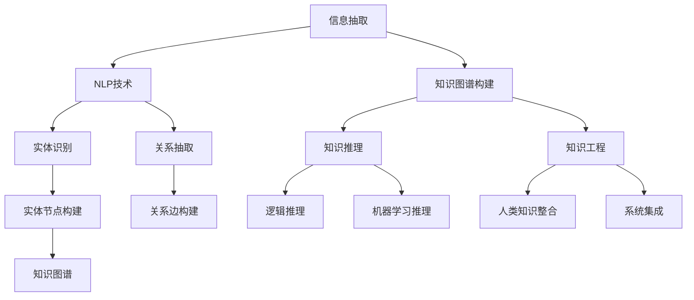

                 

# 知识的本质：从信息到智慧的转化

> 关键词：知识图谱, 信息抽取, 自然语言处理, 知识推理, 知识工程, 深度学习

## 1. 背景介绍

### 1.1 问题由来

在信息爆炸的数字化时代，知识的获取、存储、检索、应用变得越来越复杂。传统的信息管理系统，如数据库、搜索引擎、文档管理系统等，已难以应对日益增长的知识需求和日益复杂的知识结构。面对海量的异构数据，如何构建高效、智能的知识系统，实现知识的自动抽取、组织、推理和应用，成为亟待解决的重要问题。

本文将从信息抽取、知识图谱、知识推理等角度，探讨知识本质的转化过程，介绍如何通过深度学习、自然语言处理等技术手段，将零散的、异构的信息转化为结构化的、可推理的智慧知识。

### 1.2 问题核心关键点

本文将重点讨论以下核心问题：

- 信息抽取(Information Extraction)：如何从文本、图像、视频等多源数据中，自动提取有用的实体、关系、事件等信息，构建初始知识图谱。
- 知识图谱(Knowledge Graph)：如何构建高效、准确的知识图谱，支持知识的自动推理和应用。
- 知识推理(Knowledge Reasoning)：如何利用知识图谱，通过逻辑推理和机器学习，实现复杂的知识理解和应用。
- 知识工程(Knowledge Engineering)：如何将人类知识与机器学习结合，构建智能化的知识系统。

这些核心问题构成了从信息到智慧转化的全链条，是当前知识工程领域的重要研究方向。

## 2. 核心概念与联系

### 2.1 核心概念概述

为更好地理解知识本质的转化过程，本节将介绍几个密切相关的核心概念：

- 知识图谱(Knowledge Graph)：一种结构化的知识表示方式，由节点(实体)和边(关系)组成，用于表示实体间的语义关系。
- 信息抽取(Information Extraction)：从结构化和非结构化数据中自动抽取实体、关系等信息，构建知识图谱的初始数据源。
- 自然语言处理(Natural Language Processing, NLP)：使计算机能够理解、处理和生成人类语言的技术，涉及词法分析、句法分析、语义分析等多个方面。
- 知识推理(Knowledge Reasoning)：通过逻辑推理、机器学习等技术，在知识图谱上进行推理，获取新的知识，或验证已有知识。
- 知识工程(Knowledge Engineering)：将人类知识、专家经验与人工智能技术结合，构建智能化的知识系统。

这些核心概念之间的逻辑关系可以通过以下Mermaid流程图来展示：



这个流程图展示了几者之间的逻辑关系：

1. 信息抽取通过NLP技术识别实体、关系等关键信息，构建初始的知识图谱。
2. 知识图谱提供结构化的知识表示，支持知识推理和应用。
3. 知识推理包括逻辑推理和机器学习推理，在知识图谱上获取新知识或验证已有知识。
4. 知识工程将人类知识与AI技术结合，构建智能化的知识系统。

这些概念共同构成了从信息到智慧转化的技术框架，使计算机能够理解、处理和应用人类知识。

## 3. 核心算法原理 & 具体操作步骤

### 3.1 算法原理概述

从信息到智慧的转化过程，本质上是一个知识抽取、组织、推理和应用的过程。其核心思想是：通过深度学习、自然语言处理等技术手段，自动从文本、图像、视频等数据源中提取实体、关系等信息，构建结构化的知识图谱，并在知识图谱上进行推理，获取新的知识，或验证已有知识，最终实现知识的应用。

形式化地，假设数据源为 $\mathcal{D}$，构建的知识图谱为 $G=(\mathcal{E},\mathcal{R})$，其中 $\mathcal{E}$ 为实体集合，$\mathcal{R}$ 为关系集合。信息抽取的目标是从 $\mathcal{D}$ 中提取实体和关系，构建初始知识图谱 $\hat{G}=(\hat{\mathcal{E}},\hat{\mathcal{R}})$，然后通过知识推理，从 $\hat{G}$ 中获取新知识 $G$。

### 3.2 算法步骤详解

基于深度学习和自然语言处理的知识转化过程，一般包括以下几个关键步骤：

**Step 1: 数据预处理与标注**

- 收集文本、图像、视频等多源数据，清洗去噪，构建数据集 $\mathcal{D}$。
- 通过人工标注或半自动标注，构建实体-关系三元组标注数据集 $\mathcal{L}$。
- 使用标注数据集 $\mathcal{L}$ 训练模型，以自动提取实体、关系等信息。

**Step 2: 信息抽取**

- 使用实体识别模型，从文本、图像、视频中自动提取实体信息。
- 使用关系抽取模型，识别实体之间的关系。
- 将提取的实体和关系信息，构建初始知识图谱 $\hat{G}=(\hat{\mathcal{E}},\hat{\mathcal{R}})$。

**Step 3: 知识图谱构建**

- 将初始知识图谱 $\hat{G}=(\hat{\mathcal{E}},\hat{\mathcal{R}})$ 进行合并、去重、标准化等处理，构建最终知识图谱 $G=(\mathcal{E},\mathcal{R})$。

**Step 4: 知识推理**

- 在知识图谱 $G$ 上，使用逻辑推理或机器学习推理模型，获取新知识或验证已有知识。
- 对推理结果进行后处理，去除冗余、错误的信息，构建推理结果集 $R$。

**Step 5: 知识应用**

- 根据推理结果集 $R$，构建知识应用系统，支持决策支持、智能推荐、自然语言问答等功能。
- 持续收集新数据，更新知识图谱和推理模型，实现知识系统的动态更新。

### 3.3 算法优缺点

基于深度学习和自然语言处理的知识转化方法具有以下优点：

1. 自动化程度高。无需人工标注数据，可以自动从海量数据中抽取关键信息。
2. 灵活性高。适用于各种数据源，包括文本、图像、视频等，具有更广泛的应用场景。
3. 可扩展性强。知识图谱和推理模型可以持续更新，支持知识系统的动态扩展。

同时，该方法也存在一定的局限性：

1. 数据质量依赖度高。依赖标注数据的质量和数量，标注数据的不足可能导致抽取结果的偏差。
2. 计算复杂度高。深度学习和自然语言处理模型对计算资源需求较高，训练和推理过程较耗时。
3. 解释性不足。深度学习模型往往具有"黑盒"特性，难以解释其内部工作机制。

尽管存在这些局限性，但就目前而言，基于深度学习和自然语言处理的知识转化方法仍是目前最先进、最有效的技术手段。

### 3.4 算法应用领域

基于深度学习和自然语言处理的知识转化方法，已经在知识抽取、知识图谱构建、知识推理等多个领域得到了广泛应用，例如：

- 新闻事件抽取：从新闻文章中自动抽取时间、地点、人物、事件等信息，构建事件知识图谱。
- 产品推荐系统：利用用户行为数据，抽取用户实体和产品实体之间的关系，构建推荐知识图谱，实现智能推荐。
- 智能问答系统：利用问答数据，抽取问题和答案实体，构建知识图谱，支持自然语言问答。
- 医疗知识图谱：利用医疗数据，抽取疾病、药物、症状等信息，构建医疗知识图谱，支持医疗决策。
- 金融知识图谱：利用金融数据，抽取市场事件、公司信息、交易数据等，构建金融知识图谱，支持金融分析。

除了上述这些经典应用外，知识转化方法还在社交网络分析、网络安全监控、情感分析等多个领域得到应用，展现了其强大的适用性。

## 4. 数学模型和公式 & 详细讲解 & 举例说明

### 4.1 数学模型构建

本节将使用数学语言对知识本质的转化过程进行更加严格的刻画。

假设数据源 $\mathcal{D}=\{d_i\}_{i=1}^N$，其中 $d_i=(x_i,y_i)$，$x_i$ 为输入数据，$y_i$ 为标注数据。构建的知识图谱 $G=(\mathcal{E},\mathcal{R})$，其中 $\mathcal{E}$ 为实体集合，$\mathcal{R}$ 为关系集合。

定义实体识别模型为 $E_{\theta}:\mathcal{D}\rightarrow\mathcal{E}$，关系抽取模型为 $R_{\theta}:\mathcal{D}\rightarrow\mathcal{R}$，推理模型为 $P_{\theta}:\mathcal{G}\rightarrow\mathcal{G}$，其中 $\mathcal{G}$ 为知识图谱。

定义信息抽取的目标函数为：

$$
\mathcal{L}_{IE}(\theta) = \frac{1}{N}\sum_{i=1}^N [\mathcal{L}_{E}(E_{\theta}(x_i)) + \mathcal{L}_{R}(R_{\theta}(x_i))]
$$

其中 $\mathcal{L}_{E}$ 为实体识别模型的损失函数，$\mathcal{L}_{R}$ 为关系抽取模型的损失函数。

定义知识图谱构建的目标函数为：

$$
\mathcal{L}_{KG}(\theta) = \frac{1}{N}\sum_{i=1}^N [\mathcal{L}_{E}(E_{\theta}(x_i)) + \mathcal{L}_{R}(R_{\theta}(x_i))]
$$

其中 $\mathcal{L}_{E}$ 为实体识别模型的损失函数，$\mathcal{L}_{R}$ 为关系抽取模型的损失函数。

定义知识推理的目标函数为：

$$
\mathcal{L}_{RP}(\theta) = \frac{1}{N}\sum_{i=1}^N [\mathcal{L}_{E}(E_{\theta}(\hat{G})) + \mathcal{L}_{R}(R_{\theta}(\hat{G}))]
$$

其中 $\mathcal{L}_{E}$ 为实体识别模型的损失函数，$\mathcal{L}_{R}$ 为关系抽取模型的损失函数。

### 4.2 公式推导过程

以下我们以实体识别为例，推导其数学模型及其梯度计算。

假设实体识别模型 $E_{\theta}(x_i)=[(e_i,b_i)_{i=1}^n]$，其中 $e_i$ 为实体的类型标签，$b_i$ 为实体的置信度分数。则实体识别模型的目标函数为：

$$
\mathcal{L}_{E}(E_{\theta}(x_i)) = -\sum_{i=1}^n y_i\log p(e_i|x_i) + (1-y_i)\log(1-p(e_i|x_i))
$$

其中 $p(e_i|x_i)$ 为实体类型 $e_i$ 的条件概率。

根据链式法则，实体识别模型的梯度为：

$$
\nabla_{\theta}\mathcal{L}_{E}(E_{\theta}(x_i)) = -\sum_{i=1}^n \nabla_{\theta}p(e_i|x_i)\frac{\partial p(e_i|x_i)}{\partial \theta}
$$

在得到实体识别模型的梯度后，即可带入目标函数，完成模型的训练优化。重复上述过程直至收敛，最终得到最优的实体识别模型参数 $\theta^*$。

## 5. 项目实践：代码实例和详细解释说明

### 5.1 开发环境搭建

在进行知识转化实践前，我们需要准备好开发环境。以下是使用Python进行TensorFlow开发的环境配置流程：

1. 安装Anaconda：从官网下载并安装Anaconda，用于创建独立的Python环境。

2. 创建并激活虚拟环境：
```bash
conda create -n tensorflow-env python=3.8 
conda activate tensorflow-env
```

3. 安装TensorFlow：根据CUDA版本，从官网获取对应的安装命令。例如：
```bash
conda install tensorflow=2.7.0
```

4. 安装各类工具包：
```bash
pip install numpy pandas scikit-learn matplotlib tqdm jupyter notebook ipython
```

完成上述步骤后，即可在`tensorflow-env`环境中开始知识转化实践。

### 5.2 源代码详细实现

这里我们以实体识别为例，给出使用TensorFlow实现的知识转化代码。

首先，定义实体识别模型的参数化函数：

```python
import tensorflow as tf

class EntityRecognition(tf.keras.Model):
    def __init__(self, num_entities):
        super(EntityRecognition, self).__init__()
        self.num_entities = num_entities
        self.embedding = tf.keras.layers.Embedding(num_entities, 64)
        self.dense = tf.keras.layers.Dense(num_entities, activation='softmax')
        
    def call(self, inputs):
        x = self.embedding(inputs)
        x = self.dense(x)
        return x
```

然后，定义数据集和标注数据集：

```python
import numpy as np

# 假设训练集为{(text_1, label_1), (text_2, label_2), ...}
train_data = ['Some text here', 'Some other text', ...]
train_labels = [1, 2, 3, ...]

# 将数据转换为TensorFlow张量
train_inputs = tf.constant(train_data)
train_labels = tf.constant(train_labels)
```

接着，定义损失函数和优化器：

```python
loss_fn = tf.keras.losses.SparseCategoricalCrossentropy(from_logits=True)
optimizer = tf.keras.optimizers.Adam(learning_rate=0.001)
```

最后，定义训练函数：

```python
def train_step(inputs, labels):
    with tf.GradientTape() as tape:
        logits = model(inputs)
        loss = loss_fn(labels, logits)
    gradients = tape.gradient(loss, model.trainable_variables)
    optimizer.apply_gradients(zip(gradients, model.trainable_variables))

# 训练模型
for epoch in range(num_epochs):
    for inputs, labels in train_dataset:
        train_step(inputs, labels)
```

以上就是使用TensorFlow实现的知识转化代码。可以看到，TensorFlow提供了丰富的组件和API，使得知识转化过程变得简单高效。

### 5.3 代码解读与分析

让我们再详细解读一下关键代码的实现细节：

**EntityRecognition类**：
- `__init__`方法：初始化实体识别模型的关键组件，包括嵌入层和全连接层。
- `call`方法：前向传播计算，通过嵌入层和全连接层对输入数据进行建模，并输出逻辑回归结果。

**train_step函数**：
- 使用TensorFlow的GradientTape记录损失函数对模型参数的梯度。
- 通过Adam优化器更新模型参数。

**训练流程**：
- 定义训练次数，循环迭代训练数据集。
- 在每个批次上，调用train_step函数更新模型参数。

可以看到，TensorFlow提供了简单易用的API，使得知识转化的模型开发和训练变得高效便捷。

当然，工业级的系统实现还需考虑更多因素，如模型的保存和部署、超参数的自动搜索、更灵活的任务适配层等。但核心的知识转化过程基本与此类似。

## 6. 实际应用场景

### 6.1 智能推荐系统

基于知识图谱的推荐系统，可以为用户提供更加个性化、精准的推荐内容。传统的推荐系统往往只依赖用户的历史行为数据进行物品推荐，无法深入理解用户的真实兴趣偏好。利用知识图谱，推荐系统可以更好地挖掘用户行为背后的语义信息，从而提供更个性化、多样化的推荐内容。

在技术实现上，可以利用知识图谱中实体的关系属性，生成用户兴趣图谱，实时动态推荐物品。例如，在电商领域，通过抽取用户历史购买记录中的实体和关系，构建用户兴趣图谱，将用户画像嵌入到商品节点上，通过关系推理，推荐用户可能感兴趣的商品。

### 6.2 医疗知识图谱

医疗知识图谱可以显著提升医疗决策的智能化水平。传统的医疗知识往往分散在不同系统中，缺乏统一的整合和推理机制。构建医疗知识图谱，将疾病、药物、症状等信息整合在一起，支持医生的决策支持、诊断和治疗推荐。

在具体应用中，医疗知识图谱可以提供疾病病因、治疗方案、药物相互作用等关键信息，帮助医生制定个性化治疗方案。例如，在肿瘤治疗中，医生可以通过查询知识图谱，获取不同药物之间的相互作用关系，选择最合适的治疗组合，提高治疗效果。

### 6.3 智能问答系统

智能问答系统利用知识图谱进行问答推理，可以回答用户提出的各种问题，涵盖领域广泛，如医疗、法律、金融等。传统的问答系统往往只能回答固定的结构化问题，难以处理复杂的自然语言查询。通过构建知识图谱，问答系统能够自动理解用户的意图，提供更加准确的回答。

例如，在医疗问答中，用户可以输入诸如"我得了某种病，应该吃什么药？"这样的问题，系统通过查询知识图谱，自动推理出最适合用户的治疗方案，并推荐相应的药物。

### 6.4 未来应用展望

随着知识图谱和推理技术的不断发展，知识转化方法将在更多领域得到应用，为各行各业带来变革性影响。

在智慧城市治理中，利用知识图谱进行事件监测、舆情分析、应急指挥等，提高城市管理的自动化和智能化水平。例如，在城市交通管理中，通过构建交通知识图谱，实时监测交通流量、事故等信息，预测交通拥堵情况，提供实时交通调度建议。

在智能教育领域，利用知识图谱进行个性化学习路径规划，提供智能化的学习推荐，提升学习效果。例如，在语言学习中，根据学生的学习进度和兴趣，自动推荐适合的学习资源和练习题目。

在智能客服领域，利用知识图谱进行多轮对话理解，自动回答用户问题，提供智能客服支持。例如，在银行业务中，利用知识图谱进行实时对话分析，自动解答客户的常见问题，提升服务质量。

此外，在企业生产、社会治理、文娱传媒等众多领域，知识转化方法也将不断涌现，为传统行业数字化转型升级提供新的技术路径。相信随着技术的日益成熟，知识转化方法必将在构建人机协同的智能系统方面发挥越来越重要的作用。

## 7. 工具和资源推荐

### 7.1 学习资源推荐

为了帮助开发者系统掌握知识转化的理论基础和实践技巧，这里推荐一些优质的学习资源：

1. 《深度学习与知识图谱》系列博文：由知识图谱专家撰写，深入浅出地介绍了知识图谱的基本概念、构建技术和应用场景。

2. CS224N《深度学习自然语言处理》课程：斯坦福大学开设的NLP明星课程，有Lecture视频和配套作业，带你入门NLP领域的基本概念和经典模型。

3. 《Knowledge Graphs: Create, Evolve and Analyze》书籍：全面介绍了知识图谱的基本概念、构建技术和应用场景，是构建知识图谱的必读书籍。

4. DARPA LAMDA比赛数据集：LAMDA数据集是一个大规模知识图谱数据集，包含实体、关系、属性等多维信息，是训练知识抽取、知识推理等模型的优秀数据集。

5. OpenKG开源项目：提供了一系列的知识图谱工具和数据集，帮助研究者构建和测试知识图谱系统。

通过对这些资源的学习实践，相信你一定能够快速掌握知识转化的精髓，并用于解决实际的NLP问题。

### 7.2 开发工具推荐

高效的开发离不开优秀的工具支持。以下是几款用于知识转化开发的常用工具：

1. TensorFlow：由Google主导开发的开源深度学习框架，生产部署方便，适合大规模工程应用。支持构建复杂的知识图谱和推理模型。

2. PyTorch：基于Python的开源深度学习框架，灵活动态的计算图，适合快速迭代研究。支持知识图谱的表示和推理。

3. Neo4j：一个功能强大的图数据库，支持高效地存储、查询和管理知识图谱数据。

4. ELK Stack：包含Elasticsearch、Logstash和Kibana的组合，用于构建知识图谱的搜索和可视化系统。

5. LingoPipe：一个用于知识抽取和推理的开源工具，支持从文本中自动提取实体和关系。

6. Gensim：一个用于构建和操作知识图谱的工具，支持多种知识图谱表示方法，如RDF、Turtle等。

合理利用这些工具，可以显著提升知识转化任务的开发效率，加快创新迭代的步伐。

### 7.3 相关论文推荐

知识图谱和推理技术的发展源于学界的持续研究。以下是几篇奠基性的相关论文，推荐阅读：

1. Knowledge Graphs: Semantic Networks and Their Applications：介绍了知识图谱的基本概念和应用场景。

2. Neural Tensor Networks Meet Relational Logic：提出了一种基于神经张量网络的知识推理方法，展示了其在知识图谱上的应用效果。

3. TransE: Learning Entity Embeddings in Knowledge Graphs：提出了一种基于神经网络的知识图谱嵌入方法，显著提高了知识推理的准确性。

4. FastText：一种快速文本向量化方法，可用于实体识别和关系抽取，是知识图谱构建的基础。

5. RDF2Vec: Data Embedding for Knowledge Graphs and Semantic Search：提出了一种知识图谱嵌入方法，将知识图谱转化为向量表示，用于知识搜索和推荐。

6. SPARQL2Vec：一种知识图谱查询向量表示方法，利用神经网络将SPARQL查询转化为向量表示，用于自动推荐查询。

这些论文代表了大知识图谱和推理技术的发展脉络。通过学习这些前沿成果，可以帮助研究者把握学科前进方向，激发更多的创新灵感。

## 8. 总结：未来发展趋势与挑战

### 8.1 总结

本文对知识本质的转化过程进行了全面系统的介绍。首先阐述了知识转化从信息抽取、知识图谱构建、知识推理等角度，探讨了如何通过深度学习、自然语言处理等技术手段，将零散的、异构的信息转化为结构化的、可推理的智慧知识。其次，从数学模型和公式的角度，详细讲解了知识转化的核心算法，给出了代码实例和详细解释说明。最后，探讨了知识转化方法在多个领域的实际应用场景，并推荐了相关的学习资源、开发工具和论文。

通过本文的系统梳理，可以看到，知识转化方法正在成为知识工程领域的重要研究范式，极大地拓展了知识抽取、组织和推理的能力，为各行各业带来了变革性影响。未来，伴随知识图谱和推理技术的不断发展，知识转化方法将在更多领域得到应用，推动知识工程的全面深入。

### 8.2 未来发展趋势

展望未来，知识转化技术将呈现以下几个发展趋势：

1. 知识图谱的规模化和动态化。随着知识图谱构建技术的进步，知识图谱的规模将不断增大，能够覆盖更多的实体和关系。同时，知识图谱的构建过程也将更加动态，能够实时更新，保持与实际应用场景的同步。

2. 推理模型的智能化和自适应化。未来的推理模型将具备更强的自适应能力，能够根据新数据和新任务自动调整推理策略，提高推理的准确性和鲁棒性。

3. 知识推理的跨领域应用。知识图谱和推理技术将不仅仅局限于单一领域，而是能够跨领域应用，支持多领域知识的整合和推理，提高跨领域知识的应用效果。

4. 知识图谱的可视化工具发展。知识图谱的可视化是理解知识图谱的重要手段，未来将有更多工具和系统用于知识图谱的可视化展示，帮助用户更好地理解和管理知识图谱。

5. 知识图谱的隐私和安全保护。随着知识图谱的应用越来越广泛，隐私和安全保护问题也将更加突出，未来的知识图谱系统将更加注重数据的隐私和安全保护。

以上趋势凸显了知识转化技术的广阔前景，这些方向的探索发展，必将进一步提升知识系统的性能和应用范围，为知识工程的深入发展铺平道路。

### 8.3 面临的挑战

尽管知识转化技术已经取得了瞩目成就，但在迈向更加智能化、普适化应用的过程中，它仍面临着诸多挑战：

1. 数据质量瓶颈。知识图谱的构建依赖于大量高质量的数据，数据质量的不足可能导致抽取和推理结果的偏差。如何提高数据质量，是未来知识转化的重要课题。

2. 推理模型的可解释性问题。深度学习模型的"黑盒"特性，导致推理过程难以解释和调试。如何增强推理模型的可解释性，使其更容易被理解和接受，将是重要的研究方向。

3. 知识图谱的跨领域整合难度。不同领域的知识图谱具有不同的结构和语义，跨领域知识图谱的整合和推理过程较为复杂，如何构建跨领域知识图谱，实现高效的知识推理，还需要进一步探索。

4. 知识图谱的动态更新和维护。知识图谱需要持续更新，以保持与现实世界的同步。如何实现知识图谱的动态更新和维护，将是未来的挑战之一。

5. 知识图谱的隐私和安全保护。知识图谱包含大量敏感信息，如何保护数据的隐私和安全，防止数据泄露和滥用，将是重要的研究方向。

6. 推理模型的鲁棒性问题。推理模型需要面对多样化的输入和复杂的推理任务，如何提高推理模型的鲁棒性，避免推理过程中的错误和偏差，仍需不断优化和改进。

正视知识转化面临的这些挑战，积极应对并寻求突破，将是大知识图谱和推理技术走向成熟的必由之路。相信随着学界和产业界的共同努力，这些挑战终将一一被克服，知识转化技术必将在构建智能化的知识系统中发挥越来越重要的作用。

### 8.4 研究展望

面对知识转化面临的挑战，未来的研究需要在以下几个方面寻求新的突破：

1. 引入更多先验知识。将符号化的先验知识，如知识图谱、逻辑规则等，与神经网络模型进行巧妙融合，引导知识转化过程学习更准确、合理的知识表示。

2. 融合因果分析和博弈论工具。将因果分析方法引入知识转化模型，识别出知识推理的关键特征，增强推理输出的因果性和逻辑性。借助博弈论工具刻画人机交互过程，主动探索并规避推理脆弱点，提高系统稳定性。

3. 结合伦理道德约束。在知识转化模型的训练目标中引入伦理导向的评估指标，过滤和惩罚有偏见、有害的推理输出，确保输出的伦理道德性。

4. 实现跨领域知识图谱的联合推理。不同领域的知识图谱具有不同的语义和结构，如何构建跨领域知识图谱，实现高效的跨领域知识推理，还需要更多理论和实践的积累。

5. 利用多模态数据进行知识推理。未来的知识推理不仅仅局限于文本信息，而是可以融合图像、视频、音频等多模态数据，提高知识推理的全面性和准确性。

这些研究方向的探索，必将引领知识转化技术迈向更高的台阶，为构建安全、可靠、可解释、可控的智能系统铺平道路。面向未来，知识转化技术还需要与其他人工智能技术进行更深入的融合，如知识表示、因果推理、强化学习等，多路径协同发力，共同推动知识工程的进步。只有勇于创新、敢于突破，才能不断拓展知识转化技术的边界，让智能技术更好地造福人类社会。

## 9. 附录：常见问题与解答

**Q1：知识转化过程是否需要大量标注数据？**

A: 知识转化的过程一般需要大量标注数据，用于训练信息抽取模型和推理模型。标注数据的数量和质量对知识图谱的构建和推理效果有重要影响。但随着预训练语言模型的发展，一些知识抽取任务可以通过预训练模型自动完成，减少了对标注数据的依赖。例如，利用预训练模型进行实体抽取、关系抽取等任务，可以自动从文本数据中提取信息，从而减少标注数据的需求。

**Q2：如何构建高质量的知识图谱？**

A: 构建高质量的知识图谱需要经过多个步骤：

1. 数据收集和预处理：收集领域相关的数据，进行去噪、清洗和预处理，确保数据质量。
2. 实体识别和关系抽取：利用预训练语言模型进行实体识别和关系抽取，构建初始知识图谱。
3. 知识融合和去重：将多个知识图谱进行融合，去重和标准化处理，构建最终的知识图谱。
4. 知识验证和更新：通过人工验证和自动推理，检测和修正知识图谱中的错误，并根据新数据进行动态更新。

通过这些步骤，可以构建高质量的知识图谱，支持复杂多变的知识推理和应用。

**Q3：知识转化过程中如何提高推理模型的鲁棒性？**

A: 提高知识推理模型的鲁棒性，可以从以下几个方面入手：

1. 引入多源数据。利用多源数据进行模型训练，提高模型的泛化能力。
2. 增加模型容量。通过增加模型层数和节点数，提高模型的表达能力。
3. 引入噪声和扰动。在训练过程中引入噪声和扰动，提高模型的鲁棒性。
4. 使用对抗样本。在推理过程中使用对抗样本进行测试，提高模型的鲁棒性。
5. 引入先验知识。将先验知识与模型结合，提高推理的准确性和鲁棒性。

这些方法可以相互结合，根据具体任务和数据特点进行灵活应用，提高推理模型的鲁棒性。

**Q4：知识转化过程中如何提高推理模型的可解释性？**

A: 提高推理模型的可解释性，可以从以下几个方面入手：

1. 引入可解释模型。使用可解释模型（如决策树、逻辑回归等），提高推理模型的可解释性。
2. 可视化推理过程。使用可视化工具（如TensorBoard、Kibana等），可视化推理过程，提高推理模型的可解释性。
3. 引入因果推理。在推理模型中引入因果推理机制，提高推理的逻辑性和可解释性。
4. 结合专家知识。在推理模型中结合专家知识，提高推理的可解释性。

这些方法可以相互结合，根据具体任务和数据特点进行灵活应用，提高推理模型的可解释性。

**Q5：知识转化过程中如何提高知识图谱的动态更新能力？**

A: 提高知识图谱的动态更新能力，可以从以下几个方面入手：

1. 引入增量学习。利用增量学习方法，实时更新知识图谱，提高知识图谱的动态更新能力。
2. 引入分布式系统。利用分布式系统，实现知识图谱的并行更新和维护，提高知识图谱的动态更新能力。
3. 引入自动推理。利用自动推理机制，根据新数据自动更新知识图谱，提高知识图谱的动态更新能力。
4. 引入实时流处理。利用实时流处理技术，实时处理新数据，动态更新知识图谱，提高知识图谱的动态更新能力。

这些方法可以相互结合，根据具体任务和数据特点进行灵活应用，提高知识图谱的动态更新能力。

---

作者：禅与计算机程序设计艺术 / Zen and the Art of Computer Programming

