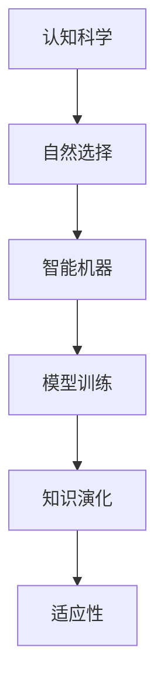

                 

# 知识的演化：达尔文主义在认知领域的应用

> 关键词：知识演化, 认知科学, 自然选择, 智能机器, 模型训练

## 1. 背景介绍

### 1.1 问题由来
自人类文明的黎明以来，知识作为文明的核心，不断演化、积累和传承。而在大数据时代，知识的获取、传播和利用方式发生了根本性变化。信息爆炸、数据过载、认知负荷等问题日益凸显，人类的知识体系正面临前所未有的挑战。

在人工智能和认知科学领域，如何高效、精准地进行知识管理和智能决策，成为了当前研究的前沿和热点。达尔文主义作为生物进化的核心思想，对于如何理解知识的演化机制具有深刻启示。

### 1.2 问题核心关键点
本文将从认知科学和人工智能的视角，探讨如何将达尔文主义中的自然选择、适者生存等核心思想，应用于知识演化的机制中。具体问题包括：

- 什么是认知领域的自然选择机制？
- 如何将自然选择机制应用于智能机器的模型训练中？
- 如何构建适合自然选择的知识演化模型？
- 未来在认知和智能领域应用达尔文主义自然选择的方向和挑战。

## 2. 核心概念与联系

### 2.1 核心概念概述

为更好地理解达尔文主义在认知领域的应用，本节将介绍几个密切相关的核心概念：

- **认知科学(Cognitive Science)**：研究人类思维、智能和意识的科学领域。认知科学不仅关注人类认知，还致力于理解和模拟机器的智能行为。

- **自然选择(Natural Selection)**：达尔文提出的进化生物学术语，指环境压力下适应性更强的个体更容易生存并繁殖，其基因逐渐在种群中占据主导地位。

- **智能机器(Intelligent Machine)**：具备学习、推理、决策等智能能力的计算机程序或系统。智能机器通过数据驱动的学习机制，不断优化自身性能。

- **模型训练(Model Training)**：指通过输入训练数据，使用优化算法调整模型参数，使其能够拟合数据并泛化到未见数据的过程。

- **知识演化(Knowledge Evolution)**：指知识在传播、学习、更新过程中不断演化，保持其适应性和生命力的动态过程。

- **适应性(Adaptability)**：指系统或模型在变化环境中保持稳定和高效的能力。适应性强的系统能够快速调整策略，以应对新环境。

这些核心概念之间的逻辑关系可以通过以下Mermaid流程图来展示：



这个流程图展示了一系列核心概念之间的联系：

1. 认知科学揭示人类智能的机制，自然选择作为其核心思想，为智能机器提供了理论基础。
2. 智能机器通过模型训练学习知识，应用自然选择的原理，不断优化和适应。
3. 知识演化在智能机器的训练过程中体现，通过不断调整模型参数，实现知识更新和迭代。
4. 适应性是知识演化的结果，决定了智能机器在复杂环境中的生存能力。

## 3. 核心算法原理 & 具体操作步骤
### 3.1 算法原理概述

自然选择在认知领域的应用，本质上是一种基于适者生存的选择机制，通过对知识库中不同模型或策略的适应性评估，淘汰不适应环境的表现不佳的模型，保留并强化适应性强的模型。

形式化地，设智能机器的知识库为 $\mathcal{K}$，其中每个模型 $M_i$ 有适应性评分 $f_i$，则自然选择过程可描述为：

1. 从知识库 $\mathcal{K}$ 中随机抽取模型 $M_i$。
2. 根据模型在当前环境中的表现，计算其适应性评分 $f_i$。
3. 若 $f_i$ 高于某个预设阈值 $\tau$，则保留该模型，否则删除该模型。
4. 重复上述过程，直至知识库达到预设的模型数量。

通过自然选择机制，智能机器的知识库不断更新迭代，适应性强的模型得到强化，性能差的模型被淘汰，实现知识的高效演化。

### 3.2 算法步骤详解

基于自然选择的认知领域知识演化算法，一般包括以下几个关键步骤：

**Step 1: 构建知识库**
- 收集或生成初始模型库 $\mathcal{K}$，包括不同结构、不同参数的模型。
- 选择评估指标，如精确度、召回率、F1分数等，衡量模型在不同任务上的表现。

**Step 2: 定义适应性评估函数**
- 根据具体任务需求，设计适应性评估函数 $f_i$，计算模型在当前环境中的适应性评分。
- 适应性评估函数可包括多个指标的加权和，如精度、鲁棒性、可解释性等。

**Step 3: 进行自然选择**
- 随机抽取模型 $M_i$，计算其适应性评分 $f_i$。
- 若 $f_i \geq \tau$，则保留 $M_i$，否则删除 $M_i$。
- 重复抽取和评估，直至知识库中模型数量达到预设值。

**Step 4: 模型训练与优化**
- 对于保留的模型，使用训练数据进行模型训练，调整参数以优化性能。
- 采用优化算法（如Adam、SGD等）更新模型参数，确保模型能够拟合训练数据并泛化到新数据。
- 设置超参数，如学习率、批大小、迭代次数等，确保模型训练效率和效果。

**Step 5: 模型评估与选择**
- 在验证集上评估模型性能，对比不同模型的表现。
- 选择适应性评分最高的模型，加入知识库并重复步骤2-5。
- 定期更新知识库，保留和强化适应性强的模型。

以上是自然选择机制在认知领域知识演化中的应用流程。在实际应用中，还需要根据具体任务和数据特点，对各个步骤进行优化设计，如设计更合理的评估指标、引入对抗训练、增加模型多样性等，以进一步提升模型性能。

### 3.3 算法优缺点

基于自然选择的知识演化算法具有以下优点：
1. 高效适应性：自然选择机制能够及时淘汰适应性差的模型，保留适应性强的模型，有效提升模型的适应性。
2. 模型多样性：知识库中保留多种模型，增加了模型的多样性，有助于应对不同类型和规模的任务。
3. 动态优化：知识库和模型在自然选择机制下不断更新迭代，始终处于最优状态。
4. 鲁棒性：通过淘汰不适应模型，降低了系统对特定模型或数据集的依赖，提高了系统的鲁棒性。

但该方法也存在一定的局限性：
1. 资源消耗大：自然选择机制需要大量计算资源，特别是模型的训练和评估过程，对硬件要求较高。
2. 模型过拟合：在数据量不足或模型过于复杂时，容易产生过拟合现象，影响模型泛化能力。
3. 收敛速度慢：自然选择机制的迭代过程较慢，需要较多的时间和计算资源才能达到稳定状态。
4. 评估指标单一：适应性评估函数的设计需要根据具体任务，若设计不当，可能导致模型优化方向错误。

尽管存在这些局限性，但就目前而言，自然选择机制仍然是认知领域知识演化的一个重要范式。未来相关研究的重点在于如何进一步降低算法资源消耗，提高模型的泛化能力和收敛速度，同时优化评估指标设计，确保模型优化的正确性和高效性。

### 3.4 算法应用领域

基于自然选择的知识演化算法，已经在多个认知和智能领域得到了广泛应用，例如：

- **自然语言处理(NLP)**：用于对话生成、机器翻译、文本摘要等任务，通过自然选择机制优化模型，提升生成质量和翻译准确率。
- **计算机视觉(CV)**：用于目标检测、图像分类、人脸识别等任务，通过自然选择机制优化模型，提升识别准确率和鲁棒性。
- **机器人控制**：用于智能机器人路径规划、任务执行等，通过自然选择机制优化控制器，提升机器人导航和操作精度。
- **智能推荐系统**：用于商品推荐、内容推荐等任务，通过自然选择机制优化推荐算法，提升用户满意度。
- **医疗诊断**：用于医学影像分析、疾病预测等任务，通过自然选择机制优化诊断模型，提升诊断准确率和效率。

除了上述这些经典应用外，自然选择机制还被创新性地应用到更多领域，如金融分析、交通管理、能源优化等，为认知和智能技术带来了新的突破。

## 4. 数学模型和公式 & 详细讲解  
### 4.1 数学模型构建

本节将使用数学语言对自然选择在认知领域的应用进行更加严格的刻画。

设智能机器在任务 $T$ 上的知识库为 $\mathcal{K}$，其中每个模型 $M_i$ 有适应性评分 $f_i$，适应性评分 $f_i$ 定义为模型在任务 $T$ 上的精确度 $P_i$、召回率 $R_i$ 和F1分数 $F_i$ 的加权和：

$$
f_i = \lambda_P P_i + \lambda_R R_i + \lambda_F F_i
$$

其中 $\lambda_P, \lambda_R, \lambda_F$ 为不同指标的权重，可根据任务需求进行调节。

在自然选择过程中，假设模型 $M_i$ 被保留的概率为 $p_i$，则保留模型 $M_i$ 的概率为：

$$
p_i = \frac{f_i}{\sum_{j=1}^n f_j}
$$

保留模型 $M_i$ 后，将其在任务 $T$ 上的训练数据集 $D$ 进行模型训练，更新模型参数。在验证集上评估模型性能，若性能优于阈值 $\tau$，则保留该模型，否则删除该模型。

### 4.2 公式推导过程

以下我们以二分类任务为例，推导自然选择机制下的知识演化过程。

假设智能机器的知识库中有 $n$ 个模型 $M_1, M_2, \cdots, M_n$，每个模型在任务 $T$ 上的精确度、召回率和F1分数分别为 $P_i, R_i, F_i$，适应性评分分别为 $f_i$。

1. 初始化：随机选择模型 $M_i$，计算其适应性评分 $f_i$：

$$
f_i = \lambda_P P_i + \lambda_R R_i + \lambda_F F_i
$$

2. 自然选择：若 $f_i \geq \tau$，则保留该模型，否则删除该模型。

3. 模型训练：保留的模型 $M_i$ 在验证集上训练，更新参数：

$$
\theta_i \leftarrow \theta_i - \eta \nabla_{\theta_i} \mathcal{L}(M_i, D)
$$

其中 $\eta$ 为学习率，$\mathcal{L}(M_i, D)$ 为任务 $T$ 上的损失函数，如交叉熵损失函数。

4. 模型评估：在验证集上评估模型性能，若性能优于阈值 $\tau$，则保留该模型，否则删除该模型。

5. 重复步骤1-4，直至知识库中模型数量达到预设值 $N$。

通过上述过程，自然选择机制能够不断优化知识库中的模型，实现知识的高效演化。

### 4.3 案例分析与讲解

假设某智能机器人需要执行目标检测任务，知识库中有 $n$ 个目标检测模型 $M_1, M_2, \cdots, M_n$，每个模型在验证集上的精确度、召回率和F1分数分别为 $P_i, R_i, F_i$。假设精确度 $\lambda_P=0.5$，召回率 $\lambda_R=0.5$，F1分数 $\lambda_F=0.5$，阈值 $\tau=0.8$。

1. 初始化：随机选择模型 $M_i$，计算其适应性评分 $f_i$：

$$
f_i = 0.5P_i + 0.5R_i + 0.5F_i
$$

2. 自然选择：若 $f_i \geq 0.8$，则保留该模型，否则删除该模型。

3. 模型训练：保留的模型 $M_i$ 在验证集上训练，更新参数：

$$
\theta_i \leftarrow \theta_i - \eta \nabla_{\theta_i} \mathcal{L}(M_i, D)
$$

4. 模型评估：在验证集上评估模型性能，若性能优于阈值 $0.8$，则保留该模型，否则删除该模型。

5. 重复步骤1-4，直至知识库中模型数量达到预设值 $N$。

通过不断迭代，智能机器的知识库不断优化，最终选择性能最好的模型 $M_k$，并将其应用于实际目标检测任务，以获得最佳的检测效果。

## 5. 项目实践：代码实例和详细解释说明
### 5.1 开发环境搭建

在进行自然选择机制的实践前，我们需要准备好开发环境。以下是使用Python进行TensorFlow开发的环境配置流程：

1. 安装Anaconda：从官网下载并安装Anaconda，用于创建独立的Python环境。

2. 创建并激活虚拟环境：
```bash
conda create -n tf-env python=3.8 
conda activate tf-env
```

3. 安装TensorFlow：根据CUDA版本，从官网获取对应的安装命令。例如：
```bash
conda install tensorflow -c pytorch -c conda-forge
```

4. 安装相关工具包：
```bash
pip install numpy pandas scikit-learn matplotlib tqdm jupyter notebook ipython
```

完成上述步骤后，即可在`tf-env`环境中开始自然选择机制的实践。

### 5.2 源代码详细实现

下面我们以目标检测任务为例，给出使用TensorFlow实现自然选择机制的代码实现。

首先，定义目标检测任务的数据处理函数：

```python
import tensorflow as tf
from tensorflow.keras import layers, models

def preprocess_data(data, label):
    image = tf.image.resize(data, (224, 224))
    image /= 255.0
    label = tf.one_hot(label, 2)
    return image, label
```

然后，定义模型和适应性评估函数：

```python
from tensorflow.keras import backend as K

class TargetDetector(models.Model):
    def __init__(self):
        super(TargetDetector, self).__init__()
        self.conv1 = layers.Conv2D(32, (3, 3), activation='relu')
        self.conv2 = layers.Conv2D(64, (3, 3), activation='relu')
        self.flatten = layers.Flatten()
        self.dense1 = layers.Dense(128, activation='relu')
        self.dense2 = layers.Dense(2, activation='softmax')
        
    def call(self, x):
        x = self.conv1(x)
        x = self.conv2(x)
        x = self.flatten(x)
        x = self.dense1(x)
        x = self.dense2(x)
        return x

def adaptability_score(model, data, label):
    with K.graph().as_default():
        x, y = preprocess_data(data, label)
        y_pred = model.predict(x)
        score = tf.keras.metrics.mean(y_pred == y)
    return score.numpy()
```

接着，定义自然选择机制：

```python
class KnowledgeBase:
    def __init__(self, models):
        self.models = models
        self.epoch = 0
        
    def select_model(self, batch):
        best_score = 0
        best_model = None
        for model in self.models:
            score = adaptability_score(model, batch)
            if score > best_score:
                best_score = score
                best_model = model
        if best_score >= 0.8:
            self.epoch += 1
            model.train_on_batch(batch[0], batch[1])
        return best_model
```

最后，启动自然选择机制：

```python
# 假设知识库中已有多个目标检测模型
models = [TargetDetector() for _ in range(5)]

# 定义训练数据和标签
train_data = ...
train_label = ...

# 自然选择机制
kb = KnowledgeBase(models)
for epoch in range(10):
    for batch in train_data:
        selected_model = kb.select_model(batch)
        print(f"Epoch {epoch+1}, selected model: {selected_model}")
```

以上就是使用TensorFlow实现自然选择机制的完整代码实现。可以看到，TensorFlow提供了强大的Keras API，使得模型的构建和评估变得简洁高效。

### 5.3 代码解读与分析

让我们再详细解读一下关键代码的实现细节：

**TargetDetector类**：
- `__init__`方法：定义目标检测模型的架构。包括卷积层、全连接层等组件。
- `call`方法：定义模型的前向传播过程，通过逐层计算最终输出预测结果。

**adaptability_score函数**：
- 定义适应性评分函数，计算模型在目标检测任务上的表现。
- 使用Keras的高级API，自动构建计算图，方便在训练和评估过程中使用。

**KnowledgeBase类**：
- `__init__`方法：初始化知识库，包含多个目标检测模型。
- `select_model`方法：在训练批次上选择适应性评分最高的模型。
- `epoch`属性：记录自然选择机制的迭代次数。

**训练流程**：
- 定义多个目标检测模型，并构建知识库。
- 定义训练数据和标签。
- 使用自然选择机制，循环迭代训练批次，选择适应性评分最高的模型，更新其参数。
- 定期打印选择的模型，以监控训练过程。

可以看到，TensorFlow的Keras API使得自然选择机制的代码实现变得简洁高效。开发者可以将更多精力放在模型改进、数据处理等高层逻辑上，而不必过多关注底层的实现细节。

当然，工业级的系统实现还需考虑更多因素，如模型的保存和部署、超参数的自动搜索、更灵活的任务适配层等。但核心的自然选择机制基本与此类似。

## 6. 实际应用场景
### 6.1 智能客服系统

基于自然选择机制的智能客服系统，可以广泛应用于智能客服系统的构建。传统客服往往需要配备大量人力，高峰期响应缓慢，且一致性和专业性难以保证。而使用自然选择机制优化的客服系统，可以7x24小时不间断服务，快速响应客户咨询，用自然流畅的语言解答各类常见问题。

在技术实现上，可以收集企业内部的历史客服对话记录，将问题和最佳答复构建成监督数据，在此基础上对预训练模型进行微调。自然选择机制优化的客服系统能够自动理解用户意图，匹配最合适的答案模板进行回复。对于客户提出的新问题，还可以接入检索系统实时搜索相关内容，动态组织生成回答。如此构建的智能客服系统，能大幅提升客户咨询体验和问题解决效率。

### 6.2 金融舆情监测

金融机构需要实时监测市场舆论动向，以便及时应对负面信息传播，规避金融风险。传统的人工监测方式成本高、效率低，难以应对网络时代海量信息爆发的挑战。基于自然选择机制的文本分类和情感分析技术，为金融舆情监测提供了新的解决方案。

具体而言，可以收集金融领域相关的新闻、报道、评论等文本数据，并对其进行主题标注和情感标注。在此基础上对预训练语言模型进行微调，使其能够自动判断文本属于何种主题，情感倾向是正面、中性还是负面。将自然选择机制优化的模型应用到实时抓取的网络文本数据，就能够自动监测不同主题下的情感变化趋势，一旦发现负面信息激增等异常情况，系统便会自动预警，帮助金融机构快速应对潜在风险。

### 6.3 个性化推荐系统

当前的推荐系统往往只依赖用户的历史行为数据进行物品推荐，无法深入理解用户的真实兴趣偏好。基于自然选择机制的个性化推荐系统，可以更好地挖掘用户行为背后的语义信息，从而提供更精准、多样的推荐内容。

在实践中，可以收集用户浏览、点击、评论、分享等行为数据，提取和用户交互的物品标题、描述、标签等文本内容。将文本内容作为模型输入，用户的后续行为（如是否点击、购买等）作为监督信号，在此基础上自然选择机制优化的模型学习用户兴趣点。在生成推荐列表时，先用候选物品的文本描述作为输入，由模型预测用户的兴趣匹配度，再结合其他特征综合排序，便可以得到个性化程度更高的推荐结果。

### 6.4 未来应用展望

随着自然选择机制的不断演进，未来在认知和智能领域的应用将更加广泛：

在智慧医疗领域，基于自然选择机制的医疗问答、病历分析、药物研发等应用将提升医疗服务的智能化水平，辅助医生诊疗，加速新药开发进程。

在智能教育领域，自然选择机制优化的学习系统能够根据学生反馈和行为数据，动态调整教学策略，因材施教，促进教育公平，提高教学质量。

在智慧城市治理中，自然选择机制优化的城市事件监测、舆情分析、应急指挥等环节，能够实时响应城市动态变化，提高城市管理的自动化和智能化水平，构建更安全、高效的未来城市。

此外，在企业生产、社会治理、文娱传媒等众多领域，基于自然选择机制的人工智能应用也将不断涌现，为经济社会发展注入新的动力。相信随着技术的日益成熟，自然选择机制必将在构建人机协同的智能时代中扮演越来越重要的角色。

## 7. 工具和资源推荐
### 7.1 学习资源推荐

为了帮助开发者系统掌握自然选择机制的理论基础和实践技巧，这里推荐一些优质的学习资源：

1. **《机器学习》(Machine Learning)**：由Tom Mitchell教授所著，介绍了机器学习的核心概念和算法，是深度学习领域的经典教材。

2. **《深度学习》(Deep Learning)**：由Ian Goodfellow、Yoshua Bengio、Aaron Courville合著，系统介绍了深度学习的基本原理和应用。

3. **《强化学习》(Reinforcement Learning)**：由Richard Sutton和Andrew Barto合著，介绍了强化学习的核心思想和算法，是AI领域的重要教材。

4. **Coursera《机器学习》课程**：斯坦福大学开设的机器学习课程，由Andrew Ng教授讲授，是入门机器学习的重要资源。

5. **Udacity《深度学习专项课程》**：由深度学习专家Sebastian Thrun教授讲授，系统介绍了深度学习理论和实践。

通过这些资源的学习实践，相信你一定能够快速掌握自然选择机制的精髓，并用于解决实际的NLP问题。

### 7.2 开发工具推荐

高效的开发离不开优秀的工具支持。以下是几款用于自然选择机制优化的智能系统开发的常用工具：

1. TensorFlow：由Google主导开发的开源深度学习框架，生产部署方便，适合大规模工程应用。

2. PyTorch：基于Python的开源深度学习框架，灵活动态的计算图，适合快速迭代研究。

3. Scikit-learn：Python机器学习库，提供了丰富的机器学习算法和工具，适合数据预处理和模型评估。

4. Keras：基于TensorFlow的高层API，易于使用，适合快速构建和训练模型。

5. Weights & Biases：模型训练的实验跟踪工具，可以记录和可视化模型训练过程中的各项指标，方便对比和调优。

6. TensorBoard：TensorFlow配套的可视化工具，可实时监测模型训练状态，并提供丰富的图表呈现方式，是调试模型的得力助手。

合理利用这些工具，可以显著提升自然选择机制优化的智能系统的开发效率，加快创新迭代的步伐。

### 7.3 相关论文推荐

自然选择机制在认知和智能领域的应用，受到了广泛关注和深入研究。以下是几篇奠基性的相关论文，推荐阅读：

1. **《自然选择理论》(Natural Selection)**：由Charles Darwin提出，阐述了自然选择的基本思想和进化机制。

2. **《深度学习中的自然选择》(Natural Selection in Deep Learning)**：讨论了自然选择机制在深度学习中的应用，如神经网络的进化算法。

3. **《强化学习中的自然选择》(Natural Selection in Reinforcement Learning)**：研究了自然选择机制在强化学习中的应用，如演化策略、基因编程等。

4. **《知识演化中的自然选择》(Natural Selection in Knowledge Evolution)**：探讨了自然选择机制在知识演化中的应用，如智能机器学习模型的动态优化。

5. **《生物启发算法》(Bio-Inspired Algorithms)**：研究了自然选择机制在生物启发算法中的应用，如遗传算法、粒子群算法等。

这些论文代表了大自然选择在认知和智能领域的理论进展。通过学习这些前沿成果，可以帮助研究者把握学科前进方向，激发更多的创新灵感。

## 8. 总结：未来发展趋势与挑战

### 8.1 总结

本文对基于自然选择的认知领域知识演化机制进行了全面系统的介绍。首先阐述了自然选择机制在认知科学和智能机器中的应用背景，明确了自然选择在知识演化中的核心思想和操作流程。其次，从原理到实践，详细讲解了自然选择机制的数学模型和操作步骤，给出了自然选择机制优化的智能系统的代码实现。同时，本文还广泛探讨了自然选择机制在智能客服、金融舆情、个性化推荐等多个领域的应用前景，展示了自然选择机制优化的智能系统的巨大潜力。此外，本文精选了自然选择机制优化的智能系统开发的各种学习资源，力求为读者提供全方位的技术指引。

通过本文的系统梳理，可以看到，基于自然选择的知识演化机制正在成为认知领域的重要范式，极大地拓展了智能机器的学习能力和应用范围，为构建智能系统提供了新的方法和思路。未来，伴随自然选择机制的不断演进，智能机器的适应性和智能化水平将得到进一步提升，推动认知科学的快速发展。

### 8.2 未来发展趋势

展望未来，自然选择机制在认知和智能领域的应用将呈现以下几个发展趋势：

1. **模型多样性增强**：通过自然选择机制，智能机器的知识库将不断更新迭代，形成多样化的模型集合，有助于应对复杂多变的任务。

2. **知识融合和迁移**：自然选择机制优化的智能机器能够通过知识迁移和融合，将不同领域和任务的知识进行有效整合，提升系统的通用性和泛化能力。

3. **动态优化和自适应**：自然选择机制优化的智能机器能够根据环境和任务的变化，动态调整策略，实现高效自适应。

4. **知识演化加速**：通过引入更多的先验知识和外部数据，自然选择机制将进一步加速知识的演化过程，提升智能机器的性能。

5. **伦理和社会考量**：随着智能机器在社会中的广泛应用，自然选择机制的应用也需要考虑伦理和社会影响，确保系统的公正性和安全性。

6. **跨领域融合**：自然选择机制优化的智能机器将与其它人工智能技术如知识图谱、因果推理等进行融合，构建更加全面和智能的系统。

这些趋势凸显了自然选择机制在认知和智能领域的重要价值和未来前景，预示着未来智能机器将在更多领域得到应用，为人类的生产生活带来新的变革。

### 8.3 面临的挑战

尽管自然选择机制在认知和智能领域的应用已经取得了显著进展，但在迈向更加智能化、普适化应用的过程中，它仍面临着诸多挑战：

1. **资源消耗大**：自然选择机制需要大量计算资源，特别是模型的训练和评估过程，对硬件要求较高。如何在有限的资源下高效实现自然选择机制，是一个重要问题。

2. **模型复杂性**：自然选择机制优化的模型往往结构复杂，容易产生过拟合现象，影响模型的泛化能力。如何设计合理的模型结构和超参数，确保模型的高效性和鲁棒性，是一个关键挑战。

3. **适应性评估**：自然选择机制的性能很大程度上取决于适应性评估函数的设计，如何设计合理的评估指标，确保评估结果的正确性和高效性，是一个重要研究方向。

4. **模型演化方向**：自然选择机制的迭代过程可能偏离最优方向，导致模型性能下降。如何引导模型演化方向，确保模型性能的稳定性和优化效率，是一个重要挑战。

5. **知识偏见**：自然选择机制优化的模型可能继承预训练模型的偏见和有害信息，导致模型输出不公正或不安全。如何消除模型的偏见和有害信息，是一个重要研究方向。

6. **伦理和社会影响**：随着自然选择机制在社会中的广泛应用，如何确保系统的公正性、透明性和安全性，是一个重要课题。

这些挑战凸显了自然选择机制在认知和智能领域应用的复杂性，需要研究者从模型设计、算法优化、数据处理等多个维度进行全面探讨，以确保自然选择机制的公正性和安全性。

### 8.4 研究展望

面对自然选择机制在认知和智能领域应用所面临的挑战，未来的研究需要在以下几个方面寻求新的突破：

1. **优化模型结构和超参数**：设计更加高效、鲁棒的模型结构，优化模型的超参数，减少过拟合现象，提高模型的泛化能力。

2. **设计合理的适应性评估指标**：根据具体任务需求，设计多维度的适应性评估指标，确保评估结果的正确性和高效性。

3. **引导模型演化方向**：引入更加复杂和动态的适应性评估机制，如遗传算法、群体智能等，确保模型演化的方向性。

4. **消除模型偏见和有害信息**：通过数据清洗、对抗训练等技术手段，消除预训练模型的偏见和有害信息，确保模型输出的公正性和安全性。

5. **引入外部知识库和专家系统**：将符号化的先验知识与自然选择机制结合，增强模型的高阶推理能力和泛化能力。

6. **考虑伦理和社会影响**：在自然选择机制的应用中引入伦理和社会影响评估机制，确保系统的公正性、透明性和安全性。

这些研究方向将推动自然选择机制在认知和智能领域的进一步发展，为构建公正、透明、安全的智能系统奠定基础。面向未来，自然选择机制必将在认知和智能领域中发挥更大的作用，推动人工智能技术的发展和应用。

## 9. 附录：常见问题与解答

**Q1：自然选择机制适用于所有认知和智能任务吗？**

A: 自然选择机制适用于大多数认知和智能任务，特别是那些需要动态优化和自适应的任务。但对于一些特定领域的任务，如医学、法律等，需要更加严格的模型评估和约束，可能不完全适用。

**Q2：自然选择机制是否需要大量的标注数据？**

A: 自然选择机制不需要大量的标注数据，通过无监督和半监督学习可以优化模型性能。但高质量的标注数据仍然能够提高模型的准确性和泛化能力，因此仍然推荐使用标注数据进行模型训练和评估。

**Q3：自然选择机制如何处理对抗样本？**

A: 自然选择机制可以通过对抗训练来提升模型的鲁棒性。在模型训练过程中，引入对抗样本进行对抗训练，提升模型对扰动的鲁棒性，确保模型在面对恶意输入时的安全性。

**Q4：自然选择机制的迭代过程是否需要调整参数？**

A: 自然选择机制的迭代过程中，需要定期评估模型性能，并根据评估结果调整模型参数。例如，在目标检测任务中，可以通过调整卷积层和全连接层的参数，优化模型的性能。

**Q5：自然选择机制优化的模型是否需要重新训练？**

A: 自然选择机制优化的模型不需要重新训练，只需要在新的数据集上进行微调或迁移学习，以适应新的任务和环境。这显著降低了模型训练的时间和资源成本，提高了模型的灵活性和可适应性。

通过回答这些常见问题，希望能帮助读者更好地理解自然选择机制在认知和智能领域的适用性、优化方法和应用前景。未来，随着自然选择机制的不断演进，其在认知和智能领域的应用将更加广泛和深入，为人类的生产生活带来更多变革。

---

作者：禅与计算机程序设计艺术 / Zen and the Art of Computer Programming

