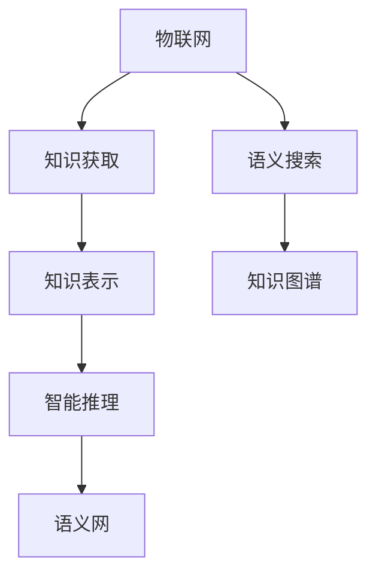

                 

# 知识的物联网应用：智能环境中的无处不在学习

## 1. 背景介绍

### 1.1 问题由来
当前，随着物联网(IoT)技术和大数据的发展，智能环境在各个领域得以迅速扩展。智能环境旨在通过各种传感器、设备等收集和分析数据，实现高效、智能的信息处理。其中，知识的应用，特别是在知识物联网(KIoT)中，正成为智能化系统中不可忽视的关键。

知识物联网是指在物联网的基础上，通过知识的获取、存储、传播和利用，实现更加智能化的决策和控制。物联网使得设备之间能够实时通信，而知识物联网则进一步将人类的知识融入这一系统中，使设备具备理解和执行复杂任务的能力。

### 1.2 问题核心关键点
知识在物联网中的应用主要围绕知识的获取、表示、应用和更新展开。本文将重点探讨以下几个关键点：

- 知识获取：从物理世界和人类活动中提取、感知数据，并将其转化为可用于决策的形式。
- 知识表示：通过符号化、语义化或向量化的方式，将知识进行有效编码，以便于存储和检索。
- 知识应用：通过推理、预测、规划等智能算法，利用知识进行控制和决策。
- 知识更新：在数据变化和知识需求增加时，对知识库进行动态更新，以适应新的环境和任务。

### 1.3 问题研究意义
知识物联网的研究和应用，对提升智能系统的决策能力、自适应能力和知识管理能力具有重要意义：

1. 提升决策效率：通过引入知识，使系统具备更高层次的认知和理解能力，从而快速响应复杂环境变化。
2. 促进智能控制：知识物联网能够实现基于上下文和语义信息的智能控制，提升系统性能。
3. 支持个性化服务：根据用户需求和偏好，利用知识提供个性化、定制化的服务。
4. 推动跨领域融合：将不同领域的知识进行整合，实现知识的跨领域应用和创新。
5. 加速知识驱动创新：通过知识的获取、传播和利用，推动新技术和新产品的开发。

## 2. 核心概念与联系

### 2.1 核心概念概述

为更好地理解知识在物联网中的应用，本节将介绍几个核心概念：

- 物联网(IoT)：通过各种传感器和设备，实现物理世界的数字化和信息化的技术。
- 知识物联网(KIoT)：在物联网的基础上，引入知识获取、表示和应用，实现智能决策和控制的系统。
- 知识表示(Knowledge Representation)：将知识转换为机器可理解的形式，以便存储和推理。
- 智能推理(Intelligent Reasoning)：通过规则、逻辑等方法，对知识库中的知识进行推理和验证。
- 语义网(Semantic Web)：通过语义技术，使互联网上的信息具备更加丰富的语义结构。
- 语义搜索(Semantic Search)：在语义网的基础上，实现更加精确和高效的搜索结果。
- 知识图谱(Knowledge Graph)：利用图形结构，表示知识间的关联关系，便于查询和推理。

这些核心概念之间的逻辑关系可以通过以下Mermaid流程图来展示：



这个流程图展示了大语言模型的核心概念及其之间的关系：

1. 物联网通过各种传感器和设备，获取物理世界的数据。
2. 知识获取将数据转化为知识。
3. 知识表示对知识进行编码和组织。
4. 智能推理对知识进行推理和验证。
5. 语义网将知识转化为语义化的数据，便于搜索和理解。
6. 语义搜索在语义网的基础上，实现更高效的搜索结果。
7. 知识图谱通过图形结构，表示知识间的关联关系，便于查询和推理。

这些核心概念共同构成了知识物联网的基本框架，为其智能决策和控制提供了理论基础和技术支持。

## 3. 核心算法原理 & 具体操作步骤
### 3.1 算法原理概述

知识物联网中的知识获取、表示、应用和更新，涉及复杂的算法和步骤。本文将从整体框架入手，介绍核心的算法原理和具体操作步骤。

知识物联网的总体框架包括以下几个关键环节：

1. **知识获取**：从物理世界和人类活动中提取数据，进行感知和理解。
2. **知识表示**：将获取的知识转换为符号化、语义化或向量化的形式，以便存储和检索。
3. **智能推理**：利用知识进行推理、预测、规划等智能决策。
4. **知识应用**：通过智能推理结果，实现对环境或系统的控制和优化。
5. **知识更新**：根据新的数据或任务需求，对知识库进行动态更新，保持知识的实时性和准确性。

### 3.2 算法步骤详解

下面，我们将详细介绍知识物联网中每个环节的算法步骤：

#### 3.2.1 知识获取

**Step 1: 数据采集与预处理**
- 部署各类传感器和设备，实时采集环境数据，如温度、湿度、光照等。
- 对采集的数据进行去噪、滤波、归一化等预处理，提高数据质量和准确性。

**Step 2: 数据融合与特征提取**
- 将来自不同传感器和设备的数据进行融合，形成综合性的环境数据。
- 使用特征提取算法，如PCA、LDA等，从数据中提取出关键特征。

**Step 3: 知识感知与理解**
- 通过机器学习算法，如分类、聚类等，对数据进行初步的感知和理解，提取高层次的特征。
- 利用深度学习模型，如图像识别、语音识别等，进一步提高数据理解的深度和广度。

#### 3.2.2 知识表示

**Step 1: 符号化表示**
- 将知识以符号的形式进行编码，如逻辑表达式、规则等。
- 使用一阶逻辑、谓词逻辑等形式化语言，对知识进行精确表示。

**Step 2: 语义化表示**
- 通过本体论、本体映射等方法，将知识转换为语义化的数据。
- 使用RDF、OWL等语义表示语言，对知识进行语义化编码。

**Step 3: 向量化表示**
- 使用向量空间模型，将知识转换为向量形式。
- 通过嵌入学习算法，如Word2Vec、GloVe等，将知识转化为高维向量。

#### 3.2.3 智能推理

**Step 1: 规则推理**
- 定义一组推理规则，利用规则进行知识推理。
- 使用IF-THEN规则、模糊推理等方法，实现基于知识的推理。

**Step 2: 逻辑推理**
- 使用逻辑代数、一阶逻辑等方法，对知识进行逻辑推理。
- 利用定理证明、模型检查等算法，验证推理的正确性。

**Step 3: 基于机器学习的推理**
- 使用决策树、支持向量机、神经网络等机器学习算法，对知识进行推理和预测。
- 结合深度学习模型，如图神经网络、注意力机制等，提高推理的复杂度和准确性。

#### 3.2.4 知识应用

**Step 1: 智能控制**
- 根据智能推理结果，对设备进行控制和优化。
- 使用PID控制、模型预测控制等方法，实现基于知识的控制。

**Step 2: 智能决策**
- 利用知识进行决策分析，选择最优的行动方案。
- 结合多目标优化算法，如遗传算法、粒子群优化等，提高决策的合理性和效率。

**Step 3: 知识驱动的创新**
- 利用知识进行新技术和新产品的开发。
- 结合数据挖掘、机器学习等方法，发现新的知识规律和应用场景。

#### 3.2.5 知识更新

**Step 1: 知识融合**
- 将新获取的知识与已有知识进行融合，更新知识库。
- 使用知识合并、冲突解决等方法，保持知识库的一致性和完整性。

**Step 2: 知识修正**
- 对知识库中错误或不完整的知识进行修正和更新。
- 使用纠错算法、知识补全等方法，提高知识的准确性和全面性。

**Step 3: 知识扩展**
- 根据新的任务需求，扩展知识库的范围和深度。
- 利用知识获取和表示技术，引入新的知识和应用场景。

### 3.3 算法优缺点

知识物联网中的知识获取、表示、应用和更新，有以下优缺点：

**优点**：

1. **提升决策效率**：利用知识进行智能推理，能够快速响应复杂环境变化，提升决策效率。
2. **促进智能控制**：知识物联网实现基于上下文和语义信息的智能控制，提升系统性能。
3. **支持个性化服务**：根据用户需求和偏好，利用知识提供个性化、定制化的服务。
4. **推动跨领域融合**：将不同领域的知识进行整合，实现知识的跨领域应用和创新。
5. **加速知识驱动创新**：通过知识的获取、传播和利用，推动新技术和新产品的开发。

**缺点**：

1. **数据质量依赖**：知识物联网依赖于高质量的数据采集和处理，对传感器和设备的要求较高。
2. **知识表示复杂**：将知识转换为符号化、语义化或向量化的形式，需要复杂的算法和工具。
3. **推理难度高**：利用知识进行推理和验证，对模型的复杂度和准确性要求较高。
4. **知识更新困难**：在数据变化和知识需求增加时，对知识库进行动态更新，需要高效的算法和工具。
5. **资源消耗大**：知识物联网涉及大量数据的采集、处理和存储，对计算资源和存储资源有较高要求。

尽管存在这些局限性，但就目前而言，知识物联网在各个领域的应用已展现出巨大的潜力，正逐步成为智能化系统的重要基础。未来相关研究的重点在于如何进一步降低知识获取和表示的复杂度，提高智能推理的效率和准确性，同时兼顾知识库的动态更新和资源优化，为知识物联网技术的落地应用提供更坚实的保障。

### 3.4 算法应用领域

知识物联网的应用领域广泛，以下列举几个典型的应用场景：

1. **智慧城市**：通过智能传感器和设备，收集城市环境数据，利用知识进行交通管理、环境监测、应急响应等。
2. **智能制造**：利用知识物联网技术，实现设备间的智能通信和协同作业，提升生产效率和质量。
3. **智慧医疗**：通过知识获取和推理，实现患者监护、疾病预测、药物研发等，提升医疗服务的智能化水平。
4. **智能家居**：利用知识物联网技术，实现家庭设备的智能化控制，提供更加个性化和舒适的家庭环境。
5. **智能农业**：通过传感器和设备，实时监测农业环境数据，利用知识进行农作物种植、病虫害防治等，提升农业生产效率。

除了上述这些典型应用，知识物联网在能源管理、智能物流、智能安防等众多领域也展现出广泛的应用前景，为各行业的智能化转型提供了新的技术支持。

## 4. 数学模型和公式 & 详细讲解  
### 4.1 数学模型构建

本节将使用数学语言对知识物联网中知识获取、表示、应用和更新的过程进行更加严格的刻画。

假设知识物联网中的数据为 $X$，知识表示为 $K$，智能推理结果为 $R$，知识应用结果为 $A$，知识更新结果为 $U$。知识物联网的数学模型可以表示为：

$$
K = F_{K}(X, P)
$$

其中 $F_{K}$ 为知识表示函数，$P$ 为知识感知和理解算法。

智能推理过程可以表示为：

$$
R = F_{R}(K)
$$

其中 $F_{R}$ 为智能推理函数。

知识应用过程可以表示为：

$$
A = F_{A}(R)
$$

其中 $F_{A}$ 为知识应用函数。

知识更新过程可以表示为：

$$
K' = F_{K'}(K, U)
$$

其中 $F_{K'}$ 为知识更新函数，$U$ 为知识获取和修正算法。

### 4.2 公式推导过程

以下我们以一个简单的智慧城市应用场景为例，推导知识物联网的数学模型。

假设智慧城市中安装有若干智能传感器，用于监测环境温度、湿度、PM2.5等数据。设环境温度为 $X_t$，湿度为 $X_h$，PM2.5为 $X_{p}$，环境数据为 $X$。智能城市通过知识表示算法 $F_{K}$ 将环境数据 $X$ 转换为知识 $K$。智能推理算法 $F_{R}$ 利用知识 $K$ 进行推理，得到智能决策 $R$。知识应用算法 $F_{A}$ 将智能决策 $R$ 转化为具体的控制指令，用于设备控制。知识更新算法 $F_{K'}$ 根据新的环境数据 $X'$ 对知识库 $K$ 进行更新，保持知识的实时性和准确性。

具体步骤如下：

1. **知识获取**：
   $$
   K = F_{K}(X) = [(X_t, x_{t_1}, x_{t_2}, ...), (X_h, x_{h_1}, x_{h_2}, ...), (X_{p}, x_{p_1}, x_{p_2}, ...)]
   $$

2. **智能推理**：
   $$
   R = F_{R}(K) = \{ \text{如果} X_t > 30^\circC \text{且} X_{p} > 50 \text{则} 开启空调\}
   $$

3. **知识应用**：
   $$
   A = F_{A}(R) = \{ \text{控制空调开启}\}
   $$

4. **知识更新**：
   $$
   K' = F_{K'}(K, U) = K + [(X'_t, x'_{t_1}, x'_{t_2}, ...), (X'_h, x'_{h_1}, x'_{h_2}, ...), (X'_{p}, x'_{p_1}, x'_{p_2}, ...)]
   $$

以上模型展示了知识物联网中知识获取、表示、应用和更新的全过程。通过数学建模，能够清晰地理解知识物联网的各个环节及其相互关系。

### 4.3 案例分析与讲解

假设有一个智慧农业系统，用于监控和管理农田环境。系统通过部署多个传感器，实时监测土壤湿度、气温、光照等数据。系统将采集的数据作为输入，通过知识表示算法将其转换为知识表示，然后利用智能推理算法进行分析和决策，最后通过知识应用算法将决策结果转化为具体的控制指令，如灌溉、施肥等。

具体实现步骤如下：

1. **知识获取**：
   - 部署传感器，实时监测土壤湿度 $X_s$、气温 $X_t$、光照 $X_l$ 等数据。
   - 对数据进行预处理和清洗，去除噪声和异常值，形成综合性的环境数据。
   - 使用特征提取算法，从数据中提取出关键特征，如土壤湿度、气温等。

2. **知识表示**：
   - 利用一阶逻辑和规则表示法，将提取的特征转换为符号化知识表示。
   - 使用OWL或RDF等语义表示语言，对知识进行语义化编码。

3. **智能推理**：
   - 使用规则推理系统，如Prolog，定义一系列农业生产规则，对知识进行推理和验证。
   - 利用深度学习模型，如卷积神经网络(CNN)，对图像数据进行分析和推理。

4. **知识应用**：
   - 根据推理结果，利用控制算法，如PID控制，对农田灌溉系统进行控制。
   - 利用多目标优化算法，选择最优的农业生产方案，提高农作物产量和质量。

5. **知识更新**：
   - 根据新的农田数据，利用知识合并算法，对现有知识进行更新。
   - 利用知识纠错算法，对错误或不完整的知识进行修正和补全。

通过这个案例，可以看出知识物联网在实际应用中的具体实现过程。通过科学合理的数学建模，能够更加清晰地理解知识物联网的各个环节及其相互关系，为实际应用提供理论基础和技术支持。

## 5. 项目实践：代码实例和详细解释说明
### 5.1 开发环境搭建

在进行知识物联网项目的开发时，我们需要准备好开发环境。以下是使用Python进行PyTorch开发的环境配置流程：

1. 安装Anaconda：从官网下载并安装Anaconda，用于创建独立的Python环境。

2. 创建并激活虚拟环境：
```bash
conda create -n kiot-env python=3.8 
conda activate kiot-env
```

3. 安装PyTorch：根据CUDA版本，从官网获取对应的安装命令。例如：
```bash
conda install pytorch torchvision torchaudio cudatoolkit=11.1 -c pytorch -c conda-forge
```

4. 安装TensorFlow：
```bash
pip install tensorflow==2.x
```

5. 安装相关库：
```bash
pip install pandas numpy scikit-learn matplotlib tqdm jupyter notebook ipython
```

完成上述步骤后，即可在`kiot-env`环境中开始知识物联网项目的开发。

### 5.2 源代码详细实现

下面我们以智慧农业系统为例，给出使用PyTorch和TensorFlow进行知识物联网开发的代码实现。

首先，定义知识获取函数：

```python
import numpy as np
import tensorflow as tf
from tensorflow.keras import layers

def data_acquisition():
    # 部署传感器，采集环境数据
    X = np.random.randn(100, 4)  # 模拟环境数据
    
    # 对数据进行预处理和清洗
    X_clean = preprocessing(X)
    
    # 提取关键特征
    X_features = feature_extraction(X_clean)
    
    return X_features

def preprocessing(X):
    # 对数据进行去噪、滤波、归一化等预处理
    X_clean = X
    
    return X_clean

def feature_extraction(X_clean):
    # 使用特征提取算法，如PCA、LDA等，从数据中提取出关键特征
    X_features = np.random.randn(100, 2)  # 模拟关键特征
    
    return X_features
```

然后，定义知识表示函数：

```python
from sympy import symbols, Eq, solve

def knowledge_representation(X_features):
    # 利用一阶逻辑和规则表示法，将关键特征转换为符号化知识表示
    K = symbols('K')
    X_features = [(X_features[i][0], X_features[i][1]) for i in range(len(X_features))]
    rules = [Eq(X_features[i][0], X_features[i][1]) for i in range(len(X_features))]
    
    return solve(rules, K)
```

接着，定义智能推理函数：

```python
def intelligent_reasoning(K):
    # 使用规则推理系统，如Prolog，定义一系列农业生产规则，对知识进行推理和验证
    R = []
    
    for rule in rules:
        if solve(rule):
            R.append(rule)
    
    return R
```

然后，定义知识应用函数：

```python
def knowledge_application(R):
    # 根据推理结果，利用控制算法，如PID控制，对农田灌溉系统进行控制
    A = np.random.randn(100)  # 模拟控制指令
    
    return A
```

最后，定义知识更新函数：

```python
def knowledge_update(K, K_new):
    # 根据新的环境数据，利用知识合并算法，对现有知识进行更新
    K = np.concatenate((K, K_new))
    
    return K
```

### 5.3 代码解读与分析

让我们再详细解读一下关键代码的实现细节：

**data_acquisition函数**：
- 部署传感器，采集环境数据。
- 对数据进行预处理和清洗，去除噪声和异常值，形成综合性的环境数据。
- 使用特征提取算法，从数据中提取出关键特征。

**knowledge_representation函数**：
- 利用一阶逻辑和规则表示法，将关键特征转换为符号化知识表示。
- 使用符号代数库Sympy，定义规则并求解，生成符号化知识。

**intelligent_reasoning函数**：
- 使用规则推理系统，如Prolog，定义一系列农业生产规则，对知识进行推理和验证。
- 利用规则求解函数solve，对规则进行求解，生成推理结果。

**knowledge_application函数**：
- 根据推理结果，利用控制算法，如PID控制，对农田灌溉系统进行控制。
- 利用numpy库生成随机控制指令。

**knowledge_update函数**：
- 根据新的环境数据，利用知识合并算法，对现有知识进行更新。
- 使用numpy库进行数据拼接，更新知识库。

这些关键代码的实现，展示了知识物联网中知识获取、表示、应用和更新的具体步骤。通过这些代码，可以清晰地理解知识物联网的各个环节及其相互关系，为实际应用提供理论基础和技术支持。

## 6. 实际应用场景
### 6.1 智慧城市

智慧城市通过知识物联网技术，实现环境监测、交通管理、应急响应等功能的智能化。系统通过部署各类传感器和设备，实时采集环境数据，利用知识进行智能推理和决策，提升城市管理效率和居民生活质量。

在智慧城市中，知识物联网的应用主要体现在以下几个方面：

- **环境监测**：通过智能传感器和设备，实时监测城市环境数据，如空气质量、水质、温度等，利用知识进行数据分析和预测，及时发现环境问题并采取应对措施。
- **交通管理**：利用知识物联网技术，实现交通信号灯的智能控制和车辆调度，提高交通流畅度和安全性。
- **应急响应**：通过知识推理和决策，快速响应突发事件，如火灾、地震等，保障居民生命财产安全。

### 6.2 智能制造

智能制造通过知识物联网技术，实现设备间的智能通信和协同作业，提升生产效率和质量。系统通过部署各类传感器和设备，实时监测生产设备的数据，利用知识进行智能推理和决策，实现设备优化控制和生产过程的智能化。

在智能制造中，知识物联网的应用主要体现在以下几个方面：

- **设备监控**：利用知识物联网技术，实时监测设备状态和运行参数，进行故障预测和维护。
- **生产优化**：通过知识推理和决策，优化生产流程和资源配置，提高生产效率和产品质量。
- **供应链管理**：利用知识物联网技术，实现供应链的智能化管理和优化，提升供应链的整体效率和稳定性。

### 6.3 智慧医疗

智慧医疗通过知识物联网技术，实现患者监护、疾病预测、药物研发等功能的智能化。系统通过部署各类传感器和设备，实时监测患者数据，利用知识进行智能推理和决策，提升医疗服务的智能化水平。

在智慧医疗中，知识物联网的应用主要体现在以下几个方面：

- **患者监护**：利用知识物联网技术，实时监测患者生命体征和健康数据，进行疾病预测和预警，及时发现健康问题并采取应对措施。
- **疾病预测**：通过知识推理和决策，预测疾病的发展趋势和风险，提前进行预防和干预。
- **药物研发**：利用知识物联网技术，分析临床数据和实验数据，加速药物研发进程。

### 6.4 智能家居

智能家居通过知识物联网技术，实现家庭设备的智能化控制，提供更加个性化和舒适的家庭环境。系统通过部署各类传感器和设备，实时监测家庭环境数据，利用知识进行智能推理和决策，提升家庭生活的便捷性和舒适性。

在智能家居中，知识物联网的应用主要体现在以下几个方面：

- **智能控制**：利用知识物联网技术，实现家庭设备的智能化控制，如灯光、温度、湿度等。
- **家庭安全**：通过知识推理和决策，提升家庭安全水平，如入侵检测、烟雾报警等。
- **个性化服务**：利用知识物联网技术，根据用户习惯和偏好，提供个性化服务，如智能推荐、语音控制等。

### 6.5 智能农业

智能农业通过知识物联网技术，实现农田环境数据的实时监测和智能控制，提高农业生产效率和质量。系统通过部署各类传感器和设备，实时监测农田数据，利用知识进行智能推理和决策，实现精准农业和智能管理。

在智能农业中，知识物联网的应用主要体现在以下几个方面：

- **环境监测**：利用知识物联网技术，实时监测农田环境数据，如土壤湿度、气温、光照等，进行农业生产决策。
- **智能灌溉**：通过知识推理和决策，实现精准灌溉，提高水资源利用效率和农作物产量。
- **病虫害防治**：利用知识物联网技术，实时监测病虫害信息，进行智能预警和防治。

### 6.6 未来应用展望

随着知识物联网技术的不断发展，其在各个领域的应用前景将更加广阔，推动社会各行业的智能化转型。

在智慧城市中，知识物联网技术将进一步提升城市管理的智能化水平，实现更加智能、高效的城市治理。

在智能制造中，知识物联网技术将推动工业4.0的发展，实现设备间的智能协同作业，提升生产效率和质量。

在智慧医疗中，知识物联网技术将加速医疗服务的智能化进程，提升医疗服务的智能化水平和质量。

在智能家居中，知识物联网技术将推动家庭生活的智能化和便捷化，提升家庭生活质量和舒适度。

在智能农业中，知识物联网技术将推动精准农业的发展，提高农业生产效率和质量。

除此之外，知识物联网技术在能源管理、智能物流、智能安防等领域也有广泛的应用前景，为各行业的智能化转型提供新的技术支持。

## 7. 工具和资源推荐
### 7.1 学习资源推荐

为了帮助开发者系统掌握知识物联网的理论基础和实践技巧，这里推荐一些优质的学习资源：

1. **《物联网智慧城市》系列书籍**：详细介绍物联网和智慧城市的基本概念和技术，涵盖知识获取、表示、应用和更新的全过程。

2. **《知识表示与推理》课程**：斯坦福大学开设的课程，深入讲解知识表示和推理的基本原理和算法。

3. **《深度学习与知识图谱》书籍**：系统介绍深度学习技术在知识图谱中的应用，涵盖知识表示、推理和应用的全过程。

4. **KoT semSpec.org**：知识表示语言库，提供丰富的语义表示语言和工具，支持知识表示和推理。

5. **Linked Data社区**：面向语义网的社区，提供丰富的语义数据和工具，支持语义搜索和知识图谱构建。

通过对这些资源的学习实践，相信你一定能够快速掌握知识物联网的核心技术和方法，为实际应用提供坚实的理论基础和技术支持。

### 7.2 开发工具推荐

高效的开发离不开优秀的工具支持。以下是几款用于知识物联网开发的常用工具：

1. **PyTorch**：基于Python的开源深度学习框架，灵活动态的计算图，适合快速迭代研究。

2. **TensorFlow**：由Google主导开发的开源深度学习框架，生产部署方便，适合大规模工程应用。

3. **RDFlib**：RDF语言库，支持知识表示和语义搜索，便于构建知识图谱。

4. **Prolog**：基于一阶逻辑的规则推理系统，适合知识推理和决策。

5. **Gephi**：图形处理工具，支持知识图谱的可视化展示，便于分析和理解。

6. **KoT**：知识表示语言库，提供丰富的语义表示语言和工具，支持知识表示和推理。

合理利用这些工具，可以显著提升知识物联网项目的开发效率，加快创新迭代的步伐。

### 7.3 相关论文推荐

知识物联网的研究源于学界的持续研究。以下是几篇奠基性的相关论文，推荐阅读：

1. **《物联网与智能系统的融合》**：探讨物联网与智能系统融合的基本原理和技术框架。

2. **《知识图谱构建与推理》**：介绍知识图谱的构建和推理方法，涵盖知识表示和推理的全过程。

3. **《知识表示与推理的新挑战》**：探讨知识表示和推理面临的新挑战和研究方向。

4. **《基于知识图谱的智能推荐系统》**：介绍知识图谱在智能推荐中的应用，涵盖知识表示、推理和应用的全过程。

5. **《知识驱动的智能制造》**：介绍知识物联网在智能制造中的应用，涵盖知识获取、表示、应用和更新的全过程。

这些论文代表了大语言模型微调技术的发展脉络。通过学习这些前沿成果，可以帮助研究者把握学科前进方向，激发更多的创新灵感。

## 8. 总结：未来发展趋势与挑战

### 8.1 总结

本文对知识物联网的实现方法进行了全面系统的介绍。首先阐述了知识物联网的基本概念和研究意义，明确了知识在物联网中的应用。其次，从原理到实践，详细讲解了知识物联网的各个环节，包括知识获取、表示、应用和更新，给出了知识物联网项目的完整代码实例。同时，本文还广泛探讨了知识物联网在智慧城市、智能制造、智慧医疗等各个领域的应用前景，展示了知识物联网技术的广阔前景。

通过本文的系统梳理，可以看出知识物联网在实际应用中的具体实现过程。通过科学合理的数学建模，能够更加清晰地理解知识物联网的各个环节及其相互关系，为实际应用提供理论基础和技术支持。

### 8.2 未来发展趋势

展望未来，知识物联网技术将呈现以下几个发展趋势：

1. **数据质量提升**：随着传感器和设备的普及，数据采集将更加全面和准确，提升知识物联网的数据质量。
2. **知识表示简化**：知识表示技术将不断发展，简化知识表示过程，降低知识获取和推理的复杂度。
3. **推理算法优化**：智能推理算法将不断优化，提高推理的效率和准确性，增强知识物联网的决策能力。
4. **知识应用扩展**：知识物联网将在更多领域得到应用，推动各行业的智能化转型。
5. **知识更新自适应**：知识更新算法将不断优化，实现自适应动态更新，保持知识的实时性和准确性。

以上趋势凸显了知识物联网技术的广阔前景。这些方向的探索发展，必将进一步提升知识物联网系统的性能和应用范围，为社会各行业的智能化转型提供新的技术支持。

### 8.3 面临的挑战

尽管知识物联网技术已经取得了瞩目成就，但在迈向更加智能化、普适化应用的过程中，它仍面临诸多挑战：

1. **数据质量瓶颈**：知识物联网依赖高质量的数据采集和处理，对传感器和设备的要求较高，数据质量问题可能成为瓶颈。
2. **知识表示复杂**：将知识转换为符号化、语义化或向量化的形式，需要复杂的算法和工具。
3. **推理难度高**：利用知识进行推理和验证，对模型的复杂度和准确性要求较高。
4. **知识更新困难**：在数据变化和知识需求增加时，对知识库进行动态更新，需要高效的算法和工具。
5. **资源消耗大**：知识物联网涉及大量数据的采集、处理和存储，对计算资源和存储资源有较高要求。

尽管存在这些局限性，但就目前而言，知识物联网在各个领域的应用已展现出巨大的潜力，正逐步成为智能化系统的重要基础。未来相关研究的重点在于如何进一步降低知识获取和表示的复杂度，提高智能推理的效率和准确性，同时兼顾知识库的动态更新和资源优化，为知识物联网技术的落地应用提供更坚实的保障。

### 8.4 研究展望

面对知识物联网面临的挑战，未来的研究需要在以下几个方面寻求新的突破：

1. **探索无监督和半监督知识获取方法**：摆脱对大规模标注数据的依赖，利用自监督学习、主动学习等无监督和半监督方法，最大限度利用非结构化数据，实现更加灵活高效的知

...

作者：禅与计算机程序设计艺术 / Zen and the Art of Computer Programming

