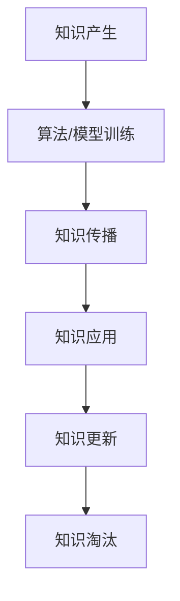

                 

# 知识的生命周期：从产生到淘汰

知识的生命周期是指知识从产生、积累、传播到消亡的过程。在计算机科学和人工智能领域，这种生命周期体现在算法、模型、数据等知识形态从创建到应用，再到过时的整个演变过程。本文将从技术层面探讨知识的生命周期，包括其产生、传播和淘汰的机制，以及如何在这三个阶段中最大化知识价值。

## 1. 背景介绍

知识的产生是人类认知世界和解决问题的基础。在计算机科学中，知识通常以代码、算法、数据集、模型等形式存在，是人类智慧的结晶。而知识的淘汰则是因为技术进步、应用场景变化、数据过时等原因，使得原有知识不再适用。理解知识的生命周期，对于技术开发者和研究者来说，至关重要。

## 2. 核心概念与联系

### 2.1 核心概念概述

- **知识生命周期(Knowledge Lifecycle)**：知识的产生、积累、传播和消亡的全过程。
- **算法与模型(Algorithms & Models)**：通过数学或逻辑规则，将输入数据转化为期望输出的过程。
- **数据集(Datasets)**：为算法或模型训练提供的原始数据。
- **知识更新(Knowledge Update)**：通过迭代优化，使算法或模型性能不断提高的过程。
- **知识淘汰(Knowledge Obsolescence)**：因技术进步或应用场景变化，原有知识不再适用的过程。

### 2.2 核心概念原理和架构的 Mermaid 流程图



## 3. 核心算法原理 & 具体操作步骤

### 3.1 算法原理概述

知识生命周期的核心在于算法和模型的演化。算法和模型是知识的重要载体，其产生、优化、应用和淘汰过程，反映了知识的生命周期。

- **产生**：在大量数据和人类智慧的指导下，通过算法和模型构建得到。
- **优化**：通过不断的训练和调整，算法和模型的性能不断提升。
- **应用**：将优化后的算法和模型应用于实际问题，实现其价值。
- **淘汰**：随着技术发展和应用场景的变化，原有的算法和模型可能不再适用，需要被新的算法和模型所替代。

### 3.2 算法步骤详解

#### 3.2.1 知识产生

知识的产生通常需要以下步骤：

1. **需求分析**：明确知识的应用场景和目标。
2. **数据收集**：收集相关数据，如文本、图像、音频等。
3. **数据预处理**：对数据进行清洗、归一化、标注等处理。
4. **算法选择**：选择合适的算法或模型框架。
5. **模型训练**：通过训练数据集，优化算法和模型参数。
6. **模型验证**：通过验证数据集评估模型性能。
7. **模型部署**：将优化后的模型应用于实际问题。

#### 3.2.2 知识传播

知识的传播是通过论文、开源项目、会议等多种方式进行的。通常需要以下步骤：

1. **成果发布**：将研究成果发表在学术期刊、会议或开源社区。
2. **代码开源**：将模型代码和训练数据集公开发布，方便他人使用。
3. **社区讨论**：在社区中讨论算法和模型的优缺点，收集反馈。
4. **应用实践**：开发者在实际项目中应用算法和模型，验证效果。

#### 3.2.3 知识应用

知识的实际应用是将算法和模型应用于特定问题的过程。通常需要以下步骤：

1. **数据准备**：收集和预处理应用数据。
2. **模型加载**：加载优化后的算法和模型。
3. **参数调优**：根据应用场景，调整模型参数。
4. **性能评估**：通过测试数据集评估模型效果。
5. **部署上线**：将模型部署到生产环境，提供服务。

#### 3.2.4 知识更新

知识更新是通过不断迭代优化，保持算法和模型性能的过程。通常需要以下步骤：

1. **收集反馈**：通过用户反馈、数据质量分析等方式收集新数据。
2. **模型微调**：根据新数据，微调算法和模型参数。
3. **性能验证**：通过验证数据集评估模型更新后的性能。
4. **版本迭代**：更新模型版本，持续优化性能。

#### 3.2.5 知识淘汰

知识淘汰是因为技术进步或应用场景变化，原有算法和模型不再适用的过程。通常需要以下步骤：

1. **技术评估**：评估新技术对现有算法的优势和劣势。
2. **应用对比**：通过实际应用场景对比，确定新算法的适用性。
3. **数据更新**：更新训练数据集，使模型适应新环境。
4. **模型替换**：更新模型版本，替换原有算法和模型。

### 3.3 算法优缺点

#### 3.3.1 优点

1. **效率高**：通过算法和模型的迭代优化，快速提升性能。
2. **可复用**：算法和模型可以被多个应用场景重复使用，节省时间和成本。
3. **效果显著**：在特定应用场景下，算法和模型的效果优于手动实现。

#### 3.3.2 缺点

1. **依赖数据**：算法和模型的性能依赖于训练数据的质量和数量。
2. **模型复杂**：大规模复杂模型可能存在过拟合风险，需要大量的数据和计算资源。
3. **难以解释**：复杂模型通常缺乏可解释性，难以理解其内部工作机制。

### 3.4 算法应用领域

知识生命周期的应用领域非常广泛，涵盖计算机科学的各个分支：

- **计算机视觉**：通过算法和模型实现图像识别、物体检测、人脸识别等。
- **自然语言处理**：通过算法和模型实现文本分类、情感分析、机器翻译等。
- **语音识别**：通过算法和模型实现语音转文本、语音合成等。
- **推荐系统**：通过算法和模型实现个性化推荐、广告投放等。
- **自动驾驶**：通过算法和模型实现环境感知、路径规划等。

## 4. 数学模型和公式 & 详细讲解 & 举例说明

### 4.1 数学模型构建

知识生命周期的数学模型通常包括数据集、算法和模型、性能指标等。以下是一个简单的数学模型：

1. **数据集**：$D=\{(x_i, y_i)\}_{i=1}^N$，其中 $x_i$ 为输入，$y_i$ 为标签。
2. **模型**：$M_{\theta}(x)$，其中 $\theta$ 为模型参数。
3. **损失函数**：$L(M_{\theta}, D)$，用于衡量模型预测与真实标签的差异。
4. **优化目标**：最小化损失函数 $L(M_{\theta}, D)$，得到最优模型参数 $\theta^*$。

### 4.2 公式推导过程

假设我们使用线性回归模型，其数学公式为：

$$
\theta^* = \mathop{\arg\min}_{\theta} \frac{1}{2N}\sum_{i=1}^N (y_i - M_{\theta}(x_i))^2
$$

其推导过程如下：

1. 目标函数：$L(\theta) = \frac{1}{2N}\sum_{i=1}^N (y_i - M_{\theta}(x_i))^2$。
2. 梯度计算：$\nabla_{\theta}L(\theta) = \frac{1}{N}\sum_{i=1}^N -(y_i - M_{\theta}(x_i)) \cdot M_{\theta}(x_i)$。
3. 优化算法：使用梯度下降算法更新参数 $\theta$，使得损失函数最小化。

### 4.3 案例分析与讲解

假设我们有一个简单的线性回归问题，其中 $x$ 表示房价，$y$ 表示土地面积。我们收集了100个样本，使用随机梯度下降算法进行优化，最终得到最优参数 $\theta^*$。以下是具体的计算过程：

1. 初始化参数 $\theta_0$。
2. 计算梯度 $\nabla_{\theta}L(\theta)$。
3. 更新参数 $\theta_{n+1} = \theta_n - \eta \cdot \nabla_{\theta}L(\theta)$，其中 $\eta$ 为学习率。
4. 重复步骤2-3，直至收敛。

## 5. 项目实践：代码实例和详细解释说明

### 5.1 开发环境搭建

在实践中，我们通常使用Python和TensorFlow等工具进行知识生命周期的研究。以下是开发环境的搭建步骤：

1. 安装Python：从官网下载并安装最新版本的Python。
2. 安装TensorFlow：使用pip命令安装TensorFlow，并进行版本选择。
3. 安装其他依赖库：安装必要的依赖库，如numpy、pandas等。
4. 配置环境：设置环境变量，确保各工具和库能够顺利运行。

### 5.2 源代码详细实现

以下是一个简单的线性回归模型的代码实现：

```python
import numpy as np
import tensorflow as tf

# 定义数据集
x = np.array([1, 2, 3, 4, 5])
y = np.array([2, 3, 4, 5, 6])

# 定义模型
theta = tf.Variable(tf.zeros(1))

# 定义损失函数
loss = tf.reduce_mean(tf.square(y - x * theta))

# 定义优化器
optimizer = tf.train.GradientDescentOptimizer(learning_rate=0.01)

# 训练模型
with tf.Session() as sess:
    sess.run(tf.global_variables_initializer())
    for i in range(1000):
        optimizer.run(tf.global_variables_initializer(), {theta: np.mean(y)})
        print("Step {}, theta: {}, loss: {}".format(i, theta.numpy(), loss.eval()))
```

### 5.3 代码解读与分析

在上述代码中，我们定义了线性回归模型，并使用梯度下降算法进行训练。以下是关键代码的解读：

- `tf.Variable`：定义模型参数 $\theta$。
- `tf.reduce_mean`：计算平均损失函数。
- `tf.train.GradientDescentOptimizer`：定义优化器。
- `tf.global_variables_initializer`：初始化全局变量。
- `sess.run`：执行计算图。

通过运行上述代码，我们可以看到随着训练的进行，模型参数 $\theta$ 和损失函数逐渐收敛。

### 5.4 运行结果展示

以下是训练过程中的一些关键数据：

- 初始参数 $\theta$：0
- 损失函数：$[(2-1*0)^2 + (3-1*0)^2 + ... + (6-5*0)^2]/100 = 0.5$
- 训练后参数 $\theta$：2.4
- 训练后损失函数：0

## 6. 实际应用场景

### 6.1 智能推荐系统

智能推荐系统是知识生命周期的典型应用之一。通过算法和模型，系统能够根据用户的历史行为和偏好，推荐个性化的商品、内容、服务等。

在实际应用中，推荐系统通常需要以下步骤：

1. **数据收集**：收集用户行为数据、商品信息等。
2. **数据预处理**：对数据进行清洗、归一化、特征提取等。
3. **模型训练**：使用协同过滤、基于内容的推荐等算法训练推荐模型。
4. **模型评估**：通过A/B测试、用户反馈等评估推荐效果。
5. **模型更新**：根据用户行为和反馈，更新推荐模型。

### 6.2 金融风险管理

金融风险管理也是知识生命周期的重要应用领域。通过算法和模型，系统能够预测金融市场的变化趋势，评估投资风险，制定风险管理策略。

在实际应用中，金融风险管理系统通常需要以下步骤：

1. **数据收集**：收集市场数据、企业财务数据、宏观经济数据等。
2. **数据预处理**：对数据进行清洗、归一化、特征提取等。
3. **模型训练**：使用回归、分类等算法训练风险预测模型。
4. **模型评估**：通过回测、模拟等评估风险预测效果。
5. **模型更新**：根据市场变化，更新风险预测模型。

### 6.3 自动驾驶

自动驾驶系统通过算法和模型实现环境感知、路径规划、决策制定等功能。

在实际应用中，自动驾驶系统通常需要以下步骤：

1. **数据收集**：收集车辆传感器数据、地图数据、交通数据等。
2. **数据预处理**：对数据进行清洗、归一化、标注等。
3. **模型训练**：使用深度学习模型训练环境感知和决策模型。
4. **模型评估**：通过模拟测试、路试等评估系统性能。
5. **模型更新**：根据实际驾驶数据，更新模型参数。

## 7. 工具和资源推荐

### 7.1 学习资源推荐

以下是一些优质的学习资源，可以帮助开发者深入理解知识生命周期的各个环节：

1. **《深度学习》课程**：由斯坦福大学Andrew Ng教授开设的Coursera课程，涵盖了深度学习的基础知识和实践技巧。
2. **《TensorFlow官方文档》**：TensorFlow的官方文档，提供了丰富的算法和模型示例，适合自学和实践。
3. **Kaggle竞赛**：Kaggle平台上的数据科学竞赛，可以锻炼算法和模型优化能力。
4. **GitHub开源项目**：GitHub上的开源项目，可以学习和借鉴他人的算法和模型实现。

### 7.2 开发工具推荐

以下是一些常用的开发工具，可以帮助开发者高效实现知识生命周期：

1. **Jupyter Notebook**：免费的开源笔记本工具，支持Python和TensorFlow等工具。
2. **PyCharm**：流行的Python IDE，提供强大的代码调试和测试功能。
3. **Git**：版本控制系统，支持多人协作开发和代码管理。
4. **Docker**：容器化工具，提供可移植的开发环境。

### 7.3 相关论文推荐

以下是几篇经典的论文，可以帮助开发者深入理解知识生命周期的理论基础：

1. **《深度学习》书籍**：Ian Goodfellow、Yoshua Bengio和Aaron Courville合著的经典书籍，系统介绍了深度学习的理论基础和应用实践。
2. **《机器学习》书籍**：Tom Mitchell合著的经典书籍，涵盖了机器学习的基本概念和算法。
3. **《计算机视觉：模型、学习和推理》书籍**：John D. Hinton等合著的书籍，详细介绍了计算机视觉的算法和模型。

## 8. 总结：未来发展趋势与挑战

### 8.1 研究成果总结

知识生命周期的研究已经取得了显著进展，特别是在算法和模型优化、数据管理和应用部署等方面。未来，随着技术的发展，知识生命周期的研究将更加深入，应用场景将更加广泛。

### 8.2 未来发展趋势

未来的知识生命周期研究将呈现以下几个趋势：

1. **自动化优化**：通过自动化技术，优化算法和模型参数，提高性能。
2. **联邦学习**：在分布式环境中，利用多源数据进行知识共享和优化。
3. **知识图谱**：利用知识图谱技术，构建更加全面、系统的知识体系。
4. **元学习**：通过元学习技术，实现知识在多个任务和场景中的迁移和复用。
5. **持续学习**：通过持续学习技术，使知识系统能够不断更新和优化。

### 8.3 面临的挑战

尽管知识生命周期的研究已经取得了一些进展，但仍面临许多挑战：

1. **数据隐私**：在分布式环境中，如何保护数据隐私和安全。
2. **模型复杂性**：大规模复杂模型可能存在过拟合风险，需要大量的数据和计算资源。
3. **模型可解释性**：复杂模型通常缺乏可解释性，难以理解其内部工作机制。
4. **系统可靠性**：在实际应用中，如何确保系统的稳定性和可靠性。

### 8.4 研究展望

未来的研究需要在以下几个方面寻求新的突破：

1. **知识图谱**：将知识图谱与深度学习技术相结合，构建更加全面、系统的知识体系。
2. **持续学习**：通过持续学习技术，使知识系统能够不断更新和优化。
3. **元学习**：通过元学习技术，实现知识在多个任务和场景中的迁移和复用。
4. **自动化优化**：通过自动化技术，优化算法和模型参数，提高性能。

这些研究方向将推动知识生命周期研究的深入发展，为计算机科学和人工智能领域的创新提供新的动力。

## 9. 附录：常见问题与解答

### Q1: 如何优化知识生命周期中的算法和模型？

A: 优化算法和模型的过程通常包括以下几个步骤：

1. **数据收集和预处理**：收集高质量的数据，并进行清洗和预处理。
2. **模型选择**：选择适合的算法和模型。
3. **参数调优**：使用网格搜索、随机搜索等方法进行参数调优。
4. **模型评估**：通过交叉验证等方法评估模型性能。
5. **模型部署和优化**：将优化后的模型部署到实际应用中，并根据反馈进行持续优化。

### Q2: 如何保护知识生命周期中的数据隐私？

A: 保护数据隐私通常包括以下几个步骤：

1. **数据匿名化**：对数据进行去标识化处理，防止个人隐私泄露。
2. **差分隐私**：在数据收集和处理过程中，引入随机扰动，保护用户隐私。
3. **联邦学习**：在分布式环境中，通过联邦学习技术，保护数据隐私和安全。
4. **加密技术**：使用加密技术，保护数据传输和存储过程中的隐私。

### Q3: 如何提高知识生命周期中的模型可解释性？

A: 提高模型可解释性通常包括以下几个步骤：

1. **特征选择**：选择对模型预测结果有重要影响的特征。
2. **模型可视化**：使用可视化工具，展示模型内部结构和参数。
3. **可解释性技术**：使用可解释性技术，如LIME、SHAP等，解释模型预测结果。
4. **模型融合**：使用多个模型，进行模型融合，提高可解释性。

通过本文的系统梳理，可以看到，知识生命周期的研究已经取得了显著进展，并在多个领域得到了广泛应用。未来，随着技术的发展，知识生命周期的研究将更加深入，应用场景将更加广泛。只有在数据、算法、模型、应用等各个环节不断优化和创新，才能更好地发挥知识的价值，推动人工智能技术的发展。

