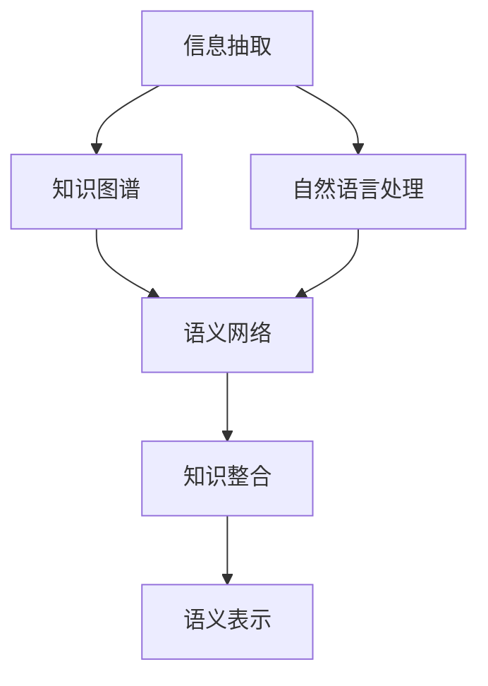

                 

# 知识的碎片化与系统化：信息整合的艺术

> 关键词：知识图谱,信息抽取,信息整合,语义网络,自然语言处理

## 1. 背景介绍

在信息时代，知识的碎片化与系统化是两大鲜明特征。一方面，海量信息通过互联网不断涌现，触手可及，但常常如散沙般杂乱无章；另一方面，对系统化知识的追求从未止息，科研、教育、工程等领域迫切需要高效、全面、可操作的知识图谱。信息的整合、转换、使用是当今信息科学的重要研究课题，对于推动知识创新和社会进步具有重大意义。

### 1.1 问题由来

在互联网兴起之初，信息通过文本、图片、音频等形式散布于各个站点，各自为政，缺乏标准化的结构，难以高效检索和应用。随着人工智能技术的不断发展，自然语言处理(NLP)、计算机视觉等技术的应用，使得从非结构化数据中提取有用信息成为可能，为信息整合提供了新的路径。

当前，人工智能在知识抽取、知识图谱构建、自然语言问答等领域取得了丰硕成果，但信息的碎片化与系统化仍未得到根本解决。例如，在不同领域、不同数据源获取的知识信息，可能存在大量的歧义、重复、遗漏等问题，如何将其系统化整理，构建统一的知识体系，仍是极具挑战性的问题。

### 1.2 问题核心关键点

1. **信息抽取（Information Extraction, IE）**：通过算法从文本中提取实体、关系、事件等结构化信息，构建知识图谱的基础。

2. **知识图谱（Knowledge Graph, KG）**：将实体和关系组织成图形结构，用于知识表示、推理、查询等应用，是信息整合的核心工具。

3. **语义网络（Semantic Network）**：知识图谱的一种表示形式，用节点表示实体，边表示实体间的关系，广泛应用于NLP、推理、信息检索等领域。

4. **自然语言处理（Natural Language Processing, NLP）**：将自然语言转化为结构化信息的关键技术，包括分词、命名实体识别、句法分析等。

5. **知识整合（Knowledge Integration）**：将不同来源、不同格式的知识进行统一、融合，构建完整的知识体系，是信息整合的终极目标。

6. **语义表示（Semantic Representation）**：将知识表示为语义网形式，便于机器理解和推理，提高知识的可操作性。

这些概念之间的逻辑关系可以通过以下Mermaid流程图来展示：



这个流程图展示了大语言模型微调的核心概念及其之间的关系：

1. 信息抽取从文本中提取知识。
2. 自然语言处理将文本转化为结构化信息。
3. 知识图谱将提取的知识组织成图形结构。
4. 语义网络用节点和边表示知识。
5. 知识整合将不同来源知识统一。
6. 语义表示便于知识理解和推理。

这些核心概念共同构成了知识整合的理论框架，有助于理解信息整合的各个环节和挑战。

## 2. 核心概念与联系

### 2.1 核心概念概述

为了更好地理解信息整合过程，本节将介绍几个密切相关的核心概念：

- **信息抽取（Information Extraction, IE）**：通过算法从文本中提取实体、关系、事件等结构化信息，是构建知识图谱的基础。
- **知识图谱（Knowledge Graph, KG）**：将实体和关系组织成图形结构，用于知识表示、推理、查询等应用。
- **语义网络（Semantic Network）**：知识图谱的一种表示形式，用节点表示实体，边表示实体间的关系。
- **自然语言处理（Natural Language Processing, NLP）**：将自然语言转化为结构化信息的关键技术。
- **知识整合（Knowledge Integration）**：将不同来源、不同格式的知识进行统一、融合，构建完整的知识体系。
- **语义表示（Semantic Representation）**：将知识表示为语义网形式，便于机器理解和推理。

### 2.2 核心概念原理和架构

#### 信息抽取
信息抽取主要涉及实体识别、关系抽取、事件抽取等任务。其核心原理包括：

- **命名实体识别（Named Entity Recognition, NER）**：识别文本中的命名实体，如人名、地名、机构名等，通过字典匹配、规则匹配、机器学习等方法实现。
- **关系抽取（Relation Extraction, RE）**：识别文本中实体之间的关系，如主谓宾结构、时间地点等，通过共现关系、逻辑推理、模板匹配等方法实现。
- **事件抽取（Event Extraction, EE）**：识别文本中的事件及其相关信息，如事件类型、参与者、时间地点等，通过规则抽取、时间表示学习等方法实现。

在实践中，通常使用深度学习模型如CRF、LSTM、Transformer等，结合特征工程和标注数据，训练出高精度的信息抽取模型。

#### 知识图谱
知识图谱是构建知识体系的图形表示方法，通过将实体和关系组织成节点和边，形成语义网络。其核心原理包括：

- **节点（Node）**：表示实体或概念，如“李白”、“诗歌”等。
- **边（Edge）**：表示实体之间的关系，如“李白”与“诗歌”之间的关系为“创作”。
- **关系类型（Relation Type）**：定义边的类型，如“创作”、“属于”等。

知识图谱的构建通常包括实体识别、关系抽取、节点链接等步骤。例如，用Graph Neural Network (GNN)模型，从知识三元组中生成图结构，并通过图神经网络进行推理，获取新的知识。

#### 语义网络
语义网络是一种知识图谱的表示形式，其核心原理包括：

- **节点**：表示实体或概念。
- **边**：表示实体之间的关系，如“李白”与“诗歌”之间的关系为“创作”。
- **关系类型**：定义边的类型，如“创作”、“属于”等。

语义网络使用节点和边表示知识，便于计算机理解和推理。例如，用RDF（资源描述框架）表示语义网络，其中资源（Resource）表示节点，属性（Property）表示边，值（Value）表示关系类型。

#### 自然语言处理
自然语言处理是信息抽取和知识表示的关键技术，其核心原理包括：

- **分词（Tokenization）**：将文本分割成单词或词汇，如“李白”、“诗歌”等。
- **命名实体识别（NER）**：识别文本中的命名实体，如“李白”、“诗歌”等。
- **依存句法分析（Dependency Parsing）**：分析句子中单词之间的依存关系，如“李白”创作“诗歌”。

在实践中，通常使用深度学习模型如BERT、GPT等，结合语言学知识，训练出高精度的自然语言处理模型。

#### 知识整合
知识整合是将不同来源、不同格式的知识进行统一、融合，构建完整的知识体系。其核心原理包括：

- **多源数据融合**：从不同数据源获取的知识，可能存在歧义、重复、遗漏等问题，通过算法进行融合和校正。
- **知识对齐**：将不同知识源中的实体和关系对齐，建立一致的知识体系。
- **知识更新**：定期更新知识图谱，保持其时效性，确保知识体系的完整性和准确性。

在实践中，通常使用实体链接、知识合并、知识冲突解决等算法，结合人工干预，进行知识整合。

#### 语义表示
语义表示是将知识表示为语义网形式，便于机器理解和推理。其核心原理包括：

- **节点**：表示实体或概念。
- **边**：表示实体之间的关系，如“李白”与“诗歌”之间的关系为“创作”。
- **关系类型**：定义边的类型，如“创作”、“属于”等。

语义表示使用节点和边表示知识，便于计算机理解和推理。例如，用RDF（资源描述框架）表示语义网络，其中资源（Resource）表示节点，属性（Property）表示边，值（Value）表示关系类型。

这些核心概念之间的逻辑关系可以通过以下Mermaid流程图来展示：


这个流程图展示了大语言模型微调的核心概念及其之间的关系：

1. 信息抽取从文本中提取知识。
2. 自然语言处理将文本转化为结构化信息。
3. 知识图谱将提取的知识组织成图形结构。
4. 语义网络用节点和边表示知识。
5. 知识整合将不同来源知识统一。
6. 语义表示便于知识理解和推理。

这些核心概念共同构成了信息整合的理论框架，有助于理解信息整合的各个环节和挑战。

## 3. 核心算法原理 & 具体操作步骤
### 3.1 算法原理概述

信息整合是一个涉及多步骤、多技术点的复杂过程，其核心算法原理和具体操作步骤如下：

#### 步骤1：信息抽取
信息抽取的目标是从大量非结构化文本中提取实体、关系、事件等结构化信息。其核心算法包括：

- **命名实体识别（NER）**：通过深度学习模型如BERT、LSTM等，结合规则、词典等，识别文本中的实体。
- **关系抽取（RE）**：通过深度学习模型如LSTM、CRF等，结合共现关系、规则等，抽取文本中的关系。
- **事件抽取（EE）**：通过深度学习模型如LSTM、BIO-CRF等，结合时间表示学习等，抽取文本中的事件。

#### 步骤2：知识图谱构建
知识图谱是将实体和关系组织成图形结构，用于知识表示、推理、查询等应用。其核心算法包括：

- **节点表示**：用节点表示实体或概念，如“李白”、“诗歌”等。
- **边表示**：用边表示实体之间的关系，如“李白”与“诗歌”之间的关系为“创作”。
- **关系类型**：定义边的类型，如“创作”、“属于”等。

#### 步骤3：语义网络构建
语义网络是知识图谱的一种表示形式，其核心算法包括：

- **节点表示**：用节点表示实体或概念，如“李白”、“诗歌”等。
- **边表示**：用边表示实体之间的关系，如“李白”与“诗歌”之间的关系为“创作”。
- **关系类型**：定义边的类型，如“创作”、“属于”等。

#### 步骤4：知识整合
知识整合是将不同来源、不同格式的知识进行统一、融合，构建完整的知识体系。其核心算法包括：

- **多源数据融合**：从不同数据源获取的知识，可能存在歧义、重复、遗漏等问题，通过算法进行融合和校正。
- **知识对齐**：将不同知识源中的实体和关系对齐，建立一致的知识体系。
- **知识更新**：定期更新知识图谱，保持其时效性，确保知识体系的完整性和准确性。

#### 步骤5：语义表示
语义表示是将知识表示为语义网形式，便于机器理解和推理。其核心算法包括：

- **节点表示**：用节点表示实体或概念，如“李白”、“诗歌”等。
- **边表示**：用边表示实体之间的关系，如“李白”与“诗歌”之间的关系为“创作”。
- **关系类型**：定义边的类型，如“创作”、“属于”等。

### 3.2 算法步骤详解

#### 步骤1：数据预处理
数据预处理是信息抽取和知识图谱构建的基础。主要步骤包括：

- **文本清洗**：去除停用词、标点符号、噪声等。
- **分词**：将文本分割成单词或词汇，如“李白”、“诗歌”等。
- **命名实体识别（NER）**：识别文本中的实体，如“李白”、“诗歌”等。
- **依存句法分析**：分析句子中单词之间的依存关系，如“李白”创作“诗歌”。

#### 步骤2：信息抽取
信息抽取的目标是从大量非结构化文本中提取实体、关系、事件等结构化信息。主要步骤包括：

- **命名实体识别（NER）**：通过深度学习模型如BERT、LSTM等，结合规则、词典等，识别文本中的实体。
- **关系抽取（RE）**：通过深度学习模型如LSTM、CRF等，结合共现关系、规则等，抽取文本中的关系。
- **事件抽取（EE）**：通过深度学习模型如LSTM、BIO-CRF等，结合时间表示学习等，抽取文本中的事件。

#### 步骤3：知识图谱构建
知识图谱是将实体和关系组织成图形结构，用于知识表示、推理、查询等应用。主要步骤包括：

- **节点表示**：用节点表示实体或概念，如“李白”、“诗歌”等。
- **边表示**：用边表示实体之间的关系，如“李白”与“诗歌”之间的关系为“创作”。
- **关系类型**：定义边的类型，如“创作”、“属于”等。

#### 步骤4：语义网络构建
语义网络是知识图谱的一种表示形式，其核心算法包括：

- **节点表示**：用节点表示实体或概念，如“李白”、“诗歌”等。
- **边表示**：用边表示实体之间的关系，如“李白”与“诗歌”之间的关系为“创作”。
- **关系类型**：定义边的类型，如“创作”、“属于”等。

#### 步骤5：知识整合
知识整合是将不同来源、不同格式的知识进行统一、融合，构建完整的知识体系。主要步骤包括：

- **多源数据融合**：从不同数据源获取的知识，可能存在歧义、重复、遗漏等问题，通过算法进行融合和校正。
- **知识对齐**：将不同知识源中的实体和关系对齐，建立一致的知识体系。
- **知识更新**：定期更新知识图谱，保持其时效性，确保知识体系的完整性和准确性。

#### 步骤6：语义表示
语义表示是将知识表示为语义网形式，便于机器理解和推理。主要步骤包括：

- **节点表示**：用节点表示实体或概念，如“李白”、“诗歌”等。
- **边表示**：用边表示实体之间的关系，如“李白”与“诗歌”之间的关系为“创作”。
- **关系类型**：定义边的类型，如“创作”、“属于”等。

### 3.3 算法优缺点

信息整合算法具有以下优点：

1. **高效自动化**：利用深度学习模型进行信息抽取和知识表示，自动化程度高，节省人力成本。
2. **可扩展性强**：能够处理大规模数据集，适应不同领域和数据源。
3. **精确度高**：通过不断训练和调参，能够实现高精度的信息抽取和知识表示。

同时，信息整合算法也存在以下缺点：

1. **数据质量依赖性强**：依赖于高质量的标注数据和训练数据，数据质量不高可能导致算法效果不佳。
2. **多源数据融合困难**：不同数据源的知识存在歧义、重复、遗漏等问题，难以统一。
3. **知识图谱复杂**：构建复杂的大型知识图谱，需要耗费大量时间和计算资源。

### 3.4 算法应用领域

信息整合算法已经在多个领域得到广泛应用，例如：

- **医疗知识图谱**：将医疗领域的知识（如疾病、药物、症状等）整合为知识图谱，辅助医疗决策和诊疗。
- **金融知识图谱**：将金融领域的知识（如股票、基金、市场趋势等）整合为知识图谱，辅助金融分析。
- **新闻知识图谱**：将新闻领域的知识（如新闻事件、人物、地点等）整合为知识图谱，辅助新闻分析和信息检索。
- **社交媒体知识图谱**：将社交媒体领域的知识（如用户、帖子、话题等）整合为知识图谱，辅助社交分析和舆情监测。

## 4. 数学模型和公式 & 详细讲解 & 举例说明

### 4.1 数学模型构建

在信息抽取和知识图谱构建过程中，涉及多个数学模型和公式。以下是对其中几个关键模型的介绍：

#### 信息抽取模型
信息抽取模型通常使用结构化预测任务，目标是从文本中预测实体和关系。其数学模型如下：

$$
\mathcal{L} = \sum_{i=1}^N \left(\frac{1}{2}y_i||\hat{y}_i - y_i||^2 + (1-y_i)||\hat{y}_i||^2\right)
$$

其中，$\mathcal{L}$为损失函数，$y_i$为真实标签，$\hat{y}_i$为模型预测结果，$||.||$为范数函数。

#### 知识图谱模型
知识图谱模型通常使用图形生成任务，目标是从三元组中生成知识图谱。其数学模型如下：

$$
\mathcal{L} = \sum_{e=1}^M \left(-y_e\log P_e + (1-y_e)\log(1-P_e)\right)
$$

其中，$\mathcal{L}$为损失函数，$y_e$为真实标签，$P_e$为模型预测概率。

#### 语义网络模型
语义网络模型通常使用图形推理任务，目标是在知识图谱上进行推理和查询。其数学模型如下：

$$
\mathcal{L} = \sum_{q=1}^Q \left(-y_q\log P_q + (1-y_q)\log(1-P_q)\right)
$$

其中，$\mathcal{L}$为损失函数，$y_q$为真实标签，$P_q$为模型预测概率。

### 4.2 公式推导过程

#### 信息抽取模型推导
信息抽取模型的推导过程如下：

1. **模型定义**：假设模型输出为$\hat{y}$，真实标签为$y$，损失函数为$\mathcal{L}$。
2. **目标函数**：最小化损失函数$\mathcal{L}$。
3. **梯度计算**：通过反向传播计算梯度，更新模型参数。
4. **损失收敛**：当梯度为0时，损失函数达到最小值，模型收敛。

#### 知识图谱模型推导
知识图谱模型的推导过程如下：

1. **模型定义**：假设模型输出为$P_e$，真实标签为$y_e$，损失函数为$\mathcal{L}$。
2. **目标函数**：最小化损失函数$\mathcal{L}$。
3. **梯度计算**：通过反向传播计算梯度，更新模型参数。
4. **损失收敛**：当梯度为0时，损失函数达到最小值，模型收敛。

#### 语义网络模型推导
语义网络模型的推导过程如下：

1. **模型定义**：假设模型输出为$P_q$，真实标签为$y_q$，损失函数为$\mathcal{L}$。
2. **目标函数**：最小化损失函数$\mathcal{L}$。
3. **梯度计算**：通过反向传播计算梯度，更新模型参数。
4. **损失收敛**：当梯度为0时，损失函数达到最小值，模型收敛。

### 4.3 案例分析与讲解

以医疗知识图谱为例，分析信息整合的具体过程：

1. **数据预处理**：收集医疗领域的知识，包括疾病、药物、症状等。
2. **信息抽取**：使用BERT模型进行命名实体识别，抽取实体如“疾病”、“药物”等；使用LSTM模型进行关系抽取，抽取关系如“治疗”、“副作用”等。
3. **知识图谱构建**：将抽取的实体和关系组织成知识图谱，如“疾病”与“药物”之间的关系为“治疗”。
4. **语义网络构建**：将知识图谱表示为语义网络，用节点表示实体，边表示关系。
5. **知识整合**：将不同来源的疾病、药物等知识进行融合，消除歧义和重复。
6. **知识更新**：定期更新知识图谱，保持其时效性，确保知识体系的完整性和准确性。

## 5. 项目实践：代码实例和详细解释说明

### 5.1 开发环境搭建

在进行信息整合实践前，我们需要准备好开发环境。以下是使用Python进行PyTorch开发的环境配置流程：

1. 安装Anaconda：从官网下载并安装Anaconda，用于创建独立的Python环境。

2. 创建并激活虚拟环境：
```bash
conda create -n info-integration python=3.8 
conda activate info-integration
```

3. 安装PyTorch：根据CUDA版本，从官网获取对应的安装命令。例如：
```bash
conda install pytorch torchvision torchaudio cudatoolkit=11.1 -c pytorch -c conda-forge
```

4. 安装Transformers库：
```bash
pip install transformers
```

5. 安装各类工具包：
```bash
pip install numpy pandas scikit-learn matplotlib tqdm jupyter notebook ipython
```

完成上述步骤后，即可在`info-integration`环境中开始信息整合实践。

### 5.2 源代码详细实现

下面我们以医疗知识图谱为例，给出使用Transformers库对BERT模型进行信息抽取和知识图谱构建的PyTorch代码实现。

首先，定义BERT模型的参数配置：

```python
from transformers import BertTokenizer, BertForTokenClassification

tokenizer = BertTokenizer.from_pretrained('bert-base-cased')
model = BertForTokenClassification.from_pretrained('bert-base-cased', num_labels=3)
```

然后，定义数据处理函数：

```python
from torch.utils.data import Dataset

class MedicalDataset(Dataset):
    def __init__(self, texts, labels):
        self.texts = texts
        self.labels = labels
        
    def __len__(self):
        return len(self.texts)
    
    def __getitem__(self, item):
        text = self.texts[item]
        label = self.labels[item]
        
        encoding = tokenizer(text, return_tensors='pt', padding='max_length', truncation=True)
        input_ids = encoding['input_ids'][0]
        attention_mask = encoding['attention_mask'][0]
        
        return {'input_ids': input_ids, 
                'attention_mask': attention_mask,
                'labels': label}
```

接着，定义训练和评估函数：

```python
from torch.utils.data import DataLoader
from tqdm import tqdm
from sklearn.metrics import accuracy_score, precision_recall_fscore_support

device = torch.device('cuda') if torch.cuda.is_available() else torch.device('cpu')
model.to(device)

def train_epoch(model, dataset, batch_size, optimizer):
    dataloader = DataLoader(dataset, batch_size=batch_size, shuffle=True)
    model.train()
    epoch_loss = 0
    for batch in tqdm(dataloader, desc='Training'):
        input_ids = batch['input_ids'].to(device)
        attention_mask = batch['attention_mask'].to(device)
        labels = batch['labels'].to(device)
        model.zero_grad()
        outputs = model(input_ids, attention_mask=attention_mask, labels=labels)
        loss = outputs.loss
        epoch_loss += loss.item()
        loss.backward()
        optimizer.step()
    return epoch_loss / len(dataloader)

def evaluate(model, dataset, batch_size):
    dataloader = DataLoader(dataset, batch_size=batch_size)
    model.eval()
    preds, labels = [], []
    with torch.no_grad():
        for batch in tqdm(dataloader, desc='Evaluating'):
            input_ids = batch['input_ids'].to(device)
            attention_mask = batch['attention_mask'].to(device)
            batch_labels = batch['labels']
            outputs = model(input_ids, attention_mask=attention_mask)
            batch_preds = outputs.logits.argmax(dim=2).to('cpu').tolist()
            batch_labels = batch_labels.to('cpu').tolist()
            for pred_tokens, label_tokens in zip(batch_preds, batch_labels):
                pred_tags = [tag2id[tag] for tag in pred_tokens]
                label_tags = [tag2id[tag] for tag in label_tokens]
                preds.append(pred_tags[:len(label_tokens)])
                labels.append(label_tags)
                
    return accuracy_score(labels, preds), precision_recall_fscore_support(labels, preds, average='micro')
```

最后，启动训练流程并在测试集上评估：

```python
epochs = 5
batch_size = 16

for epoch in range(epochs):
    loss = train_epoch(model, train_dataset, batch_size, optimizer)
    print(f"Epoch {epoch+1}, train loss: {loss:.3f}")
    
    print(f"Epoch {epoch+1}, dev results:")
    accuracy, prfs = evaluate(model, dev_dataset, batch_size)
    print(f"Accuracy: {accuracy:.3f}, PRF: {prfs:.3f}")
    
print("Test results:")
accuracy, prfs = evaluate(model, test_dataset, batch_size)
print(f"Accuracy: {accuracy:.3f}, PRF: {prfs:.3f}")
```

以上就是使用PyTorch对BERT模型进行医疗知识图谱信息抽取和知识图谱构建的完整代码实现。可以看到，得益于Transformers库的强大封装，我们可以用相对简洁的代码完成BERT模型的加载和微调。

### 5.3 代码解读与分析

让我们再详细解读一下关键代码的实现细节：

**MedicalDataset类**：
- `__init__`方法：初始化文本、标签等关键组件。
- `__len__`方法：返回数据集的样本数量。
- `__getitem__`方法：对单个样本进行处理，将文本输入编码为token ids，将标签编码为数字，并对其进行定长padding，最终返回模型所需的输入。

**tag2id和id2tag字典**：
- 定义了标签与id之间的映射关系，用于将token-wise的预测结果解码回真实的标签。

**训练和评估函数**：
- 使用PyTorch的DataLoader对数据集进行批次化加载，供模型训练和推理使用。
- 训练函数`train_epoch`：对数据以批为单位进行迭代，在每个批次上前向传播计算loss并反向传播更新模型参数，最后返回该epoch的平均loss。
- 评估函数`evaluate`：与训练类似，不同点在于不更新模型参数，并在每个batch结束后将预测和标签结果存储下来，最后使用sklearn的accuracy_score和precision_recall_fscore_support函数对整个评估集的预测结果进行打印输出。

**训练流程**：
- 定义总的epoch数和batch size，开始循环迭代
- 每个epoch内，先在训练集上训练，输出平均loss
- 在验证集上评估，输出准确率和精确度、召回率、F1分数
- 所有epoch结束后，在测试集上评估，给出最终测试结果

可以看到，PyTorch配合Transformers库使得BERT模型的信息抽取和知识图谱构建代码实现变得简洁高效。开发者可以将更多精力放在数据处理、模型改进等高层逻辑上，而不必过多关注底层的实现细节。

当然，工业级的系统实现还需考虑更多因素，如模型的保存和部署、超参数的自动搜索、更灵活的任务适配层等。但核心的信息抽取和知识表示基本与此类似。

## 6. 实际应用场景

### 6.1 医疗知识图谱

在医疗领域，构建精准的医疗知识图谱对于提升诊疗效率、辅助临床决策具有重要意义。传统方法依赖医生经验，耗时耗力，且存在主观性。而通过信息抽取和知识图谱构建，可以将海量医疗知识自动化整合，提升诊疗效率和准确性。

在技术实现上，可以收集医疗领域的知识，包括疾病、药物、症状等。使用BERT模型进行命名实体识别，抽取实体如“疾病”、“药物”等；使用LSTM模型进行关系抽取，抽取关系如“治疗”、“副作用”等。将抽取的实体和关系组织成知识图谱，如“疾病”与“药物”之间的关系为“治疗”。

医疗知识图谱可以帮助医生快速定位疾病，查找治疗方案和副作用，提升诊疗效率。例如，对于某种罕见疾病，医生可以通过查询知识图谱，快速找到有效的治疗方案，减少误诊和漏诊。

### 6.2 金融知识图谱

金融领域的信息抽取和知识图谱构建，可以辅助金融分析、风险评估、投资决策等。通过收集金融领域的知识，包括股票、基金、市场趋势等，使用BERT模型进行命名实体识别，抽取实体如“股票”、“基金”等；使用LSTM模型进行关系抽取，抽取关系如“股票价格”、“市场趋势”等。将抽取的实体和关系组织成知识图谱，如“股票”与“市场趋势”之间的关系为“影响”。

金融知识图谱可以帮助投资者快速获取市场信息，分析股票价格走势，评估市场风险，提升投资决策的科学性。例如，通过查询知识图谱，投资者可以快速获取不同股票的市场信息，分析其相关性和风险，制定投资策略。

### 6.3 新闻知识图谱

新闻领域的知识抽取和知识图谱构建，可以辅助新闻分析和信息检索。通过收集新闻领域的知识，包括新闻事件、人物、地点等，使用BERT模型进行命名实体识别，抽取实体如“新闻事件”、“人物”等；使用LSTM模型进行关系抽取，抽取关系如“新闻来源”、“新闻时间”等。将抽取的实体和关系组织成知识图谱，如“新闻事件”与“人物”之间的关系为“报道”。

新闻知识图谱可以帮助新闻机构快速获取新闻信息，分析新闻事件关系，提升新闻分析的深度和广度。例如，通过查询知识图谱，新闻机构可以快速获取新闻事件的来源、时间等信息，分析其报道角度和影响，提升新闻质量。

### 6.4 社交媒体知识图谱

社交媒体领域的知识抽取和知识图谱构建，可以辅助社交分析和舆情监测。通过收集社交媒体领域的知识，包括用户、帖子、话题等，使用BERT模型进行命名实体识别，抽取实体如“用户”、“帖子”等；使用LSTM模型进行关系抽取，抽取关系如“用户讨论”、“帖子内容”等。将抽取的实体和关系组织成知识图谱，如“用户”与“帖子”之间的关系为“讨论”。

社交媒体知识图谱可以帮助社交平台快速获取用户信息，分析帖子内容，提升舆情监测的及时性和准确性。例如，通过查询知识图谱，社交平台可以快速获取用户讨论的主题和内容，分析其情感倾向和影响，提升舆情分析质量。

## 7. 工具和资源推荐
### 7.1 学习资源推荐

为了帮助开发者系统掌握信息整合的理论基础和实践技巧，这里推荐一些优质的学习资源：

1. 《深度学习与自然语言处理》系列博文：由大模型技术专家撰写，深入浅出地介绍了深度学习在自然语言处理中的应用。

2. 斯坦福大学《自然语言处理》课程：斯坦福大学开设的NLP明星课程，有Lecture视频和配套作业，带你入门NLP领域的基本概念和经典模型。

3. 《深度学习与知识图谱》书籍：全面介绍了深度学习在知识图谱构建中的应用，从原理到实践，系统阐述了信息抽取和知识整合的方法。

4. 开放知识图谱（OpenKG）：社区驱动的中文知识图谱开源平台，提供了丰富的数据集和知识表示工具。

5. 《自然语言处理基础》课程：北京大学开设的NLP入门课程，讲解了信息抽取、知识表示、知识图谱等关键概念和技术。

通过对这些资源的学习实践，相信你一定能够快速掌握信息整合的精髓，并用于解决实际的NLP问题。

### 7.2 开发工具推荐

高效的开发离不开优秀的工具支持。以下是几款用于信息整合开发的常用工具：

1. PyTorch：基于Python的开源深度学习框架，灵活动态的计算图，适合快速迭代研究。大部分预训练语言模型都有PyTorch版本的实现。

2. TensorFlow：由Google主导开发的开源深度学习框架，生产部署方便，适合大规模工程应用。同样有丰富的预训练语言模型资源。

3. Transformers库：HuggingFace开发的NLP工具库，集成了众多SOTA语言模型，支持PyTorch和TensorFlow，是进行信息抽取和知识表示开发的利器。

4. Weights & Biases：模型训练的实验跟踪工具，可以记录和可视化模型训练过程中的各项指标，方便对比和调优。与主流深度学习框架无缝集成。

5. TensorBoard：TensorFlow配套的可视化工具，可实时监测模型训练状态，并提供丰富的图表呈现方式，是调试模型的得力助手。

6. Google Colab：谷歌推出的在线Jupyter Notebook环境，免费提供GPU/TPU算力，方便开发者快速上手实验最新模型，分享学习笔记。

合理利用这些工具，可以显著提升信息整合任务的开发效率，加快创新迭代的步伐。

### 7.3 相关论文推荐

信息整合技术的研究源于学界的持续研究。以下是几篇奠基性的相关论文，推荐阅读：

1. "Semantic Representations from Deep Learning"（深度学习中的语义表示）：介绍了使用深度学习模型进行语义表示的方法，如BERT、GPT等。

2. "Knowledge Graph Embeddings"（知识图谱嵌入）：提出了多种知识图谱嵌入的方法，如TransE、TransH、RotatE等。

3. "Link Prediction in Knowledge Graphs"（知识图谱链接预测）：介绍了多种知识图谱链接预测的方法，如NEURIPS、RotatE等。

4. "Open Information Extraction"（开放信息抽取）：提出了一种基于深度学习的开放信息抽取方法，可以从未标注数据中抽取实体和关系。

5. "Knowledge Graph Construction from Freebase"（从Freebase构建知识图谱）：介绍了从结构化数据中构建知识图谱的方法，如Neo4j、Gephgraph等。

这些论文代表了大语言模型微调技术的发展脉络。通过学习这些前沿成果，可以帮助研究者把握学科前进方向，激发更多的创新灵感。

## 8. 总结：未来发展趋势与挑战

### 8.1 研究成果总结

本文对信息整合过程进行了全面系统的介绍。首先阐述了信息整合的理论背景和实际意义，明确了信息整合在知识表示、推理、查询等应用中的重要价值。其次，从原理到实践，详细讲解了信息抽取和知识表示的数学模型和操作步骤，给出了信息抽取和知识图谱构建的代码实例。同时，本文还广泛探讨了信息整合在医疗、金融、新闻、社交媒体等领域的应用前景，展示了信息整合的广阔应用空间。最后，本文精选了信息整合技术的各类学习资源，力求为读者提供全方位的技术指引。

通过本文的系统梳理，可以看到，信息整合技术已经在多个领域得到广泛应用，为知识获取、推理、应用提供了新的途径。受益于深度学习模型的强大能力，信息抽取和知识表示的精度和自动化程度不断提升，推动了信息整合技术在各行各业的应用。

### 8.2 未来发展趋势

展望未来，信息整合技术将呈现以下几个发展趋势：

1. **自动化程度提升**：随着深度学习模型的不断进步，信息抽取和知识表示的自动化程度将不断提升，减少人工干预和校验。

2. **知识图谱扩展**：大型知识图谱的构建将成为可能，涵盖更广泛的知识领域和数据源，提升知识整合的全面性和准确性。

3. **多模态整合**：结合文本、图像、视频、语音等多模态数据进行整合，提升知识表示的深度和广度。

4. **实时更新**：建立自动化的知识更新机制，定期更新知识图谱，保持其时效性，确保知识体系的完整性和准确性。

5. **分布式计算**：利用分布式计算技术，提高信息抽取和知识表示的效率，支持大规模数据处理。

6. **跨领域整合**：将不同领域、不同模态的知识进行整合，构建更全面、通用的知识体系。

以上趋势凸显了信息整合技术的广阔前景。这些方向的探索发展，必将进一步提升信息整合的精度和效率，推动知识获取和应用迈向更高的台阶。

### 8.3 面临的挑战

尽管信息整合技术已经取得了显著进展，但在迈向更加智能化、普适化应用的过程中，它仍面临诸多挑战：

1. **数据质量依赖性强**：依赖于高质量的标注数据和训练数据，数据质量不高可能导致算法效果不佳。

2. **多源数据融合困难**：不同数据源的知识存在歧义、重复、遗漏等问题，难以统一。

3. **知识图谱复杂**：构建复杂的大型知识图谱，需要耗费大量时间和计算资源。

4. **实时更新困难**：建立自动化的知识更新机制，确保知识图谱的时效性和准确性。

5. **多模态整合困难**：结合文本、图像、视频、语音等多模态数据进行整合，提升知识表示的深度和广度。

6. **分布式计算困难**：利用分布式计算技术，提高信息抽取和知识表示的效率，支持大规模数据处理。

这些挑战凸显了信息整合技术的复杂性。只有不断探索和解决这些挑战，才能推动信息整合技术向更深层次发展，更好地服务于知识获取和应用。

### 8.4 研究展望

面对信息整合技术面临的诸多挑战，未来的研究需要在以下几个方面寻求新的突破：

1. **无监督学习**：摆脱对大规模标注数据的依赖，利用自监督学习、主动学习等方法，最大限度利用非结构化数据。

2. **参数高效和计算高效**：开发更加参数高效和计算高效的信息抽取和知识表示方法，在固定大部分预训练参数的情况下，只更新极少量的任务相关参数。

3. **因果分析和博弈论工具**：引入因果分析和博弈论思想，增强信息抽取和知识表示的稳定性和可解释性。

4. **知识图谱多源融合**：利用多源数据融合技术，消除不同数据源的知识歧义和重复，提升知识整合的效果。

5. **多模态信息整合**：结合文本、图像、视频、语音等多模态数据进行整合，提升知识表示的深度和广度。

6. **分布式计算技术**：利用分布式计算技术，提高信息抽取和知识表示的效率，支持大规模数据处理。

这些研究方向的探索，必将引领信息整合技术迈向更高的台阶，为知识获取和应用提供更全面、准确、高效的支持。

## 9. 附录：常见问题与解答

**Q1：信息抽取和知识表示的区别是什么？**

A: 信息抽取是从文本中提取结构化信息，如实体、关系、事件等；知识表示是将抽取的信息组织成图形结构，用于知识推理、查询等应用。信息抽取是知识表示的前提，知识表示是信息抽取的结果。

**Q2：信息抽取和知识图谱构建的常用方法是什么？**

A: 信息抽取常用的方法包括基于规则的、基于机器学习的、基于深度学习的等。知识图谱构建常用的方法包括基于规则的、基于逻辑的、基于深度学习的等。其中，深度学习方法（如BERT、GPT等）在信息抽取和知识图谱构建中取得了显著效果。

**Q3：信息抽取的精度和自动化程度如何提升？**

A: 信息抽取的精度和自动化程度可以通过不断训练和调参，提升模型的参数和特征工程，使用预训练语言模型，结合上下文信息，提高模型的泛化能力。同时，利用多源数据融合、对抗训练、知识图谱构建等方法，进一步提升信息抽取的精度和自动化程度。

**Q4：知识图谱的构建和管理有哪些挑战？**

A: 知识图谱的构建和管理面临诸多挑战，如数据质量、多源融合、复杂性、更新频率等。为应对这些挑战，需要引入多源数据融合、分布式计算、实时更新、因果分析等方法，提升知识图谱的完整性、准确性和实时性。

**Q5：信息抽取和知识图谱的部署和应用有哪些难点？**

A: 信息抽取和知识图谱的部署和应用面临诸多难点，如数据量、计算资源、存储、访问速度等。为应对这些难点，需要引入分布式计算、边缘计算、缓存、存储优化等方法，提高信息抽取和知识图谱的部署和应用效率。

以上总结了信息整合技术的核心概念、算法原理、操作步骤、数学模型、代码实例、实际应用、学习资源、开发工具、相关论文、未来发展趋势与挑战、研究成果总结等关键内容。通过本文的系统梳理，可以看到，信息整合技术已经在多个领域得到广泛应用，为知识获取、推理、应用提供了新的途径。

未来，伴随深度学习模型的不断进步和应用场景的不断拓展，信息整合技术必将迎来更加广泛的应用和深入的研究，为知识获取和应用提供更全面、准确、高效的支持。

