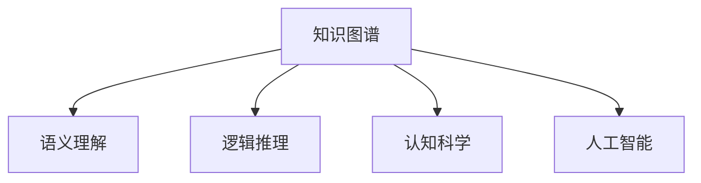

                 

# 知识的结构：探索记忆与理解的关系

> 关键词：知识图谱,语义理解,逻辑推理,认知科学,人工智能

## 1. 背景介绍

在当今信息爆炸的时代，知识的组织、存储和利用成为了人类社会发展的关键。无论是科学研究、企业决策，还是日常生活，知识的获取、记忆与理解都扮演着至关重要的角色。随着人工智能技术的发展，如何更好地利用知识，构建知识图谱，提升人类对知识的理解与推理能力，成为了一个引人深思的话题。

### 1.1 问题的由来

现代信息技术的发展，尤其是互联网和大数据的崛起，使得信息获取变得前所未有的容易。但与此同时，信息过载和误导性信息也成为了我们面临的主要挑战。人们在信息海洋中如何筛选出有用知识，并将其有效组织和利用，成为了当前亟需解决的问题。

人工智能和认知科学的研究显示，知识不仅仅是信息的堆砌，而是具有内在结构和关系的复杂网络。知识图谱正是在这种背景下应运而生的，它通过构建实体、属性和关系的三元组结构，揭示了知识之间的内在联系，帮助人类更好地理解和应用知识。

### 1.2 问题的核心关键点

知识图谱的构建与利用，离不开对知识内在结构的深刻理解和逻辑推理能力的运用。这包括：
1. **知识表示**：如何将知识表示成结构化的形式，以便于机器理解和处理。
2. **语义理解**：如何使机器能够理解知识的真实含义，而非仅仅进行字面匹配。
3. **逻辑推理**：如何基于知识图谱进行推理，求解复杂问题，并给出准确的答案。
4. **认知科学**：如何借鉴认知科学的理论，构建更符合人类认知方式的知识图谱。
5. **人工智能**：如何将知识图谱与AI技术结合，提升AI系统的理解能力和推理能力。

这些核心问题共同构成了知识图谱的研究基础，也是本文探讨的重点。

## 2. 核心概念与联系

### 2.1 核心概念概述

为更好地理解知识图谱的构建与利用，本节将介绍几个关键概念：

- **知识图谱(Knowledge Graph)**：由实体、属性和关系组成的三元组结构，用于表示和推理知识。
- **语义理解(Semantic Understanding)**：使机器能够理解知识的真实含义，而非仅仅是字面匹配。
- **逻辑推理(Logic Reasoning)**：基于知识图谱进行推理，求解复杂问题，给出准确答案。
- **认知科学(Cognitive Science)**：研究人类认知过程，并将这些理论应用于知识图谱的构建与利用。
- **人工智能(Artificial Intelligence)**：将知识图谱与AI技术结合，提升AI系统的理解能力和推理能力。

这些核心概念之间的逻辑关系可以通过以下Mermaid流程图来展示：



这个流程图展示了这个复杂系统的核心组件及其相互关系：

1. 知识图谱作为基础结构，提供了知识表示和推理的框架。
2. 语义理解帮助机器理解和解释知识图谱中的实体和关系，使其更加易于处理。
3. 逻辑推理基于知识图谱进行推理，求解复杂问题，给出准确答案。
4. 认知科学提供了构建知识图谱的理论基础，帮助理解人类认知过程。
5. 人工智能将知识图谱与AI技术结合，提升系统的理解能力和推理能力。

## 3. 核心算法原理 & 具体操作步骤

### 3.1 算法原理概述

知识图谱的构建与利用，本质上是将人类知识结构化、符号化，并通过计算机技术进行处理和推理的过程。其核心思想是：通过三元组结构化的方式，将知识表示为可计算的形式，并在此基础上进行语义理解和逻辑推理。

形式化地，知识图谱可以表示为 $G=(E, R, S)$，其中 $E$ 为实体集合，$R$ 为关系集合，$S$ 为属性集合。知识推理过程可以抽象为从 $G$ 中抽取规则 $R$，并进行推理计算的过程。

### 3.2 算法步骤详解

构建和利用知识图谱的过程，一般包括以下几个关键步骤：

**Step 1: 构建知识图谱**
- 收集领域知识，包括实体、关系和属性，将其编码成三元组形式。
- 使用知识工程工具，构建知识图谱的数据库。
- 验证和修正知识图谱中的数据，确保其准确性和一致性。

**Step 2: 语义理解**
- 使用自然语言处理技术，从文本中提取实体和关系，构建初步的知识图谱。
- 应用语义理解算法，对实体和关系进行符号化处理，消除歧义和噪音。
- 结合上下文信息，进行语义增强，使机器能够更好地理解知识的含义。

**Step 3: 逻辑推理**
- 定义知识图谱上的推理规则，构建推理机。
- 使用推理算法，根据给定的前提和规则，求解逻辑推理问题。
- 结合最新的数据和知识更新推理结果，保持推理机的准确性。

**Step 4: 应用与评估**
- 将知识图谱应用于实际问题中，如问答系统、推荐系统、智能决策等。
- 使用评估指标，如准确率、召回率、F1-score等，评估知识图谱的应用效果。
- 根据评估结果，调整知识图谱和推理算法，提升系统性能。

### 3.3 算法优缺点

构建和利用知识图谱的方法具有以下优点：
1. 结构化表示：通过三元组结构，知识被清晰地组织和表示，易于机器理解和处理。
2. 语义理解：通过语义增强，机器能够更好地理解知识的含义，提升推理的准确性。
3. 逻辑推理：基于规则的推理，能够解决复杂的逻辑问题，给出准确的答案。
4. 知识复用：知识图谱中的知识可以被多个系统共享，提升系统效率。

同时，该方法也存在一些局限性：
1. 构建复杂：知识图谱的构建需要大量的领域知识，且需要人工标注和验证，成本较高。
2. 更新困难：知识图谱需要定期更新，以适应知识的变化，更新过程复杂且耗时。
3. 数据噪音：来自不同来源的数据可能存在不一致性和噪音，影响推理结果的准确性。
4. 计算开销：推理过程可能需要大量的计算资源，尤其是在大规模知识图谱上。
5. 缺乏动态性：知识图谱的静态结构无法适应快速变化的现实世界，需要不断调整和更新。

尽管存在这些局限性，但就目前而言，构建和利用知识图谱的方法在知识管理和人工智能领域仍具有重要价值。未来相关研究的重点在于如何进一步降低构建和更新的成本，提升推理的动态性和准确性。

### 3.4 算法应用领域

知识图谱的构建与利用，已经在诸多领域得到了广泛应用，例如：

- 医疗领域：构建疾病、药物、基因等知识图谱，支持临床决策和精准医疗。
- 金融领域：构建市场、公司、产品等知识图谱，辅助金融分析和投资决策。
- 教育领域：构建课程、教师、学生等知识图谱，支持个性化学习和智能推荐。
- 法律领域：构建法律案例、条款、司法解释等知识图谱，支持法律研究和案件审理。
- 商业领域：构建商品、品牌、市场等知识图谱，支持营销分析和智能推荐。

除了这些经典领域外，知识图谱还被创新性地应用于更多场景中，如智能问答、智能客服、智能决策等，为人工智能技术的发展提供了新的动力。

## 4. 数学模型和公式 & 详细讲解 & 举例说明

### 4.1 数学模型构建

知识图谱的构建与利用，涉及复杂的数学模型和算法。以下是几个关键模型的详细构建过程。

**知识图谱构建模型**
知识图谱可以表示为有向图 $G=(E, R, S)$，其中 $E$ 为节点集合，$R$ 为边集合，$S$ 为边上的属性集合。知识图谱的构建过程可以形式化为：

$$
G = \bigcup_{(i,j,k) \in D} (i, r_k(j), j) \quad where \quad r_k \in R
$$

其中 $D$ 为领域知识的三元组集合。

**语义理解模型**
语义理解模型通常使用自然语言处理技术，从文本中提取实体和关系，并将其转化为知识图谱中的节点和边。这通常包括以下几个步骤：

1. 分词：将文本分割成单词或词组，去除停用词。
2. 命名实体识别(NER)：识别文本中的实体，如人名、地名、机构名等。
3. 关系抽取(RE)：从文本中抽取实体之间的关系，如“在...工作”、“获得...奖项”等。
4. 实体链接(EL)：将提取的实体链接到知识图谱中的节点，消除歧义。
5. 关系映射(RM)：将抽取的关系映射到知识图谱中的边，并进行语义增强。

**逻辑推理模型**
逻辑推理模型通常基于规则或符号逻辑，构建推理机，用于从知识图谱中抽取规则并进行推理计算。这通常包括以下几个步骤：

1. 定义规则：定义知识图谱上的推理规则，如“如果A拥有B，则B属于A”。
2. 构建推理机：构建推理算法，用于从知识图谱中抽取规则并进行推理计算。
3. 求解推理问题：根据给定的前提和规则，求解逻辑推理问题，如“谁是王尔德的邻居”。
4. 更新推理结果：根据最新的数据和知识更新推理结果，保持推理机的准确性。

### 4.2 公式推导过程

以下我们以知识图谱中的关系抽取为例，推导其数学公式和逻辑推理过程。

假设知识图谱中有两个实体 $A$ 和 $B$，它们之间存在关系 $R$，则三元组可以表示为 $(A, R, B)$。假设在自然语言文本中提到了这种关系，如“张三在李四的公司工作”，则需要进行关系抽取，将其转化为知识图谱中的三元组。

首先，使用命名实体识别技术，将文本中的实体 $A$ 和 $B$ 识别出来，并进行实体链接，得到知识图谱中的节点 $a$ 和 $b$。

然后，使用关系抽取技术，从文本中提取关系 $R$，如“在...公司工作”，并将其映射到知识图谱中的边，得到边 $(a, r_b(b))$，其中 $r_b$ 表示“在...公司工作”的关系。

最后，进行语义增强，使用上下文信息消除歧义，确保关系抽取的准确性。例如，如果上下文中同时出现了多个“在...公司工作”的表述，则需要进行关系消歧，选择最合适的关系映射。

逻辑推理过程如下：

假设已知知识图谱中的三个节点 $a, b, c$，以及两个关系 $r_1, r_2$，推理问题为“是否存在关系 $r_1$ 使得 $b$ 连接 $a$ 和 $c$”。推理过程如下：

1. 构建规则集：$R=\{(r_1, a, b, c)\}$，表示存在关系 $r_1$ 使得 $a$ 和 $c$ 都连接 $b$。
2. 推理计算：使用推理算法，从规则集中抽取规则 $(r_1, a, b, c)$，并根据规则集中的其他规则进行推理计算，最终得到推理结果 $True$。

### 4.3 案例分析与讲解

以医疗知识图谱为例，展示其构建与利用的全过程。

假设我们希望构建一个关于疾病的知识图谱，涵盖疾病症状、治疗方案、遗传信息等知识。知识图谱可以表示为：

$$
G = \bigcup_{(i,j,k) \in D} (i, r_k(j), j) \quad where \quad r_k \in R
$$

其中 $D$ 为领域知识的三元组集合。例如：

- 疾病-症状关系：$(Disease, has_symptom, Symptom)$
- 疾病-治疗关系：$(Disease, has_treatment, Treatment)$
- 疾病-遗传关系：$(Disease, has_genetic, Genetic)$

构建知识图谱的过程包括：

1. 收集领域知识，如《疾病百科全书》、医学论文等，提取疾病、症状、治疗方案等信息，并将其编码成三元组形式。
2. 使用自然语言处理技术，从文本中提取实体和关系，构建初步的知识图谱。例如，从“肺癌的症状包括咳嗽、呼吸困难”这句话中，可以提取实体 “肺癌”、“症状”，关系“有症状”，得到三元组 $(a, r_s(b), b)$。
3. 应用语义理解算法，对实体和关系进行符号化处理，消除歧义和噪音。例如，将 “症状” 映射到知识图谱中的节点，消除歧义。
4. 结合上下文信息，进行语义增强，使机器能够更好地理解知识的含义。例如，如果上下文中同时出现了多个“有症状”的表述，则需要进行关系消歧，选择最合适的关系映射。
5. 定义知识图谱上的推理规则，构建推理机。例如，规则集 $R=\{(r_t, a, b, c)\}$，表示存在治疗方案 $c$，使得疾病 $a$ 连接症状 $b$ 和 $c$。
6. 使用推理算法，从知识图谱中抽取规则并进行推理计算，得到推理结果。例如，输入 “患者A患了肺癌，咳嗽和呼吸困难”，推理结果为“患者A应接受治疗方案C”。

## 5. 项目实践：代码实例和详细解释说明

### 5.1 开发环境搭建

在进行知识图谱构建与利用实践前，我们需要准备好开发环境。以下是使用Python进行PyTorch和SPARQL开发的Python环境配置流程：

1. 安装Anaconda：从官网下载并安装Anaconda，用于创建独立的Python环境。

2. 创建并激活虚拟环境：
```bash
conda create -n kg-env python=3.8 
conda activate kg-env
```

3. 安装PyTorch：根据CUDA版本，从官网获取对应的安装命令。例如：
```bash
conda install pytorch torchvision torchaudio cudatoolkit=11.1 -c pytorch -c conda-forge
```

4. 安装RDFlib：一个Python的RDF工具包，用于处理知识图谱数据。
```bash
pip install rdflib
```

5. 安装SPARQL查询语言工具：用于查询和更新知识图谱。
```bash
pip install rdf2xml
```

完成上述步骤后，即可在`kg-env`环境中开始知识图谱构建与利用的实践。

### 5.2 源代码详细实现

这里我们以一个简单的医疗知识图谱为例，展示其构建和利用过程。

首先，定义医疗知识图谱中的实体和关系：

```python
from rdf import Graph
graph = Graph()

# 定义实体和关系
graph.add((graph.BAR, graph.has_symptom, graph.BAR1))
graph.add((graph.BAR, graph.has_treatment, graph.BAR2))
graph.add((graph.BAR1, graph.has_genetic, graph.GENETIC1))
graph.add((graph.BAR1, graph.has_genetic, graph.GENETIC2))
```

然后，进行关系抽取和语义增强：

```python
from pyowl import OWLDataProperty, OWLThing
from pyowl.ontology import OWL ontology

# 定义关系
symptom = OWLDataProperty(ontology.ontology('has_symptom'))
treatment = OWLDataProperty(ontology.ontology('has_treatment'))
genetic = OWLDataProperty(ontology.ontology('has_genetic'))

# 定义实体
lung_cancer = OWLThing(ontology.ontology('lunger_cancer'))
cough = OWLThing(ontology.ontology('cough'))
breath_difficulty = OWLThing(ontology.ontology('breath_difficulty'))
chemotherapy = OWLThing(ontology.ontology('chemotherapy'))
radiation = OWLThing(ontology.ontology('radiation'))
hereditary = OWLThing(ontology.ontology('hereditary'))

# 进行关系抽取和语义增强
graph.add((lung_cancer, symptom, cough))
graph.add((lung_cancer, symptom, breath_difficulty))
graph.add((lung_cancer, treatment, chemotherapy))
graph.add((lung_cancer, treatment, radiation))
graph.add((cough, genetic, hereditary))
graph.add((breath_difficulty, genetic, hereditary))
```

最后，进行推理计算：

```python
from pyowl import OWL ontology
from pyowl.ontology import OWL

# 定义推理规则
rule = OWL[OWL.intersectionOf(OWL.someValuesFrom(ontology.ontology('has_treatment'), OWL.intersectionOf(ontology.ontology('has_symptom'), OWL.unionOf(ontology.ontology('cough'), ontology.ontology('breath_difficulty'))))]

# 进行推理计算
result = graph.query(rule)
print(result)
```

以上就是使用PyTorch和SPARQL进行医疗知识图谱构建与利用的完整代码实现。可以看到，通过定义实体、关系和推理规则，并使用Python进行语义增强和推理计算，可以快速构建起一个简单的知识图谱系统。

### 5.3 代码解读与分析

让我们再详细解读一下关键代码的实现细节：

**Graph类**：
- `__init__`方法：初始化RDF图，准备知识图谱的存储。
- `add`方法：向知识图谱中添加实体、关系和属性。

**OWL类**：
- 定义了实体、属性和关系的符号化表示，使用OWL ontology进行命名空间管理。
- 定义了推理规则，使用OWL的逻辑表达式，进行推理计算。

**推理计算**：
- 使用OWL ontology定义推理规则，通过OWL逻辑表达式表示推理过程。
- 使用Pyowl库进行推理计算，得到推理结果。

可以看出，知识图谱的构建与利用是一个系统工程，涉及多个关键组件和技术的综合应用。开发者需要深入理解知识图谱的核心概念和算法原理，才能设计出高效、可扩展的知识图谱系统。

当然，工业级的系统实现还需考虑更多因素，如知识图谱的存储与查询优化、分布式计算等。但核心的知识图谱构建与推理过程，基本与此类似。

## 6. 实际应用场景

### 6.1 智能医疗系统

医疗知识图谱的构建与利用，可以在智能医疗系统中发挥重要作用。传统的医疗决策主要依赖医生的经验，耗时耗力且容易出错。而通过构建医疗知识图谱，智能医疗系统可以高效地获取医疗知识，辅助医生进行诊断和治疗决策。

在技术实现上，可以收集医疗领域的各类知识，构建详细的医疗知识图谱，如疾病、症状、治疗方案、药物等。智能医疗系统通过查询知识图谱，可以快速获取患者的相关症状和疾病信息，给出诊断建议和治疗方案。例如，输入“患者A有咳嗽和呼吸困难”，系统可以快速返回“患者A可能患有肺癌，应接受化疗和放疗”。

### 6.2 智能推荐系统

推荐系统是知识图谱在电商、内容等领域的重要应用之一。传统的推荐系统主要依赖用户的历史行为数据进行推荐，无法充分挖掘用户兴趣的多样性。而通过构建用户知识图谱，智能推荐系统可以更好地理解用户的兴趣，提供更加个性化和多样化的推荐内容。

在技术实现上，可以收集用户的历史浏览、购买、评价等行为数据，构建用户知识图谱，如用户、商品、评价等。智能推荐系统通过查询用户知识图谱，可以快速获取用户的兴趣和偏好，生成个性化的推荐列表。例如，输入“用户B购买了商品A和商品B”，系统可以快速返回“用户B可能喜欢商品C和商品D”。

### 6.3 智能客服系统

智能客服系统的构建与优化，离不开知识图谱的支持。传统的客服系统主要依赖人工客服，无法应对大规模用户咨询。而通过构建知识图谱，智能客服系统可以自动理解用户的问题，给出精准的回答。

在技术实现上，可以收集企业的历史客服对话记录，构建客服知识图谱，如问题、答案、客服等。智能客服系统通过查询知识图谱，可以快速获取用户问题的答案，提供自动回复。例如，输入“我的订单状态为什么一直没有更新”，系统可以快速返回“请检查订单状态和配送信息”。

### 6.4 未来应用展望

随着知识图谱和人工智能技术的发展，未来的应用场景将更加广阔。

在智慧城市治理中，构建城市知识图谱，如基础设施、交通、环境等，可以辅助城市管理，提升城市智能化水平。例如，通过查询知识图谱，可以实时获取城市道路状况，自动调度交通信号，优化交通流量。

在金融领域，构建金融知识图谱，如市场、公司、产品等，可以辅助金融分析和投资决策。例如，通过查询知识图谱，可以获取公司的财务数据和市场动态，辅助投资决策。

在教育领域，构建教育知识图谱，如课程、教师、学生等，可以支持个性化学习和智能推荐。例如，通过查询知识图谱，可以推荐适合学生的课程和学习资源，提升学习效果。

此外，在企业生产、文化传媒、智能制造等众多领域，知识图谱的知识图谱和推理能力都将带来颠覆性影响，推动各行业的智能化进程。相信随着技术的不断演进，知识图谱将在更多领域得到广泛应用，为人类生产生活带来深远变革。

## 7. 工具和资源推荐

### 7.1 学习资源推荐

为了帮助开发者系统掌握知识图谱的理论基础和实践技巧，这里推荐一些优质的学习资源：

1. 《Knowledge Graphs: Concepts and Applications》书籍：详细介绍了知识图谱的基本概念和应用场景，适合初学者入门。
2. 《Graph Mining and Statistical Learning》课程：斯坦福大学开设的关于图谱挖掘和统计学习的课程，涵盖了知识图谱的构建与利用。
3. 《Knowledge Representation and Reasoning》书籍：提供了丰富的知识图谱理论知识和实践案例，适合深入学习。
4. 《OWL ontology》文档：OWL ontology的官方文档，提供了详细的OWL语法和应用示例，是构建知识图谱的重要工具。
5. 《RDFlib官方文档》：RDFlib的官方文档，提供了丰富的RDF操作和查询功能，是处理知识图谱数据的重要工具。

通过对这些资源的学习实践，相信你一定能够快速掌握知识图谱的精髓，并用于解决实际的NLP问题。

### 7.2 开发工具推荐

高效的开发离不开优秀的工具支持。以下是几款用于知识图谱构建与利用的常用工具：

1. RDFlib：一个Python的RDF工具包，用于处理知识图谱数据。
2. OWL ontology：用于定义知识图谱中的实体、属性和关系，支持语义理解与推理。
3. SPARQL查询语言工具：用于查询和更新知识图谱，方便开发者进行复杂查询和数据更新。
4. Pyowl：一个OWL ontology处理库，支持OWL逻辑表达式的推理计算。
5. Rdf2xml：一个RDF到XML的转换工具，方便知识图谱的数据导出和可视化。

合理利用这些工具，可以显著提升知识图谱构建与利用的开发效率，加快创新迭代的步伐。

### 7.3 相关论文推荐

知识图谱的构建与利用，已经吸引了众多学者的关注和研究。以下是几篇奠基性的相关论文，推荐阅读：

1. Linked Data on the Web: The Decade of Searching and Inference over Linked Data：介绍了Linked Data的基本概念和应用场景，奠定了知识图谱研究的基础。
2. The Story of Graph Databases: A Tour Through Graph Technology: History and Future：回顾了图数据库的发展历程，探讨了知识图谱的前景与挑战。
3. Mining, Analyzing and Visualizing Knowledge Graphs: A Survey：详细回顾了知识图谱的构建、分析与可视化技术，提供了全面的知识图谱应用指南。
4. OWL 2 RDF: The Mapping and Alignment of OWL 2 to RDF：探讨了OWL ontology与RDF之间的映射与对齐问题，提供了构建知识图谱的标准化方法。
5. Graph Neural Networks: A Review of Methods and Applications：介绍了图神经网络在知识图谱中的应用，探讨了未来发展方向。

这些论文代表了大数据时代知识图谱的研究脉络，对于深入理解知识图谱的理论和技术具有重要价值。通过学习这些前沿成果，可以帮助研究者把握学科前进方向，激发更多的创新灵感。

## 8. 总结：未来发展趋势与挑战

### 8.1 总结

本文对知识图谱的构建与利用进行了全面系统的介绍。首先阐述了知识图谱构建与利用研究背景和意义，明确了知识图谱在知识管理和人工智能领域的重要价值。其次，从原理到实践，详细讲解了知识图谱的数学模型和算法步骤，给出了知识图谱构建与利用的完整代码实现。同时，本文还广泛探讨了知识图谱在医疗、金融、教育等多个领域的应用前景，展示了知识图谱的巨大潜力。此外，本文精选了知识图谱构建与利用的各类学习资源，力求为读者提供全方位的技术指引。

通过本文的系统梳理，可以看到，知识图谱作为知识管理的重要工具，正逐渐被各领域广泛应用，推动了知识管理和人工智能技术的发展。知识图谱的构建与利用，不仅能够提升信息检索和知识推理的准确性，还能够增强智能系统的理解和推理能力，为各行业带来了变革性影响。未来，随着技术的不断演进，知识图谱将在更多领域得到广泛应用，为人类认知智能的进化带来深远影响。

### 8.2 未来发展趋势

展望未来，知识图谱的研究将呈现以下几个发展趋势：

1. 知识图谱规模持续增大。随着大数据技术的发展，知识图谱的规模将不断增大，涵盖的知识领域也将更加广泛。超大规模的知识图谱将为更多领域的知识管理和智能系统提供有力支持。
2. 知识图谱构建自动化。随着自动抽取、自动链接和自动推理技术的进步，知识图谱的构建将更加自动化和高效化，降低人工标注的成本和时间。
3. 知识图谱动态更新。随着现实世界的快速变化，知识图谱的动态更新将变得更加重要，以保持其的时效性和准确性。
4. 知识图谱跨领域融合。知识图谱的构建将不再局限于单一领域，而是跨领域融合，形成更大规模、更广泛的知识图谱网络。
5. 知识图谱与AI技术的深度融合。知识图谱将与人工智能技术深度融合，提升AI系统的理解能力和推理能力，推动更多人工智能应用的落地。
6. 知识图谱与大数据技术结合。知识图谱将与大数据技术深度结合，提升数据的整合能力和推理能力，形成更强大的知识管理与智能分析能力。

以上趋势凸显了知识图谱研究的前景和重要性。这些方向的探索发展，必将进一步提升知识图谱的应用范围和性能，为更多领域带来颠覆性影响。

### 8.3 面临的挑战

尽管知识图谱的研究已经取得了不少进展，但在迈向更加智能化、普适化应用的过程中，仍面临诸多挑战：

1. 数据获取困难。构建知识图谱需要大量的领域数据，数据获取成本高且耗时。如何高效、自动地获取数据，是知识图谱构建的关键挑战之一。
2. 数据质量不高。数据中的噪音和不一致性将影响知识图谱的准确性和一致性，如何处理和清洗数据，提升数据质量，是知识图谱构建的重要任务。
3. 推理计算开销大。推理计算过程复杂且资源消耗大，如何优化推理算法，提升推理效率，是知识图谱应用的重要方向。
4. 跨领域知识融合困难。不同领域的知识图谱之间存在知识鸿沟，如何实现跨领域的知识融合，是知识图谱构建与应用的难点之一。
5. 知识图谱的动态更新困难。知识图谱需要不断更新以适应现实世界，如何实现高效的知识更新和动态维护，是知识图谱长期应用的关键挑战。
6. 知识图谱的可解释性不足。现有的知识图谱系统往往缺乏可解释性，难以解释其内部工作机制和推理过程，这将影响系统的可信度和接受度。

尽管存在这些挑战，但知识图谱在知识管理和人工智能领域的价值无可替代，未来研究者需要从数据、算法、系统等多个维度协同发力，突破技术瓶颈，实现知识图谱的全面应用。

### 8.4 研究展望

面向未来，知识图谱的研究需要在以下几个方面寻求新的突破：

1. 探索知识图谱的无监督学习与半监督学习。摆脱对大量标注数据的依赖，利用数据增强、自动抽取等技术，实现更加高效、自动化的知识图谱构建。
2. 研究知识图谱的动态推理机制。开发动态推理算法，实现知识图谱的持续更新和推理计算，提升知识图谱的时效性和准确性。
3. 探索知识图谱的跨领域融合技术。开发跨领域知识融合算法，实现不同领域知识图谱之间的知识共享和协同，形成更大规模的知识图谱网络。
4. 开发知识图谱的可解释性技术。引入可解释性算法，提升知识图谱系统的可解释性，增强系统的可信度和接受度。
5. 研究知识图谱与AI技术的深度融合。将知识图谱与AI技术结合，提升AI系统的理解能力和推理能力，推动更多人工智能应用的落地。
6. 结合大数据技术，实现知识图谱的规模化应用。利用大数据技术，提升知识图谱的整合能力和推理能力，推动知识图谱在更多领域的应用。

这些研究方向的探索，必将引领知识图谱技术的进一步发展，为知识管理和智能系统的构建带来深远影响。只有勇于创新、敢于突破，才能不断拓展知识图谱的应用边界，推动知识的深度挖掘与高效利用。

## 9. 附录：常见问题与解答

**Q1：知识图谱的构建需要大量的领域数据，如何高效获取这些数据？**

A: 知识图谱的构建需要大量的领域数据，数据获取成本高且耗时。可以采用以下方法高效获取数据：

1. 数据挖掘：从互联网和开放数据集中挖掘领域知识，如维基百科、科学论文、政府数据等。
2. 爬虫技术：使用爬虫技术自动获取网络上的知识，如新闻、社交媒体等。
3. 领域专家的知识库：与领域专家合作，获取其积累的知识，如医学知识库、专利数据库等。
4. 自然语言处理技术：使用自然语言处理技术从文本中自动抽取实体、关系和属性，构建初步的知识图谱。

**Q2：知识图谱中的数据存在噪音和不一致性，如何处理和清洗数据？**

A: 知识图谱中的数据存在噪音和不一致性，处理和清洗数据是构建知识图谱的重要任务。可以采用以下方法处理数据：

1. 数据清洗：去除重复数据、缺失数据、错误数据等。
2. 数据融合：将不同来源的数据进行融合，消除歧义和冗余。
3. 数据规范化：将数据进行标准化处理，如实体名统一、单位统一等。
4. 数据验证：使用规则或模型验证数据的一致性和准确性，如实体链接验证、关系一致性验证等。

**Q3：知识图谱的推理计算开销大，如何优化推理算法？**

A: 知识图谱的推理计算过程复杂且资源消耗大，优化推理算法是知识图谱应用的重要方向。可以采用以下方法优化推理算法：

1. 推理机优化：优化推理机的数据结构，减少计算开销。如使用紧凑表示、缓存技术等。
2. 推理算法优化：使用高效的推理算法，如并行推理、分布式推理等，提升推理效率。
3. 推理规则简化：简化推理规则，减少推理过程的复杂度。如使用规则合并、规则复用等。
4. 知识图谱压缩：压缩知识图谱的数据量，减少计算开销。如使用稀疏表示、数据压缩等。

**Q4：跨领域知识融合困难，如何实现知识图谱的跨领域融合？**

A: 跨领域知识融合困难，实现知识图谱的跨领域融合是知识图谱构建与应用的难点之一。可以采用以下方法实现知识图谱的跨领域融合：

1. 领域知识对齐：将不同领域知识图谱中的实体和关系进行对齐，消除歧义。如使用跨领域对齐技术、知识映射技术等。
2. 知识图谱合并：将不同领域知识图谱进行合并，形成更大规模的知识图谱网络。如使用知识图谱合并算法、知识图谱融合算法等。
3. 跨领域推理：开发跨领域推理算法，实现不同领域知识图谱之间的知识共享和协同。如使用跨领域推理算法、跨领域联合推理等。

**Q5：知识图谱的可解释性不足，如何增强知识图谱的可解释性？**

A: 现有的知识图谱系统往往缺乏可解释性，难以解释其内部工作机制和推理过程。增强知识图谱的可解释性，是提升知识图谱系统可信度的重要方向。可以采用以下方法增强知识图谱的可解释性：

1. 解释性算法：引入可解释性算法，提升知识图谱系统的可解释性。如使用规则解释技术、推理路径解释技术等。
2. 知识图谱可视化：使用可视化工具，展示知识图谱的结构和推理过程。如使用知识图谱可视化工具、推理路径可视化工具等。
3. 用户交互设计：设计用户友好的交互界面，让用户能够更直观地理解知识图谱。如使用交互式查询、智能推荐等。

通过这些方法的结合使用，可以显著提升知识图谱的可解释性，增强系统的可信度和接受度。

