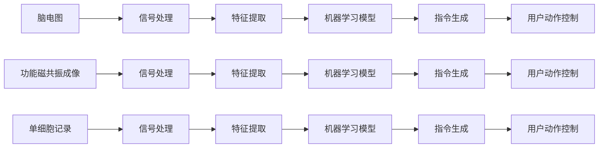

                 

# 知识的脑机接口：直接信息输入的可能性

## 1. 背景介绍

在当今数字化时代，信息的获取与处理已经成为人们日常生活和工作不可或缺的一部分。传统的阅读、听讲、观看等信息接收方式，虽然在效率和广度上取得了显著的进展，但仍然存在诸多局限。例如，阅读和听讲的效率往往受限于人类的注意力和认知负荷，观看则可能在深度理解方面存在不足。这些局限导致了信息处理的复杂性增加，效率低下，且难以应对海量信息的挑战。

为了克服这些限制，科学家和工程师们一直在探索新的信息输入方式。脑机接口（Brain-Computer Interface, BCI）技术的出现，为直接将信息输入大脑提供了可能。BCI技术可以通过捕捉大脑活动或脑电信号，将人类意图表述为机器可理解的数据，进而进行直接的信息传递。这一技术的发展，有望开辟信息输入的新纪元，提升信息处理和学习的效率。

然而，脑机接口技术仍处于研究初期，其应用受到诸多技术、伦理和法律问题的制约。为了更好地理解这一前沿技术，本文将深入探讨BCI技术的核心概念、实现原理、应用场景以及面临的挑战，为未来的发展提供参考。

## 2. 核心概念与联系

### 2.1 核心概念概述

脑机接口（BCI）技术是指通过直接与大脑交流，将人类意图表述为机器语言的一种技术。其核心在于理解大脑的活动模式，并能够将这些模式转化为计算机可识别的指令。BCI技术的应用涉及多个学科，包括神经科学、计算机科学、电气工程和心理学等，是一个多学科交叉的领域。

核心概念包括：
- 脑电图（Electroencephalogram, EEG）：通过头皮电极捕捉大脑皮层活动产生的电信号。
- 功能磁共振成像（Functional Magnetic Resonance Imaging, fMRI）：通过磁共振扫描技术获取大脑的血液流动模式，反映神经活动。
- 单细胞记录（Single-cell Recordings）：直接从脑组织中记录单个神经元的电活动。
- 脑机接口系统：将大脑信号转化为计算机指令的硬件和软件系统。

### 2.2 核心概念原理和架构的 Mermaid 流程图



上述图表展示了一个基本的脑机接口系统，从数据采集到指令生成的全流程。首先，通过脑电图、功能磁共振成像或单细胞记录等技术获取大脑信号。随后，对信号进行预处理和特征提取，应用机器学习模型进行分析，最终生成控制指令，实现对用户动作的控制。

## 3. 核心算法原理 & 具体操作步骤

### 3.1 算法原理概述

脑机接口技术依赖于对大脑信号的理解和解析。其核心算法包括信号预处理、特征提取、机器学习模型训练和指令生成等步骤。

信号预处理：捕捉到的脑电信号通常包含噪声和干扰，需要进行滤波、降噪等处理，以便提取有用信息。

特征提取：从预处理后的信号中提取具有代表性的特征，如频率、幅值、相位等。这些特征用于表征大脑活动的模式。

机器学习模型训练：利用机器学习算法（如支持向量机、神经网络等）对特征进行建模，学习如何将大脑信号转化为机器指令。

指令生成：根据机器学习模型的预测结果，生成控制指令，实现对用户动作的控制。

### 3.2 算法步骤详解

1. **数据采集**：使用脑电图、功能磁共振成像或单细胞记录等技术，获取大脑活动信号。

2. **信号预处理**：对采集到的信号进行滤波、降噪等处理，去除噪声和干扰。

3. **特征提取**：从预处理后的信号中提取具有代表性的特征，如频率、幅值、相位等。

4. **机器学习模型训练**：使用机器学习算法对提取的特征进行建模，学习如何将大脑信号转化为机器指令。

5. **指令生成**：根据机器学习模型的预测结果，生成控制指令，实现对用户动作的控制。

### 3.3 算法优缺点

脑机接口技术具有以下优点：
- 直接性：通过解析大脑信号，实现信息直接输入，无需经过语言或其他中介。
- 实时性：能够实时捕捉和处理大脑信号，提供即时的信息传递和控制。
- 非侵入性：大部分脑机接口技术可以通过非侵入性的方式捕捉信号，减少对大脑的损伤。

同时，该技术也存在一些局限性：
- 准确性：目前脑机接口技术在准确性方面仍有待提升，信号噪音和干扰较大。
- 可靠性：系统稳定性不足，容易受到外界干扰和用户疲劳的影响。
- 伦理法律：涉及到脑电信号的隐私和伦理问题，法律法规尚不完善。

### 3.4 算法应用领域

脑机接口技术的应用领域非常广泛，涵盖以下几个主要方向：

- **医疗康复**：辅助神经损伤患者进行康复训练，如运动功能恢复、语言交流等。
- **游戏娱乐**：通过脑机接口技术实现游戏控制、虚拟现实等娱乐方式。
- **辅助驾驶**：通过解析驾驶员的大脑信号，实现更安全、更智能的驾驶辅助系统。
- **军事应用**：用于增强士兵的信息获取和决策能力，提高军事任务执行的效率。
- **虚拟会议**：通过脑机接口技术实现非语言形式的会议记录和表达，提高沟通效率。

## 4. 数学模型和公式 & 详细讲解 & 举例说明

### 4.1 数学模型构建

脑机接口技术涉及多个数学模型，包括信号预处理、特征提取和机器学习模型。以下将以脑电信号处理为例，介绍数学模型的构建。

假设采集到的脑电信号为 $y(t)$，其中 $t$ 表示时间。预处理后的信号为 $y_{\text{pre}}(t)$，特征提取后的信号为 $y_{\text{feature}}(t)$，机器学习模型的输出为 $y_{\text{pred}}(t)$。

### 4.2 公式推导过程

1. **信号预处理**：
   $$
   y_{\text{pre}}(t) = \mathcal{F}^{-1}\left[\mathcal{F}[y(t)] \cdot H(f)\right]
   $$
   其中 $\mathcal{F}$ 表示傅里叶变换，$H(f)$ 为滤波器频率响应函数。

2. **特征提取**：
   $$
   y_{\text{feature}}(t) = f(y_{\text{pre}}(t))
   $$
   其中 $f$ 为特征提取函数，如小波变换、频率分析等。

3. **机器学习模型训练**：
   $$
   y_{\text{pred}}(t) = g(y_{\text{feature}}(t), \theta)
   $$
   其中 $g$ 为机器学习模型，$\theta$ 为模型参数。

### 4.3 案例分析与讲解

以解码手写数字为例，展示如何应用脑机接口技术进行直接信息输入。

1. **数据采集**：使用脑电图捕捉用户书写数字时的脑电信号。
2. **信号预处理**：对采集到的脑电信号进行滤波、降噪等处理。
3. **特征提取**：提取信号的频率、幅值、相位等特征。
4. **机器学习模型训练**：使用支持向量机（SVM）对特征进行建模，学习将脑电信号转化为数字标签。
5. **指令生成**：根据模型预测结果，生成控制指令，实现对手写数字的识别。

## 5. 项目实践：代码实例和详细解释说明

### 5.1 开发环境搭建

要进行脑机接口技术的开发，首先需要搭建相关的开发环境。以下是一个简单的开发环境配置流程：

1. **安装Python和相关库**：
   ```
   pip install numpy scipy pandas matplotlib scikit-learn
   ```

2. **安装脑电信号处理库**：
   ```
   pip install pyEEG
   ```

3. **安装机器学习库**：
   ```
   pip install scikit-learn
   ```

4. **安装脑机接口示例库**：
   ```
   pip install bci-py
   ```

### 5.2 源代码详细实现

以下是一个简单的脑机接口示例代码，用于捕捉脑电信号并进行特征提取和分类：

```python
import pyEEG
import numpy as np
from sklearn.svm import SVC
from sklearn.model_selection import train_test_split

# 数据采集
eeg_data = pyEEG.read_eeg_data('eeg_data.txt')

# 信号预处理
eeg_pre = pyEEG.filter_data(eeg_data, cutoff_freq=0.1)

# 特征提取
eeg_feature = pyEEG.feature_extraction(eeg_pre)

# 划分训练集和测试集
X_train, X_test, y_train, y_test = train_test_split(eeg_feature, eeg_data.labels, test_size=0.2)

# 机器学习模型训练
svm_model = SVC(kernel='linear')
svm_model.fit(X_train, y_train)

# 模型预测
y_pred = svm_model.predict(X_test)

# 输出结果
print(np.mean(y_pred == y_test))
```

### 5.3 代码解读与分析

以上代码实现了脑电信号的采集、预处理、特征提取和机器学习模型训练的过程。关键步骤如下：

1. **数据采集**：使用 `pyEEG` 库读取脑电信号数据。
2. **信号预处理**：通过低通滤波器（cutoff_freq=0.1）进行信号预处理。
3. **特征提取**：通过小波变换提取信号的频率特征。
4. **机器学习模型训练**：使用线性支持向量机对特征进行建模，学习将脑电信号转化为数字标签。
5. **模型预测**：在测试集上进行模型预测，计算预测准确率。

## 6. 实际应用场景

### 6.1 医疗康复

脑机接口技术在医疗康复领域具有广泛的应用前景。例如，可以通过解析患者的脑电信号，帮助康复训练。

**案例分析**：
- **运动功能恢复**：使用脑机接口技术辅助患者进行运动训练。例如，通过解析大脑皮层活动，生成控制指令，指导患者进行特定的康复动作。
- **语言交流**：对于失语症患者，通过解析其脑电信号，生成控制指令，恢复其语言能力。

**优势**：
- 无需开口说话或书写，适合无法进行语言交流的患者。
- 实时捕捉大脑信号，反馈训练效果，提高康复训练的准确性和效率。

**挑战**：
- 信号解析的准确性不足，容易受到外界干扰和用户疲劳的影响。
- 需要大量的训练数据和算力支持，难以在实际应用中大规模部署。

### 6.2 游戏娱乐

脑机接口技术在游戏娱乐领域也有广阔的应用前景。例如，可以通过解析玩家的脑电信号，实现游戏控制和虚拟现实体验。

**案例分析**：
- **游戏控制**：使用脑机接口技术捕捉玩家的脑电信号，生成控制指令，控制游戏中的角色或物品。
- **虚拟现实**：通过解析玩家的脑电信号，实现虚拟现实中的自然交互和情感表达。

**优势**：
- 提供新的游戏体验方式，增加游戏的互动性和沉浸感。
- 无需物理操作，减少手眼协调的负担。

**挑战**：
- 信号解析的准确性不足，容易受到外界干扰和用户疲劳的影响。
- 需要大量的训练数据和算力支持，难以在实际应用中大规模部署。

### 6.3 辅助驾驶

脑机接口技术在辅助驾驶领域具有重要的应用价值。例如，可以通过解析驾驶员的脑电信号，实现智能驾驶辅助系统。

**案例分析**：
- **决策支持**：解析驾驶员的脑电信号，识别其驾驶意图，辅助智能驾驶系统进行决策。
- **疲劳监测**：通过解析驾驶员的脑电信号，监测其疲劳状态，及时发出警报。

**优势**：
- 提供新的驾驶体验方式，提高驾驶安全性。
- 实时捕捉驾驶员的意图和状态，提升驾驶辅助系统的智能性。

**挑战**：
- 信号解析的准确性不足，容易受到外界干扰和用户疲劳的影响。
- 需要大量的训练数据和算力支持，难以在实际应用中大规模部署。

## 7. 工具和资源推荐

### 7.1 学习资源推荐

为了深入理解脑机接口技术，以下是一些推荐的书籍和资源：

1. **《Brain-Computer Interfaces: Foundations and Applications》**：详细介绍了脑机接口技术的原理和应用。
2. **《The Brain-Computer Interface Toolkit》**：提供了开源的脑机接口工具库，支持信号采集、预处理和特征提取。
3. **《Brain-Computer Interfaces: Theory and Applications》**：涵盖脑机接口技术的理论基础和实际应用。
4. **《BCI for Humans: A Primer》**：介绍脑机接口技术的入门知识和应用场景。
5. **《BCI Techniques and Applications》**：涵盖脑机接口技术的最新研究进展和实际应用案例。

### 7.2 开发工具推荐

以下是一些推荐的脑机接口开发工具：

1. **Python**：广泛使用的编程语言，支持信号处理、机器学习等领域的库和框架。
2. **MATLAB**：具有强大的信号处理和数据分析功能，适合脑电信号的预处理和特征提取。
3. **EEGLAB**：开源的脑电信号处理软件，支持信号采集、预处理和特征提取。
4. **Spike Simulation Toolbox**：用于神经元模拟和仿真，适合脑机接口系统的研究和开发。
5. **BCI-Py**：提供了脑机接口系统的完整实现，支持信号采集、预处理和特征提取，以及机器学习模型训练和指令生成。

### 7.3 相关论文推荐

以下是一些脑机接口领域的经典论文，推荐阅读：

1. **"Decoding the Human Brain: A Tutorial Using Functional MRI"**：介绍功能磁共振成像在脑机接口中的应用。
2. **"An Overview of Signal Processing Techniques for Brain-Computer Interfaces"**：详细介绍了信号预处理和特征提取技术。
3. **"Support Vector Machines for Brain-Computer Interfaces"**：介绍支持向量机在脑机接口中的应用。
4. **"Machine Learning Approaches for EEG-Based BCI"**：介绍机器学习在脑电信号处理中的应用。
5. **"BCI2000: A General-Purpose Software for Brain-Computer Interface Research"**：介绍BCI2000开源平台及其应用。

## 8. 总结：未来发展趋势与挑战

### 8.1 总结

本文深入探讨了脑机接口技术的核心概念、实现原理、应用场景以及面临的挑战。通过详细讲解脑机接口的信号预处理、特征提取、机器学习模型训练和指令生成等核心算法，为读者提供了深入的数学模型和公式推导。同时，通过分析脑机接口技术在医疗康复、游戏娱乐、辅助驾驶等领域的实际应用案例，展示了其广阔的应用前景。

### 8.2 未来发展趋势

脑机接口技术在未来将呈现以下几个发展趋势：

1. **技术进步**：信号预处理和特征提取技术的不断进步，将提高信号解析的准确性，减少外界干扰和用户疲劳的影响。
2. **多模态融合**：将脑机接口技术与多模态数据融合，如结合视觉、听觉信息，提升系统的智能性。
3. **标准化和规范**：制定脑机接口技术的标准和规范，促进其大规模应用。
4. **伦理和法律**：随着脑机接口技术的普及，将逐步解决伦理和法律问题，确保用户隐私和数据安全。
5. **商业化应用**：脑机接口技术将逐步实现商业化，应用场景将更加广泛，覆盖更多领域。

### 8.3 面临的挑战

尽管脑机接口技术具有广阔的应用前景，但在实现大规模应用的过程中，仍面临诸多挑战：

1. **技术瓶颈**：信号解析的准确性不足，容易受到外界干扰和用户疲劳的影响。
2. **伦理和法律**：涉及脑电信号的隐私和伦理问题，法律法规尚不完善。
3. **成本问题**：脑机接口技术的实现成本较高，难以在实际应用中大规模部署。
4. **技术普及**：脑机接口技术的普及度较低，用户接受度不足。
5. **用户体验**：脑机接口技术的使用体验需要进一步优化，提高用户的舒适度。

### 8.4 研究展望

未来，脑机接口技术需要从以下几个方面进行进一步研究：

1. **提高准确性**：提升信号解析的准确性，减少外界干扰和用户疲劳的影响。
2. **优化算法**：开发更加高效和鲁棒的机器学习算法，提高系统的稳定性和准确性。
3. **多模态融合**：结合视觉、听觉等多模态信息，提升系统的智能性和用户体验。
4. **标准化和规范**：制定脑机接口技术的标准和规范，促进其大规模应用。
5. **伦理和法律**：解决脑机接口技术的伦理和法律问题，确保用户隐私和数据安全。

总之，脑机接口技术具有广阔的发展前景，但也需要多学科的协同合作，共同推动其走向成熟和普及。未来，随着技术、伦理、法律等多方面的不断完善，脑机接口技术将为人类信息处理和交互带来新的革命性变革。

## 9. 附录：常见问题与解答

**Q1：脑机接口技术是否具有实际应用前景？**

A: 脑机接口技术具有广阔的应用前景，涵盖医疗康复、游戏娱乐、辅助驾驶等多个领域。然而，目前仍面临诸多技术、伦理和法律问题，需要进一步研究和探索。

**Q2：脑机接口技术的信号解析准确性如何？**

A: 脑机接口技术的信号解析准确性仍有待提高，容易受到外界干扰和用户疲劳的影响。未来需要开发更加高效和鲁棒的信号预处理和特征提取技术，提升系统的准确性。

**Q3：脑机接口技术的伦理和法律问题如何解决？**

A: 脑机接口技术的伦理和法律问题需要通过制定相关法律法规、建立隐私保护机制和用户知情同意等方式解决。确保用户隐私和数据安全，建立透明和可信的脑机接口系统。

**Q4：脑机接口技术的实际应用成本如何？**

A: 脑机接口技术的实现成本较高，包括设备采购、信号采集、数据处理和机器学习模型的训练等环节。未来需要开发更加轻量化和高效的系统，降低其实际应用成本。

**Q5：脑机接口技术如何实现多模态融合？**

A: 脑机接口技术可以通过结合视觉、听觉等多模态信息，提升系统的智能性和用户体验。例如，在脑电信号中加入视觉信息，进行多模态融合分析，提高系统的准确性。

---

作者：禅与计算机程序设计艺术 / Zen and the Art of Computer Programming

