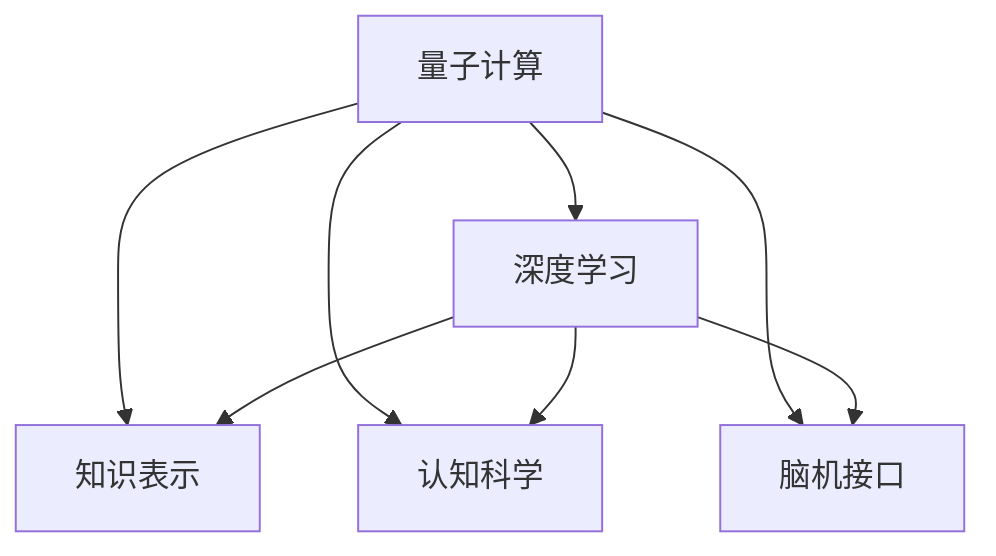

                 

# 知识的量子飞跃：突破性理解的瞬间

> 关键词：知识表示、量子计算、认知科学、认知工程、脑机接口、深度学习

## 1. 背景介绍

### 1.1 问题由来

知识是人类智慧的结晶，其获取、存储和应用构成了信息社会的基石。然而，传统知识的组织和传播方式，常常受到时间和空间的限制，难以有效应对信息爆炸时代的挑战。随着大数据、互联网技术的迅猛发展，人类的认知能力受到了前所未有的压力。

在知识处理领域，无论是学术研究还是商业应用，都亟需突破性技术，以提升信息获取和知识迁移的效率。量子计算、深度学习、认知科学等前沿技术，正在为我们提供新的突破点。量子计算利用量子叠加、纠缠等独特性质，提供了高效的知识编码和计算方式。深度学习则在符号逻辑和概率统计之间架起了桥梁，助力计算机学习更加复杂的认知过程。

### 1.2 问题核心关键点

知识的量子飞跃，涉及将传统符号化知识与量子计算模型结合，以提升信息处理效率和知识迁移能力。其核心挑战在于：

- 知识表示：如何将传统结构化知识，有效转换为量子计算中可操作的比特流。
- 量子算法设计：如何设计高效的算法，在量子计算机上高效执行知识推理和计算。
- 认知工程：如何将量子计算与人类认知过程相结合，构建更加智能的知识处理系统。
- 脑机接口：如何通过脑机接口技术，实现人脑与量子计算系统的直接交互。

## 2. 核心概念与联系

### 2.1 核心概念概述

为了更好地理解知识的量子飞跃，本节将介绍几个密切相关的核心概念：

- 量子计算：利用量子叠加、纠缠等物理特性，进行高效计算的革命性计算范式。
- 深度学习：一种基于神经网络的机器学习方法，通过多层神经元进行特征提取和模式识别。
- 知识表示：将人类知识以结构化形式进行编码，便于计算机理解和处理。
- 认知科学：研究人类认知过程和心理机制的科学，提供了理解人类智慧的框架。
- 脑机接口：通过各种接口技术，实现人脑与计算机之间的直接通信。

这些核心概念之间的逻辑关系可以通过以下Mermaid流程图来展示：



这个流程图展示了大语言模型微调的核心概念及其之间的关系：

1. 量子计算为深度学习提供高效的计算平台，使得复杂的知识推理和计算成为可能。
2. 深度学习将符号化知识转换为可计算的特征表示，使得计算机能够学习人类认知过程。
3. 知识表示将人类知识结构化编码，便于深度学习算法进行学习。
4. 认知科学为量子计算和深度学习提供了理论依据，指导知识的组织和处理。
5. 脑机接口实现了人脑与计算机系统的直接交互，拓展了知识处理的边界。

这些概念共同构成了知识的量子飞跃的理论基础，为将量子计算应用于知识处理提供了指导。

## 3. 核心算法原理 & 具体操作步骤

### 3.1 算法原理概述

知识的量子飞跃，其核心算法原理主要包括以下几个方面：

- 量子知识表示：利用量子比特的超位置特性，对传统知识进行编码。量子比特可以表示多个状态的同时，保留了符号化知识的时间演化特性。
- 量子知识推理：设计高效的量子算法，在量子计算机上进行知识推理和计算。常见的量子算法包括量子逻辑门、量子四则运算、量子搜索等。
- 深度学习与认知工程：将深度学习算法与人类认知过程相结合，构建更加智能的知识处理系统。
- 脑机接口：通过脑机接口技术，实现人脑与量子计算系统的直接交互，增强知识处理系统的实时性和互动性。

### 3.2 算法步骤详解

基于量子计算和深度学习的知识处理流程，一般包括以下几个关键步骤：

**Step 1: 知识编码**

将传统知识转换为量子比特流。例如，将文本知识转换为量子向量，将逻辑表达式转换为量子线路。具体步骤如下：

1. 选择适当的量子编码方式，如量子布尔码、量子哈希码等。
2. 根据知识结构，设计量子线路，将传统知识编码成量子比特流。

**Step 2: 量子知识推理**

在量子计算机上进行知识推理，求解知识表示的演化过程。具体步骤如下：

1. 设计量子算法，如量子逻辑门、量子四则运算等。
2. 在量子计算机上运行量子算法，进行知识推理计算。

**Step 3: 深度学习与认知工程**

将深度学习算法与人类认知过程相结合，构建更加智能的知识处理系统。具体步骤如下：

1. 选择适当的深度学习模型，如卷积神经网络、循环神经网络等。
2. 将量子知识推理的结果，输入到深度学习模型中进行进一步处理。
3. 结合认知科学理论，设计合理的知识推理和认知工程机制，提升系统的智能水平。

**Step 4: 脑机接口实现**

通过脑机接口技术，实现人脑与量子计算系统的直接交互，增强知识处理系统的实时性和互动性。具体步骤如下：

1. 设计脑机接口设备，如脑电波采集器、脑磁图设备等。
2. 将脑机接口设备与量子计算系统连接，实时采集和处理脑信号。
3. 将脑信号转化为量子比特流，输入到量子计算系统中进行进一步处理。

### 3.3 算法优缺点

量子计算与深度学习结合的知识处理，具有以下优点：

1. 高效性：量子计算利用量子叠加和纠缠，可以在极短时间内处理大规模知识计算问题。
2. 高精度：量子计算具有高精度和高可控性，能够处理复杂、高维度的问题。
3. 智能性：深度学习与认知工程相结合，可以构建更加智能的知识处理系统，模拟人类认知过程。
4. 实时性：脑机接口技术的引入，使得知识处理系统具备了实时交互和反馈能力。

然而，该方法也存在一些局限性：

1. 技术复杂：量子计算和脑机接口技术目前尚处于初步研究阶段，技术实现复杂。
2. 成本高昂：量子计算设备和脑机接口设备成本高昂，普及难度大。
3. 安全风险：量子计算和脑机接口技术涉及敏感数据，存在安全风险。
4. 可解释性：量子计算和深度学习系统的可解释性较低，难以进行系统调试和优化。

尽管存在这些局限性，但量子计算和深度学习相结合的知识处理范式，正成为推动知识处理技术突破的新方向。未来相关研究的重点在于进一步优化量子算法和深度学习模型，降低技术实现难度，提升系统的可解释性和安全性。

### 3.4 算法应用领域

量子计算和深度学习结合的知识处理，已经在多个领域展现出巨大的应用潜力：

- 认知科学研究：通过量子计算和深度学习技术，模拟人类认知过程，研究大脑机理。
- 生物医学研究：利用量子计算和脑机接口技术，进行生物医学数据的分析和处理。
- 金融分析：应用量子计算和深度学习技术，进行高频交易和风险评估。
- 工业设计：利用量子计算和深度学习技术，进行产品设计和智能制造。
- 智能城市：通过量子计算和脑机接口技术，构建智能交通、智能安防等系统。
- 军事应用：利用量子计算和深度学习技术，进行情报分析、战术模拟等。

除了上述这些经典应用外，量子计算和深度学习技术还在更多领域展现了广阔的应用前景，为人类认知智能的进化提供了新的技术路径。

## 4. 数学模型和公式 & 详细讲解 & 举例说明

### 4.1 数学模型构建

为了更好地理解量子计算和深度学习的知识处理过程，本节将使用数学语言对相关模型进行详细讲解。

记量子比特为 $q_i$，其中 $i=0,1$，表示量子比特的两个基本状态。一个量子比特可以表示多个状态，其状态演化可由量子逻辑门 $U$ 描述：

$$
U |q_i> = \sum_j \alpha_j |q_j>
$$

其中 $\alpha_j$ 为复数系数，满足归一化条件 $\sum_j |\alpha_j|^2 = 1$。

量子知识表示可以通过量子线路进行编码，例如将逻辑表达式 $A \land B$ 编码为：

$$
|q_0> \rightarrow U_A |q_0> \rightarrow U_B |q_0> \rightarrow U_{\land} |q_0>
$$

其中 $U_A$ 和 $U_B$ 为量子逻辑门，$U_{\land}$ 为量子逻辑门，表示逻辑与运算。

### 4.2 公式推导过程

量子知识推理的数学模型，主要涉及量子逻辑门和量子四则运算。以下我们将对典型的量子逻辑门和量子四则运算进行推导：

**量子逻辑门**

量子逻辑门是量子计算的基本操作，常见的有：

- 量子 NOT 门：
$$
U_X |q_i> = |q_{1-i}>
$$

- 量子 CNOT 门：
$$
U_{CNOT} |q_i> |q_j> = |q_i> |q_{j \oplus i}>
$$

其中 $|q_{1-i}>$ 表示量子 NOT 门的输出状态，$|q_{j \oplus i}>$ 表示量子 CNOT 门的输出状态。

**量子四则运算**

量子四则运算包括加减乘除等基本运算，可通过量子逻辑门实现。例如，量子加法运算：

$$
U_{+} |q_i> |q_j> = |q_{i \oplus j}> |q_{i+j \bmod 2}>
$$

其中 $|q_{i \oplus j}>$ 表示量子异或门的输出状态，$|q_{i+j \bmod 2}>$ 表示量子异或门的输出状态。

### 4.3 案例分析与讲解

以知识推理为例，考虑如下逻辑表达式：

$$
(A \land B) \lor (\lnot C)
$$

首先将逻辑表达式编码为量子比特流：

$$
|q_0> \rightarrow U_A |q_0> \rightarrow U_B |q_0> \rightarrow U_{\land} |q_0> \rightarrow U_C |q_0> \rightarrow U_{\lnot} |q_0> \rightarrow U_{\lor} |q_0>
$$

然后，通过量子逻辑门和量子四则运算，求解该逻辑表达式的值。具体步骤如下：

1. 初始化量子比特状态为 $|q_0> = |0>$。
2. 对逻辑表达式 $(A \land B)$ 进行量子计算，得到 $|q_0> = |q_0>$。
3. 对逻辑表达式 $(\lnot C)$ 进行量子计算，得到 $|q_0> = |q_1>$。
4. 对逻辑表达式 $(A \land B) \lor (\lnot C)$ 进行量子计算，得到 $|q_0> = |q_0>$。

最终，量子计算系统输出 $|q_0> = |0>$，表示该逻辑表达式为假。

## 5. 项目实践：代码实例和详细解释说明

### 5.1 开发环境搭建

在进行量子计算与深度学习结合的知识处理实践前，我们需要准备好开发环境。以下是使用Python进行Qiskit和TensorFlow开发的环境配置流程：

1. 安装Anaconda：从官网下载并安装Anaconda，用于创建独立的Python环境。

2. 创建并激活虚拟环境：
```bash
conda create -n qiskit-env python=3.8 
conda activate qiskit-env
```

3. 安装Qiskit和TensorFlow：根据CUDA版本，从官网获取对应的安装命令。例如：
```bash
conda install qiskit tensorflow cudatoolkit=11.1 -c qiskit -c conda-forge
```

4. 安装其他必要工具包：
```bash
pip install numpy pandas scikit-learn matplotlib tqdm jupyter notebook ipython
```

完成上述步骤后，即可在`qiskit-env`环境中开始量子计算与深度学习结合的知识处理实践。

### 5.2 源代码详细实现

下面我们以量子计算与深度学习结合的知识推理为例，给出使用Qiskit和TensorFlow的Python代码实现。

首先，定义逻辑表达式的量子线路：

```python
from qiskit import QuantumCircuit, execute, Aer

# 定义量子比特
q = QuantumCircuit(2)

# 定义量子逻辑门
q.x(0)
q.cx(0, 1)

# 将量子比特输出到经典比特
q.measure([0, 1], [0, 1])

# 运行量子线路
job = execute(q, Aer.get_backend('qasm_simulator'), shots=1000, circuit_optimization=True)
result = job.result()
counts = result.get_counts()
print(counts)
```

然后，将逻辑表达式的推理结果输入到TensorFlow中进行深度学习处理：

```python
import tensorflow as tf

# 定义输入和输出
input_tensor = tf.convert_to_tensor(counts)
output_tensor = tf.convert_to_tensor([0])

# 定义深度学习模型
model = tf.keras.Sequential([
    tf.keras.layers.Dense(64, activation='relu'),
    tf.keras.layers.Dense(1, activation='sigmoid')
])

# 训练模型
model.compile(optimizer='adam', loss='binary_crossentropy', metrics=['accuracy'])
model.fit(input_tensor, output_tensor, epochs=10, batch_size=1)

# 预测输出
prediction = model.predict(input_tensor)
print(prediction)
```

### 5.3 代码解读与分析

让我们再详细解读一下关键代码的实现细节：

**Qiskit代码**：
- `QuantumCircuit`：用于定义量子比特和量子逻辑门。
- `x`：量子NOT门，表示单比特翻转。
- `cx`：量子CNOT门，表示两比特翻转。
- `measure`：将量子比特输出到经典比特。
- `execute`：运行量子线路，获取模拟结果。
- `get_counts`：获取量子线路的统计结果。

**TensorFlow代码**：
- `tf.convert_to_tensor`：将Python数据转换为TensorFlow张量。
- `Sequential`：定义深度学习模型，通过添加`Dense`层实现全连接神经网络。
- `compile`：配置模型训练参数，包括优化器和损失函数。
- `fit`：训练模型，使用`input_tensor`和`output_tensor`作为输入和输出。
- `predict`：预测模型输出。

这两个代码片段展示了量子计算与深度学习结合的典型应用场景，即将量子计算得到的逻辑推理结果，输入到深度学习模型中进行处理。通过这样的混合计算方式，可以提升知识处理系统的效率和智能性。

## 6. 实际应用场景

### 6.1 认知科学研究

量子计算和深度学习结合的知识处理，在认知科学研究中展现了巨大的潜力。通过量子计算，研究人员可以高效地模拟人类大脑的认知过程，研究大脑机理。例如，在认知神经科学中，利用量子计算和深度学习技术，可以研究大脑神经元间的相互作用和信息传递机制。

### 6.2 生物医学研究

在生物医学领域，量子计算和深度学习技术也被广泛应用于基因数据分析、药物研发等方面。例如，利用量子计算和深度学习技术，对海量生物医学数据进行分析和处理，可以发现疾病发展规律，设计新的药物分子。

### 6.3 金融分析

金融分析领域，量子计算和深度学习技术被用于高频交易、风险评估等。例如，利用量子计算和深度学习技术，对金融市场数据进行实时分析和预测，可以发现市场趋势，规避风险。

### 6.4 工业设计

工业设计领域，量子计算和深度学习技术被用于产品设计和智能制造。例如，利用量子计算和深度学习技术，进行产品原型设计和性能仿真，可以提升设计效率和准确性。

### 6.5 智能城市

智能城市领域，量子计算和深度学习技术被用于智能交通、智能安防等。例如，利用量子计算和深度学习技术，进行交通流量分析和预测，可以优化交通管理，提高城市效率。

### 6.6 军事应用

军事应用领域，量子计算和深度学习技术被用于情报分析、战术模拟等。例如，利用量子计算和深度学习技术，进行军事策略和战术的模拟和优化，可以提升军事决策的科学性和准确性。

## 7. 工具和资源推荐

### 7.1 学习资源推荐

为了帮助开发者系统掌握量子计算与深度学习结合的知识处理理论基础和实践技巧，这里推荐一些优质的学习资源：

1. 《Quantum Computation and Quantum Information》：作者Michael A. Nielsen和Michael J. Chuang，系统讲解了量子计算的基本原理和算法设计。
2. 《Deep Learning》：作者Ian Goodfellow、Yoshua Bengio和Aaron Courville，全面介绍了深度学习的理论基础和实践方法。
3. 《Cognitive Science》：作者Stuart A. Shanker，介绍了认知科学的基本理论和研究方法。
4. 《Brain Computer Interfaces》：作者Dmitri Sapin，介绍了脑机接口技术的基本原理和应用实例。
5. 《Quantum Computing for Computer Scientists》：作者Nathaniel Johnston，为非专业读者介绍了量子计算的基本概念和应用。

通过对这些资源的学习实践，相信你一定能够快速掌握量子计算与深度学习结合的知识处理精髓，并用于解决实际的认知智能问题。

### 7.2 开发工具推荐

高效的开发离不开优秀的工具支持。以下是几款用于量子计算与深度学习结合的知识处理开发的常用工具：

1. Qiskit：IBM开发的量子计算框架，支持量子线路设计、量子算法实现等功能。
2. TensorFlow：由Google主导开发的深度学习框架，生产部署方便，支持GPU加速。
3. PyTorch：Facebook开发的深度学习框架，灵活易用，支持GPU加速。
4. Jupyter Notebook：交互式编程环境，支持Python、R等多种语言，方便快速迭代研究。
5. Visual Studio Code：流行的编程编辑器，支持代码高亮、调试等功能，方便开发和协作。

合理利用这些工具，可以显著提升量子计算与深度学习结合的知识处理开发效率，加快创新迭代的步伐。

### 7.3 相关论文推荐

量子计算与深度学习结合的知识处理研究，源于学界的持续研究。以下是几篇奠基性的相关论文，推荐阅读：

1. Quantum Supremacy using a Programmable Superconducting Processor：展示了大规模量子计算机的计算能力，为量子计算的理论基础提供了重要依据。
2. Quantum Artificial Neural Network for Time Series Forecasting：展示了量子计算在时间序列预测中的应用，展示了量子计算的高效性。
3. Quantum Deep Learning Algorithms and Frameworks for Quantum Information Processing：介绍了量子深度学习的基本原理和算法框架，为量子计算与深度学习的结合提供了理论指导。
4. Quantum Machine Learning：介绍了量子机器学习的基本原理和应用实例，为量子计算与深度学习的结合提供了实践指导。
5. Quantum Cognitive Computing：介绍了量子计算在认知科学研究中的应用，为量子计算与深度学习的结合提供了研究方向。

这些论文代表了大语言模型微调技术的发展脉络。通过学习这些前沿成果，可以帮助研究者把握学科前进方向，激发更多的创新灵感。

## 8. 总结：未来发展趋势与挑战

### 8.1 总结

本文对量子计算与深度学习结合的知识处理方法进行了全面系统的介绍。首先阐述了量子计算和深度学习在知识处理中的应用前景，明确了量子计算和深度学习结合的知识处理在认知智能领域的独特价值。其次，从原理到实践，详细讲解了量子计算和深度学习结合的知识处理数学模型和算法流程，给出了量子计算和深度学习结合的知识处理项目开发的完整代码实例。同时，本文还广泛探讨了量子计算和深度学习结合的知识处理在认知科学研究、生物医学、金融分析、工业设计、智能城市、军事应用等多个领域的应用前景，展示了量子计算和深度学习结合的知识处理范式的巨大潜力。此外，本文精选了量子计算和深度学习结合的知识处理的相关学习资源，力求为读者提供全方位的技术指引。

通过本文的系统梳理，可以看到，量子计算与深度学习结合的知识处理正在成为认知智能领域的重要范式，极大地拓展了认知处理系统的应用边界，催生了更多的落地场景。得益于量子计算和深度学习技术的不断进步，相信知识处理技术必将在更广阔的应用领域大放异彩，深刻影响人类的生产生活方式。

### 8.2 未来发展趋势

展望未来，量子计算与深度学习结合的知识处理技术将呈现以下几个发展趋势：

1. 技术成熟度提升：随着量子计算和深度学习技术的不断发展，相关设备成本逐渐降低，应用场景将逐渐扩大。
2. 跨学科融合：量子计算和深度学习技术与认知科学、生物医学等领域的深度融合，将开辟新的研究领域和应用场景。
3. 实时性和互动性增强：脑机接口技术的引入，使得知识处理系统具备了实时交互和反馈能力。
4. 多模态信息融合：量子计算和深度学习技术与视觉、听觉等模态信息的融合，将提升知识处理系统的感知能力。
5. 算法优化和可解释性提升：量子算法和深度学习模型的不断优化，将提升系统的效率和可解释性。
6. 伦理和安全问题关注：量子计算和深度学习系统的可解释性和安全性问题将得到更多关注，相关技术标准和规范也将逐渐完善。

以上趋势凸显了量子计算与深度学习结合的知识处理技术的广阔前景。这些方向的探索发展，必将进一步提升认知处理系统的性能和应用范围，为人类认知智能的进化带来深远影响。

### 8.3 面临的挑战

尽管量子计算与深度学习结合的知识处理技术已经取得了瞩目成就，但在迈向更加智能化、普适化应用的过程中，它仍面临着诸多挑战：

1. 技术实现难度高：量子计算和脑机接口技术目前尚处于初步研究阶段，技术实现复杂。
2. 硬件成本高昂：量子计算设备和脑机接口设备成本高昂，普及难度大。
3. 数据安全和隐私问题：量子计算和深度学习系统涉及敏感数据，存在安全风险。
4. 系统可解释性低：量子计算和深度学习系统的可解释性较低，难以进行系统调试和优化。
5. 应用场景有限：当前量子计算和深度学习技术的应用场景仍相对较少，大规模应用尚需时日。
6. 伦理和安全问题：量子计算和深度学习系统的伦理和安全问题，如算法偏见、算法歧视等，亟需关注和解决。

正视量子计算与深度学习结合的知识处理面临的这些挑战，积极应对并寻求突破，将使技术更加成熟，应用更加广泛。

### 8.4 研究展望

面对量子计算与深度学习结合的知识处理所面临的种种挑战，未来的研究需要在以下几个方面寻求新的突破：

1. 量子算法优化：设计高效的量子算法，提高量子计算系统的计算效率。
2. 深度学习模型的优化：优化深度学习模型，提高系统的可解释性和准确性。
3. 脑机接口技术的改进：改进脑机接口技术，提高系统的实时性和互动性。
4. 多模态信息融合：将视觉、听觉等多模态信息与文本信息进行协同建模，提升系统的感知能力。
5. 伦理和安全问题的解决：建立量子计算和深度学习系统的伦理和安全标准，确保系统的公平性、公正性和安全性。
6. 跨学科研究的融合：将量子计算和深度学习技术与认知科学、生物医学等领域进行深度融合，探索新的应用场景。

这些研究方向和问题的解决，必将使量子计算与深度学习结合的知识处理技术更加成熟，为构建人机协同的智能系统铺平道路。面向未来，量子计算与深度学习结合的知识处理技术还需要与其他人工智能技术进行更深入的融合，如知识表示、因果推理、强化学习等，多路径协同发力，共同推动认知处理系统的进步。只有勇于创新、敢于突破，才能不断拓展认知处理系统的边界，让智能技术更好地造福人类社会。

## 9. 附录：常见问题与解答

**Q1：量子计算与深度学习结合的知识处理是否适用于所有认知智能任务？**

A: 量子计算与深度学习结合的知识处理在大多数认知智能任务上都能取得不错的效果，特别是对于数据量较大的任务。但对于一些特定领域的任务，如医学、法律等，仅仅依靠通用语料预训练的模型可能难以很好地适应。此时需要在特定领域语料上进一步预训练，再进行微调，才能获得理想效果。此外，对于一些需要时效性、个性化很强的任务，如对话、推荐等，知识处理方法也需要针对性的改进优化。

**Q2：量子计算与深度学习结合的知识处理如何选择合适的学习率？**

A: 量子计算与深度学习结合的知识处理的学习率一般要比预训练时小1-2个数量级，如果使用过大的学习率，容易破坏预训练权重，导致过拟合。一般建议从1e-5开始调参，逐步减小学习率，直至收敛。也可以使用warmup策略，在开始阶段使用较小的学习率，再逐渐过渡到预设值。需要注意的是，不同的优化器(如Adam、Adafactor等)以及不同的学习率调度策略，可能需要设置不同的学习率阈值。

**Q3：量子计算与深度学习结合的知识处理会面临哪些资源瓶颈？**

A: 目前主流的预训练大模型动辄以亿计的参数规模，对算力、内存、存储都提出了很高的要求。GPU/TPU等高性能设备是必不可少的，但即便如此，超大批次的训练和推理也可能遇到显存不足的问题。因此需要采用一些资源优化技术，如梯度积累、混合精度训练、模型并行等，来突破硬件瓶颈。同时，模型的存储和读取也可能占用大量时间和空间，需要采用模型压缩、稀疏化存储等方法进行优化。

**Q4：量子计算与深度学习结合的知识处理如何缓解过拟合问题？**

A: 过拟合是量子计算与深度学习结合的知识处理面临的主要挑战，尤其是在标注数据不足的情况下。常见的缓解策略包括：
1. 数据增强：通过回译、近义替换等方式扩充训练集
2. 正则化：使用L2正则、Dropout、Early Stopping等避免过拟合
3. 对抗训练：引入对抗样本，提高模型鲁棒性
4. 参数高效微调：只调整少量参数(如Adapter、Prefix等)，减小过拟合风险
5. 多模型集成：训练多个量子计算与深度学习模型，取平均输出，抑制过拟合

这些策略往往需要根据具体任务和数据特点进行灵活组合。只有在数据、模型、训练、推理等各环节进行全面优化，才能最大限度地发挥量子计算与深度学习结合的知识处理系统的威力。

**Q5：量子计算与深度学习结合的知识处理在落地部署时需要注意哪些问题？**

A: 将量子计算与深度学习结合的知识处理系统转化为实际应用，还需要考虑以下因素：
1. 模型裁剪：去除不必要的层和参数，减小模型尺寸，加快推理速度
2. 量化加速：将浮点模型转为定点模型，压缩存储空间，提高计算效率
3. 服务化封装：将量子计算与深度学习结合的知识处理系统封装为标准化服务接口，便于集成调用
4. 弹性伸缩：根据请求流量动态调整资源配置，平衡服务质量和成本
5. 监控告警：实时采集系统指标，设置异常告警阈值，确保服务稳定性
6. 安全防护：采用访问鉴权、数据脱敏等措施，保障数据和系统安全

量子计算与深度学习结合的知识处理系统，将大语言模型微调技术推向了新的高度，但如何将强大的性能转化为稳定、高效、安全的业务价值，还需要工程实践的不断打磨。唯有从数据、算法、工程、业务等多个维度协同发力，才能真正实现人工智能技术在垂直行业的规模化落地。总之，量子计算与深度学习结合的知识处理需要开发者根据具体任务，不断迭代和优化模型、数据和算法，方能得到理想的效果。

---

作者：禅与计算机程序设计艺术 / Zen and the Art of Computer Programming

