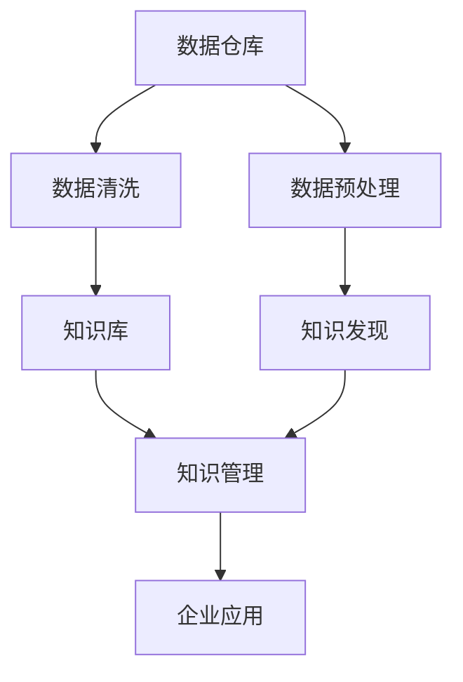

                 

# 知识管理与知识发现：企业智能化的双翼

> 关键词：知识管理,知识发现,企业智能化,大数据,人工智能

## 1. 背景介绍

### 1.1 问题由来
在当今信息爆炸的时代，企业面临着前所未有的数据增长压力。从客户行为记录到产品研发数据，从市场调研到供应链管理，数据的来源越来越广泛，形式也愈发多样。如何有效管理和利用这些海量数据，从数据中提取有价值的知识和洞见，成为企业智能化转型的关键。知识管理与知识发现技术应运而生，成为支撑企业智能化发展的双翼。

知识管理（Knowledge Management, KM）是指通过系统地存储、检索、共享和使用知识，最大化企业决策、创新和运营效率的过程。而知识发现（Knowledge Discovery, KD）是指从数据中提取出有价值的知识、规则、模式和趋势，辅助企业进行决策和业务创新。两者相辅相成，共同推动企业向智能化的方向迈进。

### 1.2 问题核心关键点
知识管理与知识发现的核心在于以下几个关键点：
- **数据集成**：将各种数据源有效集成，形成一个统一的数据仓库，是知识管理和知识发现的基础。
- **数据预处理**：清洗、整合、转换数据，确保数据质量，提高数据可用性。
- **知识存储与管理**：构建知识库，利用索引、分类、标签等技术对知识进行存储和管理，方便检索和共享。
- **知识发现算法**：使用数据挖掘、机器学习等技术，从数据中提取有用的知识和模式。
- **知识应用**：将提取的知识应用于企业决策、产品研发、客户服务、运营优化等多个方面，实现智能化。

### 1.3 问题研究意义
通过系统的知识管理与知识发现，企业可以实现以下目标：
- 提升决策效率：通过数据驱动的洞察，减少直觉决策，提高决策准确性。
- 增强创新能力：利用知识库中的先验知识，加速创新过程。
- 优化运营管理：通过数据分析，识别瓶颈，提高运营效率。
- 提升客户满意度：利用知识发现技术，提供个性化、精准的服务。
- 应对市场变化：通过大数据分析，灵活应对市场动态，保持竞争力。

## 2. 核心概念与联系

### 2.1 核心概念概述

为更好地理解知识管理与知识发现的原理和架构，本节将介绍几个关键概念：

- **知识管理（Knowledge Management, KM）**：通过系统化的方法，有效管理和应用组织内部的知识，以提升企业运营效率和竞争力。
- **知识发现（Knowledge Discovery, KD）**：从数据中自动提取有用信息和模式的过程，是数据挖掘的核心任务。
- **数据仓库（Data Warehouse）**：集成了企业所有业务数据的集中存储环境，支持高效的数据查询和管理。
- **数据挖掘（Data Mining）**：使用统计学、机器学习等技术，从数据中提取模式、规律和知识的过程。
- **自然语言处理（Natural Language Processing, NLP）**：使计算机能够理解、解释和生成人类语言，支持知识库的构建和知识检索。

这些核心概念之间的逻辑关系可以通过以下Mermaid流程图来展示：



这个流程图展示出知识管理与知识发现的基本流程：

1. 数据仓库集成企业所有数据。
2. 数据预处理、清洗和整合，形成可用数据集。
3. 知识发现技术从数据中提取模式和知识，构建知识库。
4. 知识管理技术对知识进行存储和管理，方便检索和应用。
5. 提取的知识应用于企业各个部门，提升运营效率和决策质量。

## 3. 核心算法原理 & 具体操作步骤
### 3.1 算法原理概述

知识管理与知识发现算法主要基于数据挖掘和机器学习技术。其核心思想是：通过数据预处理和建模，自动地从数据中发现有用的模式、规则和知识，并应用于企业决策和管理。

具体来说，知识管理与知识发现的过程包括以下几个步骤：

1. **数据集成与预处理**：将来自不同数据源的数据集成到数据仓库中，并进行清洗、去重、转换等预处理工作，确保数据质量。

2. **知识发现算法**：使用分类、聚类、关联规则挖掘、时间序列分析等技术，从数据中提取有用的知识和模式。

3. **知识存储与管理**：构建知识库，利用索引、分类、标签等技术对知识进行存储和管理，方便检索和共享。

4. **知识应用**：将提取的知识应用于企业决策、产品研发、客户服务、运营优化等多个方面，实现智能化。

### 3.2 算法步骤详解

以下是知识管理与知识发现的详细步骤：

**Step 1: 数据集成与预处理**
- 收集企业各业务系统的数据，包括客户信息、销售记录、市场调研、产品研发数据等。
- 使用ETL（Extract, Transform, Load）技术，将数据从不同数据源抽取、转换和加载到数据仓库中。
- 对数据进行清洗、去重、格式转换等预处理，确保数据的一致性和完整性。

**Step 2: 知识发现**
- 选择合适的知识发现算法，如分类、聚类、关联规则挖掘、时间序列分析等。
- 应用这些算法，从数据中提取模式、规律和知识。
- 验证提取的知识，使用交叉验证、测试集等方法评估算法效果。

**Step 3: 知识存储与管理**
- 设计知识库的架构，包括元数据、文档、表、图片等。
- 使用知识管理系统对知识进行存储和管理，支持快速检索和共享。
- 为知识打上标签、分类，建立索引，提高知识的可访问性。

**Step 4: 知识应用**
- 将知识整合到企业决策支持系统、业务分析平台、客户服务系统等应用中。
- 开发知识应用系统，利用知识优化业务流程、提升服务质量、提高运营效率。
- 持续监测知识应用效果，评估模型性能，进行模型调优。

### 3.3 算法优缺点

知识管理与知识发现的算法具有以下优点：
- **自动化**：通过算法自动化地从数据中提取知识，减少人工干预。
- **高效性**：可以快速处理大规模数据集，提取出有价值的知识和模式。
- **适用性广**：适用于各种类型的业务数据，包括结构化和非结构化数据。
- **灵活性**：可根据具体需求灵活应用，支持不同业务场景的知识发现需求。

同时，该方法也存在一定的局限性：
- **数据质量依赖**：知识发现的质量很大程度上取决于数据的质量，数据预处理和清洗的难度较大。
- **算法复杂性**：部分算法如深度学习模型，需要大量计算资源和复杂超参数调优。
- **解释性不足**：一些算法如神经网络模型，难以解释其内部工作机制和决策逻辑。
- **应用场景受限**：部分知识发现算法适用于特定类型的业务数据，泛化能力有限。

尽管存在这些局限性，知识管理与知识发现算法仍然是现代企业智能化转型的重要工具。未来相关研究的重点在于如何进一步降低算法对数据质量的依赖，提高算法的可解释性和泛化能力，同时兼顾高效性和灵活性等因素。

### 3.4 算法应用领域

知识管理与知识发现技术在企业智能化中得到了广泛的应用，覆盖了以下领域：

- **客户关系管理（CRM）**：通过分析客户行为数据，提升客户满意度和忠诚度。
- **市场调研**：使用数据挖掘技术，分析市场趋势，辅助企业制定营销策略。
- **产品研发**：利用客户反馈和市场数据，优化产品设计和研发流程。
- **供应链管理**：通过数据分析，优化供应链流程，降低成本，提高效率。
- **风险管理**：利用历史数据，预测和防范企业运营中的风险。
- **决策支持**：构建决策支持系统，辅助企业高层管理决策。
- **运营优化**：分析运营数据，识别瓶颈，提高运营效率。

除了上述这些经典领域外，知识管理与知识发现技术还被应用于更多场景中，如知识图谱构建、智能推荐系统、智能客服等，为企业的智能化转型提供了新的技术和方法。

## 4. 数学模型和公式 & 详细讲解 & 举例说明（备注：数学公式请使用latex格式，latex嵌入文中独立段落使用 $$，段落内使用 $)
### 4.1 数学模型构建

知识管理与知识发现的数学模型主要基于数据挖掘和机器学习算法。以下以分类任务为例，介绍其数学模型的构建过程。

假设企业的数据集为 $D=\{(x_i,y_i)\}_{i=1}^N, x_i \in \mathbb{R}^d, y_i \in \{0,1\}$，其中 $y_i$ 表示样本的类别标签，$x_i$ 为样本的特征向量。分类任务的数学模型为：

$$
p(y_i=1|x_i) = \sigma(\mathbf{w}^T \mathbf{x}_i + b)
$$

其中 $\sigma$ 为激活函数，$\mathbf{w}$ 为分类器的权重向量，$b$ 为偏置项。

通过最大化似然函数：

$$
\max_{\mathbf{w},b} \prod_{i=1}^N p(y_i|x_i)
$$

可以得到分类器的优化目标：

$$
\min_{\mathbf{w},b} \sum_{i=1}^N -y_i \log p(y_i=1|x_i) - (1-y_i) \log p(y_i=0|x_i)
$$

使用梯度下降等优化算法求解上述目标，即可得到分类器的权重向量 $\mathbf{w}$ 和偏置项 $b$。

### 4.2 公式推导过程

以逻辑回归（Logistic Regression）为例，推导分类任务的优化目标和梯度计算公式。

1. **损失函数定义**：逻辑回归的损失函数为交叉熵损失：

$$
\mathcal{L}(\mathbf{w},b) = -\frac{1}{N}\sum_{i=1}^N [y_i \log p(y_i=1|x_i) + (1-y_i) \log p(y_i=0|x_i)]
$$

2. **梯度计算**：使用链式法则，求导得到权重和偏置的梯度：

$$
\frac{\partial \mathcal{L}}{\partial \mathbf{w}} = -\frac{1}{N}\sum_{i=1}^N [y_i (p(y_i=1|x_i) - 1)x_i] \\
\frac{\partial \mathcal{L}}{\partial b} = -\frac{1}{N}\sum_{i=1}^N [y_i (p(y_i=1|x_i) - 1)]
$$

3. **优化算法**：使用梯度下降算法更新权重和偏置，最小化损失函数：

$$
\mathbf{w} \leftarrow \mathbf{w} - \eta \frac{\partial \mathcal{L}}{\partial \mathbf{w}} \\
b \leftarrow b - \eta \frac{\partial \mathcal{L}}{\partial b}
$$

其中 $\eta$ 为学习率。

通过上述公式，我们可以使用逻辑回归算法对企业的数据集进行分类，提取有用的知识，应用于企业决策和管理。

### 4.3 案例分析与讲解

假设某电商企业收集了用户的购买历史和行为数据，并希望利用这些数据来预测用户是否会购买某一新产品。

1. **数据准备**：收集用户的购买历史和行为数据，如浏览记录、购买记录、评价记录等。
2. **特征选择**：从数据中提取有意义的特征，如购买次数、购买金额、浏览时间等。
3. **模型训练**：使用逻辑回归算法对数据集进行训练，构建分类模型。
4. **模型评估**：在测试集上评估模型性能，使用准确率、召回率、F1值等指标衡量模型效果。
5. **知识应用**：将模型应用到用户行为预测中，根据预测结果向用户推荐新产品。

通过以上步骤，企业可以基于用户的历史行为数据，预测用户购买新产品的可能性，提高营销效果和客户满意度。

## 5. 项目实践：代码实例和详细解释说明
### 5.1 开发环境搭建

在进行知识管理与知识发现项目实践前，我们需要准备好开发环境。以下是使用Python进行Scikit-learn开发的环境配置流程：

1. 安装Anaconda：从官网下载并安装Anaconda，用于创建独立的Python环境。

2. 创建并激活虚拟环境：
```bash
conda create -n sklearn-env python=3.8 
conda activate sklearn-env
```

3. 安装Scikit-learn：
```bash
pip install scikit-learn
```

4. 安装必要的工具包：
```bash
pip install numpy pandas scipy matplotlib seaborn jupyter notebook ipython
```

完成上述步骤后，即可在`sklearn-env`环境中开始项目实践。

### 5.2 源代码详细实现

下面我们以电商用户的购买行为预测为例，给出使用Scikit-learn进行逻辑回归（Logistic Regression）的代码实现。

首先，定义数据预处理函数：

```python
import pandas as pd
from sklearn.model_selection import train_test_split
from sklearn.preprocessing import StandardScaler

def preprocess_data(data, target):
    # 数据预处理
    features = data.drop(target, axis=1)
    labels = data[target]
    
    # 数据分割为训练集和测试集
    features_train, features_test, labels_train, labels_test = train_test_split(features, labels, test_size=0.2, random_state=42)
    
    # 特征标准化
    scaler = StandardScaler()
    features_train = scaler.fit_transform(features_train)
    features_test = scaler.transform(features_test)
    
    return features_train, features_test, labels_train, labels_test
```

然后，定义模型训练函数：

```python
from sklearn.linear_model import LogisticRegression
from sklearn.metrics import accuracy_score, classification_report

def train_model(features_train, labels_train, features_test, labels_test):
    # 构建逻辑回归模型
    model = LogisticRegression(solver='lbfgs', max_iter=1000)
    
    # 模型训练
    model.fit(features_train, labels_train)
    
    # 模型评估
    labels_pred = model.predict(features_test)
    accuracy = accuracy_score(labels_test, labels_pred)
    report = classification_report(labels_test, labels_pred)
    
    return model, accuracy, report
```

接着，启动训练流程并在测试集上评估：

```python
from sklearn.datasets import load_breast_cancer

# 加载数据集
data = load_breast_cancer()

# 数据预处理
features_train, features_test, labels_train, labels_test = preprocess_data(data.data, data.target)

# 模型训练和评估
model, accuracy, report = train_model(features_train, labels_train, features_test, labels_test)
print(f"Accuracy: {accuracy:.2f}")
print(report)
```

以上就是使用Scikit-learn进行逻辑回归的完整代码实现。可以看到，Scikit-learn提供了方便的API，可以轻松构建、训练和评估逻辑回归模型。

### 5.3 代码解读与分析

让我们再详细解读一下关键代码的实现细节：

**preprocess_data函数**：
- 首先，将目标变量和特征变量分开，并分割为训练集和测试集。
- 然后，对特征变量进行标准化处理，确保数据的一致性和可比性。

**train_model函数**：
- 使用Scikit-learn的LogisticRegression类构建逻辑回归模型。
- 在训练集上使用梯度下降算法训练模型。
- 在测试集上评估模型性能，输出准确率和分类报告。

**训练流程**：
- 加载乳腺癌数据集，作为示例数据。
- 数据预处理，分割为训练集和测试集。
- 模型训练，输出准确率和分类报告。

可以看到，Scikit-learn提供了高效、易用的API，使得逻辑回归模型的构建和训练变得非常简单。开发者可以将更多精力放在特征工程、模型优化等方面，而不必过多关注底层实现细节。

当然，工业级的系统实现还需考虑更多因素，如模型裁剪、超参数调优、模型部署等。但核心的知识发现过程基本与此类似。

## 6. 实际应用场景
### 6.1 智能客服系统

知识管理与知识发现技术可以广泛应用于智能客服系统的构建。传统客服往往需要配备大量人力，高峰期响应缓慢，且一致性和专业性难以保证。利用知识管理与知识发现技术，企业可以构建智能客服系统，提高客户服务效率和质量。

在技术实现上，可以收集企业内部的历史客服对话记录，将问题和最佳答复构建成监督数据，在此基础上对知识发现算法进行训练，构建知识库。客户咨询时，智能客服系统根据输入的自然语言，从知识库中检索出最相关的信息，并生成回复。对于复杂问题，还可以接入检索系统实时搜索相关内容，动态组织生成回答。

### 6.2 金融舆情监测

金融机构需要实时监测市场舆论动向，以便及时应对负面信息传播，规避金融风险。利用知识管理与知识发现技术，企业可以构建舆情监测系统，提升金融风险管理能力。

具体而言，可以收集金融领域相关的新闻、报道、评论等文本数据，并对其进行主题标注和情感标注。在此基础上对知识发现算法进行训练，提取有用的情感和主题信息，构建知识库。系统可以实时抓取网络文本数据，自动监测不同主题下的情感变化趋势，一旦发现负面信息激增等异常情况，系统便会自动预警，帮助金融机构快速应对潜在风险。

### 6.3 个性化推荐系统

当前的推荐系统往往只依赖用户的历史行为数据进行物品推荐，无法深入理解用户的真实兴趣偏好。利用知识管理与知识发现技术，个性化推荐系统可以更好地挖掘用户行为背后的语义信息，从而提供更精准、多样的推荐内容。

在实践中，可以收集用户浏览、点击、评论、分享等行为数据，提取和用户交互的物品标题、描述、标签等文本内容。将文本内容作为模型输入，用户的后续行为（如是否点击、购买等）作为监督信号，在此基础上训练知识发现算法，提取用户兴趣点。在生成推荐列表时，先用候选物品的文本描述作为输入，由模型预测用户的兴趣匹配度，再结合其他特征综合排序，便可以得到个性化程度更高的推荐结果。

### 6.4 未来应用展望

随着知识管理与知识发现技术的发展，其在更多领域的应用前景将更加广阔。

在智慧医疗领域，知识管理与知识发现技术可以用于构建智能诊断系统，辅助医生进行疾病诊断和治疗方案推荐。

在智能教育领域，利用知识发现技术，可以分析学生的学习行为，提供个性化学习路径和资源推荐，因材施教，促进教育公平，提高教学质量。

在智慧城市治理中，知识管理与知识发现技术可以用于城市事件监测、舆情分析、应急指挥等环节，提高城市管理的自动化和智能化水平，构建更安全、高效的未来城市。

此外，在企业生产、社会治理、文娱传媒等众多领域，知识管理与知识发现技术也将不断涌现，为传统行业数字化转型升级提供新的技术路径。相信随着技术的日益成熟，知识管理与知识发现必将在构建人机协同的智能时代中扮演越来越重要的角色。

## 7. 工具和资源推荐
### 7.1 学习资源推荐

为了帮助开发者系统掌握知识管理与知识发现的理论基础和实践技巧，这里推荐一些优质的学习资源：

1. 《数据科学导论》：统计学、数据挖掘、机器学习的基础理论教材，适合初学者系统学习。
2. 《Python数据科学手册》：Python语言在数据科学领域的实践指南，涵盖数据预处理、模型训练、结果评估等关键环节。
3. 《TensorFlow实战》：TensorFlow深度学习框架的实战教程，适合想要深入学习深度学习算法和应用的开发者。
4. 《Kaggle实战》：Kaggle数据科学竞赛的学习资源，包含大量实际数据集和代码示例。
5. 《机器学习实战》：通俗易懂的机器学习项目实践指南，适合动手实践。

通过对这些资源的学习实践，相信你一定能够快速掌握知识管理与知识发现的精髓，并用于解决实际的业务问题。
###  7.2 开发工具推荐

高效的开发离不开优秀的工具支持。以下是几款用于知识管理与知识发现开发的常用工具：

1. Python：简单易用的编程语言，拥有丰富的第三方库和框架，适合数据科学和机器学习项目开发。
2. Scikit-learn：简单易用的机器学习库，提供多种算法实现和评估工具，适合快速开发和原型验证。
3. TensorFlow：谷歌开源的深度学习框架，支持分布式计算和大规模模型训练，适合复杂算法的实现。
4. Kaggle：数据科学竞赛平台，提供海量数据集和代码示例，适合实战练习和交流。
5. Jupyter Notebook：交互式笔记本工具，支持Python、R等语言，适合原型开发和实验记录。
6. Tableau：数据可视化工具，帮助企业将数据分析结果转化为易于理解的可视化报表。

合理利用这些工具，可以显著提升知识管理与知识发现的开发效率，加快创新迭代的步伐。

### 7.3 相关论文推荐

知识管理与知识发现技术的发展源于学界的持续研究。以下是几篇奠基性的相关论文，推荐阅读：

1. "Knowledge Discovery in Databases"：数据挖掘领域的经典教材，介绍了知识发现的主要技术和方法。
2. "The Data Analysis Framework in Knowledge Discovery in Databases"：Jäkel 和 Quistner在1995年提出的知识发现数据框架，是知识发现技术的理论基础。
3. "Web Mining and Statistical Learning"：Witten等在2011年出版的书籍，详细介绍了知识发现和机器学习的最新进展。
4. "Mining Massive Datasets"：Joachims在2012年提出的针对大规模数据集的知识发现方法。
5. "The Role of Business Intelligence and Knowledge Discovery in Smart Cities"：探讨了知识发现技术在智慧城市中的潜在应用和挑战。

这些论文代表了大数据时代知识发现技术的发展脉络。通过学习这些前沿成果，可以帮助研究者把握学科前进方向，激发更多的创新灵感。

## 8. 总结：未来发展趋势与挑战

### 8.1 总结

本文对知识管理与知识发现技术进行了全面系统的介绍。首先阐述了知识管理与知识发现的研究背景和意义，明确了其在企业智能化转型的核心地位。其次，从原理到实践，详细讲解了知识管理与知识发现的数学模型和算法步骤，给出了知识管理与知识发现项目的完整代码实现。同时，本文还广泛探讨了知识管理与知识发现技术在多个行业领域的应用前景，展示了其在智能化转型中的巨大潜力。此外，本文精选了知识管理与知识发现技术的各类学习资源，力求为读者提供全方位的技术指引。

通过本文的系统梳理，可以看到，知识管理与知识发现技术在现代企业智能化发展中扮演着至关重要的角色。通过系统的数据管理和知识提取，企业可以提升决策效率、优化运营管理、增强创新能力，从而在激烈的市场竞争中保持优势。

### 8.2 未来发展趋势

展望未来，知识管理与知识发现技术将呈现以下几个发展趋势：

1. **技术融合**：知识管理与知识发现将与其他技术如自然语言处理、计算机视觉、增强现实等进行深度融合，提升智能化水平。
2. **多模态知识管理**：将知识管理从传统的文本数据扩展到图像、视频、音频等多模态数据，实现更加全面和立体的知识库构建。
3. **实时知识发现**：利用大数据技术，实现知识发现的实时性和动态性，满足企业对快速响应的需求。
4. **知识图谱**：构建大规模的知识图谱，实现知识间的深度关联和语义理解，增强知识应用的灵活性。
5. **自适应知识发现**：利用机器学习技术，构建自适应的知识发现模型，根据数据的变化进行动态调整，提升模型的泛化能力。
6. **隐私保护**：在知识发现和应用过程中，保护用户隐私和数据安全，确保知识的合法合规使用。

这些趋势凸显了知识管理与知识发现技术的广阔前景。这些方向的探索发展，必将进一步提升知识管理与知识发现的效果和应用范围，为智能化转型提供更坚实的基础。

### 8.3 面临的挑战

尽管知识管理与知识发现技术已经取得了显著成果，但在迈向更加智能化、普适化应用的过程中，它仍面临诸多挑战：

1. **数据质量问题**：数据源多样、格式不统一，数据清洗和预处理难度较大。如何高效地处理海量数据，确保数据质量，是知识管理与知识发现的重要挑战。
2. **模型复杂性**：知识发现算法如深度学习模型，需要大量计算资源和复杂超参数调优。如何构建高效、易用的模型，降低调参难度，是技术研究的重要方向。
3. **知识应用落地**：构建的知识管理系统和应用系统，需要与企业的现有业务系统无缝集成，才能真正落地应用。如何实现系统整合和知识共享，是知识管理与知识发现的重要难题。
4. **隐私和安全**：在知识发现和应用过程中，如何保护用户隐私和数据安全，确保知识的合法合规使用，是企业面临的伦理和法律挑战。
5. **知识更新的及时性**：知识管理与知识发现系统需要持续更新知识库，确保知识的时效性。如何构建动态知识更新机制，是系统的长期挑战。

正视知识管理与知识发现面临的这些挑战，积极应对并寻求突破，将是大数据时代企业智能化转型的关键。相信随着技术的不断发展，这些挑战终将一一被克服，知识管理与知识发现必将在构建智能社会的道路上发挥更大的作用。

### 8.4 研究展望

面对知识管理与知识发现技术面临的种种挑战，未来的研究需要在以下几个方面寻求新的突破：

1. **自动化数据预处理**：开发更加高效、易用的数据预处理工具，自动化地清洗和转换数据，减少人工干预。
2. **轻量级知识发现模型**：构建更轻量级、高效的模型，适应多种设备和计算环境，提升模型的可扩展性和可移植性。
3. **知识融合与演化**：将知识融合到多模态数据中，构建动态、自适应的知识库，实现知识的不停更新和演化。
4. **数据与模型的协同优化**：利用数据驱动的模型优化方法，动态调整模型参数和超参数，提升知识发现的精度和泛化能力。
5. **知识应用与业务系统集成**：构建知识管理平台，与企业的业务系统无缝集成，实现知识的有效共享和应用。
6. **隐私保护与伦理规范**：构建隐私保护机制，确保知识获取和使用过程中的合法合规，建立伦理规范和责任体系。

这些研究方向的探索，必将引领知识管理与知识发现技术迈向更高的台阶，为企业的智能化转型提供更坚实的技术支撑。面向未来，知识管理与知识发现技术需要与其他技术如人工智能、大数据、云计算等深度融合，共同推动企业智能化转型的深入发展。只有勇于创新、敢于突破，才能真正实现企业智能化转型的成功，让知识管理与知识发现技术在构建智能社会中发挥更大的作用。

## 9. 附录：常见问题与解答

**Q1：知识管理与知识发现是否适用于所有企业？**

A: 知识管理与知识发现技术适用于任何希望提升运营效率和决策质量的组织。无论是中小型企业，还是大型企业，都可以从知识管理与知识发现中获益。然而，不同规模和行业的企业，需要根据自身特点进行定制化设计和实施。

**Q2：知识管理与知识发现需要多长时间才能见效？**

A: 知识管理与知识发现的见效时间因企业规模和复杂度而异，一般需要3-6个月的时间进行系统构建和模型训练。初始阶段可能会遇到数据预处理和模型调参的困难，但一旦系统稳定运行，效果会逐渐显现。

**Q3：知识管理与知识发现对企业数据质量要求高吗？**

A: 知识管理与知识发现对数据质量的要求较高，需要确保数据的完整性、一致性和可用性。如果数据存在噪声、缺失等问题，模型的准确性和泛化能力会受到影响。因此，数据清洗和预处理是知识发现的关键步骤。

**Q4：知识管理与知识发现技术能否自动发现新知识？**

A: 部分知识发现算法如深度学习模型，具有一定的自主学习能力，能够从数据中发现未知的知识模式。但大部分知识发现需要依赖领域专家的指导和监督，才能发现更有意义的知识。因此，知识发现过程需要专家和算法结合，才能得到最佳效果。

**Q5：知识管理与知识发现技术的局限性有哪些？**

A: 知识管理与知识发现技术的局限性主要包括：
1. 数据质量依赖：模型的效果很大程度上取决于数据的质量，数据预处理难度较大。
2. 模型复杂性：部分算法如深度学习模型，需要大量计算资源和复杂超参数调优。
3. 应用落地难度：构建的知识管理系统和应用系统，需要与企业的现有业务系统无缝集成，才能真正落地应用。
4. 隐私和安全问题：在知识发现和应用过程中，如何保护用户隐私和数据安全，确保知识的合法合规使用，是企业面临的伦理和法律挑战。

这些局限性需要企业在技术实施过程中加以关注和应对。通过不断的技术创新和系统优化，可以克服这些挑战，提升知识管理与知识发现的效果和应用范围。

---

作者：禅与计算机程序设计艺术 / Zen and the Art of Computer Programming

