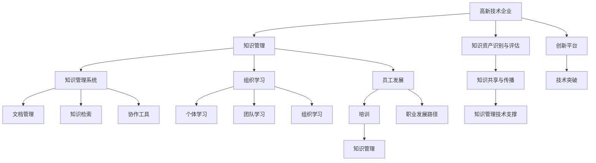

                 

# 知识管理在高新技术企业的实践

> 关键词：知识管理,高新技术企业,知识管理系统,组织学习,员工发展,信息技术

## 1. 背景介绍

### 1.1 问题由来
在当今高速发展的科技时代，高新技术企业面临的环境日益复杂多变。这类企业通常需要快速响应市场变化，不断推出创新产品，以满足用户需求。然而，许多高新技术企业面临知识孤岛、信息不对称、协作不畅等内部管理问题，阻碍了企业发展和创新能力的提升。知识管理成为高新技术企业亟待解决的重要问题。

知识管理是一种系统化的管理方式，旨在通过有效地捕捉、组织、传播和利用知识，以提升组织的学习能力、创新能力和竞争力。高新技术企业由于其技术密集、知识密集的特点，对知识管理的需求尤为迫切。有效实施知识管理，有助于企业形成共享、协作、创新的知识生态，加速技术迭代和产品开发，成为高新技术企业的核心竞争力之一。

### 1.2 问题核心关键点
知识管理在高新技术企业的实践主要围绕以下几个核心关键点展开：

- **知识资产识别与评估**：识别企业中的核心知识资产，对其进行评估，明确其在企业中的价值和重要性。
- **知识共享与传播**：建立知识共享平台，促进知识的有效传播和利用。
- **组织学习与创新**：通过学习机制和创新平台，提升组织的学习能力，加速技术突破和新产品开发。
- **知识管理技术支撑**：采用合适的知识管理软件工具，为知识管理提供技术支持。

这些关键点构成了知识管理在高新技术企业的实践框架，需要通过系统性的实施，形成有效的知识生态，从而提升企业的创新能力和竞争力。

## 2. 核心概念与联系

### 2.1 核心概念概述

为更好地理解知识管理在高新技术企业中的应用，本节将介绍几个核心概念及其相互联系：

- **知识管理(Knowledge Management, KM)**：通过系统化的方法，有效捕捉、组织、传播和利用组织内的知识，以提升组织的学习能力和创新能力。
- **高新技术企业(High-Tech Enterprises)**：指以技术创新为核心驱动力，从事高科技产品开发和服务的组织，如科技公司、研发机构等。
- **知识管理系统(Knowledge Management System, KMS)**：用于支持知识管理活动的软件系统，包括文档管理、知识检索、协作工具等。
- **组织学习(Organizational Learning)**：组织内个体和团队通过学习不断改进其能力的过程，包括个体学习、团队学习、组织学习三个层次。
- **员工发展(Employee Development)**：通过培训、职业发展路径设计等手段，提升员工的专业技能和综合素质。
- **信息技术(Information Technology, IT)**：采用计算机、网络等现代技术，支持企业的信息化管理。

这些核心概念通过组织学习、员工发展、信息技术等手段，共同构建了知识管理在高新技术企业的实践框架。

### 2.2 核心概念原理和架构的 Mermaid 流程图



这个流程图展示出知识管理在高新技术企业中的核心概念及其相互关系：

1. 高新技术企业通过知识管理获取知识资产，并对其进行评估。
2. 知识管理包括知识共享、组织学习和员工发展三个方面。
3. 知识管理系统提供文档管理、知识检索和协作工具等技术支撑。
4. 组织学习包括个体学习、团队学习和组织学习三个层次。
5. 员工发展通过培训和职业发展路径实现。
6. 创新平台支持技术突破和新产品开发。

这些概念相互依存、相互促进，共同构成了高新技术企业的知识管理实践。

## 3. 核心算法原理 & 具体操作步骤
### 3.1 算法原理概述

知识管理的核心算法原理基于组织学习理论和信息科学原理，旨在通过系统化的手段，优化知识的获取、存储、传播和利用过程。

知识管理的主要算法原理包括：

- **知识识别与提取算法**：通过自然语言处理、信息检索等技术，从企业内部文档、专利、项目报告等资料中识别和提取知识。
- **知识组织与分类算法**：采用标签、分类树等方法，对识别出的知识进行组织和分类，便于存储和检索。
- **知识传播与共享算法**：利用社交网络、协作工具等，促进知识在组织内部和外部的传播和共享。
- **知识评估与反馈算法**：通过评估工具和反馈机制，对知识管理的效果进行评估，提供持续改进的依据。

### 3.2 算法步骤详解

知识管理在高新技术企业的具体操作步骤如下：

**Step 1: 知识资产识别与评估**
- 通过问卷调查、专家访谈等方式，识别企业中的核心知识资产。
- 对识别出的知识资产进行价值评估，明确其在企业中的作用和重要性。

**Step 2: 建立知识管理系统**
- 选择适合企业的知识管理软件，如SharePoint、Confluence、Ky323等。
- 配置系统，包括文档管理、知识检索、协作工具等，确保系统的易用性和功能完备。

**Step 3: 实施知识共享与传播**
- 构建企业内部知识库，将重要文档和知识存储于系统中。
- 开发知识共享平台，促进跨部门、跨团队的知识交流。
- 使用协作工具，如Microsoft Teams、Slack等，加强实时交流和协作。

**Step 4: 组织学习和员工发展**
- 设计组织学习机制，如定期的学习分享会、跨部门的项目合作等。
- 提供员工发展路径，通过培训和职业规划，提升员工技能和素质。
- 建立创新平台，鼓励员工提出创新点子，支持技术突破和新产品开发。

**Step 5: 持续评估与改进**
- 定期对知识管理系统进行评估，通过问卷调查、绩效指标等方式，收集反馈意见。
- 根据评估结果，不断优化知识管理策略，改进系统功能，提升知识管理的效率和效果。

### 3.3 算法优缺点

知识管理在高新技术企业的实践具有以下优点：

- **促进创新**：知识共享和传播促进了跨部门、跨团队的合作，加速了技术创新和新产品开发。
- **提升效率**：通过系统化管理，有效减少了信息孤岛，提升了组织运行效率。
- **增强竞争力**：知识管理提升了组织的学习能力和知识积累，增强了企业的市场竞争力。

同时，也存在以下局限性：

- **实施成本高**：知识管理系统和相关培训需要投入较高成本。
- **技术门槛高**：需要一定的技术支撑，对信息技术的依赖度较高。
- **用户接受度**：员工对新技术的接受度可能影响知识管理的推广效果。

### 3.4 算法应用领域

知识管理在高新技术企业的应用主要包括以下几个领域：

- **研发创新**：通过知识管理加速技术创新和新产品开发。
- **市场营销**：通过市场情报和用户反馈，优化产品设计和市场策略。
- **客户服务**：通过知识库和协作工具，提升客户服务质量，增强客户满意度。
- **运营管理**：通过流程优化和运营数据分析，提升运营效率和质量。
- **人力资源**：通过员工发展和学习平台，提升员工技能和职业发展，增强员工归属感和忠诚度。

## 4. 数学模型和公式 & 详细讲解 & 举例说明

### 4.1 数学模型构建

本节将使用数学语言对知识管理在高新技术企业的实践进行更加严格的刻画。

记高新技术企业为 $E$，知识管理活动为 $KM$，知识管理系统为 $KMS$，组织学习为 $OL$，员工发展为 $ED$，信息技术为 $IT$。假设知识管理活动的目标函数为 $F$，包括知识识别与评估、知识共享与传播、组织学习与创新等多个子目标。

知识管理的目标函数可表示为：

$$
F = \max_{KM, KMS, OL, ED, IT} \sum_{i=1}^n w_i f_i(KM_i, KMS_i, OL_i, ED_i, IT_i)
$$

其中 $f_i$ 为子目标 $i$ 的优化目标，$w_i$ 为子目标的权重。

### 4.2 公式推导过程

以知识识别与评估为例，进行数学模型推导：

假设企业内部有 $n$ 个文档，每个文档的长度为 $l_i$，其中 $i$ 为文档编号。通过自然语言处理技术，可以提取每个文档中的关键信息 $I_i$，计算知识价值 $V_i$。知识价值越高，对企业的重要性越大。

知识价值 $V_i$ 可以通过以下公式计算：

$$
V_i = \alpha l_i + \beta \sum_{j=1}^m C_{ij}
$$

其中 $\alpha$ 和 $\beta$ 分别为文档长度和信息内容的权重系数，$m$ 为关键信息数量，$C_{ij}$ 表示文档 $i$ 中信息点 $j$ 对企业的贡献度。

知识识别与评估的目标函数为：

$$
F_{ID} = \max_{I_i} \sum_{i=1}^n w_{id} V_i
$$

通过优化目标函数 $F_{ID}$，可以识别出企业中具有高价值的核心知识资产。

### 4.3 案例分析与讲解

以某高科技公司的知识管理实践为例，进行详细讲解：

1. **知识资产识别**：通过问卷调查和专家访谈，识别出公司在技术创新、市场营销、客户服务等方面的关键知识。
2. **知识价值评估**：对识别的知识资产进行价值评估，计算其对企业运营的重要性。
3. **知识管理系统建立**：选择适合企业的知识管理系统，配置文档管理、知识检索等功能。
4. **知识共享与传播**：建立企业内部知识库，开发知识共享平台，促进跨部门知识交流。
5. **组织学习和员工发展**：设计定期学习分享会，提供员工培训和发展路径，提升员工技能和素质。
6. **持续评估与改进**：定期对知识管理系统进行评估，收集反馈意见，不断优化知识管理策略。

通过上述步骤，该公司在技术创新和市场营销方面取得了显著成果，客户满意度提升，运营效率提高。

## 5. 项目实践：代码实例和详细解释说明

### 5.1 开发环境搭建

在进行知识管理实践前，我们需要准备好开发环境。以下是使用Python进行知识管理系统开发的开发环境配置流程：

1. 安装Anaconda：从官网下载并安装Anaconda，用于创建独立的Python环境。

2. 创建并激活虚拟环境：
```bash
conda create -n km-env python=3.8 
conda activate km-env
```

3. 安装必要的Python包：
```bash
pip install pandas numpy sklearn scikit-learn matplotlib tqdm jupyter notebook ipython
```

4. 安装Microsoft Teams和SharePoint：部署Microsoft Teams和SharePoint，搭建知识共享平台。

5. 安装Confluence：部署Confluence，搭建知识库系统。

完成上述步骤后，即可在`km-env`环境中开始知识管理系统开发。

### 5.2 源代码详细实现

下面以构建企业知识库为例，给出使用Python和Confluence开发的代码实现。

首先，定义知识库的基本操作函数：

```python
from pyconfluence import ConfluenceRestClient
from pyconfluence.inputs import Document, FileContent

client = ConfluenceRestClient('https://confluence.example.com', 'user', 'password')

def create_page(parent_id, title, content):
    page = Document(title=title, body_content=content)
    parent_page = client.get_page(parent_id)
    response = client.create_page(parent_page, page)
    return response.page.id

def update_page(page_id, content):
    page = client.get_page(page_id)
    page.body_content = content
    response = client.update_page(page)
    return response.page.id

def delete_page(page_id):
    response = client.delete_page(page_id)
    return response.status_code
```

然后，定义数据处理函数：

```python
def read_documents():
    response = client.get_content('/wiki/home')
    data = response.data
    return data['results']

def save_document(title, content):
    page_id = create_page('/wiki/home', title, content)
    response = client.get_page(page_id)
    data = response.data
    return data['title'], data['body_content']

def update_document(title, content):
    page_id = create_page('/wiki/home', title, content)
    response = client.get_page(page_id)
    data = response.data
    update_page(page_id, content)

def delete_document(title):
    page_id = create_page('/wiki/home', title, content)
    response = client.get_page(page_id)
    data = response.data
    delete_page(page_id)
```

最后，启动知识库构建流程：

```python
# 读取文档数据
documents = read_documents()

# 遍历文档数据，构建知识库
for doc in documents:
    title = doc['title']
    content = doc['body_content']
    update_document(title, content)
```

以上代码实现了基本的知识库创建、更新、删除功能。通过调用这些函数，可以将企业内部文档存储于Confluence知识库中，供员工共享和查阅。

### 5.3 代码解读与分析

**create_page函数**：
- 创建新的页面，传入父页面ID、标题和内容。
- 调用ConfluenceRestClient的create_page方法，返回新页面的ID。

**update_page函数**：
- 更新页面内容，传入页面ID和新的内容。
- 调用ConfluenceRestClient的update_page方法，返回更新后的页面ID。

**delete_page函数**：
- 删除页面，传入页面ID。
- 调用ConfluenceRestClient的delete_page方法，返回删除状态码。

**read_documents函数**：
- 获取知识库首页的所有文档。
- 调用ConfluenceRestClient的get_content方法，返回文档数据。

**save_document函数**：
- 创建新的文档，传入标题和内容。
- 调用create_page方法创建新页面，更新页面内容。

**update_document函数**：
- 更新文档内容，传入标题和新的内容。
- 调用update_page方法更新页面内容。

**delete_document函数**：
- 删除文档，传入标题。
- 调用delete_page方法删除页面。

这些函数通过调用ConfluenceRestClient的API方法，实现了对知识库的基本操作，简化了知识管理系统的开发过程。

## 6. 实际应用场景

### 6.1 智能制造

知识管理在智能制造中的应用主要体现在以下几个方面：

1. **知识积累与共享**：通过知识管理系统，智能制造企业可以积累和管理设备运行数据、工艺参数、质量控制等信息，促进知识在企业内部的传播和共享。
2. **故障诊断与维修**：利用知识库中的故障记录和维修经验，加速故障诊断和维修流程，提高设备运行的可靠性。
3. **技术创新与改进**：通过知识管理平台，收集和分析员工的技术创新点和改进建议，加速技术突破和新产品开发。

### 6.2 金融科技

在金融科技领域，知识管理的应用主要集中在以下几个方面：

1. **风险控制**：通过知识库和文档管理系统，收集和存储行业风险评估数据、法规政策、案例分析等信息，提升风险控制的精准度和效率。
2. **客户服务**：利用知识管理系统，快速响应客户咨询，提供个性化的金融服务和建议，提升客户满意度。
3. **产品开发**：通过知识管理平台，汇聚产品研发团队的知识和创意，加速产品开发和迭代，提升市场竞争力。

### 6.3 医疗健康

知识管理在医疗健康领域的应用主要体现在以下几个方面：

1. **疾病诊断**：通过知识库存储医学文献、病历记录、临床经验等信息，辅助医生进行疾病诊断和治疗决策。
2. **医疗培训**：利用知识管理系统，为医护人员提供专业的培训资料和教学视频，提升医疗水平和服务质量。
3. **医疗研究**：通过知识管理平台，汇聚和分析医学研究成果，加速新药物的研发和医学知识传播。

## 7. 工具和资源推荐

### 7.1 学习资源推荐

为了帮助开发者系统掌握知识管理在高新技术企业中的应用，这里推荐一些优质的学习资源：

1. **《知识管理：系统与实践》（Knowledge Management: Systems and Practice）**：这本书系统介绍了知识管理的理论基础和实践方法，适合企业知识管理从业人员阅读。
2. **《组织学习：认识、组织、评估和提升》（Organizational Learning: Knowledge, Context, and Action）**：这本书详细探讨了组织学习的理论和实践，帮助企业理解如何在组织内部促进知识共享和创新。
3. **《知识管理工具箱》（The Knowledge Management Toolkit）**：这本书提供了实用的知识管理工具和操作指南，适合企业实际操作。
4. **《人工智能与知识管理》（Artificial Intelligence and Knowledge Management）**：这本书探讨了人工智能技术在知识管理中的应用，帮助企业利用新技术提升知识管理效果。

通过学习这些资源，相信你一定能够快速掌握知识管理在高新技术企业中的应用，并用于解决实际的业务问题。

### 7.2 开发工具推荐

高效的开发离不开优秀的工具支持。以下是几款用于知识管理系统开发的常用工具：

1. **Confluence**：Atlassian开发的知识管理系统，提供了丰富的文档管理和协作功能，适合企业内部知识库的搭建。
2. **SharePoint**：Microsoft开发的协作平台，提供了文档管理、权限控制等功能，适合企业级知识管理系统部署。
3. **Microsoft Teams**：Microsoft开发的团队协作工具，支持实时沟通、文件共享等功能，适合企业知识共享和协作。
4. **Slack**：Slack提供的团队协作平台，支持即时消息、频道、文件共享等功能，适合知识管理系统实时交流和协作。
5. **Google Drive**：Google提供的云存储和协作工具，支持文档编辑、版本控制等功能，适合知识管理系统的小规模部署。

合理利用这些工具，可以显著提升知识管理系统的开发效率，加快创新迭代的步伐。

### 7.3 相关论文推荐

知识管理在高新技术企业的研究源于学界的持续研究。以下是几篇奠基性的相关论文，推荐阅读：

1. **Knowledge Management: An Introduction**：Sebastian Wagner、Kathleen M. Eisenhardt和Philip L. Price发表的综述性文章，介绍了知识管理的理论基础和实践方法。
2. **The Evolution of Knowledge Management**：Arthur G. Blaxley发表的文章，探讨了知识管理的演进历程和未来趋势。
3. **Knowledge Management in Practice**：Jack Haugeland发表的文章，介绍了知识管理在企业中的实践应用案例。
4. **Knowledge Management in High-Tech Firms**：Hongjing Li发表的文章，探讨了知识管理在高科技企业中的应用策略。

这些论文代表了大语言模型微调技术的发展脉络。通过学习这些前沿成果，可以帮助研究者把握学科前进方向，激发更多的创新灵感。

## 8. 总结：未来发展趋势与挑战

### 8.1 总结

本文对知识管理在高新技术企业的实践进行了全面系统的介绍。首先阐述了知识管理在高新技术企业中的重要性和实践意义，明确了知识管理活动的目标和流程。其次，从理论到实践，详细讲解了知识管理系统的算法原理和操作步骤，给出了知识管理系统开发的完整代码实例。同时，本文还广泛探讨了知识管理在智能制造、金融科技、医疗健康等多个行业领域的应用前景，展示了知识管理范式的广阔前景。

通过本文的系统梳理，可以看到，知识管理在高新技术企业中的应用能够显著提升企业运营效率和创新能力，成为企业核心竞争力的重要组成部分。未来，伴随知识管理技术的持续演进，相信高新技术企业必将在更广阔的领域中大放异彩，推动科技行业的持续创新和发展。

### 8.2 未来发展趋势

展望未来，知识管理在高新技术企业的实践将呈现以下几个发展趋势：

1. **自动化和智能化**：利用AI技术，自动捕捉、组织和分析知识，提升知识管理的效率和精度。
2. **多模态知识管理**：结合文本、图像、视频等多模态数据，构建更加全面和丰富的知识库。
3. **实时性知识管理**：通过实时数据分析和反馈机制，动态调整知识管理策略，提升知识管理的实时性和灵活性。
4. **跨组织知识管理**：在企业间构建知识共享平台，促进跨组织的知识交流和协作。
5. **元知识管理**：通过元知识管理技术，自动识别和跟踪知识管理活动的效果，持续改进知识管理过程。

这些趋势凸显了知识管理在高新技术企业的广阔前景。这些方向的探索发展，必将进一步提升知识管理系统的效率和效果，为高新技术企业的发展提供强大的知识支撑。

### 8.3 面临的挑战

尽管知识管理在高新技术企业中已经取得了显著成果，但在迈向更加智能化、普适化应用的过程中，它仍面临诸多挑战：

1. **实施成本高**：知识管理系统和相关培训需要投入较高成本，尤其是在技术密集型企业。
2. **技术门槛高**：需要一定的技术支撑，对信息技术的依赖度较高，需要持续的技术投入和维护。
3. **用户接受度**：员工对新技术的接受度可能影响知识管理的推广效果，需要有效的培训和引导。
4. **数据质量差**：知识管理系统的核心在于高质量的数据，数据不完整、不规范、不准确等都会影响系统效果。
5. **隐私和安全**：知识管理系统涉及大量的敏感信息，数据隐私和安全问题需要高度关注。

### 8.4 研究展望

面对知识管理面临的这些挑战，未来的研究需要在以下几个方面寻求新的突破：

1. **自动化技术应用**：开发更多的自动化知识管理工具，提升知识管理的效率和精度。
2. **多模态数据融合**：研究如何有效融合文本、图像、视频等多模态数据，构建更加全面和丰富的知识库。
3. **实时数据处理**：研究如何通过实时数据分析和反馈机制，动态调整知识管理策略，提升知识管理的实时性和灵活性。
4. **跨组织协作**：探索如何通过知识管理平台，促进跨组织的知识交流和协作，形成更广泛的协同效应。
5. **元知识管理**：研究如何利用元知识管理技术，自动识别和跟踪知识管理活动的效果，持续改进知识管理过程。

这些研究方向的探索，必将引领知识管理技术迈向更高的台阶，为高新技术企业的持续创新和发展提供更强大的知识支撑。面向未来，知识管理技术还需要与其他人工智能技术进行更深入的融合，如自然语言处理、计算机视觉等，多路径协同发力，共同推动知识管理的持续进步和应用发展。

## 9. 附录：常见问题与解答

**Q1: 知识管理系统在企业中主要解决了什么问题？**

A: 知识管理系统通过系统化地管理企业内部和外部的知识资源，帮助企业解决以下问题：

1. **信息孤岛**：将企业内部分散的知识资源集中管理，消除信息孤岛，促进知识共享。
2. **知识遗忘**：通过知识库和协作工具，记录和传播知识，避免知识遗忘和过时。
3. **知识冗余**：利用知识管理系统，自动化地管理知识，减少知识冗余和重复工作。
4. **知识扩散**：通过知识共享平台，快速传递和扩散知识，提升组织学习能力。
5. **知识应用**：将知识与具体业务结合，指导决策和操作，提升业务效果。

通过知识管理系统，企业能够更好地捕捉、组织、传播和利用知识，提升企业的学习能力和创新能力。

**Q2: 实施知识管理系统时需要注意哪些关键点？**

A: 实施知识管理系统时需要注意以下关键点：

1. **目标明确**：明确知识管理的总体目标和关键任务，确保知识管理的方向和重点。
2. **需求调研**：深入了解企业内部的知识需求和痛点，设计适合企业的知识管理解决方案。
3. **系统选择**：选择适合企业的知识管理系统软件，确保系统的稳定性和易用性。
4. **数据管理**：建立完善的数据管理流程，确保知识库中数据的质量和准确性。
5. **培训引导**：对员工进行系统培训，提高其对知识管理系统的接受度和使用效率。
6. **持续改进**：定期对知识管理系统进行评估和改进，不断优化知识管理策略。

这些关键点贯穿知识管理的整个过程，需要企业各部门的共同参与和支持，才能确保知识管理系统的有效实施。

**Q3: 知识管理系统的评估标准有哪些？**

A: 知识管理系统的评估标准主要包括：

1. **知识库容量**：知识库存储的知识资源数量和质量，反映知识管理的广度和深度。
2. **知识共享率**：知识共享平台的使用频率和共享文档的数量，反映知识管理的活跃程度。
3. **知识更新率**：知识库和文档的更新频率和周期，反映知识管理的实时性和时效性。
4. **知识应用效果**：知识管理对业务决策和操作的影响，反映知识管理的实际效果。
5. **用户满意度**：员工对知识管理系统的使用体验和满意度，反映知识管理的用户接受度。

通过这些评估标准，可以全面了解知识管理系统的实施效果，及时发现和解决存在的问题，持续改进知识管理策略。

**Q4: 如何提升知识管理的实时性？**

A: 提升知识管理的实时性需要从以下几个方面入手：

1. **实时数据采集**：通过自动化的数据采集工具，实时抓取企业内部和外部环境的数据，如市场信息、用户反馈等。
2. **实时分析处理**：利用实时数据分析技术，对采集到的数据进行快速分析和处理，生成实时报告和决策支持。
3. **实时反馈机制**：建立实时反馈机制，将分析结果和决策建议推送给相关人员，确保信息及时传递和应用。
4. **实时协作工具**：使用实时协作工具，如Slack、Teams等，促进跨部门、跨团队的实时交流和协作，提升知识共享的效率。
5. **实时监控系统**：建立实时监控系统，对知识管理系统进行实时监控和异常检测，确保系统的稳定运行。

通过以上措施，可以显著提升知识管理的实时性和灵活性，满足企业快速响应市场变化的需求。

**Q5: 知识管理系统的实施成本主要包含哪些方面？**

A: 知识管理系统的实施成本主要包含以下几个方面：

1. **软件采购费用**：购买适合企业的知识管理系统软件，通常需要较高的前期投入。
2. **硬件设备和网络建设费用**：配置必要的硬件设备和网络设施，支持知识管理系统的运行。
3. **系统集成和定制费用**：根据企业需求进行系统集成和定制开发，涉及人力和时间的投入。
4. **数据迁移和清洗费用**：将现有的知识资源迁移到知识管理系统中，并进行数据清洗和整理。
5. **培训和推广费用**：对员工进行系统培训，提高其使用效率和效果，涉及培训师费用和培训资料制作费用。
6. **维护和更新费用**：对知识管理系统进行日常维护和更新，确保系统的稳定运行和功能完备。

这些成本都需要企业在实施知识管理系统时进行充分考虑，制定合理的预算计划。

---

作者：禅与计算机程序设计艺术 / Zen and the Art of Computer Programming

