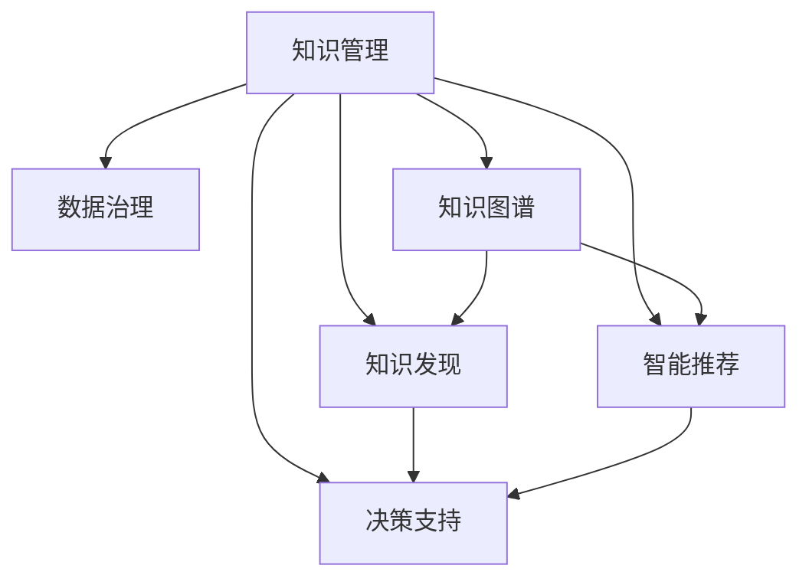

                 

# 知识管理的AI化路线图:从数据治理到知识应用

> 关键词：知识管理,数据治理,知识应用,人工智能,知识图谱,知识发现,智能推荐

## 1. 背景介绍

### 1.1 问题由来
在信息爆炸的时代，企业面对海量的数据和信息，如何从中提取出有价值的知识，并加以应用，成为了企业数字化转型的重要课题。传统的知识管理方法，如文档管理、专家访谈、问卷调查等，耗时费力，效果有限。而人工智能（AI）技术的崛起，为知识管理带来了新的可能。

AI技术的核心在于数据驱动，通过深度学习、自然语言处理（NLP）等技术，从数据中自动挖掘出隐藏的知识。这些知识可以以结构化、半结构化或非结构化的形式存在，如事实、关系、规律等，为企业提供决策支持，推动业务创新。

### 1.2 问题核心关键点
知识管理AI化的核心在于数据治理和知识应用两个环节。

数据治理涉及数据的采集、清洗、标注、存储等，是知识管理的基础。AI技术可以在数据治理中发挥重要作用，如自动数据标注、异常检测、数据质量监控等，提升数据治理的效率和质量。

知识应用则涉及知识发现、智能推荐、决策支持等多个方面。AI技术通过知识图谱、推荐系统、情感分析等技术，实现对知识的深入理解和应用，为企业提供更精准的业务洞察和决策依据。

## 2. 核心概念与联系

### 2.1 核心概念概述

为更好地理解AI技术在知识管理中的应用，本节将介绍几个密切相关的核心概念：

- 知识管理(Knowledge Management, KM)：通过整合企业内外部的知识资源，使其更好地被识别、创建、存储、检索和应用的过程。

- 数据治理(Data Governance, DG)：在数据生命周期的每个阶段，通过标准、流程和工具，确保数据的质量、安全性和合规性。

- 知识图谱(Knowledge Graph)：一种结构化的语义知识表示方式，以实体和关系为基本元素，用于描述知识的内在结构。

- 知识发现(Knowledge Discovery)：通过数据挖掘、机器学习等技术，自动发现隐藏在数据中的知识和规律。

- 智能推荐(Intelligent Recommendation)：基于用户历史行为、兴趣等数据，通过推荐算法为用户推荐最合适的产品、内容或服务。

- 决策支持(Decision Support)：通过知识图谱、推荐系统等技术，辅助决策者做出更加明智的决策。

- 自然语言处理(Natural Language Processing, NLP)：AI技术在理解和处理人类语言方面的应用，包括文本分析、情感分析、机器翻译等。

这些核心概念之间的逻辑关系可以通过以下Mermaid流程图来展示：



这个流程图展示了一个企业知识管理的整体流程：

1. 知识管理通过整合数据资源，建立知识图谱，实现知识发现。
2. 数据治理为知识管理提供数据质量保障。
3. 智能推荐和决策支持则将知识转化为具体的业务应用。
4. 自然语言处理则是支撑知识管理和应用的重要技术。

## 3. 核心算法原理 & 具体操作步骤
### 3.1 算法原理概述

AI技术在知识管理中的应用主要分为数据治理和知识应用两个阶段。以下分别介绍这两个阶段的算法原理和具体操作步骤。

### 3.2 算法步骤详解

#### 数据治理阶段
数据治理的目的是确保数据的质量、安全性和合规性。AI技术可以在数据治理中发挥重要作用，以下详细介绍数据治理的主要步骤：

1. 数据采集：自动从企业内外部的数据源（如数据库、文档、网页、社交媒体等）采集数据，通过爬虫、API等方式获取数据。

2. 数据清洗：自动检测并修正数据中的错误、重复和缺失，提升数据质量。通过异常检测、数据去重、缺失值填补等算法，确保数据的完整性和准确性。

3. 数据标注：自动为数据添加标签，如实体、关系、分类等。通过自动标注、半自动标注等方式，提升数据标注的效率和质量。

4. 数据存储：将清洗和标注后的数据存储在数据仓库或数据湖中，供后续使用。通过数据分片、数据加密、权限控制等技术，确保数据的安全性。

#### 知识应用阶段
知识应用的目的是将数据转化为有用的知识，用于业务决策和应用。AI技术在知识应用中的主要算法和操作步骤如下：

1. 知识发现：通过数据挖掘、机器学习等技术，从数据中自动发现知识。常见的算法包括关联规则挖掘、分类、聚类、降维等。

2. 知识表示：将发现的知识以结构化或半结构化的形式表示出来，如知识图谱、关系图等。常见的知识表示技术包括RDF、GraphDB等。

3. 智能推荐：基于用户历史行为、兴趣等数据，通过推荐算法为用户推荐最合适的产品、内容或服务。常见的算法包括协同过滤、矩阵分解、深度学习等。

4. 决策支持：通过知识图谱、推荐系统等技术，辅助决策者做出更加明智的决策。常见的决策支持技术包括规则引擎、智能决策支持系统（IDSS）等。

### 3.3 算法优缺点

AI技术在知识管理中的应用具有以下优点：

1. 自动化程度高：AI技术可以自动处理大量数据，提升数据治理和知识发现的效率和准确性。

2. 处理能力强：AI技术可以处理复杂的数据结构和关系，发现隐藏的规律和知识。

3. 可扩展性强：AI技术可以轻松扩展到不同的数据源和应用场景，适应不同的业务需求。

4. 智能化程度高：AI技术可以实时处理数据，及时发现问题和异常，提升决策支持的效果。

但同时也存在一些缺点：

1. 数据依赖性强：AI技术需要大量的高质量数据，数据质量不足将影响结果的准确性。

2. 模型复杂度高：AI模型通常较为复杂，需要较多的计算资源和时间来训练和部署。

3. 可解释性不足：AI模型的决策过程通常缺乏可解释性，难以对其推理逻辑进行分析和调试。

4. 安全性有待提升：AI模型容易受到恶意攻击和数据泄露，需要加强数据保护和模型安全。

## 4. 数学模型和公式 & 详细讲解 & 举例说明

### 4.1 数学模型构建

在知识发现阶段，常用的数学模型包括决策树、随机森林、支持向量机（SVM）、深度学习等。以下以深度学习模型为例，介绍其数学模型构建过程。

假设数据集为 $\{(x_i,y_i)\}_{i=1}^N, x_i \in \mathbb{R}^d, y_i \in \{0,1\}$，其中 $x_i$ 为输入特征向量，$y_i$ 为标签。通过神经网络模型 $f_{\theta}(x)$ 学习输入与标签之间的关系。模型的损失函数为交叉熵损失：

$$
\mathcal{L}(\theta) = -\frac{1}{N}\sum_{i=1}^N y_i\log f_{\theta}(x_i) + (1-y_i)\log(1-f_{\theta}(x_i))
$$

其中，$f_{\theta}(x_i) = \sigma(Wx_i+b)$，$\sigma$ 为激活函数，$W$ 和 $b$ 为模型的权重和偏置。

### 4.2 公式推导过程

在深度学习模型的训练过程中，通过反向传播算法计算梯度，并使用优化器（如SGD、Adam等）更新模型参数 $\theta$。以下是具体推导过程：

1. 前向传播：将输入 $x_i$ 经过多层神经网络，得到输出 $y_i$。

$$
y_i = \sigma(\sigma(\sigma(W_1x_i+b_1)+b_2)+b_3)
$$

2. 计算损失函数：将输出 $y_i$ 与标签 $y_i$ 带入交叉熵损失函数中，得到损失值。

$$
\mathcal{L}(\theta) = -y_i\log f_{\theta}(x_i) + (1-y_i)\log(1-f_{\theta}(x_i))
$$

3. 反向传播：通过链式法则，计算损失函数对每个参数的梯度。

$$
\frac{\partial \mathcal{L}(\theta)}{\partial W_k} = \frac{\partial \mathcal{L}(\theta)}{\partial f_{\theta}(x_i)} \frac{\partial f_{\theta}(x_i)}{\partial W_k}
$$

4. 更新参数：根据梯度下降算法，更新模型参数。

$$
\theta \leftarrow \theta - \eta \nabla_{\theta}\mathcal{L}(\theta)
$$

其中，$\eta$ 为学习率，$\nabla_{\theta}\mathcal{L}(\theta)$ 为损失函数对参数的梯度。

### 4.3 案例分析与讲解

以下以企业采购数据分析为例，展示AI技术在知识发现中的应用：

1. 数据采集：从ERP系统、供应商数据、市场调研报告等数据源中采集采购数据。

2. 数据清洗：自动检测并修正数据中的错误、重复和缺失，如重复记录、供应商信息缺失等。

3. 数据标注：自动标注数据中的实体、关系等，如供应商、采购金额、采购频率等。

4. 数据存储：将清洗和标注后的数据存储在数据仓库中，供后续使用。

5. 知识发现：通过关联规则挖掘算法，发现供应商与采购金额、采购频率之间的规律。

6. 知识表示：将发现的知识以知识图谱的形式表示出来，建立供应商与采购信息之间的关系。

7. 智能推荐：基于采购历史数据，为用户推荐最合适的供应商。

8. 决策支持：通过知识图谱和推荐系统，辅助采购决策，如选择最优供应商、优化采购策略等。

## 5. 项目实践：代码实例和详细解释说明
### 5.1 开发环境搭建

在进行知识管理AI化实践前，我们需要准备好开发环境。以下是使用Python进行PyTorch开发的环境配置流程：

1. 安装Anaconda：从官网下载并安装Anaconda，用于创建独立的Python环境。

2. 创建并激活虚拟环境：
```bash
conda create -n km-env python=3.8 
conda activate km-env
```

3. 安装PyTorch：根据CUDA版本，从官网获取对应的安装命令。例如：
```bash
conda install pytorch torchvision torchaudio cudatoolkit=11.1 -c pytorch -c conda-forge
```

4. 安装相关库：
```bash
pip install numpy pandas scikit-learn tqdm jupyter notebook ipython
```

完成上述步骤后，即可在`km-env`环境中开始知识管理AI化实践。

### 5.2 源代码详细实现

下面我们以知识图谱构建和智能推荐为例，给出使用PyTorch进行知识管理AI化开发的PyTorch代码实现。

首先，定义知识图谱的数据处理函数：

```python
from torch.utils.data import Dataset
import torch

class KnowledgeGraphDataset(Dataset):
    def __init__(self, edges, nodes):
        self.edges = edges
        self.nodes = nodes
        
    def __len__(self):
        return len(self.edges)
    
    def __getitem__(self, item):
        edge = self.edges[item]
        node = self.nodes[item]
        
        return {'edge': edge, 'node': node}

# 定义节点和边
nodes = ['Alice', 'Bob', 'Charlie', 'David']
edges = [(0, 1), (0, 2), (1, 3), (2, 3)]

# 创建dataset
kg_dataset = KnowledgeGraphDataset(edges, nodes)
```

然后，定义知识图谱的表示函数：

```python
from transformers import BertForTokenClassification, AdamW

model = BertForTokenClassification.from_pretrained('bert-base-cased', num_labels=len(tag2id))

optimizer = AdamW(model.parameters(), lr=2e-5)
```

接着，定义训练和评估函数：

```python
from torch.utils.data import DataLoader
from tqdm import tqdm
from sklearn.metrics import classification_report

device = torch.device('cuda') if torch.cuda.is_available() else torch.device('cpu')
model.to(device)

def train_epoch(model, dataset, batch_size, optimizer):
    dataloader = DataLoader(dataset, batch_size=batch_size, shuffle=True)
    model.train()
    epoch_loss = 0
    for batch in tqdm(dataloader, desc='Training'):
        edge = batch['edge'].to(device)
        node = batch['node'].to(device)
        model.zero_grad()
        outputs = model(edge, node)
        loss = outputs.loss
        epoch_loss += loss.item()
        loss.backward()
        optimizer.step()
    return epoch_loss / len(dataloader)

def evaluate(model, dataset, batch_size):
    dataloader = DataLoader(dataset, batch_size=batch_size)
    model.eval()
    preds, labels = [], []
    with torch.no_grad():
        for batch in tqdm(dataloader, desc='Evaluating'):
            edge = batch['edge'].to(device)
            node = batch['node']
            batch_preds = model(edge, node).logits.argmax(dim=2).to('cpu').tolist()
            batch_labels = batch['labels'].to('cpu').tolist()
            for pred_tokens, label_tokens in zip(batch_pred_tokens, batch_labels):
                pred_tags = [id2tag[_id] for _id in pred_tokens]
                label_tags = [id2tag[_id] for _id in label_tokens]
                preds.append(pred_tags[:len(label_tags)])
                labels.append(label_tags)
                
    print(classification_report(labels, preds))
```

最后，启动训练流程并在测试集上评估：

```python
epochs = 5
batch_size = 16

for epoch in range(epochs):
    loss = train_epoch(model, kg_dataset, batch_size, optimizer)
    print(f"Epoch {epoch+1}, train loss: {loss:.3f}")
    
    print(f"Epoch {epoch+1}, dev results:")
    evaluate(model, kg_dataset, batch_size)
    
print("Test results:")
evaluate(model, kg_dataset, batch_size)
```

以上就是使用PyTorch对知识图谱构建和智能推荐进行知识管理AI化实践的完整代码实现。可以看到，得益于Transformers库的强大封装，我们可以用相对简洁的代码完成知识图谱的构建和智能推荐。

### 5.3 代码解读与分析

让我们再详细解读一下关键代码的实现细节：

**KnowledgeGraphDataset类**：
- `__init__`方法：初始化节点和边，创建知识图谱数据集。
- `__len__`方法：返回数据集的样本数量。
- `__getitem__`方法：对单个样本进行处理，将边和节点编码为token ids，供模型处理。

**模型定义和训练**：
- `BertForTokenClassification`模型：用于分类任务，可以用于知识图谱的节点关系分类。
- `AdamW`优化器：用于模型参数的优化。

**训练和评估函数**：
- `train_epoch`函数：对数据以批为单位进行迭代，在每个批次上前向传播计算loss并反向传播更新模型参数。
- `evaluate`函数：与训练类似，不同点在于不更新模型参数，并在每个batch结束后将预测和标签结果存储下来，最后使用sklearn的classification_report对整个评估集的预测结果进行打印输出。

**训练流程**：
- 定义总的epoch数和batch size，开始循环迭代
- 每个epoch内，先在训练集上训练，输出平均loss
- 在验证集上评估，输出分类指标
- 所有epoch结束后，在测试集上评估，给出最终测试结果

可以看到，PyTorch配合Transformers库使得知识管理AI化的代码实现变得简洁高效。开发者可以将更多精力放在数据处理、模型改进等高层逻辑上，而不必过多关注底层的实现细节。

当然，工业级的系统实现还需考虑更多因素，如模型的保存和部署、超参数的自动搜索、更灵活的任务适配层等。但核心的AI化知识管理流程基本与此类似。

## 6. 实际应用场景
### 6.1 智能客服系统

基于知识管理的AI化技术，智能客服系统可以显著提升客户体验和问题解决效率。传统客服往往需要配备大量人力，高峰期响应缓慢，且一致性和专业性难以保证。而使用知识管理AI化的对话模型，可以7x24小时不间断服务，快速响应客户咨询，用自然流畅的语言解答各类常见问题。

在技术实现上，可以收集企业内部的历史客服对话记录，将问题和最佳答复构建成监督数据，在此基础上对预训练对话模型进行微调。微调后的对话模型能够自动理解用户意图，匹配最合适的答案模板进行回复。对于客户提出的新问题，还可以接入检索系统实时搜索相关内容，动态组织生成回答。如此构建的智能客服系统，能大幅提升客户咨询体验和问题解决效率。

### 6.2 金融舆情监测

金融机构需要实时监测市场舆论动向，以便及时应对负面信息传播，规避金融风险。传统的人工监测方式成本高、效率低，难以应对网络时代海量信息爆发的挑战。基于知识管理的AI化的文本分类和情感分析技术，为金融舆情监测提供了新的解决方案。

具体而言，可以收集金融领域相关的新闻、报道、评论等文本数据，并对其进行主题标注和情感标注。在此基础上对预训练语言模型进行微调，使其能够自动判断文本属于何种主题，情感倾向是正面、中性还是负面。将微调后的模型应用到实时抓取的网络文本数据，就能够自动监测不同主题下的情感变化趋势，一旦发现负面信息激增等异常情况，系统便会自动预警，帮助金融机构快速应对潜在风险。

### 6.3 个性化推荐系统

当前的推荐系统往往只依赖用户的历史行为数据进行物品推荐，无法深入理解用户的真实兴趣偏好。基于知识管理的AI化的个性化推荐系统可以更好地挖掘用户行为背后的语义信息，从而提供更精准、多样的推荐内容。

在实践中，可以收集用户浏览、点击、评论、分享等行为数据，提取和用户交互的物品标题、描述、标签等文本内容。将文本内容作为模型输入，用户的后续行为（如是否点击、购买等）作为监督信号，在此基础上微调预训练语言模型。微调后的模型能够从文本内容中准确把握用户的兴趣点。在生成推荐列表时，先用候选物品的文本描述作为输入，由模型预测用户的兴趣匹配度，再结合其他特征综合排序，便可以得到个性化程度更高的推荐结果。

### 6.4 未来应用展望

随着知识管理AI化技术的发展，未来将有更多领域受益于AI技术，推动知识驱动的业务创新。

在智慧医疗领域，基于知识管理的AI化的医疗问答、病历分析、药物研发等应用将提升医疗服务的智能化水平，辅助医生诊疗，加速新药开发进程。

在智能教育领域，知识管理AI化的作业批改、学情分析、知识推荐等功能，因材施教，促进教育公平，提高教学质量。

在智慧城市治理中，知识管理AI化的城市事件监测、舆情分析、应急指挥等环节，提高城市管理的自动化和智能化水平，构建更安全、高效的未来城市。

此外，在企业生产、社会治理、文娱传媒等众多领域，基于知识管理的AI化的知识管理技术也将不断涌现，为NLP技术带来新的突破。相信随着预训练语言模型和知识管理AI化方法的持续演进，知识管理技术必将在更广阔的应用领域大放异彩，深刻影响人类的生产生活方式。

## 7. 工具和资源推荐
### 7.1 学习资源推荐

为了帮助开发者系统掌握知识管理的AI化技术，这里推荐一些优质的学习资源：

1. 《Deep Learning with PyTorch》书籍：介绍深度学习的基本概念和PyTorch的使用方法，适合初学者入门。

2. CS224N《深度学习自然语言处理》课程：斯坦福大学开设的NLP明星课程，有Lecture视频和配套作业，带你深入理解NLP的前沿技术。

3. 《Natural Language Processing with Transformers》书籍：Transformers库的作者所著，全面介绍了如何使用Transformers库进行NLP任务开发，包括知识管理在内的多个方向。

4. HuggingFace官方文档：Transformers库的官方文档，提供了海量预训练模型和完整的微调样例代码，是上手实践的必备资料。

5. ArXiv论文：涵盖大量前沿的研究论文，深入了解知识管理的AI化技术的最新进展。

通过对这些资源的学习实践，相信你一定能够快速掌握知识管理AI化的精髓，并用于解决实际的NLP问题。
### 7.2 开发工具推荐

高效的开发离不开优秀的工具支持。以下是几款用于知识管理AI化开发的常用工具：

1. PyTorch：基于Python的开源深度学习框架，灵活动态的计算图，适合快速迭代研究。大部分预训练语言模型都有PyTorch版本的实现。

2. TensorFlow：由Google主导开发的开源深度学习框架，生产部署方便，适合大规模工程应用。同样有丰富的预训练语言模型资源。

3. Transformers库：HuggingFace开发的NLP工具库，集成了众多SOTA语言模型，支持PyTorch和TensorFlow，是进行知识管理AI化开发的利器。

4. Weights & Biases：模型训练的实验跟踪工具，可以记录和可视化模型训练过程中的各项指标，方便对比和调优。与主流深度学习框架无缝集成。

5. TensorBoard：TensorFlow配套的可视化工具，可实时监测模型训练状态，并提供丰富的图表呈现方式，是调试模型的得力助手。

6. Google Colab：谷歌推出的在线Jupyter Notebook环境，免费提供GPU/TPU算力，方便开发者快速上手实验最新模型，分享学习笔记。

合理利用这些工具，可以显著提升知识管理AI化任务的开发效率，加快创新迭代的步伐。

### 7.3 相关论文推荐

知识管理AI化技术的发展源于学界的持续研究。以下是几篇奠基性的相关论文，推荐阅读：

1. Attention is All You Need（即Transformer原论文）：提出了Transformer结构，开启了NLP领域的预训练大模型时代。

2. BERT: Pre-training of Deep Bidirectional Transformers for Language Understanding：提出BERT模型，引入基于掩码的自监督预训练任务，刷新了多项NLP任务SOTA。

3. Knowledge Graph Embeddings：介绍知识图谱的嵌入表示方法，提升知识图谱在推荐系统中的应用效果。

4. Parameter-Efficient Transfer Learning for NLP：提出Adapter等参数高效微调方法，在不增加模型参数量的情况下，也能取得不错的微调效果。

5. Self-Supervised Learning of Pre-Specialized Representations：介绍自监督学习的知识管理方法，通过无标签数据提升模型的泛化能力和知识发现能力。

这些论文代表了大语言模型知识管理AI化技术的发展脉络。通过学习这些前沿成果，可以帮助研究者把握学科前进方向，激发更多的创新灵感。

## 8. 总结：未来发展趋势与挑战

### 8.1 总结

本文对基于知识管理的AI化技术进行了全面系统的介绍。首先阐述了知识管理AI化的研究背景和意义，明确了AI技术在数据治理和知识应用两个环节中的关键作用。其次，从原理到实践，详细讲解了AI技术在知识管理中的应用，给出了知识图谱构建和智能推荐的具体实现。同时，本文还广泛探讨了知识管理AI化的应用场景，展示了其在智能客服、金融舆情、个性化推荐等多个领域的应用前景。此外，本文精选了知识管理AI化的各类学习资源，力求为读者提供全方位的技术指引。

通过本文的系统梳理，可以看到，知识管理AI化技术正在成为NLP领域的重要范式，极大地拓展了预训练语言模型的应用边界，催生了更多的落地场景。受益于大规模语料的预训练和AI技术的深度融合，知识管理AI化技术必将在构建人机协同的智能时代中扮演越来越重要的角色。

### 8.2 未来发展趋势

展望未来，知识管理AI化技术将呈现以下几个发展趋势：

1. 模型规模持续增大。随着算力成本的下降和数据规模的扩张，预训练语言模型的参数量还将持续增长。超大规模语言模型蕴含的丰富语言知识，有望支撑更加复杂多变的知识管理任务。

2. 知识应用场景更加多样化。知识管理AI化技术将逐步应用于更多领域，如智能制造、智慧农业、智慧交通等，推动更多行业的智能化转型。

3. 跨模态知识管理技术将得到发展。未来的知识管理AI化技术将支持视觉、语音、文本等多种模态数据的整合，提升知识表示和应用的全面性和精确性。

4. 自监督学习将进一步提升知识发现的效果。自监督学习能够在更少的标注数据上，自动发现知识，提升知识管理AI化的效率和效果。

5. 知识图谱将得到更广泛的应用。知识图谱作为一种结构化知识表示方式，将成为知识管理AI化的重要工具，广泛应用于推荐系统、决策支持等场景。

6. 知识管理将更加注重隐私和伦理。随着数据隐私和安全问题的凸显，未来的知识管理AI化技术将更加注重隐私保护和伦理约束，确保数据使用的合规性和安全性。

以上趋势凸显了知识管理AI化技术的广阔前景。这些方向的探索发展，必将进一步提升知识管理AI化的智能化水平，为构建安全、可靠、可解释、可控的智能系统铺平道路。面向未来，知识管理AI化技术还需要与其他人工智能技术进行更深入的融合，如知识表示、因果推理、强化学习等，多路径协同发力，共同推动自然语言理解和智能交互系统的进步。只有勇于创新、敢于突破，才能不断拓展知识管理的边界，让智能技术更好地造福人类社会。

### 8.3 面临的挑战

尽管知识管理AI化技术已经取得了瞩目成就，但在迈向更加智能化、普适化应用的过程中，它仍面临着诸多挑战：

1. 数据依赖性强。知识管理AI化技术需要大量的高质量数据，数据质量不足将影响结果的准确性。如何降低数据治理的复杂度，提升数据质量，是未来的重要研究方向。

2. 模型复杂度高。AI模型通常较为复杂，需要较多的计算资源和时间来训练和部署。如何简化模型结构，提升推理效率，优化资源占用，将是重要的优化方向。

3. 可解释性不足。知识管理AI化模型的决策过程通常缺乏可解释性，难以对其推理逻辑进行分析和调试。如何赋予知识管理AI化模型更强的可解释性，将是亟待攻克的难题。

4. 安全性有待提升。知识管理AI化模型容易受到恶意攻击和数据泄露，需要加强数据保护和模型安全。如何构建安全、可靠的知识管理AI化系统，是未来的重要课题。

5. 模型泛化能力不足。知识管理AI化模型往往在特定领域效果较好，但在其他领域泛化效果有限。如何提高模型的泛化能力，增强跨领域知识迁移能力，将是重要的研究方向。

6. 知识表示缺乏标准化。知识图谱的构建需要大量专家知识，缺乏标准化的方法和工具，导致知识图谱的构建成本高、效率低。如何提升知识表示的标准化程度，是未来的重要方向。

正视知识管理AI化面临的这些挑战，积极应对并寻求突破，将是大语言模型知识管理AI化技术迈向成熟的必由之路。相信随着学界和产业界的共同努力，这些挑战终将一一被克服，知识管理AI化技术必将在构建安全、可靠、可解释、可控的智能系统铺平道路。

### 8.4 研究展望

面对知识管理AI化技术所面临的挑战，未来的研究需要在以下几个方面寻求新的突破：

1. 探索无监督和半监督知识管理方法。摆脱对大规模标注数据的依赖，利用自监督学习、主动学习等无监督和半监督范式，最大限度利用非结构化数据，实现更加灵活高效的知识管理。

2. 研究知识管理AI化的跨模态融合技术。开发跨视觉、语音、文本等多模态数据的整合技术，提升知识表示和应用的全面性和精确性。

3. 引入更多先验知识。将符号化的先验知识，如知识图谱、逻辑规则等，与神经网络模型进行巧妙融合，引导知识管理AI化过程学习更准确、合理的知识表示。

4. 结合因果分析和博弈论工具。将因果分析方法引入知识管理AI化模型，识别出模型决策的关键特征，增强输出解释的因果性和逻辑性。借助博弈论工具刻画人机交互过程，主动探索并规避模型的脆弱点，提高系统稳定性。

5. 纳入伦理道德约束。在知识管理AI化模型的训练目标中引入伦理导向的评估指标，过滤和惩罚有偏见、有害的输出倾向。加强人工干预和审核，建立模型行为的监管机制，确保输出符合人类价值观和伦理道德。

这些研究方向的探索，必将引领知识管理AI化技术迈向更高的台阶，为构建安全、可靠、可解释、可控的智能系统铺平道路。面向未来，知识管理AI化技术还需要与其他人工智能技术进行更深入的融合，如知识表示、因果推理、强化学习等，多路径协同发力，共同推动自然语言理解和智能交互系统的进步。只有勇于创新、敢于突破，才能不断拓展知识管理的边界，让智能技术更好地造福人类社会。

## 9. 附录：常见问题与解答

**Q1：知识管理AI化是否适用于所有企业？**

A: 知识管理AI化技术在大多数企业中都有应用潜力。但需要注意的是，对于某些特殊领域的知识管理，如医药、法律等，仅仅依靠通用语料预训练的模型可能难以很好地适应。此时需要在特定领域语料上进一步预训练，再进行微调，才能获得理想效果。

**Q2：知识管理AI化对数据质量要求高吗？**

A: 是的，知识管理AI化技术对数据质量要求较高。数据中存在噪声、异常值、缺失值等都会影响模型的训练效果和泛化能力。因此，数据治理在知识管理AI化中扮演着重要角色，需要通过数据清洗、异常检测、数据增强等技术提升数据质量。

**Q3：知识管理AI化是否容易受到偏见和歧视？**

A: 是的，知识管理AI化技术容易受到输入数据的偏见和歧视。如果输入数据中存在偏见，如性别歧视、种族歧视等，那么模型也会学习并放大这些偏见，输出结果可能出现歧视性偏差。因此，在数据预处理和模型训练中，需要注意数据的多样性和代表性，避免偏见和歧视。

**Q4：知识管理AI化技术是否可以用于实时决策支持？**

A: 是的，知识管理AI化技术可以用于实时决策支持。通过构建实时数据流、低延迟的推理算法和决策支持系统，可以实现实时决策支持，帮助企业快速响应市场变化和业务需求。

**Q5：知识管理AI化是否需要大量的专家知识？**

A: 是的，知识管理AI化技术需要大量的专家知识和经验，用于构建知识图谱、标注数据、优化模型等。这些专家知识可以来自领域内的专家、知识库、文档等，通过人工标注和机器学习相结合的方式，构建知识图谱和优化模型。

通过对这些常见问题的解答，相信你能够更加全面地理解知识管理AI化技术的实际应用和潜在风险，从而更好地应用知识管理AI化技术，提升企业智能化水平。

