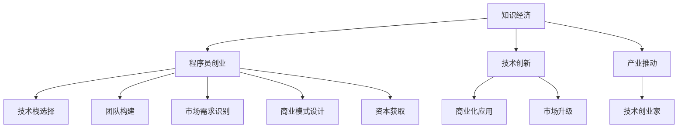

                 

# 知识经济下程序员的创业之路与机遇

> 关键词：知识经济,程序员创业,人工智能,大数据,创业机会,技术栈

## 1. 背景介绍

### 1.1 问题由来
随着全球经济结构的深刻变革，以知识驱动为核心特征的知识经济已经初现端倪。在知识经济时代，知识不再仅仅是被动的资源消耗，而是成为经济增长的主要动力。这也意味着，掌握核心知识和技术的人才，将成为未来经济发展的关键。特别是对于程序员这一群体，他们既是知识经济的受益者，也是知识经济转型的关键推动者。

在技术快速迭代、市场需求多样化的今天，程序员不仅面临着职业生涯发展的挑战，更面临着如何抓住历史机遇，实现自身价值和商业价值的双重提升。如何构建自己的创业之路，抓住知识经济下的发展机遇，成为了程序员们共同关心的话题。

### 1.2 问题核心关键点
本节将探讨程序员在知识经济下创业的几个核心关键点：

1. **技术栈的选择**：程序员需要根据自己的技术专长和市场需求，选择合适的技术栈，构建自己的技术优势。
2. **创业团队构建**：选择合适的创业伙伴，形成互补的技术能力和市场经验。
3. **市场需求的识别与细分**：在广泛的市场需求中，识别并细分符合自身技术专长的创业领域。
4. **商业模式的设计与创新**：设计具有市场竞争力的商业模式，实现技术创新与商业价值的双重提升。
5. **资本与资源的获取**：在知识经济背景下，如何有效获取资本和资源支持，加速创业进程。

### 1.3 问题研究意义
探讨程序员在知识经济下的创业之路，对于拓展程序员的职业发展路径，推动技术创新与商业化应用，具有重要意义：

1. 提供方向指引：帮助程序员明确在知识经济下的创业方向，避免盲目跟风。
2. 激发创新潜能：鼓励程序员通过创业实现技术创新，推动技术进步。
3. 促进产业升级：利用程序员的创业项目，带动相关产业的发展，提升整体经济水平。
4. 培养技术创业家：通过创业，锻炼程序员的综合素质，培养更多技术创业家。

## 2. 核心概念与联系

### 2.1 核心概念概述

为更好地理解程序员在知识经济下如何创业，本节将介绍几个密切相关的核心概念：

- **知识经济**：以知识为驱动力的经济形态，强调创新和技术的价值。
- **程序员创业**：程序员利用自身的技术专长和创新思维，创办新兴企业，推动技术商业化应用。
- **技术栈**：程序员掌握的一系列技术工具、语言和框架，构建技术优势。
- **市场需求**：当前和未来市场上对技术产品和服务的需求。
- **商业模式**：企业运营和价值实现的方式，包括产品、服务、用户和收入模型。
- **资本与资源**：创业项目所需的资金、人才、市场渠道等资源支持。

这些概念之间的逻辑关系可以通过以下Mermaid流程图来展示：



这个流程图展示了几大核心概念及其之间的联系：

1. 知识经济是程序员创业的背景。
2. 技术栈是程序员创业的技术基础。
3. 市场需求是程序员创业的市场机会。
4. 商业模式是程序员创业的运营方式。
5. 资本与资源是程序员创业的支撑条件。

这些概念共同构成了程序员在知识经济下创业的框架，为其创业实践提供了指导。

## 3. 核心算法原理 & 具体操作步骤
### 3.1 算法原理概述

程序员在知识经济下的创业，本质上是一个多因素影响、复杂决策的过程。其核心思想是：通过选择合适的技术栈、构建合理的团队、识别细分市场、设计创新商业模式，获取必要的资本与资源支持，实现技术到商业化的转型。

形式化地，假设创业者拥有技术栈 $\mathcal{T}$，市场需求 $\mathcal{M}$，资本 $\mathcal{C}$，则创业过程的目标是找到最优的策略 $\pi^*$，使得：

$$
\pi^* = \mathop{\arg\max}_{\pi} \mathcal{P}(\pi; \mathcal{T}, \mathcal{M}, \mathcal{C})
$$

其中 $\mathcal{P}(\pi; \mathcal{T}, \mathcal{M}, \mathcal{C})$ 为创业成功概率的函数，考虑了技术栈的选择、市场需求的识别、资本的获取等多方面因素。

### 3.2 算法步骤详解

基于上述原理，程序员的创业过程可以分为以下几个关键步骤：

**Step 1: 技术栈选择**
- 评估自身技术专长和市场需求，确定适合的技术栈。
- 考虑技术栈的易用性、扩展性和社区支持。
- 关注技术栈的前沿发展和趋势，确保技术优势。

**Step 2: 团队构建**
- 寻找与自身技术能力和市场经验互补的合作伙伴。
- 明确团队分工，形成有效的决策机制。
- 定期评估团队成员的工作表现和贡献。

**Step 3: 市场需求识别与细分**
- 调研市场现状和未来趋势，识别潜在的需求机会。
- 细分市场需求，选择与自身技术专长匹配的细分市场。
- 通过市场调研和用户反馈，验证市场需求的真实性和可行性。

**Step 4: 商业模式设计**
- 根据市场需求和技术栈特点，设计符合市场需求的商业模式。
- 考虑产品、服务、用户和收入模型，设计可持续发展的商业模式。
- 进行商业模式的验证和优化，确保其市场竞争力。

**Step 5: 资本与资源获取**
- 通过各种渠道获取创业所需的资金和资源支持。
- 考虑融资渠道，如天使投资、风险投资、众筹等。
- 与投资人建立良好的沟通关系，明确投资回报预期。

**Step 6: 创业实施与迭代优化**
- 根据市场需求和技术栈特点，实施创业项目。
- 定期评估项目进展和市场反馈，进行迭代优化。
- 保持与市场动态同步，及时调整战略和策略。

### 3.3 算法优缺点

程序员在知识经济下创业的优势：
1. 技术优势明显：程序员具备较强的技术能力，能够快速实现技术创新。
2. 市场需求敏锐：程序员对技术趋势和市场需求有深刻的理解。
3. 创业门槛低：相比于传统产业，技术创业的启动资金和运营成本较低。
4. 市场潜力大：知识经济下的技术应用市场巨大，创业机会丰富。

同时，该方法也存在一定的局限性：
1. 技术风险较高：技术栈的选择和市场需求的不确定性，可能导致创业失败。
2. 资本获取难度大：技术创业往往需要较高投入，获取资本支持难度较大。
3. 市场竞争激烈：技术创业项目众多，市场竞争激烈，难以脱颖而出。
4. 团队协作挑战：多技术团队协作复杂，需要良好的沟通和协作机制。

尽管存在这些局限性，但就目前而言，基于技术创新的创业范式仍然是程序员创业的主流方式。未来相关研究的重点在于如何进一步降低技术创业的门槛，提高资本获取效率，优化团队协作机制，增强创业项目的技术壁垒和市场竞争力。

### 3.4 算法应用领域

程序员在知识经济下创业，其技术栈和商业模式的选择往往与新兴技术紧密相关。以下是几个典型的应用领域：

- **人工智能与大数据**：利用机器学习、深度学习、大数据分析等技术，开发智能推荐系统、图像识别、自然语言处理等应用。
- **区块链与加密货币**：利用区块链技术和智能合约，开发去中心化应用、数字身份验证等金融科技解决方案。
- **云计算与边缘计算**：利用云平台和边缘计算技术，提供云服务、云计算资源优化等解决方案。
- **物联网与智能家居**：利用物联网技术，开发智能设备、智能家居系统等应用。
- **互联网与移动互联网**：利用移动互联网技术，开发社交网络、电子商务、在线教育等应用。

除了上述这些领域外，程序员还可以探索更多前沿技术，如量子计算、生物信息学、基因编辑等，为知识经济下的技术创业开辟新的道路。

## 4. 数学模型和公式 & 详细讲解 & 举例说明（备注：数学公式请使用latex格式，latex嵌入文中独立段落使用 $$，段落内使用 $)
### 4.1 数学模型构建

本节将使用数学语言对程序员在知识经济下创业的决策过程进行更加严格的刻画。

记创业过程的目标函数为 $\mathcal{P}(\pi; \mathcal{T}, \mathcal{M}, \mathcal{C})$，其中 $\pi$ 表示创业策略，$\mathcal{T}$ 为技术栈选择，$\mathcal{M}$ 为市场需求识别，$\mathcal{C}$ 为资本获取。

定义技术栈选择函数 $T(\pi)$，市场需求识别函数 $M(\pi)$，资本获取函数 $C(\pi)$，则目标函数可以表示为：

$$
\mathcal{P}(\pi; \mathcal{T}, \mathcal{M}, \mathcal{C}) = T(\pi) \cdot M(\pi) \cdot C(\pi)
$$

在实践中，我们通常使用决策树、遗传算法、强化学习等优化算法来近似求解上述最优化问题。设 $\eta$ 为学习率，$\lambda$ 为正则化系数，则创业策略的更新公式为：

$$
\pi \leftarrow \pi - \eta \nabla_{\pi}\mathcal{P}(\pi) - \eta\lambda\pi
$$

其中 $\nabla_{\pi}\mathcal{P}(\pi)$ 为目标函数对创业策略的梯度，可通过模拟退火、遗传算法等方法高效计算。

### 4.2 公式推导过程

以下我们以人工智能与大数据创业为例，推导创业成功概率的计算公式。

假设创业者选择的技术栈为 $T_{AI}$，市场需求为 $M_{AI}$，资本获取函数为 $C_{AI}$，则创业成功概率可以表示为：

$$
\mathcal{P}(\pi_{AI}; T_{AI}, M_{AI}, C_{AI}) = T_{AI} \cdot M_{AI} \cdot C_{AI}
$$

假设 $T_{AI}$ 的函数形式为 $f_{AI}(\pi_{AI})$，$M_{AI}$ 的函数形式为 $g_{AI}(\pi_{AI})$，$C_{AI}$ 的函数形式为 $h_{AI}(\pi_{AI})$，则目标函数可以进一步表示为：

$$
\mathcal{P}(\pi_{AI}; T_{AI}, M_{AI}, C_{AI}) = f_{AI}(\pi_{AI}) \cdot g_{AI}(\pi_{AI}) \cdot h_{AI}(\pi_{AI})
$$

在实践中，$f_{AI}(\pi_{AI})$、$g_{AI}(\pi_{AI})$、$h_{AI}(\pi_{AI})$ 通常需要根据具体创业项目和市场环境进行建模和计算。

### 4.3 案例分析与讲解

**案例一：人工智能与大数据创业**

假设创业者选择人工智能与大数据技术栈 $T_{AI}$，市场需求识别为 $M_{AI}$，资本获取函数为 $C_{AI}$。创业成功概率的计算公式为：

$$
\mathcal{P}(\pi_{AI}; T_{AI}, M_{AI}, C_{AI}) = f_{AI}(\pi_{AI}) \cdot g_{AI}(\pi_{AI}) \cdot h_{AI}(\pi_{AI})
$$

在实践中，$f_{AI}(\pi_{AI})$ 可以通过调研和预测技术栈的发展趋势得到。$g_{AI}(\pi_{AI})$ 可以通过市场调研和用户反馈得到。$h_{AI}(\pi_{AI})$ 可以通过融资渠道和投资回报预期得到。

假设 $f_{AI}(\pi_{AI}) = 0.9$，$g_{AI}(\pi_{AI}) = 0.8$，$h_{AI}(\pi_{AI}) = 0.7$，则创业成功概率为：

$$
\mathcal{P}(\pi_{AI}; T_{AI}, M_{AI}, C_{AI}) = 0.9 \cdot 0.8 \cdot 0.7 = 0.504
$$

**案例二：区块链与加密货币创业**

假设创业者选择区块链与加密货币技术栈 $T_{BC}$，市场需求识别为 $M_{BC}$，资本获取函数为 $C_{BC}$。创业成功概率的计算公式为：

$$
\mathcal{P}(\pi_{BC}; T_{BC}, M_{BC}, C_{BC}) = f_{BC}(\pi_{BC}) \cdot g_{BC}(\pi_{BC}) \cdot h_{BC}(\pi_{BC})
$$

在实践中，$f_{BC}(\pi_{BC})$ 可以通过调研和预测技术栈的发展趋势得到。$g_{BC}(\pi_{BC})$ 可以通过市场调研和用户反馈得到。$h_{BC}(\pi_{BC})$ 可以通过融资渠道和投资回报预期得到。

假设 $f_{BC}(\pi_{BC}) = 0.8$，$g_{BC}(\pi_{BC}) = 0.7$，$h_{BC}(\pi_{BC}) = 0.6$，则创业成功概率为：

$$
\mathcal{P}(\pi_{BC}; T_{BC}, M_{BC}, C_{BC}) = 0.8 \cdot 0.7 \cdot 0.6 = 0.336
$$

通过这两个案例，我们可以看到，通过合理的模型构建和参数设置，可以计算出创业成功的概率，进而指导创业决策。

## 5. 项目实践：代码实例和详细解释说明
### 5.1 开发环境搭建

在进行创业项目开发前，我们需要准备好开发环境。以下是使用Python进行创业项目开发的常见环境配置流程：

1. 安装Anaconda：从官网下载并安装Anaconda，用于创建独立的Python环境。

2. 创建并激活虚拟环境：
```bash
conda create -n startup python=3.8 
conda activate startup
```

3. 安装PyTorch：根据CUDA版本，从官网获取对应的安装命令。例如：
```bash
conda install pytorch torchvision torchaudio cudatoolkit=11.1 -c pytorch -c conda-forge
```

4. 安装Flask：用于快速搭建Web应用，方便用户访问和使用创业项目。
```bash
pip install flask
```

5. 安装相关依赖包：
```bash
pip install pandas numpy matplotlib requests
```

完成上述步骤后，即可在`startup`环境中开始创业项目的开发。

### 5.2 源代码详细实现

下面我们以一个基于人工智能与大数据的推荐系统为例，给出使用Python和Flask进行创业项目开发的完整代码实现。

首先，定义推荐系统的数据处理函数：

```python
from sklearn.feature_extraction.text import TfidfVectorizer
from sklearn.metrics.pairwise import cosine_similarity
from sklearn.decomposition import NMF

# 定义数据处理函数
def preprocess_data(data):
    # 去除停用词和特殊字符
    stop_words = set(['this', 'that', 'here', 'there', 'you', 'your', 'who', 'what', 'is', 'are', 'can'])
    data = [word.lower() for word in data if word not in stop_words]
    
    # 构建TF-IDF矩阵
    vectorizer = TfidfVectorizer()
    X = vectorizer.fit_transform(data)
    
    # 使用NMF进行降维
    nmf = NMF(n_components=10)
    X_nmf = nmf.fit_transform(X)
    
    return X_nmf
```

然后，定义推荐算法函数：

```python
# 定义推荐算法函数
def recommend_system(X, new_data):
    # 计算新数据与已有数据的相似度
    similarity_matrix = cosine_similarity(X, new_data)
    
    # 计算推荐结果
    ranking = similarity_matrix.argsort()[:, -10:]
    
    return ranking
```

接着，定义Flask应用：

```python
from flask import Flask, request, jsonify

# 定义Flask应用
app = Flask(__name__)

# 推荐系统
@app.route('/recommend', methods=['POST'])
def recommend():
    data = request.json['data']
    new_data = request.json['new_data']
    
    # 数据预处理
    X = preprocess_data(data)
    
    # 推荐算法
    ranking = recommend_system(X, new_data)
    
    # 返回推荐结果
    return jsonify(ranking.tolist())
```

最后，启动Flask应用：

```python
if __name__ == '__main__':
    app.run(debug=True)
```

以上就是使用Python和Flask进行创业项目开发的完整代码实现。可以看到，通过Flask框架，我们可以快速搭建Web应用，提供API接口，方便用户使用创业项目。

### 5.3 代码解读与分析

让我们再详细解读一下关键代码的实现细节：

**preprocess_data函数**：
- 去除停用词和特殊字符，构建TF-IDF矩阵。
- 使用NMF进行降维，生成低维度的用户行为特征。

**recommend_system函数**：
- 计算新数据与已有数据的相似度矩阵。
- 根据相似度矩阵排序，生成推荐结果。

**recommend函数**：
- 接收POST请求，获取数据和查询数据。
- 调用数据预处理和推荐算法函数，返回推荐结果。

**Flask应用**：
- 使用Flask框架搭建Web应用，提供API接口。
- 通过JSON格式返回推荐结果。

可以看到，Python和Flask框架为创业项目开发提供了便捷高效的开发工具。开发者可以快速搭建应用，实现用户请求的处理，提供API接口，使得创业项目能够快速上线并获取用户反馈。

当然，工业级的系统实现还需考虑更多因素，如数据存储、用户身份验证、接口安全等。但核心的创业项目开发流程基本与此类似。

## 6. 实际应用场景
### 6.1 智能推荐系统

智能推荐系统是程序员创业的一个重要应用场景。随着用户数据和计算能力的提升，推荐系统已经广泛应用于电商、视频、音乐等多个领域，成为提升用户体验的重要手段。

在技术实现上，程序员可以利用人工智能与大数据技术，开发推荐算法和推荐引擎。例如，使用协同过滤、内容推荐、深度学习等技术，为用户生成个性化的推荐结果。在推荐系统设计中，程序员还需要考虑用户隐私保护、推荐效果评估、推荐系统优化等关键问题，确保推荐系统的质量和稳定性。

### 6.2 金融科技

金融科技是程序员创业的另一个重要领域。随着金融市场的数字化转型，传统的金融机构需要借助新技术提升运营效率和客户体验。程序员可以利用区块链、大数据、人工智能等技术，开发金融产品和服务，如数字货币、智能合约、金融分析等应用。

在金融科技项目开发中，程序员需要关注数据隐私和安全、系统性能和稳定性、用户交互体验等问题。通过合理的设计和开发，程序员可以构建安全、可靠、高效的金融科技应用，帮助传统金融行业实现数字化转型。

### 6.3 医疗健康

医疗健康是程序员创业的潜在蓝海市场。随着人工智能和大数据技术的发展，医疗健康行业正逐步数字化、智能化。程序员可以利用人工智能与大数据技术，开发医疗诊断、疾病预测、健康管理等应用。

在医疗健康项目开发中，程序员需要关注数据隐私和安全、医疗伦理、算法透明性等问题。通过合理的设计和开发，程序员可以构建高效、安全的医疗健康应用，帮助医疗机构提高诊疗水平，改善患者体验。

### 6.4 未来应用展望

随着知识经济的发展，程序员的创业应用场景将不断拓展。未来的创业方向可能包括以下几个方面：

1. **人工智能与大数据**：随着人工智能和大数据技术的进步，越来越多的应用场景将利用人工智能与大数据技术，实现智能化、自动化的升级。程序员可以围绕这一领域，探索新的应用方向和技术突破。
2. **区块链与加密货币**：随着区块链和加密货币技术的成熟，越来越多的行业将引入区块链和加密货币技术，解决传统业务中的痛点问题。程序员可以围绕这一领域，开发去中心化应用、数字身份验证等应用。
3. **物联网与智能家居**：随着物联网技术的发展，越来越多的家庭和企业将利用物联网技术，实现智能化的管理和控制。程序员可以围绕这一领域，开发智能设备、智能家居系统等应用。
4. **互联网与移动互联网**：随着互联网和移动互联网的普及，越来越多的业务将迁移到线上，实现数字化转型。程序员可以围绕这一领域，开发社交网络、电子商务、在线教育等应用。

除了上述这些领域外，程序员还可以探索更多前沿技术，如量子计算、生物信息学、基因编辑等，为知识经济下的技术创业开辟新的道路。

## 7. 工具和资源推荐
### 7.1 学习资源推荐

为了帮助程序员系统掌握知识经济下创业的理论基础和实践技巧，这里推荐一些优质的学习资源：

1. **《创业维艰》（The Lean Startup）**：埃里克·里斯（Eric Ries）所著的创业经典，讲述了如何通过精益创业方法，实现快速迭代、快速验证，构建成功的创业项目。
2. **Coursera的《创业基础》（Fundamentals of Entrepreneurship）**：由宾夕法尼亚大学沃顿商学院开设的创业课程，涵盖创业的基本概念、关键策略和实战案例。
3. **Udacity的《人工智能创业》（Artificial Intelligence for Entrepreneurship）**：面向AI创业领域的课程，涵盖人工智能与创业的结合方法、技术应用和市场分析。
4. **《Python编程：从入门到实践》**：本书介绍了如何使用Python进行数据处理、数据分析、机器学习等创业项目开发，适合初学者入门。
5. **GitHub**：全球最大的代码托管平台，程序员可以从中获取大量的开源代码和项目，了解行业前沿技术和发展趋势。

通过对这些资源的学习实践，相信你一定能够快速掌握知识经济下创业的理论基础和实践技巧，并用于解决实际的创业问题。

### 7.2 开发工具推荐

高效的开发离不开优秀的工具支持。以下是几款用于程序员创业开发的常用工具：

1. **Visual Studio Code**：跨平台的代码编辑器，支持多种编程语言和扩展，适合快速迭代开发。
2. **Jupyter Notebook**：基于Web的交互式笔记本，支持Python、R、MATLAB等多种语言，方便科研开发和数据可视化。
3. **AWS、Azure、Google Cloud**：全球领先的云服务平台，提供计算、存储、网络等资源，适合大中型创业项目部署。
4. **Docker**：容器化技术，可以方便地打包、部署和管理应用，支持跨平台和环境一致性。
5. **Git**：分布式版本控制系统，支持多人协作开发，方便代码管理和版本控制。

合理利用这些工具，可以显著提升程序员的创业开发效率，加快创新迭代的步伐。

### 7.3 相关论文推荐

知识经济下创业的相关研究起源于学界的持续探索。以下是几篇奠基性的相关论文，推荐阅读：

1. **《大数据商业应用》（Big Data Business Analytics）**：刘永辉、陈健著，介绍了大数据技术在商业应用中的重要性、应用方法和典型案例。
2. **《人工智能创业策略》（Artificial Intelligence Strategies for Entrepreneurs）**：罗杰·麦戈文（Roger McAfee）等著，探讨了人工智能技术与创业的结合方法，以及如何利用AI提升创业成功率。
3. **《区块链技术与创业》（Blockchain Technology and Entrepreneurship）**：David Yermak著，介绍了区块链技术的原理、应用和创业机会。
4. **《物联网智能家居》（Internet of Things in Smart Home）**：罗杰·赖斯（Roger Reis）著，介绍了物联网技术的原理、应用和智能家居系统的设计方法。
5. **《互联网与创业》（Internet and Entrepreneurship）**：约翰·霍克斯（John Hawkes）等著，探讨了互联网技术对创业的影响和创业者的挑战。

这些论文代表了大数据、人工智能、区块链、物联网等技术在创业中的应用和研究，帮助程序员更好地理解新技术对创业的影响和机遇。

## 8. 总结：未来发展趋势与挑战
### 8.1 总结

本文对程序员在知识经济下的创业之路进行了全面系统的介绍。首先探讨了知识经济对程序员创业的影响和机会，明确了程序员在知识经济下的创业方向和重点。其次，从原理到实践，详细讲解了程序员创业的决策过程和关键步骤，给出了创业项目开发的完整代码实例。同时，本文还广泛探讨了程序员在人工智能与大数据、区块链与加密货币、物联网与智能家居等多个领域的应用前景，展示了程序员的创业潜力。

通过本文的系统梳理，可以看到，知识经济为程序员提供了广阔的创业舞台，程序员可以通过技术创新实现个人价值和商业价值的双重提升。程序员创业的实践中，技术栈选择、团队构建、市场需求识别、商业模式设计、资本获取等方面都至关重要，需要通过合理的策略和方法进行优化。

### 8.2 未来发展趋势

展望未来，程序员的创业之路将呈现以下几个发展趋势：

1. **技术栈的多样化**：随着技术栈的发展和更新，程序员将更加注重技术栈的多样化和前沿性，选择符合市场需求和技术趋势的技术栈。
2. **团队协作的加强**：程序员将更加注重团队协作和跨领域合作，通过多学科融合，提升创业项目的综合竞争力。
3. **市场需求的多元化**：市场需求将更加多样化，程序员需要更加敏锐地识别市场需求，进行细分和优化，以满足不同用户的需要。
4. **商业模式的创新**：程序员将更加注重商业模式的创新，通过技术创新和市场分析，设计可持续发展的商业模式，实现技术到商业化的转型。
5. **资本获取的多渠道化**：程序员将更加注重资本的获取和利用，通过多种渠道获取资本支持，加速创业项目的成长。

### 8.3 面临的挑战

尽管程序员的创业之路充满机遇，但也面临诸多挑战：

1. **技术风险高**：技术栈的选择和市场需求的不确定性，可能导致创业失败。
2. **资本获取难度大**：技术创业往往需要较高投入，获取资本支持难度较大。
3. **市场竞争激烈**：技术创业项目众多，市场竞争激烈，难以脱颖而出。
4. **团队协作复杂**：多技术团队协作复杂，需要良好的沟通和协作机制。
5. **用户隐私和安全**：创业项目需要处理大量用户数据，用户隐私和安全问题亟需解决。
6. **系统性能和稳定性**：创业项目需要保证系统的性能和稳定性，应对高并发和高吞吐量的需求。

尽管存在这些挑战，但程序员可以借鉴前人的经验和教训，通过不断学习和创新，逐步克服创业过程中的障碍，实现个人价值和商业价值的双重提升。

### 8.4 研究展望

面对知识经济下的创业挑战，未来的研究需要在以下几个方面寻求新的突破：

1. **技术栈的选择与优化**：如何选择合适的技术栈，降低技术风险，优化技术栈结构。
2. **团队协作机制的建立**：如何建立高效协作的团队，提升团队综合素质。
3. **市场需求识别与细分**：如何更准确地识别市场需求，进行细分和优化。
4. **商业模式的创新与优化**：如何设计具有市场竞争力的商业模式，实现技术创新与商业价值的双重提升。
5. **资本获取的优化**：如何更高效地获取资本支持，加速创业项目的成长。
6. **用户隐私和安全的保护**：如何保护用户隐私和数据安全，提升系统的安全性。

这些研究方向将为程序员的创业实践提供指导，帮助程序员在知识经济下更好地实现技术创新和商业化应用。

## 9. 附录：常见问题与解答

**Q1：如何选择适合的技术栈？**

A: 选择适合的技术栈，需要综合考虑技术能力、市场需求和资源条件。可以参考以下步骤：
1. 评估自身技术专长和市场需求，确定合适的技术方向。
2. 调研技术栈的发展趋势和社区支持，选择具有广泛应用和强大社区支持的技术栈。
3. 考虑技术栈的可扩展性和兼容性，确保未来项目升级和扩展的方便性。

**Q2：如何构建高效的创业团队？**

A: 构建高效的创业团队，需要考虑以下因素：
1. 选择互补的技术能力和市场经验，形成有效的团队分工。
2. 建立良好的沟通和协作机制，确保团队高效运转。
3. 定期评估团队成员的工作表现和贡献，进行动态调整。

**Q3：如何识别细分市场需求？**

A: 识别细分市场需求，需要以下步骤：
1. 进行市场调研和用户反馈，了解市场现状和用户需求。
2. 细分市场需求，选择与自身技术专长匹配的细分市场。
3. 通过小规模试点项目，验证市场需求的真实性和可行性。

**Q4：如何设计可持续发展的商业模式？**

A: 设计可持续发展的商业模式，需要以下步骤：
1. 明确产品、服务、用户和收入模型，设计完整的商业模式。
2. 进行市场调研和用户反馈，验证商业模式的可行性。
3. 不断优化商业模式，确保其市场竞争力和可持续发展性。

**Q5：如何获取创业所需的资本和资源？**

A: 获取创业所需的资本和资源，需要以下步骤：
1. 通过多种渠道获取资本支持，如天使投资、风险投资、众筹等。
2. 明确投资回报预期，与投资人建立良好的沟通关系。
3. 定期评估资本和资源的利用情况，确保其高效使用。

通过以上回答，希望能为程序员的创业之路提供一些指导，帮助他们在知识经济下实现技术创新和商业化应用。

---

作者：禅与计算机程序设计艺术 / Zen and the Art of Computer Programming

