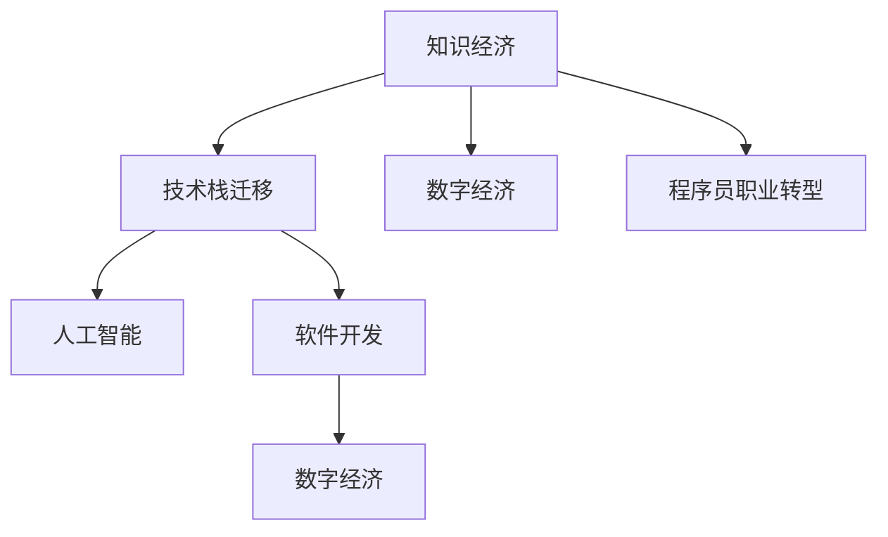

                 

# 知识经济下程序员的职业转型之道

> 关键词：知识经济, 程序员职业转型, 技术栈迁移, 人工智能, 软件开发, 数字经济

## 1. 背景介绍

在数字化、网络化和全球化的浪潮中，知识经济逐渐成为全球经济的新常态。随着信息技术的不断进步和创新，计算机编程和软件开发已经成为了知识经济时代最重要的技能之一。然而，技术的不断发展和市场的快速变化，也对程序员提出了更高的要求。如何在知识经济时代实现职业转型，不断提升自身价值，成为了每个程序员都必须面对的挑战。本文将从职业转型视角出发，探讨知识经济下程序员的转型之道，旨在帮助程序员在技术演进中找到自己的方向。

## 2. 核心概念与联系

### 2.1 核心概念概述

- **知识经济**：以知识和信息为基础的经济形态，知识成为经济增长的主要驱动力。
- **程序员职业转型**：指程序员通过学习新的技术栈、提升技能，实现职业定位和发展方向上的转变。
- **技术栈迁移**：程序员通过学习新的编程语言、框架和工具，实现技术能力的横向拓展。
- **人工智能**：利用机器学习、深度学习等技术实现智能化的解决方案。
- **软件开发**：指通过编程实现软件产品的开发和维护。
- **数字经济**：依托于数字技术驱动的经济形态，包含电子政务、电子商务、数字内容等多个方面。

这些概念之间的逻辑关系可以通过以下Mermaid流程图来展示：



这个流程图展示了一个从知识经济到数字经济的发展脉络，并强调了程序员在这一过程中需要进行职业转型，以适应技术栈的迁移。

## 3. 核心算法原理 & 具体操作步骤

### 3.1 算法原理概述

在知识经济时代，程序员的职业转型主要通过学习新的技术栈来实现。这一过程可以视为一种算法优化，目的是提升程序员的技术能力和市场竞争力。算法原理主要包括以下几个步骤：

1. **需求分析**：明确当前和未来的职业发展目标，确定需要学习的新技术栈。
2. **技术栈选择**：从多种技术栈中选择最适合自身需求和行业趋势的技术栈。
3. **学习规划**：制定详细的学习计划，包括学习资源、时间安排和评估标准。
4. **实践与反馈**：通过实际项目实践和社区反馈，不断优化学习效果。
5. **职业转型**：将学习到的技能应用到新的职业定位和岗位中，实现职业发展。

### 3.2 算法步骤详解

#### 3.2.1 需求分析

需求分析是职业转型的第一步，需要考虑以下几个因素：

- **行业趋势**：了解当前技术趋势和市场需求，选择有前景的技术栈。
- **个人兴趣**：结合个人兴趣和爱好，选择能够长期坚持的技术栈。
- **职业发展**：考虑转型后的职业定位，选择对职业发展有帮助的技术栈。

#### 3.2.2 技术栈选择

技术栈的选择应该综合考虑以下几个方面：

- **稳定性与前景**：选择成熟稳定且具有长期发展前景的技术栈。
- **社区支持与生态**：选择有活跃社区和技术生态支持的技术栈。
- **技术难度与学习曲线**：选择适合自己当前技术水平和学习能力的技术栈。

#### 3.2.3 学习规划

制定详细的学习计划，包括以下几个步骤：

- **学习资源准备**：选择权威的学习资源，包括书籍、在线课程、视频教程等。
- **时间安排**：根据自身时间安排，合理分配学习时间。
- **评估标准**：设定评估标准，如掌握的知识点、完成的项目等，以便于评估学习效果。

#### 3.2.4 实践与反馈

通过实际项目实践和社区反馈，不断优化学习效果：

- **实践项目**：选择有意义的实际项目，进行动手实践，积累经验。
- **社区参与**：参与开源项目和社区讨论，获取反馈和建议。
- **迭代优化**：根据反馈不断调整学习计划和方法，提升学习效果。

#### 3.2.5 职业转型

将学习到的技能应用到新的职业定位和岗位中，实现职业发展：

- **求职转型**：通过简历优化和面试准备，获得新职位。
- **内部转型**：在公司内部申请新的岗位或项目，提升职业竞争力。
- **创业转型**：利用新技能，创办自己的公司或开发产品，实现职业飞跃。

### 3.3 算法优缺点

技术栈迁移算法有以下几个优点：

- **提升技能**：通过学习新的技术栈，提升个人技术能力和竞争力。
- **适应市场**：能够适应技术发展的变化，保持市场竞争力。
- **职业发展**：为职业发展提供新的方向和机会。

但同时也存在一些缺点：

- **学习成本**：需要投入大量时间、精力和金钱进行学习。
- **风险较大**：选择不合适的技术栈可能导致职业转型失败。
- **适应困难**：新技能的学习和应用需要一定的时间和适应期。

### 3.4 算法应用领域

技术栈迁移算法不仅适用于传统的软件开发领域，还广泛应用于以下几个领域：

- **人工智能**：学习深度学习、机器学习等技术，应用到智能推荐、自然语言处理等领域。
- **区块链**：学习区块链开发、智能合约等技术，应用到金融、供应链管理等领域。
- **物联网**：学习传感器、嵌入式开发等技术，应用到智能家居、工业物联网等领域。
- **大数据**：学习Hadoop、Spark等技术，应用到数据分析、数据挖掘等领域。

## 4. 数学模型和公式 & 详细讲解 & 举例说明

### 4.1 数学模型构建

技术栈迁移的数学模型可以表示为：

$$
\text{Transformer}_{\text{new}} = f(\text{Transformer}_{\text{old}}, \text{Transition Matrix})
$$

其中，$\text{Transformer}_{\text{old}}$ 表示当前使用的技术栈，$\text{Transition Matrix}$ 表示从旧技术栈到新技能的学习矩阵。

### 4.2 公式推导过程

在技术栈迁移过程中，可以通过矩阵变换来计算新技能的学习程度。设当前技术栈的知识矩阵为 $K_{\text{old}}$，新技能的知识矩阵为 $K_{\text{new}}$，则学习矩阵 $T$ 可以通过以下公式计算：

$$
T = K_{\text{new}} \times K_{\text{old}}^{-1}
$$

在实际应用中，可以使用矩阵的奇异值分解（SVD）或PCA等方法，对知识矩阵进行降维和简化，从而获得更加高效的学习矩阵。

### 4.3 案例分析与讲解

以人工智能为例，技术栈迁移的案例分析如下：

- **旧技术栈**：Python、NumPy、SciPy等传统数据科学工具。
- **新技术栈**：TensorFlow、PyTorch、Keras等深度学习框架。
- **学习矩阵**：通过分析TensorFlow和PyTorch之间的知识差异，生成一个学习矩阵，指导从Python到深度学习的转型。

## 5. 项目实践：代码实例和详细解释说明

### 5.1 开发环境搭建

在进行技术栈迁移实践前，我们需要准备好开发环境。以下是使用Python进行TensorFlow开发的环境配置流程：

1. 安装Anaconda：从官网下载并安装Anaconda，用于创建独立的Python环境。

2. 创建并激活虚拟环境：
```bash
conda create -n tf-env python=3.8 
conda activate tf-env
```

3. 安装TensorFlow：根据CUDA版本，从官网获取对应的安装命令。例如：
```bash
conda install tensorflow
```

4. 安装各类工具包：
```bash
pip install numpy pandas scikit-learn matplotlib tqdm jupyter notebook ipython
```

完成上述步骤后，即可在`tf-env`环境中开始技术栈迁移实践。

### 5.2 源代码详细实现

这里我们以从Python到TensorFlow的迁移为例，给出TensorFlow代码实现。

首先，定义一个简单的线性回归模型：

```python
import tensorflow as tf

# 定义模型
def linear_model(x, w, b):
    return tf.matmul(x, w) + b

# 创建模型
w = tf.Variable(tf.zeros([1, 1]))
b = tf.Variable(tf.zeros([1]))
x = tf.placeholder(tf.float32, [None, 1])
y = tf.placeholder(tf.float32, [None, 1])

# 定义损失函数
loss = tf.reduce_mean(tf.square(linear_model(x, w, b) - y))

# 定义优化器
optimizer = tf.train.GradientDescentOptimizer(learning_rate=0.01)
train_op = optimizer.minimize(loss)

# 创建会话并运行
with tf.Session() as sess:
    sess.run(tf.global_variables_initializer())
    for i in range(1000):
        sess.run(train_op, feed_dict={x: [2, 4, 6], y: [0, -1, -2]})
```

然后，使用Keras实现一个更高级的深度学习模型：

```python
from tensorflow import keras

# 创建数据集
x = keras.Input(shape=(1,))
y = keras.layers.Dense(1)(x)

# 创建模型
model = keras.Model(inputs=x, outputs=y)

# 编译模型
model.compile(optimizer='adam', loss='mse')

# 训练模型
model.fit(x=[2, 4, 6], y=[0, -1, -2], epochs=10, batch_size=1)
```

### 5.3 代码解读与分析

让我们再详细解读一下关键代码的实现细节：

**linear_model函数**：
- 定义了一个线性模型，输入为二维的张量`x`，输出为二维的张量`y`，参数为权重`w`和偏置`b`。

**模型定义**：
- 定义了一个线性回归模型，使用矩阵乘法和偏置项计算输出。
- 使用`tf.placeholder`创建输入占位符，`tf.Variable`创建权重和偏置变量。

**损失函数**：
- 使用均方误差（MSE）作为损失函数，计算模型输出与真实值之间的差距。

**优化器**：
- 使用梯度下降优化器，设置学习率为0.01。

**训练操作**：
- 定义训练操作`train_op`，用于最小化损失函数。

**会话运行**：
- 使用`tf.Session`创建会话，并初始化变量。
- 通过循环迭代，执行训练操作，每次使用`feed_dict`传入输入和输出数据。

**Keras模型定义**：
- 使用`keras.Input`创建输入张量。
- 使用`keras.layers.Dense`创建全连接层，定义输出。

**模型编译**：
- 使用`model.compile`方法，设置优化器和损失函数。

**模型训练**：
- 使用`model.fit`方法，传入训练数据和标签，设置训练轮数和批次大小。

以上代码展示了从Python到TensorFlow的迁移过程，从线性模型到高级深度学习的实践。可以看到，借助TensorFlow库，程序员可以方便地实现从旧技术栈到新技能的学习。

### 5.4 运行结果展示

运行上述代码，可以得到TensorFlow模型的训练结果，包括损失值和模型参数。通过比较Python和TensorFlow的输出结果，可以验证迁移效果。

## 6. 实际应用场景

### 6.1 智能推荐系统

技术栈迁移在智能推荐系统中的应用，可以显著提升推荐算法的效率和精度。传统推荐系统依赖于复杂的算法和大量的特征工程，而使用深度学习技术栈可以大幅简化算法，提高推荐效果。

在技术实现上，可以将推荐系统分为数据收集、特征工程、模型训练和推荐服务等几个模块。推荐系统可以采用TensorFlow等深度学习框架，从传统的逻辑回归、线性回归等算法迁移到神经网络算法，从而提升推荐精度和效果。

### 6.2 自然语言处理（NLP）

NLP领域的技术栈迁移，可以加速NLP技术的落地应用。传统的NLP技术依赖于规则和模板，而深度学习技术栈可以实现端到端的自动建模，提升NLP任务的性能。

在技术实现上，可以使用PyTorch、TensorFlow等深度学习框架，从传统的基于规则的NLP模型迁移到基于深度学习的模型，如BERT、GPT等。通过迁移学习，可以从预训练模型中获得先验知识，快速提升模型效果。

### 6.3 图像识别和计算机视觉

图像识别和计算机视觉领域的技术栈迁移，可以实现更高级的图像分析和处理。传统的图像处理算法依赖于手工提取特征，而深度学习技术栈可以实现端到端的自动特征学习，提升图像识别的精度和速度。

在技术实现上，可以使用PyTorch、TensorFlow等深度学习框架，从传统的基于手工特征的算法迁移到基于卷积神经网络的算法，如CNN、RNN等。通过迁移学习，可以从预训练模型中获得先验知识，快速提升模型效果。

### 6.4 未来应用展望

随着技术栈的不断演进，未来技术栈迁移将有更多应用场景：

- **区块链技术**：学习区块链开发和智能合约等技术，应用于金融、供应链管理等领域。
- **物联网技术**：学习传感器、嵌入式开发等技术，应用于智能家居、工业物联网等领域。
- **大数据技术**：学习Hadoop、Spark等技术，应用于数据分析、数据挖掘等领域。
- **人工智能**：学习深度学习、机器学习等技术，应用于智能推荐、自然语言处理等领域。

## 7. 工具和资源推荐

### 7.1 学习资源推荐

为了帮助程序员系统掌握技术栈迁移的理论基础和实践技巧，这里推荐一些优质的学习资源：

1. **《深度学习》书籍**：由Ian Goodfellow、Yoshua Bengio和Aaron Courville等知名学者合著，全面介绍了深度学习的基本概念和应用。

2. **Coursera《深度学习》课程**：由Andrew Ng教授讲授，涵盖了深度学习的基本理论和实践技巧，适合初学者和进阶者。

3. **PyTorch官方文档**：提供了详细的PyTorch教程和示例，适合快速上手TensorFlow等深度学习框架。

4. **Kaggle竞赛平台**：提供了大量实战项目和数据集，适合通过实际项目实践技术栈迁移。

5. **GitHub开源项目**：提供了大量开源项目和代码示例，适合学习和借鉴。

通过对这些资源的学习实践，相信你一定能够快速掌握技术栈迁移的精髓，并用于解决实际的NLP问题。

### 7.2 开发工具推荐

高效的开发离不开优秀的工具支持。以下是几款用于技术栈迁移开发的常用工具：

1. **PyTorch**：基于Python的开源深度学习框架，灵活动态的计算图，适合快速迭代研究。大部分预训练语言模型都有PyTorch版本的实现。

2. **TensorFlow**：由Google主导开发的开源深度学习框架，生产部署方便，适合大规模工程应用。同样有丰富的预训练语言模型资源。

3. **Jupyter Notebook**：交互式的开发环境，支持多语言混合编程，适合快速迭代和共享代码。

4. **Git**：版本控制系统，支持团队协作和代码管理，适合复杂项目开发。

5. **Docker**：容器化技术，支持快速部署和管理，适合分布式系统开发。

合理利用这些工具，可以显著提升技术栈迁移任务的开发效率，加快创新迭代的步伐。

### 7.3 相关论文推荐

技术栈迁移的技术发展源于学界的持续研究。以下是几篇奠基性的相关论文，推荐阅读：

1. **《Neural Network Architectures for Named Entity Recognition》**：提出了LSTM-CRF等深度学习模型，应用于实体识别任务。

2. **《Attention is All You Need》**：提出了Transformer结构，开启了NLP领域的预训练大模型时代。

3. **《A Survey on Deep Learning for NLP》**：综述了深度学习在NLP领域的应用，包括迁移学习和端到端学习等技术。

4. **《Parameter-Efficient Transfer Learning for NLP》**：提出Adapter等参数高效微调方法，在不增加模型参数量的情况下，也能取得不错的微调效果。

5. **《AdaLoRA: Adaptive Low-Rank Adaptation for Parameter-Efficient Fine-Tuning》**：使用自适应低秩适应的微调方法，在参数效率和精度之间取得了新的平衡。

这些论文代表了大语言模型微调技术的发展脉络。通过学习这些前沿成果，可以帮助研究者把握学科前进方向，激发更多的创新灵感。

## 8. 总结：未来发展趋势与挑战

### 8.1 研究成果总结

本文对技术栈迁移的职业转型方法进行了全面系统的介绍。首先阐述了技术栈迁移在知识经济时代的重要性和必要性，明确了技术栈迁移的算法原理和具体操作步骤。其次，从数学模型和代码实例等角度，详细讲解了技术栈迁移的实现过程，并通过实际应用场景展示了技术栈迁移的广泛应用。最后，精选了技术栈迁移的学习资源和工具，力求为读者提供全方位的技术指引。

通过本文的系统梳理，可以看到，技术栈迁移为程序员提供了职业发展的全新路径，通过学习新技能，提升了自身的市场竞争力和职业发展空间。未来，伴随技术的不断进步和应用场景的不断扩展，技术栈迁移必将在更广泛的领域得到应用，为程序员带来更多的职业机遇和发展空间。

### 8.2 未来发展趋势

展望未来，技术栈迁移将呈现以下几个发展趋势：

1. **技术栈多样化**：随着技术的不断演进，未来程序员需要掌握多种技术栈，以适应不同领域和应用场景。
2. **自动化与智能化**：未来技术栈迁移将更多地依赖于自动化工具和智能化平台，减少人工干预，提高迁移效率。
3. **跨领域融合**：技术栈迁移将更多地涉及跨领域融合，如AI与区块链、IoT与大数据等，实现更全面的技术能力。
4. **云计算与边缘计算**：云计算和边缘计算技术的普及，将使技术栈迁移更加便捷和高效。
5. **开源与社区贡献**：未来技术栈迁移将更多地依赖于开源社区和开源工具，程序员可以通过贡献代码和参与社区，不断提升自己的技术水平和职业竞争力。

### 8.3 面临的挑战

尽管技术栈迁移技术已经取得了显著进展，但在迈向更加智能化、普适化应用的过程中，它仍面临诸多挑战：

1. **学习成本高**：新技能的掌握需要大量的时间和精力，对于在职程序员来说，学习成本较高。
2. **技能差异大**：不同技术栈之间的技能差异较大，跨领域迁移存在一定的难度。
3. **市场变化快**：技术栈迁移需要适应市场快速变化的需求，具有较高的风险。
4. **资源限制多**：技术栈迁移需要大量的计算资源和数据资源，对企业或个人来说，资源限制较多。
5. **知识更新快**：技术栈迁移需要不断更新知识，保持与行业前沿的同步。

### 8.4 研究展望

面对技术栈迁移面临的诸多挑战，未来的研究需要在以下几个方面寻求新的突破：

1. **自适应学习算法**：开发能够自适应学习技术栈迁移的算法，减少学习成本，提高迁移效率。
2. **跨领域迁移工具**：开发能够跨领域迁移的技能迁移工具，降低技能差异带来的迁移难度。
3. **混合学习框架**：开发混合学习框架，结合深度学习和传统算法的优势，提升迁移效果。
4. **智能化迁移平台**：开发智能化迁移平台，提供自动化的迁移服务和社区支持，降低迁移风险。
5. **开源资源整合**：整合开源资源，提供丰富的学习材料和工具支持，促进技术栈迁移的普及和应用。

这些研究方向的探索，必将引领技术栈迁移技术迈向更高的台阶，为程序员提供更广泛的技术选择和发展路径，实现职业发展的全面提升。面向未来，技术栈迁移需要与其他人工智能技术进行更深入的融合，如知识表示、因果推理、强化学习等，多路径协同发力，共同推动自然语言理解和智能交互系统的进步。只有勇于创新、敢于突破，才能不断拓展技术栈的边界，让程序员在知识经济时代焕发新的活力。

## 9. 附录：常见问题与解答

**Q1：技术栈迁移需要多长时间？**

A: 技术栈迁移的时间取决于多种因素，如个人技术水平、学习目标、工作量等。一般来说，学习新技术需要2-6个月的时间，实际迁移周期可能更长。

**Q2：技术栈迁移有哪些风险？**

A: 技术栈迁移的风险主要包括：
1. **学习成本高**：新技能的掌握需要大量时间和精力，对于在职程序员来说，可能影响工作进度和绩效。
2. **技能差异大**：不同技术栈之间的技能差异较大，跨领域迁移存在一定的难度。
3. **市场变化快**：技术栈迁移需要适应市场快速变化的需求，具有较高的风险。
4. **资源限制多**：技术栈迁移需要大量的计算资源和数据资源，对企业或个人来说，资源限制较多。
5. **知识更新快**：技术栈迁移需要不断更新知识，保持与行业前沿的同步。

**Q3：技术栈迁移有哪些工具和方法？**

A: 技术栈迁移的主要工具和方法包括：
1. **在线课程和教程**：如Coursera、Udemy等平台提供大量的在线课程和教程，适合学习新技能。
2. **开源项目和代码库**：如GitHub、GitLab等平台提供丰富的开源项目和代码库，适合学习和借鉴。
3. **社区和技术论坛**：如Stack Overflow、GitHub等社区和技术论坛，适合交流和讨论。
4. **开发工具和框架**：如PyTorch、TensorFlow等深度学习框架，适合实践和部署。

**Q4：技术栈迁移有哪些案例？**

A: 技术栈迁移的案例包括：
1. **从Java迁移到Python**：通过学习Python语言和相关库，实现从Java到Python的技术栈迁移。
2. **从PHP迁移到Go**：通过学习Go语言和相关框架，实现从PHP到Go的技术栈迁移。
3. **从C++迁移到Rust**：通过学习Rust语言和相关工具，实现从C++到Rust的技术栈迁移。
4. **从SQL迁移到NoSQL**：通过学习NoSQL数据库和相关工具，实现从SQL到NoSQL的技术栈迁移。

通过这些案例，可以看到技术栈迁移的广泛应用和实际效果。

---

作者：禅与计算机程序设计艺术 / Zen and the Art of Computer Programming

