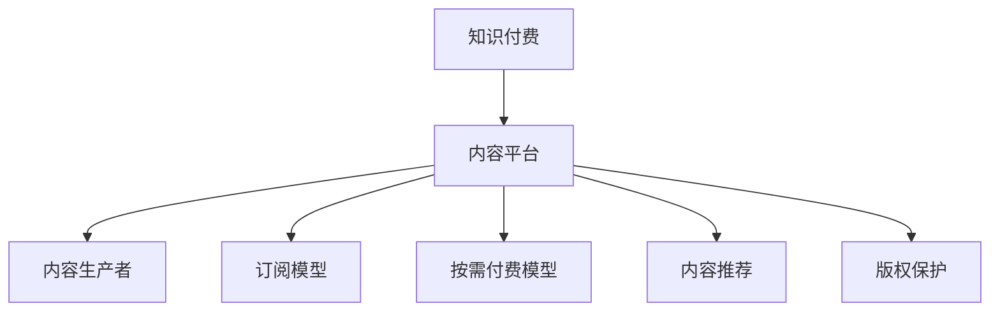

                 

# 知识经济时代下的知识付费创业机会与挑战

## 1. 背景介绍

### 1.1 问题由来
随着互联网和移动互联网的普及，全球进入知识经济时代。数字化、信息化技术使得知识的获取、传播和应用变得更加高效便捷。与此同时，知识付费成为一种新兴商业模式，以知识、技能、经验等为核心内容，通过在线订阅、付费咨询、课程教学等方式，为消费者提供价值导向的知识服务。这一趋势不仅颠覆了传统内容分发方式，也催生了大量基于知识付费的创业机会。

### 1.2 问题核心关键点
知识付费的核心在于将知识转化为可消费、可交易的产品或服务，满足用户个性化、专业化的知识需求。关键点包括：

- **内容生产**：高质量内容的持续产出，需要集合专家、学者、行业从业者等群体，进行专业内容创作。
- **平台运营**：建设稳定、易用的平台，提供内容分发、用户互动、支付结算等功能，实现高效运营。
- **技术支撑**：利用AI、大数据、区块链等技术，提升内容推荐、用户行为分析、版权保护等环节的效率和安全性。
- **商业模式**：构建合理、透明的收费模式，吸引用户订阅、购买，实现可持续发展。

### 1.3 问题研究意义
知识付费不仅仅是一种商业模式，更是推动知识共享、促进知识传播的重要途径。其研究意义在于：

1. **促进知识共享**：打破信息孤岛，促进各类知识资源的高效流动和传播，激发社会创新活力。
2. **提升用户价值**：通过定制化的知识服务，帮助用户获得专业、高效的解决方案，提升个人和组织能力。
3. **推动教育公平**：为经济条件较差、信息获取不便的用户提供优质的教育资源，缩小数字鸿沟。
4. **促进产业升级**：驱动相关行业如教育、咨询、媒体、出版等产业的数字化转型，推动经济结构优化。
5. **激发创新创业**：激发更多创业者进入知识付费领域，探索知识服务的新模式、新业态。

## 2. 核心概念与联系

### 2.1 核心概念概述

为更好地理解知识付费的商业模式和技术实现，本节将介绍几个关键概念：

- **知识付费**：一种新兴的商业模式，以知识、技能、经验等为核心内容，通过在线订阅、付费咨询、课程教学等方式，为消费者提供价值导向的知识服务。
- **内容平台**：为知识付费内容提供发布、分发、管理的平台，典型如Coursera、Udemy、知乎等。
- **知识生产者**：参与知识内容创作的专业人士，如教授、专家、行业从业者等。
- **订阅模型**：用户定期支付固定费用，获取平台上的所有内容。
- **按需付费模型**：用户按需购买单个内容，如课程、文章等。
- **内容推荐**：利用AI算法，根据用户兴趣和行为，自动推荐相关内容。
- **版权保护**：通过区块链等技术手段，保障知识内容的知识产权和用户隐私安全。

这些概念之间的逻辑关系可以通过以下Mermaid流程图来展示：



这个流程图展示的知识付费的核心概念及其之间的关系：

1. 知识付费依赖于内容平台的搭建和运营。
2. 内容生产者通过平台发布知识内容。
3. 用户选择不同的付费模型获取内容。
4. 平台利用推荐算法为用户提供个性化的内容。
5. 平台采用技术手段保护内容版权和用户隐私。

## 3. 核心算法原理 & 具体操作步骤
### 3.1 算法原理概述

知识付费平台的核心算法围绕内容推荐、用户行为分析、支付结算等环节展开。其基本原理如下：

- **内容推荐算法**：根据用户历史行为和兴趣，利用协同过滤、深度学习等技术，推荐最适合的内容，提升用户满意度和留存率。
- **用户行为分析算法**：通过统计分析、机器学习等技术，挖掘用户行为特征，为个性化推荐和运营优化提供依据。
- **支付结算算法**：采用安全的支付网关和区块链技术，保障交易的透明和可信，提升用户信任度。

### 3.2 算法步骤详解

知识付费平台的算法实现包括以下几个关键步骤：

**Step 1: 数据采集和预处理**

- 收集用户注册信息、浏览记录、购买记录等数据。
- 清洗和处理数据，去除噪声和异常值，确保数据质量。
- 使用特征工程技术，提取关键特征，如兴趣标签、行为习惯、支付记录等。

**Step 2: 推荐算法设计**

- 选择合适的推荐算法，如协同过滤、基于内容的推荐、矩阵分解等。
- 设计推荐系统架构，包括数据存储、特征处理、模型训练、推荐输出等模块。
- 设计评估指标，如准确率、召回率、点击率等，用于评估推荐系统效果。

**Step 3: 用户行为分析**

- 利用统计分析、机器学习技术，挖掘用户行为特征，如浏览时长、点击率、购买频率等。
- 使用模型预测用户行为变化趋势，为内容优化和推荐策略调整提供依据。
- 建立用户画像，了解用户的基本特征和兴趣偏好，提高个性化推荐精准度。

**Step 4: 支付结算算法实现**

- 与第三方支付平台合作，集成支付接口，支持多种支付方式。
- 采用区块链技术，保障交易数据的安全性和不可篡改性。
- 设计结算算法，确保交易过程的透明和可信，提升用户信任度。

### 3.3 算法优缺点

知识付费平台的算法实现具有以下优点：

1. **提升用户体验**：通过个性化推荐，使用户获得更多有价值的内容，提升用户满意度和粘性。
2. **提高运营效率**：利用机器学习算法，自动化处理用户行为数据，减少人工操作。
3. **保障交易安全**：采用区块链技术，确保交易数据的安全性和不可篡改性，提升用户信任度。
4. **推动内容创新**：通过数据分析，了解用户需求和偏好，引导内容生产者创作更多符合市场导向的内容。

同时，算法实现也存在一定的局限性：

1. **数据依赖**：算法效果依赖于高质量、完整的用户行为数据，数据不足或质量不高将影响推荐效果。
2. **算法复杂**：高级算法如深度学习需要高性能计算资源，成本较高。
3. **隐私风险**：用户行为数据的采集和使用可能涉及隐私问题，需注意数据保护。
4. **市场竞争**：平台之间竞争激烈，算法优化需要不断迭代和更新。

### 3.4 算法应用领域

知识付费平台的算法技术已经广泛应用于各种领域，包括但不限于：

- **在线教育**：如Coursera、Udemy、网易云课堂等，提供各类课程和证书，帮助用户学习新知识。
- **专业咨询**：如知乎、微信公众号、专家咨询平台，提供个性化咨询服务，解答用户专业问题。
- **内容创作**：如知乎、Medium、简书，鼓励用户创作原创内容，分享知识和经验。
- **企业培训**：如网易云课堂企业版、MBA智库，为企业员工提供专业培训，提升职业技能。
- **智能推荐**：如亚马逊、Netflix，利用推荐算法提升用户购物和观影体验。

除了上述这些经典领域外，知识付费平台还在金融、健康、旅行、技术等诸多领域持续探索，推动知识服务的普及和深入应用。

## 4. 数学模型和公式 & 详细讲解 & 举例说明

### 4.1 数学模型构建

知识付费平台的推荐系统通常基于协同过滤或深度学习算法构建。这里以协同过滤为例，介绍推荐系统的数学模型构建过程。

设用户集合为 $U$，物品集合为 $I$，用户对物品的评分矩阵为 $R \in \mathbb{R}^{n \times m}$，其中 $n$ 为用户数量，$m$ 为物品数量。推荐系统目标是为每个用户推荐评分较高的物品。

协同过滤算法基于用户相似度和物品相似度，计算用户对未评分物品的评分预测。其基本思路如下：

1. 计算用户间的相似度矩阵 $S \in \mathbb{R}^{n \times n}$，基于用户历史评分计算相似度。
2. 计算物品间的相似度矩阵 $T \in \mathbb{R}^{m \times m}$，基于物品历史评分计算相似度。
3. 利用相似度矩阵，计算用户对未评分物品的评分预测。
4. 根据评分预测结果，对物品进行排序，推荐评分较高的物品。

### 4.2 公式推导过程

设用户 $u$ 对物品 $i$ 的评分矩阵为 $R_u \in \mathbb{R}^{m}$，计算用户 $u$ 和用户 $v$ 的相似度 $S_{uv}$ 和物品 $i$ 和物品 $j$ 的相似度 $T_{ij}$。

**用户相似度计算**：
$$
S_{uv} = \frac{\sum_{k=1}^m R_{uk} R_{vk}}{\sqrt{\sum_{k=1}^m R_{uk}^2} \sqrt{\sum_{k=1}^m R_{vk}^2}}
$$

**物品相似度计算**：
$$
T_{ij} = \frac{\sum_{k=1}^n R_{ik} R_{jk}}{\sqrt{\sum_{k=1}^n R_{ik}^2} \sqrt{\sum_{k=1}^n R_{jk}^2}}
$$

**评分预测**：
$$
\hat{R}_{ui} = \sum_{v=1}^n S_{uv} R_{vi}
$$

**推荐排序**：
$$
\text{推荐列表} = \text{物品集合} \times \text{评分预测结果} \times \text{排序策略}
$$

### 4.3 案例分析与讲解

**案例分析**：以知乎平台为例，展示知识付费平台的内容推荐和用户行为分析算法应用。

知乎平台利用协同过滤算法，基于用户历史阅读和回答行为，推荐可能感兴趣的文章和问题。通过分析用户行为数据，发现不同类型用户（如专家、学生、从业者等）的阅读偏好和互动行为差异，为个性化推荐策略提供依据。

知乎平台还采用深度学习算法，对用户阅读习惯、关注领域等进行特征提取和预测，提升推荐系统的准确率和多样性。通过引入实时流量监控和用户行为预测，动态调整推荐算法参数，确保推荐内容的时效性和相关性。

## 5. 项目实践：代码实例和详细解释说明

### 5.1 开发环境搭建

在进行知识付费平台的开发前，我们需要准备好开发环境。以下是使用Python进行Flask开发的环境配置流程：

1. 安装Anaconda：从官网下载并安装Anaconda，用于创建独立的Python环境。

2. 创建并激活虚拟环境：
```bash
conda create -n flask-env python=3.8 
conda activate flask-env
```

3. 安装Flask：使用pip安装Flask框架。
```bash
pip install Flask
```

4. 安装Flask-RESTful：用于实现RESTful风格的API接口。
```bash
pip install Flask-RESTful
```

5. 安装相关依赖库：
```bash
pip install requests pandas numpy scikit-learn
```

完成上述步骤后，即可在`flask-env`环境中开始知识付费平台的开发。

### 5.2 源代码详细实现

这里以知乎平台为例，展示知识付费平台的内容推荐和用户行为分析代码实现。

**用户相似度计算**：

```python
def user_similarity(u, v):
    user_ratings = [item_ratings[u] for item in items]
    v_ratings = [item_ratings[v] for item in items]
    return np.dot(user_ratings, v_ratings) / (np.linalg.norm(user_ratings) * np.linalg.norm(v_ratings))

def item_similarity(i, j):
    user_ratings = [user_ratings[i] for user in users]
    j_ratings = [user_ratings[j] for user in users]
    return np.dot(user_ratings, j_ratings) / (np.linalg.norm(user_ratings) * np.linalg.norm(j_ratings))
```

**评分预测**：

```python
def predict_score(u, i):
    similarity = 0
    for v in users:
        if v != u:
            similarity += user_similarity(u, v) * item_similarity(v, i)
    return similarity / np.linalg.norm(user_ratings[u])
```

**推荐列表生成**：

```python
def generate_recommendations(u):
    scores = {}
    for i in items:
        scores[i] = predict_score(u, i)
    return sorted(scores, key=scores.get, reverse=True)
```

**用户行为分析**：

```python
def analyze_user_behavior(u):
    behavior = {}
    for item in items:
        if u in item_ratings:
            behavior[item] = item_ratings[u]
    return behavior
```

### 5.3 代码解读与分析

**用户相似度计算**：
- 计算用户 $u$ 和 $v$ 的相似度 $S_{uv}$，基于用户对物品的历史评分，计算两个用户间的相似度。
- 计算物品 $i$ 和 $j$ 的相似度 $T_{ij}$，基于物品的历史评分，计算两个物品间的相似度。

**评分预测**：
- 利用用户相似度和物品相似度，计算用户 $u$ 对物品 $i$ 的评分预测 $\hat{R}_{ui}$，推荐评分较高的物品。

**推荐列表生成**：
- 根据评分预测结果，对物品进行排序，生成推荐列表。

**用户行为分析**：
- 分析用户 $u$ 的行为数据，了解其对物品的偏好和互动模式。

## 6. 实际应用场景

### 6.1 在线教育平台

在线教育平台如Coursera、Udemy、网易云课堂等，通过知识付费模式，为学习者提供高质量的教育资源，满足其学习需求。平台利用推荐算法，根据用户的学习历史和行为数据，推荐适合的课程和教材，提升学习效果。

**具体场景**：
- 用户注册账号后，选择感兴趣的课程进行订阅或购买。
- 平台通过分析用户的学习数据，推荐相关课程和资料。
- 课程内容包括视频、PPT、作业、考试等，提供完整的教学体系。
- 用户在学习过程中，可以实时提问和互动，获得专业解答和支持。

### 6.2 专业咨询平台

专业咨询平台如知乎、微信公众号、专家咨询平台，为用户提供个性化的咨询服务，解答专业问题，帮助用户解决实际问题。平台利用推荐算法，根据用户的提问历史和行为数据，推荐相关问题和专家。

**具体场景**：
- 用户提出问题，平台推荐相关领域的专业专家进行回答。
- 专家根据用户需求提供个性化的解答和建议。
- 平台集成视频、语音、文字等多种交流方式，提升用户体验。
- 用户对专家的回答进行评价和反馈，推动平台优化和改进。

### 6.3 内容创作平台

内容创作平台如知乎、Medium、简书，鼓励用户创作原创内容，分享知识和经验，提供丰富的阅读和创作平台。平台利用推荐算法，根据用户的阅读历史和行为数据，推荐相关文章和作者。

**具体场景**：
- 用户关注感兴趣的作者和话题，获取最新的文章和更新。
- 平台通过分析用户的阅读行为，推荐高质量的原创内容。
- 用户可以评论和互动，与作者进行交流和讨论。
- 平台提供广告和付费阅读功能，增强平台的商业化能力。

### 6.4 企业培训平台

企业培训平台如网易云课堂企业版、MBA智库，为企业的员工提供专业培训，提升职业技能和素质。平台利用推荐算法，根据员工的学习历史和行为数据，推荐适合的课程和培训资源。

**具体场景**：
- 企业选择培训课程，员工通过平台进行在线学习和考核。
- 平台通过分析员工的学习数据，推荐适合的课程和资料。
- 平台集成视频、PPT、作业、考试等教学资源，提供完整的培训体系。
- 员工在培训过程中，可以实时提问和互动，获得专业解答和支持。

### 6.5 智能推荐系统

智能推荐系统如亚马逊、Netflix，利用推荐算法，提升用户购物和观影体验。平台利用协同过滤、深度学习等技术，推荐用户可能感兴趣的商品和内容，提升用户满意度和留存率。

**具体场景**：
- 用户注册账号后，选择感兴趣的商品或内容进行订阅或购买。
- 平台通过分析用户的历史行为和偏好，推荐相关商品或内容。
- 商品内容包括商品描述、用户评价、销量等，提供全面的商品信息。
- 用户可以实时浏览和购买商品，享受便捷的购物体验。

## 7. 工具和资源推荐

### 7.1 学习资源推荐

为了帮助开发者系统掌握知识付费的商业模式和技术实现，这里推荐一些优质的学习资源：

1. **《知识付费：商业模式与技术实践》**：系统讲解知识付费的商业模式和关键技术，涵盖内容分发、推荐算法、支付结算等环节。
2. **《Python Flask Web开发实战》**：详细介绍如何使用Python Flask开发知识付费平台，涵盖API接口设计、用户管理、推荐算法等。
3. **《深度学习推荐系统》**：深入讲解推荐系统的前沿技术和算法实现，涵盖协同过滤、深度学习等。
4. **Coursera、Udemy课程**：提供在线课程，涵盖机器学习、数据挖掘、推荐系统等领域的知识和实践。
5. **知乎、Medium、简书**：作为知识付费平台的典型案例，可以了解平台的运营模式和用户体验。

通过对这些资源的学习实践，相信你一定能够快速掌握知识付费的精髓，并用于解决实际的商业问题。

### 7.2 开发工具推荐

高效的开发离不开优秀的工具支持。以下是几款用于知识付费平台开发的常用工具：

1. **Flask**：轻量级的Web开发框架，简单易用，适合快速开发和迭代。
2. **RESTful**：用于实现RESTful风格的API接口，方便前后端数据交互。
3. **Python**：强大的编程语言，具有丰富的第三方库和工具支持。
4. **Jupyter Notebook**：交互式编程环境，适合数据分析和算法实验。
5. **TensorBoard**：用于可视化模型训练和优化过程，提升模型开发效率。

合理利用这些工具，可以显著提升知识付费平台的开发效率，加快创新迭代的步伐。

### 7.3 相关论文推荐

知识付费平台的理论研究和实践探索正在不断深入。以下是几篇奠基性的相关论文，推荐阅读：

1. **《推荐系统：原理与算法》**：全面介绍推荐系统的基本原理和算法实现，涵盖协同过滤、深度学习、混合推荐等。
2. **《知识付费：一个多学科视角》**：从社会学、心理学、经济学等多学科角度，探讨知识付费的商业模式和用户行为。
3. **《基于深度学习的个性化推荐》**：探讨深度学习在个性化推荐中的应用，提升推荐系统的精度和效率。
4. **《用户行为分析：理论与实践》**：深入研究用户行为分析的理论和技术，为个性化推荐提供依据。
5. **《知识付费平台的用户体验设计》**：探讨知识付费平台的用户体验设计，提升平台的用户留存率和满意度。

这些论文代表了大数据推荐系统的研究脉络。通过学习这些前沿成果，可以帮助研究者把握学科前进方向，激发更多的创新灵感。

## 8. 总结：未来发展趋势与挑战

### 8.1 总结

本文对知识付费的商业模式和技术实现进行了全面系统的介绍。首先阐述了知识付费的发展背景和核心关键点，明确了平台搭建和运营的重要性。其次，从原理到实践，详细讲解了知识付费平台的推荐算法和用户行为分析技术，给出了推荐系统开发的完整代码实例。同时，本文还广泛探讨了知识付费平台在教育、咨询、创作、培训等各个领域的应用前景，展示了知识付费技术的广阔前景。此外，本文精选了知识付费平台的各类学习资源，力求为读者提供全方位的技术指引。

通过本文的系统梳理，可以看到，知识付费平台的推荐算法和用户行为分析技术正在成为行业的重要范式，极大地提升了内容分发效率和用户体验。未来，伴随技术的不断演进，知识付费平台必将在更多领域得到应用，为知识的传播和应用带来新的变革。

### 8.2 未来发展趋势

展望未来，知识付费平台的发展趋势包括：

1. **智能化推荐**：利用AI技术，提升推荐系统的准确性和个性化程度，满足用户多样化需求。
2. **多模态融合**：结合文本、图像、语音等多模态数据，提供更加丰富和全面的知识服务。
3. **社会化推荐**：引入社会网络分析技术，利用用户间的信任和关系，提升推荐系统的可信度。
4. **动态推荐**：基于实时数据和行为，进行动态推荐，提升内容的实效性和相关性。
5. **用户互动**：增强用户间的互动和交流，提升平台粘性和社区氛围。
6. **隐私保护**：采用数据匿名化和加密技术，保障用户隐私和数据安全。

这些趋势将推动知识付费平台向智能化、个性化、多样化方向发展，为用户带来更加优质的知识服务。

### 8.3 面临的挑战

尽管知识付费平台已经取得了显著成效，但在迈向更加智能化、普适化应用的过程中，仍面临诸多挑战：

1. **数据依赖**：平台依赖高质量、完整的用户行为数据，数据不足或质量不高将影响推荐效果。
2. **算法复杂**：高级算法如深度学习需要高性能计算资源，成本较高。
3. **隐私风险**：用户行为数据的采集和使用可能涉及隐私问题，需注意数据保护。
4. **市场竞争**：平台之间竞争激烈，算法优化需要不断迭代和更新。
5. **用户体验**：如何提供丰富多样的内容，提升用户满意度和留存率，仍是一个挑战。
6. **商业模式**：如何平衡用户需求和平台收益，实现可持续发展，是关键问题。

解决这些挑战，需要技术、商业、运营等多方面的协同努力。只有不断优化平台算法和运营策略，才能实现知识付费平台的长期稳定发展。

### 8.4 研究展望

面对知识付费平台所面临的挑战，未来的研究需要在以下几个方面寻求新的突破：

1. **无监督学习**：探索无监督学习技术，利用非结构化数据，降低对标注数据的依赖，提升推荐系统的泛化能力。
2. **用户画像**：通过深度学习和数据挖掘技术，建立全面的用户画像，了解用户需求和行为，提升个性化推荐精准度。
3. **多模态融合**：结合文本、图像、语音等多模态数据，提供更加丰富和全面的知识服务，提升用户体验。
4. **隐私保护**：采用隐私保护技术，如差分隐私、数据匿名化，保障用户隐私和数据安全，增强用户信任。
5. **社会化推荐**：引入社会网络分析技术，利用用户间的信任和关系，提升推荐系统的可信度和用户粘性。
6. **推荐系统评估**：建立全面的推荐系统评估指标，如召回率、覆盖率、多样性等，推动推荐算法优化。

这些研究方向的探索，必将引领知识付费平台技术向更高的台阶，为用户带来更加优质和便捷的知识服务。

## 9. 附录：常见问题与解答

**Q1：知识付费平台的推荐算法有哪些？**

A: 知识付费平台的推荐算法主要包括以下几种：

1. **协同过滤**：基于用户历史行为数据，计算用户和物品之间的相似度，进行推荐。
2. **基于内容的推荐**：根据物品的属性特征，推荐与用户兴趣相关的物品。
3. **深度学习推荐**：利用神经网络模型，学习用户行为和物品特征，进行推荐。
4. **混合推荐**：结合多种推荐算法，提升推荐系统的综合性能。

这些算法各有优缺点，适用于不同的应用场景。

**Q2：知识付费平台如何处理数据隐私问题？**

A: 知识付费平台在处理用户数据时，需要注意以下几个方面：

1. **数据匿名化**：对用户数据进行匿名化处理，去除敏感信息，保障用户隐私。
2. **数据加密**：对用户数据进行加密存储和传输，防止数据泄露和篡改。
3. **隐私政策**：制定明确的隐私政策，告知用户数据使用范围，保障用户知情权。
4. **数据访问控制**：采用严格的访问控制机制，确保只有授权人员才能访问敏感数据。
5. **数据审计**：定期审计数据使用情况，防止数据滥用和泄漏。

通过以上措施，可以有效保障用户隐私和数据安全，增强用户信任度。

**Q3：知识付费平台的推荐系统如何优化？**

A: 知识付费平台的推荐系统优化可以从以下几个方面入手：

1. **算法改进**：采用先进的推荐算法，如深度学习、协同过滤等，提升推荐系统的准确性和个性化程度。
2. **数据挖掘**：利用数据挖掘技术，深入挖掘用户行为数据，提取关键特征，提升推荐效果。
3. **模型训练**：采用高效的模型训练方法，如分布式训练、增量学习等，加快模型训练速度。
4. **用户反馈**：收集用户反馈，根据用户的评价和互动，调整推荐策略，提升用户体验。
5. **多样性控制**：控制推荐结果的多样性，防止过度推荐，提升推荐系统的丰富性。
6. **实时优化**：基于实时数据，进行动态调整和优化，确保推荐内容的时效性和相关性。

通过这些优化措施，可以不断提升知识付费平台的推荐系统效果，满足用户多样化需求。

---

作者：禅与计算机程序设计艺术 / Zen and the Art of Computer Programming

