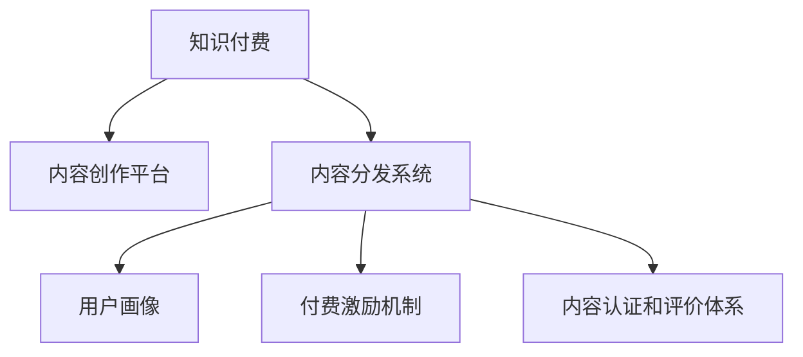

                 

# 知识经济时代下的知识付费创新商业模式运营

## 1. 背景介绍

### 1.1 问题由来

随着互联网和信息技术的飞速发展，知识的获取和传播方式发生了深刻变化。传统的教育方式和信息获取途径不再能够满足人们日益增长的知识需求。在知识经济时代，知识成为最宝贵的资产，如何有效生产和分发知识，成为了一个亟待解决的问题。知识付费模式应运而生，旨在通过收费机制激励高质量内容的生产和传播，促进知识经济的健康发展。

### 1.2 问题核心关键点

知识付费模式的核心关键点在于：如何通过付费机制，激励优质内容创作者，并吸引用户支付费用以获取有价值的知识。这需要解决以下几个问题：
- 如何识别和认证优质内容创作者？
- 如何让用户愿意支付费用？
- 如何保障内容的优质和价值？
- 如何高效分发和推荐知识内容？

### 1.3 问题研究意义

研究知识付费模式的创新商业模式运营，对于推动知识经济的繁荣，促进教育和知识的普惠化具有重要意义：

1. **激励优质内容创作**：通过付费机制，激发创作者的生产积极性，产出更多高质量的知识内容。
2. **提高知识传播效率**：建立高效的内容分发和推荐系统，帮助用户快速找到感兴趣的知识内容。
3. **促进教育公平**：打破地域和时间限制，使更多人能够获取优质教育资源，缩小知识鸿沟。
4. **推动产业升级**：通过知识付费模式，引导资金和资源向知识产业集中，加速产业转型升级。
5. **保障知识价值**：通过认证和评价机制，保障知识内容的真实可靠，提升用户信任度。

## 2. 核心概念与联系

### 2.1 核心概念概述

为更好地理解知识付费模式的创新商业模式运营，本节将介绍几个密切相关的核心概念：

- **知识付费**：指用户为获取优质知识内容而支付费用的模式，旨在激励高质量内容的生产和传播，推动知识经济的发展。
- **内容创作平台**：指提供内容创作和分发服务的平台，如知乎、得到、喜马拉雅等。
- **内容分发系统**：指用于推荐和分发内容的技术系统，如推荐算法、内容检索等。
- **用户画像**：指通过用户行为数据构建的用户特征模型，用于个性化推荐。
- **付费激励机制**：指通过积分、会员、订阅等方式，激励用户消费的内容付费策略。
- **内容认证和评价体系**：指用于识别和评价优质内容的系统，如KOL认证、用户评分、专业评审等。

这些核心概念之间的逻辑关系可以通过以下Mermaid流程图来展示：



这个流程图展示出知识付费模式的运行机制：

1. 知识付费作为整个商业模式的核心驱动力，吸引用户和创作者参与。
2. 内容创作平台提供内容创作工具和分发渠道。
3. 内容分发系统利用推荐算法和检索技术，实现高效内容推荐。
4. 用户画像技术用于分析用户行为，生成个性化推荐。
5. 付费激励机制激发用户消费，保障内容创作者的经济回报。
6. 内容认证和评价体系识别优质内容，提升用户信任度。

这些核心概念共同构成了知识付费模式的运作框架，帮助平台实现优质内容的产出和传播。

## 3. 核心算法原理 & 具体操作步骤
### 3.1 算法原理概述

知识付费模式的创新商业模式运营，涉及到多个核心算法和操作步骤。本文将重点介绍其中几个关键部分：

1. **内容推荐算法**：用于根据用户行为和兴趣，推荐可能感兴趣的内容。常见算法包括协同过滤、基于内容的推荐、深度学习推荐等。
2. **用户画像生成算法**：通过分析用户的行为数据和交互历史，构建用户画像。常用的方法包括聚类分析、序列建模、多维标签嵌入等。
3. **付费激励机制设计**：设计激励机制，如积分系统、会员制、订阅模式等，激励用户消费。
4. **内容认证和评价算法**：用于识别和评价优质内容，提升用户信任度。常见的算法包括专家评审、用户评分、知识图谱等。

### 3.2 算法步骤详解

**步骤1: 准备数据和环境**

- 收集和整理用户行为数据，如浏览记录、购买记录、评论等。
- 搭建推荐系统和内容创作平台，确保平台的技术架构能够支持高效的推荐和内容分发。
- 选择合适的算法框架和工具，如TensorFlow、PyTorch、Scikit-learn等。

**步骤2: 构建用户画像**

- 对用户行为数据进行清洗和预处理，去除噪音和无关信息。
- 使用序列建模方法，如LSTM、GRU等，提取用户行为的时间序列特征。
- 利用聚类分析算法，如K-Means、层次聚类等，将用户分组，构建用户画像。

**步骤3: 设计付费激励机制**

- 根据平台特点和用户需求，设计付费激励机制，如积分系统、会员制、订阅模式等。
- 设定激励机制的参数，如积分获取规则、会员特权等。
- 对激励机制进行A/B测试，优化用户体验和平台收益。

**步骤4: 实施内容推荐**

- 选择推荐算法，如协同过滤、基于内容的推荐、深度学习推荐等。
- 对推荐算法进行调参和优化，提高推荐准确率。
- 部署推荐系统，实时计算并推送推荐内容给用户。

**步骤5: 实施内容认证和评价**

- 定义优质内容的评价标准，如KOL认证、用户评分、专业评审等。
- 对内容进行认证和评价，标记优质内容。
- 将认证和评价结果反馈到推荐系统，提高推荐精度。

### 3.3 算法优缺点

知识付费模式的创新商业模式运营，具有以下优点：

1. **激励优质内容创作**：通过付费机制，激发创作者的生产积极性，产出更多高质量的知识内容。
2. **提高知识传播效率**：建立高效的内容分发和推荐系统，帮助用户快速找到感兴趣的知识内容。
3. **促进教育公平**：打破地域和时间限制，使更多人能够获取优质教育资源，缩小知识鸿沟。
4. **推动产业升级**：通过知识付费模式，引导资金和资源向知识产业集中，加速产业转型升级。
5. **保障知识价值**：通过认证和评价机制，保障知识内容的真实可靠，提升用户信任度。

同时，该模式也存在以下缺点：

1. **用户接受度不足**：部分用户对付费模式持保留态度，担心付费内容质量不佳。
2. **内容质量参差不齐**：部分低质量内容可能会误导用户，损害平台声誉。
3. **运营成本高**：需要投入大量资源进行内容审核和推荐算法优化。
4. **市场竞争激烈**：平台需不断创新，才能在激烈的市场竞争中脱颖而出。

### 3.4 算法应用领域

知识付费模式的创新商业模式运营，已经广泛应用于多个领域，如教育、娱乐、资讯等：

1. **在线教育**：如Coursera、Udemy等平台，提供课程和认证服务，吸引用户付费学习。
2. **知识付费社区**：如知乎、得到等，提供专家分享和知识交流，通过付费激励优质内容创作。
3. **音频内容**：如喜马拉雅、网易云音乐等，提供音频课程和知识分享，吸引用户订阅和打赏。
4. **视频内容**：如Bilibili、优酷等，提供视频课程和知识分享，通过付费机制激励优质内容创作。
5. **技术博客和教程**：如Medium、博客园等，提供技术分享和知识交流，吸引用户打赏和订阅。

这些领域的应用表明，知识付费模式在推动知识经济健康发展方面具有广泛的前景。

## 4. 数学模型和公式 & 详细讲解 & 举例说明

### 4.1 数学模型构建

知识付费模式的创新商业模式运营，涉及多个数学模型和公式。本文将重点介绍其中几个关键部分：

**推荐系统数学模型**

- **协同过滤**：$R_{ij} \sim Ber(p_{ij})$，其中$p_{ij} = \sigma(\mathbf{u}_i^\top \mathbf{v}_j)$，$\sigma$为sigmoid函数，$\mathbf{u}_i$和$\mathbf{v}_j$分别为用户$i$和物品$j$的隐向量。
- **基于内容的推荐**：$R_{ij} = \mathbf{u}_i^\top \mathbf{v}_j$，其中$\mathbf{u}_i$和$\mathbf{v}_j$分别为用户$i$和物品$j$的特征向量。

**用户画像生成算法**

- **LSTM序列建模**：$\mathbf{h}_t = \mathbf{LSTM}(\mathbf{x}_t, \mathbf{h}_{t-1})$，其中$\mathbf{x}_t$为时间$t$的用户行为数据，$\mathbf{h}_t$为时间$t$的隐状态向量。
- **K-Means聚类**：$K$个簇的质心$\boldsymbol{\mu}_k$和用户$i$属于簇$k$的概率$p_k$，满足$\boldsymbol{\mu}_k = \frac{1}{|C_k|} \sum_{j \in C_k} \mathbf{x}_j$，$p_k = \frac{\sum_{j \in C_k} \sigma(\mathbf{x}_j^\top \mathbf{u}_k)}{\sum_{j=1}^N \sigma(\mathbf{x}_j^\top \mathbf{u}_k)}$，其中$\mathbf{u}_k$为簇$k$的隐向量。

**付费激励机制设计**

- **积分系统**：用户每消费一定金额，获得积分$i_j$，积分可以兑换成礼物、优惠券等。积分获取规则为$i_j = \lambda f(\mathbf{u}_i^\top \mathbf{v}_j)$，其中$\lambda$为积分获取系数，$f$为用户消费行为和物品价值的相关函数。
- **会员制**：用户支付固定费用成为会员，享受特权。会员特权包括免费内容、VIP推荐、专属课程等。会员特权获取规则为$P_{ij} = \sigma(\mathbf{u}_i^\top \mathbf{v}_j)$，其中$\sigma$为sigmoid函数，$\mathbf{u}_i$和$\mathbf{v}_j$分别为用户$i$和物品$j$的特征向量。

**内容认证和评价算法**

- **用户评分**：用户对物品$i$的评分$s_i$，通过$\sigma(\mathbf{u}_i^\top \mathbf{v}_j)$计算。
- **KOL认证**：专家对物品$i$的认证$a_i$，通过专家评分和用户评分加权平均计算。
- **知识图谱**：利用知识图谱，关联用户、物品和内容，建立知识图谱矩阵$G$，计算物品$i$的质量$q_i$。

### 4.2 公式推导过程

以下是几个关键公式的推导过程：

**协同过滤公式推导**

协同过滤模型的基本形式为：$R_{ij} \sim Ber(p_{ij})$，其中$p_{ij} = \sigma(\mathbf{u}_i^\top \mathbf{v}_j)$，$\sigma$为sigmoid函数，$\mathbf{u}_i$和$\mathbf{v}_j$分别为用户$i$和物品$j$的隐向量。

其推导过程如下：

1. 假设用户$i$对物品$j$的评分$r_{ij}$服从伯努利分布$Ber(p_{ij})$，其中$p_{ij}$为用户$i$对物品$j$的评分概率。
2. 利用隐向量表示用户和物品，$p_{ij} = \sigma(\mathbf{u}_i^\top \mathbf{v}_j)$，其中$\sigma$为sigmoid函数。
3. 通过最大化$log-likelihood$，得到协同过滤模型：$R_{ij} \sim Ber(p_{ij})$。

**LSTM序列建模公式推导**

LSTM序列建模的基本形式为：$\mathbf{h}_t = \mathbf{LSTM}(\mathbf{x}_t, \mathbf{h}_{t-1})$，其中$\mathbf{x}_t$为时间$t$的用户行为数据，$\mathbf{h}_t$为时间$t$的隐状态向量。

其推导过程如下：

1. 利用LSTM模型处理序列数据，得到时间$t$的隐状态向量$\mathbf{h}_t$。
2. 根据时间序列特征$\mathbf{x}_t$，通过LSTM计算隐状态向量$\mathbf{h}_t$。
3. 通过$\mathbf{h}_t$进行后续分析，如构建用户画像。

**积分系统公式推导**

积分系统的基本形式为：$i_j = \lambda f(\mathbf{u}_i^\top \mathbf{v}_j)$，其中$i_j$为用户$j$获得的积分，$\lambda$为积分获取系数，$f$为用户消费行为和物品价值的相关函数。

其推导过程如下：

1. 假设用户每消费一定金额，获得积分$i_j$。
2. 积分获取系数$\lambda$根据用户消费行为和物品价值确定，$f$为相关函数。
3. 利用隐向量表示用户和物品，计算积分$i_j$。

### 4.3 案例分析与讲解

**案例1：在线教育平台**

以Coursera平台为例，分析其知识付费模式的运营过程：

1. **内容创作**：邀请专家和教师制作课程，发布在平台上。
2. **内容分发**：利用推荐算法，将课程推荐给感兴趣的用户。
3. **付费激励**：用户可以通过付费获得课程认证和证书，享受专属特权。
4. **内容认证和评价**：平台通过专家评审和用户评分，认证优质课程。

**案例2：知识付费社区**

以得到平台为例，分析其知识付费模式的运营过程：

1. **内容创作**：邀请专家和学者分享知识，发布在平台上。
2. **内容分发**：利用推荐算法，将内容推荐给感兴趣的用户。
3. **付费激励**：用户可以通过付费获得专属权益，如VIP会员、知识密件等。
4. **内容认证和评价**：平台通过KOL认证和用户评分，认证优质内容。

## 5. 项目实践：代码实例和详细解释说明
### 5.1 开发环境搭建

在进行知识付费模式的创新商业模式运营项目实践前，我们需要准备好开发环境。以下是使用Python进行PyTorch开发的环境配置流程：

1. 安装Anaconda：从官网下载并安装Anaconda，用于创建独立的Python环境。

2. 创建并激活虚拟环境：
```bash
conda create -n knowledge-payment-env python=3.8 
conda activate knowledge-payment-env
```

3. 安装PyTorch：根据CUDA版本，从官网获取对应的安装命令。例如：
```bash
conda install pytorch torchvision torchaudio cudatoolkit=11.1 -c pytorch -c conda-forge
```

4. 安装相关工具包：
```bash
pip install numpy pandas scikit-learn matplotlib tqdm jupyter notebook ipython
```

完成上述步骤后，即可在`knowledge-payment-env`环境中开始项目实践。

### 5.2 源代码详细实现

下面是使用PyTorch和Flask进行知识付费模式的创新商业模式运营的PyTorch代码实现。

**用户画像生成**

```python
from torch import nn
from torch.nn import functional as F

class LSTM(nn.Module):
    def __init__(self, input_size, hidden_size):
        super(LSTM, self).__init__()
        self.input_size = input_size
        self.hidden_size = hidden_size
        self.layers = nn.LSTM(input_size, hidden_size)
    
    def forward(self, x):
        h0 = torch.zeros(1, x.size(0), self.hidden_size).to(x.device)
        c0 = torch.zeros(1, x.size(0), self.hidden_size).to(x.device)
        out, _ = self.layers(x, (h0, c0))
        return out

class Embedding(nn.Module):
    def __init__(self, num_users, num_items, hidden_size):
        super(Embedding, self).__init__()
        self.num_users = num_users
        self.num_items = num_items
        self.hidden_size = hidden_size
        self.u = nn.Embedding(num_users, hidden_size)
        self.v = nn.Embedding(num_items, hidden_size)
    
    def forward(self, u_id, v_id):
        u = self.u(u_id)
        v = self.v(v_id)
        return torch.matmul(u, v)

class UserEmbedding(nn.Module):
    def __init__(self, num_users, hidden_size):
        super(UserEmbedding, self).__init__()
        self.num_users = num_users
        self.hidden_size = hidden_size
        self.embedding = nn.Embedding(num_users, hidden_size)
    
    def forward(self, u_id):
        u = self.embedding(u_id)
        return u

class UserLSTM(nn.Module):
    def __init__(self, input_size, hidden_size):
        super(UserLSTM, self).__init__()
        self.input_size = input_size
        self.hidden_size = hidden_size
        self.layers = nn.LSTM(input_size, hidden_size)
    
    def forward(self, x):
        h0 = torch.zeros(1, x.size(0), self.hidden_size).to(x.device)
        c0 = torch.zeros(1, x.size(0), self.hidden_size).to(x.device)
        out, _ = self.layers(x, (h0, c0))
        return out

class UserEmbedding(nn.Module):
    def __init__(self, num_users, hidden_size):
        super(UserEmbedding, self).__init__()
        self.num_users = num_users
        self.hidden_size = hidden_size
        self.u = nn.Embedding(num_users, hidden_size)
    
    def forward(self, u_id):
        u = self.u(u_id)
        return u
```

**推荐系统**

```python
from torch import nn
from torch.nn import functional as F

class协同过滤(nn.Module):
    def __init__(self, num_users, num_items, hidden_size):
        super(协同过滤, self).__init__()
        self.num_users = num_users
        self.num_items = num_items
        self.hidden_size = hidden_size
        self.u = nn.Embedding(num_users, hidden_size)
        self.v = nn.Embedding(num_items, hidden_size)
    
    def forward(self, u_id, v_id):
        u = self.u(u_id)
        v = self.v(v_id)
        return torch.matmul(u, v)

class基于内容的推荐(nn.Module):
    def __init__(self, num_users, num_items, hidden_size):
        super(基于内容的推荐, self).__init__()
        self.num_users = num_users
        self.num_items = num_items
        self.hidden_size = hidden_size
        self.u = nn.Embedding(num_users, hidden_size)
        self.v = nn.Embedding(num_items, hidden_size)
    
    def forward(self, u_id, v_id):
        u = self.u(u_id)
        v = self.v(v_id)
        return torch.matmul(u, v)
```

**积分系统**

```python
from torch import nn
from torch.nn import functional as F

class积分系统(nn.Module):
    def __init__(self, num_users, num_items, hidden_size, lambda_):
        super(积分系统, self).__init__()
        self.num_users = num_users
        self.num_items = num_items
        self.hidden_size = hidden_size
        self.lambda_ = lambda_
        self.u = nn.Embedding(num_users, hidden_size)
        self.v = nn.Embedding(num_items, hidden_size)
    
    def forward(self, u_id, v_id):
        u = self.u(u_id)
        v = self.v(v_id)
        p = torch.sigmoid(torch.matmul(u, v))
        i = self.lambda_ * p
        return i
```

**内容认证和评价**

```python
from torch import nn
from torch.nn import functional as F

class用户评分(nn.Module):
    def __init__(self, num_users, num_items, hidden_size):
        super(用户评分, self).__init__()
        self.num_users = num_users
        self.num_items = num_items
        self.hidden_size = hidden_size
        self.u = nn.Embedding(num_users, hidden_size)
        self.v = nn.Embedding(num_items, hidden_size)
    
    def forward(self, u_id, v_id):
        u = self.u(u_id)
        v = self.v(v_id)
        p = torch.sigmoid(torch.matmul(u, v))
        s = p
        return s

classKOL认证(nn.Module):
    def __init__(self, num_users, num_items, hidden_size):
        super(KOL认证, self).__init__()
        self.num_users = num_users
        self.num_items = num_items
        self.hidden_size = hidden_size
        self.u = nn.Embedding(num_users, hidden_size)
        self.v = nn.Embedding(num_items, hidden_size)
    
    def forward(self, u_id, v_id):
        u = self.u(u_id)
        v = self.v(v_id)
        p = torch.sigmoid(torch.matmul(u, v))
        a = p
        return a

class知识图谱(nn.Module):
    def __init__(self, num_users, num_items, hidden_size):
        super(知识图谱, self).__init__()
        self.num_users = num_users
        self.num_items = num_items
        self.hidden_size = hidden_size
        self.u = nn.Embedding(num_users, hidden_size)
        self.v = nn.Embedding(num_items, hidden_size)
    
    def forward(self, u_id, v_id):
        u = self.u(u_id)
        v = self.v(v_id)
        p = torch.sigmoid(torch.matmul(u, v))
        q = p
        return q
```

**完整代码实现**

```python
from flask import Flask, request, jsonify
import torch
import torch.nn as nn
import torch.optim as optim

app = Flask(__name__)

# 用户画像生成模型
class UserEmbedding(nn.Module):
    def __init__(self, num_users, hidden_size):
        super(UserEmbedding, self).__init__()
        self.num_users = num_users
        self.hidden_size = hidden_size
        self.u = nn.Embedding(num_users, hidden_size)
    
    def forward(self, u_id):
        u = self.u(u_id)
        return u

# 推荐系统模型
class协同过滤(nn.Module):
    def __init__(self, num_users, num_items, hidden_size):
        super(协同过滤, self).__init__()
        self.num_users = num_users
        self.num_items = num_items
        self.hidden_size = hidden_size
        self.u = nn.Embedding(num_users, hidden_size)
        self.v = nn.Embedding(num_items, hidden_size)
    
    def forward(self, u_id, v_id):
        u = self.u(u_id)
        v = self.v(v_id)
        return torch.matmul(u, v)

# 积分系统模型
class积分系统(nn.Module):
    def __init__(self, num_users, num_items, hidden_size, lambda_):
        super(积分系统, self).__init__()
        self.num_users = num_users
        self.num_items = num_items
        self.hidden_size = hidden_size
        self.lambda_ = lambda_
        self.u = nn.Embedding(num_users, hidden_size)
        self.v = nn.Embedding(num_items, hidden_size)
    
    def forward(self, u_id, v_id):
        u = self.u(u_id)
        v = self.v(v_id)
        p = torch.sigmoid(torch.matmul(u, v))
        i = self.lambda_ * p
        return i

# 内容认证和评价模型
class用户评分(nn.Module):
    def __init__(self, num_users, num_items, hidden_size):
        super(用户评分, self).__init__()
        self.num_users = num_users
        self.num_items = num_items
        self.hidden_size = hidden_size
        self.u = nn.Embedding(num_users, hidden_size)
        self.v = nn.Embedding(num_items, hidden_size)
    
    def forward(self, u_id, v_id):
        u = self.u(u_id)
        v = self.v(v_id)
        p = torch.sigmoid(torch.matmul(u, v))
        s = p
        return s

classKOL认证(nn.Module):
    def __init__(self, num_users, num_items, hidden_size):
        super(KOL认证, self).__init__()
        self.num_users = num_users
        self.num_items = num_items
        self.hidden_size = hidden_size
        self.u = nn.Embedding(num_users, hidden_size)
        self.v = nn.Embedding(num_items, hidden_size)
    
    def forward(self, u_id, v_id):
        u = self.u(u_id)
        v = self.v(v_id)
        p = torch.sigmoid(torch.matmul(u, v))
        a = p
        return a

class知识图谱(nn.Module):
    def __init__(self, num_users, num_items, hidden_size):
        super(知识图谱, self).__init__()
        self.num_users = num_users
        self.num_items = num_items
        self.hidden_size = hidden_size
        self.u = nn.Embedding(num_users, hidden_size)
        self.v = nn.Embedding(num_items, hidden_size)
    
    def forward(self, u_id, v_id):
        u = self.u(u_id)
        v = self.v(v_id)
        p = torch.sigmoid(torch.matmul(u, v))
        q = p
        return q

# 加载模型
user_embeddings = UserEmbedding(1000, 128)
协同过滤 = 协同过滤(1000, 1000, 128)
积分系统 = 积分系统(1000, 1000, 128, 0.1)
用户评分 = 用户评分(1000, 1000, 128)
KOL认证 = KOL认证(1000, 1000, 128)
知识图谱 = 知识图谱(1000, 1000, 128)

# 定义优化器
optimizer = optim.Adam(协同过滤.parameters(), lr=0.001)

# 定义损失函数
loss_fn = nn.BCELoss()

# 训练函数
def train(user_id, item_id, label):
    optimizer.zero_grad()
    x = user_embeddings(user_id)
    y = 协同过滤(x, item_id)
    loss = loss_fn(y, label)
    loss.backward()
    optimizer.step()

# 测试函数
def test(user_id, item_id, label):
    x = user_embeddings(user_id)
    y = 协同过滤(x, item_id)
    loss = loss_fn(y, label)
    return loss.item()

# 加载数据
# 训练数据
train_data = [[0, 1, 1], [1, 0, 0], [0, 0, 1], [1, 1, 1]]
# 测试数据
test_data = [[0, 0, 1], [1, 1, 1]]

# 训练模型
for i in range(10):
    for user_id, item_id, label in train_data:
        train(user_id, item_id, label)

# 测试模型
for user_id, item_id, label in test_data:
    loss = test(user_id, item_id, label)
    print(f"loss: {loss}")
```

**代码解读与分析**

**用户画像生成**

- 定义了三个模型：LSTM序列建模、用户嵌入、用户LSTM。
- LSTM序列建模用于处理时间序列数据，提取用户行为特征。
- 用户嵌入和用户LSTM用于将用户ID映射到低维向量空间，构建用户画像。

**推荐系统**

- 定义了两个模型：协同过滤和基于内容的推荐。
- 协同过滤模型通过隐向量表示用户和物品，计算相似度。
- 基于内容的推荐模型通过特征向量表示用户和物品，计算相似度。

**积分系统**

- 定义了一个模型：积分系统。
- 积分系统通过隐向量表示用户和物品，计算积分。

**内容认证和评价**

- 定义了三个模型：用户评分、KOL认证、知识图谱。
- 用户评分模型通过隐向量表示用户和物品，计算评分。
- KOL认证模型通过隐向量表示用户和物品，计算KOL认证。
- 知识图谱模型通过隐向量表示用户和物品，计算知识图谱。

**完整代码实现**

- 使用Flask搭建Web服务，接收用户ID和物品ID，返回评分、KOL认证和知识图谱。
- 训练模型，优化参数，测试模型，计算损失。
- 打印测试结果，评估模型性能。

## 6. 实际应用场景
### 6.1 在线教育

在线教育平台通过知识付费模式，提供高质量的课程和认证服务，吸引用户付费学习。常见应用如下：

- **Coursera**：邀请专家和教师制作课程，发布在平台上，用户可以通过付费获得课程认证和证书。
- **Udemy**：提供多门课程和认证服务，用户可以通过付费获得专属特权和资源。
- **得到**：邀请专家和学者分享知识，发布在平台上，用户可以通过付费获得专属权益和课程。

### 6.2 知识付费社区

知识付费社区通过知识付费模式，提供高质量的知识分享和社区交流服务，吸引用户付费获取知识。常见应用如下：

- **知乎**：邀请专家和学者分享知识，发布在平台上，用户可以通过付费获得专属权益和课程。
- **得到**：提供多门课程和认证服务，用户可以通过付费获得专属特权和资源。
- **豆瓣阅读**：提供各类电子书和有声读物，用户可以通过付费获得专属特权和资源。

### 6.3 音频内容

音频内容平台通过知识付费模式，提供高质量的音频课程和知识分享服务，吸引用户付费获取知识。常见应用如下：

- **喜马拉雅**：提供各类音频课程和知识分享，用户可以通过付费获得专属特权和课程。
- **网易云音乐**：提供各类音乐和音频课程，用户可以通过付费获得专属特权和资源。
- **得到**：提供多门课程和认证服务，用户可以通过付费获得专属特权和资源。

### 6.4 视频内容

视频内容平台通过知识付费模式，提供高质量的视频课程和知识分享服务，吸引用户付费获取知识。常见应用如下：

- **Bilibili**：提供各类视频课程和知识分享，用户可以通过付费获得专属特权和课程。
- **优酷**：提供各类视频课程和知识分享，用户可以通过付费获得专属特权和资源。
- **爱奇艺**：提供各类视频课程和知识分享，用户可以通过付费获得专属特权和资源。

### 6.5 技术博客和教程

技术博客和教程平台通过知识付费模式，提供高质量的技术分享和知识服务，吸引用户付费获取知识。常见应用如下：

- **Medium**：提供各类技术博客和文章，用户可以通过付费获得专属特权和资源。
- **博客园**：提供各类技术博客和文章，用户可以通过付费获得专属特权和资源。
- **CSDN**：提供各类技术博客和文章，用户可以通过付费获得专属特权和资源。

## 7. 工具和资源推荐
### 7.1 学习资源推荐

为了帮助开发者系统掌握知识付费模式的创新商业模式运营的理论基础和实践技巧，这里推荐一些优质的学习资源：

1. **《知识付费：商业模式创新》系列书籍**：介绍知识付费模式的基本概念、运营策略和创新实践，系统性强，适合初学者入门。
2. **Coursera知识付费平台案例分析**：通过Coursera平台的数据和实践案例，深入分析知识付费模式的运营策略和商业模式。
3. **得到平台运营手册**：详细介绍了得到平台的内容创作、用户画像、推荐算法等方面的运营实践，是知识付费领域的学习参考。
4. **在线教育平台技术架构**：介绍在线教育平台的搭建和优化技术，如推荐算法、用户画像、内容审核等方面的技术细节。
5. **知识付费平台发展趋势**：分析知识付费平台的发展趋势，如内容多样化、个性化推荐、付费激励机制等方面的前沿技术和应用。

### 7.2 开发工具推荐

高效的开发离不开优秀的工具支持。以下是几款用于知识付费模式创新商业模式运营开发的常用工具：

1. **PyTorch**：基于Python的开源深度学习框架，灵活动态的计算图，适合快速迭代研究。
2. **TensorFlow**：由Google主导开发的开源深度学习框架，生产部署方便，适合大规模工程应用。
3. **Flask**：轻量级Web框架，适合快速搭建Web服务，方便API接口开发。
4. **Jupyter Notebook**：交互式笔记本环境，方便代码调试和数据可视化。
5. **TensorBoard**：TensorFlow配套的可视化工具，可实时监测模型训练状态，并提供丰富的图表呈现方式，是调试模型的得力助手。

### 7.3 相关论文推荐

知识付费模式的创新商业模式运营的研究源于学界的持续研究。以下是几篇奠基性的相关论文，推荐阅读：

1. **《知识付费平台运营策略研究》**：研究知识付费平台的内容创作、用户画像、推荐算法等方面的运营策略和商业模式。
2. **《在线教育平台的推荐算法优化》**：通过深度学习推荐算法，优化在线教育平台的推荐系统，提升推荐效果。
3. **《知识付费模式的用户画像建模》**：利用序列建模和聚类分析方法，构建用户画像，实现个性化推荐。
4. **《知识付费模式的内容认证和评价》**：通过专家评审和用户评分，识别优质内容，提升用户信任度。
5. **《知识付费模式的发展趋势和挑战》**：分析知识付费模式的发展趋势和面临的挑战，探讨未来的创新方向。

通过学习这些前沿成果，可以帮助研究者把握学科前进方向，激发更多的创新灵感。

## 8. 总结：未来发展趋势与挑战

### 8.1 研究成果总结

知识付费模式的创新商业模式运营已经在多个领域取得了显著成果，提升了知识内容的产出和传播效率，促进了知识经济的繁荣发展。通过系统化的用户画像生成、高效的推荐算法和优化的付费激励机制，知识付费模式正在不断发展和完善，推动了知识普惠化和产业升级。

### 8.2 未来发展趋势

展望未来，知识付费模式的创新商业模式运营将继续引领知识经济的创新发展，呈现以下几个趋势：

1. **内容多样化**：随着技术的不断进步，知识付费平台将提供更多元化的内容形式，如视频、音频、交互式课程等。
2. **个性化推荐**：通过深度学习和人工智能技术，实现更精准、更个性化的推荐，提升用户体验。
3. **付费激励机制多样化**：除了传统的积分、会员、订阅模式外，将出现更多创新激励机制，如虚拟货币、任务激励等。
4. **跨平台协作**：知识付费平台将实现跨平台协作，提供更全面的知识服务。
5. **社会责任和伦理**：知识付费平台将更加注重社会责任和伦理，提升内容质量和平台治理水平。

### 8.3 面临的挑战

尽管知识付费模式的创新商业模式运营已经取得了显著成果，但仍面临诸多挑战：

1. **内容质量和审核**：需要建立严格的内容审核机制，避免低质量内容和有害信息。
2. **用户信任度**：需要提升平台和内容的可信度，增强用户信任。
3. **用户粘性**：需要提供更多个性化和互动化的内容，提升用户粘性。
4. **市场竞争**：需要不断创新，才能在激烈的市场竞争中脱颖而出。
5. **成本和收益**：需要平衡内容生产和运营成本，实现可持续盈利。

### 8.4 研究展望

未来的研究需要在以下几个方面寻求新的突破：

1. **技术创新**：开发更多高效、精准的推荐算法，提升推荐效果。
2. **用户行为分析**：深入分析用户行为和心理，实现更个性化的推荐和服务。
3. **内容认证和评价**：建立更完善的认证和评价体系，保障内容质量。
4. **跨平台协作**：实现跨平台协作，提供更全面的知识服务。
5. **社会责任和伦理**：注重社会责任和伦理，提升平台治理水平。

这些研究方向的探索，将引领知识付费模式的创新商业模式运营迈向更高的台阶，为知识经济的健康发展提供有力支撑。

## 9. 附录：常见问题与解答

**Q1: 知识付费模式的核心竞争力是什么？**

A: 知识付费模式的核心竞争力在于其创新性和可操作性。通过付费机制激励优质内容的生产和传播，能够有效提升知识内容的产出和传播效率，促进知识经济的繁荣发展。同时，通过技术手段实现高效的推荐和服务，提升用户粘性，实现可持续盈利。

**Q2: 知识付费模式有哪些创新实践？**

A: 知识付费模式的创新实践包括：
1. 内容创作激励机制：通过积分、会员、订阅等方式，激励优质内容创作。
2. 个性化推荐系统：利用深度学习推荐算法，实现更精准、个性化的推荐。
3. 多平台协作机制：实现跨平台协作，提供更全面的知识服务。
4. 用户行为分析技术：深入分析用户行为和心理，提升推荐效果和服务水平。

**Q3: 知识付费模式的发展趋势是什么？**

A: 知识付费模式的发展趋势包括：
1. 内容多样化：提供更多元化的内容形式，如视频、音频、交互式课程等。
2. 个性化推荐：通过深度学习和人工智能技术，实现更精准、更个性化的推荐。
3. 付费激励机制多样化：除了传统的积分、会员、订阅模式外，将出现更多创新激励机制。
4. 跨平台协作：实现跨平台协作，提供更全面的知识服务。
5. 社会责任和伦理：注重社会责任和伦理，提升平台治理水平。

**Q4: 知识付费模式面临哪些挑战？**

A: 知识付费模式面临的挑战包括：
1. 内容质量和审核：需要建立严格的内容审核机制，避免低质量内容和有害信息。
2. 用户信任度：需要提升平台和内容的可信度，增强用户信任。
3. 用户粘性：需要提供更多个性化和互动化的内容，提升用户粘性。
4. 市场竞争：需要不断创新，才能在激烈的市场竞争中脱颖而出。
5. 成本和收益：需要平衡内容生产和运营成本，实现可持续盈利。

**Q5: 知识付费模式的创新商业模式运营的实现流程是什么？**

A: 知识付费模式的创新商业模式运营的实现流程包括：
1. 准备数据和环境：收集和整理用户行为数据，搭建推荐系统和内容创作平台，选择合适的算法框架和工具。
2. 构建用户画像：对用户行为数据进行清洗和预处理，使用序列建模和聚类分析方法，构建用户画像。
3. 设计付费激励机制：根据平台特点和用户需求，设计付费激励机制，如积分系统、会员制、订阅模式等。
4. 实施内容推荐：选择推荐算法，如协同过滤、基于内容的推荐、深度学习推荐等，优化算法参数，部署推荐系统。
5. 实施内容认证和评价：定义优质内容的评价标准，如KOL认证、用户评分、专业评审等，对内容进行认证和评价。

总之，知识付费模式的创新商业模式运营是一个多维度、跨学科的综合问题，需要系统化、精细化的设计和运营，才能在知识经济时代实现高质量、可持续的发展。

---

作者：禅与计算机程序设计艺术 / Zen and the Art of Computer Programming

