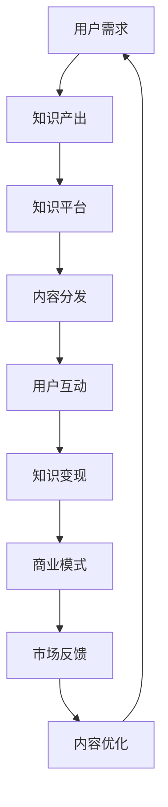

                 

# 知识经济时代下的知识付费创新商业模式运营

## 1. 背景介绍

### 1.1 问题由来

知识经济时代的到来，使得知识、信息和智慧成为推动经济社会发展的重要驱动力。面对海量信息的冲击，人们愈发渴望高效、精确、个性化的信息获取与知识服务。同时，随着数字经济的高速发展，传统知识获取渠道逐渐式微，教育与传播逐渐向数字化、智能化转型。知识付费作为一种新型的信息消费模式，借助互联网平台的力量，快速崛起并成为知识经济的重要组成部分。

### 1.2 问题核心关键点

知识付费的本质是通过付费购买和分享高质量的内容，实现知识的有效传递与积累。其核心在于构建一套可持续、高效的知识服务体系，并以此为核心驱动经济发展和创新。

从产业角度来看，知识付费的兴起促进了内容创意、信息技术、市场运营等多元化产业的联动发展。从用户角度来看，知识付费帮助用户节约时间成本、提升学习效率，并赋予知识获取更具情感共鸣和交互性的特点。

### 1.3 问题研究意义

研究知识付费的创新商业模式，对促进知识服务业的繁荣、提升全民素质、助力教育公平具有深远影响。同时，知识的价值实现也直接关联着国家的软实力与核心竞争力。

因此，探索知识付费的创新模式，对于优化知识经济结构、激发社会创新活力、推动知识服务的可持续发展，具有重大的理论价值和现实意义。

## 2. 核心概念与联系

### 2.1 核心概念概述

为理解知识付费商业模式，首先需明确几个核心概念：

- **知识付费**：通过付费获取特定信息、知识或智慧服务，包括在线课程、电子书、咨询服务、专题讲座等。
- **知识社区**：基于兴趣或职业背景而形成的线上社群，促进用户之间的交流、协作和学习。
- **平台生态**：知识付费服务的提供者、消费者及生态服务商之间的相互依存关系，共同构成了一个动态的产业链。
- **商业模式**：围绕知识服务构建的商业模式，主要包括内容产出、知识变现、市场运营、用户互动等多个环节。

### 2.2 核心概念原理和架构的 Mermaid 流程图



### 2.3 核心概念之间的逻辑关系

- 用户需求是知识付费的出发点，驱动内容产出和平台生态的形成。
- 知识产出通过内容分发满足用户需求，提升用户互动。
- 用户互动和市场反馈直接影响内容的优化，提升用户体验和满意度。
- 知识变现是知识付费商业模式的核心目标，驱动平台生态的繁荣。

这些概念共同构成了知识付费商业模式的框架，从而为用户提供更丰富、更高效、更个性化的知识服务。

## 3. 核心算法原理 & 具体操作步骤

### 3.1 算法原理概述

知识付费商业模式的算法原理涉及以下几个关键环节：

1. **内容推荐算法**：基于用户历史行为数据，推荐其可能感兴趣的内容，提升用户粘性。
2. **定价策略**：根据内容价值、用户需求和市场定价，制定合理的付费价格，平衡用户接受度和平台收益。
3. **个性化推荐**：通过分析用户行为数据，实现内容的个性化推荐，提升用户体验。
4. **知识变现**：通过订阅、单次付费、按需服务等形式，实现知识服务的变现。

### 3.2 算法步骤详解

#### 3.2.1 内容推荐算法

1. **数据收集**：收集用户的行为数据，包括访问记录、购买历史、评分反馈等。
2. **数据预处理**：对原始数据进行清洗、去重和标准化处理，避免噪声数据影响算法结果。
3. **特征工程**：提取与内容推荐相关的特征，包括用户兴趣、内容属性、内容质量等。
4. **模型训练**：选择合适推荐算法模型（如协同过滤、基于内容的推荐、矩阵分解等），使用训练数据对模型进行训练。
5. **模型评估**：通过交叉验证、AUC、准确率等指标对推荐效果进行评估，不断优化模型参数。
6. **部署应用**：将训练好的推荐模型应用于实际平台，为用户推荐个性化的内容。

#### 3.2.2 定价策略

1. **价值评估**：根据内容的专业度、深度、互动性等指标，对内容进行价值评估。
2. **需求分析**：分析目标用户群体，识别其对内容的支付意愿和支付能力。
3. **定价模型**：结合价值评估和需求分析，构建定价模型。可以使用成本加成定价、市场定价、动态定价等策略。
4. **价格测试**：在小范围内测试不同定价策略的效果，收集用户反馈。
5. **调整优化**：根据价格测试结果，调整定价策略，平衡用户接受度和平台收益。

#### 3.2.3 个性化推荐

1. **用户画像**：通过分析用户的历史行为数据，构建用户画像，识别用户兴趣和需求。
2. **内容分析**：分析内容的属性特征，如关键词、标签、评论等，构建内容特征向量。
3. **模型训练**：基于用户画像和内容特征向量，训练个性化推荐模型。
4. **推荐实施**：使用训练好的模型，对用户进行个性化内容推荐。

#### 3.2.4 知识变现

1. **订阅模式**：用户通过定期订阅获得内容访问权，持续获取知识服务。
2. **单次付费**：用户根据内容价值选择单次付费，获得特定内容的访问权。
3. **按需服务**：用户根据需求选择按需服务，即时获取个性化知识服务。
4. **收益分配**：合理分配平台、创作者和用户之间的收益，形成良性的商业生态。

### 3.3 算法优缺点

知识付费商业模式的算法具有以下优点：

1. **个性化推荐**：根据用户兴趣推荐内容，提升用户体验。
2. **精准定价**：结合内容价值和用户需求，制定合理价格，平衡用户接受度和平台收益。
3. **用户粘性**：通过个性化推荐和高质量内容，提升用户粘性，增加平台活跃度。

同时，也存在以下缺点：

1. **数据隐私**：用户行为数据的收集和使用涉及隐私问题，需注意用户数据的保护。
2. **内容同质化**：过度依赖推荐算法，可能导致内容同质化，影响用户体验。
3. **市场风险**：定价策略不当可能引发用户流失，影响平台收益。

### 3.4 算法应用领域

知识付费商业模式在多个领域得到了广泛应用，包括：

- **在线教育**：通过知识付费平台，提供各类在线课程，如编程、外语、财务管理等，满足用户终身学习需求。
- **专业培训**：企业通过知识付费平台，向员工提供专业培训课程，提升员工技能，促进企业发展。
- **职业认证**：行业机构通过知识付费平台，提供各类职业认证课程，帮助用户获得专业资格认证。
- **咨询服务**：专家通过知识付费平台，提供各类咨询服务，如法律咨询、金融咨询等。
- **生活服务**：知识付费平台还可以提供各类生活服务，如健康管理、家居装修、时尚穿搭等。

## 4. 数学模型和公式 & 详细讲解 & 举例说明

### 4.1 数学模型构建

假设知识付费平台的推荐系统由用户集 $U$、内容集 $C$、交互数据集 $D$ 组成，$U$ 和 $C$ 为高维向量，$D$ 包含用户与内容的交互记录。推荐系统的目标是通过模型 $f$ 预测用户 $u$ 对内容 $c$ 的评分 $p_{uc}$。

推荐系统的数学模型可以表示为：

$$
p_{uc} = f(u, c; \theta)
$$

其中 $\theta$ 为模型参数。

### 4.2 公式推导过程

假设用户对内容的评分 $r_{uc}$ 是真实评分 $p_{uc}$ 的伯努利分布，推荐系统采用最大似然估计方法，对模型参数 $\theta$ 进行估计。

根据伯努利分布的定义，用户对内容的评分为二值化评分，模型采用sigmoid函数将预测评分 $p_{uc}$ 转化为概率值 $q_{uc}$：

$$
q_{uc} = \sigma(p_{uc})
$$

模型参数 $\theta$ 的估计目标是最小化预测评分 $q_{uc}$ 与真实评分 $r_{uc}$ 之间的对数似然损失函数：

$$
L(\theta) = -\frac{1}{N}\sum_{(i,j)\in D}\big[ r_{ij} \log(q_{ij}) + (1-r_{ij}) \log(1-q_{ij}) \big]
$$

其中 $N$ 为数据集的样本数量。

### 4.3 案例分析与讲解

以基于协同过滤的推荐系统为例，其算法流程如下：

1. **用户画像构建**：将用户的行为数据转换成向量形式 $u_i = (x_{i1}, x_{i2}, \cdots, x_{in})$，其中 $x_{ik}$ 为第 $k$ 个兴趣点是否存在，表示用户对第 $k$ 个兴趣点的偏好。
2. **内容画像构建**：将内容的行为数据转换成向量形式 $c_j = (y_{j1}, y_{j2}, \cdots, y_{jm})$，其中 $y_{jk}$ 为第 $j$ 个内容对第 $k$ 个兴趣点的评分。
3. **用户-内容矩阵**：将用户画像和内容画像拼接，形成用户-内容矩阵 $A \in \mathbb{R}^{m \times n}$。
4. **矩阵分解**：使用矩阵分解方法（如奇异值分解）对用户-内容矩阵进行分解，得到用户特征矩阵 $U \in \mathbb{R}^{m \times k}$ 和内容特征矩阵 $V \in \mathbb{R}^{n \times k}$。
5. **预测评分**：使用分解后的特征矩阵计算预测评分 $p_{uc}$。

具体公式如下：

$$
A = UV^\top
$$

$$
p_{uc} = u_i \times v_j = (u_i \times v_j)^\top
$$

其中 $u_i$ 和 $v_j$ 分别表示用户和内容的特征向量。

## 5. 项目实践：代码实例和详细解释说明

### 5.1 开发环境搭建

知识付费平台的开发环境主要涉及以下工具和框架：

1. **编程语言**：Python。
2. **后端框架**：Flask/Django。
3. **数据库**：MySQL/PostgreSQL。
4. **缓存**：Redis。
5. **存储**：对象存储（如阿里云 OSS）。
6. **云服务**：AWS/Azure。

开发环境搭建步骤如下：

1. **环境准备**：安装Python、Flask、MySQL、Redis等工具。
2. **后端架构**：设计后端服务架构，包括用户管理、内容管理、推荐系统等模块。
3. **数据库设计**：设计数据库表结构，确保数据一致性和可扩展性。
4. **缓存配置**：配置Redis缓存，提升数据查询效率。
5. **云服务配置**：配置云服务，实现自动扩展和弹性伸缩。

### 5.2 源代码详细实现

下面以基于协同过滤的推荐系统为例，给出Flask后端的Python代码实现：

```python
from flask import Flask, request, jsonify
from scipy.sparse import csr_matrix
from scipy.sparse.linalg import svds

app = Flask(__name__)

@app.route('/recommend', methods=['POST'])
def recommend():
    data = request.json
    user_id = data['user_id']
    num_recommend = data['num_recommend']
    
    # 加载用户画像和内容画像
    user_matrix = load_user_matrix()
    content_matrix = load_content_matrix()
    
    # 用户特征矩阵
    user_features = user_matrix[user_id, :]
    user_matrix = user_matrix.todense()
    
    # 内容特征矩阵
    content_features = content_matrix[:, user_id]
    content_matrix = content_matrix.todense()
    
    # 矩阵分解
    U, s, V = svds(user_matrix.dot(content_matrix.T), k=num_recommend+1)
    U = U.T
    V = V.T
    
    # 预测评分
    scores = U.dot(V).dot(content_features)
    scores = scores / np.linalg.norm(scores)
    
    # 取前N个推荐内容
    top_indices = np.argsort(scores)[1:num_recommend+1]
    top_items = [f'{i}' for i in top_indices]
    
    return jsonify({'recommendations': top_items})

if __name__ == '__main__':
    app.run(debug=True)
```

### 5.3 代码解读与分析

**代码实现流程**：
1. **API接口设计**：设计一个POST类型的接口 `/recommend`，接收用户ID和推荐数量作为参数。
2. **数据加载**：从数据库或缓存中加载用户画像和内容画像。
3. **特征提取**：提取用户特征和内容特征。
4. **矩阵分解**：使用奇异值分解对用户-内容矩阵进行分解。
5. **评分预测**：计算预测评分，并对评分进行归一化。
6. **推荐内容生成**：取前N个推荐内容，返回JSON格式的推荐结果。

**算法性能优化**：
1. **稀疏矩阵处理**：使用SciPy库的稀疏矩阵处理方式，减少计算量和内存占用。
2. **特征归一化**：对特征进行归一化，提升模型的收敛速度和准确性。
3. **参数调优**：合理设置矩阵分解的奇异值数量，平衡模型的精度和计算复杂度。

### 5.4 运行结果展示

```json
{
    "recommendations": [
        "内容1",
        "内容2",
        "内容3",
        "内容4",
        "内容5"
    ]
}
```

## 6. 实际应用场景

### 6.1 在线教育平台

知识付费在在线教育领域的应用尤为广泛。用户可以通过知识付费平台订阅各类课程，如编程、英语、管理等，享受高质量的教育资源。在线教育平台通过个性化推荐和精准定价，提升用户学习体验和课程订阅量。

### 6.2 企业培训平台

企业通过知识付费平台，向员工提供各类专业培训课程，提升员工技能，降低培训成本。平台通过用户画像和内容画像的构建，实现高效的内容推荐，增强员工的学习动力和参与度。

### 6.3 职业认证考试

行业机构通过知识付费平台，提供各类职业认证课程，帮助用户获得专业资格认证。平台通过个性化推荐和精准定价，提升用户的认证通过率和机构的市场竞争力。

### 6.4 生活服务应用

知识付费平台还可以提供各类生活服务，如健康管理、家居装修、时尚穿搭等。用户可以通过付费订阅，获取定制化的生活建议和知识服务，提升生活质量和幸福感。

## 7. 工具和资源推荐

### 7.1 学习资源推荐

为了帮助开发者系统掌握知识付费商业模式，这里推荐一些优质的学习资源：

1. **《知识付费：基于数据驱动的商业模型》一书**：详细讲解知识付费模式的核心概念、算法原理和实践案例，适合系统学习。
2. **Coursera《数据驱动的商业智能》课程**：涵盖数据采集、数据挖掘、数据可视化等多个知识点，是数据分析的入门课程。
3. **Udacity《机器学习基础》课程**：介绍机器学习的基本算法和应用场景，是人工智能的入门课程。
4. **Kaggle《推荐系统》竞赛**：通过实际竞赛数据，锻炼推荐算法的实战能力，适合进阶学习。

通过对这些资源的学习实践，相信你一定能够掌握知识付费商业模式的精髓，并用于解决实际问题。

### 7.2 开发工具推荐

高效的开发离不开优秀的工具支持。以下是几款用于知识付费平台开发的常用工具：

1. **Flask/Django**：Python的Web框架，支持RESTful API接口开发，简单易用。
2. **MySQL/PostgreSQL**：关系型数据库，支持结构化数据存储和管理。
3. **Redis**：内存数据库，支持高并发读写操作，适合缓存使用。
4. **SciPy**：科学计算库，支持矩阵运算、优化算法等功能。
5. **Pandas**：数据处理库，支持数据清洗、转换、分析等功能。
6. **Jupyter Notebook**：交互式编程环境，支持Python代码的快速迭代和测试。

合理利用这些工具，可以显著提升知识付费平台的开发效率，加快创新迭代的步伐。

### 7.3 相关论文推荐

知识付费商业模式的研究始于学术界的深入探索，以下是几篇奠基性的相关论文，推荐阅读：

1. **《知识付费商业模式的创新与应用》**：探讨知识付费模式的发展历程和创新方向，具有很高的理论价值。
2. **《基于协同过滤的推荐系统》**：介绍协同过滤算法的原理和实现，是推荐系统的重要参考资料。
3. **《知识付费平台的用户行为研究》**：分析用户行为数据，提出个性化推荐和定价策略，具有重要的实践意义。
4. **《知识付费模式的市场影响》**：研究知识付费对社会经济发展和教育公平的影响，具有重要的社会价值。

这些论文代表了大数据时代知识付费商业模式的研究脉络。通过学习这些前沿成果，可以帮助研究者把握学科前进方向，激发更多的创新灵感。

## 8. 总结：未来发展趋势与挑战

### 8.1 研究成果总结

知识付费商业模式自诞生以来，凭借其个性化推荐、精准定价和优质内容，迅速崛起并成为知识经济的重要组成部分。平台通过数据驱动的算法，提升用户粘性和平台收益，驱动知识服务业的繁荣发展。

### 8.2 未来发展趋势

展望未来，知识付费商业模式将呈现以下几个发展趋势：

1. **用户体验升级**：随着AI和大数据的不断进步，个性化推荐将更加精准高效，提升用户的使用体验和满意度。
2. **内容多样化**：知识付费平台将丰富内容类型，涵盖各类知识领域，满足用户多样化的知识需求。
3. **技术创新驱动**：知识付费平台的竞争将更加依赖于技术创新，如智能推荐、语音识别、虚拟现实等新兴技术将为知识付费带来新的突破。
4. **生态融合发展**：知识付费平台将与其他知识服务生态协同发展，实现更广泛的知识服务网络。
5. **国际化拓展**：全球化背景下的知识付费平台将面向更多国际用户，提升平台的国际化水平。

### 8.3 面临的挑战

尽管知识付费商业模式蓬勃发展，但还面临以下挑战：

1. **市场竞争激烈**：众多知识付费平台争夺用户，市场竞争激烈，如何突出特色和优势是一个关键问题。
2. **用户付费意愿低**：部分用户对付费获取知识持抵触态度，需要通过优质的内容和服务，提升用户付费意愿。
3. **内容同质化严重**：内容同质化问题严重，需要加强内容原创性和多样性，提升平台竞争力。
4. **数据隐私风险**：用户行为数据的收集和使用涉及隐私问题，需注意用户数据的保护。
5. **技术难题**：推荐算法、定价策略等技术难题仍需解决，提升平台的稳定性和安全性。

### 8.4 研究展望

针对以上挑战，未来的研究需要在以下几个方面寻求新的突破：

1. **提升内容质量**：开发更加智能的内容生产工具，提升内容的原创性和多样性。
2. **优化定价策略**：基于用户价值和使用场景，设计更加精细化的定价模型。
3. **强化技术创新**：持续研发前沿技术，如智能推荐、语音识别、虚拟现实等，提升平台竞争力。
4. **加强用户互动**：通过社交功能、用户评价等手段，增强用户互动和社区粘性。
5. **注重数据安全**：加强用户数据保护，提升平台的可信度和用户信任度。

## 9. 附录：常见问题与解答

**Q1：知识付费模式是否适用于所有行业？**

A: 知识付费模式主要适用于具有标准化、可分发、易传播的行业，如教育、培训、咨询等。对于一些需要高度定制化、专业化的服务，如医疗、法律、金融等，知识付费模式可能不太适用。

**Q2：知识付费平台如何确保内容质量？**

A: 知识付费平台通过严格的审核机制和专家认证，确保内容的专业性和准确性。平台还会引入用户反馈和评价机制，动态调整内容推荐策略，提升内容质量。

**Q3：知识付费平台的商业模式有哪些？**

A: 知识付费平台的主要商业模式包括订阅模式、单次付费模式、按需服务模式等。不同模式适合不同的内容和用户群体，平台需要根据自身特点选择合适的商业模式。

**Q4：知识付费平台如何应对市场竞争？**

A: 知识付费平台需要通过精准定价、优质内容、技术创新等手段提升竞争力。同时，加强品牌建设和用户互动，增强用户粘性和平台忠诚度。

**Q5：知识付费平台如何保护用户隐私？**

A: 知识付费平台应严格遵守相关法律法规，如《个人信息保护法》，加强用户数据保护。平台应透明公开数据收集和使用规则，提升用户信任度。

---

作者：禅与计算机程序设计艺术 / Zen and the Art of Computer Programming

