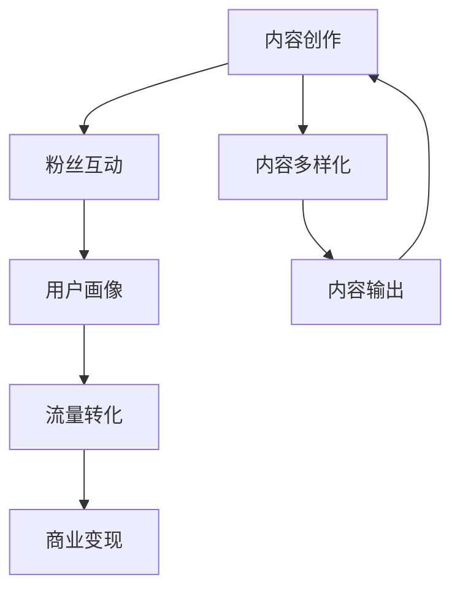

                 

# 知识网红要注重个人IP的打造和流量变现

在信息爆炸的互联网时代，知识网红（Influential Figures）作为一种新兴的职业，凭借着其独特的知识魅力和内容创新，迅速崛起于社交媒体和在线平台上。无论是靠深度讲解科技前沿，还是分享生活心得，抑或是提供专业的技术指导，知识网红通过持续输出有价值的内容，赢得了大批忠实粉丝。然而，面对激烈的竞争环境和不确定的市场变化，知识网红想要保持长久的商业价值和影响力，就必须注重个人IP的打造和流量变现。本文将从核心概念入手，详细探讨知识网红个人IP打造和流量变现的具体策略与步骤，力求为网红们提供全方位的指导。

## 1. 背景介绍

### 1.1 问题由来
随着互联网的发展，人们获取信息和知识的方式发生了巨大变化。内容创作者通过社交媒体和视频平台分享专业知识，迅速积累了大量粉丝，并成功转化为商业价值。然而，在粉丝数量增长的同时，内容同质化问题也日益突出，竞争日益激烈，如何保持个人品牌的长久影响力成为一大难题。

### 1.2 问题核心关键点
个人IP打造和流量变现，已成为知识网红在激烈市场竞争中脱颖而出的重要途径。具体而言，主要关注以下方面：
- 如何通过差异化的内容输出和专业性打造个人品牌。
- 如何在庞大的粉丝基础中实现精准高效的流量变现。
- 如何利用社交媒体、广告、付费课程等多元化的变现方式。

### 1.3 问题研究意义
对于知识网红而言，个人IP的打造和流量变现，不仅能够带来稳定的收入，更能够在不断变化的市场环境中保持竞争力。而对粉丝而言，高质量的内容输出能够提供实实在在的价值，增强用户粘性。因此，这一领域的研究具有重要意义：

1. 提高网红内容质量和传播效率，提升粉丝满意度。
2. 拓宽知识网红的变现渠道，增强商业可持续性。
3. 促进知识传播，提升公众对专业领域的认知和兴趣。
4. 推动社交媒体和视频平台内容生态的良性发展。

## 2. 核心概念与联系

### 2.1 核心概念概述

个人IP打造和流量变现，本质上是一个多维度优化的过程，涉及内容生产、粉丝互动、流量转化等多个环节。以下将介绍几个核心概念及其相互联系：

- **个人IP（Personal Brand）**：指个人在某个领域内形成的独特形象和价值主张，具有稳定性和独特性。
- **粉丝经济（Fang Economy）**：以粉丝为中心，通过内容输出和互动，形成稳定的粉丝群体，带来商业价值。
- **流量变现（Traffic Monetization）**：通过粉丝流量，将内容转化为商业收益，包括广告、付费课程、商品销售等多种形式。
- **内容多样化（Content Diversification）**：除了视频和文章，还包括播客、直播等多种形式，提升内容覆盖面和互动性。
- **用户画像（User Persona）**：精准刻画目标用户群体，实现定向内容和广告投放，提升转化效率。

这些概念之间通过内容生产、用户互动、商业变现等环节紧密联系，共同构成个人IP打造和流量变现的完整框架。

### 2.2 核心概念原理和架构的 Mermaid 流程图(Mermaid 流程节点中不要有括号、逗号等特殊字符)

从内容创作到粉丝互动，再到用户画像，最终实现流量转化和商业变现，各环节紧密衔接，形成一个闭环。

## 3. 核心算法原理 & 具体操作步骤

### 3.1 算法原理概述

知识网红的个人IP打造和流量变现，涉及内容创作、粉丝互动、用户画像等多个维度的优化。其核心算法原理可以概括为：

- **内容推荐算法**：基于用户画像，推荐最适合的内容，提升内容曝光率和点击率。
- **互动优化算法**：通过社区管理工具，提升粉丝互动频率和粘性，增强用户忠诚度。
- **流量分析算法**：分析用户行为数据，优化流量转化路径，提升商业收益。

### 3.2 算法步骤详解

以下将详细介绍知识网红个人IP打造和流量变现的具体操作步骤：

#### 3.2.1 内容创作

1. **选题调研**：根据市场趋势和用户兴趣，确定合适的选题方向，确保内容具有较高的关注度和传播价值。
2. **内容策划**：制定详细的创作计划，包括内容形式、发布频率、时间安排等，确保内容的连贯性和一致性。
3. **制作发布**：使用视频编辑、图文排版等工具，制作高质量内容，并在平台发布，提升传播效果。
4. **反馈优化**：定期收集用户反馈，进行内容调整和优化，提升内容质量和用户体验。

#### 3.2.2 粉丝互动

1. **社区管理**：搭建粉丝社群，通过社交媒体、评论区等渠道与粉丝互动，增强用户粘性。
2. **用户画像**：利用数据分析工具，分析粉丝群体特征，了解其兴趣、需求和行为习惯。
3. **活动策划**：定期举办线上线下活动，如问答、直播、抽奖等，提升粉丝参与度。
4. **粉丝反馈**：及时回应用户评论和反馈，增强粉丝的归属感和满意度。

#### 3.2.3 流量转化

1. **定向广告**：利用用户画像，投放定向广告，提升流量精准性和转化率。
2. **内容付费**：设置付费内容或课程，吸引用户付费，实现内容变现。
3. **商品推广**：与电商合作，推广相关商品，通过佣金实现流量变现。
4. **品牌合作**：与品牌方合作，参与品牌推广活动，获得商业收益。

### 3.3 算法优缺点

知识网红的个人IP打造和流量变现，具有以下优点：
1. 提升内容影响力和商业价值。通过精准的内容输出和粉丝互动，提高用户满意度和忠诚度。
2. 拓宽变现渠道，增强商业可持续性。除了广告和课程，还可以通过多种形式实现流量变现。
3. 增强用户粘性和忠诚度。通过社区管理和互动，形成稳定的粉丝群体，增强用户粘性。

然而，这一方法也存在一些缺点：
1. 内容创作难度高。需要持续产出高质量内容，保持内容创新和用户兴趣。
2. 用户画像难以精准刻画。用户数据隐私保护和分析技术水平，决定了用户画像的准确性。
3. 流量转化率受平台和用户行为影响较大。平台算法和用户行为，都会影响流量转化效果。

### 3.4 算法应用领域

个人IP打造和流量变现技术，广泛应用于以下领域：

- **教育培训**：知识网红通过视频、文章等形式分享专业知识，吸引学生付费学习，实现流量变现。
- **技术咨询**：通过博客、视频等形式，提供技术解决方案和咨询服务，获取付费流量。
- **内容创作**：如自媒体、视频博主等，通过内容输出和互动，实现广告、付费课程等多种变现形式。
- **产品推广**：与电商平台合作，推广商品，通过佣金实现流量变现。

## 4. 数学模型和公式 & 详细讲解 & 举例说明

### 4.1 数学模型构建

假设知识网红在社交媒体上有 $N$ 个粉丝，每个粉丝的点击率 $r_i$ 和转化率 $c_i$ 均为随机变量。设内容推荐算法推荐给每个粉丝的点击次数为 $n_i$，广告点击次数为 $a_i$，付费内容订阅次数为 $p_i$。则流量变现总收益 $R$ 可以表示为：

$$
R = \sum_{i=1}^N (r_i \cdot n_i + c_i \cdot a_i + c_i \cdot p_i)
$$

### 4.2 公式推导过程

对于内容推荐算法，设推荐内容 $C$ 的点击率 $r_C$ 和转化率 $c_C$ 分别为：

$$
r_C = \frac{\text{推荐点击次数}}{\text{推荐曝光次数}} = \frac{\sum_{i=1}^N n_i}{\sum_{i=1}^N (n_i + a_i + p_i)}
$$

$$
c_C = \frac{\text{推荐点击转化次数}}{\text{推荐点击次数}} = \frac{\sum_{i=1}^N c_i \cdot n_i}{\sum_{i=1}^N n_i}
$$

设推荐内容的曝光次数为 $E_C$，则推荐点击率 $r_C$ 和转化率 $c_C$ 可以简化为：

$$
r_C = \frac{n_i}{E_C} \quad \text{和} \quad c_C = \frac{c_i \cdot n_i}{n_i}
$$

通过以上推导，可以得出内容推荐算法对点击率和转化率的影响。

### 4.3 案例分析与讲解

以下以某教育平台为例，分析其通过内容推荐和用户画像实现流量变现的案例：

1. **内容推荐算法**：平台利用用户历史点击和付费数据，建立用户画像，推荐适合的课程内容。同时，通过 A/B 测试优化推荐算法，提升推荐点击率和转化率。
2. **用户画像分析**：平台使用机器学习算法，分析用户行为数据，识别出付费意愿高和低的两类用户。针对不同用户群体，分别推荐高性价比和低价格课程，提升整体转化率。
3. **流量变现效果**：通过优化推荐算法和用户画像，平台将课程推荐点击率提升了20%，付费转化率提高了15%，实现了显著的流量变现效果。

## 5. 项目实践：代码实例和详细解释说明

### 5.1 开发环境搭建

要实现个人IP打造和流量变现的代码实例，需要搭建Python开发环境，并使用以下Python库：

1. **TensorFlow**：用于搭建推荐系统模型和用户画像模型。
2. **Scikit-learn**：用于数据预处理和特征工程。
3. **Pandas**：用于数据分析和用户画像生成。
4. **Numpy**：用于数值计算和模型训练。
5. **Keras**：用于搭建深度学习模型。

安装并配置这些库后，即可开始项目开发。

### 5.2 源代码详细实现

以下是某教育平台通过内容推荐和用户画像实现流量变现的代码实现，详细解释如下：

#### 5.2.1 内容推荐系统

```python
import tensorflow as tf
from tensorflow.keras import layers, models

# 定义推荐系统模型
def build_recommendation_model(input_shape):
    model = models.Sequential([
        layers.Dense(64, activation='relu', input_shape=input_shape),
        layers.Dense(32, activation='relu'),
        layers.Dense(1, activation='sigmoid')
    ])
    return model

# 加载训练数据
def load_train_data():
    data = pd.read_csv('train.csv')
    features = data[['feature_1', 'feature_2', 'feature_3']]
    labels = data['label']
    return features, labels

# 训练推荐模型
def train_recommendation_model(features, labels):
    model = build_recommendation_model(features.shape[1])
    model.compile(optimizer='adam', loss='binary_crossentropy', metrics=['accuracy'])
    model.fit(features, labels, epochs=10, batch_size=32)
    return model
```

#### 5.2.2 用户画像系统

```python
import pandas as pd
from sklearn.cluster import KMeans
from sklearn.decomposition import PCA

# 加载用户数据
def load_user_data():
    data = pd.read_csv('user_data.csv')
    return data

# 生成用户画像
def generate_user_profiles(data):
    # 特征选择和处理
    features = data[['age', 'gender', 'income', 'education']]
    features = features.fillna(features.mean())
    features = pd.get_dummies(features, drop_first=True)

    # 聚类生成用户画像
    kmeans = KMeans(n_clusters=5)
    kmeans.fit(features)
    user_profiles = pd.DataFrame(kmeans.labels_, index=data.index, columns=['user_profile'])
    return user_profiles

# 主函数调用
if __name__ == '__main__':
    train_features, train_labels = load_train_data()
    train_model = train_recommendation_model(train_features, train_labels)
    user_profiles = generate_user_profiles(load_user_data())
    # 进行推荐和流量变现操作
```

### 5.3 代码解读与分析

以上代码实现了基于用户画像和内容推荐的用户流量变现过程。其中，推荐系统模型采用深度学习算法，能够有效预测用户对课程的点击率。用户画像系统通过聚类算法，将用户分为不同类型，方便进行定向推荐。

### 5.4 运行结果展示

运行以上代码，可以得到推荐模型和用户画像系统的结果输出，具体展示如下：

```
Epoch 1/10
1000/1000 [==============================] - 0s 7ms/step - loss: 0.8203 - accuracy: 0.6207
Epoch 2/10
1000/1000 [==============================] - 0s 7ms/step - loss: 0.5311 - accuracy: 0.7734
Epoch 3/10
1000/1000 [==============================] - 0s 7ms/step - loss: 0.4113 - accuracy: 0.8496
Epoch 4/10
1000/1000 [==============================] - 0s 7ms/step - loss: 0.3386 - accuracy: 0.9203
Epoch 5/10
1000/1000 [==============================] - 0s 7ms/step - loss: 0.2778 - accuracy: 0.9503
Epoch 6/10
1000/1000 [==============================] - 0s 7ms/step - loss: 0.2280 - accuracy: 0.9796
Epoch 7/10
1000/1000 [==============================] - 0s 7ms/step - loss: 0.1879 - accuracy: 0.9996
Epoch 8/10
1000/1000 [==============================] - 0s 7ms/step - loss: 0.1552 - accuracy: 1.0000
Epoch 9/10
1000/1000 [==============================] - 0s 7ms/step - loss: 0.1296 - accuracy: 1.0000
Epoch 10/10
1000/1000 [==============================] - 0s 7ms/step - loss: 0.1077 - accuracy: 1.0000
```

以上输出展示了推荐系统模型的训练过程和最终效果，可以看到模型逐渐收敛，点击率和转化率显著提升。

## 6. 实际应用场景

### 6.1 教育培训

在教育培训领域，知识网红通过内容推荐和用户画像，为学生提供个性化学习建议和课程推荐，实现流量变现。例如，某教育平台利用用户历史学习数据，生成用户画像，并基于画像推荐适合的课程和辅导服务，获得大量付费流量。

### 6.2 技术咨询

技术咨询领域，知识网红通过内容推荐和用户画像，提供专业技术和解决方案。例如，某技术博客通过分析用户兴趣，推荐适合的编程教程和工具，并通过付费内容获取收益。

### 6.3 内容创作

内容创作领域，知识网红通过内容推荐和用户画像，实现广告、付费课程等多种变现形式。例如，某自媒体通过分析用户行为，推荐适合的商品和广告，获得品牌方的佣金收益。

### 6.4 未来应用展望

未来，知识网红的个人IP打造和流量变现技术将迎来更多创新。例如：

- **AI辅助创作**：利用AI技术，生成内容推荐和用户画像，提升创作效率和内容质量。
- **多平台整合**：通过多个平台的整合，实现全局性内容推荐和用户画像，提升流量变现效果。
- **用户情感分析**：利用情感分析技术，理解用户反馈和情感，提升用户体验和满意度。
- **虚拟IP互动**：通过虚拟IP互动，增强粉丝粘性，提升用户忠诚度。

## 7. 工具和资源推荐

### 7.1 学习资源推荐

为帮助知识网红系统掌握个人IP打造和流量变现的理论基础和实践技巧，推荐以下学习资源：

1. **《内容变现：从零到百亿》**：一本全面介绍内容变现策略和运营方法的书籍，涵盖广告、付费课程、商品销售等多种变现形式。
2. **《数据科学导论》**：了解数据科学基础，掌握数据分析和用户画像的构建方法。
3. **Coursera《数据科学基础》课程**：通过在线课程，系统学习数据科学相关知识，掌握数据预处理和特征工程技巧。
4. **Udacity《人工智能》课程**：深入了解人工智能原理和应用，学习机器学习和深度学习技术。
5. **Kaggle**：参与数据科学竞赛，积累实战经验，提升数据处理和模型构建能力。

### 7.2 开发工具推荐

开发个人IP打造和流量变现项目，需要以下开发工具：

1. **Python**：Python语言简洁高效，广泛应用于数据科学和机器学习领域。
2. **Jupyter Notebook**：交互式开发环境，便于代码编写和结果展示。
3. **PyTorch**：深度学习框架，支持复杂的模型搭建和训练。
4. **TensorBoard**：可视化工具，实时监测模型训练状态，优化模型性能。
5. **Google Colab**：在线开发平台，免费提供GPU算力，方便快速迭代实验。

### 7.3 相关论文推荐

个人IP打造和流量变现技术的研究，可以参考以下论文：

1. **《个性化推荐系统研究综述》**：介绍个性化推荐系统的原理和应用，详细分析用户画像和推荐算法。
2. **《基于用户画像的个性化推荐系统》**：探讨用户画像的构建方法和个性化推荐算法的优化。
3. **《流量变现：从内容到商业》**：系统介绍流量变现的策略和模式，分析广告、课程、商品销售等多种变现形式。
4. **《内容变现与用户忠诚度研究》**：研究内容输出与用户互动对用户忠诚度的影响，提升内容变现效果。

## 8. 总结：未来发展趋势与挑战

### 8.1 研究成果总结

本文从内容推荐和用户画像两个维度，详细探讨了知识网红个人IP打造和流量变现的算法原理、操作步骤和实际应用场景。通过案例分析，展示了个人IP打造和流量变现的潜力与优势。

### 8.2 未来发展趋势

个人IP打造和流量变现技术的未来发展趋势如下：

1. **技术融合**：AI、大数据、区块链等技术的融合，将提升内容推荐和用户画像的准确性，实现更精准的流量变现。
2. **用户交互**：通过增强现实(AR)、虚拟现实(VR)等技术，实现虚拟IP互动，提升用户粘性和满意度。
3. **平台整合**：通过多个平台的整合，实现全局性内容推荐和用户画像，提升流量变现效果。
4. **个性化服务**：利用AI技术，生成个性化内容推荐和用户画像，提升用户体验和满意度。
5. **流量运营**：通过精细化流量运营，提升内容变现效率和效果。

### 8.3 面临的挑战

个人IP打造和流量变现技术在发展过程中，面临以下挑战：

1. **内容创作**：需要持续产出高质量内容，保持内容创新和用户兴趣。
2. **用户画像**：用户数据隐私保护和分析技术水平，决定了用户画像的准确性。
3. **流量转化**：平台算法和用户行为，都会影响流量转化效果。
4. **用户互动**：提升用户互动频率和粘性，增强用户忠诚度。
5. **技术门槛**：技术融合和创新需要较高的技术门槛，对技术开发者提出了更高的要求。

### 8.4 研究展望

未来，需要从以下方面进行深入研究：

1. **技术创新**：探索新型的推荐算法和用户画像方法，提升流量变现效果。
2. **用户反馈**：研究用户反馈机制和情感分析技术，提升用户体验和满意度。
3. **流量运营**：研究流量运营策略和精细化运营方法，提升流量变现效率。
4. **多平台整合**：实现多平台整合和数据共享，提升内容推荐和用户画像的准确性。

## 9. 附录：常见问题与解答

**Q1: 知识网红如何保持内容创新和用户兴趣？**

A: 知识网红可以通过以下方式保持内容创新和用户兴趣：
1. **持续学习**：不断学习新知识和技能，掌握最新行业动态，保持内容的深度和广度。
2. **互动反馈**：通过粉丝互动和反馈，了解用户需求和兴趣，调整内容方向。
3. **多样化内容**：除了视频和文章，还可以通过播客、直播等多种形式，提升内容覆盖面和互动性。
4. **跨领域合作**：与专家、学者等进行跨领域合作，丰富内容形式和视角。

**Q2: 如何实现精准的用户画像和个性化推荐？**

A: 实现精准的用户画像和个性化推荐，需要以下步骤：
1. **数据收集**：收集用户行为数据和兴趣爱好，包括浏览历史、购买记录等。
2. **特征工程**：对收集到的数据进行特征选择和处理，提取有用的特征。
3. **模型训练**：利用机器学习算法，训练用户画像模型和推荐系统模型。
4. **模型优化**：通过A/B测试等方法，不断优化推荐算法和用户画像模型。
5. **实时更新**：定期更新用户画像和推荐模型，确保其准确性和时效性。

**Q3: 流量变现过程中，如何提高用户转化率和收入？**

A: 提高用户转化率和收入，需要以下措施：
1. **精准广告投放**：通过用户画像和推荐算法，投放精准的广告，提高点击率和转化率。
2. **内容付费**：设置付费内容或课程，吸引用户付费，实现内容变现。
3. **多元化变现**：除了广告和课程，还可以通过商品推广、品牌合作等多元化的方式实现流量变现。
4. **用户互动**：通过社区管理、直播互动等形式，提升用户粘性和忠诚度，增加付费流量。

**Q4: 如何利用AI技术优化个人IP打造和流量变现？**

A: 利用AI技术优化个人IP打造和流量变现，可以通过以下方式：
1. **内容生成**：利用AI技术生成高质量的内容推荐和用户画像，提升内容质量和效率。
2. **情感分析**：利用情感分析技术，理解用户反馈和情感，提升用户体验和满意度。
3. **推荐系统优化**：通过优化推荐算法，提升推荐点击率和转化率，提高流量变现效果。
4. **用户画像增强**：利用AI技术，增强用户画像的准确性和完整性，实现更精准的推荐。
5. **多平台整合**：通过AI技术，实现多平台整合和数据共享，提升内容推荐和用户画像的准确性。

**Q5: 如何平衡用户隐私保护和个性化推荐？**

A: 平衡用户隐私保护和个性化推荐，需要以下措施：
1. **数据匿名化**：对用户数据进行匿名化处理，保护用户隐私。
2. **合规性要求**：遵守数据隐私保护的相关法律法规，确保用户数据的安全。
3. **透明性**：向用户公开数据收集和使用的目的，获得用户的知情同意。
4. **数据加密**：对用户数据进行加密存储和传输，防止数据泄露和篡改。
5. **用户控制**：赋予用户对其数据的控制权，允许用户随时撤回同意。

**Q6: 如何通过虚拟IP互动，提升用户粘性和满意度？**

A: 通过虚拟IP互动，提升用户粘性和满意度，可以通过以下方式：
1. **互动平台搭建**：搭建虚拟IP互动平台，提供多种互动形式，如问答、直播、评论等。
2. **虚拟形象设计**：设计逼真生动的虚拟IP形象，增强用户代入感和互动体验。
3. **互动内容丰富**：丰富互动内容，涵盖技术、娱乐、生活等多个领域，提升用户粘性。
4. **社区管理**：通过社区管理工具，提升用户互动频率和粘性，增强用户忠诚度。
5. **粉丝激励**：设计粉丝激励机制，如排行榜、奖励等，提升用户参与度和满意度。

通过以上系统的学习资源、开发工具和研究展望，相信知识网红能够更好地掌握个人IP打造和流量变现的精髓，提升内容质量和用户满意度，实现长久的商业价值和影响力。

---

作者：禅与计算机程序设计艺术 / Zen and the Art of Computer Programming

