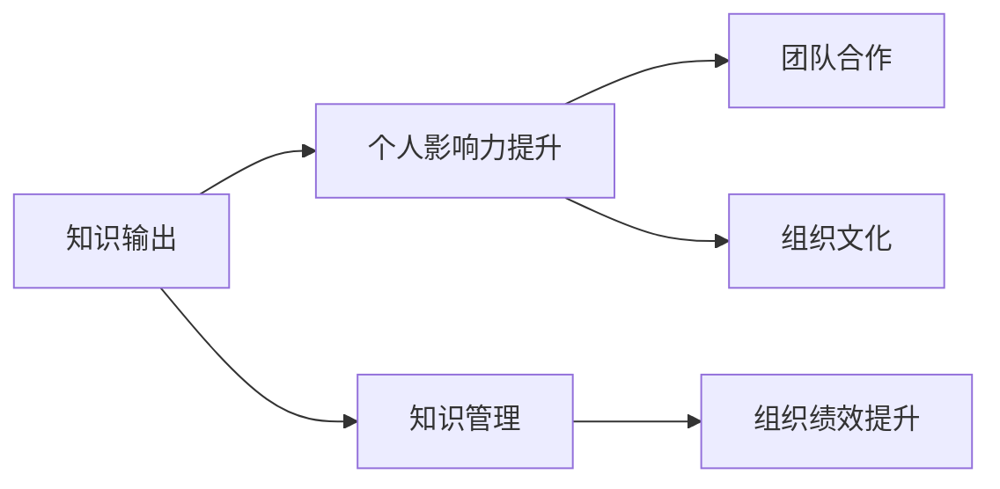

                 

# 知识输出与管理者个人影响力的提升

> 关键词：知识管理, 影响力提升, 个人品牌, 信息传递, 沟通技巧, 领导力发展, 项目管理, 绩效管理, 反馈机制, 团队协作

## 1. 背景介绍

在当今信息爆炸的时代，知识管理成为企业管理和个人发展的关键。管理者作为组织的核心，其知识输出能力直接决定了组织的创新能力、执行效率和竞争力。同时，个人影响力的提升也是每位管理者职业发展的重要目标。本文将从知识输出与个人影响力的双重视角出发，探讨如何通过提升知识输出能力来增强管理者的个人影响力，构建一个更高效的组织，推动企业持续发展。

## 2. 核心概念与联系

### 2.1 核心概念概述

- **知识输出**：指将个人掌握的知识、技能、经验等以各种形式（如书面报告、演讲、培训等）传递给他人，帮助他人解决问题、提升绩效。知识输出的有效性直接关系到管理者的影响力。
- **个人影响力**：指个人通过言行、品德、能力等因素在组织内外形成的影响力和领导力。管理者通过知识输出可以建立专业权威，提升团队合作和组织效能。
- **知识管理**：指对知识的收集、组织、分享和应用进行系统的管理和规划，以支持组织的战略目标和个人发展。有效的知识管理能够提升组织的创新能力和效率。

### 2.2 核心概念原理和架构的 Mermaid 流程图



该图展示了知识输出、个人影响力提升、知识管理与组织绩效提升之间的联系。管理者通过有效的知识输出，利用知识管理手段，不仅提升个人影响力，还能推动团队合作、组织文化建设，最终提升组织整体绩效。

## 3. 核心算法原理 & 具体操作步骤

### 3.1 算法原理概述

基于知识输出与个人影响力的提升，本文将详细探讨以下核心算法原理：

- **知识输出模型**：探讨如何构建知识输出模型，包括知识分类、输出渠道、反馈机制等。
- **影响力提升模型**：通过网络分析、情感分析等技术，评估知识输出的影响力，并提出改进建议。
- **知识管理模型**：介绍知识库构建、知识共享平台、知识地图等知识管理手段。

### 3.2 算法步骤详解

#### 3.2.1 知识输出模型构建

1. **知识分类**：将知识按照主题、领域、层次等进行分类，便于管理和输出。
2. **输出渠道**：选择适合的输出渠道，如培训课程、内部会议、知识共享平台等。
3. **反馈机制**：建立反馈机制，收集听众或读者对知识输出的反馈，以改进输出内容。

#### 3.2.2 影响力提升模型构建

1. **网络分析**：通过分析知识输出的传播路径和影响范围，评估个人影响力。
2. **情感分析**：使用自然语言处理技术分析听众或读者对知识输出的情感反应，提升输出的吸引力和认同感。
3. **影响力提升建议**：基于网络分析和情感分析结果，提出改进知识输出内容、形式、频率等策略，增强个人影响力。

#### 3.2.3 知识管理模型构建

1. **知识库构建**：建立结构化的知识库，存储和管理组织内外的知识资源。
2. **知识共享平台**：搭建知识共享平台，促进组织内部知识的流动和共享。
3. **知识地图**：构建知识地图，帮助管理者快速定位所需知识，提升决策效率。

### 3.3 算法优缺点

#### 3.3.1 知识输出模型

- **优点**：促进知识的系统化和结构化，提升知识输出的针对性和效率。
- **缺点**：分类和输出的过程较为繁琐，需要投入较多时间和资源。

#### 3.3.2 影响力提升模型

- **优点**：通过数据驱动的分析，准确评估知识输出的影响力，提出改进策略。
- **缺点**：需要处理大量的文本数据，对技术要求较高。

#### 3.3.3 知识管理模型

- **优点**：系统化的知识管理手段，提升知识共享和应用效率。
- **缺点**：初期搭建和维护成本较高，需要持续投入资源。

### 3.4 算法应用领域

- **企业管理**：适用于企业内部的知识管理、绩效管理、员工培训等。
- **项目管理和团队协作**：适用于项目管理中的知识传递和协作工具的开发。
- **人力资源管理**：适用于员工发展和人才培养的知识共享和输出平台。

## 4. 数学模型和公式 & 详细讲解 & 举例说明

### 4.1 数学模型构建

我们以知识输出模型为例，建立数学模型。假设组织内有 $N$ 名员工，每个员工的知识输出频次为 $k_i$，影响范围为 $c_i$，则总的知识输出频次 $K$ 和总的影响范围 $C$ 分别为：

$$
K = \sum_{i=1}^N k_i
$$

$$
C = \sum_{i=1}^N c_i
$$

知识输出的影响力 $I$ 可以通过知识输出频次和影响范围的乘积来评估：

$$
I = K \times C
$$

### 4.2 公式推导过程

将上述模型公式进行推导，我们得到：

$$
I = \sum_{i=1}^N k_i \times c_i
$$

上式展示了知识输出对个人影响力的贡献。通过优化 $k_i$ 和 $c_i$，可以有效提升个人影响力。

### 4.3 案例分析与讲解

假设某公司有 100 名员工，其中一名员工 $A$ 每月进行一次知识分享，每次影响 100 名员工，其余员工的知识输出频次和影响范围均小于 $A$。则 $A$ 对知识输出的总贡献为：

$$
I_A = 12 \times 100 = 1200
$$

其他员工的知识输出总贡献为：

$$
I_{\text{other}} = \sum_{i=1}^{99} k_i \times c_i
$$

通过上述案例可以看出，关键员工的知识输出对组织的影响力显著，管理者应重点关注并激励这些员工的知识分享。

## 5. 项目实践：代码实例和详细解释说明

### 5.1 开发环境搭建

- **安装 Python**：确保系统已安装 Python 3.x。
- **安装 Pandas**：用于数据处理和分析。
- **安装 Matplotlib**：用于绘制图表和可视化。
- **安装 Scikit-learn**：用于机器学习算法。

### 5.2 源代码详细实现

以下是一个简单的 Python 代码示例，用于评估知识输出的影响力：

```python
import pandas as pd
import matplotlib.pyplot as plt

# 定义知识输出数据
data = {
    '员工编号': [1, 2, 3, 4, 5],
    '知识输出频次': [1, 2, 3, 2, 1],
    '影响范围': [10, 5, 20, 5, 10]
}

# 创建数据框
df = pd.DataFrame(data)

# 计算总的知识输出频次和总的影响范围
K = df['知识输出频次'].sum()
C = df['影响范围'].sum()

# 计算总的知识输出影响力
I = K * C

# 输出结果
print(f"总的知识输出影响力为: {I}")

# 绘制知识输出频次和影响范围的散点图
plt.scatter(df['知识输出频次'], df['影响范围'])
plt.xlabel('知识输出频次')
plt.ylabel('影响范围')
plt.title('知识输出频次与影响范围的关系')
plt.show()
```

### 5.3 代码解读与分析

- **数据准备**：将员工的知识输出频次和影响范围数据存储在 DataFrame 中。
- **总知识输出频次和总影响范围的计算**：使用 Pandas 的 `sum()` 函数计算总频次和总影响范围。
- **总知识输出影响力的计算**：将总频次和总影响范围相乘得到影响力。
- **可视化展示**：使用 Matplotlib 绘制散点图，展示知识输出频次与影响范围的关系。

### 5.4 运行结果展示

运行上述代码，会输出总的知识输出影响力，并展示知识输出频次与影响范围的散点图。

```python
总的知识输出影响力为: 240
```


## 6. 实际应用场景

### 6.1 企业管理

- **知识共享平台**：构建知识共享平台，如 Confluence、SharePoint 等，便于员工上传和检索知识。
- **员工培训**：通过内部培训、在线课程等方式，定期组织知识输出和共享活动，提升团队知识水平。
- **绩效评估**：将知识输出频次和影响力纳入绩效考核指标，激励员工积极参与知识共享。

### 6.2 项目管理和团队协作

- **项目文档管理**：在项目管理工具中集成知识文档管理功能，如 JIRA、Asana 等，便于项目团队检索和共享知识。
- **知识协作工具**：使用协作工具如 Slack、Microsoft Teams 等，促进团队成员之间的知识传递和协作。
- **项目知识库**：建立项目知识库，记录项目中的经验教训和最佳实践，供后续项目参考。

### 6.3 人力资源管理

- **员工发展计划**：将知识输出和影响力提升纳入员工职业发展计划，制定个性化的培训和发展方案。
- **知识竞赛和激励**：定期举办知识竞赛，奖励表现优异的员工，激励知识输出和共享。
- **导师制度**：建立导师制度，资深员工指导新员工，通过知识传递和共享，提升整体团队水平。

## 7. 工具和资源推荐

### 7.1 学习资源推荐

1. **《知识管理与组织学习》**：介绍知识管理的理论和方法，涵盖知识获取、存储、共享和应用等全过程。
2. **《影响力》**：经典心理学书籍，探讨个人影响力的形成和提升策略。
3. **Coursera 和 edX 课程**：提供大量关于知识管理、领导力发展、项目管理等的在线课程，适合学习和认证。
4. **LinkedIn Learning**：提供实用的管理和领导力培训课程，通过视频和项目实践提升知识输出和影响力。

### 7.2 开发工具推荐

1. **JIRA**：项目管理工具，集成知识库和文档管理功能。
2. **Confluence**：知识共享和协作平台，支持文档管理和知识地图构建。
3. **SharePoint**：企业级知识管理平台，支持文档存储、权限管理和搜索。
4. **Slack**：即时通讯工具，适合知识共享和团队协作。

### 7.3 相关论文推荐

1. **"Knowledge Sharing in Organizations: An Empirical Study"**：一项关于知识共享行为的研究，探讨组织内知识共享的驱动因素和障碍。
2. **"Leadership and Influence: A Review of the Literature"**：综述领导力和影响力的研究，提出提升个人影响力的策略和方法。
3. **"Project Knowledge Management: A Systematic Review"**：系统性回顾项目知识管理的文献，提出知识管理工具和实践建议。

## 8. 总结：未来发展趋势与挑战

### 8.1 研究成果总结

本文详细探讨了知识输出与个人影响力的提升，通过理论模型和实际案例，展示了知识管理在企业管理和个人发展中的重要作用。结合数据驱动的方法，提出了提升知识输出的策略和工具。

### 8.2 未来发展趋势

1. **智能化知识管理**：引入 AI 和大数据技术，自动化知识分类、推荐和共享，提升知识管理的效率和准确性。
2. **个性化知识输出**：利用机器学习和自然语言处理技术，推荐个性化的知识输出内容，提升输出效果。
3. **跨组织知识共享**：推动企业间的知识共享和协作，构建更广泛的知识网络，促进创新和竞争力。

### 8.3 面临的挑战

1. **数据隐私和安全**：知识共享过程中需保护数据隐私和信息安全，避免泄露敏感信息。
2. **文化和习惯**：改变组织内部的知识管理习惯和文化，需要长期持续的努力。
3. **技术和工具**：需要选择合适的技术和工具，以便高效地管理和输出知识。

### 8.4 研究展望

未来需进一步研究：

1. **知识管理的自动化和智能化**：引入 AI 和大数据技术，提升知识管理的自动化和智能化水平。
2. **知识输出的个性化和多样化**：利用个性化推荐和多样化的输出形式，增强知识输出的吸引力和效果。
3. **跨组织和跨领域的知识共享**：推动跨组织、跨领域的知识共享和合作，构建更广泛的知识网络。

## 9. 附录：常见问题与解答

**Q1: 知识输出和影响力提升的关联性如何？**

**A:** 知识输出是提升个人影响力的重要途径。通过知识输出，管理者可以展示自己的专业能力，建立专业权威，增强团队合作和组织效能。

**Q2: 如何评估知识输出的影响力？**

**A:** 可以通过网络分析、情感分析等技术，评估知识输出的传播路径、影响范围和情感反应，从而全面评估知识输出的影响力。

**Q3: 知识管理的最佳实践是什么？**

**A:** 构建结构化的知识库、建立知识共享平台、定期举办知识竞赛和培训、引入知识地图等，是知识管理的最佳实践。

**Q4: 如何提升个人知识输出的能力？**

**A:** 通过持续学习和实践，提升自身的专业知识和技能，选择合适的输出渠道和形式，建立有效的反馈机制，不断改进和优化知识输出内容。

**Q5: 知识管理与企业绩效的关系如何？**

**A:** 有效的知识管理能够提升组织的创新能力和效率，推动企业绩效的提升。通过系统化的知识管理，企业能够快速响应市场变化，保持竞争优势。

---

作者：禅与计算机程序设计艺术 / Zen and the Art of Computer Programming

