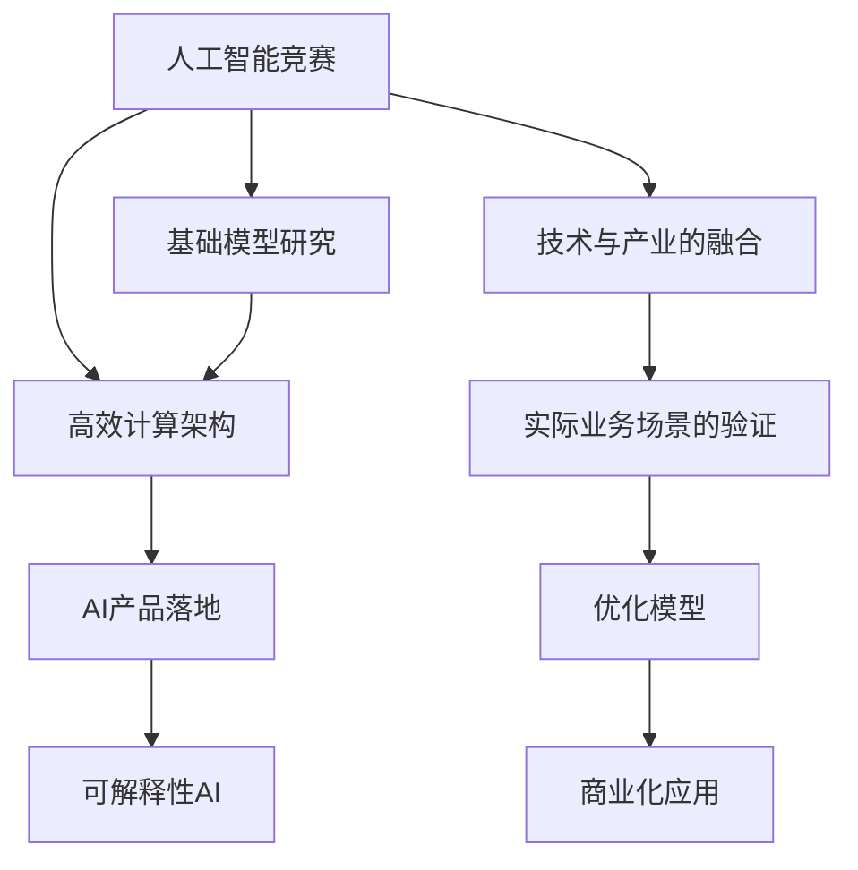
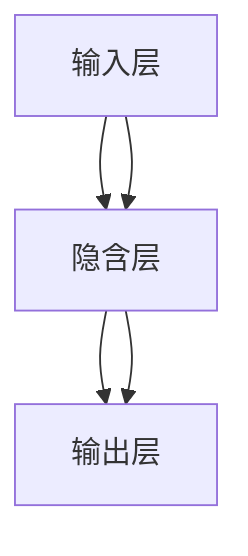
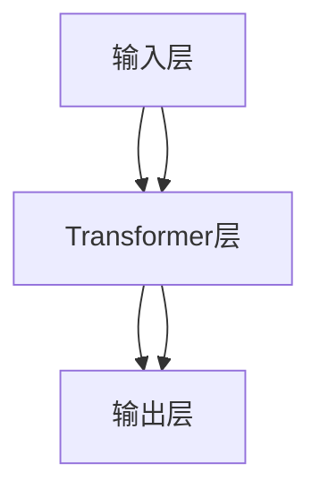

                 

# 硅谷的AI竞赛：贾扬清的观察，产品落地与基础模型研究并重

> 关键词：人工智能竞赛, 贾扬清, 产品落地, 基础模型研究, AI技术趋势, 行业应用案例

## 1. 背景介绍

### 1.1 问题由来
近年来，人工智能（AI）领域的竞赛逐渐成为科技巨头之间的角逐点，各大公司纷纷加码AI人才招聘，研究机构也不断涌现，力争在AI竞赛中占据领先地位。其中，谷歌、微软、Facebook、亚马逊等公司的高层领导纷纷发表公开讲话，对AI竞赛展开激烈讨论，推动了AI领域的快速发展。

在如此激烈的竞争环境中，贾扬清教授作为深度学习领域的技术巨头，对AI竞赛、AI技术趋势、AI基础模型研究以及产品落地进行了独到的观察和深入分析，形成了自己独特的见解。

### 1.2 问题核心关键点
贾扬清教授的研究聚焦于AI竞赛、基础模型研究以及AI技术在实际产品中的应用。他强调了在AI竞赛中的技术创新、对基础模型的深入研究以及对产品落地的关注，认为这三者构成了AI技术发展的关键环节。

在AI竞赛中，贾教授主张以创新性算法、高效数据集处理和优化的计算架构为手段，寻找更高效的解决方案；在基础模型研究方面，他强调要结合深度学习与传统机器学习的优势，发展高效、可解释性强的模型；在产品落地方面，他倡导技术与产业的深度融合，强调技术对业务的支撑作用。

### 1.3 问题研究意义
贾教授的研究有助于指导AI领域未来的发展方向，使得研究者和工程师能够更加明确在AI竞赛中应关注的技术点、模型研究的重点以及产品落地的关键点，从而提高AI技术在各行各业中的应用价值和效率。

## 2. 核心概念与联系

### 2.1 核心概念概述

为更好理解贾扬清教授的观点，本节将介绍几个密切相关的核心概念：

- **人工智能竞赛**：指的是各公司、研究机构之间通过比拼AI技术的创新能力和应用效果来争夺技术领先地位的活动。
- **基础模型研究**：指的是对深度学习模型、算法以及数据集等基础组件的研究。
- **AI产品落地**：指的是将AI技术转化为具体应用，通过实际业务场景的验证，不断优化模型，最终实现商业化应用的过程。
- **高效计算架构**：指的是一种能够高效进行数据处理和模型训练的计算框架，如分布式计算、GPU计算等。
- **可解释性AI**：指的是能够提供可理解性和透明度的AI模型，便于在实际业务场景中使用和解释。

这些核心概念之间的逻辑关系可以通过以下Mermaid流程图来展示：



这个流程图展示出人工智能竞赛、基础模型研究、高效计算架构、AI产品落地以及可解释性AI等概念之间的联系：

1. 人工智能竞赛推动基础模型研究的发展，促进高效计算架构的开发。
2. 基础模型研究在高效计算架构上实现创新，推动AI产品落地的实现。
3. AI产品落地验证了基础模型和技术架构的实际应用效果，并进一步优化模型和架构。
4. 可解释性AI在实际业务场景中提供了透明度，有利于技术的普及和落地。

这些概念共同构成了AI技术发展的逻辑链条，指导着AI领域的各个研究方向和实践活动。

## 3. 核心算法原理 & 具体操作步骤
### 3.1 算法原理概述

人工智能竞赛的核心在于通过创新性的算法和技术，提升模型的准确率和效率。其中，模型的准确率可以通过优化训练数据集、选择合适的模型结构和优化训练算法来提升；而模型的效率则可以通过高效计算架构和数据处理技术来提升。

在基础模型研究方面，深度学习算法已经成为主流的AI模型，但深度学习的“黑箱”特性也引发了对模型可解释性的研究，促使研究者开发了越来越多的可解释性AI模型。

AI产品落地的关键在于将技术优势转化为商业价值。在这一过程中，需要对实际业务场景进行深入分析，以确定最合适的技术方案，并对模型进行优化以适应实际业务需求。

### 3.2 算法步骤详解

**步骤一：数据准备和模型选择**
在人工智能竞赛中，数据准备和模型选择是首要步骤。数据需要经过清洗和预处理，以确保其质量符合模型的需求。同时，需要根据数据集的特点选择合适的模型结构，如卷积神经网络（CNN）、循环神经网络（RNN）、深度神经网络（DNN）等。

**步骤二：模型训练与优化**
模型训练需要使用大量的标注数据，并应用优化算法进行训练。常用的优化算法包括随机梯度下降（SGD）、Adam等。在训练过程中，需要对模型进行参数调优，以找到最优的模型参数。

**步骤三：模型评估与验证**
训练好的模型需要进行评估和验证，以确保其在实际业务场景中的表现。常用的评估指标包括准确率、召回率、F1值等。此外，还需要进行交叉验证，以确保模型的泛化能力。

**步骤四：技术整合与产业应用**
在模型验证后，需要将技术整合到实际业务场景中，实现产品的落地。这一过程包括数据处理、用户界面设计、系统集成等环节。同时，还需要进行产品测试，以确保其稳定性和可靠性。

**步骤五：持续优化与迭代**
技术产品在实际应用中，需要不断进行优化和迭代，以适应不断变化的市场需求和技术趋势。持续的优化和迭代是保持产品竞争力的关键。

### 3.3 算法优缺点

人工智能竞赛中的算法具有以下优点：
1. 推动技术创新：竞赛中涌现出的创新性算法和技术，有助于提升AI领域的技术水平。
2. 促进产业应用：竞赛中的技术和产品在实际业务场景中的应用，加速了AI技术的落地。
3. 提高研究质量：竞赛中的数据集和模型需要经过严格的验证和评估，从而提升了研究的质量和可靠性。

同时，这些算法也存在以下缺点：
1. 数据需求量大：竞赛中的数据集通常需要大量的标注数据，获取和处理这些数据的工作量较大。
2. 技术壁垒高：竞赛中的技术方案需要高度的专业知识，一般难以在短时间内掌握和应用。
3. 竞争激烈：竞赛中的竞争非常激烈，容易忽略实际应用效果，产生“数据驱动”而非“问题驱动”的现象。

尽管存在这些局限性，但人工智能竞赛仍然是推动AI技术发展的重要手段之一，能够激励研究者和工程师不断创新，提升技术水平。

### 3.4 算法应用领域

人工智能竞赛和基础模型研究已经广泛应用于多个领域，如自然语言处理（NLP）、计算机视觉（CV）、语音识别、推荐系统等。

- **自然语言处理**：如机器翻译、情感分析、文本分类等。竞赛中的创新性算法，如Transformer、BERT等，已经被广泛应用于各种NLP任务，取得了显著的性能提升。
- **计算机视觉**：如目标检测、图像分割、人脸识别等。竞赛中的算法和技术，如YOLO、ResNet等，在CV领域的应用效果显著。
- **语音识别**：如语音转文字、语音合成等。竞赛中的技术，如CTC（Connectionist Temporal Classification）算法，显著提升了语音识别的准确率。
- **推荐系统**：如协同过滤、基于深度学习的推荐等。竞赛中的技术，如基于深度学习的推荐算法，显著提高了推荐系统的推荐效果。

## 4. 数学模型和公式 & 详细讲解 & 举例说明
### 4.1 数学模型构建

在本节中，我们将以深度学习模型为例，对模型的构建和优化过程进行详细的数学描述。

设有一个深度神经网络模型，其结构如图：



模型通过前向传播计算输出，并使用损失函数对模型进行优化。常用的损失函数包括均方误差（MSE）、交叉熵（Cross Entropy）等。

### 4.2 公式推导过程

对于深度神经网络模型，其前向传播计算输出为：

$$
y = f(\text{W}x + b)
$$

其中，$f$ 为激活函数，$x$ 为输入数据，$\text{W}$ 为权重矩阵，$b$ 为偏置项。

常用的激活函数包括ReLU、Sigmoid、Tanh等。

模型训练的目标是最小化损失函数，常用的优化算法包括梯度下降（GD）、随机梯度下降（SGD）、Adam等。以SGD算法为例，其更新公式为：

$$
\theta \leftarrow \theta - \eta \nabla_{\theta}L
$$

其中，$\theta$ 为模型参数，$\eta$ 为学习率，$\nabla_{\theta}L$ 为损失函数对参数的梯度。

### 4.3 案例分析与讲解

以BERT模型为例，介绍其基础模型研究中的一些关键点：

BERT模型是由Google开发的，其核心思想是通过预训练来学习语言的上下文信息。BERT模型的结构如下：



其中，输入层将文本转化为数字向量，Transformer层负责模型前向传播，输出层将向量转化为模型输出。

BERT模型的预训练过程主要包括以下两个步骤：

1. 自监督学习：使用大规模无标签文本数据进行预训练，通过Masked Language Model（MLM）和Next Sentence Prediction（NSP）任务来训练模型。
2. Fine-tuning：在预训练的基础上，使用标注数据对模型进行微调，以适应特定的任务需求。

通过BERT模型，研究者可以实现高效的NLP任务，如文本分类、情感分析、命名实体识别等。

## 5. 项目实践：代码实例和详细解释说明
### 5.1 开发环境搭建

在开始项目实践前，需要先搭建好开发环境。以下是使用Python进行PyTorch开发的环境配置流程：

1. 安装Anaconda：从官网下载并安装Anaconda，用于创建独立的Python环境。
2. 创建并激活虚拟环境：
```bash
conda create -n pytorch-env python=3.8 
conda activate pytorch-env
```
3. 安装PyTorch：根据CUDA版本，从官网获取对应的安装命令。例如：
```bash
conda install pytorch torchvision torchaudio cudatoolkit=11.1 -c pytorch -c conda-forge
```
4. 安装Transformers库：
```bash
pip install transformers
```
5. 安装各类工具包：
```bash
pip install numpy pandas scikit-learn matplotlib tqdm jupyter notebook ipython
```

完成上述步骤后，即可在`pytorch-env`环境中开始项目实践。

### 5.2 源代码详细实现

以下是一个简单的代码实例，用于训练一个深度学习模型：

```python
import torch
import torch.nn as nn
import torch.optim as optim
from torch.utils.data import DataLoader

# 定义模型
class Model(nn.Module):
    def __init__(self):
        super(Model, self).__init__()
        self.fc1 = nn.Linear(784, 128)
        self.fc2 = nn.Linear(128, 10)
    
    def forward(self, x):
        x = nn.functional.relu(self.fc1(x))
        x = nn.functional.dropout(x, training=self.training)
        x = self.fc2(x)
        return x

# 准备数据集
train_data = ...
test_data = ...
train_loader = DataLoader(train_data, batch_size=32, shuffle=True)
test_loader = DataLoader(test_data, batch_size=32, shuffle=False)

# 定义优化器和损失函数
model = Model()
criterion = nn.CrossEntropyLoss()
optimizer = optim.SGD(model.parameters(), lr=0.01)

# 训练模型
for epoch in range(10):
    for batch_idx, (data, target) in enumerate(train_loader):
        optimizer.zero_grad()
        output = model(data.view(data.size(0), -1))
        loss = criterion(output, target)
        loss.backward()
        optimizer.step()
```

### 5.3 代码解读与分析

在上面的代码中，我们定义了一个简单的多层感知器（MLP）模型，并使用交叉熵损失函数进行训练。模型使用PyTorch的优化器（SGD）进行优化，并在训练过程中使用Dropout技术进行正则化。

模型训练过程包括数据加载、模型前向传播、计算损失、反向传播和参数更新等步骤。通过循环迭代训练多个epoch，最终得到一个性能较好的模型。

## 6. 实际应用场景
### 6.1 智能客服系统

基于人工智能竞赛和基础模型的智能客服系统，已经在多个企业中得到了广泛应用。传统的客服系统依赖人工客服，高峰期响应速度慢且容易疲劳，无法满足客户的需求。通过基于深度学习的智能客服系统，企业能够实现24小时不间断服务，快速响应客户咨询，提升客户满意度。

在实际应用中，智能客服系统可以通过预训练和微调技术，结合客户的历史对话记录，不断优化模型，使其能够理解和回答客户问题，并提供个性化服务。

### 6.2 金融舆情监测

金融市场舆情监测是金融行业的重要应用场景之一。通过基于深度学习的自然语言处理技术，系统可以实时监测市场舆情，及时发现负面信息，预警潜在的金融风险。

在金融舆情监测中，深度学习模型可以对新闻、评论、社交媒体等海量数据进行自动分析和处理，识别出市场情绪的变化趋势，从而帮助金融机构做出更准确的决策。

### 6.3 个性化推荐系统

个性化推荐系统是电子商务和社交网络中的核心功能之一。通过深度学习模型，推荐系统可以根据用户的历史行为数据，推荐符合用户兴趣的商品或内容，提升用户满意度和粘性。

在推荐系统中，深度学习模型可以处理多模态数据，如文本、图片、视频等，为用户提供更全面、精准的推荐。同时，通过预训练和微调技术，模型能够不断优化，提升推荐效果。

### 6.4 未来应用展望

未来，人工智能竞赛和基础模型研究将继续推动AI技术的发展，带来更多的创新和突破。以下是一些未来的发展趋势：

1. **多模态融合**：未来AI竞赛和基础模型研究将更多地关注多模态数据的融合，如视觉、语音、文本等，提升AI系统的感知和理解能力。
2. **可解释性AI**：研究者将更加重视AI模型的可解释性，使AI系统能够提供透明的决策过程和解释，增强用户的信任。
3. **联邦学习**：联邦学习技术将使得AI模型能够在不共享数据的情况下进行训练，保护用户隐私，同时提升模型的泛化能力。
4. **边缘计算**：边缘计算技术将使得AI系统能够在本地设备上进行高效计算，提升AI系统的实时性和响应速度。
5. **跨领域融合**：未来AI竞赛和基础模型研究将更多地关注跨领域的融合，如AI与物联网、区块链、工业互联网等技术的结合，带来新的应用场景和商业价值。

## 7. 工具和资源推荐
### 7.1 学习资源推荐

为了帮助开发者系统掌握人工智能竞赛和基础模型研究的理论基础和实践技巧，这里推荐一些优质的学习资源：

1. 《深度学习》（Deep Learning）书籍：Ian Goodfellow等著，全面介绍了深度学习的基本原理和应用。
2. Coursera《深度学习专项课程》：由深度学习领域知名专家Andrew Ng讲授，涵盖深度学习的基本原理、模型训练和优化等。
3. Kaggle竞赛平台：提供丰富的数据集和竞赛项目，适合锻炼深度学习和模型训练技能。
4. PyTorch官方文档：PyTorch官方文档，提供了全面的API和实例，适合学习和实践深度学习。
5. HuggingFace官方文档：HuggingFace官方文档，提供了丰富的预训练模型和代码示例，适合学习和实践NLP任务。

通过对这些资源的学习实践，相信你一定能够快速掌握人工智能竞赛和基础模型研究的精髓，并用于解决实际的AI问题。

### 7.2 开发工具推荐

高效的开发离不开优秀的工具支持。以下是几款用于人工智能竞赛和基础模型研究开发的常用工具：

1. PyTorch：基于Python的开源深度学习框架，灵活动态的计算图，适合快速迭代研究。
2. TensorFlow：由Google主导开发的开源深度学习框架，生产部署方便，适合大规模工程应用。
3. Jupyter Notebook：交互式的开发环境，适合快速编写和测试代码。
4. Weights & Biases：模型训练的实验跟踪工具，可以记录和可视化模型训练过程中的各项指标，方便对比和调优。
5. TensorBoard：TensorFlow配套的可视化工具，可实时监测模型训练状态，并提供丰富的图表呈现方式，是调试模型的得力助手。

合理利用这些工具，可以显著提升人工智能竞赛和基础模型研究的开发效率，加快创新迭代的步伐。

### 7.3 相关论文推荐

人工智能竞赛和基础模型研究的发展源于学界的持续研究。以下是几篇奠基性的相关论文，推荐阅读：

1. "Training Recurrent Neural Networks by Minimizing the Prediction Error"：Hochreiter和Schmidhuber，提出RNN结构，开启了深度学习在自然语言处理中的应用。
2. "ImageNet Classification with Deep Convolutional Neural Networks"：Krizhevsky等，提出卷积神经网络（CNN）结构，推动了计算机视觉的发展。
3. "BERT: Pre-training of Deep Bidirectional Transformers for Language Understanding"：Devlin等，提出BERT模型，提升了自然语言处理的效果。
4. "Google's Neural Machine Translation System: Bridging the Gap between Human and Machine Translation"：Wu等，提出Transformer结构，推动了机器翻译技术的发展。
5. "AlphaGo Zero"：Silver等，提出强化学习技术，推动了人工智能在围棋等游戏领域的应用。

这些论文代表了大规模模型研究的发展脉络。通过学习这些前沿成果，可以帮助研究者把握学科前进方向，激发更多的创新灵感。

## 8. 总结：未来发展趋势与挑战
### 8.1 研究成果总结

本文对基于深度学习的AI竞赛和基础模型研究进行了全面系统的介绍。首先阐述了AI竞赛和基础模型研究的研究背景和意义，明确了其在推动AI技术发展中的重要作用。其次，从原理到实践，详细讲解了AI竞赛和基础模型研究的数学原理和关键步骤，给出了实际应用中的代码实例。同时，本文还广泛探讨了AI竞赛和基础模型研究在智能客服、金融舆情、个性化推荐等实际场景中的应用前景，展示了其在产业中的广泛价值。

通过对这些关键点的系统梳理，可以看到，基于深度学习的AI竞赛和基础模型研究正在成为AI技术发展的核心推动力，为AI技术在各行各业的应用提供了坚实的基础。

### 8.2 未来发展趋势

展望未来，人工智能竞赛和基础模型研究将呈现以下几个发展趋势：

1. **模型规模继续扩大**：随着计算资源的丰富和硬件性能的提升，深度学习模型的规模将持续扩大，能够处理更加复杂和多样化的数据。
2. **可解释性AI成为焦点**：未来的AI竞赛和基础模型研究将更加重视AI模型的可解释性，使AI系统能够提供透明的决策过程和解释，增强用户的信任。
3. **联邦学习与边缘计算**：联邦学习和边缘计算技术将使得AI系统能够在本地设备上进行高效计算，提升AI系统的实时性和响应速度。
4. **跨领域融合**：未来AI竞赛和基础模型研究将更多地关注跨领域的融合，如AI与物联网、区块链、工业互联网等技术的结合，带来新的应用场景和商业价值。

以上趋势凸显了人工智能竞赛和基础模型研究技术的广阔前景。这些方向的探索发展，必将进一步提升AI技术在各行各业中的应用价值和效率。

### 8.3 面临的挑战

尽管人工智能竞赛和基础模型研究已经取得了瞩目成就，但在迈向更加智能化、普适化应用的过程中，它仍面临着诸多挑战：

1. **数据需求量大**：AI竞赛和基础模型研究通常需要大量的标注数据，获取和处理这些数据的工作量较大。
2. **技术壁垒高**：AI竞赛和基础模型研究需要高度的专业知识，一般难以在短时间内掌握和应用。
3. **模型泛化能力不足**：现有的深度学习模型在特定领域的数据集上表现较好，但在跨领域的数据集上泛化能力较差。
4. **计算资源消耗大**：深度学习模型的计算资源消耗较大，需要高性能的计算设备和大量的训练时间。
5. **可解释性不足**：当前深度学习模型具有“黑箱”特性，难以解释其内部工作机制和决策逻辑。

这些挑战需要在未来的研究和实践中不断克服，以推动人工智能竞赛和基础模型研究技术的进一步发展。

### 8.4 研究展望

面对人工智能竞赛和基础模型研究所面临的挑战，未来的研究需要在以下几个方面寻求新的突破：

1. **探索高效的数据处理和模型训练方法**：如数据增强、模型剪枝、量化加速等技术，以降低数据需求和计算资源消耗。
2. **发展可解释性AI**：引入符号化先验知识，开发更可解释的深度学习模型，提升AI系统的透明度和可信度。
3. **优化跨领域泛化能力**：通过迁移学习、联邦学习等技术，提升深度学习模型在跨领域数据集上的泛化能力。
4. **应用边缘计算和联邦学习**：在本地设备和分布式系统上进行高效计算，提升AI系统的实时性和响应速度。
5. **推动跨领域融合**：加强AI与物联网、区块链、工业互联网等技术的结合，带来新的应用场景和商业价值。

这些研究方向的探索，必将引领人工智能竞赛和基础模型研究技术的进一步发展，推动AI技术在各行各业中的广泛应用。

## 9. 附录：常见问题与解答

**Q1：如何选择合适的模型和算法？**

A: 选择模型和算法时，需要根据具体任务的特点进行选择。例如，对于分类任务，可以选择RNN、CNN等模型；对于生成任务，可以选择Seq2Seq、Transformer等模型。同时，还需要考虑模型的复杂度和训练效率，选择适合的优化算法和正则化技术。

**Q2：如何提升模型的泛化能力？**

A: 提升模型的泛化能力可以通过以下方法：
1. 数据增强：使用数据增强技术，增加训练集的多样性。
2. 迁移学习：使用迁移学习技术，利用预训练模型的知识进行微调。
3. 正则化：使用正则化技术，如L2正则、Dropout等，减少模型的过拟合。
4. 联邦学习：使用联邦学习技术，在本地设备上进行训练，保护用户隐私。

**Q3：如何处理数据集的不平衡问题？**

A: 数据集不平衡可以通过以下方法进行处理：
1. 重采样：使用欠采样和过采样技术，使数据集的分布更加平衡。
2. 权重调整：对少数类样本进行权重调整，增加其在损失函数中的权重。
3. 生成合成样本：使用生成对抗网络（GAN）等技术，生成合成样本，增加少数类的样本数量。

**Q4：如何进行模型的参数优化？**

A: 模型参数优化可以通过以下方法进行：
1. 学习率调整：使用学习率衰减、自适应学习率等技术，调整学习率。
2. 梯度裁剪：使用梯度裁剪技术，防止梯度爆炸或消失。
3. 随机化初始化：使用随机初始化技术，增加模型的鲁棒性。

这些方法可以结合使用，提高模型的泛化能力和优化效果。

通过本文的系统梳理，可以看到，基于深度学习的AI竞赛和基础模型研究正在成为AI技术发展的核心推动力，为AI技术在各行各业的应用提供了坚实的基础。未来，随着技术的发展和应用的深入，AI竞赛和基础模型研究将带来更多的创新和突破，推动AI技术在更广泛的场景中落地应用。

---

作者：禅与计算机程序设计艺术 / Zen and the Art of Computer Programming

