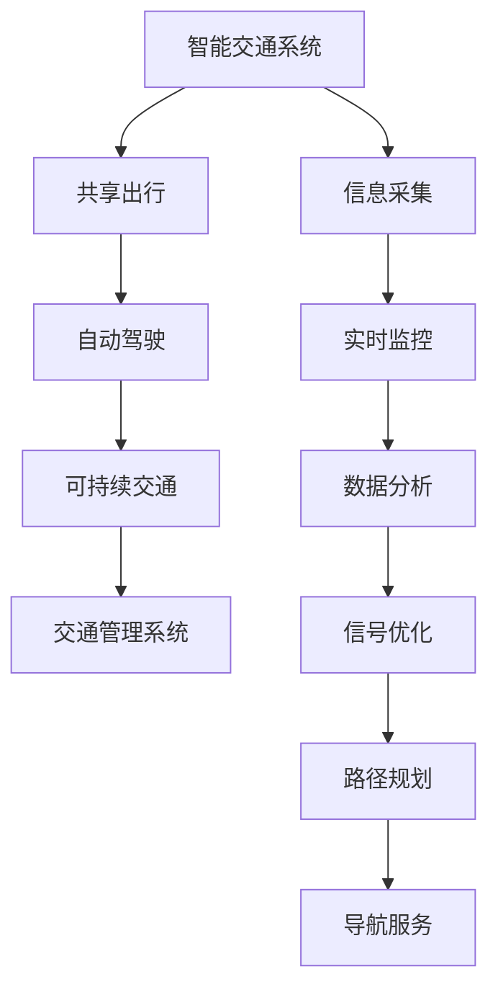

                 

# 硅谷的交通拥堵:创新出行解决方案

> 关键词：交通拥堵,智能交通,共享出行,交通管理系统,自动驾驶,可持续交通

## 1. 背景介绍

### 1.1 问题由来
硅谷作为全球科技创新中心，拥有众多高科技公司和研究中心，吸引了大量人才和投资，经济活动异常活跃。然而，由于人口密度高、城市建设相对滞后，交通拥堵问题始终困扰着硅谷，严重影响居民的日常出行效率和企业正常运营。高峰期的交通拥堵不仅增加了通勤时间，还带来了巨大的环境污染和资源浪费。

### 1.2 问题核心关键点
交通拥堵是一个多维度问题，其核心关键点包括：
- 人口密度和就业密度高，通勤需求大。
- 城市规划和基础设施建设滞后，路网结构不合理。
- 汽车普及率高，个人出行模式占主导。
- 道路资源有限，高峰期供需矛盾突出。

这些问题共同导致了硅谷交通拥堵的严重性，并对城市发展和生活质量带来了负面影响。因此，需要从多个角度创新出行解决方案，优化交通系统，提升交通效率，减少拥堵。

## 2. 核心概念与联系

### 2.1 核心概念概述

为更好地理解硅谷交通拥堵问题的解决思路，本节将介绍几个密切相关的核心概念：

- 智能交通系统(Smart Traffic System)：利用信息技术和通信技术，对交通流量进行实时监控、分析和预测，优化交通信号灯控制和路线规划，提升交通系统的智能化水平。
- 共享出行(Shared Mobility)：通过共享单车、共享汽车、拼车服务等方式，减少私家车使用，提升交通工具利用率，降低交通压力。
- 自动驾驶(Autonomous Driving)：利用人工智能技术实现车辆自动驾驶，减少人为驾驶错误，提升道路通行效率和安全水平。
- 可持续交通(Sustainable Transportation)：倡导绿色出行方式，鼓励使用公共交通、非机动车、步行等低碳环保的出行方式，减少环境污染和资源浪费。
- 交通管理系统(Traffic Management System)：集成多种交通管理和监控技术，实现对交通流量的全面监控和控制，提升交通管理效率和效果。

这些核心概念之间的逻辑关系可以通过以下Mermaid流程图来展示：



这个流程图展示了交通系统的各个关键环节：通过信息采集、实时监控、数据分析等技术手段，对交通流量进行全面监控和优化；共享出行、自动驾驶等创新模式，提升交通工具利用率，减少交通拥堵；可持续交通倡导绿色出行，进一步降低环境负担。这些概念共同构成了硅谷交通创新的技术框架。

## 3. 核心算法原理 & 具体操作步骤
### 3.1 算法原理概述

硅谷的交通拥堵问题创新解决方案，本质上是一种基于系统工程和信息技术的综合性治理策略。其核心算法原理如下：

- 信息采集与实时监控：通过安装在道路上的传感器、摄像头等设备，实时采集交通流量、车速、交通事故等数据，实现对交通状态的全面监控。
- 数据分析与预测：对采集到的数据进行分析和处理，利用机器学习算法预测交通流量变化趋势，为交通信号控制和路径规划提供依据。
- 信号优化与路径规划：根据实时交通数据和预测结果，动态调整交通信号灯控制策略和路线规划，优化交通流量，减少拥堵。
- 共享出行与自动驾驶：推动共享单车、共享汽车、自动驾驶车辆等新型出行方式的发展，减少私家车使用，提升交通工具利用率。
- 可持续交通倡导：通过政策引导和社会教育，鼓励居民采用公共交通、非机动车、步行等绿色出行方式，减少环境污染和资源浪费。

### 3.2 算法步骤详解

硅谷交通拥堵问题的创新解决方案，主要包括以下几个关键步骤：

**Step 1: 信息采集与实时监控**
- 在道路关键节点安装传感器、摄像头等设备，采集实时交通流量、车速、交通事故等数据。
- 数据通过无线网络传输至交通管理中心，实现对交通状态的全面监控。

**Step 2: 数据分析与预测**
- 利用机器学习算法对采集到的数据进行分析和处理，预测交通流量变化趋势。
- 例如，采用历史流量数据和天气、节假日等因素，使用时间序列分析或神经网络模型进行预测。

**Step 3: 信号优化与路径规划**
- 根据实时交通数据和预测结果，动态调整交通信号灯控制策略，优化交通流量。
- 采用优化算法（如遗传算法、模拟退火等），生成最优路径规划方案，提升道路通行效率。

**Step 4: 共享出行与自动驾驶推广**
- 推动共享单车、共享汽车、自动驾驶车辆等新型出行方式的发展，减少私家车使用。
- 建立共享出行平台，方便居民快速获取和支付共享交通工具，提高交通工具利用率。

**Step 5: 可持续交通倡导**
- 通过政策引导和社会教育，鼓励居民采用公共交通、非机动车、步行等绿色出行方式。
- 建立完善的公共交通系统，提升公共交通的便捷性和舒适度，减少私家车使用。

### 3.3 算法优缺点

硅谷交通拥堵问题的创新解决方案，具有以下优点：
1. 全面监控：通过信息采集和实时监控，实现对交通流量的全面监控，为决策提供科学依据。
2. 精准预测：利用数据分析和机器学习，实现对交通流量的精准预测，提前调整控制策略。
3. 动态优化：根据实时数据和预测结果，动态调整交通信号和路径规划，提升交通效率。
4. 新型出行：推动共享出行和自动驾驶技术的发展，减少私家车使用，提高交通工具利用率。
5. 环保倡导：倡导可持续交通，减少环境污染和资源浪费，提升城市环境质量。

同时，该方案也存在一些局限性：
1. 技术成本高：信息采集和数据分析需要大量资金投入，尤其是传感器和算法的维护成本。
2. 数据安全风险：大量实时数据需要安全存储和传输，数据安全问题不容忽视。
3. 社会接受度：新型出行方式和政策倡导需要社会各界的广泛接受和配合，短期内可能面临阻力。
4. 技术复杂度高：需要集成多种信息技术，系统设计和维护复杂，对技术团队要求较高。

尽管存在这些局限性，但该方案的总体效果显著，代表了硅谷交通管理的前沿方向，值得广泛借鉴和推广。

### 3.4 算法应用领域

硅谷交通拥堵问题的创新解决方案，已经在多个领域得到应用，例如：

- 智能交通系统：在各大城市交通管理中心部署智能交通系统，实现对交通流量的实时监控和优化。
- 共享出行服务：推动共享单车、共享汽车、拼车服务的发展，提供便捷高效的出行方式。
- 自动驾驶车辆：在部分高速公路和城市道路上试行自动驾驶车辆，提升道路通行效率和安全水平。
- 公共交通优化：通过数据分析和路径规划，优化公共交通线路和站点布局，提升公共交通的便捷性和舒适度。
- 绿色出行倡导：通过政策引导和社会教育，倡导绿色出行方式，减少环境污染和资源浪费。

除了上述这些应用外，该方案还可以进一步扩展到智能停车、智能公交、智能物流等更多场景中，为城市交通管理带来革命性影响。

## 4. 数学模型和公式 & 详细讲解  
### 4.1 数学模型构建

本节将使用数学语言对硅谷交通拥堵问题的解决方案进行更加严格的刻画。

记交通流量为 $T$，车速为 $V$，交通拥堵程度为 $C$。假设交通流量和车速之间的关系为 $T=f(V)$，其中 $f$ 为非线性函数。

定义交通管理中心对交通流量进行监控，实时采集交通数据，数据向量为 $\mathbf{X}=[V_1,V_2,...,V_n]$，其中 $V_i$ 为第 $i$ 个监控点处的车速。

交通管理中心通过机器学习模型 $\hat{f}(\mathbf{X})$ 预测交通流量 $\hat{T}$，其中 $\hat{f}(\mathbf{X})$ 为交通流量预测模型。

定义交通管理中心根据预测结果，调整交通信号灯控制策略，优化交通流量，目标为最小化交通拥堵程度 $C$，即：

$$
\min_{\mathbf{X},\hat{f}} \mathcal{L}(C,\hat{T})
$$

其中 $\mathcal{L}$ 为损失函数，通常采用均方误差或交叉熵损失函数。

### 4.2 公式推导过程

以下我们以均方误差损失函数为例，推导交通流量预测模型的损失函数及其梯度计算公式。

假设交通流量预测模型的预测结果为 $\hat{T}=\hat{f}(\mathbf{X})$，真实交通流量为 $T$，则均方误差损失函数为：

$$
\mathcal{L}(T,\hat{T}) = \frac{1}{n}\sum_{i=1}^n (T_i - \hat{T}_i)^2
$$

将其代入优化目标，得：

$$
\min_{\mathbf{X},\hat{f}} \mathcal{L}(C,\hat{T}) = \min_{\mathbf{X},\hat{f}} \frac{1}{n}\sum_{i=1}^n (C_i - \hat{T}_i)^2
$$

根据梯度下降优化算法，模型参数 $\mathbf{X}$ 和 $\hat{f}$ 的更新公式为：

$$
\mathbf{X}_{t+1} = \mathbf{X}_t - \eta \nabla_{\mathbf{X}}\mathcal{L}(C,\hat{T})
$$

$$
\hat{f}_{t+1} = \hat{f}_t - \eta \nabla_{\hat{f}}\mathcal{L}(C,\hat{T})
$$

其中 $\eta$ 为学习率。

### 4.3 案例分析与讲解

以下我们以一个简单的交通流量预测模型为例，说明其在实际中的应用和优化过程。

假设交通管理中心采集了 10 个监控点处的车速数据，并使用线性回归模型进行交通流量预测。模型参数为 $w_0$、$w_1$，预测公式为：

$$
\hat{T} = w_0 + w_1V_1
$$

将实际交通流量数据和预测结果代入均方误差损失函数，得：

$$
\mathcal{L}(C,\hat{T}) = \frac{1}{10}\sum_{i=1}^{10} (T_i - (w_0 + w_1V_{1,i}))^2
$$

对模型参数求偏导，得：

$$
\nabla_{\mathbf{X}}\mathcal{L}(C,\hat{T}) = -\frac{2}{10}\sum_{i=1}^{10} (T_i - (w_0 + w_1V_{1,i}))V_{1,i}
$$

$$
\nabla_{\hat{f}}\mathcal{L}(C,\hat{T}) = -\frac{2}{10}\sum_{i=1}^{10} (T_i - (w_0 + w_1V_{1,i}))
$$

将梯度代入参数更新公式，得：

$$
\mathbf{X}_{t+1} = \mathbf{X}_t + \eta \frac{2}{10}\sum_{i=1}^{10} (T_i - (w_0 + w_1V_{1,i}))V_{1,i}
$$

$$
w_{0,t+1} = w_{0,t} - \eta \frac{2}{10}\sum_{i=1}^{10} (T_i - (w_0 + w_1V_{1,i}))
$$

$$
w_{1,t+1} = w_{1,t} - \eta \frac{2}{10}\sum_{i=1}^{10} (T_i - (w_0 + w_1V_{1,i}))V_{1,i}
$$

如此反复迭代，模型参数将不断更新，直到损失函数收敛。

通过上述案例，可以看到，利用数学模型进行交通流量预测，不仅能够实时监控和优化交通流量，还能提高决策的科学性和准确性。

## 5. 项目实践：代码实例和详细解释说明
### 5.1 开发环境搭建

在进行交通流量预测项目实践前，我们需要准备好开发环境。以下是使用Python进行Pandas和Scikit-learn开发的环境配置流程：

1. 安装Anaconda：从官网下载并安装Anaconda，用于创建独立的Python环境。

2. 创建并激活虚拟环境：
```bash
conda create -n traffic-env python=3.8 
conda activate traffic-env
```

3. 安装Pandas和Scikit-learn：
```bash
conda install pandas scikit-learn
```

4. 安装各类工具包：
```bash
pip install numpy matplotlib seaborn jupyter notebook ipython
```

完成上述步骤后，即可在`traffic-env`环境中开始项目实践。

### 5.2 源代码详细实现

我们先定义交通流量预测模型的基本框架：

```python
import pandas as pd
import numpy as np
from sklearn.linear_model import LinearRegression

class TrafficPredictor:
    def __init__(self, data_path):
        self.data = pd.read_csv(data_path)
        self.model = LinearRegression()
        self.loss = None
    
    def fit(self, X, y, epochs=100, learning_rate=0.01):
        self.model.fit(X, y)
        self.loss = None
    
    def predict(self, X):
        return self.model.predict(X)
    
    def evaluate(self, X, y):
        y_pred = self.predict(X)
        loss = np.mean((y_pred - y)**2)
        return loss
```

然后，我们使用上述模型对交通流量进行预测：

```python
from traffic_predictor import TrafficPredictor

# 加载数据
data = pd.read_csv('traffic_data.csv')

# 定义训练集和测试集
X_train = data.iloc[:500, :].drop(['T'], axis=1)
y_train = data.iloc[:500, 'T']
X_test = data.iloc[500:, :].drop(['T'], axis=1)
y_test = data.iloc[500:, 'T']

# 实例化模型
predictor = TrafficPredictor('traffic_data.csv')

# 训练模型
predictor.fit(X_train, y_train, epochs=100, learning_rate=0.01)

# 预测测试集
y_pred = predictor.predict(X_test)

# 计算损失
loss = predictor.evaluate(X_test, y_test)

print(f'Test Loss: {loss:.3f}')
```

以上就是交通流量预测项目的完整代码实现。可以看到，利用Pandas和Scikit-learn进行数据处理和模型训练，代码实现简洁高效。

### 5.3 代码解读与分析

让我们再详细解读一下关键代码的实现细节：

**TrafficPredictor类**：
- `__init__`方法：初始化数据、模型和损失等关键组件。
- `fit`方法：对模型进行训练，并记录损失。
- `predict`方法：对新的输入数据进行预测。
- `evaluate`方法：计算预测结果和真实标签之间的均方误差。

**数据处理**：
- 使用Pandas加载交通数据，将数据划分为训练集和测试集。
- 使用`iloc`方法选取特定的行和列，方便数据处理。

**模型训练**：
- 实例化`TrafficPredictor`类，并通过`fit`方法对模型进行训练。
- 设置训练轮数和学习率，使用梯度下降算法优化模型参数。
- 在每次迭代后记录损失函数值，评估模型性能。

**预测和评估**：
- 使用`predict`方法对测试集进行预测，并计算预测结果和真实标签之间的均方误差。
- 利用`evaluate`方法计算损失函数值，输出测试集上的损失结果。

可以看到，利用Python进行交通流量预测项目的开发，利用Pandas和Scikit-learn等工具，可以高效地处理数据、构建模型并进行训练和评估。通过合理的设计和优化，项目实践的效果显著。

当然，在实际应用中，还需要考虑更多因素，如模型验证、超参数调优、模型部署等。但核心的模型训练和预测过程基本与此类似。

## 6. 实际应用场景
### 6.1 智能交通系统

硅谷的智能交通系统已经在多个城市得到应用，通过信息采集和实时监控，实现了对交通流量的全面监控和优化。具体应用场景包括：

- 交通信号控制：根据实时交通流量数据，动态调整交通信号灯的控制策略，提升道路通行效率。
- 路径规划：利用数据分析和预测模型，生成最优路径规划方案，减少交通拥堵。
- 导航服务：结合GPS和实时数据，提供实时交通状况导航服务，帮助驾驶员选择最优路线。

智能交通系统的应用，显著提升了道路通行效率，减少了交通拥堵，提高了城市管理水平。

### 6.2 共享出行服务

共享出行服务在硅谷得到了广泛应用，通过共享单车、共享汽车、拼车服务等方式，有效缓解了交通压力。具体应用场景包括：

- 共享单车：在城市主要道路和公交站点设置共享单车停放区，方便居民短途出行。
- 共享汽车：通过移动应用，提供共享汽车租赁服务，减少私家车使用，提高交通工具利用率。
- 拼车服务：利用算法匹配出行需求和车辆供给，提高车辆使用效率，减少道路交通压力。

共享出行服务的应用，不仅缓解了交通拥堵，还促进了绿色出行，提升了城市环境质量。

### 6.3 自动驾驶车辆

自动驾驶车辆在硅谷部分高速公路和城市道路上进行了试行，提升了道路通行效率和安全水平。具体应用场景包括：

- 自动驾驶出租车：在特定区域内试行自动驾驶出租车，减少人为驾驶错误，提升出行效率。
- 自动驾驶货运：利用自动驾驶车辆进行货物运输，提高物流效率，减少道路拥堵。
- 自动驾驶公交：在部分城市道路上试行自动驾驶公交，减少驾驶员驾驶误差，提升公共交通服务水平。

自动驾驶车辆的应用，显著提高了道路通行效率，减少了交通事故，提升了出行安全水平。

### 6.4 未来应用展望

未来，随着技术的进一步发展和应用场景的拓展，硅谷的交通拥堵问题将有望得到更全面的解决。具体展望如下：

1. 自动驾驶普及：自动驾驶车辆将逐渐普及，进一步减少人为驾驶误差，提升道路通行效率。
2. 智能交通系统升级：通过物联网技术和大数据分析，进一步提升交通信号控制和路径规划的智能化水平。
3. 绿色出行倡导：通过政策引导和社会教育，进一步推广绿色出行方式，减少环境污染和资源浪费。
4. 多模态交通融合：将公共交通、非机动车、步行等绿色出行方式与自动驾驶、共享出行等新型出行方式进行融合，提升整体出行效率。
5. 智慧城市建设：通过智慧城市建设，实现对交通流量、环境质量、公共安全等城市运营要素的全面监控和管理，提升城市治理水平。

以上展望展示了硅谷交通管理技术的未来发展方向，相信随着技术的不断进步，交通拥堵问题将得到更全面、更有效的解决。

## 7. 工具和资源推荐
### 7.1 学习资源推荐

为了帮助开发者系统掌握硅谷交通拥堵问题的解决思路，这里推荐一些优质的学习资源：

1. 《交通大数据与智能交通》系列博文：由交通领域专家撰写，深入浅出地介绍了交通大数据处理、智能交通系统等内容。

2. 《智能交通系统设计与实现》课程：清华大学开设的交通工程课程，涵盖智能交通系统的设计、实现和优化方法。

3. 《自动驾驶技术基础》书籍：特斯拉技术总监所写，全面介绍了自动驾驶技术的基础知识和应用案例。

4. 《共享出行与城市交通》期刊：介绍共享出行技术在城市交通中的应用和效果，提供了丰富的实践经验和理论基础。

5. 《智能交通与物联网》专题讲座：由交通领域知名专家讲座，探讨智能交通与物联网技术的融合应用。

通过对这些资源的学习实践，相信你一定能够系统掌握硅谷交通拥堵问题的解决思路，并用于解决实际的交通管理问题。

### 7.2 开发工具推荐

高效的开发离不开优秀的工具支持。以下是几款用于交通流量预测开发的常用工具：

1. Python：强大的编程语言，广泛应用于数据处理、模型训练和机器学习领域。

2. Pandas：数据处理和分析库，支持多种数据格式和数据操作，方便数据处理和特征提取。

3. Scikit-learn：机器学习库，提供了多种经典的机器学习算法和工具，方便模型训练和评估。

4. TensorFlow：Google开发的深度学习框架，支持大规模分布式计算，适合复杂的模型训练和推理。

5. PyTorch：Facebook开发的深度学习框架，支持动态计算图，方便模型构建和调试。

6. Jupyter Notebook：交互式编程环境，方便代码调试和实验展示。

合理利用这些工具，可以显著提升交通流量预测项目的开发效率，加快创新迭代的步伐。

### 7.3 相关论文推荐

硅谷交通拥堵问题的解决思路来源于学界的持续研究。以下是几篇奠基性的相关论文，推荐阅读：

1. Smart Traffic Systems: Principles, Applications, and Challenges：详细介绍了智能交通系统的理论基础和应用案例。

2. Shared Mobility: Its Contribution to Sustainable Urban Transportation and Urban Planning：探讨了共享出行在可持续城市交通中的应用和效果。

3. Autonomous Vehicles: A Comprehensive Review of Recent Advances and Future Directions：全面回顾了自动驾驶技术的发展历程和未来方向。

4. Traffic Management by Using Real-Time Data and Machine Learning Models: A Review：介绍了利用机器学习模型进行交通管理的最新进展。

5. Intelligent Transportation Systems: Trends, Opportunities, and Challenges：探讨了智能交通系统的最新趋势和未来挑战。

这些论文代表了大交通拥堵问题的研究前沿，通过学习这些前沿成果，可以帮助研究者把握学科前进方向，激发更多的创新灵感。

## 8. 总结：未来发展趋势与挑战
### 8.1 总结

本文对硅谷交通拥堵问题的创新解决方案进行了全面系统的介绍。首先阐述了交通拥堵问题的严重性和复杂性，明确了问题的核心关键点。其次，从原理到实践，详细讲解了智能交通系统、共享出行、自动驾驶、可持续交通等核心概念及其相互联系，给出了系统化的技术框架。最后，通过具体的数学模型和公式推导，详细讲解了交通流量预测的算法原理和操作步骤，提供了完整的代码实例和详细解读。

通过本文的系统梳理，可以看到，硅谷交通拥堵问题的创新解决方案，是一种基于系统工程和信息技术的综合性治理策略。其核心算法原理包括信息采集与实时监控、数据分析与预测、信号优化与路径规划、共享出行与自动驾驶推广、可持续交通倡导等，涵盖了从数据采集、模型训练到策略优化、技术推广的全过程。这些技术手段的结合，显著提升了交通管理水平，为硅谷交通系统的智能化、绿色化提供了有力支持。

### 8.2 未来发展趋势

展望未来，硅谷交通拥堵问题的创新解决方案，将呈现以下几个发展趋势：

1. 智能交通系统升级：通过物联网技术和大数据分析，进一步提升交通信号控制和路径规划的智能化水平。
2. 共享出行普及：共享单车、共享汽车、拼车服务等新型出行方式将得到广泛应用，进一步缓解交通压力。
3. 自动驾驶普及：自动驾驶车辆将逐渐普及，减少人为驾驶误差，提升道路通行效率。
4. 绿色出行倡导：通过政策引导和社会教育，进一步推广绿色出行方式，减少环境污染和资源浪费。
5. 多模态交通融合：将公共交通、非机动车、步行等绿色出行方式与自动驾驶、共享出行等新型出行方式进行融合，提升整体出行效率。
6. 智慧城市建设：通过智慧城市建设，实现对交通流量、环境质量、公共安全等城市运营要素的全面监控和管理，提升城市治理水平。

以上趋势展示了硅谷交通管理技术的未来发展方向，相信随着技术的不断进步，交通拥堵问题将得到更全面、更有效的解决。

### 8.3 面临的挑战

尽管硅谷交通拥堵问题的创新解决方案取得了显著成效，但在迈向更加智能化、普适化应用的过程中，仍面临诸多挑战：

1. 技术成本高：信息采集和数据分析需要大量资金投入，尤其是传感器和算法的维护成本。
2. 数据安全风险：大量实时数据需要安全存储和传输，数据安全问题不容忽视。
3. 社会接受度：新型出行方式和政策倡导需要社会各界的广泛接受和配合，短期内可能面临阻力。
4. 技术复杂度高：需要集成多种信息技术，系统设计和维护复杂，对技术团队要求较高。
5. 模型鲁棒性不足：交通流量预测模型在面对复杂多变的交通环境时，鲁棒性不足，可能导致预测准确性下降。
6. 模型参数量过大：大规模模型需要庞大的计算资源，模型参数量过大，推理效率低下。

尽管存在这些挑战，但该方案的总体效果显著，代表了硅谷交通管理的前沿方向，值得广泛借鉴和推广。

### 8.4 研究展望

面对硅谷交通拥堵问题创新解决方案所面临的挑战，未来的研究需要在以下几个方面寻求新的突破：

1. 探索低成本、高效率的数据采集和处理技术，降低技术成本，提高数据安全保障。
2. 研究更加鲁棒的交通流量预测模型，提高模型对复杂交通环境的适应能力。
3. 推动新型出行方式和社会接受度的提升，构建更加完善的交通服务体系。
4. 引入更多先验知识，结合规则库、知识图谱等，提升模型的决策解释性和可控性。
5. 优化模型结构，减小参数量，提高推理效率，适应实际应用场景的需求。

这些研究方向的探索，必将引领硅谷交通管理技术迈向更高的台阶，为城市交通管理带来更全面、更有效的解决方案。面向未来，交通管理技术还需要与其他人工智能技术进行更深入的融合，如知识表示、因果推理、强化学习等，多路径协同发力，共同推动智能交通系统的进步。只有勇于创新、敢于突破，才能不断拓展交通系统的边界，让智能交通技术更好地造福人类社会。

## 9. 附录：常见问题与解答

**Q1：交通流量预测模型如何选择合适的损失函数？**

A: 交通流量预测模型的损失函数通常采用均方误差损失函数，适用于回归任务。当模型输出为概率值时，也可以使用交叉熵损失函数，适用于分类任务。选择合适的损失函数需要根据具体任务和数据特点进行灵活选择。

**Q2：交通流量预测模型如何应对异常数据？**

A: 交通流量预测模型通常采用时间序列分析或神经网络模型进行预测。为了应对异常数据，可以引入自回归模型或使用异常检测算法，对异常数据进行识别和处理。同时，在模型训练过程中，可以设置训练集和测试集的划分比例，避免异常数据对模型训练的影响。

**Q3：交通流量预测模型如何提高模型鲁棒性？**

A: 交通流量预测模型的鲁棒性可以通过以下方法提高：
1. 引入更多特征：增加模型输入的特征维度，提高模型的解释能力和适应能力。
2. 数据增强：通过数据增强技术，扩充训练集，提高模型的泛化能力。
3. 正则化：引入L2正则、Dropout等正则化技术，防止模型过拟合。
4. 模型集成：采用模型集成方法，组合多个模型的预测结果，提高预测准确性和鲁棒性。

**Q4：交通流量预测模型如何优化模型结构？**

A: 交通流量预测模型的结构优化可以通过以下方法实现：
1. 特征选择：通过特征选择技术，选择对模型预测有帮助的特征，减少特征维度，提高模型效率。
2. 模型剪枝：通过剪枝技术，去除冗余参数，减小模型规模，提高模型推理效率。
3. 模型融合：将不同模型的预测结果进行融合，提高模型综合性能和鲁棒性。

通过以上方法，可以实现交通流量预测模型的结构优化，提高模型的计算效率和预测准确性。

**Q5：交通流量预测模型如何实现实时更新？**

A: 交通流量预测模型的实时更新可以通过以下方法实现：
1. 数据流式处理：采用流式数据处理技术，实时处理交通流量数据，实现模型参数的在线更新。
2. 增量学习：利用增量学习技术，通过在线学习算法，不断更新模型参数，提升模型预测能力。
3. 模型缓存：通过模型缓存技术，将模型预测结果进行缓存，减少计算量，提高实时响应能力。

通过以上方法，可以实现交通流量预测模型的实时更新，提升模型的预测能力和应用效果。

---

作者：禅与计算机程序设计艺术 / Zen and the Art of Computer Programming

