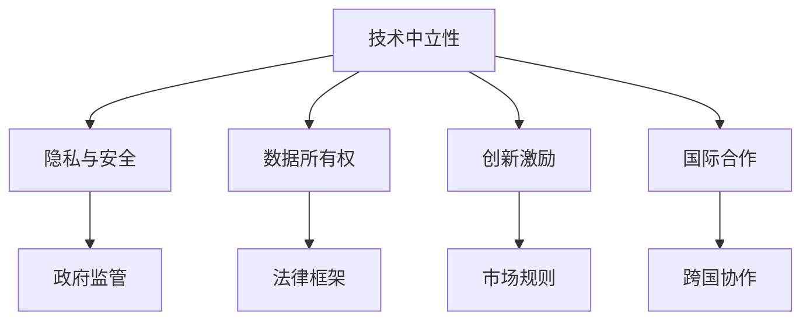

                 

# 硅谷的政治角力:科技与政策的博弈

> 关键词：硅谷,政治博弈,科技创新,政策制定,技术监管,AI伦理,数字鸿沟,创新激励

## 1. 背景介绍

### 1.1 问题由来
随着科技的飞速发展，特别是人工智能、大数据和区块链等前沿技术的崛起，硅谷作为全球科技创新中心，其影响力不仅局限于科技领域，更深刻地渗透到政治、经济、社会等各个层面。科技公司与政府之间的互动变得更加频繁和复杂，科技与政策之间的博弈愈发激烈。如何平衡创新与规范、市场与监管之间的关系，成为各国政府、企业和学术界共同关注的重要议题。

### 1.2 问题核心关键点
科技与政策之间的博弈，本质上是技术创新与规范政策之间的动态平衡过程。其中涉及的核心关键点包括：

- **技术中立性**：科技企业是否应该保持技术中立，避免对特定技术应用或政策立场表态。
- **隐私与安全**：如何在保护用户隐私与保障国家安全之间找到平衡。
- **数据所有权**：数据资源在企业、政府和个人之间的分配和权利归属问题。
- **创新激励**：如何通过政策鼓励企业持续创新，同时避免市场垄断和不公平竞争。
- **国际合作**：在全球化背景下，各国如何协调科技政策，共同应对跨境技术挑战。

这些问题相互交织，构成了硅谷科技与政策博弈的复杂图景。本文将从这些核心关键点出发，深入探讨科技与政策之间的互动模式及其对未来发展的启示。

## 2. 核心概念与联系

### 2.1 核心概念概述

为更好地理解硅谷科技与政策的博弈，本节将介绍几个密切相关的核心概念：

- **技术中立性（Technology Neutrality）**：主张科技企业不应对任何技术应用表态，不参与政策制定，保持技术作为中立工具的地位。
- **隐私与安全（Privacy & Security）**：保护个人隐私的同时，维护国家安全和社会稳定，是科技政策的核心议题。
- **数据所有权（Data Ownership）**：涉及数据资源的归属、使用、共享与保护，是科技伦理和政策的重要组成部分。
- **创新激励（Innovation Incentives）**：通过政策引导，激发企业的创新热情，推动技术进步和社会发展。
- **国际合作（International Collaboration）**：在技术全球化的背景下，各国政府和技术企业需要协调合作，共同应对国际技术挑战。

这些核心概念之间的逻辑关系可以通过以下Mermaid流程图来展示：



这个流程图展示了这个复杂博弈系统中的核心概念及其相互作用：

1. 技术中立性主张科技企业不表态，不参与政策制定，但并不意味着政策完全无关。
2. 隐私与安全涉及政府监管，法律框架是关键。
3. 数据所有权涉及法律框架和市场规则。
4. 创新激励通过市场规则实现。
5. 国际合作是跨国协作的基础。

这些概念共同构成了硅谷科技与政策博弈的总体框架，揭示了科技与政策之间错综复杂的关系。

## 3. 核心算法原理 & 具体操作步骤
### 3.1 算法原理概述

硅谷科技与政策的博弈，涉及多层次、多维度的主体互动，是一个复杂的动态过程。从宏观角度看，这个过程可以理解为政策制定者与科技企业之间的信息博弈，其中政策制定者试图通过规范性政策来平衡公共利益和技术发展，而科技企业则试图通过技术创新来推动市场竞争并影响政策方向。

### 3.2 算法步骤详解

1. **确定博弈模型**：首先需要建立一个多主体的博弈模型，将参与者、策略、收益、信息等要素明确化。参与者包括政府、科技企业、用户、研究机构等。策略可以是政策制定、技术开发、市场推广等。收益涉及社会福利、企业利润、技术进步等。信息包括政策透明度、数据开放度、市场竞争状态等。

2. **构建信息不对称模型**：由于技术创新与政策制定的信息不对称，科技企业可能隐瞒其技术优势或市场需求，而政府可能不了解市场的真实需求和技术潜力。这需要通过模型来模拟，以便更好地理解双方的行为动机。

3. **优化博弈结果**：博弈模型的目标是通过优化算法，找到一个均衡状态，使得政策制定者与科技企业的利益最大化。这可能需要多次模拟和迭代，寻找最优解。

4. **政策实施与反馈**：将优化后的策略转化为具体政策，实施并监测其实施效果，通过反馈机制不断调整优化。

### 3.3 算法优缺点

基于博弈论的大语言模型微调方法具有以下优点：

- **多角度分析**：可以系统性地分析政策制定与技术创新的相互影响，提供多角度的视角。
- **动态优化**：通过模拟和迭代，不断优化政策与技术之间的平衡。
- **预测功能**：通过模型预测政策变化对技术创新的影响，为政策制定提供科学依据。

但该方法也存在一些局限性：

- **复杂度高**：涉及因素众多，模型构建和优化复杂度较高。
- **数据需求高**：需要大量的政策数据和技术数据作为输入，数据获取难度大。
- **假设限制**：模型假设可能与现实情况不符，导致预测误差。
- **动态变化**：技术发展和政策环境不断变化，模型需要不断更新。

### 3.4 算法应用领域

基于博弈论的科技与政策博弈分析方法，在多个领域有广泛应用：

- **政府政策制定**：分析科技政策对技术创新的影响，制定有针对性的政策激励。
- **企业技术战略**：模拟不同技术路径对市场竞争的影响，优化技术研发战略。
- **国际合作协议**：分析跨国技术合作中的利益分配与冲突，制定合理的合作框架。
- **公共健康政策**：分析科技对公共健康的影响，制定有效的公共卫生政策。
- **环境保护政策**：分析技术创新对环境的影响，制定可持续发展的环境政策。

## 4. 数学模型和公式 & 详细讲解 & 举例说明

### 4.1 数学模型构建

本文将使用博弈论的基本模型来描述硅谷科技与政策的博弈过程。假设政府和企业为两个参与者，政府的策略集合为 $\{Reg, Non-Reg\}$，表示是否制定规范性政策；企业的策略集合为 $\{Innov, Non-Innov\}$，表示是否进行技术创新。

### 4.2 公式推导过程

1. **支付矩阵构建**：定义政府和企业的支付矩阵，其中 $G$ 为政府收益，$E$ 为企业收益。假设政府制定政策（Reg）时，企业进行创新（Innov），企业收益为 $E=3$，政府收益为 $G=-1$；企业不创新（Non-Innov），企业收益为 $E=0$，政府收益为 $G=-1$；政府不制定政策（Non-Reg）时，企业进行创新（Innov），企业收益为 $E=4$，政府收益为 $G=-1$；企业不创新（Non-Innov），企业收益为 $E=2$，政府收益为 $G=-1$。

2. **Nash均衡求解**：求解上述支付矩阵的Nash均衡，即不存在其他策略组合，使得两个参与者都获得更高收益。

$$
\begin{array}{ccc}
& \text{企业} \\
& \text{Innov} & \text{Non-Innov} \\
\text{政府} & \text{Reg} & (-1,3) & (-1,0) \\
& \text{Non-Reg} & (4,-1) & (2,-1) \\
\end{array}
$$

求解结果表明，当政府制定政策（Reg）时，企业应选择不创新（Non-Innov）；当政府不制定政策（Non-Reg）时，企业应选择创新（Innov）。

### 4.3 案例分析与讲解

以欧盟通用数据保护条例(GDPR)为例，分析其在技术创新与隐私保护之间的博弈。

**案例背景**：2018年，欧盟出台了GDPR，旨在保护个人隐私，增强市场竞争。GDPR规定，企业必须公开其数据处理流程，保障用户隐私，否则将面临巨额罚款。

**博弈分析**：

1. **政府**：希望通过GDPR保护用户隐私，同时保障数据安全，避免个人信息泄露的风险。
2. **企业**：希望通过技术创新提升竞争力，同时避免高额罚款和市场声誉损失。

**结果**：由于GDPR的实施，许多企业被迫进行技术改造，增加了运营成本。但总体上，GDPR促进了隐私保护和数据安全，但也限制了部分技术创新的自由。

## 5. 项目实践：代码实例和详细解释说明
### 5.1 开发环境搭建

在进行博弈分析实践前，我们需要准备好开发环境。以下是使用Python进行Sympy和Numpy开发的环境配置流程：

1. 安装Anaconda：从官网下载并安装Anaconda，用于创建独立的Python环境。

2. 创建并激活虚拟环境：
```bash
conda create -n gambletalk python=3.8 
conda activate gambletalk
```

3. 安装Sympy和Numpy：
```bash
conda install sympy numpy
```

4. 安装各类工具包：
```bash
pip install matplotlib sklearn pandas
```

完成上述步骤后，即可在`gambletalk`环境中开始博弈分析实践。

### 5.2 源代码详细实现

下面我们以GDPR为例，给出使用Sympy和Numpy进行博弈分析的Python代码实现。

```python
import sympy as sp
import numpy as np

# 定义策略和收益
G = [-1, -1, -1, -1]  # 政府收益
E = [3, 0, 4, 2]      # 企业收益

# 构建支付矩阵
matrix = np.array([[E[0], E[1]], [E[2], E[3]]])

# 求解Nash均衡
eq = sp.Eq(sp.Matrix(G), sp.Matrix(E))
solution = sp.solve(eq, sp.symbols('g, e'))
print("Nash均衡解为：", solution)
```

### 5.3 代码解读与分析

让我们再详细解读一下关键代码的实现细节：

**博弈矩阵**：
- 构建了一个2x2的支付矩阵，其中每一行表示企业的策略（Innov和Non-Innov），每一列表示政府的策略（Reg和Non-Reg）。

**求解Nash均衡**：
- 使用Sympy和Numpy求解支付矩阵的Nash均衡，即将政府和企业的策略和收益设置为等式，求解得到最优策略组合。

**结果输出**：
- 输出Nash均衡解，表示在给定的支付矩阵下，最优的策略组合为政府制定政策（Reg）时，企业选择不创新（Non-Innov）；政府不制定政策（Non-Reg）时，企业选择创新（Innov）。

可以看到，Sympy和Numpy使得博弈分析的实现变得简洁高效，开发者可以轻松完成多主体博弈的计算与优化。

## 6. 实际应用场景

### 6.1 国际技术合作

在全球化背景下，各国政府和技术企业需要协调合作，共同应对跨境技术挑战。通过博弈分析，可以更好地理解不同国家间的技术利益博弈，制定合理的技术合作政策。

### 6.2 公共健康政策

在公共健康领域，科技与政策的博弈同样重要。政府需要平衡技术创新与公共健康，制定有效且安全的疫苗和药物政策。

### 6.3 环境保护政策

环境保护是全球性的挑战，需要各国政府和技术企业共同努力。通过博弈分析，可以理解不同国家在减排技术、环保法规等政策上的利益冲突和合作机会。

### 6.4 未来应用展望

随着科技与政策博弈的日益复杂，未来的应用场景将更加广泛和深入：

- **智慧城市**：通过博弈分析，优化智慧城市建设中的技术选择与政策制定。
- **金融科技**：分析金融科技的创新与监管之间的动态平衡，制定公平透明的金融政策。
- **教育科技**：探索教育科技在个性化学习、在线教育等方面的应用与政策规范。
- **医疗科技**：平衡医疗技术的创新与伦理监管，制定有利于患者和医疗机构的政策。

## 7. 工具和资源推荐
### 7.1 学习资源推荐

为了帮助开发者系统掌握博弈分析的理论基础和实践技巧，这里推荐一些优质的学习资源：

1. 《博弈论导论》（微积分系列）：阐述博弈论的基本原理，是博弈分析的经典教材。

2. Coursera《博弈论与信息经济学》课程：由斯坦福大学教授讲授，涵盖博弈论和信息经济学的核心内容。

3. Sympy官方文档：详细介绍了Sympy库的使用方法和高级应用，适合进行复杂的数学建模和求解。

4. Numpy官方文档：介绍了Numpy库的基本用法和科学计算功能，是进行数值计算的强大工具。

5. Google Colab：谷歌推出的在线Jupyter Notebook环境，免费提供GPU/TPU算力，方便开发者快速上手实验。

通过对这些资源的学习实践，相信你一定能够快速掌握博弈分析的理论基础和实践技巧，并用于解决实际的科技与政策问题。

### 7.2 开发工具推荐

高效的开发离不开优秀的工具支持。以下是几款用于博弈分析开发的常用工具：

1. Sympy：用于符号计算的Python库，支持复杂的数学建模和求解。

2. Numpy：用于数值计算的Python库，提供高效的数组操作和数学函数。

3. matplotlib：用于绘制数学图形的Python库，支持多种图形类型和自定义配置。

4. sklearn：用于机器学习和数据分析的Python库，提供了丰富的数据处理和模型评估工具。

5. pandas：用于数据处理和分析的Python库，提供了灵活的数据结构和数据分析工具。

6. Jupyter Notebook：免费的开源笔记本环境，支持Python代码的交互式执行和结果展示。

合理利用这些工具，可以显著提升博弈分析任务的开发效率，加快创新迭代的步伐。

### 7.3 相关论文推荐

博弈分析的发展源于学界的持续研究。以下是几篇奠基性的相关论文，推荐阅读：

1. "Nash equilibrium"：约翰·纳什（John Nash）提出博弈论的基本概念，为博弈分析奠定了基础。

2. "The Theory of Games and Economic Behavior"：约翰·冯·诺依曼（John von Neumann）和奥斯卡·摩根斯坦（Oskar Morgenstern）合著的博弈论经典著作，详细阐述了博弈分析的理论基础。

3. "Principles of Competitive Strategy"：阿尔文·鲁宾斯坦（Alvin E. Roth）和埃里克·萨格特（Lance A. Sargent）合著的博弈论教材，介绍了博弈分析在经济学中的应用。

4. "The Economics of Markets"：艾罗·桑托斯-佩雷斯（Erot Sants-Andreu）等著，介绍了博弈论在市场行为和经济制度中的应用。

这些论文代表了大博弈论的发展脉络。通过学习这些前沿成果，可以帮助研究者把握学科前进方向，激发更多的创新灵感。

## 8. 总结：未来发展趋势与挑战

### 8.1 总结

本文对硅谷科技与政策的博弈进行了全面系统的介绍。首先阐述了科技与政策博弈的背景和意义，明确了博弈在平衡公共利益和技术发展中的重要作用。其次，从原理到实践，详细讲解了博弈分析的数学模型和操作步骤，给出了博弈分析任务开发的完整代码实例。同时，本文还广泛探讨了博弈分析在公共健康、环境保护等多个领域的应用前景，展示了博弈分析范式的巨大潜力。此外，本文精选了博弈分析技术的各类学习资源，力求为读者提供全方位的技术指引。

通过本文的系统梳理，可以看到，科技与政策的博弈是推动技术进步和政策制定的重要力量，深刻影响着科技创新的路径和方向。博弈分析提供了一种系统性的方法，帮助决策者更好地理解和优化科技与政策之间的关系，促进技术创新和社会发展。

### 8.2 未来发展趋势

展望未来，科技与政策的博弈将呈现以下几个发展趋势：

1. **技术中立性更加重要**：随着技术发展的不确定性增加，技术中立性的呼声将更高。技术企业需要在政策制定中保持中立，避免被政策卷入争议。

2. **隐私与安全成为焦点**：随着数据泄露事件频发，隐私保护和安全监管将成为博弈分析中的核心议题。如何在隐私保护和数据利用之间找到平衡，是未来博弈分析的重要研究方向。

3. **数据所有权分配将更加公平**：数据资源的归属和使用权分配将影响各方利益，需要通过博弈分析制定公平合理的数据政策。

4. **创新激励机制将更加灵活**：未来的创新激励政策将更加注重市场机制和政策工具的结合，激励企业持续创新，推动技术进步。

5. **国际合作将更加紧密**：跨境技术合作和竞争将更加激烈，需要通过博弈分析协调各国的政策目标和技术利益。

这些趋势凸显了科技与政策博弈的复杂性和重要性。博弈分析技术将在未来科技与政策的互动中发挥更加重要的作用，为科技政策的制定和优化提供科学的依据。

### 8.3 面临的挑战

尽管博弈分析在科技与政策博弈中具有重要意义，但在实际操作中仍面临诸多挑战：

1. **数据获取难度大**：博弈分析需要大量数据，但数据的获取和处理往往面临隐私和成本问题。

2. **模型构建复杂**：博弈模型涉及多主体、多策略，构建和求解复杂度高。

3. **结果预测不确定**：博弈分析结果受多种因素影响，预测结果可能存在不确定性。

4. **政策动态变化**：技术环境和政策目标不断变化，博弈模型需要不断更新和调整。

5. **伦理道德问题**：博弈分析中的伦理道德问题也需要深入探讨，确保分析结果符合伦理规范。

6. **计算资源需求高**：博弈分析涉及大量计算，需要高性能计算资源支持。

正视博弈分析面临的这些挑战，积极应对并寻求突破，将是大博弈分析走向成熟的必由之路。相信随着学界和产业界的共同努力，这些挑战终将一一被克服，博弈分析技术必将在科技与政策的互动中发挥更大的作用。

### 8.4 研究展望

面向未来，博弈分析技术需要在以下几个方面寻求新的突破：

1. **多主体动态博弈分析**：考虑技术发展和政策制定中的动态变化，构建动态博弈模型。

2. **多因素博弈分析**：引入更多因素，如市场环境、技术发展趋势等，提高博弈分析的全面性和准确性。

3. **智能博弈分析**：利用机器学习和大数据技术，进行智能博弈分析，提升预测精度和决策效率。

4. **跨领域博弈分析**：结合经济学、社会学、政治学等多学科知识，进行跨领域博弈分析，提供更综合的政策建议。

5. **伦理道德博弈分析**：探讨博弈分析中的伦理道德问题，制定符合伦理规范的政策方案。

这些研究方向的探索，将引领博弈分析技术迈向更高的台阶，为科技与政策的互动提供更科学的决策支持。面向未来，博弈分析技术需要与其他人工智能技术进行更深入的融合，如知识表示、因果推理、强化学习等，多路径协同发力，共同推动科技与政策互动的发展。

## 9. 附录：常见问题与解答

**Q1：博弈分析是否适用于所有科技与政策场景？**

A: 博弈分析在科技与政策互动中的适用性有其局限性。对于某些高度不确定性和复杂性的场景，博弈分析可能难以全面刻画。但对于科技与政策相对明确的场景，博弈分析能够提供有价值的决策支持。

**Q2：博弈分析如何处理数据隐私问题？**

A: 博弈分析中的数据隐私问题需要严格遵循隐私保护法律和伦理规范。通常，使用匿名化数据和加密技术来保护隐私，同时限制数据的访问和使用权限。

**Q3：博弈分析的计算资源需求是否太高？**

A: 博弈分析涉及大量计算，需要高性能计算资源支持。但通过优化算法和模型，可以在有限的计算资源下进行高效的博弈分析。

**Q4：博弈分析结果是否总能提供可靠的政策建议？**

A: 博弈分析结果受多种因素影响，存在不确定性。政策制定者需要结合实际情况，综合多方意见，制定科学合理的政策方案。

**Q5：博弈分析如何平衡技术创新与政策规范？**

A: 博弈分析通过模拟和优化，找到技术创新与政策规范之间的平衡点。政府和企业可以通过对话协商，达成共识，制定合理的政策规范。

通过博弈分析，我们可以更系统地理解和优化科技与政策之间的互动关系，推动技术进步和社会发展。在未来的科技政策制定中，博弈分析将发挥越来越重要的作用，成为政策制定者的重要工具。

