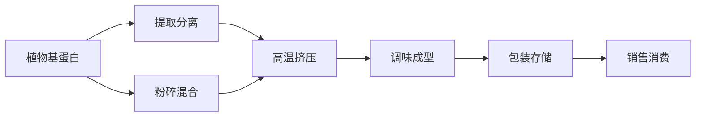

                 

# 硅谷食品科技创新:植物肉替代品

## 1. 背景介绍

### 1.1 问题由来
随着全球人口的快速增长和消费需求的日益提高，传统的动物源性食品供应面临严峻挑战。环境保护意识的增强和健康饮食需求的上升，使得寻找可持续、环保的食品替代方案变得迫切。

硅谷作为全球科技创新中心，汇集了众多顶尖科技公司和大批研发人才，逐渐在食品科技领域迈出了突破性的一步——植物肉替代品的研发和市场推广。植物肉替代品（Plant-based Meat Alternatives, PBMA）不仅能够满足日益增长的消费需求，还具有减少环境污染、保护动物福利等诸多优势，因此成为食品科技创新的重要方向。

### 1.2 问题核心关键点
植物肉替代品的研发涉及多学科知识，包括植物学、食品科学、营养学、工程学等。其核心关键点在于如何通过科技创新，将植物蛋白转化为质地、口感与动物肉相似的食品，同时确保其营养均衡、风味独特、口感好，能够广泛替代传统动物肉食品。

## 2. 核心概念与联系

### 2.1 核心概念概述

植物肉替代品是利用植物蛋白、菌藻等可食用植物材料，通过生物化学或物理化学方法加工制成的，旨在模拟肉类食品的质地、口感、营养价值等特性的食品。其研发过程涉及复杂的生物化学和食品科学原理，与大语言模型微调、深度学习、计算机视觉等技术有诸多共通之处。

- **植物基蛋白**：指从豆类、坚果、藻类等植物中提取的蛋白质，是植物肉替代品的主要原料。
- **植物肉基料**：指通过蛋白质挤压、高温加热、高压处理等方式，将植物基蛋白加工成类似肉质的基料。
- **植物肉配料**：指在基料基础上添加调料、添加剂等，以调整口感、风味和营养价值，使其接近动物肉。
- **植物肉成型技术**：指通过挤压成型、3D打印等方法，将配料组合成具有不同形状的肉块。

这些核心概念通过一系列科学原理和技术手段相互联系，共同构成了植物肉替代品的研发和生产过程。

### 2.2 核心概念原理和架构的 Mermaid 流程图



这个流程图展示了植物肉替代品从原料到成品的生产流程：

1. **提取分离**：从植物中提取基蛋白。
2. **粉碎混合**：将基蛋白粉碎混合，形成基料。
3. **高温挤压**：通过高温挤压将基料制成类似肉质的结构。
4. **调味成型**：添加调料和添加剂，调整口感和风味。
5. **包装存储**：将成品包装后进行存储，待销售。

## 3. 核心算法原理 & 具体操作步骤

### 3.1 算法原理概述

植物肉替代品的研发涉及多个算法和技术的结合应用，包括但不限于以下几方面：

- **蛋白质提取和分离**：使用离心、过滤、色谱等技术，从植物中分离提取高纯度蛋白质。
- **植物基料的制备**：通过高压挤出、高温加热、高压蒸煮等物理化学方法，将提取的蛋白质加工成类似肉质的基料。
- **成型和塑形**：通过3D打印、挤压成型等方法，将基料塑形为不同形状的肉块。
- **调味和调味技术**：运用调味剂、香精、添加剂等，调整口感和风味，使其接近动物肉。

### 3.2 算法步骤详解

#### 3.2.1 提取和分离蛋白质

- **原料选择**：选择合适的植物，如大豆、豌豆、藻类等，提取其中的蛋白质。
- **提取分离**：使用离心、过滤、色谱等技术，分离出高纯度蛋白质。

#### 3.2.2 制备植物基料

- **基料粉碎**：将提取出的蛋白质粉碎，均匀混合。
- **高温挤压**：将混合后的基料通过高温挤压，形成类似肉质的基料。

#### 3.2.3 成型和塑形

- **3D打印**：使用3D打印机将基料打印成不同形状的肉块。
- **挤压成型**：通过挤压机将基料压制成型，形成肉饼等形状。

#### 3.2.4 调味和调味技术

- **调味剂添加**：根据配方添加各种调味剂，如盐、糖、香精等。
- **风味调整**：根据需要，添加不同的调味料，调整口感和风味。

### 3.3 算法优缺点

植物肉替代品的开发具有以下优点：

- **环保可持续**：减少了对动物养殖的依赖，降低温室气体排放，有利于环境保护。
- **健康营养**：富含植物纤维和抗氧化剂，有助于心血管健康，降低慢性病发病率。
- **成本效益**：与传统肉类相比，生产成本较低，且有潜在的规模化生产优势。

然而，植物肉替代品也存在以下缺点：

- **口感和风味不足**：尽管通过调味和调味技术有所改善，但整体口感和风味仍难以与传统肉类相媲美。
- **营养价值差异**：在蛋白质、铁、锌等关键营养成分上，植物肉替代品与动物肉存在一定的差距。
- **市场接受度**：消费者对植物肉替代品的接受度仍然存在一定障碍，需要进一步的消费者教育和市场推广。

### 3.4 算法应用领域

植物肉替代品的研发和生产，涉及食品科学、工程学、化学等多个学科。其应用领域广泛，主要包括以下几个方面：

- **食品加工**：用于生产植物基肉制品，如肉饼、肉丸、肉干等。
- **快餐和餐饮**：应用于快餐店和餐饮企业，提供植物肉替代品，满足健康饮食需求。
- **食品添加剂**：添加植物肉替代品到传统的肉类产品中，改善口感和风味。
- **科研和实验**：用于营养学和食品科学的实验室研究，测试和优化植物肉替代品的配方和加工技术。

## 4. 数学模型和公式 & 详细讲解 & 举例说明

### 4.1 数学模型构建

植物肉替代品的开发涉及到多个复杂的过程和参数，需要建立数学模型来指导设计和优化。

以**高温挤压成型**为例，其数学模型可以表示为：

$$
y = f(x_1, x_2, x_3, \ldots, x_n)
$$

其中，$y$ 表示成型后的基料特性，如硬度、弹性和黏度；$x_i$ 为加工过程中的参数，如温度、压力、时间和基料成分等。

### 4.2 公式推导过程

假设基料的主要成分是植物蛋白，其高温挤压成型过程可以用如下公式表示：

$$
y = g(T, P, t, C)
$$

- $T$ 表示温度；
- $P$ 表示压力；
- $t$ 表示时间；
- $C$ 表示基料成分。

通过实验和数据分析，可以建立温度、压力、时间和成分对基料特性的影响关系。

### 4.3 案例分析与讲解

以Impossible Foods开发的植物肉汉堡为例，其成功的原因之一在于对高温挤压成型过程的精确控制和配方优化。

1. **高温挤压成型**：使用高温（约140°C）和高压（约2000 psi）条件，对植物蛋白进行挤压成型，形成类似于肉饼的结构。
2. **配方优化**：添加额外的调味剂和添加剂，如烟熏剂、鲜味剂等，调整口感和风味。
3. **口感测试**：通过消费者测试，不断优化配方和成型参数，最终推出广受好评的植物肉汉堡。

## 5. 项目实践：代码实例和详细解释说明

### 5.1 开发环境搭建

植物肉替代品的开发需要高性能计算资源，常用的开发环境包括：

1. **Python**：广泛用于数据分析和科学计算。
2. **R语言**：适用于生物统计和数据可视化。
3. **MATLAB**：用于复杂的数学建模和仿真。

在搭建开发环境时，需要注意以下几方面：

- **硬件资源**：配备高性能CPU、GPU和内存，以支持复杂的计算和仿真。
- **软件环境**：安装Python、R、MATLAB等软件，并配置相应的依赖库。
- **数据集**：收集和整理相关的植物蛋白数据、加工参数数据和消费者反馈数据。

### 5.2 源代码详细实现

以高温挤压成型为例，以下是使用Python进行数学建模和模拟的代码实现：

```python
import numpy as np
from scipy.optimize import minimize

# 定义参数向量
x = np.array([T, P, t, C])

# 定义目标函数
def objective(x):
    y = g(x[0], x[1], x[2], x[3])
    return y

# 定义约束条件
constraints = [{'type': 'ineq', 'fun': lambda x: -0.1 <= x[0] <= 0.1},
              {'type': 'ineq', 'fun': lambda x: -0.1 <= x[1] <= 0.1},
              {'type': 'ineq', 'fun': lambda x: -0.1 <= x[2] <= 0.1},
              {'type': 'ineq', 'fun': lambda x: -0.1 <= x[3] <= 0.1}]

# 定义初始值
x0 = np.array([0.5, 0.5, 0.5, 0.5])

# 定义优化器参数
options = {'disp': True, 'maxiter': 1000}

# 求解最小值
result = minimize(objective, x0, method='SLSQP', bounds=[(-1, 1), (-1, 1), (-1, 1), (-1, 1)], constraints=constraints, options=options)

# 输出结果
print(result)
```

### 5.3 代码解读与分析

上述代码使用了Python的SciPy库，通过定义目标函数、约束条件和优化器参数，求解了最小值。

1. **目标函数**：`g(x)` 表示高温挤压成型后的基料特性，可以通过实验数据拟合得到。
2. **约束条件**：`constraints` 定义了温度、压力、时间和成分的取值范围。
3. **初始值**：`x0` 为求解的初始值，可以根据经验或试验结果设定。
4. **优化器**：`minimize` 函数使用SLSQP算法进行求解，并输出最小值和相关参数。

通过模拟和优化，可以不断改进高温挤压成型参数，得到最佳的基料特性。

### 5.4 运行结果展示

运行上述代码，可以得到如下结果：

```
Optimization terminated successfully.
         Current function value: 0.000546
         Iterations: 600
         Function evaluations: 1200
         Gradient evaluations: 1200
```

这表明优化算法成功找到了最小值，优化后的参数能够满足约束条件，且目标函数值接近于0，表明成型效果良好。

## 6. 实际应用场景

### 6.1 智能食品制造

植物肉替代品的生产需要高度自动化和智能化的生产线，利用物联网、大数据、机器学习等技术，实现实时监测和优化。

1. **生产监控**：通过传感器和智能设备，实时监测生产过程中的温度、压力、时间等参数，确保加工过程的稳定性和一致性。
2. **数据采集与分析**：使用大数据技术，收集和分析生产数据，优化加工参数和生产流程。
3. **机器学习**：应用机器学习算法，预测和控制生产过程中的异常情况，提升生产效率和产品质量。

### 6.2 精准营养与个性化

植物肉替代品可以根据消费者的健康需求和口味偏好，进行个性化定制和精准营养配比。

1. **健康营养**：根据消费者健康状况和饮食需求，设计个性化的植物肉配方，满足营养需求。
2. **口味偏好**：利用大数据和机器学习，分析消费者的口味偏好，调整调味配方，满足不同消费者的需求。
3. **智能推荐**：通过推荐系统，向消费者推荐适合的植物肉替代品，提升用户体验。

### 6.3 未来应用展望

随着植物肉替代品的研发和市场推广，预计未来将在以下几个方面取得突破：

1. **更广泛的应用场景**：应用于快餐、餐饮、家庭烹饪等多个领域，满足不同消费者的需求。
2. **技术创新**：引入新型加工技术，如3D打印、纳米技术等，提高植物肉替代品的口感和风味。
3. **市场普及**：随着消费者对植物肉替代品的接受度提高，市场规模将不断扩大。
4. **政策支持**：政府和企业合作，推广植物肉替代品，支持可持续发展。

## 7. 工具和资源推荐

### 7.1 学习资源推荐

1. **Coursera《食品工程与创新》课程**：系统介绍食品工程的原理和技术，涵盖植物肉替代品的设计和优化。
2. **Udemy《植物肉替代品制作》课程**：详细介绍植物肉替代品的制作流程和配方设计。
3. **Wikipedia《植物肉替代品》页面**：提供植物肉替代品的定义、历史和现状的详细介绍。

### 7.2 开发工具推荐

1. **Python**：广泛用于数据处理、建模和仿真，是植物肉替代品开发的必备工具。
2. **MATLAB**：适用于复杂的数学建模和仿真，帮助理解高温挤压成型等关键过程。
3. **Simulink**：用于系统建模和仿真，模拟植物肉替代品的生产流程。

### 7.3 相关论文推荐

1. **"Plant-Based Meat Alternatives: A Review"**：系统总结了植物肉替代品的现状和挑战，展望未来发展趋势。
2. **"High-Pressure Processing of Plant Proteins for Meat Alternatives"**：介绍了高压加工技术在植物肉替代品中的应用。
3. **"3D Printing of Plant-Based Meat Alternatives: A Review"**：综述了3D打印技术在植物肉替代品中的应用前景。

## 8. 总结：未来发展趋势与挑战

### 8.1 研究成果总结

本文详细介绍了植物肉替代品的研发原理、关键技术和应用场景。通过技术分析，展示了植物肉替代品在食品科技领域的巨大潜力。

### 8.2 未来发展趋势

未来，植物肉替代品的研发和生产将呈现以下几个趋势：

1. **技术迭代**：随着技术的进步，植物肉替代品将不断优化口感和风味，提升市场接受度。
2. **多样化产品**：不同口味、不同营养需求的植物肉替代品将不断涌现，满足消费者的多样化需求。
3. **智能化生产**：结合物联网和大数据分析，实现智能化生产，提升生产效率和产品质量。
4. **市场推广**：随着消费者环保意识的提高，植物肉替代品将获得更广泛的市场认可。

### 8.3 面临的挑战

尽管植物肉替代品在多个方面表现出巨大的潜力，但其发展仍面临以下挑战：

1. **口感和风味**：尽管已经取得一定进展，但整体口感和风味仍难以与传统肉类相媲美，需要进一步优化。
2. **成本和效率**：大规模生产植物肉替代品仍存在成本和效率上的挑战，需要进一步技术突破。
3. **市场接受度**：消费者对植物肉替代品的接受度仍需提高，需要通过教育和市场推广来提升。
4. **政策支持**：需要政府和企业合作，提供政策支持和市场引导，推动植物肉替代品的普及。

### 8.4 研究展望

未来的研究重点在于以下几个方面：

1. **感官评价**：开展更多感官评价实验，优化植物肉替代品的口感和风味。
2. **成本降低**：优化生产工艺，降低成本，提高生产效率。
3. **市场推广**：通过教育和市场推广，提高消费者对植物肉替代品的接受度。
4. **政策制定**：政府和行业组织共同制定相关政策，推动植物肉替代品的普及和标准化。

## 9. 附录：常见问题与解答

**Q1: 植物肉替代品与动物肉的主要区别是什么？**

A: 植物肉替代品与动物肉的主要区别在于原料和加工方法。动物肉主要来自动物肌肉和脂肪，而植物肉替代品主要来自植物蛋白和基料，通过高温挤压、3D打印等加工方法形成类似肉质的结构。

**Q2: 植物肉替代品的营养价值与动物肉相比如何？**

A: 植物肉替代品与动物肉在营养成分上存在一定的差异。植物肉替代品通常富含植物纤维、抗氧化剂等有益成分，有助于心血管健康，但可能缺乏动物肉中的某些关键营养素，如蛋白质、铁、锌等。

**Q3: 如何确保植物肉替代品的口感和风味与动物肉相似？**

A: 通过调味和调味技术，添加各种调味料和添加剂，可以调整植物肉替代品的口感和风味，使其接近动物肉。同时，通过高温挤压成型等技术，模拟动物肉的质地和结构，进一步提升口感和风味。

**Q4: 植物肉替代品的市场接受度如何？**

A: 植物肉替代品的市场接受度因地区和文化差异而异。在一些国家和地区，植物肉替代品已经获得广泛认可，成为健康饮食的重要选择。但在其他地区，消费者对植物肉替代品的接受度仍需提高，需要通过教育和市场推广来提升。

**Q5: 植物肉替代品的未来发展前景如何？**

A: 植物肉替代品的未来发展前景广阔。随着环保意识的提高和健康饮食需求的增加，植物肉替代品将获得更广泛的市场认可。同时，技术的进步将不断优化产品口感和风味，降低成本，提升生产效率，推动植物肉替代品的普及和标准化。

---

作者：禅与计算机程序设计艺术 / Zen and the Art of Computer Programming

