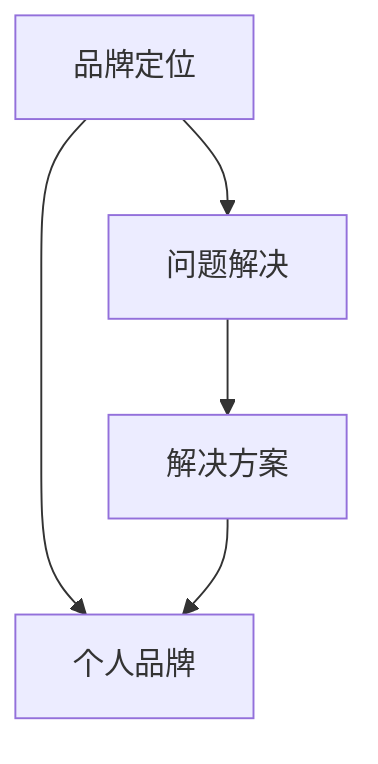

                 

# 确立个人品牌定位：明确你要解决的问题

> 关键词：品牌定位,个人品牌,明确目标,问题解决,品牌策略

## 1. 背景介绍

### 1.1 问题由来
在当今数字化时代，个人品牌成为个人在职场、创业、职业发展中不可或缺的一部分。一个明确而强烈的个人品牌定位不仅可以提升个人在同行和公众中的知名度和认可度，还能增强个人在行业内的影响力和竞争力。然而，对于初入职场的开发者、希望转型升级的中级开发者，或是需要打造全新形象的高级开发者，如何确立一个准确、清晰的个人品牌定位，是一个常常困扰他们的问题。

### 1.2 问题核心关键点
确立个人品牌定位的核心在于明确你想要解决的问题，即你希望通过个人品牌传达的核心价值和市场定位。品牌定位明确了你的竞争优势和目标受众，帮助你更好地制定营销策略和行动计划，从而提升个人职业发展和社会影响力的效果。

### 1.3 问题研究意义
一个清晰的品牌定位不仅能帮助个人在职场竞争中脱颖而出，还能为你的职业发展提供明确的指引和方向。具体而言，它有以下几个重要作用：

1. **提升知名度**：清晰的品牌定位有助于你更有效地传达个人价值和专长，从而提高在行业和同行中的知名度。
2. **增强竞争力**：明确的目标和定位使你更清楚地知道自己的优势所在，有助于在激烈的职场竞争中占据有利位置。
3. **促进职业发展**：准确的个人品牌定位有助于制定有效的职业发展路径，引导你朝着目标不断前进。
4. **吸引合作伙伴**：良好的个人品牌形象能够吸引志同道合的合作伙伴和客户，拓展职业机会。
5. **提升影响力**：品牌定位明确，有助于你在社交媒体、技术社区等平台上建立有影响力的个人形象。

## 2. 核心概念与联系

### 2.1 核心概念概述

为了更好地理解如何确立个人品牌定位，本节将介绍几个核心概念，包括品牌定位、个人品牌和问题解决：

- **品牌定位（Brand Positioning）**：是指确定品牌在目标市场中的独特位置和竞争优势，使其在消费者心中占据独特的位置，并树立起独特的品牌形象。

- **个人品牌（Personal Branding）**：是指个人通过在职场、社交媒体、技术社区等渠道塑造和传递独特、一致的个人形象，以提升其知名度和影响力。

- **问题解决（Problem Solving）**：是指识别和分析问题，并采取有效措施解决这些问题，以达成预定的目标和效果。

这些概念之间的逻辑关系可以通过以下Mermaid流程图来展示：



这个流程图展示了品牌定位、个人品牌和问题解决之间的联系：

1. 品牌定位确定了你希望传达的核心价值和市场定位。
2. 基于品牌定位，你塑造和传递独特的个人品牌形象。
3. 问题解决是实施品牌策略的关键步骤，通过解决具体问题，塑造有影响力的个人形象。

## 3. 核心算法原理 & 具体操作步骤

### 3.1 算法原理概述

确立个人品牌定位的核心算法原理是通过明确目标受众、识别竞争优势、分析市场现状和需求，制定并实施一套有效的问题解决策略，从而在目标市场中树立起独特的个人品牌形象。这一过程涉及多个步骤，包括市场调研、目标受众分析、竞争优势定位、解决方案制定和品牌传播策略设计。

### 3.2 算法步骤详解

确立个人品牌定位的算法步骤包括以下几个关键环节：

**Step 1: 市场调研与目标受众分析**
- 收集并分析目标市场的数据，包括市场规模、增长趋势、用户需求等。
- 通过问卷调查、社交媒体分析和行业报告等方式，了解目标受众的特征、需求和行为习惯。

**Step 2: 识别竞争优势**
- 分析竞争对手的品牌定位和市场策略，找出其优势和劣势。
- 评估自身具备的技能、经验和专长，识别出可以区别于竞争对手的核心优势。

**Step 3: 制定问题解决方案**
- 基于目标受众的需求和自身的竞争优势，确定需要解决的主要问题。
- 设计解决方案，包括技术技能提升、软技能培养、项目经验积累等。

**Step 4: 实施解决方案**
- 根据解决方案，制定详细的执行计划，包括时间表、资源分配和评估指标。
- 执行计划，不断调整和优化，确保目标达成。

**Step 5: 品牌传播策略设计**
- 确定品牌传播渠道和方式，包括社交媒体、技术社区、公开演讲等。
- 设计并实施品牌传播计划，提高个人品牌知名度和影响力。

### 3.3 算法优缺点

确立个人品牌定位的算法具有以下优点：

1. **系统性强**：通过系统化的方法明确目标和步骤，确保每个环节都有明确的指导和策略。
2. **可操作性强**：该算法具体且可执行，能够帮助个人逐步提升品牌影响力。
3. **效果显著**：通过有效的问题解决，个人品牌能够更快地获得目标受众的认可。

同时，该算法也存在一些局限性：

1. **对数据的依赖性高**：需要大量市场和受众的数据才能做出准确的定位。
2. **实施过程复杂**：需要较长的时间进行市场调研和执行解决方案。
3. **外部因素影响**：市场竞争、技术发展等因素可能影响品牌定位的实施效果。

### 3.4 算法应用领域

确立个人品牌定位的算法适用于各个领域的职业发展，包括但不限于：

- **软件开发**：软件开发者的个人品牌定位可以是技术专家、项目经理、开源贡献者等。
- **市场营销**：营销人员的品牌定位可以是品牌经理、内容创作者、市场分析师等。
- **教育培训**：教育工作者的品牌定位可以是导师、讲师、课程开发者等。
- **创意设计**：设计师的品牌定位可以是视觉艺术家、UI/UX设计师、插画师等。
- **企业管理**：管理者的品牌定位可以是领导者、战略顾问、企业文化推动者等。

## 4. 数学模型和公式 & 详细讲解  
### 4.1 数学模型构建

确立个人品牌定位的过程中，可以使用统计和优化方法来辅助决策。

- 目标受众分析：通过统计学方法分析受众特征和需求，可以量化其行为和偏好。
- 竞争优势定位：通过比较分析不同品牌在市场中的表现，找出竞争优势。
- 问题解决方案：通过优化模型寻找最优解决方案，提升个人品牌竞争力。

### 4.2 公式推导过程

以目标受众分析为例，假设我们收集到n个受众的特征数据，每个特征可以用X_i表示，我们希望计算每个特征的权重W_i，使其与目标受众的特征尽可能接近。使用最小二乘法，我们有如下公式：

$$
\min_{W} \sum_{i=1}^{n} \sum_{j=1}^{m} (X_{ij} - W_j)^2
$$

其中，X_ij表示第i个受众的第j个特征，m表示特征数。通过求解这个优化问题，可以找到最优的权重W，从而确定目标受众的特征和需求。

### 4.3 案例分析与讲解

假设我们的目标是成为一名软件开发领域的专家，可以通过以下步骤进行品牌定位：

1. **市场调研**：收集并分析软件开发领域的市场需求、技术趋势和技能要求。
2. **目标受众分析**：通过问卷调查和数据分析，了解目标受众（如公司HR、技术总监等）的需求和偏好。
3. **竞争优势定位**：分析主要技术社区和平台上的顶级开发者，识别其优势和劣势。
4. **解决方案制定**：确定需要提升的技术技能、参与开源项目、撰写技术博客等。
5. **品牌传播策略设计**：在GitHub、LinkedIn、Medium等平台上发布技术和经验分享，提升个人品牌影响力。

## 5. 项目实践：代码实例和详细解释说明
### 5.1 开发环境搭建

在确立个人品牌定位的过程中，需要借助数据分析和可视化工具。以下是一个使用Python进行数据分析和可视化的环境配置流程：

1. 安装Anaconda：从官网下载并安装Anaconda，用于创建独立的Python环境。

2. 创建并激活虚拟环境：
```bash
conda create -n personal_branding_env python=3.8 
conda activate personal_branding_env
```

3. 安装必要的工具包：
```bash
conda install pandas numpy matplotlib seaborn jupyter notebook ipython
```

4. 安装统计分析库和可视化库：
```bash
conda install statsmodels scipy scikit-learn plotly
```

完成上述步骤后，即可在`personal_branding_env`环境中进行品牌定位的分析和可视化。

### 5.2 源代码详细实现

下面以一个简单的品牌定位案例为例，展示如何使用Python进行数据收集和分析。

```python
import pandas as pd
import numpy as np
import matplotlib.pyplot as plt
from sklearn.cluster import KMeans
from plotly.offline import iplot
import seaborn as sns

# 加载数据
data = pd.read_csv('target_audience.csv')

# 特征工程
# 假设我们有受众的年龄、性别、职业、教育背景等特征
X = data[['age', 'gender', 'occupation', 'education']]

# 特征缩放
from sklearn.preprocessing import StandardScaler
scaler = StandardScaler()
X_scaled = scaler.fit_transform(X)

# 聚类分析
kmeans = KMeans(n_clusters=3, random_state=0).fit(X_scaled)
labels = kmeans.labels_

# 可视化结果
fig = iplot([go.Figure(data=[go.Scatter(
    x=X_scaled[:,0], 
    y=X_scaled[:,1], 
    mode='markers', 
    marker=dict(
        color=labels, 
        colorscale='Blues',
        size=6
    )
)])

plt.title('Target Audience Clustering')
plt.show()
```

### 5.3 代码解读与分析

以上代码演示了如何使用Python进行目标受众的聚类分析，即通过K-means算法将受众划分为不同的群组，并可视化不同群组的特征。

**代码解释**：
- 首先，使用Pandas加载数据。
- 对目标受众的年龄、性别、职业、教育背景等特征进行预处理，包括数据清洗、特征选择和特征缩放。
- 使用K-means算法进行聚类分析，得到受众的分组标签。
- 最后，使用Plotly进行可视化，展示不同群组的特征分布。

**分析**：
- 通过聚类分析，可以发现目标受众的不同群体特征，从而有针对性地制定品牌传播策略。
- 可视化结果帮助理解不同群体的分布和特征，为品牌定位提供数据支持。

## 6. 实际应用场景

### 6.1 个人职业发展

在个人职业发展中，确立明确的个人品牌定位可以显著提升你在职场中的竞争力。假设你是一名软件开发工程师，希望转型成为机器学习专家，可以通过以下步骤进行品牌定位：

1. **市场调研**：了解机器学习领域的市场需求和技能要求。
2. **目标受众分析**：分析公司招聘机器学习工程师的需求和偏好。
3. **竞争优势定位**：识别主要技术社区和平台上的顶级机器学习专家。
4. **解决方案制定**：提升Python编程技能、学习机器学习算法、参与开源项目等。
5. **品牌传播策略设计**：在GitHub、Medium上发布机器学习相关文章和项目，提升个人品牌影响力。

通过确立机器学习专家的品牌定位，你可以在求职、项目合作、技术交流等方面更具优势，实现职业转型。

### 6.2 个人创业

在个人创业过程中，确立明确的个人品牌定位可以吸引潜在客户和投资者。假设你是一名科技创业者，希望创办一家提供人工智能咨询服务的初创公司，可以通过以下步骤进行品牌定位：

1. **市场调研**：了解人工智能咨询领域的市场需求和技术趋势。
2. **目标受众分析**：分析潜在客户（如企业高管、市场总监等）的需求和偏好。
3. **竞争优势定位**：分析主要咨询公司和平台上的专家，识别其优势和劣势。
4. **解决方案制定**：提升专业知识、建立咨询团队、提供定制化服务等。
5. **品牌传播策略设计**：在LinkedIn、Twitter上发布咨询案例和行业分析，提升个人品牌影响力。

通过确立专业的人工智能咨询品牌定位，你可以吸引更多客户和投资者，提高公司的市场竞争力。

### 6.3 个人转型

在个人转型过程中，确立明确的个人品牌定位可以提供清晰的职业方向和路径。假设你是一名市场营销经理，希望转型为数据分析师，可以通过以下步骤进行品牌定位：

1. **市场调研**：了解数据分析领域的市场需求和技能要求。
2. **目标受众分析**：分析数据分析岗位的招聘要求和公司文化。
3. **竞争优势定位**：识别主要数据分析社区和平台上的顶级专家。
4. **解决方案制定**：提升数据分析技能、学习数据分析工具、参与数据分析项目等。
5. **品牌传播策略设计**：在Kaggle、Medium上发布数据分析案例和文章，提升个人品牌影响力。

通过确立数据分析专家的品牌定位，你可以顺利转型并提升在数据分析领域的知名度和影响力。

### 6.4 未来应用展望

随着人工智能和数据科学的不断发展，个人品牌定位将面临更多机遇和挑战。未来，个人品牌定位将更加注重技术、能力和价值观的整合，具体而言：

1. **技术专长**：个人品牌将更加强调技术专长和跨领域能力，如同时具备机器学习和数据分析能力。
2. **创新能力**：个人品牌将更加重视创新能力，如提出新算法、解决新问题等。
3. **社会责任**：个人品牌将更加关注社会责任，如推动可持续发展、公益事业等。
4. **国际化视野**：个人品牌将更加注重国际化视野，如跨文化交流、国际项目合作等。

这些变化将推动个人品牌定位向更加多样化、综合化的方向发展，提升个人在职业和社会中的影响力。

## 7. 工具和资源推荐
### 7.1 学习资源推荐

为了帮助开发者系统掌握品牌定位的理论基础和实践技巧，这里推荐一些优质的学习资源：

1. **《品牌定位》系列书籍**：包括品牌定位的经典理论和案例分析，适合全面了解品牌定位。
2. **《个人品牌》系列课程**：涵盖个人品牌定位、传播和维护的各个方面，适合系统学习。
3. **《数据科学》系列课程**：涵盖数据收集、分析、可视化和机器学习等技术，为品牌定位提供数据支持。
4. **《商业分析》系列书籍**：涵盖市场调研、竞争分析和营销策略等商业知识，为品牌定位提供指导。
5. **《项目管理》系列书籍**：涵盖项目管理、团队协作和项目管理工具，为品牌传播提供实践指导。

通过学习这些资源，你可以全面掌握品牌定位的理论和方法，提升个人品牌建设的实践能力。

### 7.2 开发工具推荐

确立个人品牌定位需要借助数据分析和可视化工具，以下是几款常用的工具：

1. **Jupyter Notebook**：Python开发环境，支持代码编写和数据可视化。
2. **Python**：数据分析和可视化的主要语言，支持Pandas、NumPy、Scikit-Learn等库。
3. **Tableau**：数据可视化的强大工具，支持多种数据源和图表类型。
4. **Power BI**：商业智能工具，支持数据分析和可视化，适合企业级应用。
5. **Plotly**：交互式可视化工具，支持动态和交互式图表，适合Web应用。

合理利用这些工具，可以显著提升品牌定位的分析和可视化效果，帮助制定更精准的策略。

### 7.3 相关论文推荐

个人品牌定位的研究源于学界的持续探索，以下是几篇奠基性的相关论文，推荐阅读：

1. **Brand Positioning Theory and Practice**：介绍了品牌定位的理论基础和实践方法，为品牌定位提供理论指导。
2. **Personal Branding: Strategies for Success**：探讨了个人品牌定位的策略和案例，适合实际应用。
3. **Data-Driven Personal Branding**：研究了数据在个人品牌定位中的作用，提供了数据驱动的品牌建设方法。
4. **The Power of Personal Branding**：探讨了个人品牌对职业发展的影响，提供了实际应用案例。
5. **Brand Strategy and Innovation**：研究了品牌定位与创新之间的关系，提供了创新导向的品牌策略。

这些论文代表了个体品牌定位的研究方向和前沿进展，通过学习这些成果，你可以更好地理解品牌定位的原理和应用方法。

## 8. 总结：未来发展趋势与挑战

### 8.1 总结

本文对如何确立个人品牌定位进行了全面系统的介绍。首先阐述了品牌定位、个人品牌和问题解决的概念，明确了确立个人品牌定位的核心在于解决你希望传达的核心价值和市场定位问题。其次，从原理到实践，详细讲解了确立品牌定位的数学模型和操作步骤，提供了可操作的实践方案。最后，本文探讨了品牌定位在职业发展、创业、转型等方面的应用，以及未来品牌定位的发展趋势和面临的挑战。

通过本文的系统梳理，可以看到，确立个人品牌定位的过程涉及多方面的综合考虑，需要系统化的方法和全面的数据支持。品牌定位的实施需要长期坚持和不断优化，方能实现其最终效果。

### 8.2 未来发展趋势

展望未来，个人品牌定位将呈现以下几个发展趋势：

1. **数据驱动**：品牌定位将更加依赖数据驱动的决策，通过大数据和人工智能技术进行市场分析和受众洞察。
2. **综合能力**：品牌定位将注重技术、管理和跨领域能力的综合提升，适应多变的市场环境。
3. **全球化视野**：品牌定位将更加注重国际化视野，适应全球化市场竞争。
4. **社会责任**：品牌定位将更加注重社会责任，推动可持续发展和社会公益事业。
5. **技术融合**：品牌定位将更多地与人工智能、大数据、区块链等前沿技术进行融合，提升品牌竞争力和影响力。

这些趋势将推动个人品牌定位向更加全面、多样化和技术化的方向发展，为职业发展和品牌建设提供更广阔的空间。

### 8.3 面临的挑战

尽管个人品牌定位在职业发展和品牌建设中具有重要作用，但在实施过程中仍面临诸多挑战：

1. **数据获取和处理**：品牌定位需要大量数据支持，但数据获取和处理可能存在技术和资源瓶颈。
2. **市场竞争激烈**：在激烈的市场竞争中，品牌定位需要不断创新和优化，才能保持优势。
3. **时间和资源投入**：品牌定位的实施需要长期投入，包括时间、人力和财力资源。
4. **执行效果不确定**：品牌定位的效果受多种因素影响，包括市场变化、自身能力等，执行效果可能存在不确定性。
5. **品牌一致性**：品牌定位的一致性需要长期维护，避免品牌形象的混乱和冲突。

面对这些挑战，个人需要在品牌定位的制定和实施过程中，保持灵活性、创新性和持续性，不断调整和优化策略。

### 8.4 研究展望

未来，个人品牌定位的研究需要在以下几个方面寻求新的突破：

1. **数据融合与挖掘**：研究如何更好地融合多种数据源，进行综合分析和挖掘，提升品牌决策的科学性。
2. **智能化工具**：开发更智能化的品牌定位工具，通过机器学习和人工智能技术，自动生成品牌策略。
3. **社区与合作**：加强与技术社区和行业协会的合作，获取更多资源和支持，提升品牌影响力。
4. **国际化策略**：研究国际化品牌定位的策略和方法，适应全球化市场环境。
5. **品牌监测与评估**：开发品牌监测和评估工具，及时调整品牌策略，确保品牌定位的有效性。

这些研究方向的探索，将推动个人品牌定位向更加全面、智能和全球化的方向发展，为个人职业发展和品牌建设提供新的思路和方法。

## 9. 附录：常见问题与解答

**Q1：如何确定目标受众？**

A: 确定目标受众需要进行市场调研和数据分析。通过问卷调查、社交媒体分析、行业报告等方式，了解受众的特征、需求和行为习惯。可以使用统计学方法，如聚类分析，找出目标受众的不同群体，并分析其特征和需求。

**Q2：如何提升个人品牌影响力？**

A: 提升个人品牌影响力需要多方面的努力，包括技术专长、社交媒体传播、公开演讲等。可以在GitHub、LinkedIn、Medium等平台上发布项目、文章和演讲视频，展示个人能力和成就。同时，积极参与行业会议和社交活动，扩大个人影响力。

**Q3：如何应对品牌定位中的挑战？**

A: 面对品牌定位中的挑战，需要保持灵活性和创新性，不断调整和优化策略。可以通过市场调研和数据分析，及时了解市场变化和受众需求，调整品牌定位。同时，持续学习和提升自身能力，保持品牌的一致性和竞争力。

**Q4：如何评估品牌定位的效果？**

A: 评估品牌定位的效果需要设定明确的目标和指标，如品牌知名度、客户满意度、市场份额等。可以通过市场调研、客户反馈和销售数据等方式，进行定量和定性分析，评估品牌定位的效果。

**Q5：如何平衡品牌定位与商业目标？**

A: 品牌定位需要与商业目标紧密结合，确保品牌策略能够支持公司的发展战略。可以通过品牌定位与公司文化和价值观的匹配，实现品牌与商业的协同发展。同时，根据公司的发展阶段和市场需求，不断调整和优化品牌策略。

通过这些常见问题的解答，可以帮助你更好地理解品牌定位的过程和策略，为个人品牌建设提供参考和指导。

---

作者：禅与计算机程序设计艺术 / Zen and the Art of Computer Programming

